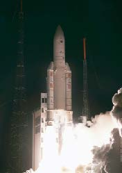
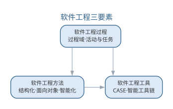
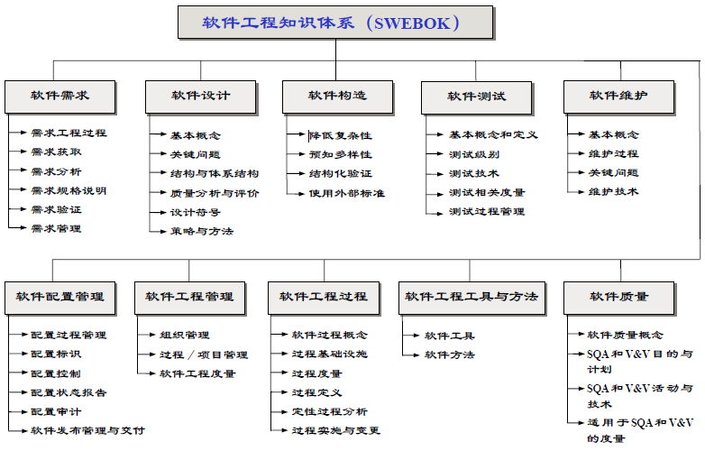
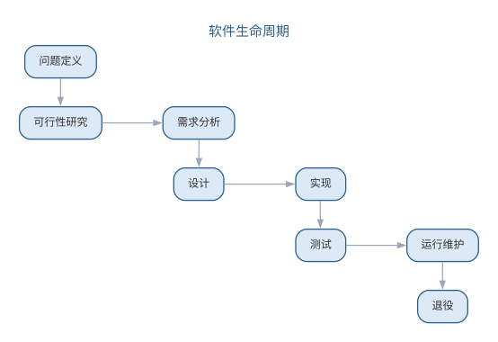
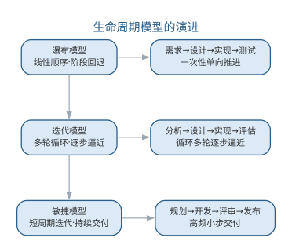
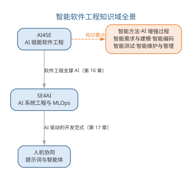
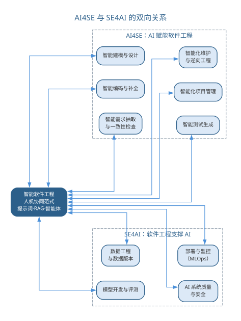
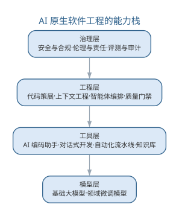

# 软件工程概述

软件工程是一门研究如何系统、规范、定量地开发和维护软件的学科。1968 年，北大西洋公约组织（NATO）在德国加米施召开会议，首次提出"软件危机"与"软件工程"概念，标志着软件生产从个体作坊走向工程化。半个多世纪以来，软件工程的核心问题——如何在成本与进度约束下交付高质量软件——始终未变，而解决这一问题的技术手段则从结构化方法、面向对象方法演进到了今天的智能化方法。

## 软件与软件危机

软件是计算机程序、规程以及运行计算机系统可能需要的相关文档和数据。与硬件不同，软件是逻辑实体，具有抽象性、无磨损性、易复制、易修改等特点，其维护成本往往随使用时间的增长而升高。

软件危机是指 20 世纪 60 年代末在软件开发和维护过程中遇到的一系列严重问题，主要表现如下表所示。

| 表现 | 说明 |
|------|------|
| 成本进度失控 | 软件开发成本和进度难以准确估计，延迟交付甚至取消项目屡见不鲜 |
| 质量难以保证 | 软件存在错误多、性能低、不可靠、不安全等质量问题 |
| 维护十分困难 | 软件维护极其困难，难以适应不断变化的用户需求和使用环境 |

软件危机的根源在于：软件本身固有的复杂性、需求难以表述与确认、开发方式依靠个人经验、缺乏有效的工程管理。应对软件危机，人们提出了工程化的软件生产方式——软件工程。危机的根源与工程化对策可对照如下表所示。

| 危机根源 | 工程化对策 |
|------|------|
| 软件固有复杂性 | 模块化与抽象、体系结构设计 |
| 需求难以表述与确认 | 需求工程、原型验证 |
| 开发方式依赖个人经验 | 标准化方法、规范化过程 |
| 缺乏有效工程管理 | 项目管理、配置管理、质量保证 |

{width=45%}

{width=45%}

## 软件工程的定义与目标

IEEE 将软件工程定义为：应用系统化的、规范的、可度量的方法开发、运行和维护软件的过程。1990 年，IEEE 又将软件工程扩展为三个层次：**软件工程过程**（过程域）、**软件工程方法**（方法学）与**软件工程工具**（工具）的统称，三者合称软件工程的"三要素"。

软件工程追求的目标是：以较低的开发成本、按规定的交付进度、保证软件质量，并努力实现软件的可用性、可靠性、可维护性与可移植性等质量目标。当这些目标发生冲突时，需要依据项目实际进行权衡。常见的目标冲突与权衡取向如下表所示。

| 冲突目标 | 权衡取向 |
|------|------|
| 成本与质量 | 关键系统优先保质量，原型可适当让渡 |
| 进度与功能 | 按优先级裁剪功能，保证核心需求按时交付 |
| 可维护性与性能 | 以性能热点局部优化换取整体可维护 |
| 可移植性与平台特性 | 标准优先，必要时以适配层隔离平台差异 |

软件工程由**过程、方法、工具**三要素构成，三者相互支撑、缺一不可，如图所示。

{width=75%}

三要素中，过程规定"做什么、按什么顺序做"，方法解决"怎么做"，工具则将方法与过程固化、降低执行的代价——智能软件工程正是在三个要素上都引入了 AI 能力。

## 案例：软件危机的历史名案

软件危机不是抽象的概念，而是由一次次真实的失败写就。回顾几起公认的著名案例，可以看清危机的共同根源：**规模失控、接口失配、复用不当与验证不足**。下面几起事故在软件工程教科书中被反复引用。

- **阿里安 5 运载火箭**（1996 年）：首飞约 37 秒后自毁。原因是惯性参考数据在 64 位浮点转 16 位整数时溢出，而这套代码直接沿用了阿里安 4 的成熟软件，未针对新的飞行环境重新验证。一次失败的代价约 3.7 亿美元。
- **Therac-25 放射治疗机**（1985—1987 年）：因并发缺陷（竞态条件）导致过量辐射，先后造成多名患者伤亡。致命之处在于软件缺陷在测试中从未被触发，人工操作检查流程也未兜底。
- **火星气候轨道器**（1999 年）：进入火星大气层前失联。导航团队与制造商分别采用公制与英制单位，接口数据缺乏单位校验，任务以约 1.25 亿美元的代价失败。

| 案例 | 时间 | 失效根源 | 典型教训 |
|------|------|----------|----------|
| 阿里安 5 | 1996 | 数据溢出、复用未重验 | 复用旧代码必须重新验证 |
| Therac-25 | 1985–87 | 并发竞态、验证不足 | 测试要覆盖并发与异常路径 |
| 火星气候轨道器 | 1999 | 接口单位失配 | 接口契约必须显式校验 |

三起事故的共同点十分一致：**不是在单行代码上出错，而是在规模、接口与复用的接缝处出错**。这正是软件工程强调过程、方法与工具的原因——它们把"容易出错的地方"变成"被检查的地方"。

## 案例：IBM System/360 与《人月神话》

20 世纪 60 年代的 IBM System/360 操作系统，是"软件危机"最有名的亲历者。系统规模空前庞大，Frederick Brooks 带领团队以数千人·年的人力投入，仍面临进度延期、缺陷频发的困境。

Brooks 在《人月神话》（1975）中总结的几条论断，后来成为软件工程界的常识：

- **"没有银弹"**：不存在能一举解决软件本质困难的万能工具，软件复杂性不会因一项发明而消失。
- **"向进度落后的项目增加人手，只会让它更落后"**：新增人手需要沟通与培训成本，边际收益递减，这就是"人月"神话的含义。
- **"只靠"人月"无法度量进度**：交互式程序员的进展与纸上进度完全不同步，必须靠真实的里程碑来度量。

| 论断 | 含义 |
|------|------|
| 没有银弹 | 本质复杂性无法消除，只能管理与分解 |
| 人月不是工具 | 人手不可简单叠加，沟通开销线性增长 |
| 里程碑要真实 | 用可验证的产物度量，而不是用投入量 |

《人月神话》把管理者的注意力从"投入多少人力"转向"如何组织与沟通"，是软件工程从直觉走向科学的关键一步。

## 故事：NATO 1968 软件工程会议

"软件工程"这个学科名称，源于 1968 年一次著名的会议。1968 年 10 月，北约（NATO）科学委员会在德国加尔米施召开**第一届软件工程会议**，汇聚美欧的软件开发者与研究者，正视当时日益严重的软件危机。

会议确立了几点共识：

- 软件危机的根源在于**规模失控**与**缺乏工程纪律**，而非个别程序员的水平问题。
- 应当借鉴土木、机械等传统工程学科的经验，用**过程、度量与文档**约束软件开发。
- "软件工程"一词由此提出，寄托了"像工程师一样造软件"的期望。

此后 1969 年又在罗马召开第二次会议，形成延续至今的软件工程研究传统。今天的软件工程教材、课程与职业认证，都可以追溯到这两次会议的讨论。

## 案例：千年虫（Y2K）危机与全球维护

千年虫危机展示了大规模软件维护的威力与代价。早期计算机系统为节省存储，用**两位数字**存放年份，如 1972 记为"72"。2000 年临近时，日期计算跨越世纪将产生错误，影响金融、电力、航空等依赖日期逻辑的行业。

全球软件行业为此展开了一场史无前例的集中维护：

| 阶段 | 主要活动 |
|------|----------|
| 清查 | 审计存量系统，定位所有日期敏感代码 |
| 改造 | 将两位年份扩展为四位，或引入窗口算法 |
| 测试 | 用跨世纪日期批量回放与回归验证 |
| 过渡 | 按行业分批切换，监控异常 |

最终全球投入了数百亿美元的改造成本，2000 年 1 月 1 日平稳度过。这次危机留下两点启示：其一，**遗留系统的维护成本是真实且可观的**；其二，只要治理得当、分阶段推进，大规模软件改造可以成功——这为今天大型系统迁移与智能重构提供了组织范本。

## 样例：软件失效的代价分析

软件工程最经典的经验规律之一，是**缺陷发现得越晚，修复代价越高**。业内广泛引用的相对修复代价统计大致如下（随项目差异浮动，用于说明趋势而非精确数值）。

| 发现阶段 | 相对修复代价（约） |
|----------|-------------------|
| 需求分析 | 1 |
| 设计 | 3~6 |
| 编码 | 10 |
| 测试 | 15~40 |
| 运行与维护 | 30~100 |

也就是说，一个在需求阶段只需几分种就能改掉的小错，拖到系统上线后才被发现，代价可能上升两个数量级——因为此时要改动设计、实现、文档与回归测试，还可能波及线上用户。

这条规律直接导出软件工程的两条基本策略：

- **质量门禁前移**：在需求、设计阶段就引入检查与评审，把缺陷挡在源头。
- **验证优先**：AI 时代更是如此——自动生成的代码、需求条目与测试用例，只有经过检查与确认才能进入下一环节。

## 讨论：软件危机的新形态

半个世纪过去，软件危机并没有消失，而是以新的形态延续。今天面临的典型挑战包括：

- **安全漏洞与供应链攻击**：软件依赖众多开源组件，一个组件的漏洞可能沿依赖链扩散。
- **云上规模故障**：大规模分布式系统的一个配置错误，可能在几分钟内影响全球用户。
- **AI 幻觉与自动化风险**：大模型生成的代码与结论可能看似正确实则错误，需要新的验证手段。
- **维护债务与技术债**：系统越建越多，无人理解的代码与文档成为新的"维护危机"。

| 传统危机 | 新形态危机 |
|----------|-----------|
| 进度失控 | 供应链安全 |
| 质量难保 | AI 幻觉与自动化错误 |
| 维护困难 | 技术债与系统熵增 |

新的工具让软件工程更强大，但"验证优先、早发现早修复"的纪律从未过时。智能软件工程正是把 AI 作为"更强的工具"，同时把人推到"更关键的把关者"位置——这也将是全书反复出现的主题。

## SWEBOK 与知识体系

SWEBOK（软件工程知识体系）由 IEEE 计算机学会提出，是软件工程学科的知识框架。它把软件工程知识划分为软件需求、软件设计、软件构造、软件测试、软件维护、软件配置管理、软件工程管理、软件工程过程、软件工程工具与方法、软件质量等若干知识域。SWEBOK 不仅作为软件工程专业课程与教材的纲领，也成为企业软件工程能力评估与人才培养的参照。SWEBOK 各知识域与本书章节的对应关系如下表所示。

| SWEBOK 知识域 | 本书章节 |
|------|------|
| 软件需求 | 第 4 章 |
| 软件设计 | 第 5~7 章 |
| 软件构造 | 第 8~9 章 |
| 软件测试 | 第 10 章 |
| 软件维护 | 第 11 章 |
| 软件配置管理 | 第 13 章 |
| 软件工程管理 | 第 13 章 |
| 软件工程过程 | 第 3 章 |
| 软件工程工具与方法 | 第 2、14 章 |
| 软件质量 | 第 12 章 |

{width=60%}

## 软件生命周期

软件生命周期是指软件从提出、开发、运行维护直至退役的全过程，一般划分为**问题定义、可行性研究、需求分析、设计、实现、测试、运行维护**等阶段。生命周期阶段划分的依据是软件工程活动的内在逻辑——先弄清"做什么"（需求），再决定"怎么做"（设计），进而"做出来"（实现），最后"验证与维护"。

生命周期模型决定了阶段间的组织方式，如瀑布模型的线性顺序、迭代模型的反复循环。各阶段的主要活动与产物可归纳如下表所示。

| 阶段 | 主要活动 | 主要产物 |
|------|------|------|
| 问题定义 | 明确要解决的问题与目标 | 问题定义报告 |
| 可行性研究 | 技术、经济与法律可行性分析 | 可行性研究报告 |
| 需求分析 | 确定系统的功能与性能要求 | 需求规格说明 |
| 设计 | 体系结构与详细设计 | 设计文档 |
| 实现 | 编写与调试源代码 | 源程序 |
| 测试 | 验证与确认系统行为 | 测试报告 |
| 运行维护 | 纠错、适应与完善 | 维护记录与新版本 |
| 退役 | 系统下线与数据迁移 | 退役评估 |

生命周期各阶段的顺序与衔接如图所示。

{width=70%}

阶段划分体现"先弄清做什么、再决定怎么做、最后做出来并验证"的内在逻辑，后文第 3 章将详细讨论各类过程模型。生命周期模型本身也在演进：从瀑布模型的线性单向推进，到迭代模型的多轮循环，再到敏捷模型的高频小步交付，演进的方向是让"反馈"更早、更频繁，如图所示。

{width=65%}

三种模型对"阶段如何组织"给出不同答案——瀑布重计划与控制，迭代重风险规避，敏捷重响应变化，取舍依据需求明确度与风险水平。

## 智能软件工程引论

以深度学习为代表的人工智能技术正在深刻改变软件工程。一方面，**AI 赋能软件工程**：大语言模型（LLM）可作为编码助手、测试生成器、缺陷定位器与需求分析工具，辅助乃至部分替代人类工程师完成机械性工作；另一方面，**软件工程支撑 AI**：AI 系统的训练数据、模型结构、评测流程同样需要工程化方法加以规范，由此产生了 MLOps、模型版本管理、提示词工程等新实践。

智能软件工程由此定义为：将人工智能技术系统化地应用于软件开发的各项活动中，并借鉴其能力重新组织软件过程，从而提升软件开发的效率、质量与适应性。需要强调的是，智能软件工程遵循的是**智能增强**（augmented intelligence）而非完全自动化的范式——AI 负责起草与辅助，人始终是最终责任人与决策者。这一"AI4SE × SE4AI"的双向关系，构成了智能软件工程知识体系的骨架。

### 知识域地图

围绕"AI4SE × SE4AI × 人机协同"三个维度，可以勾勒出智能软件工程的知识域地图。

**AI4SE 维度**：人工智能介入软件生命周期的每一环节，形成与全书各章对应的智能化知识域——

| 软件工程环节 | 智能化知识域 | 对应章节 |
|------|------|------|
| 软件开发方法 | 智能化开发方法（模型为中心、人机结对） | 第 2 章 |
| 软件过程 | AI 增强过程、质量门禁前移 | 第 3 章 |
| 需求工程 | 智能需求抽取、需求一致性检查 | 第 4 章 |
| 建模与设计 | AI 辅助建模、智能设计 | 第 5~7 章 |
| 软件实现 | 智能编码（代码生成、补全、重构） | 第 8~9 章 |
| 软件测试 | 智能测试（用例生成、缺陷定位） | 第 10 章 |
| 演化与维护 | 智能维护（逆向文档、缺陷预测） | 第 11 章 |
| 项目管理 | 智能估算、风险预测、配置管理 | 第 13 章 |

**SE4AI 维度**：把 AI 系统本身当作软件工程的对象，形成数据工程、模型开发与评测、部署与监控（MLOps）、AI 系统质量与安全、负责任 AI 等知识域——将在第 16 章系统讨论。

**人机协同维度**：提示词工程、上下文工程（RAG）、LLM 智能体与多智能体协作、以及人在回路的协作范式——将在第 17 章系统讨论。

三个维度与全书各章的对应关系如图所示。

{width=65%}

软件工程知识体系（SWEBOK）v4.0 已把 AI/ML 视为新兴领域融入各知识域，并新增软件架构、软件安全、软件工程运营等知识域，传统软件工程与智能软件工程的边界正在消融。本书由此组织为十九章：第一至十五章以软件生命周期为主线，阐述传统方法与各环节的智能化演进；第十六、十七章分别从"软件工程支撑 AI"与"AI 驱动的开发范式"两个方向承前启后，第十八、十九章以"大模型应用开发范式"与"智能体系统工程与智能软件工程展望"收束全书，帮助读者建立"从传统到智能"的完整图景。

### AI4SE：AI 赋能软件开发的具体活动

把 AI4SE 落到实处，需要回答"AI 在哪个环节、承担什么活动、带来什么收益、人守住哪个关口"。下表以软件生命周期为线索，给出 AI4SE 一侧各环节的具体实践对照。

| 生命周期环节 | AI 承担的具体活动 | 代表工具/平台 | 预期收益 | 人在回路的把关点 |
|------|------|------|------|------|
| 需求分析 | 从会议、访谈记录抽取需求条目，生成用例草案 | 对话式需求助手 | 需求获取提速、减少遗漏 | 需求含义、范围与优先级由人确认 |
| 软件设计 | 生成类图与候选方案，对照设计原则给出建议 | 建模助手、编码助手 | 方案生成提速、约束落地 | 体系结构决策由人拍板 |
| 软件编码 | 代码生成、补全、重构与注释 | GitHub Copilot、Cursor、Claude Code | 常规编码效率大幅提升 | 高风险模块逐行审查 |
| 软件测试 | 生成测试用例、定位失败用例的缺陷 | 智能测试工具 | 用例覆盖快速扩大 | 测试预言与断言由人把关 |
| 运行维护 | 生成变更说明、影响分析与缺陷定位 | 对话式助手 | 维护文档成本下降 | 变更影响结论由人确认 |
| 项目管理 | 生成进度报告、风险提示与会议纪要 | AI 助手 | 事务性工作减轻 | 决策与资源分配由人负责 |

各环节的 AI 活动都遵循同一原则——**验证优先**：AI 产出的任何中间结果（需求条目、方案、代码、测试）都必须经过检查与确认才能进入下一环节，这一原则在后续各章将反复出现。针对任一环节的智能增强方案，可以用下面这条模板快速生成：

```text
你是软件工程顾问。请针对下列环节输出智能增强方案：
- 环节：需求分析
- 输入素材：{一段客户访谈记录或需求描述}
请输出：1) 可提取的需求条目清单；2) 每条的优先级建议与理由；
3) 该环节人必须保留的判断点；4) 一个可立即验证的验收检查项。
```

工具选型的要点是"按任务分型、先试点后铺开"：补全型助手适合高频低风险的常规编码，对话式工具适合多文件修改与方案探讨，自动化代理则用于端到端任务，但输出必须经过严格验证。团队应先在小范围试点并跟踪采纳率，再决定推广范围，避免工具堆砌。

同样值得注意的是，AI4SE 各环节的收益并不均等：编码补全、测试用例生成等高频低风险的活动收益最明显，而需求理解、体系结构决策等低频高风险的活动仍高度依赖人。团队宜优先选择高频低风险的环节切入，把 AI 收益先做出来，再逐步向高风险环节渗透。

### SE4AI：把软件工程纪律应用到 AI 系统

SE4AI 一侧回答"AI 系统如何被当作工程对象对待"。数据、模型、评测与部署若不纳入工程纪律，就会退化为依赖个人经验的作坊式开发。下表给出 SE4AI 各工程活动的细化对照。

| 工程活动 | 具体内容 | 对应传统活动 | 意义 |
|------|------|------|------|
| 数据工程 | 数据采集、清洗、标注与版本管理 | 需求与配置管理 | 保证训练数据的质量与可追溯 |
| 模型开发 | 模型选型、训练、调优与版本管理 | 设计与实现 | 让模型演进可复现、可回滚 |
| 评测与验证 | 评测集构建、指标评估与回归 | 测试与验收 | 量化能力边界、防止能力退化 |
| 部署与监控 | 模型上线、监控与持续再训练（MLOps） | 运行与维护 | 保证线上行为稳定可观测 |
| 安全与治理 | 偏见、安全、合规与责任审计 | 质量保证 | 让 AI 系统可信、可负责 |

SE4AI 的完整工程体系将在第 16 章系统展开，第 18 章将从大模型应用开发的角度深化其中的评测与治理。

AI4SE 与 SE4AI 并非两条平行线，而是相互促进：工程化的评测与治理让模型更可靠，可靠的模型又反过来让 AI 增强的开发活动更有价值。这种双向强化正是智能软件工程区别于"AI 工具简单叠加"的本质所在。

### 智能软件工程能力图谱

智能软件工程对工程师的能力要求与传统有所偏移：编程语言的熟练度让位于"定义、编排、审查与治理"四类能力。能力图谱与知识域地图一一对应，说明智能软件工程并非新的知识堆砌，而是对既有工程能力的智能化重构。核心能力维度如下表所示。

| 能力维度 | 核心能力要求 | 对应主题 |
|------|------|------|
| 需求与规格 | 把意图写成可校验的规格（接口、测试、不变量） | 第 4、12 章 |
| 模型与提示词 | 提示词设计、模型选型与上下文组织 | 第 17、18 章 |
| 代码策展 | 阅读、评估与整合 AI 生成的代码 | 第 9 章 |
| 评测与验证 | 评测集构建、验证优先的工程纪律 | 第 10、18 章 |
| 智能体编排 | 任务分解、工具调用与多智能体协作 | 第 17、19 章 |
| 治理与伦理 | 安全、合规、责任边界与伦理判断 | 第 15、19 章 |

### 全书路线图

本书以"从传统到智能"为主线组织。第一至十五章以软件生命周期为纲，在阐述传统方法后给出对应环节的智能化演进；第十六章（AI 系统工程）把工程纪律应用到 AI 系统本身，第十七章（智能体与提示词）讨论 AI 驱动的开发范式。在此基础上，本书进一步扩展两章收束全书：第十八章"大模型应用开发范式"把提示词与上下文工程推进到 LLM 应用工程——架构模式、RAG、评测与成本治理；第十九章"智能体系统工程与智能软件工程展望"从智能体工程架构走向多智能体协作与组织效能。后四章智能内容之间亦有分工：第十六章聚焦 AI 系统工程、第十七章聚焦提示词与智能体概念，第十八章深入 LLM 应用工程化，第十九章则把智能体推进到组织级系统并收束全书。前十五章覆盖 AI4SE 的知识域，后四章覆盖 SE4AI 与人机协同维度，最终回到全书信念——AI 增强能力，人承担判断与责任。

阅读建议：基础较好的读者可按序通读，建立完整图景；工程实践者可在第一、二章建立框架后，直接跳到对应环节的章节，再回到第十六至十九章理解智能侧的工程全貌。

### 智能软件工程与传统软件工程的对照

智能软件工程并非凭空产生，而是在传统软件工程的基础上引入 AI 能力而形成的新形态。二者的核心差异并不在于某一项具体技术，而在于角色分工与质量保障方式的变化，对照如下表所示。

| 维度 | 传统软件工程 | 智能软件工程 |
|------|------|------|
| 主要产出 | 人类编写的代码与文档 | 人机协作生成，AI 起草、人验证 |
| 质量保障 | 靠规范与阶段评审 | 质量门禁前移，验证仍是底线 |
| 角色分工 | 工程师执行开发活动 | 工程师定义目标、审查验证（代码策展） |
| 需求来源 | 面谈与文档显式获取 | 从会议、访谈自动抽取并人工确认 |
| 测试方式 | 手工设计用例 | AI 生成用例，预言问题需专门解决 |
| 维护对象 | 代码与文档 | 代码、文档、数据与模型 |

AI4SE 与 SE4AI 构成智能软件工程的两翼：前者把 AI 能力注入软件开发各环节，后者把软件工程纪律应用到 AI 系统本身。二者的双向关系如图所示。

{width=55%}

需要强调的是，双向流动中"人"始终是枢纽——AI 让软件工程更高效，软件工程让 AI 系统更可靠，而判断与责任始终由人承担，这正是本书反复强调的智能增强范式。

### 前沿演进：AI 原生软件工程

AI 原生软件工程（AI-native software engineering）把大模型能力作为软件开发的基础设施，贯穿需求、设计、编码、测试、运维与治理全流程，形成与传统软件工程不同的能力栈。它不是"用 AI 工具辅助"，而是"按 AI 能力重构工程组织方式"——工程师的核心技能从语言与框架细节转向规格定义、上下文组织与结果审查。AI 原生能力栈的分层如下表所示。

| 层次 | 核心能力 | 工程体现 |
|------|------|------|
| 模型层 | 基础模型与领域微调 | 模型选型、评测与版本管理 |
| 工具层 | 编码助手、对话式开发 | 上下文工程、提示词库 |
| 工程层 | 策展、审查、智能体编排 | 质量门禁、代码评审 |
| 治理层 | 安全、合规、伦理、审计 | 评测体系、责任边界 |

AI 原生软件工程的能力栈——从模型到治理四个层次——如图所示。

{width=60%}

AI 原生并不否定传统工程纪律，而是把纪律的执行从"人工记忆"迁移到"工具与流程固化"——这也意味着对工程师的素质要求从"写得对"转向"看得懂、评得准、编得顺"。

## 本章小结

软件工程以系统化、规范化、可度量的方法开发与维护软件，过程、方法、工具三要素共同支撑质量、成本与进度的权衡。软件危机催生工程化，智能时代则把 AI 引入三要素，形成智能软件工程：AI4SE 让 AI 赋能生命周期各环节，SE4AI 把工程纪律应用到 AI 系统本身，人机协同与验证优先贯穿始终。智能软件工程是对传统能力的智能化重构，本书以"从传统到智能"为主线，后续各章将逐一深入各环节的智能化实践。

**思考与讨论：**
1. 以你正在进行的项目为例，指出至少三处 AI4SE 可以介入的环节，并说明人应保留哪些判断。
2. 对照智能软件工程能力图谱，你最需要补强的是哪个维度？为什么？
3. 为什么说"验证优先"是智能软件工程不可动摇的质量底线？
