# 软件开发方法与软件过程

软件开发方法与软件过程是软件开发工作的两面：**方法**回答"怎么做"，决定用什么原则、技术与表示法理解问题、表达设计、组织代码；**过程**回答"按什么步骤做"，规定软件从无到有再到退役要经历哪些活动、由谁执行、产出什么、如何保证做对。方法为过程提供具体的做法，过程为方法提供承载与推进的框架，二者互补而不可分离。本章先讲方法——从结构化、面向对象，到组件与服务、敏捷，再到智能化开发，看方法如何围绕控制复杂性持续演进；再讲过程——从过程的活动与框架出发，审视瀑布、原型、增量、螺旋等经典模型与统一过程，最后考察 AI 时代的软件过程如何以更细的粒度、更早的确认重组开发活动。

## 面向过程方法

面向过程方法（结构化方法）以数据流分析为核心，把系统分解为一系列功能模块，强调"自顶向下、逐步求精"。其代表技术包括数据流图（DFD）、结构化英语（PDL）、数据字典等。结构化方法在问题规模有限、功能相对稳定时十分有效，但当需求频繁变化、系统规模庞大时，功能分解难以抵御变更的冲击——一处修改往往波及其他模块。其主要技术工具如下表所示。

| 技术 | 作用 |
|------|------|
| 数据流图（DFD） | 描述系统的数据流向与加工逻辑 |
| 结构化英语（PDL） | 用受限自然语言描述处理过程 |
| 数据字典 | 统一术语，定义数据元素与存储 |

面向过程方法自顶向下把系统分解为功能模块，分解结构如图所示。

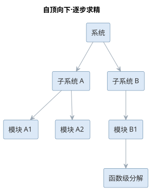{width=55%}

分解一直进行到易于实现的函数级，体现了"自顶向下、逐步求精"的核心思想。

## 面向对象方法

面向对象方法将现实世界中的实体抽象为**对象**。对象具有属性（描述状态的数据）和服务（描述行为的方法），二者封装在一起；对同一类对象的抽象形成**类**。对象之间通过**消息**进行交互，即一个对象请求另一个对象执行其服务。

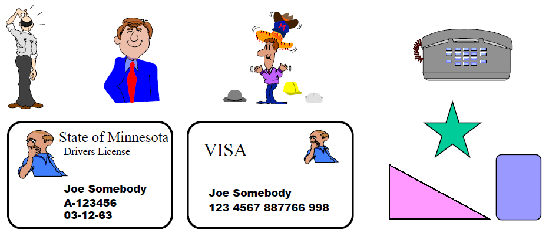{width=45%}

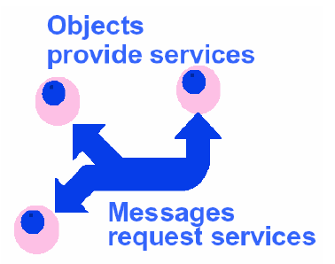{width=45%}

面向对象方法建立在四条基本原则上：

- **封装**：隐藏对象内部实现，仅对外暴露接口，其核心是可见性控制（公有、保护、私有）；
- **继承**：子类自动拥有父类的属性与服务，可在此基础上扩展或改写，支持代码复用与概念分层；
- **多态性**：不同对象对同一消息可作出不同响应，使程序可以一致地处理异质对象；
- **联系**：对象之间存在分类、组成、实例化与消息连接等关联，构成系统的静态与动态结构。

  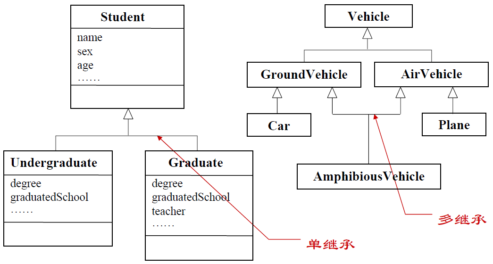{width=50%}

与之配套的还有两种重要概念：**接口**与**抽象类**。接口只声明方法契约不提供实现，抽象类则允许部分方法有默认实现，二者都是实现多态与解耦的手段。

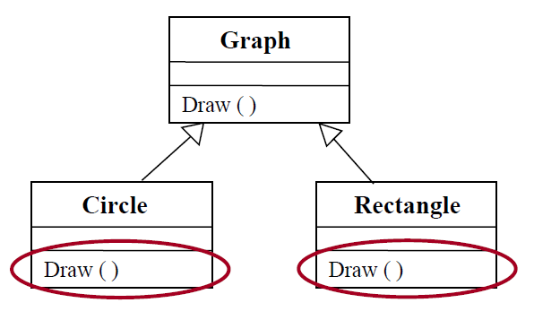{width=50%}

面向对象方法贯穿分析（OOA）、设计（OOD）、编程（OOP）、测试（OOT）与维护（OOM）的全过程，其最大优势是**以问题域的结构组织解空间**，使系统在需求变化时具有良好的稳定性。支撑这一优势的工具是模型——用数学模型描述严格约束，用描述模型表达文字说明，用图形模型直观呈现结构，本书第 3、4 章将展开讨论 UML 与面向对象分析。四条基本原则的内涵与作用可对照如下表所示。

| 原则 | 内涵 | 作用 |
|------|------|------|
| 封装 | 数据与行为捆绑、隐藏内部实现 | 可见性控制，降低耦合 |
| 继承 | 子类复用父类、扩展或改写 | 代码复用与概念分层 |
| 多态 | 同一消息、不同对象不同响应 | 一致地处理异质对象 |
| 联系 | 分类、组成、实例化与消息连接 | 构成系统静态与动态结构 |

四原则共同支撑面向对象方法，其关系如图所示。

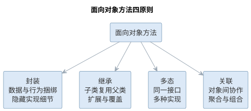{width=90%}

## 样例：过程化与面向对象的实现对比

同一项需求，用**过程化方法**与**面向对象方法**各写一遍，两种方法学的差异便一目了然。以图书借阅系统的"借阅记录"为例：一条记录保存借书人、图书与应还日期，业务上需要判断是否到期、支持续借。

过程化的写法先把记录定义为结构体，再把操作实现为操作该结构体的全局函数：

```text
// 过程化：数据与操作分离
struct LoanRecord {
    string borrower;  // 借书人
    string book;      // 图书
    Date   dueDate;   // 应还日期
};

bool isOverdue(LoanRecord r, Date today);  // 到期判断，函数要"记住"结构体的细节
void renew(LoanRecord r, int days);         // 续借，同样由外部函数处理
```

面向对象的写法把数据与操作一起封装进类，记录自己"知道"如何判断到期、如何续借：

```text
// 面向对象：数据与操作封装
class LoanRecord {
    private string borrower;
    private string book;
    private Date   dueDate;
    bool isOverdue(Date today);  // 自己判断到期
    void renew(int days);        // 自己续借
};
```

两相对照，差异清晰：

| 维度 | 过程化写法 | 面向对象写法 |
|------|-----------|-------------|
| 数据与操作 | 结构体与全局函数彼此分离 | 字段与方法封装成类 |
| 职责归属 | 函数各自为政，需调用者统筹 | 行为归属数据自身，调用者只发消息 |
| 扩展性 | 新增一种记录类型，需逐一修改各处函数 | 新增子类即可扩展，改动集中在继承处 |

过程化的写法让数据与操作割裂，函数增多、参数变长后，维护者难以判断一次修改会影响谁；面向对象则把"该做什么"归属到对象自身，结构随问题域自然生长，扩展只需在类体系中增量调整。**封装与职责归属，正是两种方法最直观的分水岭**。

## 故事：Dijkstra 与 GOTO 之争

**1968 年，Dijkstra 在《Communications of the ACM》上发表短评《Go To 语句是有害的》**，由此点燃了结构化编程运动。彼时程序员依赖 goto 在程序里随意跳转，控制流交织如乱麻，一处跳转的后果往往要到数月后维护时才显现。Dijkstra 的主张是：程序应只用顺序、选择与循环三种基本结构组织控制流，使逻辑"自上而下、一目了然"。

- **背景**：goto 让控制流任意穿插，程序的可读性与可证明性都难以保证；
- **主张**：用结构化控制结构取代 goto，使控制流可预测、可验证；
- **影响**：催生了结构化编程与逐步求精，直接塑造了本章的面向过程方法。

这一论断的本意并非"禁止 goto"，而是**把可读性与结构化控制流置于优先**。后来的反思同样重要：在循环提前退出、分层返回与异常处理等场景，适度使用受限跳转（如 break、continue）反而更清晰——争论留给后人的遗产不是"永不用 goto"，而是"控制流必须可读、可审计"。

## 案例：方法学错用的代价

方法学没有绝对优劣，关键是**要匹配问题形态**。这里讲一个典型的示意性案例：某团队习惯用过程化思维开发，接到一个以界面事件驱动的图形应用（用户点击按钮、拖动窗口、数据实时刷新）后，仍按"功能模块与全局数据"的老路子组织代码。

- **症状**：界面每个回调都直接读写一批全局状态，事件到来时状态在多个函数间传递，稍不留神便出现状态错乱；
- **根源**：事件驱动系统本质上是"状态随事件迁移"，而过程化结构按功能切分，把天然属于同一状态的变化拆散到各处；
- **代价**：新增一个界面控件要改动散落各处的函数，回归缺陷反复出现，维护成本随界面复杂程度急剧上升，最终被迫重写。

重写时改用**面向对象的事件处理模型**（把界面元素抽象为对象，各自维护状态、响应消息），状态管理清晰，改动收敛在对象内部。这个典型案例的教训是：方法的选择取决于问题形态——**数据由谁共享、状态如何变化、谁来响应事件**，决定了哪种方法能够与之匹配。方法本身无所谓优劣，用错了位置才会付出代价。

## 样例：面向对象思想的日常类比

面向对象"属性、行为与封装"的三元结构并不神秘，它是对现实世界组织方式的直接模仿。以生活中熟悉的实体作类比，直觉便自然建立起来。

| 现实实体 | 属性（数据） | 行为（方法） | 封装（对外暴露） |
|---------|------------|------------|-----------------|
| 银行账户 | 户名、余额 | 存款、取款、查询余额 | 余额只经方法变动，不允许直接修改 |
| 点餐订单 | 菜品、数量、状态 | 加菜、结账、取消 | 金额计算藏在内部，外界只点"结账" |
| 洗衣机 | 水位、运行阶段 | 启动、暂停、排水 | 内部机件不可见，只需一个"开始"按钮 |

三个类比指向同一个道理：**对象把数据与操作它的行为打包在一起，并隐藏内部细节、只暴露接口**。点餐时不会去改厨师手边的账本，而只是递上订单——对象世界亦然，外界通过消息请求对象做事，对象自己决定如何完成。带着这份直觉再看面向对象方法的封装、消息与类，就有了现实生活的锚点。

## 案例：方法演进的启示

纵观软件开发方法的演进——从过程化到面向对象，再到组件与服务——其动力始终是**复用粒度与变化应对**。每一次跃迁，都是把"可复用、可更换"的单元放大一级，把"应对变化"的边界前移一步。

| 方法 | 核心思想 | 解决什么问题 |
|------|---------|-------------|
| 过程化方法 | 自顶向下功能分解 | 问题规模大时如何拆解与组织 |
| 面向对象方法 | 对象封装属性与行为 | 需求变化时如何隔离改动、支持复用 |
| 组件方法 | 二进制级组装与替换 | 重复开发、系统难以组装 |
| 服务方法 | 网络契约、松耦合集成 | 跨系统、跨语言如何集成复用 |

演进脉络给今天的启示有三：其一，**复用粒度越来越大**——从函数、类到组件、服务，复用的对象从代码片段扩展为完整能力；其二，**变化被越来越早地隔离**——封装与接口契约把"可能变化的地方"挡在边界之后；其三，**智能化方法并未改变这条主线**——它只是把既有纪律以更低成本落实。理解了这条脉络，就能明白为何新方法不断出现，而过程化与面向对象的基础地位始终稳固：它们是后续一切方法的地基。

## 基于组件与服务方法

**基于组件的方法**将软件系统构造为若干可独立开发、组装与替换的组件，强调二进制级复用，通过标准化的组件模型（如 JavaBeans、.NET 组件）提高生产效率。**面向服务的方法**则将系统能力封装为通过网络访问的服务，以服务契约、服务编排为核心，支持松耦合的分布式系统集成。这两种方法都以"复用"为宗旨，是解决软件危机中重复开发问题的有力手段。两种方法的关系如图所示。

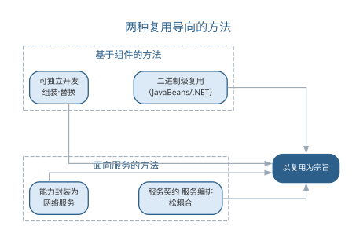{width=70%}

两者都服务于复用，但层次不同：组件以二进制形式在同一程序内直接复用，服务则通过网络契约实现跨系统、跨语言的复用。两种方法的具体差异可对照如下表所示。

| 维度 | 组件 | 服务 |
|------|------|------|
| 复用层次 | 二进制级、同一程序内 | 网络级、跨系统跨语言 |
| 耦合方式 | 编译时/加载时组装 | 运行时接口契约 |
| 通信机制 | 直接调用 | 网络协议（REST 等） |
| 独立部署 | 随宿主程序发布 | 独立部署、独立扩展 |

## 敏捷方法

敏捷方法诞生于对重型文档化过程的反思。敏捷宣言强调"个体与交互胜过过程与工具、可工作的软件胜过详尽的文档、客户合作胜过合同谈判、响应变化胜过遵循计划"。敏捷方法采用短周期迭代、持续交付可运行软件、每日站会沟通进度、邀请客户全程参与，从而在需求高度不确定的项目中快速适应变化。常见的敏捷实践包括极限编程（XP）、Scrum 等，其对比如下表所示。

| 敏捷实践 | 核心做法 |
|------|------|
| 极限编程（XP） | 结对编程、测试先行、持续集成、小步发布 |
| Scrum | 固定短冲刺、每日站会、冲刺评审与回顾 |
| 看板 | 可视化工作流、限制在制品数量、持续交付 |

敏捷方法以短周期迭代循环推进，每一次循环都交付可运行的软件，如图所示。

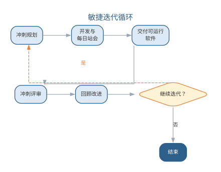{width=70%}

迭代循环让团队在需求高度不确定的项目中快速适应变化，也把反馈周期压缩到最短。

## 智能化开发方法

智能时代的开发方法呈现两个新方向。其一，**以模型为中心**：在提示词工程、微调与 RAG（检索增强生成）等技术支持下，工程师用自然语言描述需求，由大语言模型生成代码骨架与测试，人类专注于架构决策与审查把关，开发活动从"逐行编码"转向"描述—审查—修正"的循环。其二，**人机结对**：AI 充当结对编程伙伴，实时补全、重构建议与缺陷提示使得单人即可完成以往团队的工作。智能化方法并未取代传统方法学，而是把面向对象等方法的规范约束以更低的成本落地——例如 AI 依据 SOLID 原则给出重构建议，依据统一建模语言的语义生成类图与代码。

选择方法时应基于问题特征：规模小且稳定可用结构化方法，需求多变宜选敏捷，强调复用可选组件与服务方法，而把智能化工具作为贯穿各方法的生产力杠杆。

智能化方法内部也在快速演进，大致沿着"提示词辅助—检索增强—模型微调—智能体编排"的路径深化：初期用精心构造的提示词让通用模型完成单点任务；当需要注入私有知识时引入检索增强生成（RAG），让模型基于检索到的规范与历史代码作答；当领域任务高度固定时通过微调让模型行为贴近团队偏好；最终由智能体把多项能力编排成端到端流程。这一演进意味着，方法的选择不再是"要不要智能化"的二元判断，而是"在何种深度上引入智能"的连续决策——团队应依据任务性质、数据可得性与风险容忍度选择切入点。

智能化开发方法的演进路径如图所示。

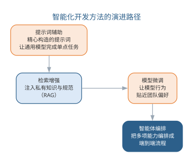{width=65%}

不同智能化深度的能力边界与适用场景可对照如下表所示。

| 智能化深度 | 做法 | 能力边界 | 适用场景 |
|------|------|------|------|
| 提示词辅助 | 精心构造提示词 | 通用模型、单点任务 | 代码补全、简单问答 |
| 检索增强 | 注入私有知识 | 受检索质量限制 | 企业知识库、规范问答 |
| 模型微调 | 领域数据调优 | 需标注数据与训练 | 领域任务高度固定 |
| 智能体编排 | 多工具端到端执行 | 需验证与治理 | 跨步骤的复杂任务 |

无论智能化深度如何，传统方法学的约束都不应被绕过：结构化方法的模块分解、面向对象方法的封装与可见性控制、组件方法的接口契约、敏捷方法的迭代与反馈，都为 AI 生成结果提供了可供校验的骨架。实践中的常见误区是把 AI 当作"无需规范的黑盒"——恰恰相反，方法学越严谨，AI 的产出越可被审查、越稳定。智能化方法的真正价值，是让这些纪律以更低的执行成本贯穿日常开发。

### AI 在经典方法中的角色矩阵

智能化方法并非取代经典方法，而是为每种经典方法配备不同的 AI 角色。下表给出 AI 在结构化、面向对象、组件与服务、敏捷四类方法中的角色矩阵——AI 承担什么、产出什么、人保留什么。

| 经典方法 | AI 承担的角色 | AI 的典型产出 | 人保留的把关 |
|------|------|------|------|
| 结构化方法 | 功能分解与模块生成助手 | 按分解层次生成模块实现、梳理数据流 | 分解层次与模块边界由人确定 |
| 面向对象方法 | 类骨架生成器、重构顾问 | 类骨架、类图草案、SOLID 重构建议 | 类职责、可见性与接口契约由人确定 |
| 组件与服务方法 | 契约与桩代码生成器 | 接口契约、桩与存根、服务编排草案 | 契约语义与边界由人审核 |
| 敏捷方法 | 需求拆解与测试伙伴 | 用户故事拆分、测试用例、回顾摘要 | 验收标准与迭代目标由人确认 |

角色矩阵揭示了一个共性：AI 在每种方法中都承担"起草与执行"的部分，而"定义与把关"始终留给工程师——这与第 1 章确立的智能增强立场一致。角色矩阵同时表明，方法学的严谨程度决定 AI 产出的可审查性：结构化方法把分解层次写清楚，AI 生成模块时才有边界可循；面向对象方法把接口与可见性约定好，AI 生成的代码才经得起封装检查；敏捷方法把验收标准定义具体，AI 生成的测试才有明确的预言。方法学不是智能化的障碍，而是 AI 可靠性的脚手架。

### 智能开发方法的实践流程与局限

智能开发方法落地可循一条五步实践流程：其一，**定约束**——把方法学约束（SOLID、封装可见性、命名规范、单入口单出口等）写入项目约定与提示词；其二，**备上下文**——建立检索知识库，纳入架构文档、规范与代表性代码；其三，**生成与自检**——按提示词生成代码与测试，要求 AI 对照约束自检；其四，**验证与审查**——运行静态检查与测试，对高风险改动人工逐行审查；其五，**度量与改进**——跟踪采纳率、缺陷率与返工率，回填提示词与治理策略。五步从定约束到度量改进构成闭环，让智能开发从个人技巧沉淀为团队纪律。

智能开发方法并非没有边界，常见的局限与失败模式如下表所示。

| 局限/失败模式 | 典型表现 | 应对要点 |
|------|------|------|
| 幻觉与依赖虚构 | 生成不存在的 API、依赖或配置 | 以编译与运行验证为准入门槛，人工核对依赖 |
| 全局一致性缺失 | 跨文件重构遗漏调用点、接口不一致 | 逐文件评审并跑全量测试，必要时交给智能体编排 |
| 规范约束漂移 | 生成结果逐渐偏离项目规范 | 约束写入提示词与门禁，静态检查兜底 |
| 验证成本转移 | 生成提速而测试、评审成为新瓶颈 | 以验证优先原则平衡生成与审查投入 |

认识这些失败模式的价值在于把"防御"前置：把编译、测试与静态检查设为 AI 产出的准入门槛，把高风险模块标记为"禁止 AI 直接合并"，把提示词与门禁规则纳入版本管理。如此，智能开发方法的效率优势才不会被隐藏的失败代价抵消——这正是"验证优先"在方法层面的落地。实践流程与局限并存的启示是：智能化方法的效果不取决于模型单点能力，而取决于团队对约束、上下文与验证的组织——方法学越严谨，AI 的产出越稳定、越可被审查，这也是下一节工程实践要解决的问题。方法的选择由此回到问题特征本身：需求明确度、变更频率与团队能力共同决定在哪一深度引入智能，而非盲目追求最新工具。

## 智能化开发方法的工程实践

智能化开发方法落地的载体是各类 AI 开发工具。**AI 编码助手**（如 GitHub Copilot、Cursor）内嵌于编辑器，在光标处提供补全、函数生成与重构建议，是"人机结对"最直接的形式；**对话式编程**（如 Codex、Claude Code）允许工程师以自然语言描述任务，由模型执行多步操作并返回结果，把"描述—审查—修正"循环推进到终端；**智能规划工具**进一步把需求拆解为可执行的任务清单。落地的实践要点如下：

- **把方法学写进提示词**：将 SOLID 原则、封装可见性、命名规范与单元测试要求写入项目约定或系统提示词，让 AI 的产出从一开始就符合方法学约束；
- **建立审查节奏**：AI 生成的内容以"提交—自动检查—人工评审—合并"的节奏进入基线，避免长周期无人过目的自动生成；
- **为 AI 准备上下文**：把架构文档、编码规范与代表性代码片段纳入检索知识库，使补全与生成贴合项目实际。

传统方法与智能增强方法可以在同一项目中共存，二者的分工如下表所示。

| 方法 | 开发方式 | 人机分工 | 适用场景 |
|------|------|------|------|
| 结构化方法 | 自顶向下功能分解 | 人定分解层次，AI 生成模块实现 | 功能稳定、边界清晰 |
| 面向对象方法 | 对象与类组织系统 | 人定类职责，AI 生成代码骨架 | 业务逻辑复杂、需复用 |
| 敏捷方法 | 短迭代、持续交付 | 人做需求与验收，AI 加速迭代 | 需求多变、快速反馈 |
| 智能增强方法 | 描述—审查—修正 | AI 起草，人负责判断与验证 | 贯穿上述各方法 |

值得注意的是，无论方法如何演进，"验证"始终是智能化开发的质量瓶颈——AI 起草得再快，也必须经过静态检查、测试与评审才能进入产品。提示词工程与智能体的编排细节将在第 11 章展开，本章先确立方法与过程的协同框架。

一个结合面向对象方法约束的智能开发实例如下。需求是"为图书借阅系统实现借阅记录类：记录借书人、图书与应还日期，字段不可直接修改，并提供到期判断"。工程师把方法学约束写进提示词：

```text
用 Java 实现借阅记录类 LoanRecord：
- 字段：borrower（String）、book（String）、dueDate（LocalDate）
- 封装：字段全部 private，只通过构造方法与只读 getter 访问
- 单一职责：到期判断返回布尔值，不混入罚款计算
- 不变式：dueDate 必须晚于借出日期，构造时校验
- 头注释说明类的前置条件；输出后列出满足的约束
```

AI 的第一版输出了一个完整的 LoanRecord 类：字段私有、提供只读 getter，`isOverdue(today)` 用 `today.isAfter(dueDate)` 判断到期，并自评满足封装与单一职责两条约束。工程师评审发现两处可维护性问题：其一，应还日期未校验必须晚于借出日期，不变式被破坏；其二，getter 直接暴露内部状态，一旦字段换成 `List` 等容器，外部仍可修改内部数据。把这两点写入提示词后生成第二版，补充了构造参数校验与不可变数据的防御式处理，经单元测试与静态检查后合入。

这个实例说明两点：AI 擅长把"封装、单一职责"这类约束落实为符合语法的骨架，但不变量校验与可变对象泄漏这类边界问题仍需人工评审发现；提示词中显式列出方法学约束，能把首版缺陷显著减少。与纯人工编码相比，首版生成与自检几乎即时完成，但评审环节并未消失——它只是从"写之前思考"部分转移到"生成后验证"，这与第 6 章智能编码的结论一致。这个实例也再次印证了本章的角色矩阵：AI 承担骨架生成与自检，而封装完整性、不变式这类方法学把关始终由工程师完成。

### 智能化开发方法的常见误区

智能化开发方法落地中最常见的偏差，是把 AI 当作"无需规范的黑盒"，或陷入"工具越强、约束越松"的幻觉。常见的误区与应对总结如下表所示。

| 误区 | 典型表现 | 应对要点 |
|------|------|------|
| 把 AI 当黑盒 | 不审查生成代码直接进入基线 | 以"提交—自动检查—人工评审—合并"建立审查节奏 |
| 跳过方法学约束 | 让 AI 绕开封装、可见性与接口契约 | 把 SOLID 等原则写入提示词，让产出从一开始符合约束 |
| 忽视验证环节 | 只比生成速度，不比质量 | 静态检查、测试与评审是任何方法的质量底线 |
| 方法选型盲目 | 不问问题特征就上智能工具 | 依据规模、变化频率与复用需求选方法，智能工具贯穿 |

开发方法的选型决策——依据问题特征在结构化、敏捷、组件与服务以及智能增强方法之间取舍——如图所示。

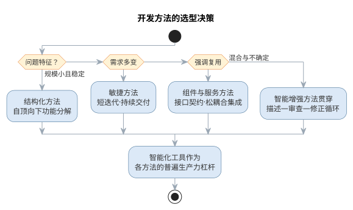{width=75%}

值得注意的是，智能增强方法并非与既有方法并列的"第五种方法"，而是贯穿其间的生产力杠杆：结构化方法的分解层次、敏捷方法的迭代节奏、组件方法的接口契约，都可以借 AI 以更低的成本落实——方法学越严谨，AI 的产出越可被审查、越稳定。

### 前沿演进：从方法到范式——意图驱动开发

大模型时代最激进的方法演进是**意图驱动开发**（intent-driven development）与**规范驱动开发**（spec-driven development）：开发者用自然语言表达意图，AI 把意图拆解为任务清单、生成代码与测试、经自动验证后集成，GitHub Copilot Workspace、Cursor、Claude Code 等把这一流程产品化。规范驱动开发更进一步，要求把"做什么"写成可机器校验的规格（接口、测试、不变量），AI 只负责填充实现——实现必须满足规格，否则不通过。开发范式的演进对照如下表所示。

| 范式 | 核心载体 | 人机分工 | 代表 |
|------|------|------|------|
| 传统方法 | 文档与代码 | 人写代码 | 结构化、面向对象 |
| 智能增强 | AI 编码助手 | AI 补全，人审查 | Copilot、Cursor |
| 意图驱动 | 自然语言任务 | AI 端到端执行，人验收 | Claude Code、Devin |
| 规范驱动 | 可校验规格 | 人定规格，AI 填实现 | Spec-driven 工作流 |

意图驱动开发的典型流程——从意图到基线——如图所示。

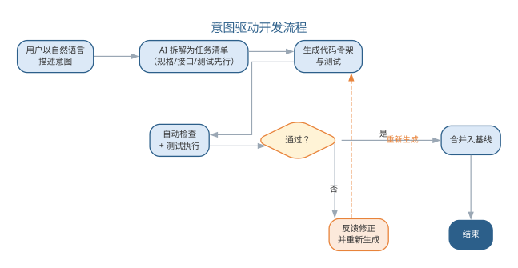{width=80%}

意图驱动把效率提升推向极致，也把质量风险集中到规格与验收环节——"验证"从编码的附属变成开发的核心矛盾，这正是第 11 章智能体治理的由来。

开发方法解决了"怎么做"，但任何方法都要依托过程才能落地——面向对象的封装与设计靠分析、设计、实现、测试等过程活动来承载，敏捷方法更是直接把"迭代"同时作为方法与过程。理解了方法之后，接下来转向软件过程。

软件过程是软件生命周期中一系列相关活动及其产物的有序集合，回答"软件从无到有到退役，究竟经历了什么、由谁做、用什么方法、产出什么"的问题。如果说方法解决"怎么做"，过程则解决"按什么步骤做、如何保证做对"。

{width=50%}

## 过程与任务

任务是过程的基本单位，指一项具体的、有明确产物的工作。**任务思维**只关心单个活动本身，而**过程思维**强调活动的顺序、依赖、输入输出与质量准则——这正是工程化区别于作坊式开发的分水岭。

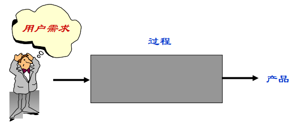{width=45%}

{width=45%}定义一项过程活动，通常需要给出：目标、所有者、输入、输出、入口准则与出口准则、任务清单、依赖关系以及验证确认手段。

{width=55%}

## 过程框架

软件过程由一组**基本活动**和若干**辅助活动**构成。基本活动包括：

- **规格说明**：确定软件的功能与约束，回答"做什么"；
- **开发**：包括设计与实现，回答"怎么做、做出来"；
- **确认**：通过测试与评审验证软件符合规格，回答"做对了吗"；
- **演化**：适应需求与环境变化而进行的修改维护。

辅助活动贯穿始终，包括项目管理、配置管理、质量保证、文档管理等。过程框架定义了这些活动的总体结构，具体项目再据此裁剪出适合自己的过程。

{width=45%}

## 经典过程模型

**瀑布模型**是最经典的过程模型，将生命周期阶段线性排列，前一个阶段完成后才进入下一阶段，要求需求在早期充分冻结。它简单清晰、易于管理，但难以适应需求变更，实际项目中常以文档评审回退缓解这一缺陷。

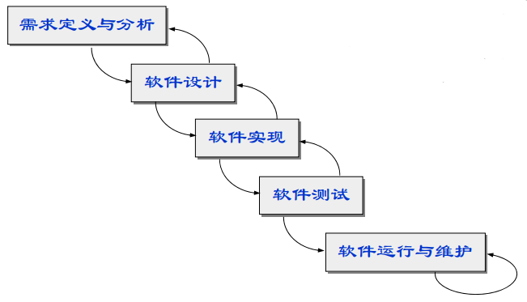{width=60%}

**快速原型模型**先快速构建可运行的原型，供用户试用反馈，据此明确需求，再按完整流程开发正式系统，特别适用于需求难以描述的情形。

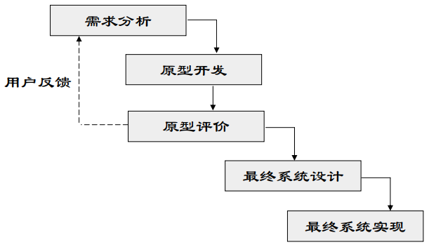{width=55%}

**增量模型**把系统划分为若干可以独立交付的构件，分批开发、逐批交付，用户可较早获得部分功能，风险得以提前释放。

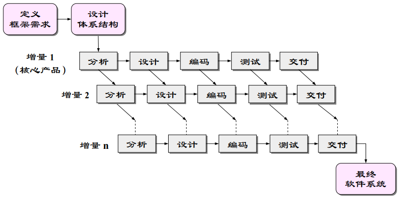{width=55%}

**螺旋模型**综合瀑布与原型思想，每一圈迭代都经过"确定目标—风险分析—开发验证—评审部署"四个象限，将**风险分析**作为每次迭代的核心环节，适合大型高风险项目。

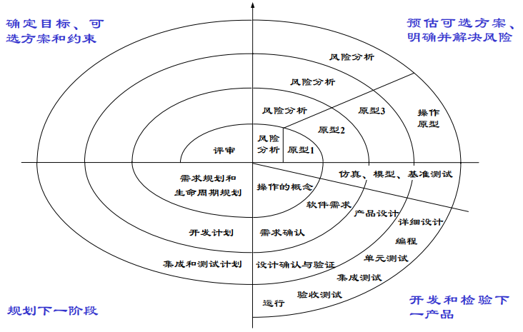{width=60%}

此外还有强调无过程冗余的**形式化过程模型**（第 7 章讨论）、以复用为宗旨的**基于组件的过程模型**，以及开源社区特有的**开源过程**。四种经典模型的核心思想、优点与适用场景可对照如下表所示。

| 模型 | 核心思想 | 优点 | 适用场景 |
|------|------|------|------|
| 瀑布模型 | 阶段线性顺序、文档评审 | 简单清晰、易于管理 | 需求稳定、规模较小 |
| 快速原型 | 先建原型、再正式开发 | 及早明确需求 | 需求难以描述 |
| 增量模型 | 分批开发、逐批交付 | 提前释放风险 | 功能可分、可分批交付 |
| 螺旋模型 | 迭代 + 风险分析 | 风险可控 | 大型高风险项目 |

过程模型的选择依赖需求明确度、规模与风险水平，决策路径如图所示。

{width=60%}

## 故事：瀑布模型的由来

**瀑布模型**的来历常被误读。1970 年，Winston Royce 在论文《管理大型软件系统的开发》中，以阶段图描述了"需求—设计—实现—测试—交付"的顺序过程，但他同时强调阶段间应有**反馈回路**，还建议"至少实现两次"——本意更接近迭代，而非纯线性。

- Royce 原意：顺序推进，但各阶段间允许反馈修正；
- 传播走样：阶段图被简化成无回环的"纯线性瀑布"；
- 军标固化：美国国防部以 DOD-STD-2167 等标准把顺序生命周期定为军用软件开发的规范，强化了"先冻结需求、逐级而下"的认知。

教科书里的瀑布，其实是业界对 Royce 建议的简化与偏离。这段公案提醒我们：**模型如何流传、如何被使用，往往比提出者的本意更影响实践**。

## 案例：瀑布模型的实践教训

一个**典型的示意性场景**可以说明纯瀑布的代价：某企业信息系统采用纯瀑布推进，需求分析阶段耗时约数月，随后设计、编码相继完成，直到系统联调阶段，业务方提出关键需求变更——流程与数月前的假设相左。

- 变更影响范围大：从需求文档、设计到已实现的代码与测试，都要跨阶段回退修改；
- 返工成本陡增：阶段越靠后，变更牵动的产物越多，代价呈放大之势；
- 进度被迫顺延：原定的交付日期一再推迟，业务等待时间成倍拉长。

这一场景并非个例，而是瀑布在**需求不稳定的项目**上的普遍命运。瀑布并非一无是处：对需求稳定、单次交付、规模较小的系统，它简单清晰、阶段可核查，仍是合适的选择。案例的教训不是"瀑布不能用"，而是**模型要匹配需求稳定度**——需求可能变化的项目，应尽早引入原型、增量或迭代机制。

## 样例：迭代开发与瀑布的进度对比

把瀑布与迭代开发放在同一张表里对比，差异一目了然。下表就"需求变化、早期反馈、风险暴露"三个维度给出**示意性对照**。

| 维度 | 瀑布模型 | 迭代开发 |
|------|------|------|
| 需求变化时 | 冻结需求，只能跨阶段回退，代价大 | 在后续迭代消化，影响局部化 |
| 早期反馈 | 反馈集中在后期测试阶段 | 每轮迭代结束即可演示，反馈前置 |
| 风险暴露时机 | 集中在收尾阶段，发现晚 | 随迭代逐轮暴露，早发现早应对 |

以一次约十二周的典型开发为例，两种模型的进度感受明显不同（周次—里程碑为示意）。

| 周次 | 瀑布里程碑 | 迭代里程碑 |
|------|------|------|
| 第 2 周 | 需求文档评审 | 完成第 1 轮迭代，核心功能可演示 |
| 第 5 周 | 设计评审 | 第 2 轮迭代交付，用户试用反馈 |
| 第 9 周 | 编码收尾 | 第 3 轮迭代交付，风险逐轮收敛 |
| 第 12 周 | 整体测试、试运行 | 集成验收、发布准备 |

对照可见：瀑布把"看得见的成果"推迟到后期，迭代则让成果与风险**早期可见**。对变化频繁的项目，后者的可预期性反而更高。

## 案例：过程选错的典型项目

过程的"轻重"没有绝对优劣，关键在**是否与项目匹配**。选错过程的失败可归结为两种**典型形态**。

- **轻量项目套重过程**：一个小团队、数十日的内部工具项目，照搬重量级过程的文档制度——每处变更都要评审会、签字与多份交付物，仅文档与审批就占据大半时间，团队陷入"为过程而过程"的疲惫；
- **大型项目套轻过程**：规模庞大、涉及多个团队与外部接口的系统，若只用轻量方式而无基线、配置管理与里程碑把关，接口失配、需求蔓延与集成混乱便随之而来，项目逐渐失控。

两种失败镜像地指向同一结论：**过程的选择依据是项目特征**。需求明确度低、规模大、风险高、团队分散的项目，宜采用较重的纪律与文档保障；需求可演进、规模小、响应要快的项目，宜采用轻量的迭代与自组织。先判断项目，再选择过程，比在"越重越好"或"越轻越好"之间站队更可靠。

## 统一过程与敏捷开发

**统一过程（RUP）**以用例驱动、以体系结构为中心、迭代增量式开发，把时间维划分为初始、细化、构造、移交四个阶段，每个阶段内部又反复迭代，是重量级过程（强调过程纪律与文档）的代表。

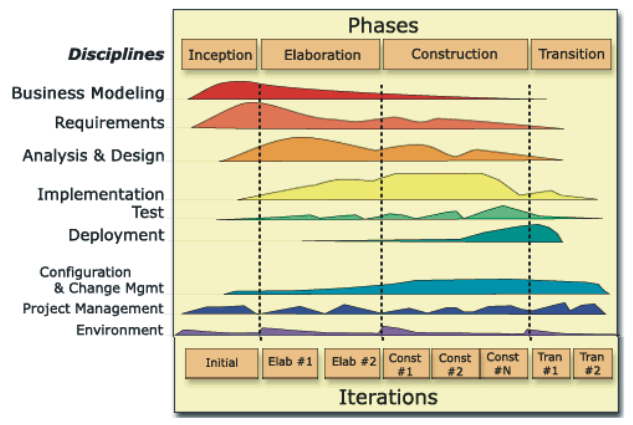{width=55%}与之相对，**Scrum** 等敏捷过程采用固定的短冲刺迭代，以待办列表、冲刺评审、持续改进为骨架，弱化文档、强调可工作的软件与自组织团队。

IBM、微软等企业还总结出各自的开发过程（如微软的团队过程），但万变不离其宗：都是对"迭代、风险、质量、沟通"四个要素的不同权重安排。重量级的 RUP 与轻量的 Scrum 可对照如下表所示。

| 维度 | RUP | Scrum |
|------|------|------|
| 过程风格 | 重量级、强调纪律与文档 | 轻量级、弱化文档 |
| 驱动方式 | 用例驱动、体系结构为中心 | 待办列表驱动、自组织团队 |
| 时间组织 | 初始/细化/构造/移交四阶段 | 固定短冲刺迭代 |
| 角色 | 角色明确、职责细分 | 产品负责人、Scrum Master、团队 |

## AI 时代的软件过程

大语言模型进入开发过程后，过程的形态开始改变。首先，**过程活动的粒度变细**：需求描述、用例生成、代码补全、测试编写、缺陷修复等以往需要完整工期的活动，现在可以由人机协作在数分钟内完成，过程迭代周期大幅缩短。其次，**确认活动前移**：AI 生成的代码在提交前即由智能助手完成静态检查、单元测试生成与安全扫描，质量门禁嵌入到日常编码而非集中在阶段末。

由此出现了**AI 增强过程**的新形态：人的角色从"执行者"转向"定义者与评审者"，过程文本从文档转向可执行的提示词与自动化流水线（CI/CD）。但过程纪律并未消失——需求基线、变更控制、配置管理与评审制度依然是智能化过程的质量底线，AI 只是让这些纪律的遵守成本更低、更及时。

AI 增强过程的成熟度可以划分为三个层次：**点状辅助**——AI 仅在个别活动（如测试用例编写、缺陷修复）中作为工具出现，过程整体仍按传统方式运转；**流水线嵌入**——AI 能力作为 CI/CD 流水线中的固定步骤（静态检查、测试生成、安全扫描）自动执行，质量门禁前移到每一次提交；**智能体编排**——智能体接受高层目标，自动拆解任务、调用工具并依据反馈修正，人的参与收缩为定义目标与验收结果。团队宜从低成熟度起步，逐步向高成熟度演进，并在每个层次都保留人作为最终评审者的位置。

质量门禁前移的机制在于"把检查嵌入变化发生的时刻"：需求变更触发一致性检查，代码提交触发静态分析与测试生成，版本发布触发安全与合规扫描。门禁的检查项由人设定，检查结果由人处置，AI 承担的是高频、机械、即时的部分。由此，过程保证质量的方式从"阶段末的大规模验证"转向"变化点的即时小验证"，缺陷的发现时机显著提前，返工成本随之下降。AI 时代过程要素的变化对照如下表所示。

| 过程要素 | 传统形态 | AI 增强形态 |
|------|------|------|
| 活动粒度 | 完整工期、人工完成 | 人机协作、数分钟完成 |
| 确认时机 | 阶段末集中验证 | 提交/发布时即时小验证 |
| 人的角色 | 活动执行者 | 定义者与评审者 |
| 过程文本 | 文档 | 提示词与自动化流水线 |

质量门禁前移的机制——把检查嵌入变化发生的时刻——如图所示。

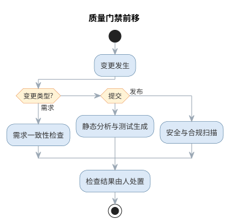{width=60%}

需求、提交、发布三类变更点各自触发对应的即时检查，检查项由人设定、结果由人处置，AI 承担高频即时的执行部分。

### 过程元模型的 AI 化

过程元模型描述过程由哪些要素构成——活动、产物、准则、角色与工具。AI 时代的软件过程不是推翻元模型，而是让每个要素获得 AI 增强形态。过程元模型各要素的 AI 化对照如下表所示。

| 过程要素 | 传统含义 | AI 增强形态 |
|------|------|------|
| 活动 | 由人按完整工期执行的任务 | 人机协作，AI 起草与执行、人定义与验收 |
| 产物 | 文档与代码 | 提示词、生成的代码/测试/文档，随生成即沉淀 |
| 准则（入口/出口） | 阶段末评审把关 | 门禁前置为可自动执行的检查（编译、测试、静态分析） |
| 角色 | 分析员、设计员、编码员分工 | 人转向定义者与评审者（代码策展） |
| 工具 | 编辑器、编译器、评审系统 | AI 助手与 CI/CD 流水线成为过程载体 |
| 验证 | 阶段末集中测试评审 | 变化点即时小验证，验证优先 |

元模型 AI 化揭示了一个不变点：过程的"活动—产物—准则"结构依然成立，变化的是执行主体与把关时机。经典过程模型由此获得各自的 AI 切入点，如下表所示。

| 经典模型 | AI 增强切入点 |
|------|------|
| 瀑布模型 | AI 生成需求草案与用例，缓解需求冻结风险 |
| 快速原型 | AI 生成可运行原型骨架，加速用户反馈循环 |
| 增量模型 | AI 生成构件实现与测试，加速分批交付 |
| 螺旋模型 | AI 辅助风险清单与对策生成，强化风险分析 |
| 敏捷开发 | AI 拆分故事与生成测试，加速短迭代循环 |

以一个具体场景为例：需求变更"订单逾期标记时间从 7 天改为 5 天"。传统过程中，这需要修改需求文档、设计文档、实现、测试与评审记录五处，且相互容易失配；在 AI 增强过程中，变更由规格文件驱动——人修改规格与验收测试，AI 据此同步更新实现与用例，CI 门禁即时验证一致性，文档由生成结果自动沉淀。整个过程的活动粒度从"跨阶段的完整工期"压缩为"一次规格修改"，确认时机从阶段末前移到提交瞬间。

### 规格即代码等新过程形态

在过程 AI 化的各种新形态中，**规格即代码**（Spec-as-Code）最具代表性。它把"做什么、验收什么"写成可机器校验的规格——接口契约、测试用例、CI 检查规则——作为过程的单一事实来源，AI 只负责填充实现，实现必须通过规格校验才能进入基线。与之并列的新形态还有**流水线即代码**（Pipeline-as-Code，用代码描述 CI/CD）与**治理即代码**（Governance-as-Code，把检查项与权限写成可审查的规则）。新形态对照如下表所示。

| 新形态 | 载体 | 单一事实来源 | 典型示例 |
|------|------|------|------|
| 规格即代码 | 接口契约、测试、不变量 | 规格文件 | 契约测试、验收测试驱动 |
| 流水线即代码 | CI/CD 声明 | 流水线文件 | GitHub Actions、Jenkinsfile |
| 治理即代码 | 检查规则与权限策略 | 规则仓库 | 策略即代码、门禁规则集 |

三种新形态的共同点，是把"人记忆中的纪律"变成"机器可执行的规格"——AI 据此生成实现并以规格校验，与本章的规范驱动开发、第 7 章的形式化方法一脉相承。把一条需求改写成规格，可以用下面这条模板：

```text
你是规格工程师。请把下面的需求改写成可机器校验的规格：
- 需求：{一句业务需求，如"已逾期 7 天的订单自动标记为欠费"}
请输出：1) 可执行的验收测试用例（输入、期望输出）；
2) 关键不变量与边界条件；3) 需要人工确认的业务假设。
```

规格即代码并非万能：当需求本身仍在探索、尚未稳定时，过早把验收写成机器可校验的规格会把讨论过早冻结；此时应以探索式的用户故事与人工评审为主，待需求稳定后再迁移到规格。团队的取舍标准是"规格是否已经理解清楚"，而非"工具是否支持"。以治理即代码为例，团队可把"禁止直接修改数据层、敏感信息不得入日志"这类红线写成检查规则并与 CI 集成：任何违反规则的变更在合并前即被拦截，拦截记录可供审计追溯——这比把规则写在评审指南里更可执行。

在规格即代码的过程里，AI 的角色是"规格的执行者而非定义者"：规格由人根据业务语义制定，AI 负责把规格翻译为实现与测试，并在规格校验失败时给出修正建议。一旦让 AI 自行定义验收标准，验证就失去了独立裁判——这正是规格即代码与"完全交给 AI"的本质区别。

### AI 增强过程的落地工作流

AI 增强过程要落地，可循一条六步工作流：其一，**盘点变更点**——识别需求、提交、发布等所有会触发检查的变化时刻；其二，**设定门禁**——为每个变更点定义检查项（编译、测试、静态分析、安全扫描）与通过标准；其三，**接入 AI 步骤**——在流水线中追加 AI 生成测试、自评与变更说明的步骤，把结果作为门禁输入；其四，**明确处置责任**——为每个检查结果指定处置人，规定放行、返工与升级路径；其五，**试点与度量**——先在一个模块试点，跟踪缺陷发现时机与返工率；其六，**回填与演进**——依据度量把成功做法固化为模板，逐步提高 AI 参与深度。六步从盘点变更点到回填演进，构成 AI 增强过程的落地闭环。六步工作流与第 1 章的知识域地图相呼应：盘点变更点对应过程活动，设定门禁对应质量准则，接入 AI 步骤对应工具要素，而处置责任始终落在人这一环。落地工作流还要求团队回答两个问题：哪些活动值得接入 AI、哪些必须保留人工。经验法则是"高频、低风险、判断边界清晰"的活动优先自动化，而需求基线变更、体系结构决策、高风险模块验收等低频高风险的环节必须保留人工。常用的落地载体包括 GitHub Actions、Jenkins 等既有流水线，以及 SonarQube 等静态分析规则集，团队按既有技术栈接入即可。把 AI 步骤纳入流水线不是终点——门禁是否真实拦截、AI 步骤是否可审计，需要以度量持续检验，这与第 8 章项目管理的量化思路一致。六步工作流也与前文的过程成熟度模型互为表里：成熟度给出方向（从点状辅助到智能体编排），工作流给出路径——团队从低成熟度起步，沿六步逐步升级，每一步都保留人作为最终评审者。

## AI 增强过程实践

AI 增强过程主要落点在持续集成/持续交付（CI/CD）流水线。常见的做法是在既有流水线（如 GitHub Actions、Jenkins）中追加 AI 步骤：提交时由 AI 助手生成并执行单元测试、运行静态分析（如 SonarQube 规则集）与依赖安全扫描，把结果作为合并请求的质量门槛；对通过检查的变更再由 AI 生成变更说明与影响分析，供评审者快速理解。AI 生成代码的提交前评审流程通常包括四步：自动检查（编译、测试、静态分析）、AI 自评（对照评审清单检查遗漏）、同行评审（关注逻辑与设计）、合并并记录基线。

AI 增强过程的成熟度演进——从点状辅助到智能体编排——如图所示。

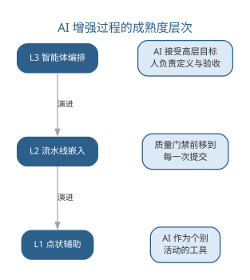{width=60%}

过程活动与 AI 增强后的形态对比如下表所示。

| 过程活动 | 传统做法 | AI 增强形态 |
|------|------|------|
| 需求规格说明 | 人工撰写需求文档 | 辅助生成需求草案并检查一致性 |
| 设计评审 | 评审会议逐项检查 | AI 对照检查清单预扫描，人确认 |
| 单元测试 | 程序员手工编写 | AI 生成用例，CI 自动执行 |
| 缺陷修复 | 人工定位并修改 | AI 定位根因、生成补丁，人验证 |
| 发布评审 | 阶段末集中验证 | 流水线内嵌质量门禁，即时把关 |

需要注意的是，AI 增强的是过程的执行效率，而非过程本身的价值——需求基线、变更控制与配置管理仍然是不可省略的活动。把 AI 步骤引入流水线的团队，应先明确每个步骤的检查项与处置责任，再谈自动化。智能流水线与机器学习模型的部署、监控（MLOps）在工程手段上同源，详见第 10 章。

### AI 增强过程的常见误区

AI 增强过程最容易出现的偏差，是把"自动化"误当作"无人化"，或让 AI 步骤绕过既有的质量纪律。常见的误区与应对如下表所示。

| 误区 | 典型表现 | 应对要点 |
|------|------|------|
| 门禁形同虚设 | AI 检查结果无人处置、一律放行 | 检查项由人设定，检查结果由人处置 |
| 绕过基线纪律 | AI 直接改配置、发布产物 | 需求基线、变更控制与配置管理不可省略 |
| 盲目追求高成熟度 | 一步到智能体编排，缺少人在回路 | 从点状辅助起步，逐层演进并保留人评审 |
| 权责不清 | 步骤没有明确的检查项与处置责任 | 先明确检查项与处置责任，再谈自动化 |

质量门禁前移的机制——把检查嵌入变化发生的时刻——如图所示。

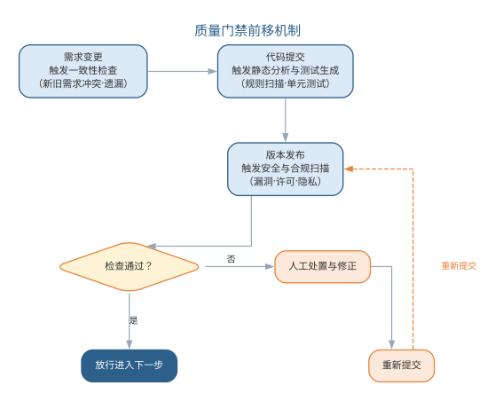{width=65%}

由此，过程保证质量的方式从"阶段末的大规模验证"转向"变化点的即时小验证"：需求变更触发一致性检查、代码提交触发静态分析与测试生成、版本发布触发安全与合规扫描，缺陷的发现时机显著提前，返工成本随之下降。

### 前沿演进：平台工程、内部开发者平台与 GitOps

传统软件过程以"流程文档"驱动，前沿实践则以"平台"承载工程能力。**平台工程**（platform engineering）通过建设内部开发者平台（IDP），把 CI/CD、环境供给、安全、可观测性封装为自助服务能力，让开发团队走"黄金路径"而不必重复搭建基础设施。**GitOps** 以 Git 仓库为单一事实来源，声明式描述系统期望状态，由控制器（如 Argo CD、Flux）自动同步集群，实现可审计、可回滚的交付。平台化做法与传统做法的对照如下表所示。

| 能力 | 传统做法 | 平台化做法 |
|------|------|------|
| 环境供给 | 手工配置，逐团队重复 | 自助模板，一键创建 |
| CI/CD | 各团队独立流水线 | 统一平台，黄金路径 |
| 基础设施变更 | 直接操作集群 | GitOps 声明式同步 |
| 可观测性 | 各自埋点，数据孤岛 | 统一遥测，标准接入 |

内部开发者平台的分层与 GitOps 声明式同步如图所示。

{width=75%}

平台工程并未改变过程纪律，而是把纪律固化为可复用的工具与流程——软件过程从"文档规定"走向"平台保障"，这比任何流程文档都更能保证一致性。

## 本章小结

本章把"怎么做"与"按什么步骤做"放在一起讨论，二者互补而不可偏废。开发方法回答如何组织开发：从结构化、面向对象、组件服务到敏捷，演进始终围绕控制复杂性展开；智能化方法以模型为中心、以人机结对为形态，把经典方法学的约束以更低成本落地——AI 承担起草与执行，人保留定义与把关，五步实践流程（定约束—备上下文—生成自检—验证审查—度量改进）让智能开发沉淀为团队纪律，验证优先是质量底线。过程回答软件从无到有到退役的活动组织：瀑布、原型、增量、螺旋与统一过程、敏捷等模型提供了不同的组织方式；AI 时代的过程以"粒度变细、确认前移、人转向定义与评审"为特征，规格即代码把纪律变成可校验的规格，六步落地工作流让增强过程可度可管。无论过程如何 AI 化，需求基线、变更控制与配置管理仍是质量底线，人机分工不可颠倒。

**思考与讨论：**
1. 以面向对象方法为例，说明 AI 可以承担哪些角色、哪些判断必须由人完成。
2. 为什么说智能开发方法的真正瓶颈在于"验证"而非"生成"？
3. 开发方法与软件过程如何互补？试以敏捷方法为例，说明"方法如何被过程承载"。
4. 规格即代码与文档化过程相比，各自的适用边界是什么？
5. AI 增强过程落地时，如何防止门禁形同虚设？
