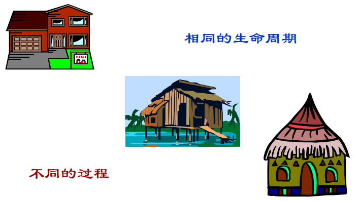
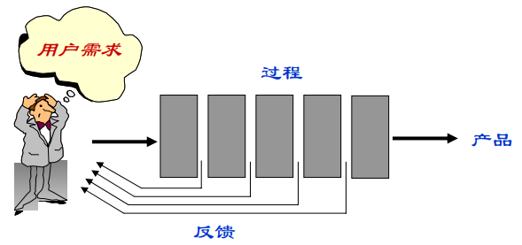
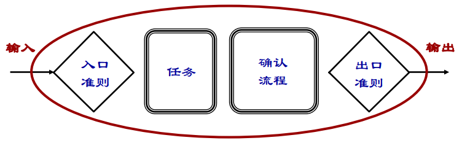
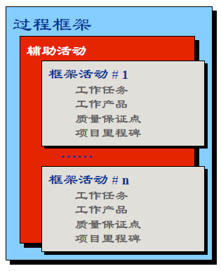
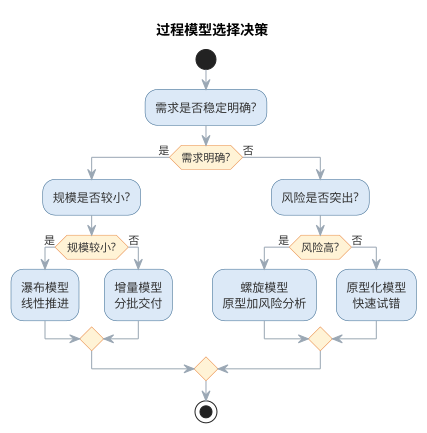
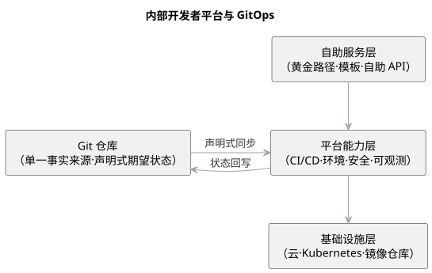

# 软件过程与过程模型

软件过程是软件生命周期中一系列相关活动及其产物的有序集合，回答"软件从无到有到退役，究竟经历了什么、由谁做、用什么方法、产出什么"的问题。如果说方法解决"怎么做"，过程则解决"按什么步骤做、如何保证做对"。

{width=50%}

## 过程与任务

任务是过程的基本单位，指一项具体的、有明确产物的工作。**任务思维**只关心单个活动本身，而**过程思维**强调活动的顺序、依赖、输入输出与质量准则——这正是工程化区别于作坊式开发的分水岭。

{width=45%}

{width=45%}定义一项过程活动，通常需要给出：目标、所有者、输入、输出、入口准则与出口准则、任务清单、依赖关系以及验证确认手段。

{width=55%}

## 过程框架

软件过程由一组**基本活动**和若干**辅助活动**构成。基本活动包括：

- **规格说明**：确定软件的功能与约束，回答"做什么"；
- **开发**：包括设计与实现，回答"怎么做、做出来"；
- **确认**：通过测试与评审验证软件符合规格，回答"做对了吗"；
- **演化**：适应需求与环境变化而进行的修改维护。

辅助活动贯穿始终，包括项目管理、配置管理、质量保证、文档管理等。过程框架定义了这些活动的总体结构，具体项目再据此裁剪出适合自己的过程。

{width=45%}

## 经典过程模型

**瀑布模型**是最经典的过程模型，将生命周期阶段线性排列，前一个阶段完成后才进入下一阶段，要求需求在早期充分冻结。它简单清晰、易于管理，但难以适应需求变更，实际项目中常以文档评审回退缓解这一缺陷。

{width=60%}

**快速原型模型**先快速构建可运行的原型，供用户试用反馈，据此明确需求，再按完整流程开发正式系统，特别适用于需求难以描述的情形。

{width=55%}

**增量模型**把系统划分为若干可以独立交付的构件，分批开发、逐批交付，用户可较早获得部分功能，风险得以提前释放。

{width=55%}

**螺旋模型**综合瀑布与原型思想，每一圈迭代都经过"确定目标—风险分析—开发验证—评审部署"四个象限，将**风险分析**作为每次迭代的核心环节，适合大型高风险项目。

{width=60%}

此外还有强调无过程冗余的**形式化过程模型**（第 12 章讨论）、以复用为宗旨的**基于组件的过程模型**，以及开源社区特有的**开源过程**。四种经典模型的核心思想、优点与适用场景可对照如下表所示。

| 模型 | 核心思想 | 优点 | 适用场景 |
|------|------|------|------|
| 瀑布模型 | 阶段线性顺序、文档评审 | 简单清晰、易于管理 | 需求稳定、规模较小 |
| 快速原型 | 先建原型、再正式开发 | 及早明确需求 | 需求难以描述 |
| 增量模型 | 分批开发、逐批交付 | 提前释放风险 | 功能可分、可分批交付 |
| 螺旋模型 | 迭代 + 风险分析 | 风险可控 | 大型高风险项目 |

过程模型的选择依赖需求明确度、规模与风险水平，决策路径如图所示。

{width=60%}

## 故事：瀑布模型的由来

**瀑布模型**的来历常被误读。1970 年，Winston Royce 在论文《管理大型软件系统的开发》中，以阶段图描述了"需求—设计—实现—测试—交付"的顺序过程，但他同时强调阶段间应有**反馈回路**，还建议"至少实现两次"——本意更接近迭代，而非纯线性。

- Royce 原意：顺序推进，但各阶段间允许反馈修正；
- 传播走样：阶段图被简化成无回环的"纯线性瀑布"；
- 军标固化：美国国防部以 DOD-STD-2167 等标准把顺序生命周期定为军用软件开发的规范，强化了"先冻结需求、逐级而下"的认知。

教科书里的瀑布，其实是业界对 Royce 建议的简化与偏离。这段公案提醒我们：**模型如何流传、如何被使用，往往比提出者的本意更影响实践**。

## 案例：瀑布模型的实践教训

一个**典型的示意性场景**可以说明纯瀑布的代价：某企业信息系统采用纯瀑布推进，需求分析阶段耗时约数月，随后设计、编码相继完成，直到系统联调阶段，业务方提出关键需求变更——流程与数月前的假设相左。

- 变更影响范围大：从需求文档、设计到已实现的代码与测试，都要跨阶段回退修改；
- 返工成本陡增：阶段越靠后，变更牵动的产物越多，代价呈放大之势；
- 进度被迫顺延：原定的交付日期一再推迟，业务等待时间成倍拉长。

这一场景并非个例，而是瀑布在**需求不稳定的项目**上的普遍命运。瀑布并非一无是处：对需求稳定、单次交付、规模较小的系统，它简单清晰、阶段可核查，仍是合适的选择。案例的教训不是"瀑布不能用"，而是**模型要匹配需求稳定度**——需求可能变化的项目，应尽早引入原型、增量或迭代机制。

## 样例：迭代开发与瀑布的进度对比

把瀑布与迭代开发放在同一张表里对比，差异一目了然。下表就"需求变化、早期反馈、风险暴露"三个维度给出**示意性对照**。

| 维度 | 瀑布模型 | 迭代开发 |
|------|------|------|
| 需求变化时 | 冻结需求，只能跨阶段回退，代价大 | 在后续迭代消化，影响局部化 |
| 早期反馈 | 反馈集中在后期测试阶段 | 每轮迭代结束即可演示，反馈前置 |
| 风险暴露时机 | 集中在收尾阶段，发现晚 | 随迭代逐轮暴露，早发现早应对 |

以一次约十二周的典型开发为例，两种模型的进度感受明显不同（周次—里程碑为示意）。

| 周次 | 瀑布里程碑 | 迭代里程碑 |
|------|------|------|
| 第 2 周 | 需求文档评审 | 完成第 1 轮迭代，核心功能可演示 |
| 第 5 周 | 设计评审 | 第 2 轮迭代交付，用户试用反馈 |
| 第 9 周 | 编码收尾 | 第 3 轮迭代交付，风险逐轮收敛 |
| 第 12 周 | 整体测试、试运行 | 集成验收、发布准备 |

对照可见：瀑布把"看得见的成果"推迟到后期，迭代则让成果与风险**早期可见**。对变化频繁的项目，后者的可预期性反而更高。

## 案例：过程选错的典型项目

过程的"轻重"没有绝对优劣，关键在**是否与项目匹配**。选错过程的失败可归结为两种**典型形态**。

- **轻量项目套重过程**：一个小团队、数十日的内部工具项目，照搬重量级过程的文档制度——每处变更都要评审会、签字与多份交付物，仅文档与审批就占据大半时间，团队陷入"为过程而过程"的疲惫；
- **大型项目套轻过程**：规模庞大、涉及多个团队与外部接口的系统，若只用轻量方式而无基线、配置管理与里程碑把关，接口失配、需求蔓延与集成混乱便随之而来，项目逐渐失控。

两种失败镜像地指向同一结论：**过程的选择依据是项目特征**。需求明确度低、规模大、风险高、团队分散的项目，宜采用较重的纪律与文档保障；需求可演进、规模小、响应要快的项目，宜采用轻量的迭代与自组织。先判断项目，再选择过程，比在"越重越好"或"越轻越好"之间站队更可靠。

## 统一过程与敏捷开发

**统一过程（RUP）**以用例驱动、以体系结构为中心、迭代增量式开发，把时间维划分为初始、细化、构造、移交四个阶段，每个阶段内部又反复迭代，是重量级过程（强调过程纪律与文档）的代表。

{width=55%}与之相对，**Scrum** 等敏捷过程采用固定的短冲刺迭代，以待办列表、冲刺评审、持续改进为骨架，弱化文档、强调可工作的软件与自组织团队。

IBM、微软等企业还总结出各自的开发过程（如微软的团队过程），但万变不离其宗：都是对"迭代、风险、质量、沟通"四个要素的不同权重安排。重量级的 RUP 与轻量的 Scrum 可对照如下表所示。

| 维度 | RUP | Scrum |
|------|------|------|
| 过程风格 | 重量级、强调纪律与文档 | 轻量级、弱化文档 |
| 驱动方式 | 用例驱动、体系结构为中心 | 待办列表驱动、自组织团队 |
| 时间组织 | 初始/细化/构造/移交四阶段 | 固定短冲刺迭代 |
| 角色 | 角色明确、职责细分 | 产品负责人、Scrum Master、团队 |

## AI 时代的软件过程

大语言模型进入开发过程后，过程的形态开始改变。首先，**过程活动的粒度变细**：需求描述、用例生成、代码补全、测试编写、缺陷修复等以往需要完整工期的活动，现在可以由人机协作在数分钟内完成，过程迭代周期大幅缩短。其次，**确认活动前移**：AI 生成的代码在提交前即由智能助手完成静态检查、单元测试生成与安全扫描，质量门禁嵌入到日常编码而非集中在阶段末。

由此出现了**AI 增强过程**的新形态：人的角色从"执行者"转向"定义者与评审者"，过程文本从文档转向可执行的提示词与自动化流水线（CI/CD）。但过程纪律并未消失——需求基线、变更控制、配置管理与评审制度依然是智能化过程的质量底线，AI 只是让这些纪律的遵守成本更低、更及时。

AI 增强过程的成熟度可以划分为三个层次：**点状辅助**——AI 仅在个别活动（如测试用例编写、缺陷修复）中作为工具出现，过程整体仍按传统方式运转；**流水线嵌入**——AI 能力作为 CI/CD 流水线中的固定步骤（静态检查、测试生成、安全扫描）自动执行，质量门禁前移到每一次提交；**智能体编排**——智能体接受高层目标，自动拆解任务、调用工具并依据反馈修正，人的参与收缩为定义目标与验收结果。团队宜从低成熟度起步，逐步向高成熟度演进，并在每个层次都保留人作为最终评审者的位置。

质量门禁前移的机制在于"把检查嵌入变化发生的时刻"：需求变更触发一致性检查，代码提交触发静态分析与测试生成，版本发布触发安全与合规扫描。门禁的检查项由人设定，检查结果由人处置，AI 承担的是高频、机械、即时的部分。由此，过程保证质量的方式从"阶段末的大规模验证"转向"变化点的即时小验证"，缺陷的发现时机显著提前，返工成本随之下降。AI 时代过程要素的变化对照如下表所示。

| 过程要素 | 传统形态 | AI 增强形态 |
|------|------|------|
| 活动粒度 | 完整工期、人工完成 | 人机协作、数分钟完成 |
| 确认时机 | 阶段末集中验证 | 提交/发布时即时小验证 |
| 人的角色 | 活动执行者 | 定义者与评审者 |
| 过程文本 | 文档 | 提示词与自动化流水线 |

质量门禁前移的机制——把检查嵌入变化发生的时刻——如图所示。

{width=60%}

需求、提交、发布三类变更点各自触发对应的即时检查，检查项由人设定、结果由人处置，AI 承担高频即时的执行部分。

### 过程元模型的 AI 化

过程元模型描述过程由哪些要素构成——活动、产物、准则、角色与工具。AI 时代的软件过程不是推翻元模型，而是让每个要素获得 AI 增强形态。过程元模型各要素的 AI 化对照如下表所示。

| 过程要素 | 传统含义 | AI 增强形态 |
|------|------|------|
| 活动 | 由人按完整工期执行的任务 | 人机协作，AI 起草与执行、人定义与验收 |
| 产物 | 文档与代码 | 提示词、生成的代码/测试/文档，随生成即沉淀 |
| 准则（入口/出口） | 阶段末评审把关 | 门禁前置为可自动执行的检查（编译、测试、静态分析） |
| 角色 | 分析员、设计员、编码员分工 | 人转向定义者与评审者（代码策展） |
| 工具 | 编辑器、编译器、评审系统 | AI 助手与 CI/CD 流水线成为过程载体 |
| 验证 | 阶段末集中测试评审 | 变化点即时小验证，验证优先 |

元模型 AI 化揭示了一个不变点：过程的"活动—产物—准则"结构依然成立，变化的是执行主体与把关时机。经典过程模型由此获得各自的 AI 切入点，如下表所示。

| 经典模型 | AI 增强切入点 |
|------|------|
| 瀑布模型 | AI 生成需求草案与用例，缓解需求冻结风险 |
| 快速原型 | AI 生成可运行原型骨架，加速用户反馈循环 |
| 增量模型 | AI 生成构件实现与测试，加速分批交付 |
| 螺旋模型 | AI 辅助风险清单与对策生成，强化风险分析 |
| 敏捷开发 | AI 拆分故事与生成测试，加速短迭代循环 |

以一个具体场景为例：需求变更"订单逾期标记时间从 7 天改为 5 天"。传统过程中，这需要修改需求文档、设计文档、实现、测试与评审记录五处，且相互容易失配；在 AI 增强过程中，变更由规格文件驱动——人修改规格与验收测试，AI 据此同步更新实现与用例，CI 门禁即时验证一致性，文档由生成结果自动沉淀。整个过程的活动粒度从"跨阶段的完整工期"压缩为"一次规格修改"，确认时机从阶段末前移到提交瞬间。

### 规格即代码等新过程形态

在过程 AI 化的各种新形态中，**规格即代码**（Spec-as-Code）最具代表性。它把"做什么、验收什么"写成可机器校验的规格——接口契约、测试用例、CI 检查规则——作为过程的单一事实来源，AI 只负责填充实现，实现必须通过规格校验才能进入基线。与之并列的新形态还有**流水线即代码**（Pipeline-as-Code，用代码描述 CI/CD）与**治理即代码**（Governance-as-Code，把检查项与权限写成可审查的规则）。新形态对照如下表所示。

| 新形态 | 载体 | 单一事实来源 | 典型示例 |
|------|------|------|------|
| 规格即代码 | 接口契约、测试、不变量 | 规格文件 | 契约测试、验收测试驱动 |
| 流水线即代码 | CI/CD 声明 | 流水线文件 | GitHub Actions、Jenkinsfile |
| 治理即代码 | 检查规则与权限策略 | 规则仓库 | 策略即代码、门禁规则集 |

三种新形态的共同点，是把"人记忆中的纪律"变成"机器可执行的规格"——AI 据此生成实现并以规格校验，与第 2 章的规范驱动开发、第 12 章的形式化方法一脉相承。把一条需求改写成规格，可以用下面这条模板：

```text
你是规格工程师。请把下面的需求改写成可机器校验的规格：
- 需求：{一句业务需求，如"已逾期 7 天的订单自动标记为欠费"}
请输出：1) 可执行的验收测试用例（输入、期望输出）；
2) 关键不变量与边界条件；3) 需要人工确认的业务假设。
```

规格即代码并非万能：当需求本身仍在探索、尚未稳定时，过早把验收写成机器可校验的规格会把讨论过早冻结；此时应以探索式的用户故事与人工评审为主，待需求稳定后再迁移到规格。团队的取舍标准是"规格是否已经理解清楚"，而非"工具是否支持"。以治理即代码为例，团队可把"禁止直接修改数据层、敏感信息不得入日志"这类红线写成检查规则并与 CI 集成：任何违反规则的变更在合并前即被拦截，拦截记录可供审计追溯——这比把规则写在评审指南里更可执行。

在规格即代码的过程里，AI 的角色是"规格的执行者而非定义者"：规格由人根据业务语义制定，AI 负责把规格翻译为实现与测试，并在规格校验失败时给出修正建议。一旦让 AI 自行定义验收标准，验证就失去了独立裁判——这正是规格即代码与"完全交给 AI"的本质区别。

### AI 增强过程的落地工作流

AI 增强过程要落地，可循一条六步工作流：其一，**盘点变更点**——识别需求、提交、发布等所有会触发检查的变化时刻；其二，**设定门禁**——为每个变更点定义检查项（编译、测试、静态分析、安全扫描）与通过标准；其三，**接入 AI 步骤**——在流水线中追加 AI 生成测试、自评与变更说明的步骤，把结果作为门禁输入；其四，**明确处置责任**——为每个检查结果指定处置人，规定放行、返工与升级路径；其五，**试点与度量**——先在一个模块试点，跟踪缺陷发现时机与返工率；其六，**回填与演进**——依据度量把成功做法固化为模板，逐步提高 AI 参与深度。六步从盘点变更点到回填演进，构成 AI 增强过程的落地闭环。六步工作流与第 1 章的知识域地图相呼应：盘点变更点对应过程活动，设定门禁对应质量准则，接入 AI 步骤对应工具要素，而处置责任始终落在人这一环。落地工作流还要求团队回答两个问题：哪些活动值得接入 AI、哪些必须保留人工。经验法则是"高频、低风险、判断边界清晰"的活动优先自动化，而需求基线变更、体系结构决策、高风险模块验收等低频高风险的环节必须保留人工。常用的落地载体包括 GitHub Actions、Jenkins 等既有流水线，以及 SonarQube 等静态分析规则集，团队按既有技术栈接入即可。把 AI 步骤纳入流水线不是终点——门禁是否真实拦截、AI 步骤是否可审计，需要以度量持续检验，这与第 13 章项目管理的量化思路一致。六步工作流也与前文的过程成熟度模型互为表里：成熟度给出方向（从点状辅助到智能体编排），工作流给出路径——团队从低成熟度起步，沿六步逐步升级，每一步都保留人作为最终评审者。

## AI 增强过程实践

AI 增强过程主要落点在持续集成/持续交付（CI/CD）流水线。常见的做法是在既有流水线（如 GitHub Actions、Jenkins）中追加 AI 步骤：提交时由 AI 助手生成并执行单元测试、运行静态分析（如 SonarQube 规则集）与依赖安全扫描，把结果作为合并请求的质量门槛；对通过检查的变更再由 AI 生成变更说明与影响分析，供评审者快速理解。AI 生成代码的提交前评审流程通常包括四步：自动检查（编译、测试、静态分析）、AI 自评（对照评审清单检查遗漏）、同行评审（关注逻辑与设计）、合并并记录基线。

AI 增强过程的成熟度演进——从点状辅助到智能体编排——如图所示。

{width=60%}

过程活动与 AI 增强后的形态对比如下表所示。

| 过程活动 | 传统做法 | AI 增强形态 |
|------|------|------|
| 需求规格说明 | 人工撰写需求文档 | 辅助生成需求草案并检查一致性 |
| 设计评审 | 评审会议逐项检查 | AI 对照检查清单预扫描，人确认 |
| 单元测试 | 程序员手工编写 | AI 生成用例，CI 自动执行 |
| 缺陷修复 | 人工定位并修改 | AI 定位根因、生成补丁，人验证 |
| 发布评审 | 阶段末集中验证 | 流水线内嵌质量门禁，即时把关 |

需要注意的是，AI 增强的是过程的执行效率，而非过程本身的价值——需求基线、变更控制与配置管理仍然是不可省略的活动。把 AI 步骤引入流水线的团队，应先明确每个步骤的检查项与处置责任，再谈自动化。智能流水线与机器学习模型的部署、监控（MLOps）在工程手段上同源，详见第 16 章。

### AI 增强过程的常见误区

AI 增强过程最容易出现的偏差，是把"自动化"误当作"无人化"，或让 AI 步骤绕过既有的质量纪律。常见的误区与应对如下表所示。

| 误区 | 典型表现 | 应对要点 |
|------|------|------|
| 门禁形同虚设 | AI 检查结果无人处置、一律放行 | 检查项由人设定，检查结果由人处置 |
| 绕过基线纪律 | AI 直接改配置、发布产物 | 需求基线、变更控制与配置管理不可省略 |
| 盲目追求高成熟度 | 一步到智能体编排，缺少人在回路 | 从点状辅助起步，逐层演进并保留人评审 |
| 权责不清 | 步骤没有明确的检查项与处置责任 | 先明确检查项与处置责任，再谈自动化 |

质量门禁前移的机制——把检查嵌入变化发生的时刻——如图所示。

{width=65%}

由此，过程保证质量的方式从"阶段末的大规模验证"转向"变化点的即时小验证"：需求变更触发一致性检查、代码提交触发静态分析与测试生成、版本发布触发安全与合规扫描，缺陷的发现时机显著提前，返工成本随之下降。

### 前沿演进：平台工程、内部开发者平台与 GitOps

传统软件过程以"流程文档"驱动，前沿实践则以"平台"承载工程能力。**平台工程**（platform engineering）通过建设内部开发者平台（IDP），把 CI/CD、环境供给、安全、可观测性封装为自助服务能力，让开发团队走"黄金路径"而不必重复搭建基础设施。**GitOps** 以 Git 仓库为单一事实来源，声明式描述系统期望状态，由控制器（如 Argo CD、Flux）自动同步集群，实现可审计、可回滚的交付。平台化做法与传统做法的对照如下表所示。

| 能力 | 传统做法 | 平台化做法 |
|------|------|------|
| 环境供给 | 手工配置，逐团队重复 | 自助模板，一键创建 |
| CI/CD | 各团队独立流水线 | 统一平台，黄金路径 |
| 基础设施变更 | 直接操作集群 | GitOps 声明式同步 |
| 可观测性 | 各自埋点，数据孤岛 | 统一遥测，标准接入 |

内部开发者平台的分层与 GitOps 声明式同步如图所示。

{width=75%}

平台工程并未改变过程纪律，而是把纪律固化为可复用的工具与流程——软件过程从"文档规定"走向"平台保障"，这比任何流程文档都更能保证一致性。

## 本章小结

软件过程是生命周期中一系列相关活动及其产物的有序集合，瀑布、原型、增量、螺旋与 RUP、Scrum 等模型提供了不同的组织方式。AI 时代的过程以"粒度变细、确认前移、人转向定义与评审"为特征：过程元模型各要素获得 AI 增强形态，规格即代码等新形态把纪律变成机器可执行的规格，六步落地工作流从盘点变更点到回填演进让增强过程可度可管。无论过程如何 AI 化，需求基线、变更控制与配置管理仍是质量底线，验证优先与人置把关不可动摇。

**思考与讨论：**
1. 以你所在团队的实际过程为例，指出三个最值得"确认前移"的变更点。
2. 规格即代码与文档化过程相比，各自的适用边界是什么？
3. AI 增强过程落地时，如何防止门禁形同虚设？
