# 需求工程与用例建模

软件需求是决定软件开发是否成功的关键因素：需求分析帮助我们真正理解业务问题，是成本与进度估算的基础，能避免建造错误的系统，并形成开发基线、支撑验收测试——许多项目"做出来了却不是用户想要的"，根源正在于需求环节的失误。本章由两部分构成：先讲需求工程，它通过获取、分析、规格说明、验证与管理五项活动回答"系统应该做什么"，为后续开发提供依据，其中以任务和用户为中心的用例建模正是需求分析阶段建立分析模型的重要方式；再讲 UML 统一建模语言，它提供把这些需求与设计建模表达出来的统一语言，让抽象的意图以无歧义的图形符号呈现，使需求分析模型得以在设计与实现阶段持续演进。两部分一脉相承：需求工程决定建模的语义，UML 赋予这些语义以统一的表达。

## 软件需求的概念

软件需求是指：用户解决问题或达到目标所需的条件或能力，以及系统或系统部件为满足合同、标准、规范所需具备的条件或能力。它既包含用户视角的**外部行为**，也包含开发人员视角的**内部特性**，关键在于需求必须**文档化**。

软件需求分为三个层次：

- **业务需求**：组织或客户对系统的高层次目标，定义项目的远景与范围——产品属于哪类业务、为谁服务、有何独特价值、优先级如何；
- **用户需求**：从用户角度描述系统的功能与非功能需求，只涉及外部行为，通常采用自然语言与直观图形相结合，易理解但容易含糊；
- **系统需求**：面向开发人员，详细描述系统应做什么，常借助对象模型、数据模型、状态模型等分析模型，是软件设计的基础。

{width=60%}

**功能需求**描述系统应提供的功能或服务；**非功能需求**则是对系统的约束，如性能、可用性、可靠性、安全性等，往往可以用度量指标加以量化，例如以"每秒处理的事务数"衡量速度、以"平均失败时间"衡量可靠性。
常见非功能需求的度量指标如下表所示。

| 特性 | 度量指标示例 |
|------|-------------|
| 性能 | 每秒处理的事务数、用户或事件的响应时间、屏幕刷新时间 |
| 存储空间 | 所需字节数、内存容量 |
| 可用性 | 培训时间、帮助页面数量 |
| 可靠性 | 平均失败时间、系统失效的概率、失败发生率 |
| 容错性 | 失败后的重启次数、事件引起失败的比例、失败时数据崩溃的可能性 |


## 需求工程的过程

需求工程是应用已证实有效的原理与方法，通过合适的工具和符号系统描述待开发系统及其行为特征和相关约束的工程活动，包括五项活动：

{width=60%}

- **需求获取**：聆听客户需求、观察用户行为，识别并协调各相关者的要求；
- **需求分析**：提炼、审查收集到的需求，建立分析模型，找出错误、遗漏与不一致；
- **需求规格说明**：以文档精确阐述系统必须提供的功能、性能与限制条件；
- **需求验证**：通过评审、原型评价、测试用例生成等手段确认需求符合用户意愿；
- **需求管理**：管理和控制需求变更，进行版本控制与需求跟踪。

五项活动的任务与主要产出可归纳如下表所示。

| 活动 | 主要任务 | 主要产出 |
|------|------|------|
| 需求获取 | 聆听、观察、识别并协调相关者要求 | 需求陈述与记录 |
| 需求分析 | 提炼审查、建立分析模型、找出不一致 | 分析模型与需求清单 |
| 规格说明 | 精确阐述功能、性能与限制条件 | 需求规格说明（SRS） |
| 需求验证 | 评审、原型评价、生成测试用例 | 验证记录与确认结果 |
| 需求管理 | 控制变更、版本控制与跟踪 | 变更记录与跟踪矩阵 |

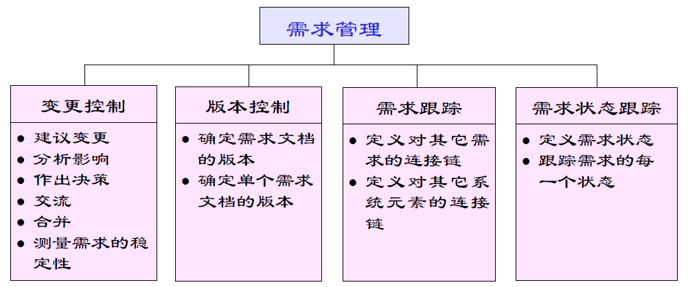{width=55%}

{width=55%}

其中，需求管理活动对变更的控制流程如图所示。

{width=65%}

## 需求获取技术

常用获取技术包括：**用户面谈**（理解业务功能最有效，应做好谈前准备、谈中深究、谈后整理）；**需求专题讨论会**（项目主要风险承担人 1~2 天集中讨论，快速达成共识并建立团队）；**问卷调查**（适合确认假设、收集统计倾向，但难以探索新领域）；**现场考察**（观察真实工作流程，理解业务细节与瓶颈）；**原型化方法**（用部分实现让用户的想象具体化，解决早期需求不确定问题）；**基于用例的方法**（以任务和用户为中心描述系统行为）。

需求获取的常见困难是：用户往往并不真正知道自己想要什么，业务语言与领域知识存在鸿沟，不同用户需求相互冲突，需求因环境变化而经常变更。破解之道在于充分识别利益相关者、通过多轮澄清迭代逼近真实需求。常用获取技术的适用场景与局限可对照如下表所示。

| 技术 | 适用场景 | 局限 |
|------|------|------|
| 用户面谈 | 理解业务功能 | 依赖会谈准备与提问技巧 |
| 专题讨论会 | 快速达成共识 | 参与范围有限 |
| 问卷调查 | 确认假设、统计倾向 | 难以探索新领域 |
| 现场考察 | 理解业务细节与瓶颈 | 观察易受干扰 |
| 原型化方法 | 早期需求不确定 | 原型易被误当作成品 |
| 基于用例 | 以任务和用户为中心 | 用例范围需精心界定 |

需求获取技术的分类与选择如图所示。

{width=85%}

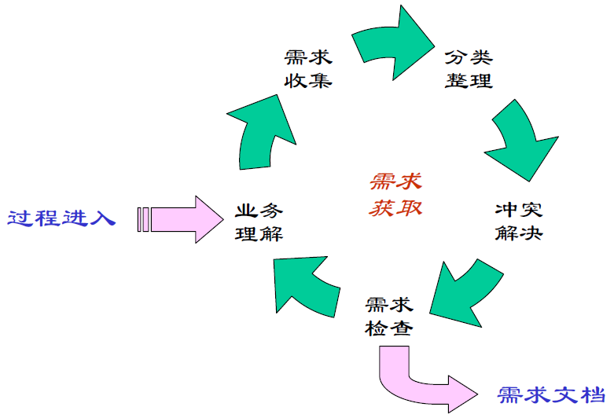{width=60%}

## 案例：需求错误的代价随阶段增长

需求错误的代价与发现时机密切相关：**缺陷发现得越晚，修复成本越高**。软件工程经济学奠基人 Boehm 对 IBM 等大型项目统计出的经验广为引用：需求阶段发现并修复缺陷的相对代价记为 1，进入设计阶段约为 3～6，编码阶段约 10，测试阶段约 15～40，而系统上线后再去修复，代价可达需求阶段的数十倍。

| 发现阶段 | 相对修复代价（约） | 示例 |
|------|------|------|
| 需求分析 | 1 | 借阅期限写错，改一条需求陈述 |
| 系统设计 | 3～6 | 改借阅流程图与数据模型 |
| 编码 | 10 | 重写借阅模块的判断逻辑 |
| 测试 | 15～40 | 重测全部借阅用例并回归 |
| 上线运行 | 数十倍 | 改数据库、迁移存量数据并发布补丁 |

以图书馆系统的借阅期限为例：需求阶段发现"应允许读者借阅 14 天而非 7 天"，只需改一条需求陈述；若上线后才被发现，则要修改数据校验、逾期罚则、数据库存量数据与读者通知文案，甚至牵连已开出的罚单纠纷。同样的错误，越晚纠正代价越高——这正是"需求是成本杠杆"一语的由来。尽早评审、尽早验证，是压缩全周期成本最有效的杠杆。

## 样例：模糊需求与明确需求的改写

模糊需求之所以危险，在于它**无法度量、无法验证、无法验收**。以"系统要快"为例，不同人对"快"的理解完全不同——有人指首页打开，有人指查询返回，还有人指批量导出。把模糊需求改写为明确需求，核心是补全三要素：**可度量的指标、明确的边界条件、可接受的阈值**。

| 原文（模糊） | 问题 | 改写后（明确） |
|------|------|------|
| 系统要快 | "快"是主观词，无法度量 | 常规查询在 95% 情况下 1 秒内返回 |
| 界面要友好 | 无验收标准，无从评审 | 新用户无需培训即可完成首次借阅 |
| 系统要可靠 | 缺乏量化目标 | 年可用性不低于 99.9%，每月计划外停机不超过 2 小时 |
| 支持大数据量 | 未界定规模与性能 | 在约十万册藏书规模下检索不超时，结果分页返回 |

改写后每条需求都给出"何时算达标"的判据，既便于评审确认，也直接成为验收测试的依据——这正是本章 SRS 质量特性中"可验证"的落地形态。若某项指标一时无法量化，也应标注"待量化"并写明预计的量化方式，而不是放任主观词滑过。

## 案例：需求评审挽救项目的典型经历

以下是一个**典型的示意性案例**。某高校图书馆委托开发图书预订系统，客户在访谈中多次提到"读者要能支付押金与逾期罚款"，分析员默认为"线下到馆交款"，并据此设计了"读者到馆后由前台确认收款"的流程。

需求规格说明评审会上，一位图书馆员随口问道："到时候支付宝扫码是不是直接弹出来？"全场这才意识到：客户预期的"支付"是**在线支付**，而文档写的是**线下转账**。两种理解对应完全不同的数据流、安全要求与交互界面——若按错误理解编码，支付子系统将整体推翻重做，工期与成本不可估量。

这次评审发生在编码之前，纠正成本只是改写若干需求条目。评审的价值正在于此：**让不同相关者对同一句话达成一致理解**。会议上的常见问法——"这里的具体含义是什么""这个术语在不同部门是否同义""这条假设有谁核实过"——都能在编码前把类似的歧义与错误假设暴露出来。评审看似多花了半天，却可能省下数周的重做时间。

## 样例：从访谈记录到需求条目的映射

需求获取的产出必须能追溯来源，形成**证据链**：每一条需求条目都能回到访谈中的原话。以下是一段简短的客户访谈记录（示意），演示如何把它映射为功能需求（FR）与非功能需求（NFR）条目。

```text
客户：我们馆大概有两万多名注册读者，平时借还书高峰都在中午，排队特别长。
分析员：那自助借还机是不是能缓解？
客户：应该能。最好能刷校园卡直接借，不用先办证。
分析员：逾期了怎么办？
客户：逾期的话希望能自动提醒，最好发到手机上。
分析员：这个提醒要及时吗？
客户：当天就要提醒吧，拖到第二天就晚了。
```

| 来源句子 | 需求条目 | 类型 |
|------|------|------|
| "刷校园卡直接借，不用先办证" | FR-1 支持校园卡直接识别读者并借书 | 功能 |
| "逾期的话希望能自动提醒，最好发到手机上" | FR-2 逾期后自动发送提醒到读者手机 | 功能 |
| "当天就要提醒吧" | NFR-1 逾期提醒当天内发出，延误不超过 24 小时 | 非功能 |
| "两万多名注册读者，中午是高峰" | NFR-2 支持约两万名读者，午间高峰借还响应不降级 | 非功能 |

映射的关键不在照抄原话，而在**把自然语言转译为可验证的表述**：客户说"要及时"，条目写成可测的时限；客户说"人多"，条目界定规模与场景。每一条都保留来源句子，评审时可回到原话核对，这正是需求获取证据链的体现，也是本章"可跟踪"质量特性在源头上的落实。访谈中未明确的细节（如提醒的具体渠道）应标注"待确认"，而非猜测补全。

## 用例建模与需求分析

**用例模型**以任务和用户为中心，建模步骤为：确定参与者（与系统交互的外部实体，可以是人、外部系统或硬件）、确定场景、确定用例、确定用例间关系、编写用例描述。用例描述一个完整的系统事件流程，关注参与者与系统的交互及可观测结果，而非系统内部活动。

{width=55%}

需求分析的核心是**建立分析模型**：定义系统边界、分析需求可行性、确定需求优先级，通过事件列表、数据流图、实体关系图、状态转换图、用例图等多种视图揭示需求的不一致与遗漏，并以数据字典统一术语。

{width=55%}

## 需求规格说明

需求规格说明（SRS）精确阐述系统必须提供的功能、性能与限制条件，是用户、分析员与设计人员交流的契约，支撑系统测试并用于规划控制开发过程。SRS 应描述"做什么"而不描述"怎么做"，必须说明运行环境，力求恰如其分的详细程度并避免模糊主观的术语（如"用户友好""快速"）。IEEE 830-1998 提供了标准模板。

好的 SRS 应具备**正确、无二义、完整、可验证、一致、可修改、可跟踪**等质量特性。例如"如果用户试图透支，系统将采取适当的行动"因不可验证而无二义；"系统将在 20 秒内响应所有有效请求"则具体可测。各项特性的含义与示例对照如下表所示。

| 质量特性 | 含义 | 示例 |
|------|------|------|
| 正确 | 每条需求正确描述所需功能 | 计算规则与业务约定一致 |
| 无二义 | 每条需求只有一种解释 | 避免"快速""用户友好"等主观词 |
| 完整 | 包含所有功能与性能需求 | 覆盖正常与异常路径 |
| 可验证 | 存在有限代价的方法验证实现 | "系统将在 20 秒内响应所有有效请求" |
| 一致 | 需求之间不冲突 | 术语与约束前后一致 |
| 可修改 | 结构与风格便于修改 | 按主题编号、避免重复 |
| 可跟踪 | 每项需求可追溯到来源与实现 | 需求编号与设计、测试对应 |

SRS 的七项质量特性共同保证规格的可用性，如图所示。

{width=65%}

这些特性大多难以直接度量，主要依靠编写规范与评审来保证。

## 智能化需求分析

传统需求分析依赖分析师的领域知识与面谈技巧，成本高且易遗漏。智能化需求分析工具利用大语言模型提供多项能力：从会议纪要、客户访谈记录中**自动抽取**需求条目与利益相关者诉求；将自然语言需求**转换**为用例、数据流图或形式化规格的初稿；检测需求描述的**二义性、矛盾与缺失**（对照完整性检查清单）；生成需求跟踪矩阵并辅助变更影响分析。

需要强调的是，AI 扮演的是"初稿生成器与检查员"，需求是否真实反映用户意愿仍需人工确认与评审——智能化让需求工程"更快、更全"，但"更准"的责任始终在人。

智能需求抽取的难点在于需求并不总是显式出现：用户的隐含需求、不同利益相关者之间相互冲突的诉求、以及业务规则中"理所当然"的假设，都难以从文本中自动识别。AI 的价值在于以较低成本扩大需求发现的覆盖面——把会议记录、用户反馈、竞品文档一并纳入分析，指出潜在的利益相关者与未被讨论的边界情形，再由分析人员逐一确认。二义性检测的技术路径通常分为两层：句法层面用规则与词法分析标记"用户友好""快速"这类不可验证的主观词与指代不清的代词；语义层面用大模型对照领域知识与完整性检查清单，识别相互矛盾与缺失的前提。两层结合可显著降低需求规格中"看似明确实则含糊"的比例。AI 在需求分析中的各项能力与人工把关点如下表所示。

| AI 能力 | 作用 | 人工把关 |
|------|------|------|
| 自动抽取 | 从会议纪要、访谈记录提取需求条目 | 确认是否真实反映用户意愿 |
| 自动转换 | 自然语言 → 用例、数据流图、规格初稿 | 审查转换结果的语义 |
| 二义性检测 | 识别主观词、矛盾与缺失前提 | 处置并确认检测出的问题 |
| 跟踪矩阵 | 生成需求跟踪矩阵与变更影响分析 | 核对映射关系 |

智能需求抽取把会议纪要加工为可验证的需求规格，流程如图所示。

{width=80%}

抽取的每一步都有人工确认环节——AI 让需求发现"更快、更全"，但"更准"的责任始终在人。

以自然语言需求描述为输入，LLM 生成用例与需求条目初稿的典型工作流如下：

1. **切分与定词**：把访谈记录、会议纪要按业务场景切分，先让 LLM 抽取术语生成数据字典草稿，统一后续输出的用词；
2. **抽取参与者与业务目标**：识别与系统交互的外部实体，归纳每条业务目标，作为用例清单的来源；
3. **生成候选用例**：为每个业务目标生成候选用例，标注优先级（高/中/低），剔除与系统无关的纯人工流程；
4. **细化用例描述**：对高优先级用例写出事件流初稿——主路径步骤化，异常路径用"若…则…"显式列出；
5. **对照质量特性自检**：以"正确、无二义、完整、可验证、一致、可修改、可跟踪"清单扫描初稿，输出疑点与缺失前提；
6. **人工确认成基线**：分析人员逐项确认、补充与否决，把初稿升级为需求基线。

把上述工作流的前四步落到一条提示词上，便是从自然语言生成用例与需求条目的模板：

```text
你是资深需求分析师。请根据以下自然语言描述，输出标准需求条目与用例初稿：
描述：<粘贴访谈记录或会议纪要原文>
要求：
1. 抽取功能需求与非功能需求，分别编号 FR-x、NFR-x；无法量化验证的项标注"待量化"；
2. 识别参与者，生成候选用例清单，每项标注优先级（高/中/低）与判断理由；
3. 为优先级为"高"的用例写出事件流：主路径分步编号，异常路径用"若…则…"逐条列出；
4. 对照"正确、无二义、完整、可验证、一致、可修改、可跟踪"逐条自检，输出疑点清单与缺失前提。
请先输出需求条目表，再输出用例描述，最后输出自检疑点。描述中未出现的内容不得编造，须标注"原文未提及"。
```

模板以"原文未提及"逼使模型对信息缺口明示而非补全，是控制 AI 幻觉的关键。用例的图形化表示将在本章 UML 部分介绍，由用例到分析模型的建立将在第 4 章展开。LLM 生成需求文档的局限与失败模式，大多与提示质量和上下文组织相关，常见者如下表所示。

| 失败模式 | 典型表现 | 应对要点 |
|------|------|------|
| 幻觉补全 | 原文未提及的规则、数值被当作需求写出 | 模板要求标注"原文未提及"，逐条核对来源 |
| 术语漂移 | 同一概念在不同条目中措辞不一 | 先抽数据字典统一用词，输出引用固定术语 |
| 上下文截断 | 跨文档的隐含约束未被纳入分析 | 把相关文档一并放入上下文，对照完整性清单逐项核对 |
| 提示词敏感 | 措辞微调导致输出差异很大 | 模板版本化，同一模板复跑并 diff，差异处人工重点核查 |

这四种失败模式共同指向一个事实：AI 生成的需求初稿必须回到"人确认"的闭环，覆盖面扩大不代替准确性判断。另一个常见误区是让模型一次性生成"完整"的需求文档——需求文档的完整性依赖利益相关者的多轮确认，机器只能给出结构化的骨架与候选清单。实践中建议按"需求条目 → 用例描述 → 规格初稿"分步产出、逐轮确认，并让每轮输出都引用来源条目，保持可追踪；非功能需求单独列成一张表，用可量化的指标替换"用户友好"这类主观词，这与本章前述 SRS 质量特性中的"可验证"一脉相承。

## 智能需求工程实践

智能需求工程的工具链覆盖需求工程五项活动：

| 需求工程活动 | 传统手段 | 智能工具 |
|------|------|------|
| 需求获取 | 面谈、专题讨论会、问卷 | 会议/访谈语音转写后由 LLM 抽取需求条目 |
| 需求分析 | 手工建模与检查 | 生成用例与分析模型初稿，检查不一致 |
| 规格说明 | 人工撰写 SRS | 辅助生成 SRS 初稿并检查二义性 |
| 需求验证 | 评审、原型评价 | 生成测试用例，模拟场景验证可测性 |
| 需求管理 | 人工跟踪与变更控制 | 生成需求跟踪矩阵，辅助变更影响分析 |

智能需求工程的典型工作流如图所示。

{width=90%}

实践中的典型流程是：用语音转写工具把需求讨论会录音转为文字，交由 LLM 按条目抽取业务目标、功能需求与非功能需求，生成待确认清单；分析人员对清单逐项确认、补充与否决，得到需求基线的初稿；随后以提示词让 AI 对照 IEEE 830 等模板检查完整性，生成用例初稿与需求跟踪矩阵，把"需求—用例—测试"的链路自动化。对话式需求澄清工具还能以问答方式向用户追问边界条件，进一步压缩需求的含糊空间。

下面以一个在线图书商城的"图书搜索"功能为例，演示这一流程。输入提示词为：

```text
请为在线图书商城生成"图书搜索"用例。需求描述：读者可按书名、作者或 ISBN 检索图书，结果按相关性排序并分页显示，无结果显示"未找到"。
输出要求：参与者、主路径、异常路径、优先级，并说明排序规则的来源。
```

AI 输出的片段为：参与者——读者；主路径——1. 读者输入关键词并选择检索字段；2. 系统按字段检索图书；3. 系统排序并分页显示结果；4. 读者浏览结果；异常路径——无结果时提示"未找到"，检索超时提示稍后重试；优先级——高。

评估发现两处问题：其一，AI 写出"按相关性排序"，却未给出相关性定义，属于原文未提及的补全，应改为业务可验证的排序规则；其二，漏掉了"ISBN 精确匹配应优先于模糊匹配"这一业务规则。把这两条写入提示词后重跑，第二版补齐了排序规则说明与精确匹配优先。AI 初稿与人工修正的对照如下表所示。

| 维度 | AI 首版 | 人工修正后 |
|------|------|------|
| 用例骨架 | 主路径、异常路径结构完整 | 保留结构，补排序规则与精确匹配优先 |
| 规则补全 | 未给出相关性定义 | 明确为业务可验证的排序规则 |
| 覆盖率 | 遗漏 ISBN 精确匹配业务规则 | 补入并标注优先级判断理由 |

与人工起草对比，AI 首版即给出结构完整的用例骨架，但业务规则与排序语义仍需分析人员逐条补全——若纯人工起草，同样的描述需要反复推敲措辞、逐条核对是否可测；AI 省去的是起草与措辞的机械劳动，而"这条规则是否符合业务实际""哪些诉求应当优先"仍然回到人工评审。起草成本下降，判断责任不变。

工具链上，对话式 LLM 结合需求模板（如 Confluence 的需求页面、Jira 的用户故事模板）是最轻量的组合，专业需求管理平台（如 IBM DOORS）则提供更强的跟踪矩阵与变更基线；选型要点是能否输出结构化条目、是否支持模板版本化与来源追溯。需求验证环节同样可以智能化：让 LLM 从每条用例生成可执行的验收测试用例初稿，与人工评审过的需求条目一一对应，为第 6 章的测试活动提供起点——但验收标准是否反映用户真实期望，仍须人工确认。

需求管理活动的智能化体现在变更影响分析上：当需求条目变更时，让 LLM 依据需求跟踪矩阵列出受影响的用例、测试与代码模块，并标出哪些条目之间存在潜在冲突，再由需求经理逐条裁决。这使本章前述需求管理活动中的变更控制有了可跟踪的处理路径，也让需求基线在 AI 时代保持可回溯。

值得重申的是，自动化覆盖的是"记录、整理、检查、跟踪"这些信息密集的机械工作，而"这条需求是否真的符合用户利益""哪些诉求应当优先"的判断只能由人做出。当被开发系统本身以 AI 为核心组件时，需求工程还需处理数据需求、模型性能目标等新课题，将在第 10 章讨论。

### 智能需求工程的常见陷阱

智能需求工程提高了需求处理的效率，也引入了新的陷阱。最常见的偏差是过度信任 AI 抽取的结果、把"覆盖面扩大"当作"准确性保证"。常见陷阱与对策如下表所示。

| 陷阱 | 后果 | 对策 |
|------|------|------|
| 直接采信抽取结果 | 隐含需求与冲突诉求被遗漏 | 抽取结果形成待确认清单，逐项人工确认 |
| 只查句法不查语义 | "看似明确实则含糊"的条目漏网 | 句法层标记主观词，语义层对照领域知识识别矛盾 |
| 忽略利益相关者覆盖 | 未被讨论的边界情形被忽略 | 把会议记录、用户反馈、竞品文档一并纳入分析 |
| 需求与用例、测试脱节 | 跟踪链断裂，变更影响难以评估 | 生成需求跟踪矩阵，把"需求—用例—测试"链路自动化 |

需求二义性检测的"句法层 + 语义层"两层机制如图所示。

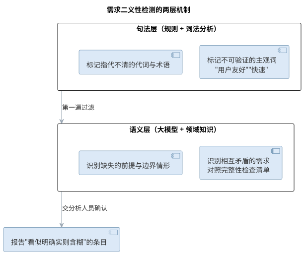{width=65%}

两层结合的目标不是消灭一切含糊——完全无二义的需求文档既不现实也不经济——而是把"看似明确实则含糊"的条目显式暴露出来，交由分析人员判断，使确认工作有的放矢。

### 前沿演进：需求即代码（Spec-as-Code）

前沿的需求实践把需求当作**可版本化、可机器校验的代码**来管理：需求以 Gherkin（Given-When-Then）、结构化规格或验收条件表达，纳入版本控制与评审；AI 从需求生成测试用例与实现骨架；CI 自动校验"需求是否可测、用例是否通过"。**行为驱动开发**（BDD）与需求即代码结合，使需求文档、测试与实现三者不再脱节，需求变更可追踪到测试与代码。实践要点如下表所示。

| 实践 | 说明 | 载体 |
|------|------|------|
| 规格文件化 | 需求写入仓库，随代码评审 | Gherkin、结构化 Markdown |
| 可测性前置 | 每条需求对应可执行用例 | Given-When-Then |
| AI 生成实现 | 从规格生成测试与骨架 | LLM + 规格解析 |
| CI 校验 | 需求变更自动回归 | 流水线执行规格测试 |

需求即代码的工作流——从规格文件到可执行契约——如图所示。

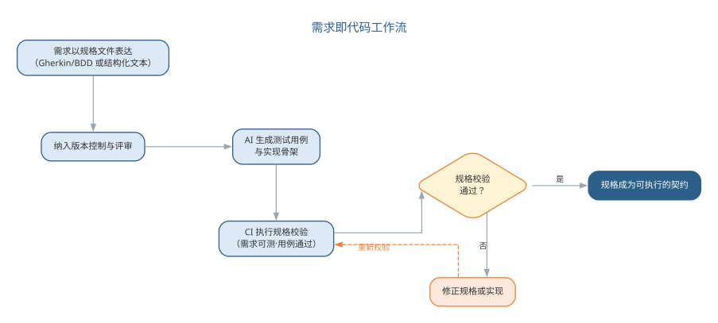{width=90%}

需求即代码把"需求工程"与"测试"融为一体，让"这条需求是否被正确实现"从评审主观判断变成 CI 客观校验；但"这条需求是否真的符合用户利益"仍然只能由人来确认。

需求规格说明确定了系统"应该做什么"，智能化需求分析还能自动生成用例、类图与顺序图的初稿。但这些需求要成为无歧义、可交流、可校验的模型，还需要一套统一的建模语言来承载——这正是 UML 的作用：把上述需求与设计建模表达为统一的图形符号，构成从需求通向设计与实现的语言桥梁。

UML（Unified Modeling Language，统一建模语言）是一种直观化、明确化、构建和文档化软件系统产物的通用可视化建模语言。它由 Booch、Rumbaugh、Jacobson 三人集 Booch 方法、OMT、OOSE 之长于 20 世纪 90 年代统一而成，后被 OMG 采纳为标准。

UML 不是可视化的程序设计语言，而是建模语言的**规格说明与表示标准**；它不是过程或方法，但允许任何过程和方法使用它。UML 的作用可以概括为四个方面：**可视化**——用一组语义明确的图形符号无歧义地交流模型；**详细描述**——精确描述分析、设计与实现决策；**构造**——模型可映射为 Java、C++ 等代码（正向工程），也可从代码逆向重构模型；**文档化**——为体系结构、需求、测试与发布管理提供文档。

## UML 的构成

UML 由三部分构成：**事物**（things）、**关系**（relationships）与**图**（diagrams）。

{width=55%}

**事物**表示系统中的元素，分为四类：结构事物（类、接口、构件、协作等）、行为事物（交互、状态机）、分组事物（包）与注释事物（注解）。其中，类是描述属性和操作的结构事物，属性写作 `[可见性] 名称[: 类型] [= 默认值]`，操作写作 `[可见性] 名称[(参数列表)][: 返回类型]`；可见性包括公有的 `+`、受保护的 `#` 与私有的 `-`。

{width=50%}

**关系**表示元素之间如何连接，包括：**关联**（描述一组对象间的结构连接，可带角色、多重性与限定符，聚合与组合是其整体—部分特例）、**依赖**（使用关系，一个事物的变化影响另一事物）、**泛化**（特殊与一般的关系，即继承）、**实现**（一个类元指定由另一类元保证执行的契约，如接口与其实现类之间）。

{width=50%}

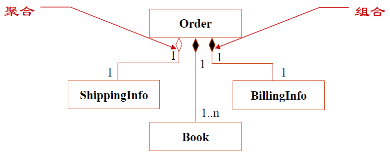{width=50%}

UML 图按描述静态结构还是动态行为可分为两大类，常见的图归类如下表所示。

| 类别 | 所包含的图 | 描述内容 |
|------|------|------|
| 结构图 | 类图、对象图、组件图、部署图、包图 | 系统的静态结构 |
| 行为图 | 用例图、顺序图、协作图、状态图、活动图 | 系统的动态行为 |

结构图与行为图的分类关系如图所示。

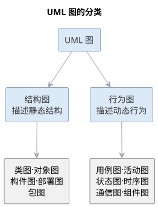{width=55%}

## UML 的图

UML 2.0 定义了 13 种图，按视图可以分为三类：

| 类别 | 图 | 用途 |
|------|----|------|
| 功能视图 | 用例图 | 需求获取、系统功能，测试依据 |
| 结构视图 | 类图、对象图、组件图、部署图 | 静态结构、物理架构 |
| 行为视图 | 顺序图、协作图、状态图、活动图 | 动态行为、交互与控制流 |

**用例图**从系统外部描述功能需求，表示用例、参与者及其关系。用例是系统功能被描述成的一系列事件，最终对参与者产生可观测、有价值的成果。用例之间存在**包含**（基本用例引用共性用例）、**扩展**（异常或可选分支作为独立用例）、**泛化**（一般与特殊关系）三种关系。用例描述应使用主动语句、主语为参与者或系统，只写可观测结果而不涉及实现与界面细节。

{width=55%}

**类图**描述系统的静态结构，包括类、关系及属性和操作，在需求、设计、实现三个阶段分别以概念层、说明层、实现层不同抽象层次出现。**对象图**是类图在某一时刻的实例快照。

{width=55%}

**顺序图**描述完成某项行为的对象间传递消息的时间顺序，由对象、生命线、控制焦点与消息组成，常用于表达一个用例的事件流。**协作图**反映收发消息的对象间结构组织，与顺序图同构、可以互转。

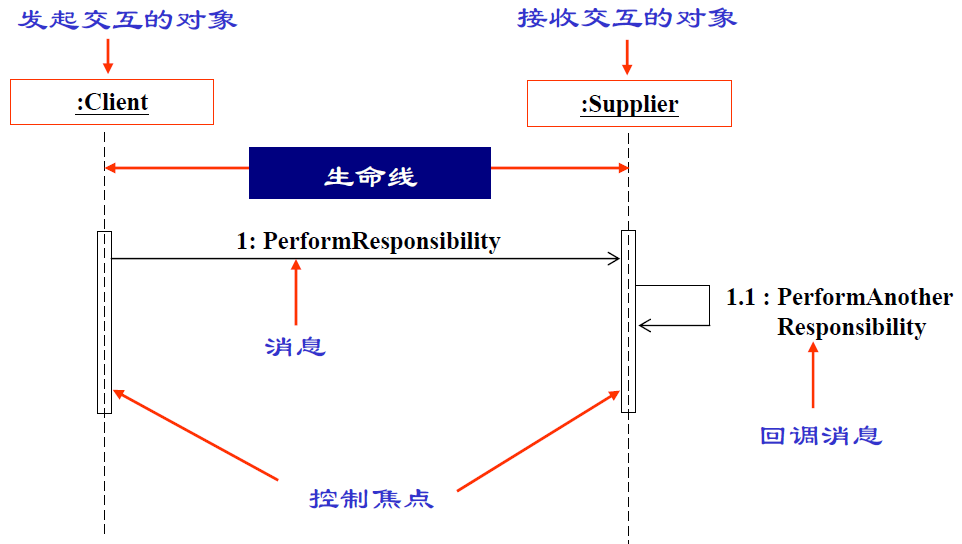{width=55%}

**状态图**描述单个对象在其生命周期中的状态序列与触发状态转移的外部事件，包含状态（初态、终态、中间态、组合态、历史态）、事件、转换、活动与动作等元素。

{width=50%}**活动图**描述从活动到活动的控制流，强调并发、分支与泳道，适合分析用例、理解跨用例工作流；状态图偏重对象状态变迁，活动图偏重流程控制，二者使用场合不同。

{width=55%}

**组件图**表示系统的静态实现视图，描述组件及其依赖关系；**部署图**反映软件与硬件的物理架构，表示运行时的处理节点及组件配置。

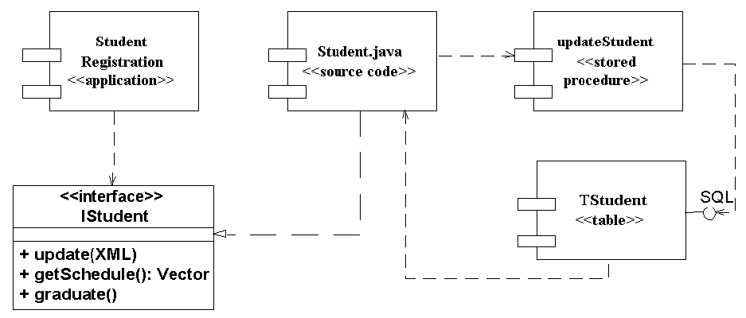{width=50%}

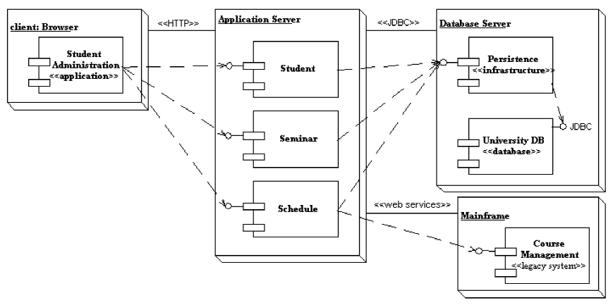{width=50%}此外，**OCL（对象约束语言）**是施加于模型元素上的形式约束语言，弥补了图形模型在精确性上的不足。

## AI 辅助建模

传统建模依赖建模者逐图手工绘制，工作量大且容易与代码脱节。AI 辅助建模改变了这一局面：大语言模型可以从自然语言需求**智能提取**并生成用例图、类图与顺序图的初始版本；从已有代码**逆向生成** UML 模型，保持模型与实现同步；从 UML 模型**生成测试用例与文档**，并利用 OCL 约束校验模型一致性。人机协作的典型分工是：人类确定语义与边界，AI 完成符号转换与版本维护，从而把建模的重心从"画图"拉回"思考"。

模型生成的质量取决于输入描述的精确程度与校验闭环的完备程度。自然语言到 UML（NL2UML）的生成要得到可用结果，通常需要给出足够的语义约束：类之间的关系是关联还是聚合、消息的触发顺序如何、状态转移的条件是什么——这些在生成前必须由建模者明确，否则模型虽"形似"却"神离"。因此 AI 辅助建模不是"一句话生成模型"，而是"人提供语义骨架，AI 填充图形符号"，生成结果必须经过可执行校验——检查类间关系的合法性、状态的完备性与一致性——才能进入基线。

另一个必须正视的问题是**模型与代码的漂移**。传统项目中模型往往在开发后即束之高阁，与实现渐行渐远；AI 时代的双向转换让"模型—代码"同步的成本大幅下降——从需求生成模型、从模型生成代码、从代码逆向模型可以形成闭环，使模型重新成为"活文档"。但要避免的是过度依赖自动同步而放弃对模型的维护：模型的价值在于沉淀设计决策，若仅作代码的镜像则冗余，若脱离代码则失真，维护的平衡点取决于团队把模型当作"沟通工具"还是"验证基线"。

模型与代码双向同步的闭环如图所示。

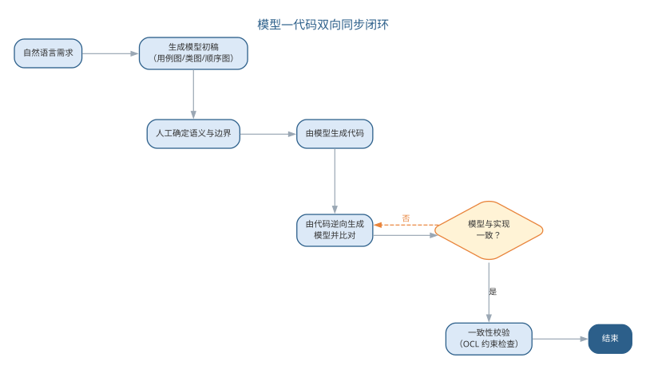{width=80%}

NL2UML 要生成可用模型，关键是把语义约束写进提示词。所谓语义约束，是描述中已经明确的类间关系类型、多重性、消息触发顺序与状态转移条件——这些必须在生成前由建模者确认，模型才会"形似且神离不"。一个从自然语言生成类图与顺序图草稿的提示词模板如下：

```text
你是资深建模师。请根据下列需求描述生成 PlantUML 类图与顺序图草稿：
需求描述：<粘贴用例事件流或需求条目>
语义约束（逐条遵守）：
1. 关系类型：仅在描述出现"包含/拥有/由…组成"等整体—部分语义时使用组合或聚合，其余一律用普通关联，禁止臆测；
2. 多重性：无明确数量关系时用 0..*，并标注"待确认"；
3. 顺序图：只画描述中明确出现的消息，按编号排列；触发顺序不明确时列出候选顺序并说明；
4. 命名：类、属性、方法用英文命名，附中文注释说明职责；
5. 输出可编译的 PlantUML 代码，随后给出 100 字以内的语义假设说明。
```

模板中的"禁止臆测""待确认""候选顺序"都是把不确定性显式化的写法：让模型对描述未覆盖的部分明示而非补全，建模者据此决定是补充需求还是调整模型。语义约束的常见写法如下表所示。

| 语义约束 | 模板写法 | 目的 |
|------|------|------|
| 关系类型 | 仅在出现整体—部分语义时用组合/聚合 | 防止臆造聚合关系 |
| 多重性 | 无明确数量关系时用 0..* 并标注待确认 | 把不确定性显式化 |
| 消息顺序 | 触发顺序不明确时列出候选顺序 | 暴露时序缺口 |
| 属性与操作 | 只保留描述中出现的属性，禁止杜撰 | 控制模型补全 |
| 命名与注释 | 英文命名 + 中文注释职责 | 保证可读可追溯 |

生成结果不能凭"看起来对"就进入基线，而应逐项校验。建模校验清单按关系合法性与状态完备性两组组织：

| 校验组 | 检查项 |
|------|------|
| 关系合法性 | 关联/聚合/组合的使用与描述一致，无凭空臆测的聚合或组合 |
| 关系合法性 | 多重性数值与描述一致，标注"待确认"的项已逐一核实 |
| 关系合法性 | 泛化方向正确（子类指向父类），无循环继承 |
| 状态完备性 | 每个状态图都有明确的初态与终态 |
| 状态完备性 | 每个状态转移都标注触发事件与条件，无无条件跳转 |
| 状态完备性 | 状态在生命周期内可达且可到达终态，无死状态 |
| 一致性 | 顺序图消息可追溯到用例事件流，无多余或缺失的消息 |

把校验清单写成可执行断言，就是"建模即代码"的雏形：关系合法性可用脚本扫描模型文本，状态完备性可由状态机工具验证，二者均可接入 CI，让模型在每次变更后像代码一样自动回归。除了语义约束，建模者还要决定生成哪类图、细到什么程度——不同阶段对抽象层次的要求不同，需求阶段的概念层类图只表达领域概念，设计阶段的说明层才细化操作与可见性。常见做法是让 LLM 按抽象层次分别生成，避免一张类图"既想表达概念又想表达实现"，抽象层次的选择要点如下表所示。

| 抽象层次 | 建模对象 | AI 生成要点 |
|------|------|------|
| 概念层 | 领域概念与关系 | 只保留名词性概念，不写操作与可见性 |
| 说明层 | 接口与协作 | 补操作签名、消息序列 |
| 实现层 | 类与代码对应 | 补属性类型、可见性，可与代码逆向互检 |

从需求文本出发，各类图的生成顺序也有讲究：通常先用例图界定系统边界，再以类图沉淀概念结构，顺序图与状态图补充动态行为。一次让模型同时产出四类图，往往彼此矛盾；按"边界 → 结构 → 行为"分步生成、逐次校验，更容易定位不一致。生成顺序与校验重点如下表所示。

| 步骤 | 生成图 | 校验重点 |
|------|------|------|
| 1 | 用例图 | 参与者完整、用例覆盖需求 |
| 2 | 类图 | 关系合法、多重性合理 |
| 3 | 顺序图 | 消息可追溯、时序清晰 |
| 4 | 状态图 | 初态终态齐备、转移条件完整 |

这四步生成的图共同构成模型的多个视图，视图之间的一致正是"模型与代码不漂移"的前提。

校验清单的分工也需要明确：机器可以自动检查多重性、转移条件是否齐备，但"这个多重性是否符合业务实际""这条转移条件是否覆盖了异常路径"仍须建模者对照业务确认。清单的价值在于把校验变成可勾选的流程，让"人工看图"变成"机器检查 + 人工裁决"。

## 智能建模实践

智能建模的常用载体是**文本化建模语言**：Mermaid 与 PlantUML 用文本描述图形结构，既便于版本管理，又天然适合由大模型生成——建模者用自然语言描述需求，LLM 输出对应的文本建模代码，再渲染为图形。实践要点如下：

- **先定语义后生成符号**：在提示词中明确类、关系与边界条件，让模型输出可编译的建模文本，避免直接生成位图式图片；
- **以代码逆向保持同步**：定期让 LLM 从当前代码库逆向生成类图与调用关系，与设计文档比对，及时发现模型与实现的偏差；
- **用约束语言校验**：对关键不变式用 OCL（对象约束语言）或等效断言描述，由工具检查模型是否违反约束，把"人工看图"升级为"机器校验"。

模型一致性校验与形式化方法一脉相承，第 7 章将讨论 OCL 约束如何与形式化验证结合。就本章而言，记住建模的初衷即可：模型是思考与沟通的工具，AI 让"画图"变得廉价，从而把建模者的精力还给"想清楚"。常用文本化建模语言的对比如下表所示。

| 语言 | 特点 | 适合场景 |
|------|------|------|
| Mermaid | 语法简洁、图表类型丰富 | 快速绘制流程图、时序图 |
| PlantUML | 面向 UML、支持类图/活动图/时序图 | 规范化的 UML 建模 |

文本化建模的工作流——从自然语言到可校验的模型——如图所示。

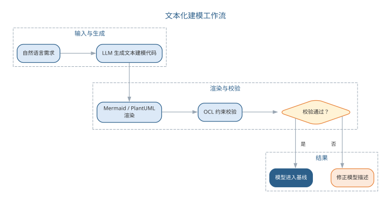{width=80%}

模型以文本形式存在，天然可版本化、可评审，也天然适合由 LLM 生成与修改。

一个完整的智能建模实例：需求为"读者注册后可多次借书，一本书同一时间只能被一人借出，逾期未还要缴纳滞纳金"。建模者的提示词为：

```text
根据借阅需求生成类图草稿：涉及读者、图书、借阅记录三类；读者可多次借书，一本书同一时间只能被借出一次；借阅记录保存借出日期与归还日期，逾期产生滞纳金。
输出 PlantUML 类图，明确关系类型、多重性，并标注描述中未明确的部分。
```

AI 首版输出 Reader、Book、BorrowRecord 三个类，把"读者—借阅记录"与"图书—借阅记录"均识别为 1..* 关联，属性含借出日期、归还日期与滞纳金金额。评估发现两处问题：其一，"一本书同一时间只能被借出一次"是唯一性约束而非关系，首版模型没有表达；其二，滞纳金是派生结果，作为属性存储与事实不符，应记录归还日期、由规则计算。把这两条作为语义约束写入提示词后，第二版在借阅记录上标注了唯一性约束、删除了滞纳金属性，并补注了"逾期"的判断条件。用本章校验清单核对（多重性、唯一性约束、可追溯用例）后进入基线。AI 首版与人工修正的对照如下表所示。

| 项目 | AI 首版 | 人工修正 |
|------|------|------|
| 关系识别 | 读者、图书与借阅记录均 1..* 关联 | 补充"同一时间唯一借出"的唯一性约束 |
| 属性处理 | 直接存储滞纳金金额 | 删除，改由归还日期与规则计算 |
| 约束表达 | 把约束混入关系 | 单独标注唯一性约束与逾期判断条件 |

与人工建模对比，人工建模同样先要澄清"同一时间唯一借出"这类约束，AI 首版把建模者的注意力从"画图"拉到"约束表达"，这正是语义层面的核心工作；模型以文本形式生成，可 diff、可版本化，审查对象从图片变成可追溯的文本。

工具层面，文本化建模已足够支撑多数团队：编辑器的 Mermaid 预览可即时渲染，PlantUML 更适合规范的 UML 图形；需要跨团队共享模型基线时，可选用带版本管理的在线建模平台，但选型不必复杂——能用文本管理、能被 CI 校验，就是底线。实践的合理节奏是：需求确认后先让 LLM 生成类图与顺序图草稿，评审定稿后接入模型校验，代码变更时逆向生成比对，形成"生成 → 评审 → 校验 → 同步"的循环。

### AI 辅助建模的要点与误区

AI 辅助建模的常见误区，是以为"一句话就能生成模型"，或把自动同步当作模型维护的替代。要点与误区对照如下表所示。

| 误区 | 典型表现 | 应对要点 |
|------|------|------|
| 一句话生成模型 | 不给语义约束就出类图 | 先定语义后生成符号，明确关联/聚合、时序与状态条件 |
| 结果不校验 | "形似神离"的模型进入基线 | 生成结果须经可执行校验（关系合法性、状态完备一致） |
| 过度依赖自动同步 | 模型沦为代码镜像 | 模型应沉淀设计决策，同步与维护并重 |
| 直接生成位图 | 模型无法版本管理与审查 | 用 Mermaid、PlantUML 等文本化建模语言 |

自然语言到 UML 生成的质量控制——以语义约束和可执行校验为两道闸门——如图所示。

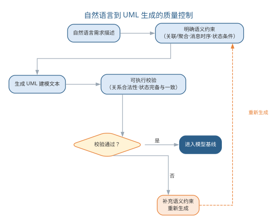{width=65%}

建模的初衷始终是：模型是思考与沟通的工具。AI 让"画图"变得廉价，从而把建模者的精力还给"想清楚"——语义边界、关系取舍与决策沉淀，这些仍然只能由人完成。

### 前沿演进：建模即代码与模型生成链

前沿建模实践强调**模型以文本形式存在**（Mermaid、PlantUML、OCL），从而可版本化、可审查、可由 AI 生成与维护。模型不再是"画出来的图"，而是与代码同级的工程资产：从模型文本渲染图形用于沟通，从模型生成代码骨架与测试，在 CI 中自动校验模型的语法与一致性，让"模型—代码—文档"三者持续同步。生成链的各环节如下表所示。

| 环节 | 做法 | 价值 |
|------|------|------|
| 模型文本化 | Mermaid/PlantUML 源码 | 可版本管理、可 diff 审查 |
| AI 生成 | 从需求生成建模文本 | 降低建模门槛 |
| 渲染与沟通 | 文本渲染为图形 | 多视图一致 |
| 生成与校验 | 生成代码/测试，CI 校验 | 模型可执行、可验证 |

建模即代码的生成链——从建模文本到同步的基线——如图所示。

{width=80%}

建模即代码把 UML 从"文档"变成"程序"：图形只是渲染视图，模型本身是可执行、可版本化、可校验的资产——这正是 AI 时代建模的核心形态。

## 本章小结

本章先讲需求工程，再讲 UML，两者互为表里：需求工程决定系统"是否做对了"，涵盖获取、分析、规格说明、验证与管理五项活动，需求分业务、用户、系统三个层次，SRS 的质量由正确、无二义、完整等七项特性保证；UML 则把这些需求与设计建模表达为统一的图形符号，由事物、关系与图三部分构成，结构图与行为图分别描述静态结构与动态行为，用例建模正是连接两者的桥梁。智能化让需求工程与建模都"更快、更全"——LLM 自动抽取需求、生成用例与模型初稿，但隐含需求、语义边界与业务判断仍需人工确认；NL2UML 生成须"先定语义后出符号"，结果须经可执行校验才能进入基线。需求即代码与建模即代码把需求、模型与测试连成可版本化、可机器校验的契约，"需求是否真的符合用户利益"与决策沉淀仍属于人。

**思考与讨论：**
1. 为什么说 AI 扩大的是需求发现的"覆盖面"而非"准确性"？结合需求抽取与 AI 辅助建模，举一个 AI 产出看似合理却遗漏业务规则或语义约束的例子。
2. 请设计一条从访谈记录生成需求条目与用例、或从自然语言生成类图与顺序图的提示词，并说明你设置了哪些检查项与原因。
3. 需求即代码与建模即代码都强调"可版本化、可机器校验"，能否完全取代人工评审？为什么？
4. 请用本章的建模校验清单检查一个你熟悉系统的类图与状态图，看看会发现哪些问题。
5. 模型与代码双向同步后，模型还会漂移吗？如何防止模型沦为代码的镜像？
