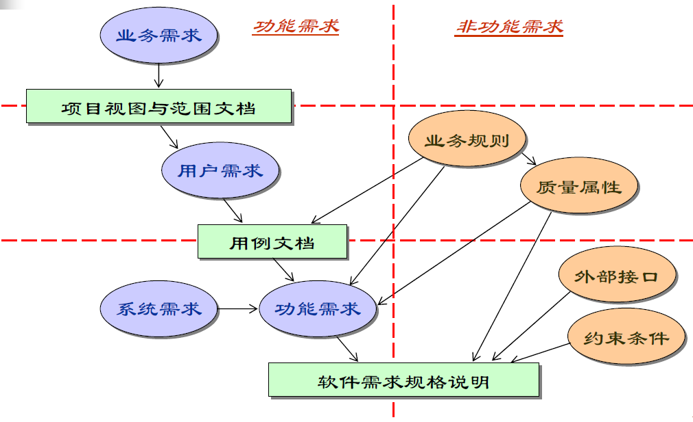
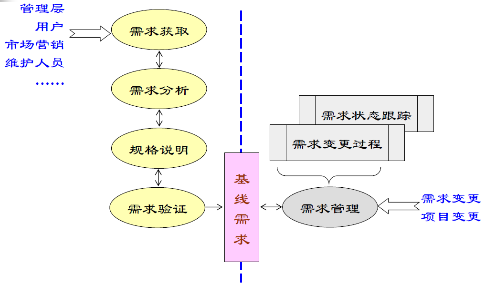
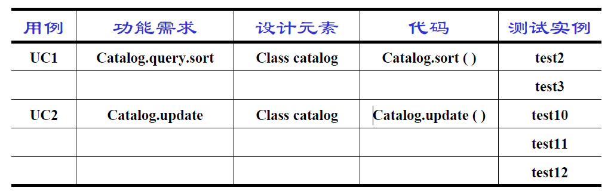
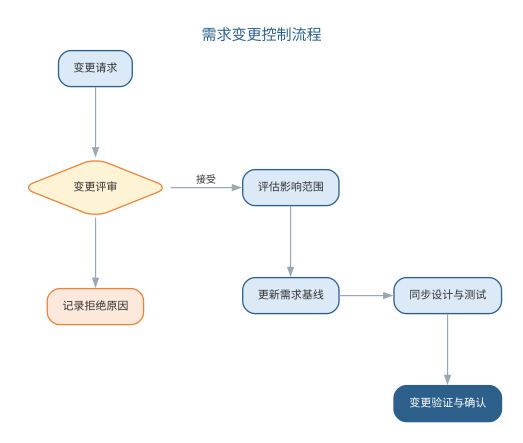
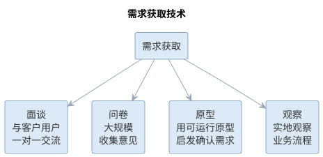
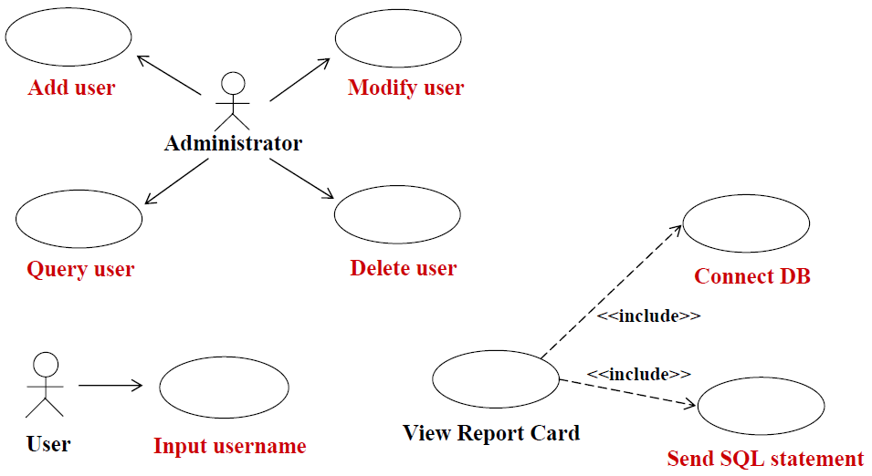
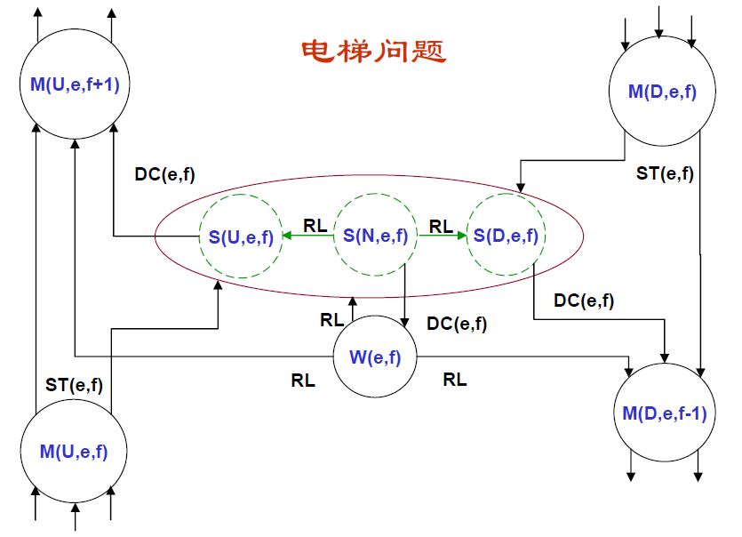
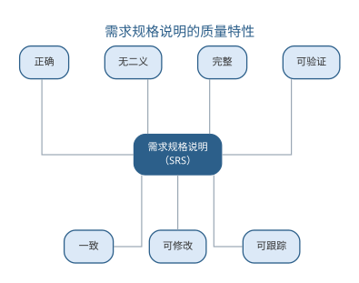
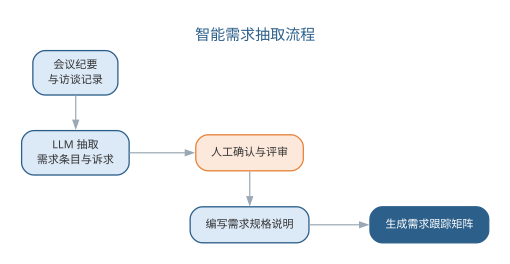
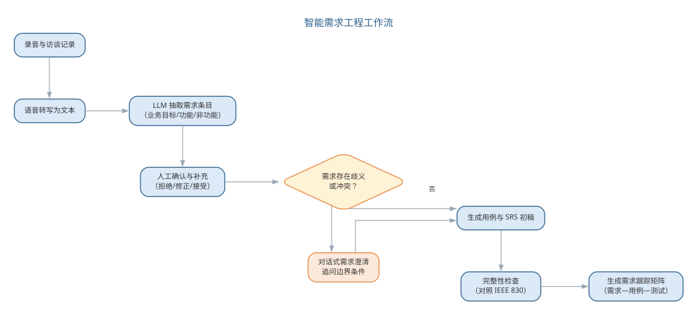

# 需求工程

软件需求是决定软件开发是否成功的关键因素。需求分析帮助我们真正理解业务问题、是成本与进度估算的基础、避免建造错误的系统、形成开发基线并支撑验收测试。许多项目"做出来了却不是用户想要的"，根源正在于需求环节的失误。

## 软件需求的概念

软件需求是指：用户解决问题或达到目标所需的条件或能力，以及系统或系统部件为满足合同、标准、规范所需具备的条件或能力。它既包含用户视角的**外部行为**，也包含开发人员视角的**内部特性**，关键在于需求必须**文档化**。

软件需求分为三个层次：

- **业务需求**：组织或客户对系统的高层次目标，定义项目的远景与范围——产品属于哪类业务、为谁服务、有何独特价值、优先级如何；
- **用户需求**：从用户角度描述系统的功能与非功能需求，只涉及外部行为，通常采用自然语言与直观图形相结合，易理解但容易含糊；
- **系统需求**：面向开发人员，详细描述系统应做什么，常借助对象模型、数据模型、状态模型等分析模型，是软件设计的基础。

{width=60%}

**功能需求**描述系统应提供的功能或服务；**非功能需求**则是对系统的约束，如性能、可用性、可靠性、安全性等，往往可以用度量指标加以量化，例如以"每秒处理的事务数"衡量速度、以"平均失败时间"衡量可靠性。
常见非功能需求的度量指标如下表所示。

| 特性 | 度量指标示例 |
|------|-------------|
| 性能 | 每秒处理的事务数、用户或事件的响应时间、屏幕刷新时间 |
| 存储空间 | 所需字节数、内存容量 |
| 可用性 | 培训时间、帮助页面数量 |
| 可靠性 | 平均失败时间、系统失效的概率、失败发生率 |
| 容错性 | 失败后的重启次数、事件引起失败的比例、失败时数据崩溃的可能性 |


## 需求工程的过程

需求工程是应用已证实有效的原理与方法，通过合适的工具和符号系统描述待开发系统及其行为特征和相关约束的工程活动，包括五项活动：

{width=60%}

- **需求获取**：聆听客户需求、观察用户行为，识别并协调各相关者的要求；
- **需求分析**：提炼、审查收集到的需求，建立分析模型，找出错误、遗漏与不一致；
- **需求规格说明**：以文档精确阐述系统必须提供的功能、性能与限制条件；
- **需求验证**：通过评审、原型评价、测试用例生成等手段确认需求符合用户意愿；
- **需求管理**：管理和控制需求变更，进行版本控制与需求跟踪。

五项活动的任务与主要产出可归纳如下表所示。

| 活动 | 主要任务 | 主要产出 |
|------|------|------|
| 需求获取 | 聆听、观察、识别并协调相关者要求 | 需求陈述与记录 |
| 需求分析 | 提炼审查、建立分析模型、找出不一致 | 分析模型与需求清单 |
| 规格说明 | 精确阐述功能、性能与限制条件 | 需求规格说明（SRS） |
| 需求验证 | 评审、原型评价、生成测试用例 | 验证记录与确认结果 |
| 需求管理 | 控制变更、版本控制与跟踪 | 变更记录与跟踪矩阵 |

{width=55%}

{width=55%}

其中，需求管理活动对变更的控制流程如图所示。

{width=65%}

## 需求获取技术

常用获取技术包括：**用户面谈**（理解业务功能最有效，应做好谈前准备、谈中深究、谈后整理）；**需求专题讨论会**（项目主要风险承担人 1~2 天集中讨论，快速达成共识并建立团队）；**问卷调查**（适合确认假设、收集统计倾向，但难以探索新领域）；**现场考察**（观察真实工作流程，理解业务细节与瓶颈）；**原型化方法**（用部分实现让用户的想象具体化，解决早期需求不确定问题）；**基于用例的方法**（以任务和用户为中心描述系统行为）。

需求获取的常见困难是：用户往往并不真正知道自己想要什么，业务语言与领域知识存在鸿沟，不同用户需求相互冲突，需求因环境变化而经常变更。破解之道在于充分识别利益相关者、通过多轮澄清迭代逼近真实需求。常用获取技术的适用场景与局限可对照如下表所示。

| 技术 | 适用场景 | 局限 |
|------|------|------|
| 用户面谈 | 理解业务功能 | 依赖会谈准备与提问技巧 |
| 专题讨论会 | 快速达成共识 | 参与范围有限 |
| 问卷调查 | 确认假设、统计倾向 | 难以探索新领域 |
| 现场考察 | 理解业务细节与瓶颈 | 观察易受干扰 |
| 原型化方法 | 早期需求不确定 | 原型易被误当作成品 |
| 基于用例 | 以任务和用户为中心 | 用例范围需精心界定 |

需求获取技术的分类与选择如图所示。

{width=85%}

{width=60%}

## 案例：需求错误的代价随阶段增长

需求错误的代价与发现时机密切相关：**缺陷发现得越晚，修复成本越高**。软件工程经济学奠基人 Boehm 对 IBM 等大型项目统计出的经验广为引用：需求阶段发现并修复缺陷的相对代价记为 1，进入设计阶段约为 3～6，编码阶段约 10，测试阶段约 15～40，而系统上线后再去修复，代价可达需求阶段的数十倍。

| 发现阶段 | 相对修复代价（约） | 示例 |
|------|------|------|
| 需求分析 | 1 | 借阅期限写错，改一条需求陈述 |
| 系统设计 | 3～6 | 改借阅流程图与数据模型 |
| 编码 | 10 | 重写借阅模块的判断逻辑 |
| 测试 | 15～40 | 重测全部借阅用例并回归 |
| 上线运行 | 数十倍 | 改数据库、迁移存量数据并发布补丁 |

以图书馆系统的借阅期限为例：需求阶段发现"应允许读者借阅 14 天而非 7 天"，只需改一条需求陈述；若上线后才被发现，则要修改数据校验、逾期罚则、数据库存量数据与读者通知文案，甚至牵连已开出的罚单纠纷。同样的错误，越晚纠正代价越高——这正是"需求是成本杠杆"一语的由来。尽早评审、尽早验证，是压缩全周期成本最有效的杠杆。

## 样例：模糊需求与明确需求的改写

模糊需求之所以危险，在于它**无法度量、无法验证、无法验收**。以"系统要快"为例，不同人对"快"的理解完全不同——有人指首页打开，有人指查询返回，还有人指批量导出。把模糊需求改写为明确需求，核心是补全三要素：**可度量的指标、明确的边界条件、可接受的阈值**。

| 原文（模糊） | 问题 | 改写后（明确） |
|------|------|------|
| 系统要快 | "快"是主观词，无法度量 | 常规查询在 95% 情况下 1 秒内返回 |
| 界面要友好 | 无验收标准，无从评审 | 新用户无需培训即可完成首次借阅 |
| 系统要可靠 | 缺乏量化目标 | 年可用性不低于 99.9%，每月计划外停机不超过 2 小时 |
| 支持大数据量 | 未界定规模与性能 | 在约十万册藏书规模下检索不超时，结果分页返回 |

改写后每条需求都给出"何时算达标"的判据，既便于评审确认，也直接成为验收测试的依据——这正是本章 SRS 质量特性中"可验证"的落地形态。若某项指标一时无法量化，也应标注"待量化"并写明预计的量化方式，而不是放任主观词滑过。

## 案例：需求评审挽救项目的典型经历

以下是一个**典型的示意性案例**。某高校图书馆委托开发图书预订系统，客户在访谈中多次提到"读者要能支付押金与逾期罚款"，分析员默认为"线下到馆交款"，并据此设计了"读者到馆后由前台确认收款"的流程。

需求规格说明评审会上，一位图书馆员随口问道："到时候支付宝扫码是不是直接弹出来？"全场这才意识到：客户预期的"支付"是**在线支付**，而文档写的是**线下转账**。两种理解对应完全不同的数据流、安全要求与交互界面——若按错误理解编码，支付子系统将整体推翻重做，工期与成本不可估量。

这次评审发生在编码之前，纠正成本只是改写若干需求条目。评审的价值正在于此：**让不同相关者对同一句话达成一致理解**。会议上的常见问法——"这里的具体含义是什么""这个术语在不同部门是否同义""这条假设有谁核实过"——都能在编码前把类似的歧义与错误假设暴露出来。评审看似多花了半天，却可能省下数周的重做时间。

## 样例：从访谈记录到需求条目的映射

需求获取的产出必须能追溯来源，形成**证据链**：每一条需求条目都能回到访谈中的原话。以下是一段简短的客户访谈记录（示意），演示如何把它映射为功能需求（FR）与非功能需求（NFR）条目。

```text
客户：我们馆大概有两万多名注册读者，平时借还书高峰都在中午，排队特别长。
分析员：那自助借还机是不是能缓解？
客户：应该能。最好能刷校园卡直接借，不用先办证。
分析员：逾期了怎么办？
客户：逾期的话希望能自动提醒，最好发到手机上。
分析员：这个提醒要及时吗？
客户：当天就要提醒吧，拖到第二天就晚了。
```

| 来源句子 | 需求条目 | 类型 |
|------|------|------|
| "刷校园卡直接借，不用先办证" | FR-1 支持校园卡直接识别读者并借书 | 功能 |
| "逾期的话希望能自动提醒，最好发到手机上" | FR-2 逾期后自动发送提醒到读者手机 | 功能 |
| "当天就要提醒吧" | NFR-1 逾期提醒当天内发出，延误不超过 24 小时 | 非功能 |
| "两万多名注册读者，中午是高峰" | NFR-2 支持约两万名读者，午间高峰借还响应不降级 | 非功能 |

映射的关键不在照抄原话，而在**把自然语言转译为可验证的表述**：客户说"要及时"，条目写成可测的时限；客户说"人多"，条目界定规模与场景。每一条都保留来源句子，评审时可回到原话核对，这正是需求获取证据链的体现，也是本章"可跟踪"质量特性在源头上的落实。访谈中未明确的细节（如提醒的具体渠道）应标注"待确认"，而非猜测补全。

## 用例建模与需求分析

**用例模型**以任务和用户为中心，建模步骤为：确定参与者（与系统交互的外部实体，可以是人、外部系统或硬件）、确定场景、确定用例、确定用例间关系、编写用例描述。用例描述一个完整的系统事件流程，关注参与者与系统的交互及可观测结果，而非系统内部活动。

{width=55%}

需求分析的核心是**建立分析模型**：定义系统边界、分析需求可行性、确定需求优先级，通过事件列表、数据流图、实体关系图、状态转换图、用例图等多种视图揭示需求的不一致与遗漏，并以数据字典统一术语。

{width=55%}

## 需求规格说明

需求规格说明（SRS）精确阐述系统必须提供的功能、性能与限制条件，是用户、分析员与设计人员交流的契约，支撑系统测试并用于规划控制开发过程。SRS 应描述"做什么"而不描述"怎么做"，必须说明运行环境，力求恰如其分的详细程度并避免模糊主观的术语（如"用户友好""快速"）。IEEE 830-1998 提供了标准模板。

好的 SRS 应具备**正确、无二义、完整、可验证、一致、可修改、可跟踪**等质量特性。例如"如果用户试图透支，系统将采取适当的行动"因不可验证而无二义；"系统将在 20 秒内响应所有有效请求"则具体可测。各项特性的含义与示例对照如下表所示。

| 质量特性 | 含义 | 示例 |
|------|------|------|
| 正确 | 每条需求正确描述所需功能 | 计算规则与业务约定一致 |
| 无二义 | 每条需求只有一种解释 | 避免"快速""用户友好"等主观词 |
| 完整 | 包含所有功能与性能需求 | 覆盖正常与异常路径 |
| 可验证 | 存在有限代价的方法验证实现 | "系统将在 20 秒内响应所有有效请求" |
| 一致 | 需求之间不冲突 | 术语与约束前后一致 |
| 可修改 | 结构与风格便于修改 | 按主题编号、避免重复 |
| 可跟踪 | 每项需求可追溯到来源与实现 | 需求编号与设计、测试对应 |

SRS 的七项质量特性共同保证规格的可用性，如图所示。

{width=65%}

这些特性大多难以直接度量，主要依靠编写规范与评审来保证。

## 智能化需求分析

传统需求分析依赖分析师的领域知识与面谈技巧，成本高且易遗漏。智能化需求分析工具利用大语言模型提供多项能力：从会议纪要、客户访谈记录中**自动抽取**需求条目与利益相关者诉求；将自然语言需求**转换**为用例、数据流图或形式化规格的初稿；检测需求描述的**二义性、矛盾与缺失**（对照完整性检查清单）；生成需求跟踪矩阵并辅助变更影响分析。

需要强调的是，AI 扮演的是"初稿生成器与检查员"，需求是否真实反映用户意愿仍需人工确认与评审——智能化让需求工程"更快、更全"，但"更准"的责任始终在人。

智能需求抽取的难点在于需求并不总是显式出现：用户的隐含需求、不同利益相关者之间相互冲突的诉求、以及业务规则中"理所当然"的假设，都难以从文本中自动识别。AI 的价值在于以较低成本扩大需求发现的覆盖面——把会议记录、用户反馈、竞品文档一并纳入分析，指出潜在的利益相关者与未被讨论的边界情形，再由分析人员逐一确认。二义性检测的技术路径通常分为两层：句法层面用规则与词法分析标记"用户友好""快速"这类不可验证的主观词与指代不清的代词；语义层面用大模型对照领域知识与完整性检查清单，识别相互矛盾与缺失的前提。两层结合可显著降低需求规格中"看似明确实则含糊"的比例。AI 在需求分析中的各项能力与人工把关点如下表所示。

| AI 能力 | 作用 | 人工把关 |
|------|------|------|
| 自动抽取 | 从会议纪要、访谈记录提取需求条目 | 确认是否真实反映用户意愿 |
| 自动转换 | 自然语言 → 用例、数据流图、规格初稿 | 审查转换结果的语义 |
| 二义性检测 | 识别主观词、矛盾与缺失前提 | 处置并确认检测出的问题 |
| 跟踪矩阵 | 生成需求跟踪矩阵与变更影响分析 | 核对映射关系 |

智能需求抽取把会议纪要加工为可验证的需求规格，流程如图所示。

{width=80%}

抽取的每一步都有人工确认环节——AI 让需求发现"更快、更全"，但"更准"的责任始终在人。

以自然语言需求描述为输入，LLM 生成用例与需求条目初稿的典型工作流如下：

1. **切分与定词**：把访谈记录、会议纪要按业务场景切分，先让 LLM 抽取术语生成数据字典草稿，统一后续输出的用词；
2. **抽取参与者与业务目标**：识别与系统交互的外部实体，归纳每条业务目标，作为用例清单的来源；
3. **生成候选用例**：为每个业务目标生成候选用例，标注优先级（高/中/低），剔除与系统无关的纯人工流程；
4. **细化用例描述**：对高优先级用例写出事件流初稿——主路径步骤化，异常路径用"若…则…"显式列出；
5. **对照质量特性自检**：以"正确、无二义、完整、可验证、一致、可修改、可跟踪"清单扫描初稿，输出疑点与缺失前提；
6. **人工确认成基线**：分析人员逐项确认、补充与否决，把初稿升级为需求基线。

把上述工作流的前四步落到一条提示词上，便是从自然语言生成用例与需求条目的模板：

```text
你是资深需求分析师。请根据以下自然语言描述，输出标准需求条目与用例初稿：
描述：<粘贴访谈记录或会议纪要原文>
要求：
1. 抽取功能需求与非功能需求，分别编号 FR-x、NFR-x；无法量化验证的项标注"待量化"；
2. 识别参与者，生成候选用例清单，每项标注优先级（高/中/低）与判断理由；
3. 为优先级为"高"的用例写出事件流：主路径分步编号，异常路径用"若…则…"逐条列出；
4. 对照"正确、无二义、完整、可验证、一致、可修改、可跟踪"逐条自检，输出疑点清单与缺失前提。
请先输出需求条目表，再输出用例描述，最后输出自检疑点。描述中未出现的内容不得编造，须标注"原文未提及"。
```

模板以"原文未提及"逼使模型对信息缺口明示而非补全，是控制 AI 幻觉的关键。用例的图形化表示将在第 5 章介绍，由用例到分析模型的建立将在第 6 章展开。LLM 生成需求文档的局限与失败模式，大多与提示质量和上下文组织相关，常见者如下表所示。

| 失败模式 | 典型表现 | 应对要点 |
|------|------|------|
| 幻觉补全 | 原文未提及的规则、数值被当作需求写出 | 模板要求标注"原文未提及"，逐条核对来源 |
| 术语漂移 | 同一概念在不同条目中措辞不一 | 先抽数据字典统一用词，输出引用固定术语 |
| 上下文截断 | 跨文档的隐含约束未被纳入分析 | 把相关文档一并放入上下文，对照完整性清单逐项核对 |
| 提示词敏感 | 措辞微调导致输出差异很大 | 模板版本化，同一模板复跑并 diff，差异处人工重点核查 |

这四种失败模式共同指向一个事实：AI 生成的需求初稿必须回到"人确认"的闭环，覆盖面扩大不代替准确性判断。另一个常见误区是让模型一次性生成"完整"的需求文档——需求文档的完整性依赖利益相关者的多轮确认，机器只能给出结构化的骨架与候选清单。实践中建议按"需求条目 → 用例描述 → 规格初稿"分步产出、逐轮确认，并让每轮输出都引用来源条目，保持可追踪；非功能需求单独列成一张表，用可量化的指标替换"用户友好"这类主观词，这与本章前述 SRS 质量特性中的"可验证"一脉相承。

## 智能需求工程实践

智能需求工程的工具链覆盖需求工程五项活动：

| 需求工程活动 | 传统手段 | 智能工具 |
|------|------|------|
| 需求获取 | 面谈、专题讨论会、问卷 | 会议/访谈语音转写后由 LLM 抽取需求条目 |
| 需求分析 | 手工建模与检查 | 生成用例与分析模型初稿，检查不一致 |
| 规格说明 | 人工撰写 SRS | 辅助生成 SRS 初稿并检查二义性 |
| 需求验证 | 评审、原型评价 | 生成测试用例，模拟场景验证可测性 |
| 需求管理 | 人工跟踪与变更控制 | 生成需求跟踪矩阵，辅助变更影响分析 |

智能需求工程的典型工作流如图所示。

{width=90%}

实践中的典型流程是：用语音转写工具把需求讨论会录音转为文字，交由 LLM 按条目抽取业务目标、功能需求与非功能需求，生成待确认清单；分析人员对清单逐项确认、补充与否决，得到需求基线的初稿；随后以提示词让 AI 对照 IEEE 830 等模板检查完整性，生成用例初稿与需求跟踪矩阵，把"需求—用例—测试"的链路自动化。对话式需求澄清工具还能以问答方式向用户追问边界条件，进一步压缩需求的含糊空间。

下面以一个在线图书商城的"图书搜索"功能为例，演示这一流程。输入提示词为：

```text
请为在线图书商城生成"图书搜索"用例。需求描述：读者可按书名、作者或 ISBN 检索图书，结果按相关性排序并分页显示，无结果显示"未找到"。
输出要求：参与者、主路径、异常路径、优先级，并说明排序规则的来源。
```

AI 输出的片段为：参与者——读者；主路径——1. 读者输入关键词并选择检索字段；2. 系统按字段检索图书；3. 系统排序并分页显示结果；4. 读者浏览结果；异常路径——无结果时提示"未找到"，检索超时提示稍后重试；优先级——高。

评估发现两处问题：其一，AI 写出"按相关性排序"，却未给出相关性定义，属于原文未提及的补全，应改为业务可验证的排序规则；其二，漏掉了"ISBN 精确匹配应优先于模糊匹配"这一业务规则。把这两条写入提示词后重跑，第二版补齐了排序规则说明与精确匹配优先。AI 初稿与人工修正的对照如下表所示。

| 维度 | AI 首版 | 人工修正后 |
|------|------|------|
| 用例骨架 | 主路径、异常路径结构完整 | 保留结构，补排序规则与精确匹配优先 |
| 规则补全 | 未给出相关性定义 | 明确为业务可验证的排序规则 |
| 覆盖率 | 遗漏 ISBN 精确匹配业务规则 | 补入并标注优先级判断理由 |

与人工起草对比，AI 首版即给出结构完整的用例骨架，但业务规则与排序语义仍需分析人员逐条补全——若纯人工起草，同样的描述需要反复推敲措辞、逐条核对是否可测；AI 省去的是起草与措辞的机械劳动，而"这条规则是否符合业务实际""哪些诉求应当优先"仍然回到人工评审。起草成本下降，判断责任不变。

工具链上，对话式 LLM 结合需求模板（如 Confluence 的需求页面、Jira 的用户故事模板）是最轻量的组合，专业需求管理平台（如 IBM DOORS）则提供更强的跟踪矩阵与变更基线；选型要点是能否输出结构化条目、是否支持模板版本化与来源追溯。需求验证环节同样可以智能化：让 LLM 从每条用例生成可执行的验收测试用例初稿，与人工评审过的需求条目一一对应，为第 10 章的测试活动提供起点——但验收标准是否反映用户真实期望，仍须人工确认。

需求管理活动的智能化体现在变更影响分析上：当需求条目变更时，让 LLM 依据需求跟踪矩阵列出受影响的用例、测试与代码模块，并标出哪些条目之间存在潜在冲突，再由需求经理逐条裁决。这使本章前述需求管理活动中的变更控制有了可跟踪的处理路径，也让需求基线在 AI 时代保持可回溯。

值得重申的是，自动化覆盖的是"记录、整理、检查、跟踪"这些信息密集的机械工作，而"这条需求是否真的符合用户利益""哪些诉求应当优先"的判断只能由人做出。当被开发系统本身以 AI 为核心组件时，需求工程还需处理数据需求、模型性能目标等新课题，将在第 16 章讨论。

### 智能需求工程的常见陷阱

智能需求工程提高了需求处理的效率，也引入了新的陷阱。最常见的偏差是过度信任 AI 抽取的结果、把"覆盖面扩大"当作"准确性保证"。常见陷阱与对策如下表所示。

| 陷阱 | 后果 | 对策 |
|------|------|------|
| 直接采信抽取结果 | 隐含需求与冲突诉求被遗漏 | 抽取结果形成待确认清单，逐项人工确认 |
| 只查句法不查语义 | "看似明确实则含糊"的条目漏网 | 句法层标记主观词，语义层对照领域知识识别矛盾 |
| 忽略利益相关者覆盖 | 未被讨论的边界情形被忽略 | 把会议记录、用户反馈、竞品文档一并纳入分析 |
| 需求与用例、测试脱节 | 跟踪链断裂，变更影响难以评估 | 生成需求跟踪矩阵，把"需求—用例—测试"链路自动化 |

需求二义性检测的"句法层 + 语义层"两层机制如图所示。

{width=65%}

两层结合的目标不是消灭一切含糊——完全无二义的需求文档既不现实也不经济——而是把"看似明确实则含糊"的条目显式暴露出来，交由分析人员判断，使确认工作有的放矢。

### 前沿演进：需求即代码（Spec-as-Code）

前沿的需求实践把需求当作**可版本化、可机器校验的代码**来管理：需求以 Gherkin（Given-When-Then）、结构化规格或验收条件表达，纳入版本控制与评审；AI 从需求生成测试用例与实现骨架；CI 自动校验"需求是否可测、用例是否通过"。**行为驱动开发**（BDD）与需求即代码结合，使需求文档、测试与实现三者不再脱节，需求变更可追踪到测试与代码。实践要点如下表所示。

| 实践 | 说明 | 载体 |
|------|------|------|
| 规格文件化 | 需求写入仓库，随代码评审 | Gherkin、结构化 Markdown |
| 可测性前置 | 每条需求对应可执行用例 | Given-When-Then |
| AI 生成实现 | 从规格生成测试与骨架 | LLM + 规格解析 |
| CI 校验 | 需求变更自动回归 | 流水线执行规格测试 |

需求即代码的工作流——从规格文件到可执行契约——如图所示。

{width=90%}

需求即代码把"需求工程"与"测试"融为一体，让"这条需求是否被正确实现"从评审主观判断变成 CI 客观校验；但"这条需求是否真的符合用户利益"仍然只能由人来确认。

## 本章小结

需求工程决定系统"是否做对了"，涵盖获取、分析、规格说明、验证与管理五项活动，需求分业务、用户、系统三个层次，SRS 的质量由正确、无二义、完整等七项特性保证。智能化把 LLM 引入需求抽取、用例与规格生成、二义性检测与跟踪矩阵，让需求处理"更快、更全"；但 AI 产出的只是可追踪的初稿，隐含需求、冲突诉求与业务判断仍需人工确认，"更准"的责任始终在人。需求即代码（Spec-as-Code）把需求与测试、实现连接成可机器校验的契约，进一步压缩需求环节的含糊空间。

**思考与讨论：**
1. 为什么说 AI 扩大的是需求发现的"覆盖面"而非"准确性"？举一个 AI 抽取结果看似合理却遗漏业务规则的例子。
2. 请设计一条从访谈记录生成需求条目与用例的提示词，并说明你设置了哪些检查项与原因。
3. 需求即代码能否完全取代人工评审？为什么？
