# 软件设计与设计模式

软件设计是在分析模型的基础上研究软件实现问题，形成实现环境下的设计模型，其目标是在满足功能需求的前提下追求**高内聚、低耦合**的结构，使系统易于理解、修改与复用。本章从整体与局部两个层面展开：先讲软件设计，解决系统的整体结构——涵盖设计原理、体系结构设计、面向对象设计以及 AI 参与下的智能化设计；再讲设计模式，提供可复用的局部解决方案——模式是从大量成功实践中沉淀出的设计经验，描述常见问题的解决套路，供设计者在合适的变化点上复用。整体设计决定系统的骨架与全局组织，模式打磨构件之间的协作细节；先理解整体设计，再学习局部模式的复用，遵循"设计是源头、模式是沉淀"的顺序。

## 设计原理

设计的基本原理包括：

- **模块化**：将复杂系统分解为若干相对简单的子系统，通过抽象、逐步求精与信息隐藏组织模块层次；
- **模块独立**：用**耦合性**度量子系统之间的关联程度，用**内聚性**度量子系统内部的相关程度。耦合越松、内聚越高，系统越易维护；
- **复用**：利用已开发的软件元素生成新系统，提高效率与质量——工具包强调类级代码复用，架构强调构件级设计复用，模式强调方法的复用；
- **启发规则**：改进结构提高独立性、模块规模适中、深度宽度扇出扇入适当、作用域落在控制域之内、降低接口复杂度、设计单入口单出口模块等。

{width=50%}

其中，内聚性自低到高分为偶然、逻辑、时间、过程、通信、顺序、功能七类，功能性内聚最优；耦合性自弱到强分为非直接、数据、特征、控制、外部、公共、内容七类，数据耦合最优。

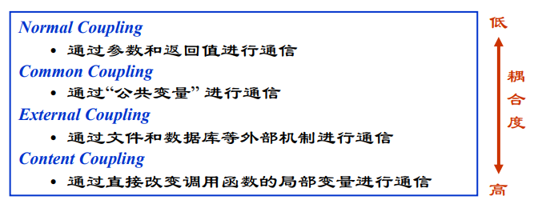{width=60%}

模块的规模与结构可用**扇入扇出**度量：设模块间调用关系为 $M\to M'$（$M$ 调用 $M'$），则模块 $M$ 直接调用的模块数称为扇出，直接调用 $M$ 的模块数称为扇入，度量式为：

$$f_{out}(M)=\#\{M'\mid M\to M'\},\qquad f_{in}(M)=\#\{M'\mid M'\to M\}$$

扇出过大说明模块承担职责过多、依赖面过宽，扇入过高则说明模块被过度共享、改动牵一发而动全身——启发规则中"深度宽度扇出扇入适当"正是对这两个度量的约束。耦合与内聚各自的七级划分可由弱到强对照如下表所示。

| 耦合等级 | 说明 | 内聚等级 | 说明 |
|------|------|------|------|
| 非直接耦合 | 模块间无直接联系 | 偶然内聚 | 元素无关联、机械组合 |
| 数据耦合 | 仅通过参数传递数据 | 逻辑内聚 | 若干逻辑功能合于一体 |
| 特征耦合 | 传递整个数据结构 | 时间内聚 | 同一时间执行的元素聚拢 |
| 控制耦合 | 传递控制信号 | 过程内聚 | 按特定顺序执行的元素 |
| 外部耦合 | 访问同一全局数据 | 通信内聚 | 访问同一数据集 |
| 公共耦合 | 共享公共数据环境 | 顺序内聚 | 前者的输出是后者的输入 |
| 内容耦合 | 直接访问内部内容 | 功能内聚 | 完成单一功能 |

## 体系结构设计

软件体系结构包括一组软件部件、部件的外部可见特性及其相互关系。体系结构设计的内容包括系统的总体组织与全局控制结构、通信与数据访问协议、设计元素的功能分配、非功能需求、物理部署以及备选方案的选择。

典型的体系结构风格有：

- **仓库/知识库结构**：以中心数据库为核心，适合数据由一个子系统产生、其他子系统使用的情形，如编译器与 CASE 工具；

  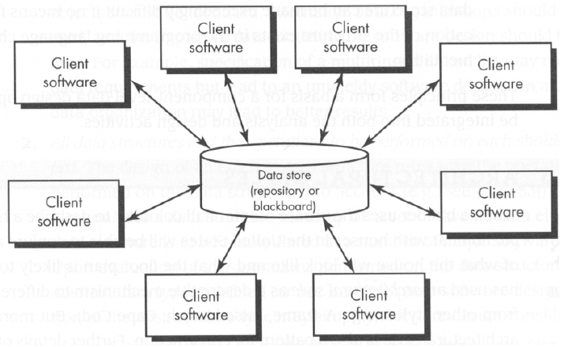{width=45%}
- **模型/视图/控制器（MVC）**：把交互系统分为模型（业务数据与逻辑）、视图（用户界面）与控制器（响应输入、更新视图与模型），适合同一模型需要多个视图的交互式系统；

  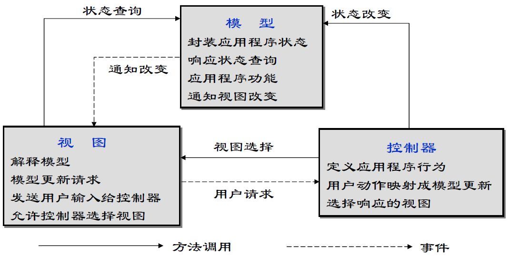{width=50%}
- **控制结构**：集中式控制由一个子系统统一协调，基于事件的控制则让各子系统响应外部事件，适合事件驱动系统；
- **客户机/服务器结构**：服务器提供服务、客户机负责交互，分为瘦客户机（处理集中在服务器）与胖客户机（应用逻辑在客户端），三层结构进一步分离表示、逻辑与存储；

  {width=55%}
- **分层体系结构**：将软件组织为类的层次，同层完成特定目的、层间通过接口通信，典型的三层为表示层、应用逻辑层与存储层。

  {width=55%}

体系结构设计应避免包之间的循环依赖，并通过 SDD 文档（IEEE 1016-1998）记录分解、依赖关系与接口说明。典型风格的组织结构、全局控制与适用场景可对照如下表所示。

| 风格 | 组织结构 | 全局控制 | 适用场景 |
|------|------|------|------|
| 仓库/知识库 | 以中心数据库为核心，子系统围绕存取 | 数据驱动的集中协调 | 编译器、CASE 工具 |
| MVC | 模型/视图/控制器分离 | 事件驱动更新视图 | 同一模型多视图的交互系统 |
| 控制结构 | 集中式或基于事件 | 显式协调或事件响应 | 事件驱动系统 |
| 客户机/服务器 | 服务与客户分离、三层结构 | 请求/应答 | 分布式业务系统 |
| 分层体系结构 | 层间通过接口通信 | 层间协议 | 表示/逻辑/存储分离的系统 |

分层体系结构中的模块按单向依赖组织，各层依赖关系如图所示。

{width=85%}

## 案例：高内聚低耦合的两种设计

**高内聚、低耦合**不是抽象口号，而是能在类图上直接判断的性质。以“订单处理”需求为例：用户提交订单后，系统需校验库存、计算价格、更新库存并生成账单。同一需求，两种设计方案差别一目了然。

- **坏设计——“一个类扛下所有”**：把校验、计价、更新、开账全部塞进一个订单服务类，方法间用共享变量传递中间结果；其他模块需要价格时直接调用其内部方法。类职责混杂、改动一处影响处处，属于低内聚；模块间直接访问内部内容，属于内容耦合。
- **好设计——“职责拆分、依赖接口”**：把订单处理拆为库存校验、价格计算、库存更新、账单生成四个各司其职的类，彼此经接口依赖，实现可独立替换。每个类高内聚，模块间仅经接口通信，属于低耦合。

| 维度 | 坏设计 | 好设计 |
|------|--------|--------|
| 内聚 | 职责挤于一类的偶然内聚 | 单一职责的功能内聚 |
| 耦合 | 直接访问内部内容的内容耦合 | 仅经接口传数据的数据耦合 |
| 可维护性 | 改一处价格规则要重测整个类 | 替换实现类即可，其余不受影响 |
| 可扩展性 | 新增促销规则要改动核心类 | 新增实现并登记到接口即可 |

两种设计实现了相同的功能，演进代价却截然不同——内聚与耦合度量的价值，正在于把“哪个设计更好”的争论，变成可按七级划分直接判定的检查。

## 样例：体系结构风格选型

体系结构风格没有绝对优劣，只有是否匹配场景。以三类典型场景为例，选型由非功能需求推动，而非设计者的偏好。

| 场景 | 推荐风格 | 理由 |
|------|----------|------|
| 高并发读多写少（如商品详情页） | 分层体系结构加缓存 | 读请求经缓存层卸载、写请求进入存储层，读路径与写路径分离，可独立扩容 |
| 强一致性交易（如订单支付） | 客户机/服务器（三层）加集中式控制 | 强一致要求读写在统一事务边界内完成，请求/应答式交互便于服务端管控事务 |
| 快速迭代原型（如内部工具） | 模型/视图/控制器（MVC） | 界面、模型、控制分离，改界面不动模型、改模型不动界面，便于频繁试错 |

同一系统不同子系统的非功能需求不同，选型亦可混合：读多写少的展示面用分层加缓存，交易面用三层结构，原型化模块用 MVC。选型的关键是把“数据在哪、谁控制、如何交互”与场景的读写比例、一致性要求、变化频率逐一对照，而不是把某种风格当作唯一正确解。

## 故事：从单体到微服务的演进

典型互联网公司的软件架构大多走过同一条路：先是小而美的单体应用，随业务增长逐渐拆分为微服务。推动演进的典型力量是规模、团队与部署频率。

- **单体阶段**：业务简单、团队不大，一个应用部署即上线；随功能与代码量增长，一次部署牵连所有模块，版本发布越来越慢，改动牵一发动全身的问题日益凸显。
- **拆分阶段**：业务线增多、团队按业务拆成小分队后，单体成为瓶颈——某团队改一行代码也要全量回归、与别组协同排期。按业务能力拆为微服务后，各服务独立开发、独立部署、独立扩容。
- **权衡而非银弹**：拆分把模块间调用改为网络通信，本地事务变成分布式事务，运维从管一个应用变成管数十个服务；服务粒度划分不当或过度拆分，同样带来接口繁杂、调试与追踪困难的新代价。

典型实践是“从单体起步、以模块边界识别服务边界、按规模演进”：能用一个模块解决的，就不必为了“时尚”拆成服务。拆分是权衡——用分布式复杂度换取团队自治与部署自由。

## 案例：设计文档缺失的代价

体系结构设计的价值在项目正常运转时不显山露水，而在人员流动后彻底暴露。一个典型案例：某项目自启动起便没有留下体系结构记录，模块划分、依赖方向与关键权衡都只存在少数几位设计者的脑中。

- **无人能答“为什么”**：核心设计者陆续离职后，新工程师面对一团代码，无人能回答“订单与库存为何这样划分”“这个依赖方向为何被刻意避免”。
- **反复试错**：后人在不掌握原始权衡的情况下修改设计，屡屡撞上当初刻意绕开的坑；绕开一次是代价，反复绕开就是累积的维护负债。
- **文档化的价值**：体系结构文档记录的不只是“设计成什么样”，更是“为什么这样设计”，让后人站在前人的权衡之上，而不是重新交一遍学费。

**体系结构文档（如 SDD、ADR）是设计的“记忆”**：它把决策理由从个人经验转存为团队资产。文档化的成本在当下，收益却在每一次人员交接、每一次架构变更时兑现——这正是设计原理中信息隐藏与可维护性的初衷。

## 面向对象设计

面向对象设计（OOD）在分析模型基础上进行系统设计与对象设计两个层次的工作。

{width=55%}

**系统设计**的主要步骤：设计系统的体系结构（选择策略、建立总体结构）、识别设计元素（类和子系统及接口）、定义数据存储策略（数据文件、关系数据库或面向对象数据库，依据并发、跨平台、查询复杂度等选择）、部署子系统（将子系统分配到物理节点）、检查系统设计（正确性、一致性、完整性、可行性）。

**对象设计**需要细化模型：精化类的属性与操作（明确参数、类型、可见性与实现逻辑）、明确类之间的关系、整理优化模型。分析类向设计类的映射遵循原则：简单、代表单一逻辑抽象的分析类直接映射为设计类；职责复杂者映射为子系统接口；子系统划分符合高内聚低耦合。边界类的设计考虑界面工具与界面数量，实体类考虑性能需求，控制类审视其必要性、细分与事务处理要求。各类分析类的设计考虑如下表所示。

| 分析类类型 | 设计映射 | 设计考虑 |
|------|------|------|
| 简单分析类 | 直接映射为设计类 | 代表单一逻辑抽象 |
| 职责复杂的类 | 映射为子系统接口 | 符合高内聚低耦合 |
| 边界类 | 设计界面工具与数量 | 明确与外部交互点 |
| 实体类 | 考虑性能需求 | 数据持久化策略 |
| 控制类 | 审视必要性、细分与事务 | 事务处理要求 |

面向对象设计在分析模型之上进行系统设计与对象设计两层工作，如图所示。

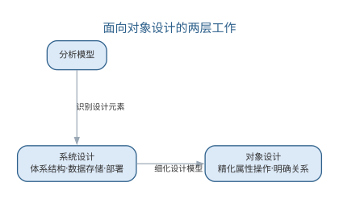{width=75%}

系统设计确定总体结构与部署，对象设计细化每个类的细节，两层工作共同把分析模型转化为可实现的解决方案。

## 智能化设计

智能化设计工具可以显著加速上述过程：AI 依据分析模型**生成**体系结构风格建议与类图初稿，根据 SOLID 等原则给出耦合内聚的**重构提示**，从需求与非功能属性**推导**数据存储策略候选，并在设计评审时对照检查清单**发现**遗漏的边界条件与不一致。

智能化设计的关键在于把人类的架构判断与 AI 的细节生成结合起来——体系结构风格这类关乎系统命运的决策仍应由有经验的工程师做出，而 AI 的价值体现在快速试错、一致性检查与文档同步，让设计者把精力集中于创造性决策。

架构决策可以按风险与影响分级对待：**关乎系统命运的决策**——体系结构风格的选择、关键子系统划分、数据一致性策略——必须由有经验的工程师基于非功能需求权衡做出，AI 在此提供的是候选方案与利弊分析，帮助决策者看得更全；**影响局部的决策**——类的结构、接口设计、组件交互方式——可以由 AI 生成初稿，经设计评审确认；**细节决策**——参数默认值、工具选择——则可以放手让 AI 按约定完成。分级对待的好处是既不让 AI 触碰高风险的架构判断，也不让工程师淹没在低价值的细节里。

架构决策的分级与 AI 分工如图所示。

{width=60%}

设计文档的同步是智能化设计的另一项红利。传统设计中模型、设计说明（SDD）与代码经常脱节；AI 可以从最终实现反推设计视图、根据变更自动更新文档，让设计决策持续可追溯。但同步文档的前提是"决策确实发生过"——AI 擅长记录决策的结果，而决策的理由、权衡与备选方案仍需设计者以架构决策记录（ADR）等形式沉淀，否则文档只会变成代码的复述而非设计的沉淀。

把智能化设计落到工程流程，可以归纳为"设计方案生成"的五步工作流：

1. **明确输入与约束**：整理需求文档、分析模型（用例、类图、状态图）与非功能需求（性能、可用性、可维护性），并写明已有系统的技术栈与限制；
2. **生成候选方案**：以提示词让 AI 基于输入生成多个备选设计（体系结构风格、关键类结构、数据存储策略），并要求给出每个候选的理由与取舍；
3. **对照权衡矩阵**：请 AI 按可扩展性、性能、成本、团队熟悉度等维度输出候选对比表，显式说明"选 A 的代价是什么"；
4. **人工筛选与决策记录**：工程师基于非功能需求优先序筛选候选，把采纳方案、理由与未采纳的方案一并写入架构决策记录（ADR）；
5. **生成初稿并迭代**：对选定的方案让 AI 生成类图初稿与接口草图，按评审意见反馈修改，直至符合约束。

从需求与分析模型生成候选设计方案的提示词模板如下：

```text
你是资深软件架构师。请基于以下输入，为系统生成 2~3 个候选设计方案，不要直接下结论。
需求：<一段话描述核心功能与非功能目标>
约束：<技术栈、性能、成本、团队能力等限制>
分析模型：<用例、类图、状态图的摘要>
请逐方案输出：
1. 方案名称与采用的体系结构风格（分层、客户机/服务器、事件驱动等）
2. 核心模块划分与关键设计决策
3. 该方案的优势、代价与主要风险
最后给出三列对照表：方案 | 优势 | 代价与风险
```

在"分级对待"之上，体系结构决策的 AI 辅助与人工把关可进一步细化为下表——AI 负责把方案摊开、把利弊摆全，人负责按下决策键。

| 体系结构决策 | AI 辅助产出 | 人工把关 |
|------|------|------|
| 体系结构风格选择 | 按非功能需求生成候选风格与利弊分析 | 基于权衡拍板，否决"看似合理"的方案 |
| 子系统划分 | 依据职责边界提出划分候选 | 校验高内聚低耦合，并匹配团队结构 |
| 数据一致性策略 | 汇总候选策略与其取舍 | 依据业务一致性要求定夺 |
| 非功能需求权衡 | 生成约束冲突与敏感性分析 | 定义优先级与预算 |

这类工作可直接使用对话式编码工具（如 Cursor、Claude Code 等）配合架构文档知识库完成，选型要点是"让模型读到真实约束"，避免它仅凭通用知识臆测系统背景；团队也可把 ADR 写成模板让 AI 续写，把决策理由持续沉淀。

智能化设计同样存在局限与失败模式，如下表所示。

| 失败模式 | 典型表现 | 应对 |
|------|------|------|
| 方案幻觉 | 生成"看似合理实则不可行"的架构 | 要求输出逐条引用约束，人工核对非功能需求 |
| 上下文缺失 | 忽略已有系统技术栈与限制 | 提示词注入真实约束，必要时检索架构文档 |
| 候选同质化 | 只给出常见风格的变体 | 要求列出风格组合与混合方案 |
| 提示词偏差 | 候选倾向随提示词措辞漂移 | 固定模板、多轮对照，跟踪采纳率 |

这套工作流的前提是约束写不真、候选就不可信：AI 往往只优化一个目标（如性能）而忽略另一个（如可维护性），把多目标权衡显式写进提示词，是避免"看起来最优、用起来失衡"的有效手段。识别并规避上述失败模式，是智能化设计从"演示可用"走向"工程可用"的分水岭。

## 智能化设计实践

智能化设计实践的落点可以分为三类。

**体系结构设计**：让 AI 依据需求与非功能属性生成备选的体系结构风格（分层、客户机/服务器、事件驱动等）及其权衡分析，工程师用架构决策记录（ADR）逐项采纳或否决，形成"候选生成—权衡比较—决策记录"的流程。**界面与原型设计**：低代码平台（如 OutSystems、Mendix）与 AI 界面生成工具（如 v0、Figma 的 AI 助手）把需求描述直接转换为可运行的界面原型，让用户在早期就"看得见"系统，减少需求误解。**数据与对象设计**：AI 从业务规则推导概念数据模型与类图初稿，生成数据库表结构候选，工程师根据访问模式与一致性要求调整。

设计活动与 AI 辅助的分工如下表所示。

| 设计活动 | AI 能力 | 人工把关 |
|------|------|------|
| 体系结构设计 | 生成风格候选与利弊分析 | 选择与评估体系结构风格 |
| 详细设计 | 生成类图、接口与交互初稿 | 校验语义、确定权衡 |
| 界面设计 | 生成界面原型与组件方案 | 确认可用性与交互逻辑 |
| 数据设计 | 推导数据模型与表结构 | 确定一致性策略与性能约束 |

无论哪个层次，都适用同一条原则：**AI 生成的是候选，决定权在人**。设计审查仍然是必要的环节，尤其要警惕 AI 生成的架构"看似合理实则难以演进"。当系统以机器学习模型为核心时，架构还需要为模型推理、数据流水线留出位置，相关设计考量将在第 10 章结合 AI 系统的体系结构讨论。

一个完整的智能化设计实例如下。需求是：某电商系统的订单结算模块需支持满减、折扣、优惠券与会员积分多种促销规则，且促销规则会不断新增。工程师写下的提示词为：

```text
为订单结算模块生成 2 个候选设计方案。需求：订单结算需支持满减、折扣、
优惠券与会员积分，后续会不断新增促销规则；结算规则复杂、变化频繁，其余模块稳定。
约束：Java/Spring 技术栈、单机事务、结算响应时间 <200ms。
请给出候选方案、权衡与建议，不要直接下结论。
```

AI 输出了两个候选。方案 A 采用"策略模式 + 规则引擎"，每种促销实现为策略类、按优先级链式结算，优势是新增规则只需新增策略类、符合开闭原则，代价是策略类随规则增多、组合测试复杂度上升；方案 B 采用"领域模型 + 规则表驱动"，促销规则存表由引擎解释执行，优势是运营可配置规则、无需改代码，代价是引入规则解释器、性能与可调试性下降。工程师对照权衡矩阵评估发现，AI 的输出遗漏了关键约束——满减与优惠券叠加时的计算顺序直接影响结果，两个候选都未说明规则叠加顺序与幂等性。工程师将此约束补入提示词后重新生成，方案 A 的候选补上了"规则按优先级链式结算、配幂等表"的说明，最终方案 A 结合规则的配置化被采纳，理由与未采纳的方案 B 一并写入 ADR。

与人工流程相比：人工设计同样要经历"枚举候选—权衡—决策"三步，但更慢、且依赖个人经验覆盖的范围；AI 让候选枚举与利弊分析在几分钟内完成，工程师把时间从"想方案"转移到"验约束、定取舍"。但"叠加规则的顺序与事务边界"这类约束仍需工程师基于领域知识补全——AI 不会主动提出它没有被提示的约束。

### 智能化设计的要点与误区

智能化设计的关键误区，是让 AI 触碰关乎系统命运的架构判断，或让设计文档沦为代码的复述。要点与误区如下表所示。

| 误区 | 典型表现 | 应对要点 |
|------|------|------|
| AI 决定架构 | 体系结构风格由模型拍板 | 系统命运级决策由工程师基于非功能需求做出 |
| 决策不留痕 | 只记录结果不记录理由 | 以 ADR 沉淀理由、权衡与备选方案 |
| 文档替代决策 | 同步文档却无决策发生 | 先有决策，再谈文档同步 |
| 全盘放手细节 | 低价值细节也由人逐行处理 | 细节决策交给 AI 按约定完成 |

架构决策记录（ADR）流程——从候选生成到权衡记录——如图所示。

{width=55%}

分级对待的好处是既不让 AI 触碰高风险的架构判断，也不让工程师淹没在低价值的细节里；而 AI 擅长记录决策的结果，决策的理由与权衡仍需设计者以 ADR 等形式沉淀，否则文档只会变成代码的复述而非设计的沉淀。

### 前沿演进：可演化架构与架构适应度函数

传统设计追求"一次设计到位"，前沿架构思想则承认架构必然演化。**可演化架构**（evolutionary architecture）把架构决策、适应度与持续交付结合：架构决策通过**适应度函数**（fitness function）表达为自动化检查，在 CI 中持续验证架构是否仍然满足约束（如依赖方向、耦合度、延迟预算）。AI 辅助可演化架构：自动分析模块依赖与循环依赖、生成架构评估报告、提出重构候选方案。常见适应度函数示例如下表所示。

| 架构关注点 | 适应度函数 | 工具 |
|------|------|------|
| 依赖方向 | 禁止核心模块反向依赖 | ArchUnit、JDepend |
| 循环依赖 | 无循环依赖检查 | 依赖分析工具 |
| 耦合度 | 模块间引用计数阈值 | SonarQube 等 |
| 延迟预算 | 端到端延迟不超过 SLO | 链路追踪 |

可演化架构的持续演进——适应度函数驱动的改进环——如图所示。

{width=70%}

可演化架构把"架构治理"从评审会议迁移到持续自动化验证：架构约束不再依赖个别架构师的记忆，而是由 CI 中执行的适应度函数持续守护，AI 则让适应度函数的编写与分析更加廉价。

以上智能化设计与可演化架构着眼于系统的整体结构，而设计实践中还有大量反复出现的局部问题。设计模式正是这类局部经验的沉淀——把成功实践提炼为可复用的解决方案，供设计者按需取用。

设计模式描述软件设计过程中常见问题的解决方案，是从大量成功实践中总结出来并被广泛公认的经验。经典著作《设计模式》（GoF，四人组 Gamma、Helm、Johnson、Vlissides 著）收录了 23 个面向对象设计模式，成为软件工程领域最具影响力的著作之一。

## 模式的基本要素与价值

一个完整的设计模式包含四个要素：

- **模式名称**：一个助记名，便于交流与思考；
- **问题**：说明在何时使用模式，解释设计问题及其前因后果；
- **解决方案**：描述设计的组成部分、相互关系、各自职责与协作方式；
- **效果**：描述模式应用的效果与权衡。

设计模式的价值在于：使人们可以简便地复用已有的良好设计；提供一套开发人员之间交流的语言；提升看待问题的抽象程度；帮助设计人员更快更好地完成设计。同时要警惕其风险——模式不是万能的，应用一种模式通常"有得有失"，盲目套用可能造成过度设计。一个完整模式的四要素如下表所示。

| 要素 | 说明 |
|------|------|
| 模式名称 | 助记名，便于交流与思考 |
| 问题 | 何时使用，设计问题及其前因后果 |
| 解决方案 | 组成部分、相互关系、职责与协作 |
| 效果 | 应用效果与权衡 |

模式的四要素构成完整的设计经验描述，如图所示。

{width=85%}

四要素缺一不可：缺少"问题"与"效果"的模式只能看到结构，无法判断何时该用、用了得失如何。

## 模式的分类

GoF 将 23 个模式分为三类：

**创建型模式**解决对象实例化的问题，把"创建什么"与"如何创建"分离。典型模式包括：**单例**（Singleton，保证一个类仅有一个实例并提供全局访问点）、**工厂方法**（Factory Method，由子类决定创建哪个产品）、**抽象工厂**（Abstract Factory，创建一族相关对象）、**生成器**（Builder，分步构造复杂对象）、**原型**（Prototype，通过克隆创建新对象）。

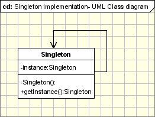{width=45%}

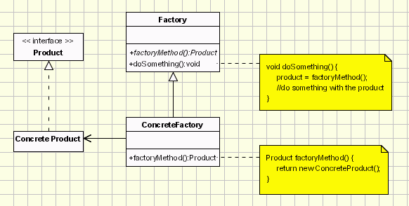{width=45%}

{width=45%}

**结构型模式**组织类与对象的结构，避免类被赋予过多职责而破坏封装。典型模式包括：**适配器**（Adapter，转换接口使不兼容的类协同工作）、**桥接**（Bridge，将抽象与实现解耦）、**组成**（Composite，将对象组成树形整体—部分结构）、**装饰**（Decorator，动态为对象添加职责）、**外观**（Facade，为子系统提供统一入口）、**享元**（Flyweight，共享细粒度对象节省内存）、**代理**（Proxy，用替身控制对对象的访问）。

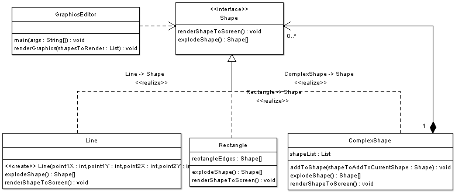{width=45%}

**行为模式**分配对象职责、为对象间协作建模。典型模式包括：**职责链**（Chain of Responsibility，把请求沿处理链传递）、**命令**（Command，把请求封装为对象以支持撤销与排队）、**解释器**、**迭代器**、**中介者**（Mediator，集中协调对象间交互）、**备忘录**、**观察者**（Observer，定义一对多的依赖，状态变化时通知所有依赖者）、**状态**（State，状态改变时对象改变自身行为）、**策略**（Strategy，封装可互换的算法族）、**模板方法**（Template Method，父类定义算法骨架、子类填充细节）、**访问者**（Visitor，在不改动元素类的前提下为对象结构增加操作）。

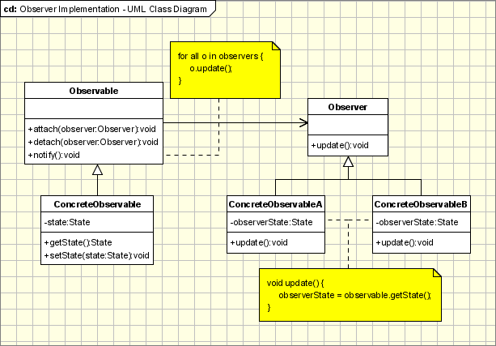{width=45%}

{width=45%}

以**抽象工厂**为例：它封装具体平台，使应用程序可以在不同平台上运行——用户只与抽象工厂及其产品接口打交道，更换平台只需替换具体工厂。以**观察者**为例：新闻社（被观察者）发布新闻时，所有订阅者自动得到通知并更新，符合"开放—封闭"原则。GoF 三类的模式清单与作用可归纳如下表所示。

| 类别 | 作用 | 代表模式 |
|------|------|------|
| 创建型 | 解决对象实例化，分离"创建什么"与"如何创建" | 单例、工厂方法、抽象工厂、生成器、原型 |
| 结构型 | 组织类与对象结构，避免职责过多 | 适配器、桥接、组成、装饰、外观、享元、代理 |
| 行为型 | 分配职责、为协作建模 | 策略、观察者、命令、状态、模板方法、访问者等 |

GoF 模式的三类划分与典型模式目录如图所示。

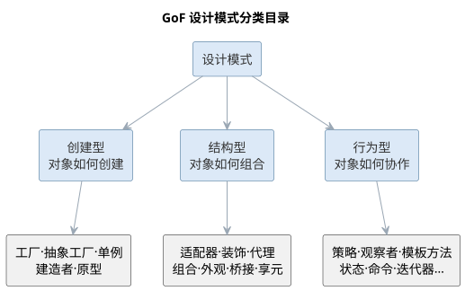{width=75%}

## 样例：策略模式的应用

订单折扣计算是**策略模式**（Strategy，封装可互换的算法族）的典型场景。假设一个电商系统按订单计算折扣：普通用户不打折、会员享 95 折、节假日全场 85 折。若用 if-else 硬编码，每新增一种折扣都要改动计算逻辑本身，违背开闭原则；把每种折扣封装成一个策略类、用统一接口替换分支，是教科书式的解法：

```text
interface Discount {
    double calc(double price);
}
class NormalDiscount implements Discount {
    public double calc(double price) { return price; }
}
class MemberDiscount implements Discount {
    public double calc(double price) { return price * 0.95; }
}
class FestivalDiscount implements Discount {
    public double calc(double price) { return price * 0.85; }
}
class Order {
    private Discount discount = new NormalDiscount();
    public void setDiscount(Discount d) { this.discount = d; }
    public double total(double price) { return discount.calc(price); }
}
```

代码中的角色分工如下表所示。

| 角色 | 本例中的类 | 职责 |
|------|------|------|
| 策略接口 | Discount | 定义算法统一入口 |
| 具体策略 | Normal/Member/FestivalDiscount | 实现各折扣算法 |
| 上下文 | Order | 持有策略并委托调用 |

改动从"改分支"变成"加类"：新增折扣只须写一个新策略类并注入订单，原有代码一字不动，这就是**开闭原则**的直接体现。

## 样例：观察者模式的应用

天气 App 的"订阅推送"是**观察者模式**（Observer，定义一对多的依赖，状态变化时通知所有依赖者）的典型场景。气象站测得新数据后，手机通知、首页卡片、地图图层等多个界面都要同步更新，且新增界面不应改动气象站。把气象站作为主题、各界面作为观察者，即构成发布—订阅关系：

| 角色 | 类 | 职责 |
|------|------|------|
| 主题（被观察者） | WeatherStation | 维护观察者列表，数据更新时逐一通知 |
| 观察者接口 | Observer | 定义 update 数据的统一入口 |
| 具体观察者 | PushAlert、CardView、MapLayer | 收到通知后各自刷新 |

运行流程是：

1. 界面启动时调用 subscribe 向气象站注册自己；
2. 气象站测得新数据，遍历观察者列表调用 update；
3. 各界面收到数据后自行刷新，气象站不关心界面的具体类型。

新界面只需实现 Observer 接口并注册，无需改动气象站；观察者之间也互不感知——这正是"一对多"协作的解耦方式。

## 案例：模式滥用的反例

一个**典型的反例**是：为只有两三个类的简单逻辑，强行套上十几层模式。某团队曾为一个"取文件路径并保存"的小需求，引入抽象工厂创建路径、外观封装接口、装饰叠加缓存、代理拦截访问，还配了一套观察者做变更通知——实际上一个函数就能完成。结果代码行数暴涨、调用链深不可测，新人读不懂，改一处要顺着多个间接层排查。这样的设计"模式齐全"却毫无可维护性：问题不在模式本身，而在滥用。

对照下表可以看清"该用"与"不该用"的界限。

| 情形 | 该用的地方 | 不该用的地方 |
|------|------|------|
| 变化点 | 存在可独立、频繁且可预期的变化 | 结构固定，短期内不会变化 |
| 扩展方式 | 需求以新增种类、算法为主 | 以修改既有行为为主 |
| 复杂度 | 分支众多且纠缠，直写难维护 | 两三行分支即可直读直改 |
| 代价 | 间接层换来可扩展，收益明确 | 间接层徒增理解与调试成本 |

判断口诀很朴素：**模式服务于变化点，不为用而用**。先写最简单满足需求的方案，变化真实到来且频率可预期时再引入模式，才是健康的演进路径。

## 故事：GoF 与《设计模式》

1994 年，Erich Gamma、Richard Helm、Ralph Johnson 与 John Vlissides 四位软件工程师合作出版了《设计模式》（Design Patterns: Elements of Reusable Object-Oriented Software，Addison-Wesley），后世称这四人为"**四人组**"（GoF）。这本书后来成为软件工程领域被引用最多的著作之一，也是"模式运动"的开端。

- **由来**：四人在面向对象程序设计大会 OOPSLA 上相识；Gamma 在博士阶段构建的 C++ 框架 ET++ 中积累了可复用结构，其余三人也各有研究，遂把这些反复出现的解法提炼为"模式"。
- **思想源头**："模式"一词借鉴自建筑学家克里斯托弗·亚历山大，他把城市规划中反复成功的方案写成"模式语言"，GoF 把同样的思想引入软件设计。
- **内容**：全书收录 23 个模式，分创建型、结构型与行为型三类，按名称、问题、解决方案与效果四要素书写。
- **影响**："设计复用"思想随畅销迅速传播，催生了 PLoP 等模式会议，"设计模式"从此成为软件行业的通用词汇。

模式把"好设计"从大师经验变成可传递的公共知识。今天人们谈论观察者、策略时，都在沿用这本书建立的坐标系。

## 模式与 AI 代码生成

设计模式是 AI 代码生成最擅长复用的知识之一。大语言模型在训练中接触了大量模式实例，能够：依据"何时用何种模式"的描述**推荐**合适的模式；从类图或需求**生成**模式对应的代码骨架；根据 SOLID 与 DRY 原则对已有代码**提出**重构建议；在评审时**识别**模式滥用与过度设计。

但模式的本质是权衡，AI 生成模式代码时往往会"有得无失"地套用，因此需要工程师把关：只有当下注目的可变化点对应模式的适用场景时，引入模式才有价值。理解模式背后的动机与代价，是运用 AI 生成模式代码的前提。

模式推荐的正确条件并非"某个类需要解耦"，而是"存在一个可以独立变化、且变化频率可预期的点"——变化点是引入模式的理由，没有变化点，模式就是负担。AI 在推荐模式时应被要求说明"它正在解决哪个变化点、带来了什么代价"，而不是只输出"建议使用观察者模式"。这种条件化的输出让工程师不必逐条推敲模型推荐的动机，可以直接基于变化点的真实性做出判断。

防范过度设计需要双向的纪律：一方面要求 AI 在生成代码时**优先给出最简单满足需求的方案**，仅在指明变化点时引入模式；另一方面在评审时让 AI 对照"是否过度设计"的检查清单（是否存在无使用者的抽象、是否可以用更简单的结构替代、模式是否增加了不必要的间接层）扫描代码。模式是解决特定问题的良方，不是所有问题的答案——这一点对人与 AI 同样适用。

是否引入设计模式的决策流程如图所示。

{width=55%}

面对 23 个模式，过去工程师靠记忆与经验完成"问题—模式"的匹配；AI 辅助把这一步变成可复用的工作流，工程师的角色从"背模式目录"转向"验证模式动机"。模式选择辅助可以归纳为四步工作流：

1. **描述问题与变化点**：用自然语言说明"哪个对象在什么情况下需要变化、变化频率如何、有哪些关注方"，而不是直接说出模式名；
2. **映射候选模式**：让 AI 依据问题特征推荐候选模式，并要求说明"该模式正在解决哪个变化点"；
3. **对照权衡**：请 AI 给出候选模式的效果与代价对比表，标注"何时不该用"；
4. **人工裁决与沉淀**：工程师判断变化点是否真实、是否需要提前支持，把结论写入评审记录。

大语言模型在训练语料中见过大量模式应用案例，能把"对象创建方式可能变化""一对多通知"这类问题特征映射到相应模式，这是其推荐能力的来源；但同一问题可以有多种措辞，措辞不同推荐可能不同，所以工作流第一步刻意用固定结构描述问题，降低推荐的偶然性。常见的问题特征与候选模式类别的对应如下表所示。

| 问题特征 | 适用模式 |
|------|------|
| 对象创建方式可能变化 | 创建型：工厂方法、抽象工厂、生成器 |
| 接口不兼容、需协同工作 | 适配器、外观 |
| 一对多状态变化、需同步通知 | 观察者 |
| 算法族可互换 | 策略 |
| 行为随内部状态变化 | 状态 |
| 职责可动态叠加 | 装饰 |
| 需在不动元素类时增加操作 | 访问者 |

需要说明的是，上表是启发式的对应关系而非判定规则——同一问题特征可能对应多种模式，具体选择还取决于变化频率、代价承受与既有结构。AI 的推荐价值在于缩小候选范围，最终取舍仍要回到变化点与权衡上。

以报表导出为例：某模块需把多种导出格式（PDF、Excel、CSV）与报表逻辑分离，且格式会持续新增。按工作流第一步，工程师应写出"导出格式会不断新增，需在不改报表逻辑的前提下扩展"，AI 据此推荐策略模式；若只写"类之间耦合太高"，模型就可能给出适配器、外观等若干不相关的候选。输入描述越贴近变化点，推荐越收敛。

AI 生成模式代码的质量门禁，可以概括为五道关卡，其中自动化检查与人工把关各司其职。

| 关卡 | 执行者 | 检查内容 | 通过标准 |
|------|------|------|------|
| 静态检查 | 工具/CI | 编译、lint、类型检查 | 无语法与低级错误 |
| 结构校验 | AI + 工具 | 参与者、关系对照标准结构 | 角色与协作符合模式定义 |
| 语义保真 | 人工 | 变化点是否真实存在并被对应 | 模式动机与实现一致 |
| 单元测试 | CI | 行为正确、扩展性可验证 | 用例全部通过 |
| 人工评审 | 工程师 | 无用抽象、权衡与代价 | 无过度设计，理由可追溯 |

五道关卡中，前两道可由工具与 AI 自动完成，后三道必须以人或测试把关：语义保真回答"模式用对没有"，单元测试回答"行为正确没有"，人工评审回答"值得用没有"。把门禁写成项目约定，让 AI 在生成时就自报变化点与权衡，可显著减少评审阶段的返工。把"模式选择 + 质量门禁"编码为提示词模板如下：

```text
你是资深软件工程师。请根据问题描述推荐设计模式并生成代码骨架：
问题：<描述对象、变化点与关注方，例如"订单状态变化时，多个界面与通知
需同步更新，且后续可能新增关注方">
要求：
1. 先说明推荐哪个模式、该模式解决哪个变化点、带来什么代价；
2. 仅当变化点真实存在时才引入模式，否则给出最简单的直写方案；
3. 生成骨架代码，命名用驼峰式，注释说明各参与者职责；
4. 最后给出 100 字以内的权衡说明，标注"何时不该用此模式"。
```

质量门禁的落地依赖测试支撑——观察者、策略这类行为模式的验证需要单元测试构造关注方与变化场景，测试用例设计将在第 6 章详细展开；"可编译不等于可维护"的判断标准则已在第 6 章软件实现中讨论。AI 生成模式代码进入基线前必须通过门禁，这条纪律与人工编写代码完全相同。

模式与 AI 代码生成同样存在局限与失败模式，如下表所示。

| 失败模式 | 典型表现 | 应对 |
|------|------|------|
| 结构套用 | 生成"教科书结构"却无对应变化点 | 先问变化点，再谈模式 |
| 变体误选 | 单例/工厂/生成器选错，引入不必要的全局状态 | 要求模型说明创建场景与变体差异 |
| 双标准代码 | 生成代码与既有风格、依赖不一致 | 提示词注入项目规范，必要时参考既有模式实例 |
| 单模式遗漏 | 真实系统需多模式组合，AI 只给单模式 | 要求列出候选组合与组合带来的约束 |

设计模式是详细设计层面的复用单位，与本章前文讨论的体系结构风格互补——前者解决类级协作，后者解决系统级组织；本章聚焦模式与 AI 的组合应用。

## AI 生成模式代码的实践

让 AI 可靠地生成模式代码，关键在于提示词中给出足够的结构信息。一个常用的做法是"意图 + 变化点"式描述：不仅告诉模型"用观察者模式"，还说明"库存变化时多个界面需要同步更新，且后续可能新增关注方"，模型据此生成的代码才能贴合并可维护。若仅有模式名而无意图，模型往往套用教科书结构，产生大量无用抽象。

工程上可以进一步把模式知识组织为可检索资源：团队把沉淀的模式实例、适用场景与权衡记录整理入库，通过检索增强生成（RAG）让模型基于团队自己的经验作答，而不是仅凭通用训练数据。评审 AI 生成的模式代码时，建议对照以下清单：

- 变化点是否真实存在且需要提前支持？
- 模式的参与者、关系是否符合其标准结构？
- 是否引入了无使用者的接口或抽象？
- 现有代码中是否存在可被该模式替代的重复结构？

模式代码与普通代码一样，需要经过测试与评审才能进入基线。评审 AI 生成的模式代码，可对照以下清单逐项检查。

| 评审问题 | 检查要点 |
|------|------|
| 变化点是否真实存在？ | 是否确需提前支持变化 |
| 参与者是否符合标准结构？ | 模式的角色与关系是否正确 |
| 是否存在无用抽象？ | 无使用者的接口或抽象 |
| 是否可替代重复结构？ | 现有代码中可被该模式替代的部分 |

让 AI 生成模式代码并以评审清单把关的流程如图所示。

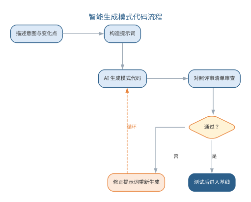{width=65%}

"意图+变化点"式描述让模型生成贴合的代码，评审清单则防止模式被盲目套用。对 AI 生成代码的评测、幻觉防范与责任归属，将在第 11 章系统讨论。

一个完整的实例如下。需求是：订单状态变化时，邮件、短信与日志三个关注方需要同步更新，且后续可能新增关注方（如推送、审计）。工程师按"意图 + 变化点"的方式写下的提示词为：

```text
订单状态变化时，邮件、短信与日志三个关注方需要同步更新，且后续可能新增关注方。
请推荐模式并生成骨架代码：先说明推荐理由与变化点，再生成实现，最后给出权衡。
```

AI 推荐观察者模式，理由是"关注方集合可以独立扩展"，并生成了 `OrderObserver` 接口、`OrderService` 维护观察者列表、`changeState` 遍历通知的骨架代码。工程师对照评审清单评估发现：变化点真实存在、参与者符合观察者标准结构，但有两处契约细节缺失——其一，通知顺序未约定，多个关注方并发订阅时行为不确定；其二，未处理"观察者抛异常导致状态更新中断"的异常路径。工程师把这两点写入提示词（"按订阅顺序通知、观察者异常隔离"）后生成第二版，补齐了顺序通知与异常捕获，经单元测试（模拟新增关注方、注入异常）验证后进入基线。

这个实例说明两点：AI 生成的第一版往往"结构对而契约缺"——模式骨架标准，但边界与异常路径这类非模式本身的细节仍需补全；把"意图 + 变化点"与评审清单写进提示词，能显著提高首版质量。与纯人工相比，效率提升集中在接口设计与样板代码，而"模式动机的判断与权衡把关"始终属于人——评审清单不是流程摆设，而是把人的经验外化，供 AI 生成、工程师审查共同使用。

### 模式与 AI 的要点对照

设计模式是 AI 代码生成最擅长复用的知识，也是过度设计的高发区。模式的四要素——名称、问题、解决方案与效果——共同决定了模式的价值边界。评审 AI 生成的模式代码，可对照以下清单。

| 评审检查项 | 说明 |
|------|------|
| 变化点是否真实存在 | 是否存在可独立变化、且变化频率可预期的点 |
| 模式结构是否符合标准 | 参与者、关系与协作是否贴合标准结构 |
| 是否引入无用抽象 | 是否存在无使用者的接口或抽象类 |
| 是否有可替代的简单方案 | 能否用更简单的结构达成同样目的 |
| 是否说明权衡与代价 | 模式带来效果上的"有得有失" |

设计模式的四要素结构如图所示。

{width=60%}

对 AI 生成模式代码的评审应当双向进行：一方面要求 AI 优先给出最简单满足需求的方案、仅在指明变化点时引入模式；另一方面让 AI 对照"是否过度设计"的检查清单扫描已有代码，把模式的应用建立在变化点真实性的判断之上。

### 前沿演进：模式知识库与 AI 驱动的重构

模式知识的前沿实践是把团队沉淀的模式实例、适用场景与权衡记录组织为**可检索的知识库**，通过 RAG 让 AI 基于团队自己的经验生成建议，而非仅凭通用训练数据。同时，AI 驱动的重构（自动识别重复结构、坏味道，生成重构方案）把"模式应用"从人工判断推向自动化辅助；架构重构（模块化拆分、依赖清理）也借助 AI 的全局分析能力。实践要点如下表所示。

| 实践 | 做法 | 价值 |
|------|------|------|
| 实例沉淀 | 记录成功/失败模式案例 | 经验可复用 |
| 知识入库 | 向量化并索引 | 支撑 RAG 检索 |
| 按需检索 | 生成时按变化点检索 | 建议贴合团队 |
| 反馈闭环 | 新案例回流入库 | 知识持续生长 |

模式知识库的检索增强闭环——从沉淀到反馈——如图所示。

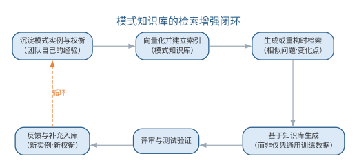{width=85%}

模式知识库把"经验"变成组织资产：团队的每一次重构、每一个成功或失败的模式应用都沉淀为知识，AI 生成的建议因此越来越贴合项目实际——知识库的质量，取决于团队沉淀与校验的纪律。

## 本章小结

软件设计基于分析模型追求高内聚、低耦合，涵盖设计原理、体系结构设计与面向对象设计；智能化设计让 AI 参与候选生成、权衡分析与文档同步，可演化架构以适应度函数把架构治理迁移到持续验证。设计模式是从成功实践总结的常见问题解决方案，四要素决定其价值边界；AI 生成模式代码需经质量门禁把关，过度设计需要双向纪律约束，变化点真实性是引入模式的唯一理由。两者的共同原则：AI 生成候选与初稿，人负责架构判断与变化点裁决——验证优先，决策在人。

**思考与讨论：**
1. 为什么体系结构风格这类"系统命运级"决策必须由人拍板，而参数默认值这类细节可以交给 AI？
2. 请分别为"候选设计方案生成"与"从问题描述推荐模式"编写一条提示词，并说明如何保证其中约束真实、避免过度设计。
3. 若 AI 生成的候选方案"看似合理实则不可行"，你会用什么方法识别并规避？
4. 为什么"某个类需要解耦"不足以成为引入模式的理由？变化点指什么？
5. AI 生成观察者模式代码后，你会重点审查哪些点？请给出你的评审清单。
