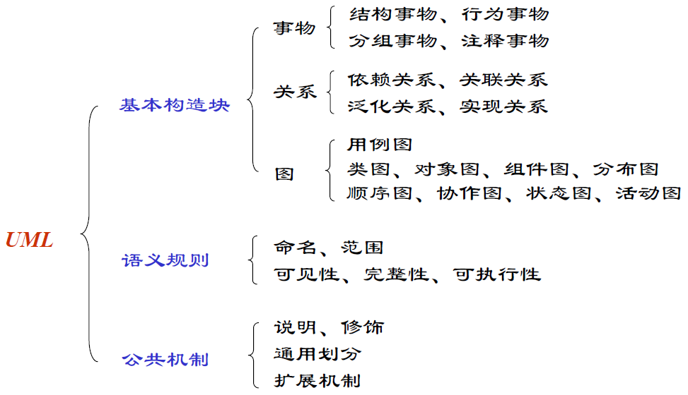
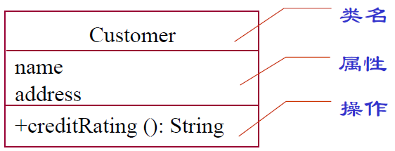
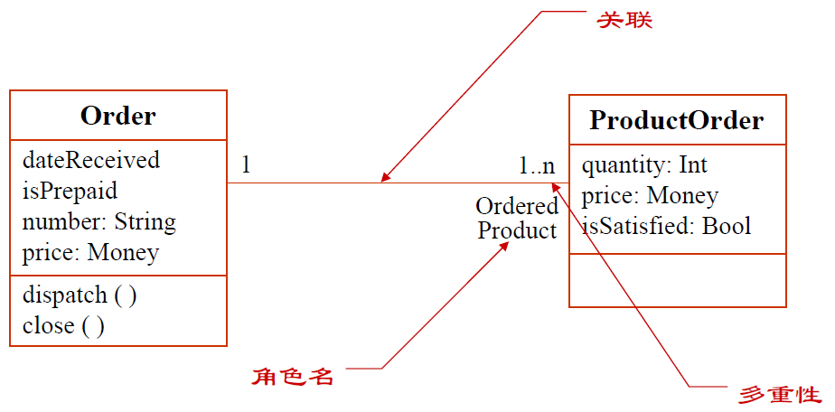
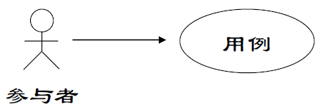
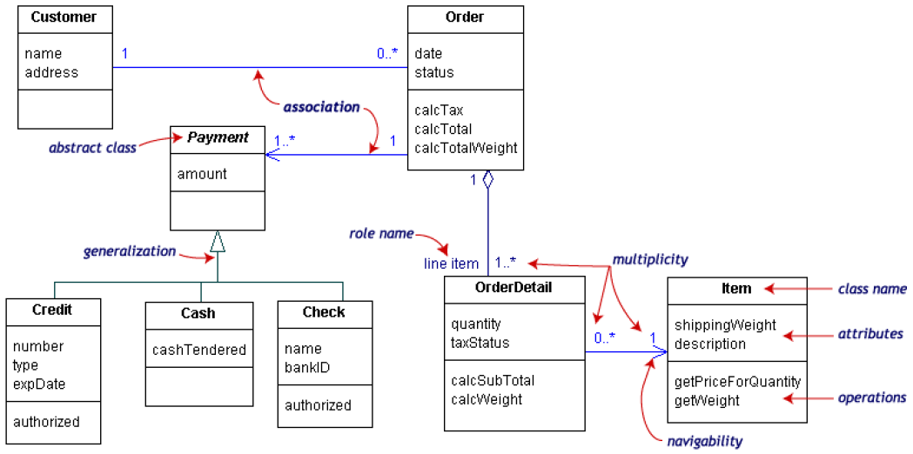
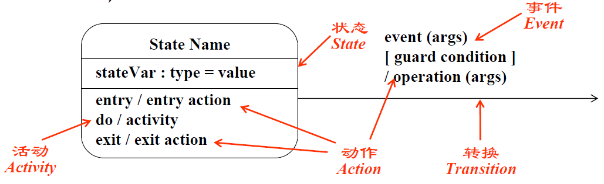
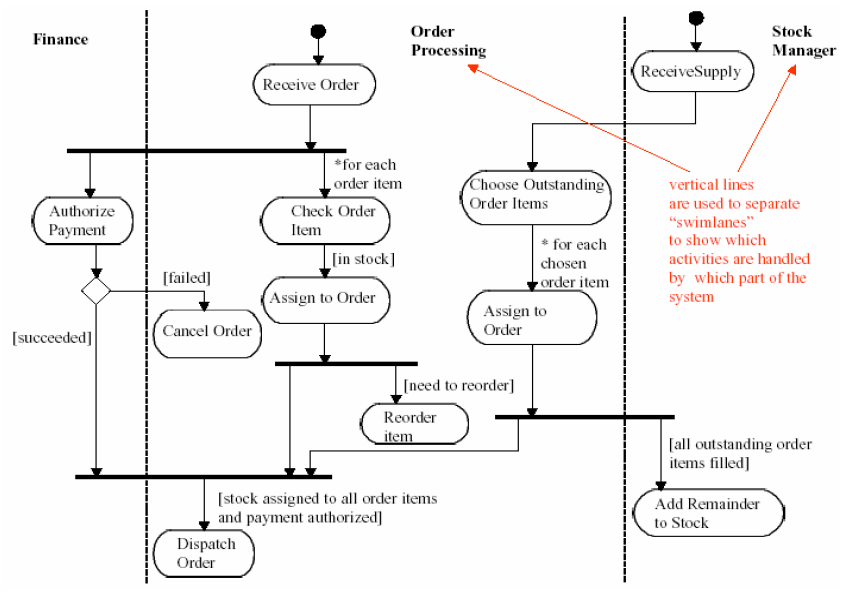
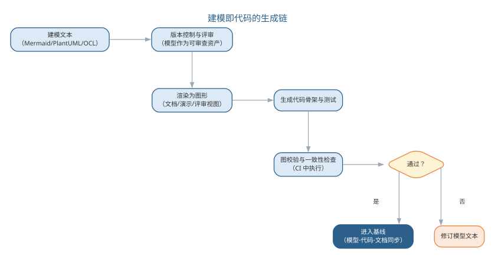

# 统一建模语言 UML

UML（Unified Modeling Language，统一建模语言）是一种直观化、明确化、构建和文档化软件系统产物的通用可视化建模语言。它由 Booch、Rumbaugh、Jacobson 三人集 Booch 方法、OMT、OOSE 之长于 20 世纪 90 年代统一而成，后被 OMG 采纳为标准。

UML 不是可视化的程序设计语言，而是建模语言的**规格说明与表示标准**；它不是过程或方法，但允许任何过程和方法使用它。UML 的作用可以概括为四个方面：**可视化**——用一组语义明确的图形符号无歧义地交流模型；**详细描述**——精确描述分析、设计与实现决策；**构造**——模型可映射为 Java、C++ 等代码（正向工程），也可从代码逆向重构模型；**文档化**——为体系结构、需求、测试与发布管理提供文档。

## UML 的构成

UML 由三部分构成：**事物**（things）、**关系**（relationships）与**图**（diagrams）。

{width=55%}

**事物**表示系统中的元素，分为四类：结构事物（类、接口、构件、协作等）、行为事物（交互、状态机）、分组事物（包）与注释事物（注解）。其中，类是描述属性和操作的结构事物，属性写作 `[可见性] 名称[: 类型] [= 默认值]`，操作写作 `[可见性] 名称[(参数列表)][: 返回类型]`；可见性包括公有的 `+`、受保护的 `#` 与私有的 `-`。

{width=50%}

**关系**表示元素之间如何连接，包括：**关联**（描述一组对象间的结构连接，可带角色、多重性与限定符，聚合与组合是其整体—部分特例）、**依赖**（使用关系，一个事物的变化影响另一事物）、**泛化**（特殊与一般的关系，即继承）、**实现**（一个类元指定由另一类元保证执行的契约，如接口与其实现类之间）。

{width=50%}

{width=50%}

UML 图按描述静态结构还是动态行为可分为两大类，常见的图归类如下表所示。

| 类别 | 所包含的图 | 描述内容 |
|------|------|------|
| 结构图 | 类图、对象图、组件图、部署图、包图 | 系统的静态结构 |
| 行为图 | 用例图、顺序图、协作图、状态图、活动图 | 系统的动态行为 |

结构图与行为图的分类关系如图所示。

{width=55%}

## UML 的图

UML 2.0 定义了 13 种图，按视图可以分为三类：

| 类别 | 图 | 用途 |
|------|----|------|
| 功能视图 | 用例图 | 需求获取、系统功能，测试依据 |
| 结构视图 | 类图、对象图、组件图、部署图 | 静态结构、物理架构 |
| 行为视图 | 顺序图、协作图、状态图、活动图 | 动态行为、交互与控制流 |

**用例图**从系统外部描述功能需求，表示用例、参与者及其关系。用例是系统功能被描述成的一系列事件，最终对参与者产生可观测、有价值的成果。用例之间存在**包含**（基本用例引用共性用例）、**扩展**（异常或可选分支作为独立用例）、**泛化**（一般与特殊关系）三种关系。用例描述应使用主动语句、主语为参与者或系统，只写可观测结果而不涉及实现与界面细节。

{width=55%}

**类图**描述系统的静态结构，包括类、关系及属性和操作，在需求、设计、实现三个阶段分别以概念层、说明层、实现层不同抽象层次出现。**对象图**是类图在某一时刻的实例快照。

{width=55%}

**顺序图**描述完成某项行为的对象间传递消息的时间顺序，由对象、生命线、控制焦点与消息组成，常用于表达一个用例的事件流。**协作图**反映收发消息的对象间结构组织，与顺序图同构、可以互转。

{width=55%}

**状态图**描述单个对象在其生命周期中的状态序列与触发状态转移的外部事件，包含状态（初态、终态、中间态、组合态、历史态）、事件、转换、活动与动作等元素。

{width=50%}**活动图**描述从活动到活动的控制流，强调并发、分支与泳道，适合分析用例、理解跨用例工作流；状态图偏重对象状态变迁，活动图偏重流程控制，二者使用场合不同。

{width=55%}

**组件图**表示系统的静态实现视图，描述组件及其依赖关系；**部署图**反映软件与硬件的物理架构，表示运行时的处理节点及组件配置。

{width=50%}

{width=50%}此外，**OCL（对象约束语言）**是施加于模型元素上的形式约束语言，弥补了图形模型在精确性上的不足。

## AI 辅助建模

传统建模依赖建模者逐图手工绘制，工作量大且容易与代码脱节。AI 辅助建模改变了这一局面：大语言模型可以从自然语言需求**智能提取**并生成用例图、类图与顺序图的初始版本；从已有代码**逆向生成** UML 模型，保持模型与实现同步；从 UML 模型**生成测试用例与文档**，并利用 OCL 约束校验模型一致性。人机协作的典型分工是：人类确定语义与边界，AI 完成符号转换与版本维护，从而把建模的重心从"画图"拉回"思考"。

模型生成的质量取决于输入描述的精确程度与校验闭环的完备程度。自然语言到 UML（NL2UML）的生成要得到可用结果，通常需要给出足够的语义约束：类之间的关系是关联还是聚合、消息的触发顺序如何、状态转移的条件是什么——这些在生成前必须由建模者明确，否则模型虽"形似"却"神离"。因此 AI 辅助建模不是"一句话生成模型"，而是"人提供语义骨架，AI 填充图形符号"，生成结果必须经过可执行校验——检查类间关系的合法性、状态的完备性与一致性——才能进入基线。

另一个必须正视的问题是**模型与代码的漂移**。传统项目中模型往往在开发后即束之高阁，与实现渐行渐远；AI 时代的双向转换让"模型—代码"同步的成本大幅下降——从需求生成模型、从模型生成代码、从代码逆向模型可以形成闭环，使模型重新成为"活文档"。但要避免的是过度依赖自动同步而放弃对模型的维护：模型的价值在于沉淀设计决策，若仅作代码的镜像则冗余，若脱离代码则失真，维护的平衡点取决于团队把模型当作"沟通工具"还是"验证基线"。

模型与代码双向同步的闭环如图所示。

{width=80%}

NL2UML 要生成可用模型，关键是把语义约束写进提示词。所谓语义约束，是描述中已经明确的类间关系类型、多重性、消息触发顺序与状态转移条件——这些必须在生成前由建模者确认，模型才会"形似且神离不"。一个从自然语言生成类图与顺序图草稿的提示词模板如下：

```text
你是资深建模师。请根据下列需求描述生成 PlantUML 类图与顺序图草稿：
需求描述：<粘贴用例事件流或需求条目>
语义约束（逐条遵守）：
1. 关系类型：仅在描述出现"包含/拥有/由…组成"等整体—部分语义时使用组合或聚合，其余一律用普通关联，禁止臆测；
2. 多重性：无明确数量关系时用 0..*，并标注"待确认"；
3. 顺序图：只画描述中明确出现的消息，按编号排列；触发顺序不明确时列出候选顺序并说明；
4. 命名：类、属性、方法用英文命名，附中文注释说明职责；
5. 输出可编译的 PlantUML 代码，随后给出 100 字以内的语义假设说明。
```

模板中的"禁止臆测""待确认""候选顺序"都是把不确定性显式化的写法：让模型对描述未覆盖的部分明示而非补全，建模者据此决定是补充需求还是调整模型。语义约束的常见写法如下表所示。

| 语义约束 | 模板写法 | 目的 |
|------|------|------|
| 关系类型 | 仅在出现整体—部分语义时用组合/聚合 | 防止臆造聚合关系 |
| 多重性 | 无明确数量关系时用 0..* 并标注待确认 | 把不确定性显式化 |
| 消息顺序 | 触发顺序不明确时列出候选顺序 | 暴露时序缺口 |
| 属性与操作 | 只保留描述中出现的属性，禁止杜撰 | 控制模型补全 |
| 命名与注释 | 英文命名 + 中文注释职责 | 保证可读可追溯 |

生成结果不能凭"看起来对"就进入基线，而应逐项校验。建模校验清单按关系合法性与状态完备性两组组织：

| 校验组 | 检查项 |
|------|------|
| 关系合法性 | 关联/聚合/组合的使用与描述一致，无凭空臆测的聚合或组合 |
| 关系合法性 | 多重性数值与描述一致，标注"待确认"的项已逐一核实 |
| 关系合法性 | 泛化方向正确（子类指向父类），无循环继承 |
| 状态完备性 | 每个状态图都有明确的初态与终态 |
| 状态完备性 | 每个状态转移都标注触发事件与条件，无无条件跳转 |
| 状态完备性 | 状态在生命周期内可达且可到达终态，无死状态 |
| 一致性 | 顺序图消息可追溯到用例事件流，无多余或缺失的消息 |

把校验清单写成可执行断言，就是"建模即代码"的雏形：关系合法性可用脚本扫描模型文本，状态完备性可由状态机工具验证，二者均可接入 CI，让模型在每次变更后像代码一样自动回归。除了语义约束，建模者还要决定生成哪类图、细到什么程度——不同阶段对抽象层次的要求不同，需求阶段的概念层类图只表达领域概念，设计阶段的说明层才细化操作与可见性。常见做法是让 LLM 按抽象层次分别生成，避免一张类图"既想表达概念又想表达实现"，抽象层次的选择要点如下表所示。

| 抽象层次 | 建模对象 | AI 生成要点 |
|------|------|------|
| 概念层 | 领域概念与关系 | 只保留名词性概念，不写操作与可见性 |
| 说明层 | 接口与协作 | 补操作签名、消息序列 |
| 实现层 | 类与代码对应 | 补属性类型、可见性，可与代码逆向互检 |

从需求文本出发，各类图的生成顺序也有讲究：通常先用例图界定系统边界，再以类图沉淀概念结构，顺序图与状态图补充动态行为。一次让模型同时产出四类图，往往彼此矛盾；按"边界 → 结构 → 行为"分步生成、逐次校验，更容易定位不一致。生成顺序与校验重点如下表所示。

| 步骤 | 生成图 | 校验重点 |
|------|------|------|
| 1 | 用例图 | 参与者完整、用例覆盖需求 |
| 2 | 类图 | 关系合法、多重性合理 |
| 3 | 顺序图 | 消息可追溯、时序清晰 |
| 4 | 状态图 | 初态终态齐备、转移条件完整 |

这四步生成的图共同构成模型的多个视图，视图之间的一致正是"模型与代码不漂移"的前提。

校验清单的分工也需要明确：机器可以自动检查多重性、转移条件是否齐备，但"这个多重性是否符合业务实际""这条转移条件是否覆盖了异常路径"仍须建模者对照业务确认。清单的价值在于把校验变成可勾选的流程，让"人工看图"变成"机器检查 + 人工裁决"。

## 智能建模实践

智能建模的常用载体是**文本化建模语言**：Mermaid 与 PlantUML 用文本描述图形结构，既便于版本管理，又天然适合由大模型生成——建模者用自然语言描述需求，LLM 输出对应的文本建模代码，再渲染为图形。实践要点如下：

- **先定语义后生成符号**：在提示词中明确类、关系与边界条件，让模型输出可编译的建模文本，避免直接生成位图式图片；
- **以代码逆向保持同步**：定期让 LLM 从当前代码库逆向生成类图与调用关系，与设计文档比对，及时发现模型与实现的偏差；
- **用约束语言校验**：对关键不变式用 OCL（对象约束语言）或等效断言描述，由工具检查模型是否违反约束，把"人工看图"升级为"机器校验"。

模型一致性校验与形式化方法一脉相承，第 12 章将讨论 OCL 约束如何与形式化验证结合。就本章而言，记住建模的初衷即可：模型是思考与沟通的工具，AI 让"画图"变得廉价，从而把建模者的精力还给"想清楚"。常用文本化建模语言的对比如下表所示。

| 语言 | 特点 | 适合场景 |
|------|------|------|
| Mermaid | 语法简洁、图表类型丰富 | 快速绘制流程图、时序图 |
| PlantUML | 面向 UML、支持类图/活动图/时序图 | 规范化的 UML 建模 |

文本化建模的工作流——从自然语言到可校验的模型——如图所示。

{width=80%}

模型以文本形式存在，天然可版本化、可评审，也天然适合由 LLM 生成与修改。

一个完整的智能建模实例：需求为"读者注册后可多次借书，一本书同一时间只能被一人借出，逾期未还要缴纳滞纳金"。建模者的提示词为：

```text
根据借阅需求生成类图草稿：涉及读者、图书、借阅记录三类；读者可多次借书，一本书同一时间只能被借出一次；借阅记录保存借出日期与归还日期，逾期产生滞纳金。
输出 PlantUML 类图，明确关系类型、多重性，并标注描述中未明确的部分。
```

AI 首版输出 Reader、Book、BorrowRecord 三个类，把"读者—借阅记录"与"图书—借阅记录"均识别为 1..* 关联，属性含借出日期、归还日期与滞纳金金额。评估发现两处问题：其一，"一本书同一时间只能被借出一次"是唯一性约束而非关系，首版模型没有表达；其二，滞纳金是派生结果，作为属性存储与事实不符，应记录归还日期、由规则计算。把这两条作为语义约束写入提示词后，第二版在借阅记录上标注了唯一性约束、删除了滞纳金属性，并补注了"逾期"的判断条件。用本章校验清单核对（多重性、唯一性约束、可追溯用例）后进入基线。AI 首版与人工修正的对照如下表所示。

| 项目 | AI 首版 | 人工修正 |
|------|------|------|
| 关系识别 | 读者、图书与借阅记录均 1..* 关联 | 补充"同一时间唯一借出"的唯一性约束 |
| 属性处理 | 直接存储滞纳金金额 | 删除，改由归还日期与规则计算 |
| 约束表达 | 把约束混入关系 | 单独标注唯一性约束与逾期判断条件 |

与人工建模对比，人工建模同样先要澄清"同一时间唯一借出"这类约束，AI 首版把建模者的注意力从"画图"拉到"约束表达"，这正是语义层面的核心工作；模型以文本形式生成，可 diff、可版本化，审查对象从图片变成可追溯的文本。

工具层面，文本化建模已足够支撑多数团队：编辑器的 Mermaid 预览可即时渲染，PlantUML 更适合规范的 UML 图形；需要跨团队共享模型基线时，可选用带版本管理的在线建模平台，但选型不必复杂——能用文本管理、能被 CI 校验，就是底线。实践的合理节奏是：需求确认后先让 LLM 生成类图与顺序图草稿，评审定稿后接入模型校验，代码变更时逆向生成比对，形成"生成 → 评审 → 校验 → 同步"的循环。

### AI 辅助建模的要点与误区

AI 辅助建模的常见误区，是以为"一句话就能生成模型"，或把自动同步当作模型维护的替代。要点与误区对照如下表所示。

| 误区 | 典型表现 | 应对要点 |
|------|------|------|
| 一句话生成模型 | 不给语义约束就出类图 | 先定语义后生成符号，明确关联/聚合、时序与状态条件 |
| 结果不校验 | "形似神离"的模型进入基线 | 生成结果须经可执行校验（关系合法性、状态完备一致） |
| 过度依赖自动同步 | 模型沦为代码镜像 | 模型应沉淀设计决策，同步与维护并重 |
| 直接生成位图 | 模型无法版本管理与审查 | 用 Mermaid、PlantUML 等文本化建模语言 |

自然语言到 UML 生成的质量控制——以语义约束和可执行校验为两道闸门——如图所示。

{width=65%}

建模的初衷始终是：模型是思考与沟通的工具。AI 让"画图"变得廉价，从而把建模者的精力还给"想清楚"——语义边界、关系取舍与决策沉淀，这些仍然只能由人完成。

### 前沿演进：建模即代码与模型生成链

前沿建模实践强调**模型以文本形式存在**（Mermaid、PlantUML、OCL），从而可版本化、可审查、可由 AI 生成与维护。模型不再是"画出来的图"，而是与代码同级的工程资产：从模型文本渲染图形用于沟通，从模型生成代码骨架与测试，在 CI 中自动校验模型的语法与一致性，让"模型—代码—文档"三者持续同步。生成链的各环节如下表所示。

| 环节 | 做法 | 价值 |
|------|------|------|
| 模型文本化 | Mermaid/PlantUML 源码 | 可版本管理、可 diff 审查 |
| AI 生成 | 从需求生成建模文本 | 降低建模门槛 |
| 渲染与沟通 | 文本渲染为图形 | 多视图一致 |
| 生成与校验 | 生成代码/测试，CI 校验 | 模型可执行、可验证 |

建模即代码的生成链——从建模文本到同步的基线——如图所示。

{width=80%}

建模即代码把 UML 从"文档"变成"程序"：图形只是渲染视图，模型本身是可执行、可版本化、可校验的资产——这正是 AI 时代建模的核心形态。

## 本章小结

UML 是可视化建模的表示标准，由事物、关系与图三部分构成，结构图与行为图分别描述系统的静态结构与动态行为。智能建模把 LLM 引入模型生成、代码逆向与一致性校验，让"画图"变得廉价，但 NL2UML 生成的前提是"先定语义后出符号"——关系类型、多重性、消息顺序与状态条件必须在提示词中显式约束，生成结果须经关系合法性与状态完备性的可执行校验才能进入基线。模型是思考与沟通的工具，AI 时代它以文本形式存在，成为与代码同级、可版本化可校验的工程资产；语义边界与决策沉淀仍属于人。

**思考与讨论：**
1. 为什么 NL2UML 生成必须"先定语义后出符号"？不给语义约束会得到什么结果？
2. 请用本章的建模校验清单检查一个你熟悉系统的类图与状态图，看看会发现哪些问题。
3. 模型与代码双向同步后，模型还会漂移吗？如何防止模型沦为代码的镜像？
