# 软件分析

软件分析是对需求的精化和构造，产生一个反映真实世界的准确、简洁、可理解的模型。分析是至关重要的环节——不正确的分析结果将导致开发出来的系统不是用户所期望的。分析关注业务领域和**系统责任**，暂时忽略与实现有关的问题。

## 分析模型与三大视图

面向对象分析（OOA）以用例驱动，从三个相互补充的视角建立模型：

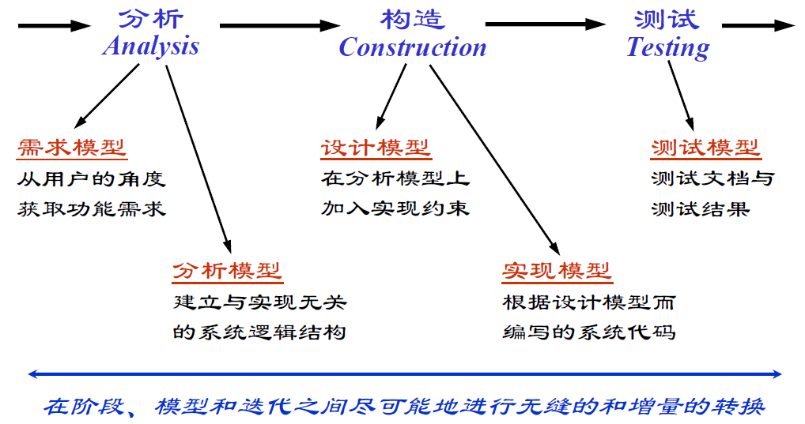{width=60%}

- **功能模型**：从用户角度描述系统功能，由用例和场景组成；
- **分析对象模型**：描述系统的概念实体，由类图和对象图组成；
- **动态模型**：描述对象之间的交互行为，由状态图和顺序图组成。

分析阶段的制品（分析模型）包括：**分析类**（概念层次上的内容，用职责定义其行为）、**用例实现**（分析类图、交互图与事件流分析，以及描述持久性、并发性、安全性等非功能需求的补充需求）、**分析包**（把概念相近的模型元素组织在一起）与**体系结构描述**。三大视图的构成与作用可对照如下表所示。

| 视图 | 构成 | 作用 |
|------|------|------|
| 功能模型 | 用例与场景 | 从用户角度描述系统功能 |
| 分析对象模型 | 类图与对象图 | 描述概念实体与结构 |
| 动态模型 | 状态图与顺序图 | 描述对象间的交互行为 |

三大视图从不同角度互补地刻画系统，其关系如图所示。

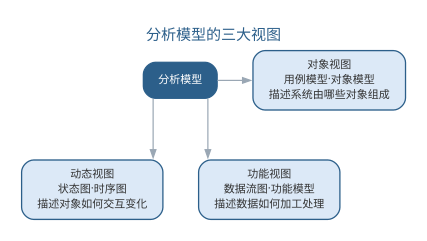{width=80%}

## 分析类的三种类型

分析类分为三类，各自承担不同的职责：

- **实体类**：表示系统存储和管理的持久信息，通常对应现实世界中的"事物"；

  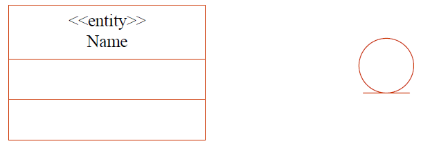{width=45%}
- **边界类**：表示参与者与系统之间的交互，包括用户界面、系统接口与设备接口；

  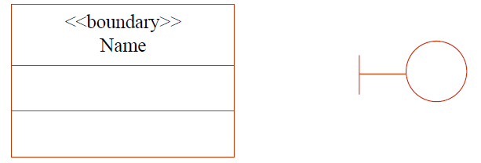{width=45%}
- **控制类**：封装用例的事件流控制逻辑，将执行逻辑与边界、实体隔离。

  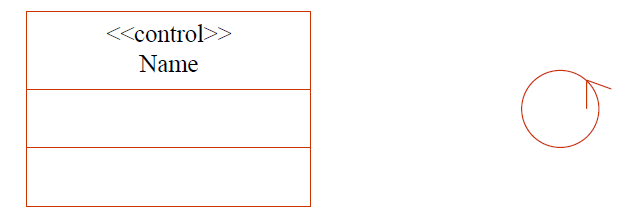{width=45%}

**用例实现**是从设计和分析追溯到需求的方法：动态上以直接对应用例事件序列的交互图表示，静态上以反映参与用例的类及其关系的类图表示。三类分析类的职责与识别要点可对照如下表所示。

| 类类型 | 职责 | 识别要点 |
|------|------|------|
| 实体类 | 表示系统存储和管理的持久信息 | 对应现实世界的"事物" |
| 边界类 | 表示参与者与系统的交互 | 用户界面、系统/设备接口 |
| 控制类 | 封装用例的事件流控制逻辑 | 将执行逻辑与边界、实体隔离 |

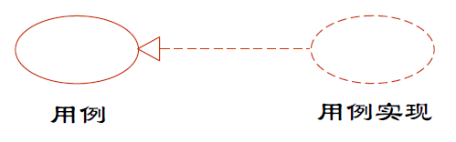{width=55%}

实体类之间通过关系连接形成领域结构，例如订单系统中顾客、订单与支付记录的关系如图所示。

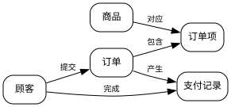{width=85%}

## 面向对象分析的过程

OOA 的过程是一个由粗到精的迭代过程：

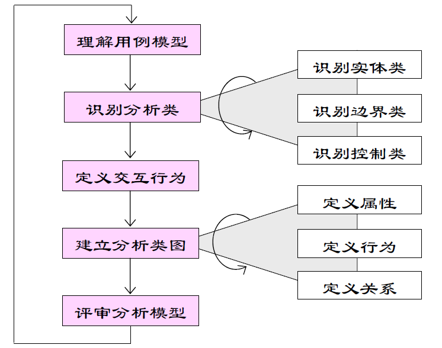{width=60%}

1. **理解用例模型**：理解用例和词汇表，必要时补充系统内部行为的描述；
2. **识别分析类**：找出能够执行用例行为的分析类。通常一个参与者与一个用例的交互对应一个边界类，一个用例对应一个控制类（用例复杂或关系密切时可拆分或合并），实体类则从用例中的参与对象与问题域中识别；
3. **定义交互行为**：用交互图将用例行为分配到分析类，并借此发现遗漏的分析类；
4. **建立分析类图**：确定分析类的关键属性、责任与关系，可应用**分析模式**（描述业务领域通用部分的模板，如"联系点"模式）提高复用性；
5. **检查分析模型**：从正确性、完整性、一致性、可行性四个方面审查模型。

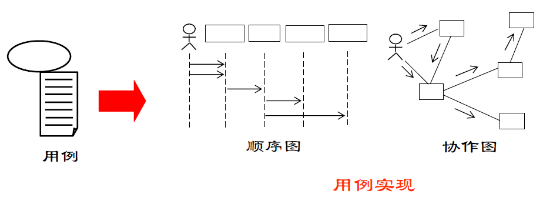{width=50%}

其中，识别实体类特别依赖文档质量：自然语言描述中名词可能对应类、属性或同义词，需要分析人员结合问题域反复筛选；定义属性应从常识、问题域、系统责任与需要保存的信息等多个途径获得。

## 样例：图书借阅系统的分析模型

以图书借阅系统为例，可以完整走一遍分析建模的过程。系统主要支持读者借书、还书与查询图书，涉及的**候选类**从问题域中不难找：图书、读者、借阅记录等。再按分析类的三种类型归类，便形成下表所示的候选清单。

| 候选类 | 类型 | 职责 |
|------|------|------|
| 图书 | 实体类 | 保存书名、作者等书目信息 |
| 读者 | 实体类 | 保存读者信息与借阅资格 |
| 借阅记录 | 实体类 | 记录借出与归还的状态、期限 |
| 借书界面 | 边界类 | 接收读者输入并展示结果 |
| 借阅控制 | 控制类 | 校验资格与额度，生成借阅记录 |

实体类对应问题域中的"事物"，边界类对应用例中参与者与系统的交互点，控制类封装用例的事件流。用例视图与逻辑视图在此相互对应：用例"读者借书"由边界类借书界面捕捉输入、控制类借阅控制编排流程、实体类借阅记录保存结果；用例图上的参与者与交互点，落到类图上便是边界类与实体类之间的关联——两个视图由此在分析阶段对齐。

## 案例：领域模型如何统一团队语言

一个典型的返工案例：需求文档写"借书、还书、续借"，数据库开发却说"insert、delete、update"。需求方提交"借书"，开发按"insert 一条记录"理解，测试发现归还后借阅状态未更新——原来"还书"既含删记录也含改状态，术语错位导致反复沟通与返工。

问题不在技术，而在**团队没有共同语言**。引入领域模型后，团队把"借书"定义为"新增待归还的借阅记录"，"还书"定义为"更新记录状态并计算逾期"，"续借"定义为"延长截止日期"，并用词汇表固定下来。

| 业务动作 | 需求方说法 | 开发方旧说法 | 领域模型统一后 |
|------|------|------|------|
| 借书 | 借书 | insert | 新增借阅记录（待归还） |
| 还书 | 还书 | delete | 更新记录状态并校验逾期 |
| 续借 | 续借 | update | 延长借阅截止日期 |

术语统一后，沟通成本明显下降：评审不再解释业务动作含义，测试用例也按统一术语书写——这正是分析模型的深层价值，团队各方可反复参照的**共同语言**。

## 样例：从需求描述到分析模型的转变

给定一段典型的需求描述："读者凭借书证可借阅图书，每位读者可同时借阅多本图书，每本图书都有唯一索书号；归还时登记还书日期，逾期则记录滞纳金。"从这段文字到初步类图，可走"读需求→找名词→定类→画关联"四步。

1. **读需求**：通读全文，圈出名词——读者、借书证、图书、索书号、还书日期、滞纳金；
2. **找名词**：区分类、属性与同义词。读者、图书是类；索书号、还书日期像属性；借书证是读者的属性，滞纳金可由规则计算；
3. **定类**：确认名词为分析类并补属性——读者（借书证号、姓名）、图书（索书号、书名、作者）、借阅记录（借出日期、还书日期、是否逾期）；
4. **画关联**：读者与借阅记录一对多、图书与借阅记录一对多、读者与图书经借阅记录间接关联。

于是得到以借阅记录为中心的初步类图，虽不完整，但已具备类、属性与关联这些关键要素，补充需求在后续迭代中逐步加入。

## 智能分析助手

LLM 为软件分析带来了新的工具：从用例描述中**自动识别**实体类、边界类与控制类候选；将自然语言事件流**转换**为交互图与类图草稿；对照检查清单**发现**分析模型的遗漏与不一致；跨文档**生成**数据字典与词汇表，统一术语。

分析过程的人机分工逐渐清晰：分析人员负责业务判断与取舍，AI 承担文本提炼、候选识别与一致性检查。值得注意的是，一个时代的更替往往表现为**过程、方法、工具与范型**四者的协同变化——正如敏捷方法标志着一个时代，LLM 正在同时触动软件工程这四个维度，预示着智能软件工程新时代的到来。分析阶段的智能化正是这一变化在需求与设计之间架起的桥梁。

分析类候选识别看似自动化程度很高，实际仍依赖分析人员的把关：LLM 从自然语言中挑出的"候选类"往往是名词的堆砌，哪些是真正的实体类、哪些只是属性或同义词，需要结合问题域判断；边界类的识别尤其如此——参与者与系统的交互点并不总是显式出现。因此成熟的做法是把 LLM 的候选识别当作"第一遍过滤"，再由分析人员对候选清单逐项审查、合并与取舍，避免模型把"文字游戏"当作"领域分析"。

分析模式的复用同样可以智能化：把经典的"联系点"等分析模式沉淀为可检索的模板库，当 LLM 识别到问题结构（如"某人多次使用某物的记录"）时推荐对应模式，让分析类图在更高抽象层次上保持一致。智能分析并没有改变"分析是创造性活动"的本质——它压缩的是文本处理与候选枚举的成本，而判断"这个领域真正重要的是什么"，仍然属于分析人员。LLM 分析助手的四类能力与人工把关点如下表所示。

| 能力 | 作用 | 人工把关 |
|------|------|------|
| 自动识别 | 从用例描述识别实体/边界/控制类候选 | 判断真类与属性、同义词 |
| 自动转换 | 事件流 → 交互图、类图草稿 | 审查语义与映射 |
| 自动发现 | 对照检查清单发现遗漏与不一致 | 确认并处置问题 |
| 自动生成 | 生成数据字典与词汇表 | 统一术语并核对 |

LLM 分析助手的四类能力最终都汇交给分析人员决策，如图所示。

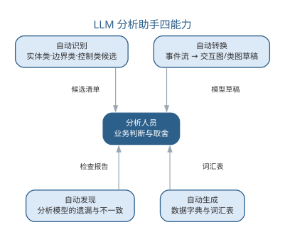{width=65%}

AI 压缩文本处理与候选枚举的成本，领域判断始终由分析人员作出。

从需求文档到分析模型，LLM 助手的典型工作流分五步：

1. **统一术语**：抽取需求文档中的术语生成数据字典草稿，消除"同名异物、异名同物"，为后续输出提供固定用词；
2. **识别候选类**：按实体、边界、控制三类枚举候选类，每个候选标注识别依据与所在句子；
3. **分配职责**：把用例事件流中的每个动作映射到候选类，标注"由谁完成"，发现无归属的动作并列出；
4. **建立关系**：依据动作交互生成类图草稿，标注关联、多重性与依赖，暂不追究实现细节；
5. **一致性检查**：对照正确性、完整性、一致性、可行性清单扫描模型，输出疑点报告。

把前四步落到提示词上，便是从需求文档到分析模型的模板：

```text
你是资深分析人员。请根据需求文档完成初步分析，分步输出：
1. 数据字典：抽取术语并给出定义，标注来源句子，重复定义合并；
2. 候选类清单：按实体类/边界类/控制类分类，每项给出识别依据；只输出文档中出现或可合理推断的内容，推断内容标注"[推断]"；
3. 职责分配：把每个事件流动作映射到候选类，标注"由谁完成"；无归属的动作单独列出；
4. 疑点报告：对照"正确、完整、一致、可行"清单逐项扫描，列出疑点与缺失前提。
要求：分步输出，不要一次性给出完整分析模型；描述未提及的行为不得虚构。
```

模板与工作流一致地坚持"分步产出、标注推断"，是让分析结果可审查、错误可定位的前提。智能分析助手的局限与失败模式如下表所示。

| 失败模式 | 典型表现 | 应对要点 |
|------|------|------|
| 名词堆砌 | 把属性、动作与同义词误当实体类 | 候选类只是第一遍过滤，逐项审查合并 |
| 职责虚构 | 把文档未说的行为分配给类 | 无归属动作列入疑点，退回补充上下文 |
| 过度结构化 | 简单描述被建模为复杂关系网 | 保持"一次只交一件事"的节奏，分步产出 |
| 边界遗漏 | 参与者与系统的交互点未识别 | 结合问题域判断边界类，必要时补访谈 |

这四种失败模式说明：LLM 处理的是文本，而分析面对的是业务——把文本转换为业务判断，仍须由分析人员完成。工作流的粒度也需要控制："一次只交一件事"意味着每个提示词只索取一种制品，候选清单就只给候选清单、字典就只给字典；粒度太粗时模型容易把候选与结论混在一起，粒度太细则往返成本上升。对大多数项目，先出字典与候选清单、再审定关系与职责，是较为经济的顺序。智能分析没有改变分析过程的本质，但它重新划分了人机分工，各步骤中 AI 与人的分工如下表所示。

| 分析步骤 | AI 承担 | 人工保留 |
|------|------|------|
| 统一术语 | 抽取术语、合并重复定义 | 确认领域语义、定别名 |
| 识别候选类 | 枚举实体/边界/控制类候选 | 判断真类与属性、同类合并 |
| 分配职责 | 把动作映射到候选类 | 处置无归属动作、补充上下文 |
| 建立关系 | 生成关系与多重性草稿 | 确认业务规则与约束 |
| 一致性检查 | 对照清单扫描疑点 | 核实并修订模型 |

这张表与本章前述 OOA 过程的五个步骤一一对应，说明智能分析只是把每一步的"枚举与文本工作"交给 AI，判断与取舍始终在人。

工具层面，团队常用对话式 LLM 配合结构化的分析文档模板，把输出直接沉淀为类图草稿与数据字典表；选型要点是能否按实体/边界/控制分类输出、是否支持把候选清单导出为可评审的清单文件。

分析模型的质量检查可以分层自动化：完整性方面，可由脚本核对用例事件流中的每个动作是否有归属的类；一致性方面，可由工具检查类图与顺序图是否引用同名元素；而正确性与可行性仍依赖分析人员对照业务判断。这与 OOA 过程第五步"检查分析模型"对应——机器把"明显可查"的检查项自动化，人保留"需要业务判断"的检查项。

智能分析的产出质量直接决定下游设计：分析类图中的实体、边界与控制类，是第 7 章设计阶段组件划分与接口定义的主要输入。因此分析阶段的"人确认"不只是为了本章正确，更是为了给设计一个可靠的基线——一个被 AI"名词堆砌"污染的分析模型，会把错误放大到设计与实现。

## 智能分析实践

智能分析实践的常见工作流是把需求文档与用例描述作为输入，交给 LLM 分步产出分析制品：

- **候选类清单**：让模型从用例文本中枚举候选的实体类、边界类与控制类，并给出识别依据，便于分析人员审查；
- **数据字典与词汇表**：自动抽取术语定义，统一全团队用语，消除"同名异物、异名同物"；
- **一致性检查**：把分析模型的检查清单（正确性、完整性、一致性、可行性）转化为提示词，由 AI 对照逐项扫描并报告疑点；
- **交互图草稿**：从事件流描述生成顺序图草稿，供分析人员修正时序语义。

由用例文本到分析模型的典型工作流如图所示。

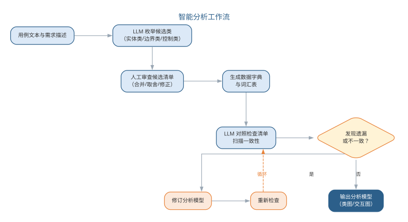{width=80%}

这些步骤产生的制品都应回到"人确认"的闭环：候选类经审查后进入分析类图，术语经确认后进入词汇表，疑点经核实后修订模型。一个实用的建议是保持"一次只交一件事"的节奏——让模型分别产出候选清单、字典、检查报告，而非一次性给出完整分析模型，后者往往难以审查且错误难以定位。

一个完整的智能分析实例：需求为"读者登录后可借书，借阅上限 10 本，归还时校验是否逾期，逾期产生滞纳金"。输入给 LLM 的提示词为：

```text
请完成借阅子系统的初步分析：识别实体类、边界类与控制类候选，把"登录、借阅、归还、计算滞纳金"四个动作分配给候选类，并输出数据字典与疑点清单。
```

AI 输出的片段：实体类候选——读者、图书、借阅记录、滞纳金；边界类候选——登录界面、借阅界面、归还界面；控制类候选——借阅控制、归还控制、滞纳金计算。职责分配——借阅由借阅控制完成，负责校验上限并生成借阅记录；归还由归还控制完成，负责校验逾期。疑点清单——"滞纳金"既是候选类又指向计算动作，归属不清；"借阅上限 10 本"属于业务规则，未标注来源。

评估与修正：其一，"滞纳金"更可能是借阅记录的派生属性而非独立实体，删除候选、改由归还控制按规则计算；其二，登录与借阅两个边界类在实际系统中往往合并为同一会话边界，同类合并。修正后候选清单进入分析类图。AI 初稿与分析人员修正的对照如下表所示。

| 项目 | AI 首版 | 人工修正 |
|------|------|------|
| 候选类 | 滞纳金列为实体类 | 删除，视为借阅记录的派生属性 |
| 边界类 | 登录、借阅、归还三个界面 | 登录与借阅合并为同一会话边界 |
| 疑点处置 | 上限规则未标注来源 | 确认来源并录入业务规则 |

这一步验证了本章反复强调的要点：候选类只是第一遍过滤，"滞纳金是否成类、登录与借阅是否同界"这类问题必须由分析人员结合问题域判断，而不能由模型决定。与人工流程对比，纯人工分析需要反复通读需求、自行枚举类并映射动作，容易遗漏边界类；AI 首版提供了完整的候选与疑点基线，把分析人员的工作从"枚举"转为"判断与修正"，精力集中在最具判断价值的部分。

分析是连接需求与设计的桥梁，其智能化程度直接影响下游设计质量。当被分析的对象本身包含机器学习组件时，还需要把"模型输入输出、性能指标"纳入分析边界，这部分内容将在第 16 章结合 AI 系统需求进一步讨论。

### 智能分析的要点与误区

智能分析的核心误区，是把 LLM 挑出的"候选类"当作分析结论，或让模型一次性产出完整分析模型。要点与误区如下表所示。

| 误区 | 典型表现 | 应对要点 |
|------|------|------|
| 候选即结论 | 名词堆砌直接当类图 | 候选识别只是第一遍过滤，须逐项审查、合并与取舍 |
| 一次性给全模型 | 完整分析模型难以审查 | 保持"一次只交一件事"的节奏，分步产出 |
| 忽视边界类识别 | 参与者交互点遗漏 | 结合问题域判断边界类，必要时退回补充上下文 |
| 术语不统一 | 同名异物、异名同物 | 自动抽取数据字典与词汇表并人工确认 |

分析类候选的筛选漏斗——从 LLM 枚举到人工审查取舍——如图所示。

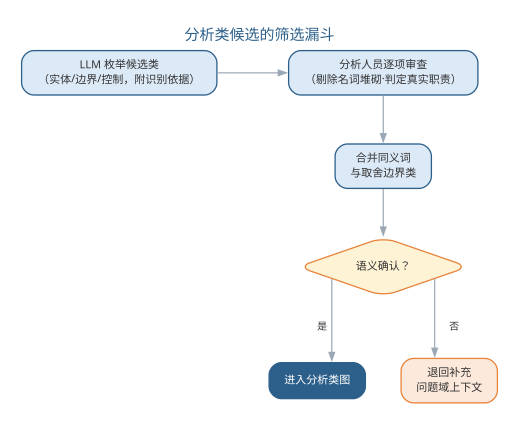{width=65%}

智能分析并没有改变"分析是创造性活动"的本质：它压缩的是文本处理与候选枚举的成本，而判断"这个领域真正重要的是什么"，仍然属于分析人员。

### 前沿演进：领域驱动设计与 AI 辅助事件风暴

**领域驱动设计**（DDD）关注复杂业务领域的建模：战略设计用**限界上下文**与**上下文映射**划分系统边界，战术设计用实体、值对象、聚合与领域服务表达模型。**事件风暴**（event storming）以工作坊形式把业务叙事提炼为领域事件，是 DDD 建模的常用起点。AI 辅助事件风暴：LLM 从访谈记录、业务文档自动枚举候选领域事件、聚合与依赖，大幅压缩工作坊前期整理成本，让专家把时间用于关键判断。DDD 概念与 AI 的分工如下表所示。

| DDD 概念 | AI 辅助 | 人工负责 |
|------|------|------|
| 领域事件 | 从叙事自动枚举候选 | 筛选真实业务事件 |
| 聚合 | 建议候选聚合边界 | 确定一致性与事务边界 |
| 限界上下文 | 提出划分建议 | 确定团队与系统边界 |
| 上下文映射 | 识别上下文间关系 | 确定协作与防腐层 |

AI 辅助事件风暴到 DDD 建模的流程如图所示。

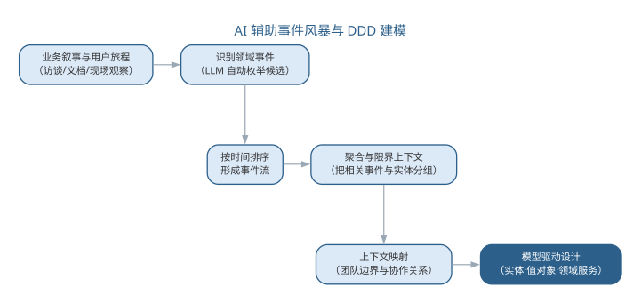{width=85%}

DDD 在微服务时代价值凸显——限界上下文天然对应服务边界。AI 让领域建模的"整理成本"大幅下降，而"领域判断"——什么是核心域、边界如何划分——仍是领域专家与工程师的核心职责。

## 本章小结

软件分析把需求精化为反映真实世界、与实现无关的分析模型，以功能模型、分析对象模型与动态模型三大视图互补刻画系统；分析类分为实体、边界、控制三类，OOA 过程从理解用例到检查模型由粗到精。智能分析把 LLM 引入候选类识别、数据字典生成与一致性检查，压缩文本处理与候选枚举的成本；但 AI 的候选只是"第一遍过滤"，真类与属性、边界的取舍以及领域真正重要的判断仍属于分析人员。"一次只交一件事"的分步产出让结果可审查、错误可定位。分析是连接需求与设计的桥梁，其智能化把分析人员的精力从枚举归还给判断。

**思考与讨论：**
1. 为什么 LLM 挑出的"候选类"不能直接当作分析结论？举例说明名词堆砌与真类的区别。
2. 请为你的项目设计一条从需求文档生成候选类与疑点清单的提示词，并说明"一次只交一件事"如何落实。
3. 分析模型同样可以被 AI 生成后，分析人员的核心价值转向哪里？
