# 软件实现与测试

软件实现与软件测试是生命周期中紧密耦合的两个环节：**软件实现**把设计变成代码，**软件测试**验证代码是否满足要求。软件实现不是把设计机械地转换成源代码的低水平工作，而是一个复杂而迭代的过程——它是设计的继续，直接影响软件的质量与可维护性，既要正确理解需求与设计、正确编写并测试源代码，又要意识到软件全生命周期约 70% 的成本发生在维护阶段，而软件在生命周期中很少由原作者维护，因此"写给人读"的代码风格与工程规范至关重要。软件测试以"证明有错"为使命，通过验证与确认（V&V）回答"是否在正确地制造产品"与"是否在制造正确的产品"，对实现产物作系统化检验。实现与测试在生命周期中紧密耦合、互为输入：测试发现缺陷后返回实现修正，修正后的代码再进入测试，构成质量闭环。本章先讲软件实现（编码、规范、审查与智能编码），再讲软件测试（基本概念、测试技术与智能测试）。

## 软件编码的工作

软件编码包括六个环节：**程序设计**（理解需求与设计模型、补充遗漏的详细设计、设计代码结构）、**设计审查**（检查设计结果并记录缺陷）、**编写代码**（遵循编码规范、保证代码易验证）、**代码走查**（确认代码完成既定工作、记录缺陷）、**编译代码**（修正语法错误）、**测试代码**（单元测试与调试）。六个环节的任务与目的如下表所示。

| 环节 | 主要任务 | 目的 |
|------|------|------|
| 程序设计 | 理解需求与设计、设计代码结构 | 保证编码有据可依 |
| 设计审查 | 检查设计结果并记录缺陷 | 早期发现设计问题 |
| 编写代码 | 遵循编码规范、保证易验证 | 产出可读可维护代码 |
| 代码走查 | 确认代码完成既定工作 | 发现并记录缺陷 |
| 编译代码 | 修正语法错误 | 保证可编译运行 |
| 测试代码 | 单元测试与调试 | 验证行为正确 |

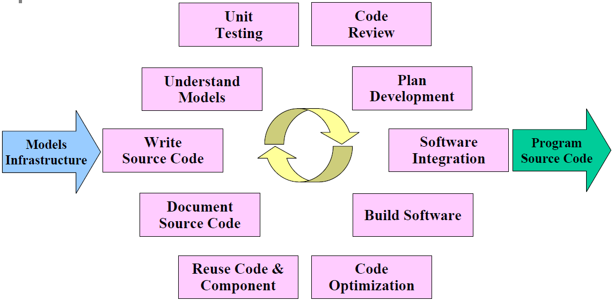{width=60%}

## 编码规范

编码规范是与语言相关的代码编写规则集合，其目的是提高编码质量、增强可读性、可重用性与可移植性。规范从几个方面展开：

- **基本要求**：程序结构清晰简单、算法直接了当、尽量使用标准库与公共函数、用括号消除二义性；
- **可读性**：可读性第一、效率第二。文件与函数有头注释、变量与常量有说明、注释与代码一致、用统一缩进显示逻辑结构，嵌套层次不超过五层；
- **命名规则**：标识符望文知义，遵循"最小长度下的最大信息"原则；变量用名词、函数用动词；类名首字母大写组合、常量全大写用下划线分隔、成员与局部变量用驼峰式命名；
- **结构化要求**：禁止 GOTO，避免多个循环出口，函数保持单入口单出口；
- **正确性与容错性**：程序首先是正确其次才是优美；对用户输入进行合法性检查、变量使用前初始化、提交联调前必须通过单元测试（对每个公有方法测试正确输入与容错处理）；
- **可重用与可移植性**：相对独立的功能封装为公共类或模板，尽量使用标准库与标准 SQL，避免依赖第三方专用接口。

常见的实现缺陷包括：内存泄漏（malloc 分配后未释放）、指针参数失效（值传递无法修改实参）、"野指针"（释放后未置空）、异常处理中的资源未释放、循环内重复计算等。对策是：申请内存后立即检查、释放后置 NULL、申请与释放配对、算法优化与把循环不变量提出循环体。常用命名规范速查如下表所示。

| 标识符 | 命名规则 | 示例 |
|------|------|------|
| 类名 | 首字母大写、组合单词 | OrderManager |
| 方法/函数 | 动词开头、驼峰式 | calculateTotal() |
| 常量 | 全大写、下划线分隔 | MAX_BUFFER_SIZE |
| 成员变量 | 驼峰式、可加下划线前缀 | _orderCount |
| 局部变量 | 驼峰式、简洁达意 | totalAmount |

编码规范的六个维度共同保证代码质量，如图所示。

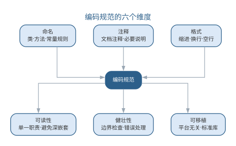{width=75%}

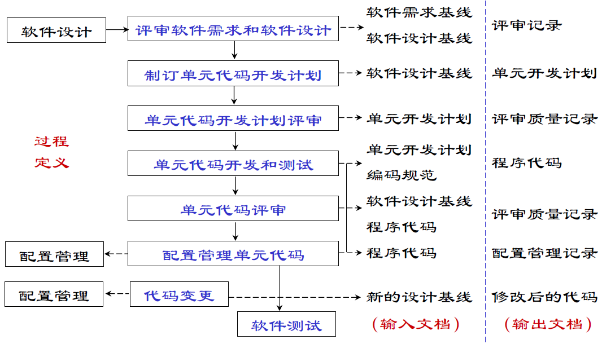{width=60%}

模块之间应保持单向依赖，环形依赖是代码腐化的信号，正确与错误的结构对比如图所示。

{width=70%}

## 代码检查与审查

编译没有错误绝不意味着程序没有错误。**代码检查**通过静态阅读代码发现逻辑、计算、接口、数据处理与文档等各类缺陷，并按严重性（严重/中等/很小）排序调度修正工作。检查清单通常按类、属性、构造函数、方法头、方法体分项检查：命名是否与设计相符、是否尽量私有、头部是否说明目的与前后置条件、每个循环能否终止、是否考虑了非法参数等。**代码审查**则由同行以会议形式系统性检查，是发现缺陷、分享知识的重要手段。三种手段的对比如下表所示。

| 手段 | 方式 | 主要目的 |
|------|------|------|
| 代码检查 | 按清单静态阅读代码 | 发现逻辑、接口等缺陷并按严重性排序 |
| 代码走查 | 作者讲解、小组验证 | 确认代码完成既定工作、记录缺陷 |
| 代码审查 | 同行会议式评审 | 系统性检查、分享知识 |

代码检查、走查与审查三种手段共同构成编码后的质量关口，如图所示。

{width=85%}

三者都指向缺陷修正，只是方式与侧重不同——检查靠清单、走查靠讲解、审查靠同行碰撞。

## 样例：命名从糟糕到良好

命名是编码规范中最立竿见影的一环：标识符是读者理解代码的第一线索，**望文知义的命名**让意图直接可见，糟糕的命名则逼读者逐行推理。下面同一段逻辑——计算图书借阅超期天数与罚款——先给出糟糕的命名版本：

```text
void handle() {
    int a = b.ret - b.due;   // a：借阅天数，b：借阅记录
    int d1 = a - b.allow;    // d1：超期天数
    double tmp = d1 * 0.5;   // tmp：罚款金额，每天 0.5 元
    if (d1 <= 0) { tmp = 0; }
    System.out.println(d1 + "天，" + tmp + "元");
}
```

再给出良好的命名版本：

```text
void printOverdueInfo(Borrower borrower) {
    int daysBorrowed = daysBetween(borrower.returnDate, borrower.dueDate);
    int daysOverdue  = daysBorrowed - borrower.allowedDays;
    double fine = daysOverdue > 0 ? daysOverdue * DAILY_FINE : 0;
    System.out.println(daysOverdue + "天，" + fine + "元");
}

boolean isOverdue(Borrower borrower) {
    return borrower.returnDate > borrower.dueDate;
}
```

两版功能完全相同，可读性却天差地别：

- `handle()` → `printOverdueInfo()`：函数名从"什么也不说"变成"做什么一目了然"；
- `a`、`d1`、`tmp` → `daysBorrowed`、`daysOverdue`、`fine`：变量名把含义（天数、金额）写进标识符，读者不必回看注释；
- `b` → `borrower`：参数的角色与类型清楚，调用处无需猜测"这个 b 是谁"；
- 新增 `isOverdue()`：把"是否超期"提炼成可复用、可测试的布尔函数，命名本身就是一句注释。

命名改变的只是几个字符，改变的却是整个团队理解与维护这段代码的成本。

## 案例：代码审查抓住的经典缺陷

代码审查的价值常被概括为"**第二双眼睛**"：作者熟悉自己的意图，容易"想当然"跳过边界，而旁观者总能问出"这里真的对吗"。一个典型的例子是边界条件——`<=` 与 `<` 的一字之差。

一次订单系统的促销活动规则是"单笔订单满 100 元免运费"，实现时条件却写成了：

```text
if (total < 100) { chargeShipping(); }   // 缺陷：恰好 100 元的订单被收运费
```

正确应为 `total <= 100`。这一字之差意味着，恰好落在 100 元档位的订单会被错误收取运费，若上线将引发成批客诉与赔付。代码审查时，同事一句"100 元整的订单呢？"当场问出了这个缺陷，修正后才合入。审查能抓住的典型缺陷不止边界：

- **数组越界**：循环 `i < n` 写成 `i <= n`，或下标从 1 而非 0 开始；
- **空指针**：解引用前未判断对象可能为 null，异常输入下崩溃；
- **资源泄漏**：异常路径漏释放内存、连接或文件句柄；
- **语义偏差**：逻辑与需求表述不一致，代码"能跑"但"不对"。

审查把"作者自证正确"换成"他人质疑正确"，一次往往能发现 3–5 处测试未必覆盖的边界缺陷。正是这双"第二双眼睛"，让许多事故止步于合入之前。

## 样例：注释与文档的规范写法

注释是写给下一个维护者看的，而不是写给编译器。规范写法的第一原则是：**注释解释"为什么"，而非复述"是什么"**。复述代码的注释只是噪音，解释取舍、约束与历史原因的注释才传递知识。先看差的写法：

```text
double total = 0;
for (Item it : items) {
    total += it.price * it.count;   // 累加价格
}
```

再看好的写法——同样的功能，把"为什么"写清楚：

```text
/**
 * 判断订单是否满足发货条件。
 * 前置条件：order 非空且状态已锁定。
 * 后置条件：不修改订单状态。
 */
boolean canShip(Order order) {
    // 为什么只判库存：运费、地址等校验已在更早的下单环节完成
    // 为什么用 > 而非 >=：库存恰好为 0 时无货可发
    return order.stock > 0;
}
```

规范注释通常分三类：

| 注释类型 | 位置 | 内容 |
|------|------|------|
| 头注释 | 类或模块开头 | 职责、使用方式、维护约定 |
| 接口注释 | 函数声明上方 | 意图、前置/后置条件、参数含义 |
| 关键逻辑注释 | 算法或取舍处 | 解释"为什么这样写"及历史原因 |

头注释让读者不读实现即知职责，接口注释让调用者不读实现即会用，关键逻辑注释保护那些"代码读不出来"的决策。而**与代码不一致的注释比没有注释更有害**——它会把维护者引向错误的方向。

## 案例：一份可读的代码胜过十页文档

"代码即文档"（code as documentation）的含义是：可读的代码本身就是最可靠的文档——它时刻与实际行为一致，不需要维护，也**不会过期**。注释与文档都可能撒谎，代码不会。一个典型的接手场景印证了这一点。

团队接手一个遗留系统，其中有两个规模相近的模块：模块 A 几乎没有注释，但命名清晰、结构简单，如 `invoiceDueDate`、`chargeLateFee()`，一眼能读出意图；模块 B 注释满篇，命名却混乱，如 `a`、`tmp`、`doThing()`，且注释常与代码不符——代码已改而注释未改。半年后，两组维护体验天差地别：

| 模块 | 特点 | 维护体验 |
|------|------|----------|
| A | 无注释，命名清晰 | 读代码即理解意图，改动无需担心旁支 |
| B | 注释满篇，命名混乱 | 每次改动都要通读上下文猜测意图 |

对模块 B 的一次需求变更，团队排查了两天才敢动手，最后靠重读旧代码并补写单元测试验证；而模块 A 的同类变更当天完成。这正说明**命名与结构承担"是什么"，注释只负责解释"为什么"**——与其堆十页文档，不如让每一行代码都被人一眼读懂。

## 智能编码

大语言模型把"编码"从人工逐行书写推向人机协作。AI 编码助手可以：根据注释与函数签名**生成**函数体与测试代码，**补全**上下文相关的代码，对提交前的代码**执行**静态检查与安全扫描，按规范**重构**代码并给出解释。

智能编码的实践要点在于"规范前置"：把命名规则、注释格式、结构要求写入项目约定或提示词，AI 生成的代码才能符合规范；同时在提交前以代码审查清单为提示词让 AI **自检**，以单元测试验证生成结果。AI 大幅提高了编码效率，但正确性与可维护性的责任仍然落在程序员身上——尤其是内存管理、异常路径这类"机器容易犯、且犯错代价高"的场景。

代码生成的质量需要区分两个层次：**可编译**只说明语法正确，**可维护**才意味着可以长期演进。AI 生成的代码在语法层面已经相当可靠，但可维护性——命名是否达意、结构是否符合项目约定、是否包含不必要的抽象、异常路径是否被妥善处理——仍需要以规范和审查来约束。把"能否通过静态检查与单元测试"作为 AI 生成代码的准入门槛，是防止"能跑但不可维护"的低质代码混入基线的最低要求。

对内存管理、并发与异常路径这类"机器容易犯、且犯错代价高"的场景，应当采取更保守的策略：要求 AI 在生成此类代码时**显式说明其资源与并发假设**，由工程师逐行审查后再进入测试；必要时把这类高风险模块标记为"禁止 AI 直接合并"，强制人工评审。编码规范的本质是对风险的分配——AI 适合承担高频低风险的常规实现，而低频高风险的部分始终保留人的判断。AI 与人在编码中的分工如下表所示。

| 环节 | AI 承担 | 人保留 |
|------|------|------|
| 代码生成 | 函数体、补全、重构 | 定义意图与规范 |
| 质量检查 | 静态检查、安全扫描、自检 | 逐行审查高风险部分 |
| 规范执行 | 按项目约定输出 | 制定与维护规范 |
| 风险模块 | 高频低风险的常规实现 | 内存、并发、异常路径把关 |

人机协作编码中，人与 AI 在生成、检查、审查之间交替接力，流程如图所示。

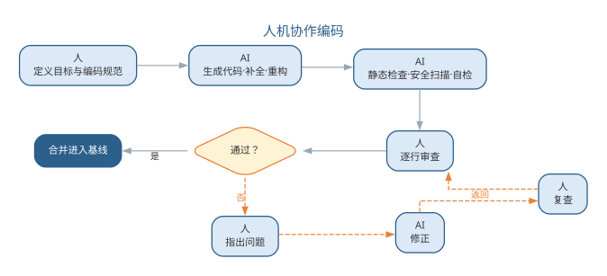{width=90%}

AI 负责高频低风险的生成与检查，人守住审查与合并的最终关口。AI 在不同编码任务上的能力并不均等，边界与人工把关点如下表所示。

| 任务类型 | AI 能力 | 人工把关点 |
|------|------|------|
| 代码补全 | 强（局部、上下文相关） | 采纳后审查语义是否贴合意图 |
| 代码问答与解释 | 强 | 核对解释与实现一致 |
| 函数级生成 | 中强（依赖提示质量） | 规范符合性、异常路径处理 |
| 跨文件重构 | 中（易引入遗漏） | 逐文件评审、跑全量测试 |
| 架构级决策 | 弱（缺乏全局约束） | 由人决策，AI 仅提供候选方案 |

把编码规范落到提示词上，就是一条"规范前置"的生成模板：

```text
你是本项目的资深工程师，请根据函数签名实现函数体，并遵守项目编码规范：
- 命名：动词开头、驼峰式；局部变量简洁达意
- 头注释：先写 3 行说明意图与前置/后置条件
- 容错：对非法参数返回明确错误，不抛裸异常
- 单入口单出口；不使用全局状态
函数签名：public BigDecimal calculateTotal(List<OrderItem> items)
请先输出实现，再输出 100 字以内的自检说明（列出满足了哪些约束）。
```

把编码规范写进提示词有四个好处：规范随每次生成自动执行，而非事后检查；要求模型自检把"审查"前移到生成时；提示词本身可版本化、随规范演进；同一模板可复用为评审提示词，把"生成规范"与"审查规范"统一。规范前置的落地流程是：建立项目规范 → 写进提示词模板 → AI 生成并自检 → 静态检查与单元测试 → 人工审查高风险部分，形成闭环。

## 智能编码实践

智能编码的工程落地主要围绕编码助手与审查流水线展开。**编码助手选型**上，编辑器内嵌的补全型助手（如 GitHub Copilot）适合常规代码补全，对话式开发工具（如 Cursor、Claude Code）适合多文件修改与重构，团队可按任务类型组合使用。无论选哪类工具，都应先建立项目级编码规范，再让 AI 输出，即"规范前置"：

| 编码规范条目 | 提示词化要点 |
|------|------|
| 命名规则 | 在提示词中说明命名风格与示例 |
| 文件与函数头注释 | 要求 AI 输出前先写注释说明意图 |
| 结构化要求 | 禁止 GOTO、单入口单出口 |
| 正确性与容错性 | 要求 AI 处理非法输入并说明边界 |
| 可重用与可移植性 | 要求优先使用标准库 |

提交前的质量关卡通常由"自动检查 + AI 自检 + 人工审查"三层构成：静态分析工具（如 SonarQube、CodeRabbit）自动扫描规则违反与安全风险；让 AI 对照评审清单对自身输出自检，报告已知缺陷；工程师针对改动的高风险部分人工审查。这样把 AI 的高效与人的判断结合起来，避免"生成的代码无人负责"。

编码助手按任务类型组合使用，选型要点如下表所示。

| 工具类型 | 代表 | 适合任务 | 局限 |
|------|------|------|------|
| 补全型 | GitHub Copilot | 常规补全、样板代码 | 缺全局上下文，跨文件能力弱 |
| 对话式 | Cursor、Claude Code | 多文件修改、重构、问答 | 依赖清晰指令，须人工评审 |
| 自动化代理 | Agent 化编码工具 | 端到端任务（生成测试、修复缺陷） | 输出必须经严格验证才能进入基线 |

智能编码的工程落地可归纳为四步：其一，**立规范**——建立项目编码规范并写成约定文件（如 CLAUDE.md、AGENTS.md）与提示词模板；其二，**选工具**——按任务类型组合补全型与对话式工具，先小范围试点并跟踪采纳率；其三，**建关卡**——配置"自动检查 + AI 自检 + 人工审查"三层门禁，高风险模块标记"禁止 AI 直接合并"；其四，**评效果**——用基准任务与交付指标（采纳率、缺陷率、交付周期）评估工具收益与边界，持续调优提示词与治理策略。四步形成从选型到治理的闭环，让 AI 编码从"个人效率工具"升级为"团队工程资产"。

与生成债相伴的是**维护成本前置**：AI 可以快速产出大量代码，也让错误以同样速度积累。生成债（generation debt）指自动生成的、缺乏设计沉淀与测试覆盖的代码堆叠而成的高维护成本区域。控制生成债的关键是把 AI 编码纳入与人工编码同等的工程纪律——生成即测试、生成即评审、定期重构，并在度量上跟踪"AI 产出代码的缺陷密度与返工率"，让效率提升不转化为债务堆积。

"规范前置"还要求规范可及：AI 编码助手需要能读到项目规范与相关代码。团队通常以**约定文件**（如 CLAUDE.md、AGENTS.md）集中描述项目结构、编码规范、常用命令与红线约束，并配套检索知识库，让 AI 在生成时动态获取相关上下文。约定文件的常见内容如下表所示。

| 内容 | 说明 | 示例条目 |
|------|------|------|
| 项目概览 | 技术栈、目录结构、构建方式 | "本仓库为 Spring Boot 多模块项目" |
| 编码规范 | 命名、注释、结构要求 | "标识符用驼峰式、常量全大写" |
| 常用命令 | 构建、测试、运行命令 | "make test 运行全部单元测试" |
| 约束与红线 | 禁止事项与降级策略 | "禁止 AI 直接修改数据层" |

提交前的三层质量关卡如图所示。

{width=85%}

智能编码的边界在于：AI 擅长的是"把已有的明确意图转换为代码"，而"这个意图是否正确""改动是否引入了回归"仍需测试与评审回答。工程师在智能编码时代的新角色——阅读、评估与整合 AI 生成代码——被概括为"代码策展"（code curator），这一概念将在第 11 章详细展开。

一个完整的智能编码实例如下。需求是"实现购物车价格汇总：按单价×数量累加，满 1000 元打九折"。工程师写下的提示词为：

```text
实现 calculateTotal：对订单项按"单价×数量"累加，满 1000 元打 9 折；
金额用 BigDecimal 避免浮点误差；入参为空返回 0；头注释说明前置条件。
```

AI 的第一版输出了可编译的实现，并在自检中说明已满足"BigDecimal 与空入参"两条约束。工程师评审发现两处可维护性问题：其一，折扣率 0.9 被硬编码为字面量，而项目约定"业务参数可配置优先"；其二，BigDecimal 除法未指定舍入模式，输入含除不尽的比例时可能抛出 `ArithmeticException`。把这两点写入提示词后生成第二版，补齐了配置提取与舍入处理，经单元测试与静态检查后合入。

这个实例说明两点：AI 生成的第一版往往"能跑"但"不符合约定"，命名、可配置性、边界处理这类可维护性缺陷仍需人工评审发现；而提示词中声明"用 BigDecimal、说明前置条件"等约束，能显著减少首版缺陷。与纯人工编写相比，首版效率提升明显，但审查环节并未消失——它只是从"写之前思考"部分转移到"生成后评审"。

### 智能编码的要点与误区

智能编码的常见误区，是混淆"可编译"与"可维护"两个层次，或在内存、并发等高风险场景放松审查。要点与误区如下表所示。

| 误区 | 典型表现 | 应对要点 |
|------|------|------|
| 可编译即可维护 | 语法正确却难以演进的代码入基线 | 以规范与审查约束命名、结构与异常路径 |
| 高风险场景放权 | 内存/并发代码由 AI 直接合并 | 要求 AI 显式说明资源与并发假设，人工逐行审查 |
| 规范后置 | 先让 AI 输出再补规范 | 规范前置：命名、注释、结构要求先写入提示词 |
| 三层关卡缺层 | 只做静态检查，无人审高风险改动 | 自动检查 + AI 自检 + 人工审查三层齐备 |

代码策展的工作流——从阅读评估到验证把关——如图所示。

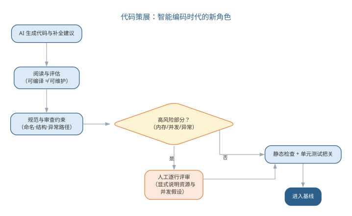{width=75%}

把"能否通过静态检查与单元测试"作为 AI 生成代码的准入门槛，是防止"能跑但不可维护"的低质代码混入基线的最低要求；而对高风险模块，应把这类改动标记为"禁止 AI 直接合并"，强制人工评审。

### 前沿演进：上下文工程与 AI 编码治理

前沿的 AI 编码实践把**上下文工程**（context engineering）作为核心：项目以约定文件（如 CLAUDE.md、.cursorrules、AGENTS.md）与检索知识库组织上下文，AI 编码时按任务动态检索架构文档、编码规范与代码样例，让生成贴合项目实际。同时，**AI 编码的治理**关注采纳率、生成债与降级策略：评测 AI 工具的效果（如 SWE-bench 类基准）、管理自动生成的代码债、定义何时退回人工编码。治理面与目标如下表所示。

| 治理面 | 实践 | 目标 |
|------|------|------|
| 上下文组织 | 约定文件 + 检索知识库 | 生成贴合实际 |
| 效果评测 | 基准与采纳率跟踪 | 量化工具价值 |
| 生成债管理 | 定期重构与清理 | 控制技术债 |
| 降级策略 | 高风险场景人工编码 | 保障质量底线 |

项目上下文工程的闭环——从收集到沉淀——如图所示。

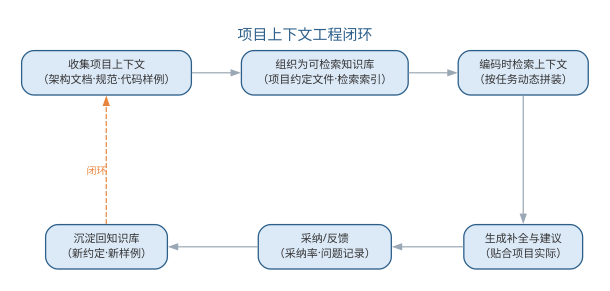{width=85%}

上下文工程揭示了一个关键转变：AI 编码的质量不再只取决于模型能力，而取决于"喂给模型什么"。上下文组织能力成为工程师的核心技能，它与代码评审一起，构成 AI 编码时代质量的两道闸门。

智能编码解决的是"把意图变成代码"的效率问题，而"代码是否正确""改动是否引入回归"仍需系统化验证来回答，编码产物正是在测试中接受检验。有错是软件的属性，而且无法根本改变。软件工程的关键在于如何避免错误的产生、消除已经产生的错误，把错误密度降到尽可能低。软件测试正是最核心的防线。

## 基本概念

测试领域有一组容易混淆的基本概念：**错误**（Error）是导致系统可能包含故障的人的行为，如输入错误、需求错误、设计错误；**缺陷**（Defect/Bug）是错误的表现；**故障**（Fault）是系统的规格说明与行为之间的偏差。**验证**（Verification）回答"我们是否在正确地制造产品"，检验各阶段产品是否满足需求，强调对过程的检验；**确认**（Validation）回答"我们是否在制造正确的产品"，保证最终产品符合用户需求，强调对结果的检验。

**软件测试的目的**是证明程序有错，而不是证明程序无错误。一个好的测试用例在于能够发现至今未发现的错误；一个成功的测试是发现了至今未发现的错误的测试。因此测试者应当：尽早和不断地测试；避免程序员检查自己的程序；测试用例包括合理输入、不合理输入与各种边界条件；充分注意缺陷的群集现象；制定严格的测试计划；注意回归测试的关联性；妥善保存测试文档。

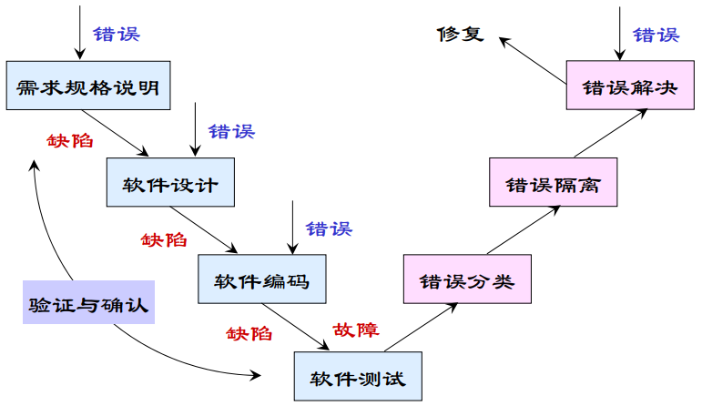{width=55%}

上述概念的含义与相互关系可对照如下表所示。

| 概念 | 含义 | 相互关系 |
|------|------|------|
| 错误（Error） | 人的行为，如输入、需求、设计错误 | 是缺陷的来源 |
| 缺陷（Defect/Bug） | 错误在软件中的表现 | 可能触发故障 |
| 故障（Fault） | 规格说明与行为之间的偏差 | 由缺陷引起 |
| 验证（Verification） | 是否在正确地制造产品 | 强调对过程的检验 |
| 确认（Validation） | 是否在制造正确的产品 | 强调对结果的检验 |

## 验证与确认活动

验证与确认贯穿生命周期：需求阶段通过用例、形式化方法与需求评审建立测试依据；设计阶段借助断言、契约设计与设计评审；实现阶段以软件测试为主要工具，辅以代码走查、检查与评审。验证方式分为**静态方法**（走查、审查、检查，通过人工分析确认正确性）与**动态方法**（执行程序以确认是否有问题）。

{width=55%}

**评审**由开发人员、用户、领域专家等组成会审小组，对工作制品进行静态分析；**走查**由设计或编程人员按测试用例人工模拟计算机运行一遍；**检查**由经严格训练的人员按评估标准、按规定程序发现错误。三种活动是发现需求、设计与代码缺陷的低成本手段。验证的静态与动态两类方式可对照如下表所示。

| 维度 | 静态方法 | 动态方法 |
|------|------|------|
| 手段 | 人工分析，不执行程序 | 执行程序观察行为 |
| 形式 | 评审、走查、检查 | 单元/集成/系统测试 |
| 目标 | 发现需求、设计与代码缺陷 | 确认行为符合规格 |
| 成本 | 低，适合早期 | 高，需运行环境与用例 |

## 测试文档与测试过程

标准测试文档包括：**测试计划**（规定测试的范围、方法、资源与进度）、**测试规范**（规定用例的运行环境、生成与执行步骤）、**测试用例**（数据输入与期望结果组成的对）、**缺陷报告**（记录缺陷的严重性与优先级）。软件测试遵循 **V 模型**：单元测试对应详细设计、集成测试对应体系结构设计、系统测试对应需求分析、验收测试对应客户需求。

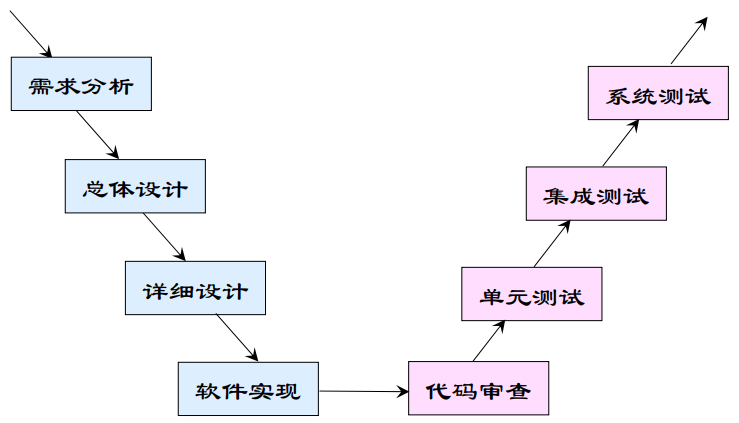{width=60%}

**单元测试**对软件基本单元进行测试，一般由编写该单元的开发者执行，需要驱动模块与桩模块模拟上下层；

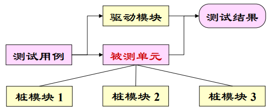{width=55%}**集成测试**在单元测试基础上按层次、功能、进度或使用关系组装模块，测试接口问题；**系统测试**在实际运行环境下进行功能、性能、压力、安全性、恢复、GUI、安装等各类测试；**验收测试**以用户为主、用实际数据测试，常辅以 α 测试（用户开发环境下进行）与 β 测试（多用户实际环境下进行）；**回归测试**验证系统变更没有破坏原有功能，常因重复劳动而需要自动化。

## 测试技术

**黑盒测试**（功能测试）把测试对象当作黑盒，依据需求规格说明检查功能实现，不关心内部逻辑；**白盒测试**（结构测试）利用程序内部逻辑设计用例，对逻辑路径进行测试。由于穷尽输入与穷尽路径都不可能，测试必须借助系统化方法：

- **等价类划分**：把可能的输入划分成若干等价类，每类选一个代表测试用例，把用例数量降到最少；
- **边界值分析**：在等价类"边缘"选择元素，因为错误多发生在边界附近；

  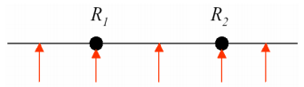{width=50%}
- **路径测试**：基于程序控制流图分析环路复杂性，导出基本路径集合，保证每条可执行语句至少执行一次；

  {width=50%}

路径测试的度量基础是程序的控制流图：节点表示基本块，有向边表示控制转移，环路复杂性 $V(G)=E-N+2P$ 即由其中的节点数、边数与连通分量导出。一个程序的控制流图如图所示。

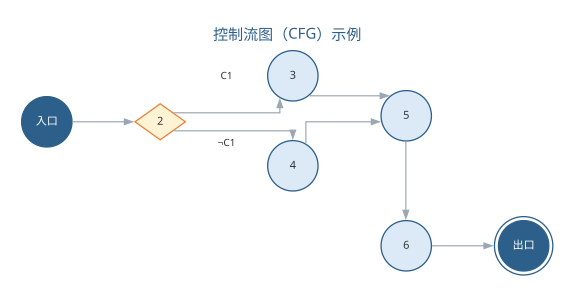{width=80%}
- **基于状态的测试**：从 UML 状态图得出测试用例，适合面向对象系统。
以经典的"日期加一天"函数（给定年月日，返回加一天后的日期）为例，用等价类划分与边界值分析得到的部分测试用例如下表所示。

| 序号 | 输入：月 | 日 | 年 | 期望输出 |
|------|--------|----|----|----------|
| 1 | 2 | 14 | 2000 | 2000 年 2 月 15 日 |
| 2 | 2 | 28 | 2000 | 2000 年 2 月 29 日（闰年） |
| 3 | 2 | 28 | 2002 | 2002 年 3 月 1 日（平年） |
| 4 | 2 | 29 | 1996 | 1996 年 3 月 1 日（闰年） |
| 5 | 2 | 30 | 1996 | 无效的输入日期 |
| 6 | 6 | 30 | 2000 | 2000 年 7 月 1 日 |
| 7 | 6 | 31 | 2000 | 无效的输入日期 |
| 8 | 12 | 31 | 2000 | 2001 年 1 月 1 日 |


面向对象测试的特殊性在于：用**类测试**代替传统单元测试（测试类的属性、操作与各状态下的对象），用**基于场景的类集成测试**代替传统集成测试（按用例场景把相关类集成，保证每个方法至少执行一次，先测最平常的场景再测异常场景）。黑盒测试与白盒测试派生出多种系统化用例设计技术，其分类如图所示。

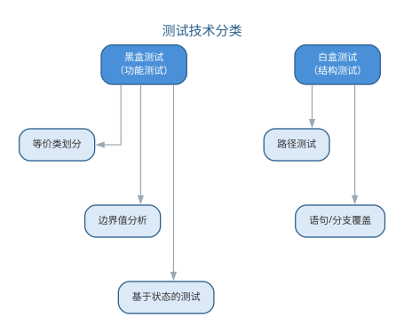{width=65%}

穷尽输入与穷尽路径都不可能，系统化技术正是为了用最少的用例覆盖最多的行为。路径测试的用例规模取决于程序的**环路复杂性** $V(G)$（McCabe 度量）：对控制流图 $G$，有

$$V(G)=E-N+2P$$

其中 $E$ 为图中边数，$N$ 为节点数，$P$ 为连通分量数（单程序取 1）。基本路径集合的大小恰等于 $V(G)$，由此可估计需要的最少测试路径数。覆盖程度同样可以定量刻画——**语句覆盖**要求每条语句至少执行一次，**分支覆盖**要求每个判定的每个分支至少走一次，覆盖率的度量式为：

$$C_0=\frac{S_{\mathrm{exec}}}{S_{\mathrm{total}}},\qquad C_1=\frac{B_{\mathrm{exec}}}{B_{\mathrm{total}}}$$

其中 $C_0$ 为语句覆盖率、$C_1$ 为分支覆盖率，下标 exec 表示已执行、total 表示总数。覆盖率是测试充分性的客观标尺，但覆盖充分并不等于无缺陷——它只回答"测过哪些"，不回答"行为是否正确"。

## 样例：等价类划分设计测试用例

以"登录密码规则校验"函数 `validatePassword(pwd)` 为例，演示等价类划分的完整过程。该函数按规则返回"合法"或"非法"：**密码长度 6–20 位，仅含字母与数字，且两者必须同时出现**。把全部可能的输入划分为有效等价类与无效等价类，每一类只需选一个代表输入，即可代表整类的行为。

| 等价类 | 代表输入 | 期望结果 |
|--------|----------|----------|
| 有效：长度合规且含字母与数字 | `abc12345` | 合法 |
| 无效：长度小于 6 位 | `a1` | 非法 |
| 无效：长度大于 20 位 | `abcdefghij01234567890` | 非法 |
| 无效：只含字母、不含数字 | `abcdefgh` | 非法 |
| 无效：只含数字、不含字母 | `12345678` | 非法 |
| 无效：含空格或符号等其他字符 | `abc 123!` | 非法 |

用这六条用例，即可覆盖数以亿计的可能输入。等价类划分的核心思想是**以类代全**：同类输入的行为预期一致，测试其中一条就等效于测试整个类，从而用最少的用例换取最广的覆盖。

## 样例：边界值分析找出真实缺陷

经验表明，缺陷往往不出在等价类"内部"，而藏在类的**边缘**：恰好等于下界、恰好等于上界、临界值加一或减一的位置。对许多系统，下界恰是 0、上界恰是最大值，于是"恰好 0、最大、临界值±1"成为出错最频繁的位置。继续用上节的密码校验函数：长度下界为 6、上界为 20，那么 5、6、7 与 19、20、21 就是必须逐一测到的边界值——漏掉任何一条，都可能让缺陷溜走。

| 用例 | 输入（密码长度） | 边界含义 | 期望结果 |
|------|------------------|----------|----------|
| 1 | 5 位 `abcde` | 下界减一 | 非法 |
| 2 | 6 位 `abc123` | 恰好下界 | 合法 |
| 3 | 7 位 `abc1234` | 下界加一 | 合法 |
| 4 | 19 位（含字母数字） | 上界减一 | 合法 |
| 5 | 20 位（含字母数字） | 恰好上界 | 合法 |
| 6 | 21 位（含字母数字） | 上界加一 | 非法 |

边界处最易出错，是因为判断条件里最常见的**差一位判断**（off-by-one）：把"超过"写成"达到"、把"不足"写成"不足或等于"，恰好踩中边界的输入便被误判。一个典型的缺陷故事是：某实现把上限判断写成 `len >= 20`（正确写法是 `len > 20`），恰好 20 位的合法密码被一律拒绝；因常规用例都用 8 位左右的密码，这条边界从未被测到，缺陷长期潜伏，直到补上第 5 号用例才一次命中。这类差一位判断是软件中最典型、也最隐蔽的缺陷之一，只在恰好走到临界点的那一刻暴露——这正是边界值分析不可省略的原因。

## 案例：测试不足的代价

如果缺陷没有被测试发现，代价可能不是返工，而是生命。**Therac-25 放射治疗机**（1985—1987 年）是软件工程教科书记载的经典悲剧：这台由加拿大原子能有限公司研制的放射治疗设备，在两年间发生多起过量辐射事故，多名患者重伤乃至死亡。事故的直接原因之一，正是**测试不足**——导致过量辐射的并发缺陷从未被测试覆盖到。

| 缺陷类型 | 为何未被发现 | 后果 |
|----------|--------------|------|
| 并发缺陷（竞态） | 仅在快速编辑参数、治疗恰在此时启动的时序下触发，普通测试难以复现 | 转盘未就位即出束，患者被约百倍剂量的射线照射 |
| 错误处理缺陷 | 竞态绕过错误检测，软件未报异常，偶发错误码又被当作"假警报"忽略 | 异常被误判为正常，多次治疗继续过量照射 |
| 安全设计缺陷 | 软件大量复用自前代机型被视为"久经考验"，未对复用部分专项测试；前代硬件联锁被移除，安全完全依赖软件 | 无硬件兜底，缺陷一旦触发即为致命事故 |

事故根源可概括为**过度依赖软件、测试未覆盖并发时序、硬件安全机制缺失**三者的叠加。其教训沉淀为一条原则：对安全关键软件，测试不是可省的开销，而是生命的底线——只有充分覆盖边界、竞态与复用代码，才能让"正确"在意外时序到来时依然成立。

## 智能测试

AI 正在把测试从"费力的必要工作"变成"高效的自动防线"。大语言模型可以：从需求与代码**生成**测试用例（包括等价类与边界值用例）；根据变更**推荐**回归测试范围；分析覆盖率**定位**未测分支；对失败用例**推断**根因并给出修复建议。以生成式测试和基于属性的测试为代表的自动化手段，配合 CI 流水线，实现了提交即测试的质量门禁。

智能测试仍需工程师把握方向：测试用例的"正确期望结果"必须由人定义或由可验证规格推导，AI 生成的用例要避免"测试自己的代码"的盲区，并且要像对待任何测试一样关注缺陷报告与修复验证。

智能测试的核心障碍是**测试预言问题**（oracle problem）：用例给出了输入，但"正确的期望输出"从何而来？对多数功能，期望输出可以由人定义或由可验证规格推导；但对复杂计算、并发行为与 AI 组件，正确的输出往往难以预先断言。应对预言问题有三类途径：以规格与不变量充当预言（断言函数性质）、以多个实现相互印证（差分测试）、以蜕变关系替代精确输出（对同一输入施加变换，断言输出满足某种关系）。AI 在此既可能"生成测试"，也可能"沦为被测对象"——用 AI 生成测试再去测 AI 生成的代码，两者都可能继承同一偏见，形成"自我印证"的假象，这是智能测试必须规避的盲区。

避免"测试自己的代码"的关键在于引入独立的验证源：测试用例的期望结果来源于需求规格而非被测实现，或由另一独立实现、人工推导得到；测试设计基于规格与技术而非 AI 生成的代码内容；并始终用真实的缺陷数据检验测试用例的有效性——一个测试用例的价值在于它能否发现缺陷，而不在于它是否由 AI 生成。应对预言问题的三类途径如下表所示。

| 途径 | 做法 | 适用场景 |
|------|------|------|
| 规格与不变量 | 用断言充当预言 | 功能明确、性质可表述 |
| 差分测试 | 多个实现相互印证 | 存在参照实现 |
| 蜕变关系 | 变换输入、断言输出满足某种关系 | 精确输出难以断言 |

测试预言问题的三类应对途径如图所示。

{width=90%}

三类途径的目的都是为用例提供独立的期望来源，从而避免"测试自己的代码"的盲区。

### AI 生成测试用例的工作流

AI 生成测试用例不是一句提示词的事，而是一个有明确把关点的流程。可落地的工作流如下：

1. **明确被测单元与规格**：给出函数签名、需求规格或接口契约，把被测行为限制在可验证的范围内；
2. **声明覆盖策略**：要求按等价类、边界值与异常分支生成用例，避免 AI 只输出"快乐路径"用例；
3. **生成用例骨架**：由 AI 生成用例的输入与期望输出对照，期望输出依据需求规格或人工推导，而非被测实现；
4. **人工评审期望输出**：逐一确认"正确期望结果"成立——这是预言问题的第一道把关；
5. **接入执行与回归**：把用例接入测试框架与 CI，以执行结果验证用例有效；
6. **评估用例质量**：对高价值模块用变异测试衡量杀毒能力，淘汰"看似覆盖实则空转"的用例。

把覆盖策略写进提示词，就是一条可改造为实验的用例生成模板：

```text
你是资深测试工程师。为下面的函数设计单元测试用例，要求覆盖等价类、边界值与异常分支：
函数签名：public static Date addOneDay(int year, int month, int day)
设计要求：
- 等价类：普通日期、月末、年末、闰年二月、平年二月
- 边界值：月为 1 与 12、日为 1/28/29/30/31、年末跨年、平年/闰年 2 月
- 每个用例给出：输入、期望输出、所属覆盖点
- 期望输出依据日历规则人工推导，不要参考被测实现
- 输出格式：先给用例表（序号/输入/期望输出/覆盖点），再给测试代码骨架
```

该模板把"覆盖点"显式列为用例的属性，使每条用例都能追溯到它验证的行为——这正是测试用例可追溯性要求的落地。在选型上，用例生成能力已内置于主流编码助手与测试平台（如 GitHub Copilot、Katalon 等），团队按语言与 CI 生态选择即可；关键不在工具大小，而在它能否接入既有 CI 与覆盖率、变异测试工具，形成"生成—执行—评估"的闭环。

AI 生成的用例并没有改变系统化测试技术的地位，而是把这些技术自动化：提示词中的覆盖策略，本质上是把等价类划分、边界值分析与路径测试翻译为生成约束；路径测试可要求 AI 基于控制流图列出基本路径集合，基于状态的测试可要求 AI 从状态图导出状态序列——生成之后，仍需以覆盖率工具（如 JaCoCo）与符号执行工具（如 KLEE）核验 AI 声称的覆盖是否属实。

### 智能缺陷定位的工作流

缺陷定位是"从失败到根因"的推理过程。AI 的加入让定位从经验驱动转向证据驱动，工作流如下：

1. **收集失败现场**：把失败用例、异常堆栈、相关日志与最近变更记录交给 AI；
2. **对照行为基线**：让 AI 先说明"程序本应做什么"，再对照"实际做了什么"，定位偏差点；
3. **假设—验证迭代**：AI 提出若干根因假设并给出可验证的判据（断点、日志或最小复现输入），工程师验证后把结果反馈给 AI，逐步收窄范围；
4. **确认根因与修复建议**：对确认的根因，AI 提供补丁并说明改动依据；
5. **回归验证**：修复必须通过原失败用例、相关测试与 CI 回归才能合入。

定位过程本身的记录也是资产：每一次"现象—根因—修复"的配对都可用于构建团队自己的缺陷知识库，供 AI 在后续定位时检索——这与第 7 章缺陷预测依赖历史数据的思想一致，AI 的定位能力随团队历史数据的积累而增强，前提是缺陷记录规范、可检索。测试驱动的缺陷定位与维护期的缺陷定位同源：前者由失败用例触发、后者由线上缺陷报告触发，修复后都必须回归验证，定位与修复的完整工作流将在第 7 章从维护角度进一步展开。

无论生成还是定位，AI 都可能"自信地出错"。智能测试场景下的典型失败模式与应对要点如下表所示。

| 失败模式 | 典型表现 | 应对要点 |
|------|------|------|
| 生成但无预言 | 用例齐全却无独立期望来源 | 以规格断言、差分或蜕变充当预言 |
| 覆盖热闹、断言空洞 | 分支全覆盖但断言少 | 用变异测试衡量杀毒能力 |
| 定位只见局部 | 只看失败点附近，漏掉调用链上游 | 要求沿调用链给出证据链 |
| 修复不回归 | 补丁通过原用例却破坏别处 | 全量回归与影响面核对 |

## 智能测试实践

智能测试的工程落地通常分三层进行。**用例生成层**：让 LLM 从需求规格、函数签名与已有代码生成单元测试与集成测试用例（覆盖等价类、边界值与异常分支），生成的用例由 CI 实际执行，失败的用例返回给 AI 修正——以"能否通过执行"作为用例质量的第一道过滤。**用例质量层**：用变异测试工具（如 Stryker）评估用例的杀毒能力——对代码注入变异体，能杀死的变异体越多说明用例越有效，从而识别"看似覆盖实则空转"的测试。**系统验证层**：对无法精确断言输出的场景引入差分测试（多个实现互相比较）与蜕变测试（对输入变换断言输出关系），这两类手段尤其适用于 AI 组件，详见第 10 章。

智能测试的三层流水线如图所示。

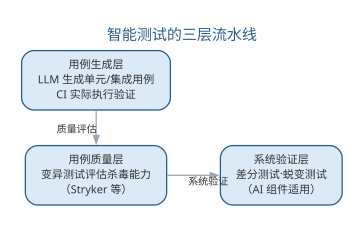{width=75%}

用例的"杀毒能力"可用**变异得分**定量衡量：对代码注入 $M_{tot}$ 个变异体，若测试能杀死其中 $M_k$ 个，则变异得分为

$$\mathrm{MS}=\frac{M_k}{M_{tot}}$$

变异得分越高，说明用例越能捕获行为的细微偏差，越不容易"看似覆盖实则空转"。

质量门禁的配置遵循"先人工验证、后自动放行"的原则：新引入的 AI 生成测试先用人工确认期望输出正确，再纳入 CI 自动执行；回归测试范围由 AI 按变更推荐、由测试负责人确认；覆盖率未达标的模块在合并请求中告警，但不作为唯一的放行依据。测试数据的可追溯性同样重要——每个测试用例都应能追溯到它验证的需求或分支。

智能测试改变的是用例的生成方式，没有改变测试的本质：测试依然是为发现缺陷而设计，缺陷被发现后必须被修复与回归验证，测试用例库本身也需要像代码一样被维护。当被测系统包含机器学习模型时，测试还需要面对非确定性输出的特殊挑战，这部分将在第 10 章讨论。

一个完整的智能测试实例如下。被测函数是本章"日期加一天"的 `addOneDay`，工程师把覆盖要求写进提示词：

```text
为 addOneDay(int year, int month, int day) 生成单元测试：
覆盖等价类（普通/月末/年末/闰年二月/平年二月）、边界值（1、12、28、29、30、31 的月日组合）与异常分支；
期望输出按日历规则手工推导，不要参考被测实现；输出用例表 + 测试代码。
```

AI 的第一版生成了十二个用例，覆盖点标注齐全，但工程师评审发现两处缺口：其一，缺少"2000-02-29 加一天到 2000-03-01"这类跨闰年二月的用例，恰是最容易出错的边界；其二，两个"无效日期"用例断言抛异常，却未断言异常类型。把这两点补进提示词后，AI 生成的第二版补齐了跨闰年用例并明确断言类型。将第二版用例接入 CI 执行，再以变异测试注入变异体，其杀毒能力明显强于第一版——覆盖缺口一旦补齐，"看似覆盖实则空转"的用例大幅减少。

与纯人工设计相比，AI 首版的覆盖面已经相当完整，但"缺哪条边界"仍依赖工程师对领域规则的把握——本实例中跨闰年二月正是由人工评审发现的遗漏。智能测试中"人确认期望输出、人评审覆盖缺口"的环节并未消失，只是从逐个编写用例转为审阅与补全。

### 智能测试的要点与误区

智能测试最常见的偏差，是把 AI 生成的用例当作"有效用例"而跳过质量评估，或让 AI 测试自己生成的代码。要点与误区如下表所示。

| 误区 | 典型表现 | 应对要点 |
|------|------|------|
| 生成即有效 | 用例"看似覆盖实则空转" | 用变异测试评估杀毒能力，以执行结果过滤 |
| 测试自己的代码 | 生成与验证共享同一偏见 | 期望结果源自需求规格或独立实现 |
| 忽略预言问题 | 复杂输出无断言直接放行 | 用规格/差分/蜕变三类途径补充预言 |
| 无人确认期望输出 | 错误期望进入 CI 自动放行 | 新用例先人工确认，再纳入自动执行 |

测试预言问题的三类解决途径——规格预言、差分测试与蜕变测试——如图所示。

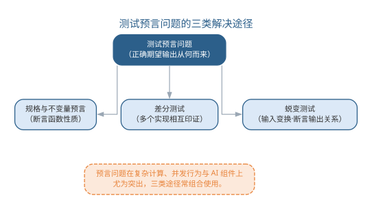{width=80%}

避免"测试自己的代码"的关键在于引入独立的验证源：测试用例的期望结果来源于需求规格而非被测实现，或由另一独立实现、人工推导得到；并始终用真实的缺陷数据检验测试用例的有效性——一个测试用例的价值在于它能否发现缺陷，而不在于它是否由 AI 生成。

### 前沿演进：测试左移、契约测试与评测驱动开发

前沿测试实践强调**测试左移**（shift-left）——把缺陷发现前移到需求与设计阶段：需求阶段用 BDD 规格与可测性检查，设计阶段用契约测试（Consumer-Driven Contract）验证服务接口，编码阶段 AI 生成单元测试，运行阶段用 SLO 监控与混沌工程。**评测驱动开发**（evals-driven development）把"模型能力评测"引入日常开发：为每个功能定义评测集，AI 改动后自动回归，让 AI 系统的行为演进可度量。左移各阶段如下表所示。

| 阶段 | 实践 | 作用 |
|------|------|------|
| 需求 | 规格化 + 可测性检查 | 需求缺陷早期暴露 |
| 设计 | 契约测试 | 接口契约可验证 |
| 编码 | AI 生成单元测试 | 缺陷快速反馈 |
| 集成 | CI + 变异测试 | 用例质量把关 |
| 运行 | SLO + 混沌工程 | 系统韧性验证 |

测试左移的层级——从需求到运行——如图所示。

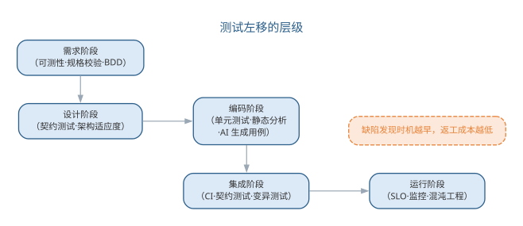{width=90%}

左移让质量从"测试部门的事"变为"全员的事"；而评测驱动开发把测试的理念延伸到 AI 组件——当系统行为由模型而非代码决定时，"测试"就是"评测"，评测集成为 AI 系统的回归测试套件。

## 本章小结

软件实现与软件测试共同构成软件质量的工程防线。软件实现把设计转译为可运行、可维护代码，编码规范（命名、可读性、结构化、容错、可重用）与代码检查、走查、审查构成实现阶段的质量关口；智能编码让 AI 承担生成、补全、检查与重构，但责任仍在人："规范前置"让生成符合约定，三层关卡（自动检查 + AI 自检 + 人工审查）防止低质代码入基线，高风险模块保留人工把关，新角色是代码策展。软件测试以"证明有错"为使命，等价类划分、边界值分析与路径测试等系统化技术用最少用例覆盖最多行为，覆盖率与变异得分是充分性的标尺；智能测试让 AI 承担用例生成与缺陷定位，但预言问题与"测试自己的代码"的盲区决定人的把关不可替代。实现与测试紧密耦合、互为输入，测试的本质不变——发现缺陷、修复并回归，人始终是质量责任主体。

**思考与讨论：**
1. 为什么"可编译"不等于"可维护"？举一个 AI 生成代码"能跑但不可维护"的具体例子。
2. 请为你的团队编写一条编码提示词模板，并说明你选择了哪些规范条目、为什么。
3. 内存管理与并发这类高风险模块，人应当如何把关 AI 的输出？
4. 为什么"AI 生成测试再去测 AI 生成的代码"容易形成自我印证？如何引入独立的验证源？
5. 变异得分能反映用例质量，为什么仍不能替代人工评审期望输出？
