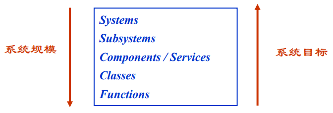
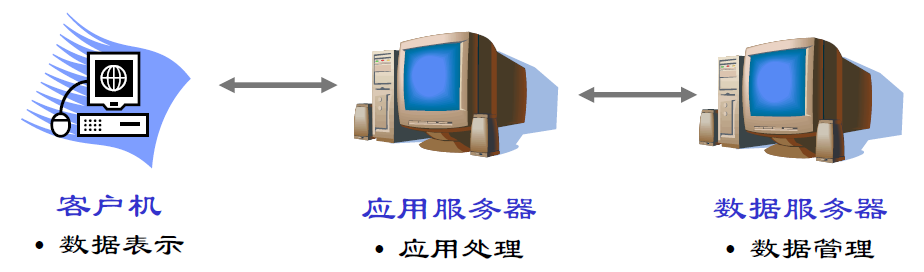
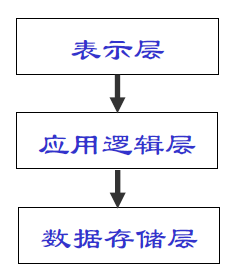
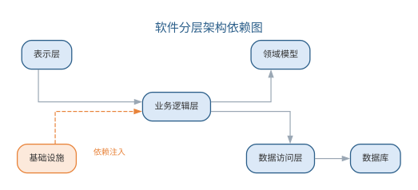
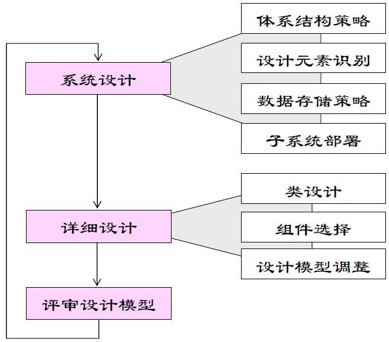
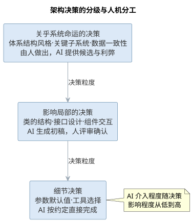
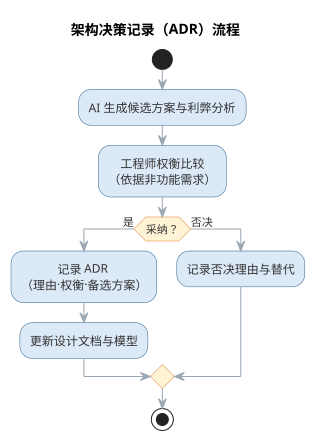
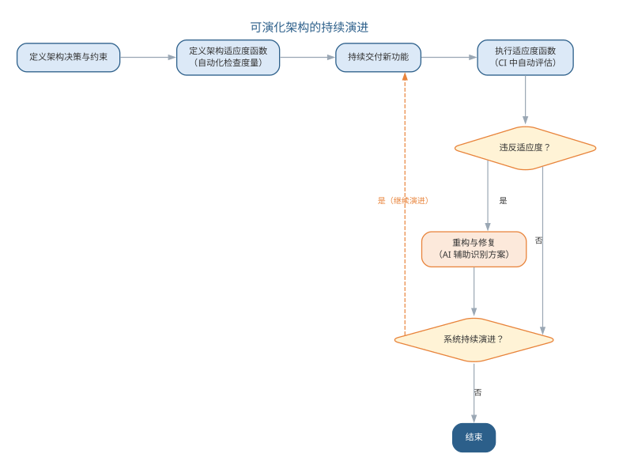

# 软件设计

软件设计是在分析模型的基础上研究软件实现问题，形成实现环境下的设计模型。设计主要涉及体系结构设计、详细设计、用户界面设计与数据库设计等方面，其目标是：在满足功能需求的前提下，追求**高内聚、低耦合**的结构，使系统易于理解、修改与复用。

## 设计原理

设计的基本原理包括：

- **模块化**：将复杂系统分解为若干相对简单的子系统，通过抽象、逐步求精与信息隐藏组织模块层次；
- **模块独立**：用**耦合性**度量子系统之间的关联程度，用**内聚性**度量子系统内部的相关程度。耦合越松、内聚越高，系统越易维护；
- **复用**：利用已开发的软件元素生成新系统，提高效率与质量——工具包强调类级代码复用，架构强调构件级设计复用，模式强调方法的复用；
- **启发规则**：改进结构提高独立性、模块规模适中、深度宽度扇出扇入适当、作用域落在控制域之内、降低接口复杂度、设计单入口单出口模块等。

{width=50%}

其中，内聚性自低到高分为偶然、逻辑、时间、过程、通信、顺序、功能七类，功能性内聚最优；耦合性自弱到强分为非直接、数据、特征、控制、外部、公共、内容七类，数据耦合最优。

{width=60%}

模块的规模与结构可用**扇入扇出**度量：设模块间调用关系为 $M\to M'$（$M$ 调用 $M'$），则模块 $M$ 直接调用的模块数称为扇出，直接调用 $M$ 的模块数称为扇入，度量式为：

$$f_{out}(M)=\#\{M'\mid M\to M'\},\qquad f_{in}(M)=\#\{M'\mid M'\to M\}$$

扇出过大说明模块承担职责过多、依赖面过宽，扇入过高则说明模块被过度共享、改动牵一发而动全身——启发规则中"深度宽度扇出扇入适当"正是对这两个度量的约束。耦合与内聚各自的七级划分可由弱到强对照如下表所示。

| 耦合等级 | 说明 | 内聚等级 | 说明 |
|------|------|------|------|
| 非直接耦合 | 模块间无直接联系 | 偶然内聚 | 元素无关联、机械组合 |
| 数据耦合 | 仅通过参数传递数据 | 逻辑内聚 | 若干逻辑功能合于一体 |
| 特征耦合 | 传递整个数据结构 | 时间内聚 | 同一时间执行的元素聚拢 |
| 控制耦合 | 传递控制信号 | 过程内聚 | 按特定顺序执行的元素 |
| 外部耦合 | 访问同一全局数据 | 通信内聚 | 访问同一数据集 |
| 公共耦合 | 共享公共数据环境 | 顺序内聚 | 前者的输出是后者的输入 |
| 内容耦合 | 直接访问内部内容 | 功能内聚 | 完成单一功能 |

## 体系结构设计

软件体系结构包括一组软件部件、部件的外部可见特性及其相互关系。体系结构设计的内容包括系统的总体组织与全局控制结构、通信与数据访问协议、设计元素的功能分配、非功能需求、物理部署以及备选方案的选择。

典型的体系结构风格有：

- **仓库/知识库结构**：以中心数据库为核心，适合数据由一个子系统产生、其他子系统使用的情形，如编译器与 CASE 工具；

  {width=45%}
- **模型/视图/控制器（MVC）**：把交互系统分为模型（业务数据与逻辑）、视图（用户界面）与控制器（响应输入、更新视图与模型），适合同一模型需要多个视图的交互式系统；

  {width=50%}
- **控制结构**：集中式控制由一个子系统统一协调，基于事件的控制则让各子系统响应外部事件，适合事件驱动系统；
- **客户机/服务器结构**：服务器提供服务、客户机负责交互，分为瘦客户机（处理集中在服务器）与胖客户机（应用逻辑在客户端），三层结构进一步分离表示、逻辑与存储；

  {width=55%}
- **分层体系结构**：将软件组织为类的层次，同层完成特定目的、层间通过接口通信，典型的三层为表示层、应用逻辑层与存储层。

  {width=55%}

体系结构设计应避免包之间的循环依赖，并通过 SDD 文档（IEEE 1016-1998）记录分解、依赖关系与接口说明。典型风格的组织结构、全局控制与适用场景可对照如下表所示。

| 风格 | 组织结构 | 全局控制 | 适用场景 |
|------|------|------|------|
| 仓库/知识库 | 以中心数据库为核心，子系统围绕存取 | 数据驱动的集中协调 | 编译器、CASE 工具 |
| MVC | 模型/视图/控制器分离 | 事件驱动更新视图 | 同一模型多视图的交互系统 |
| 控制结构 | 集中式或基于事件 | 显式协调或事件响应 | 事件驱动系统 |
| 客户机/服务器 | 服务与客户分离、三层结构 | 请求/应答 | 分布式业务系统 |
| 分层体系结构 | 层间通过接口通信 | 层间协议 | 表示/逻辑/存储分离的系统 |

分层体系结构中的模块按单向依赖组织，各层依赖关系如图所示。

{width=85%}

## 案例：高内聚低耦合的两种设计

**高内聚、低耦合**不是抽象口号，而是能在类图上直接判断的性质。以“订单处理”需求为例：用户提交订单后，系统需校验库存、计算价格、更新库存并生成账单。同一需求，两种设计方案差别一目了然。

- **坏设计——“一个类扛下所有”**：把校验、计价、更新、开账全部塞进一个订单服务类，方法间用共享变量传递中间结果；其他模块需要价格时直接调用其内部方法。类职责混杂、改动一处影响处处，属于低内聚；模块间直接访问内部内容，属于内容耦合。
- **好设计——“职责拆分、依赖接口”**：把订单处理拆为库存校验、价格计算、库存更新、账单生成四个各司其职的类，彼此经接口依赖，实现可独立替换。每个类高内聚，模块间仅经接口通信，属于低耦合。

| 维度 | 坏设计 | 好设计 |
|------|--------|--------|
| 内聚 | 职责挤于一类的偶然内聚 | 单一职责的功能内聚 |
| 耦合 | 直接访问内部内容的内容耦合 | 仅经接口传数据的数据耦合 |
| 可维护性 | 改一处价格规则要重测整个类 | 替换实现类即可，其余不受影响 |
| 可扩展性 | 新增促销规则要改动核心类 | 新增实现并登记到接口即可 |

两种设计实现了相同的功能，演进代价却截然不同——内聚与耦合度量的价值，正在于把“哪个设计更好”的争论，变成可按七级划分直接判定的检查。

## 样例：体系结构风格选型

体系结构风格没有绝对优劣，只有是否匹配场景。以三类典型场景为例，选型由非功能需求推动，而非设计者的偏好。

| 场景 | 推荐风格 | 理由 |
|------|----------|------|
| 高并发读多写少（如商品详情页） | 分层体系结构加缓存 | 读请求经缓存层卸载、写请求进入存储层，读路径与写路径分离，可独立扩容 |
| 强一致性交易（如订单支付） | 客户机/服务器（三层）加集中式控制 | 强一致要求读写在统一事务边界内完成，请求/应答式交互便于服务端管控事务 |
| 快速迭代原型（如内部工具） | 模型/视图/控制器（MVC） | 界面、模型、控制分离，改界面不动模型、改模型不动界面，便于频繁试错 |

同一系统不同子系统的非功能需求不同，选型亦可混合：读多写少的展示面用分层加缓存，交易面用三层结构，原型化模块用 MVC。选型的关键是把“数据在哪、谁控制、如何交互”与场景的读写比例、一致性要求、变化频率逐一对照，而不是把某种风格当作唯一正确解。

## 故事：从单体到微服务的演进

典型互联网公司的软件架构大多走过同一条路：先是小而美的单体应用，随业务增长逐渐拆分为微服务。推动演进的典型力量是规模、团队与部署频率。

- **单体阶段**：业务简单、团队不大，一个应用部署即上线；随功能与代码量增长，一次部署牵连所有模块，版本发布越来越慢，改动牵一发动全身的问题日益凸显。
- **拆分阶段**：业务线增多、团队按业务拆成小分队后，单体成为瓶颈——某团队改一行代码也要全量回归、与别组协同排期。按业务能力拆为微服务后，各服务独立开发、独立部署、独立扩容。
- **权衡而非银弹**：拆分把模块间调用改为网络通信，本地事务变成分布式事务，运维从管一个应用变成管数十个服务；服务粒度划分不当或过度拆分，同样带来接口繁杂、调试与追踪困难的新代价。

典型实践是“从单体起步、以模块边界识别服务边界、按规模演进”：能用一个模块解决的，就不必为了“时尚”拆成服务。拆分是权衡——用分布式复杂度换取团队自治与部署自由。

## 案例：设计文档缺失的代价

体系结构设计的价值在项目正常运转时不显山露水，而在人员流动后彻底暴露。一个典型案例：某项目自启动起便没有留下体系结构记录，模块划分、依赖方向与关键权衡都只存在少数几位设计者的脑中。

- **无人能答“为什么”**：核心设计者陆续离职后，新工程师面对一团代码，无人能回答“订单与库存为何这样划分”“这个依赖方向为何被刻意避免”。
- **反复试错**：后人在不掌握原始权衡的情况下修改设计，屡屡撞上当初刻意绕开的坑；绕开一次是代价，反复绕开就是累积的维护负债。
- **文档化的价值**：体系结构文档记录的不只是“设计成什么样”，更是“为什么这样设计”，让后人站在前人的权衡之上，而不是重新交一遍学费。

**体系结构文档（如 SDD、ADR）是设计的“记忆”**：它把决策理由从个人经验转存为团队资产。文档化的成本在当下，收益却在每一次人员交接、每一次架构变更时兑现——这正是设计原理中信息隐藏与可维护性的初衷。

## 面向对象设计

面向对象设计（OOD）在分析模型基础上进行系统设计与对象设计两个层次的工作。

{width=55%}

**系统设计**的主要步骤：设计系统的体系结构（选择策略、建立总体结构）、识别设计元素（类和子系统及接口）、定义数据存储策略（数据文件、关系数据库或面向对象数据库，依据并发、跨平台、查询复杂度等选择）、部署子系统（将子系统分配到物理节点）、检查系统设计（正确性、一致性、完整性、可行性）。

**对象设计**需要细化模型：精化类的属性与操作（明确参数、类型、可见性与实现逻辑）、明确类之间的关系、整理优化模型。分析类向设计类的映射遵循原则：简单、代表单一逻辑抽象的分析类直接映射为设计类；职责复杂者映射为子系统接口；子系统划分符合高内聚低耦合。边界类的设计考虑界面工具与界面数量，实体类考虑性能需求，控制类审视其必要性、细分与事务处理要求。各类分析类的设计考虑如下表所示。

| 分析类类型 | 设计映射 | 设计考虑 |
|------|------|------|
| 简单分析类 | 直接映射为设计类 | 代表单一逻辑抽象 |
| 职责复杂的类 | 映射为子系统接口 | 符合高内聚低耦合 |
| 边界类 | 设计界面工具与数量 | 明确与外部交互点 |
| 实体类 | 考虑性能需求 | 数据持久化策略 |
| 控制类 | 审视必要性、细分与事务 | 事务处理要求 |

面向对象设计在分析模型之上进行系统设计与对象设计两层工作，如图所示。

{width=75%}

系统设计确定总体结构与部署，对象设计细化每个类的细节，两层工作共同把分析模型转化为可实现的解决方案。

## 智能化设计

智能化设计工具可以显著加速上述过程：AI 依据分析模型**生成**体系结构风格建议与类图初稿，根据 SOLID 等原则给出耦合内聚的**重构提示**，从需求与非功能属性**推导**数据存储策略候选，并在设计评审时对照检查清单**发现**遗漏的边界条件与不一致。

智能化设计的关键在于把人类的架构判断与 AI 的细节生成结合起来——体系结构风格这类关乎系统命运的决策仍应由有经验的工程师做出，而 AI 的价值体现在快速试错、一致性检查与文档同步，让设计者把精力集中于创造性决策。

架构决策可以按风险与影响分级对待：**关乎系统命运的决策**——体系结构风格的选择、关键子系统划分、数据一致性策略——必须由有经验的工程师基于非功能需求权衡做出，AI 在此提供的是候选方案与利弊分析，帮助决策者看得更全；**影响局部的决策**——类的结构、接口设计、组件交互方式——可以由 AI 生成初稿，经设计评审确认；**细节决策**——参数默认值、工具选择——则可以放手让 AI 按约定完成。分级对待的好处是既不让 AI 触碰高风险的架构判断，也不让工程师淹没在低价值的细节里。

架构决策的分级与 AI 分工如图所示。

{width=60%}

设计文档的同步是智能化设计的另一项红利。传统设计中模型、设计说明（SDD）与代码经常脱节；AI 可以从最终实现反推设计视图、根据变更自动更新文档，让设计决策持续可追溯。但同步文档的前提是"决策确实发生过"——AI 擅长记录决策的结果，而决策的理由、权衡与备选方案仍需设计者以架构决策记录（ADR）等形式沉淀，否则文档只会变成代码的复述而非设计的沉淀。

把智能化设计落到工程流程，可以归纳为"设计方案生成"的五步工作流：

1. **明确输入与约束**：整理需求文档、分析模型（用例、类图、状态图）与非功能需求（性能、可用性、可维护性），并写明已有系统的技术栈与限制；
2. **生成候选方案**：以提示词让 AI 基于输入生成多个备选设计（体系结构风格、关键类结构、数据存储策略），并要求给出每个候选的理由与取舍；
3. **对照权衡矩阵**：请 AI 按可扩展性、性能、成本、团队熟悉度等维度输出候选对比表，显式说明"选 A 的代价是什么"；
4. **人工筛选与决策记录**：工程师基于非功能需求优先序筛选候选，把采纳方案、理由与未采纳的方案一并写入架构决策记录（ADR）；
5. **生成初稿并迭代**：对选定的方案让 AI 生成类图初稿与接口草图，按评审意见反馈修改，直至符合约束。

从需求与分析模型生成候选设计方案的提示词模板如下：

```text
你是资深软件架构师。请基于以下输入，为系统生成 2~3 个候选设计方案，不要直接下结论。
需求：<一段话描述核心功能与非功能目标>
约束：<技术栈、性能、成本、团队能力等限制>
分析模型：<用例、类图、状态图的摘要>
请逐方案输出：
1. 方案名称与采用的体系结构风格（分层、客户机/服务器、事件驱动等）
2. 核心模块划分与关键设计决策
3. 该方案的优势、代价与主要风险
最后给出三列对照表：方案 | 优势 | 代价与风险
```

在"分级对待"之上，体系结构决策的 AI 辅助与人工把关可进一步细化为下表——AI 负责把方案摊开、把利弊摆全，人负责按下决策键。

| 体系结构决策 | AI 辅助产出 | 人工把关 |
|------|------|------|
| 体系结构风格选择 | 按非功能需求生成候选风格与利弊分析 | 基于权衡拍板，否决"看似合理"的方案 |
| 子系统划分 | 依据职责边界提出划分候选 | 校验高内聚低耦合，并匹配团队结构 |
| 数据一致性策略 | 汇总候选策略与其取舍 | 依据业务一致性要求定夺 |
| 非功能需求权衡 | 生成约束冲突与敏感性分析 | 定义优先级与预算 |

这类工作可直接使用对话式编码工具（如 Cursor、Claude Code 等）配合架构文档知识库完成，选型要点是"让模型读到真实约束"，避免它仅凭通用知识臆测系统背景；团队也可把 ADR 写成模板让 AI 续写，把决策理由持续沉淀。

智能化设计同样存在局限与失败模式，如下表所示。

| 失败模式 | 典型表现 | 应对 |
|------|------|------|
| 方案幻觉 | 生成"看似合理实则不可行"的架构 | 要求输出逐条引用约束，人工核对非功能需求 |
| 上下文缺失 | 忽略已有系统技术栈与限制 | 提示词注入真实约束，必要时检索架构文档 |
| 候选同质化 | 只给出常见风格的变体 | 要求列出风格组合与混合方案 |
| 提示词偏差 | 候选倾向随提示词措辞漂移 | 固定模板、多轮对照，跟踪采纳率 |

这套工作流的前提是约束写不真、候选就不可信：AI 往往只优化一个目标（如性能）而忽略另一个（如可维护性），把多目标权衡显式写进提示词，是避免"看起来最优、用起来失衡"的有效手段。识别并规避上述失败模式，是智能化设计从"演示可用"走向"工程可用"的分水岭。

## 智能化设计实践

智能化设计实践的落点可以分为三类。

**体系结构设计**：让 AI 依据需求与非功能属性生成备选的体系结构风格（分层、客户机/服务器、事件驱动等）及其权衡分析，工程师用架构决策记录（ADR）逐项采纳或否决，形成"候选生成—权衡比较—决策记录"的流程。**界面与原型设计**：低代码平台（如 OutSystems、Mendix）与 AI 界面生成工具（如 v0、Figma 的 AI 助手）把需求描述直接转换为可运行的界面原型，让用户在早期就"看得见"系统，减少需求误解。**数据与对象设计**：AI 从业务规则推导概念数据模型与类图初稿，生成数据库表结构候选，工程师根据访问模式与一致性要求调整。

设计活动与 AI 辅助的分工如下表所示。

| 设计活动 | AI 能力 | 人工把关 |
|------|------|------|
| 体系结构设计 | 生成风格候选与利弊分析 | 选择与评估体系结构风格 |
| 详细设计 | 生成类图、接口与交互初稿 | 校验语义、确定权衡 |
| 界面设计 | 生成界面原型与组件方案 | 确认可用性与交互逻辑 |
| 数据设计 | 推导数据模型与表结构 | 确定一致性策略与性能约束 |

无论哪个层次，都适用同一条原则：**AI 生成的是候选，决定权在人**。设计审查仍然是必要的环节，尤其要警惕 AI 生成的架构"看似合理实则难以演进"。当系统以机器学习模型为核心时，架构还需要为模型推理、数据流水线留出位置，相关设计考量将在第 16 章结合 AI 系统的体系结构讨论。

一个完整的智能化设计实例如下。需求是：某电商系统的订单结算模块需支持满减、折扣、优惠券与会员积分多种促销规则，且促销规则会不断新增。工程师写下的提示词为：

```text
为订单结算模块生成 2 个候选设计方案。需求：订单结算需支持满减、折扣、
优惠券与会员积分，后续会不断新增促销规则；结算规则复杂、变化频繁，其余模块稳定。
约束：Java/Spring 技术栈、单机事务、结算响应时间 <200ms。
请给出候选方案、权衡与建议，不要直接下结论。
```

AI 输出了两个候选。方案 A 采用"策略模式 + 规则引擎"，每种促销实现为策略类、按优先级链式结算，优势是新增规则只需新增策略类、符合开闭原则，代价是策略类随规则增多、组合测试复杂度上升；方案 B 采用"领域模型 + 规则表驱动"，促销规则存表由引擎解释执行，优势是运营可配置规则、无需改代码，代价是引入规则解释器、性能与可调试性下降。工程师对照权衡矩阵评估发现，AI 的输出遗漏了关键约束——满减与优惠券叠加时的计算顺序直接影响结果，两个候选都未说明规则叠加顺序与幂等性。工程师将此约束补入提示词后重新生成，方案 A 的候选补上了"规则按优先级链式结算、配幂等表"的说明，最终方案 A 结合规则的配置化被采纳，理由与未采纳的方案 B 一并写入 ADR。

与人工流程相比：人工设计同样要经历"枚举候选—权衡—决策"三步，但更慢、且依赖个人经验覆盖的范围；AI 让候选枚举与利弊分析在几分钟内完成，工程师把时间从"想方案"转移到"验约束、定取舍"。但"叠加规则的顺序与事务边界"这类约束仍需工程师基于领域知识补全——AI 不会主动提出它没有被提示的约束。

### 智能化设计的要点与误区

智能化设计的关键误区，是让 AI 触碰关乎系统命运的架构判断，或让设计文档沦为代码的复述。要点与误区如下表所示。

| 误区 | 典型表现 | 应对要点 |
|------|------|------|
| AI 决定架构 | 体系结构风格由模型拍板 | 系统命运级决策由工程师基于非功能需求做出 |
| 决策不留痕 | 只记录结果不记录理由 | 以 ADR 沉淀理由、权衡与备选方案 |
| 文档替代决策 | 同步文档却无决策发生 | 先有决策，再谈文档同步 |
| 全盘放手细节 | 低价值细节也由人逐行处理 | 细节决策交给 AI 按约定完成 |

架构决策记录（ADR）流程——从候选生成到权衡记录——如图所示。

{width=55%}

分级对待的好处是既不让 AI 触碰高风险的架构判断，也不让工程师淹没在低价值的细节里；而 AI 擅长记录决策的结果，决策的理由与权衡仍需设计者以 ADR 等形式沉淀，否则文档只会变成代码的复述而非设计的沉淀。

### 前沿演进：可演化架构与架构适应度函数

传统设计追求"一次设计到位"，前沿架构思想则承认架构必然演化。**可演化架构**（evolutionary architecture）把架构决策、适应度与持续交付结合：架构决策通过**适应度函数**（fitness function）表达为自动化检查，在 CI 中持续验证架构是否仍然满足约束（如依赖方向、耦合度、延迟预算）。AI 辅助可演化架构：自动分析模块依赖与循环依赖、生成架构评估报告、提出重构候选方案。常见适应度函数示例如下表所示。

| 架构关注点 | 适应度函数 | 工具 |
|------|------|------|
| 依赖方向 | 禁止核心模块反向依赖 | ArchUnit、JDepend |
| 循环依赖 | 无循环依赖检查 | 依赖分析工具 |
| 耦合度 | 模块间引用计数阈值 | SonarQube 等 |
| 延迟预算 | 端到端延迟不超过 SLO | 链路追踪 |

可演化架构的持续演进——适应度函数驱动的改进环——如图所示。

{width=70%}

可演化架构把"架构治理"从评审会议迁移到持续自动化验证：架构约束不再依赖个别架构师的记忆，而是由 CI 中执行的适应度函数持续守护，AI 则让适应度函数的编写与分析更加廉价。

## 本章小结

软件设计基于分析模型追求高内聚、低耦合，涵盖设计原理、体系结构设计与面向对象设计。智能化设计把 AI 引入候选方案生成、权衡分析与文档同步，但"AI 生成候选、人做决定"是不变原则：系统命运级决策由工程师把关，提示词承载真实约束，ADR 沉淀决策理由；可演化架构以适应度函数把架构治理从评审会议迁移到持续验证。人机分工上，AI 扩大候选视野、加快试错，人负责约束定义、权衡裁决与质量责任——验证优先，决策在人。

**思考与讨论：**
1. 为什么体系结构风格这类"系统命运级"决策必须由人拍板，而参数默认值这类细节可以交给 AI？
2. 请为你熟悉的系统编写一条"候选设计方案生成"提示词，并说明如何保证其中约束是真实的。
3. 若 AI 生成的候选方案"看似合理实则不可行"，你会用什么方法识别并规避？
