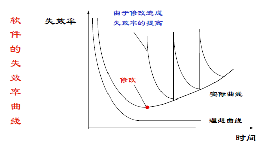
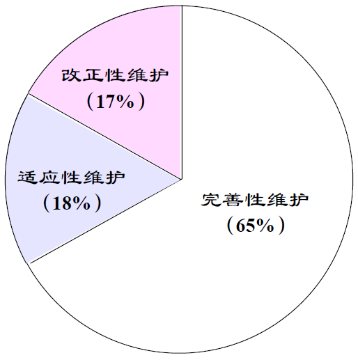
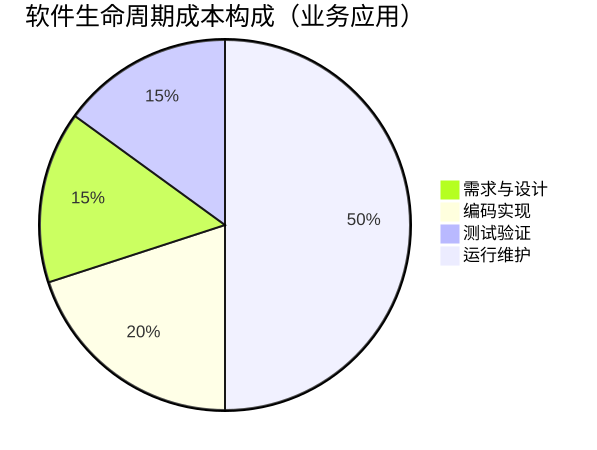
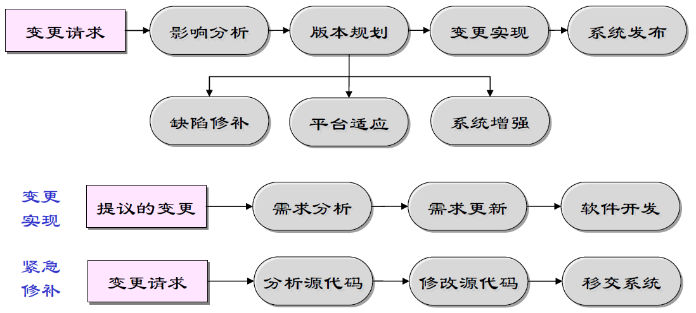
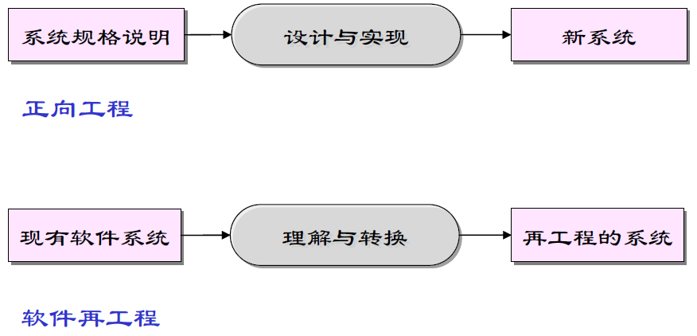
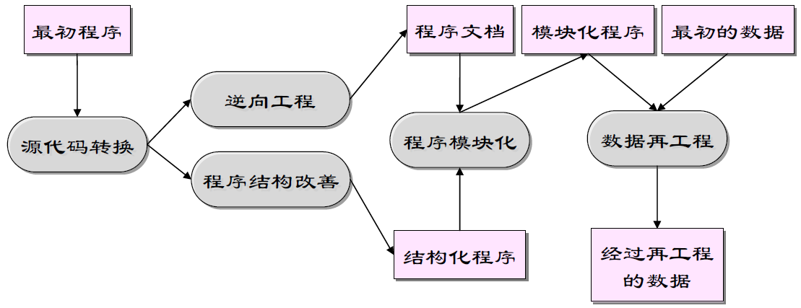
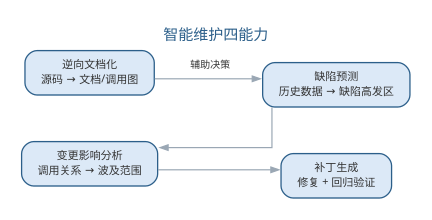
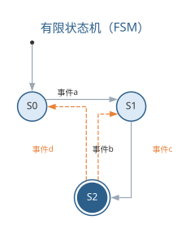
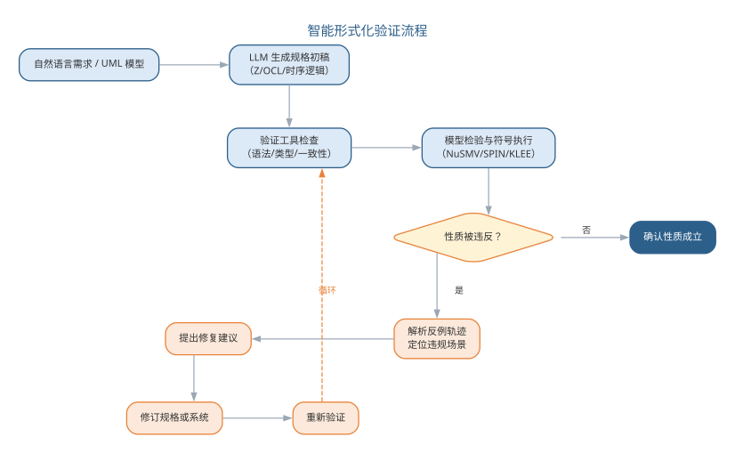

# 软件演化与质量保证

软件变更是不可避免的：新需求不断出现、商业环境持续变化、缺陷需要修复、硬件与支撑软件升级、性能可靠性需要改进。软件演化的关键问题是——**采取适当的策略，有效地实施和管理软件的变更**。本章从两个维度展开：**软件演化**（Lehman 定律、软件维护、再工程与智能化维护）回答软件上线之后如何继续演变，为变更提供实施与管理策略；**质量保证**（有穷状态机、Petri 网、Z 方法与智能形式化验证）回答如何用形式化手段保证正确性，为变更中的正确性风险兜底。两者互为表里——演化中的每一次修改都可能引入缺陷，形式化质量保证恰是以数学的严格性守住质量底线。因此本章先讲软件演化与维护，再讲形式化方法与质量保证。

## 软件演化的规律

软件演化是一种循环过程：环境变化产生软件修改，软件修改又继续促进环境变化。Lehman 的软件演化定律揭示了几个重要事实：软件的不断修改会导致软件退化（修改引入新错误、故障率升高）；开发效率与人员数量无关（人员过多会使交流变得困难）；新功能添加会产生新缺陷（往往新版本发布后，下一个版本主要修补缺陷）。

{width=50%}应对演化的策略主要有两种：

- **软件维护**：为修改缺陷或增加功能而对软件进行的局部变更，一般不改变整体结构；
- **软件再工程**：为避免软件退化而对软件的一部分重新设计、编码和测试，提高可维护性与可靠性。

Lehman 的软件演化定律可归纳为下表所示。

| 定律 | 内容 | 工程含义 |
|------|------|------|
| 持续变更 | 系统必须持续演化，否则逐渐不受欢迎 | 软件变更是不可避免的常态 |
| 复杂度增加 | 若不重构，结构复杂度随演化不断上升 | 需要再工程控制退化 |
| 自身调节 | 演化过程趋向自稳定的分布 | 演化的总体趋势可预测 |
| 组织稳定 | 平均工作速率在生命周期内大致不变 | 增加人员并不线性提效 |
| 知识守恒 | 每次发布之间的变更增量大致恒定 | 边际产出递减 |
| 持续增长 | 功能持续增长以维持用户满意 | 需同步控制复杂度增长 |
| 质量下降 | 不做维护则系统质量持续退化 | 及时维护与重构必不可少 |
| 反馈系统 | 演化是多级、多循环的反馈系统 | 用反馈机制控制演化过程 |

## 软件维护

软件维护是软件投入运行后对软件产品进行的修改，分为三类：

- **改正性维护**：修改软件中的缺陷或不足；
- **适应性维护**：修改软件使其适应硬件、操作系统或其他支撑软件的变化；
- **完善性维护**：增加或修改系统功能，使其适应业务变化。

{width=60%}

上述三类之外，广义上还有**预防性维护**——改进可维护性、防止未来退化。维护四类型对比如下表所示。

| 类型 | 内容 | 目的 |
|------|------|------|
| 改正性维护 | 修改软件中的缺陷与不足 | 修正错误 |
| 适应性维护 | 适应硬件、系统软件等支撑环境变化 | 适应环境 |
| 完善性维护 | 增加或修改功能，适应业务变化 | 满足需求 |
| 预防性维护 | 改进可维护性、防止退化 | 预防故障 |

软件维护的成本十分昂贵：业务应用系统的维护费用与开发成本大体相同，嵌入式实时系统则高达开发成本的四倍以上。软件全生命周期总成本由开发成本与维护成本构成，即

$$C_{total}=C_{dev}+C_{maint}$$

其中维护成本 $C_{maint}$ 在总成本中的占比相当可观——这正是"维护费用的高低是衡量系统质量的重要指标"的由来，也说明维护的代价应在设计与开发阶段就加以控制。以业务应用为例，开发与维护的成本构成可直观表示为饼图，如图所示。

{width=70%}

{width=55%}影响维护成本的因素包括：团队稳定性（移交后原开发团队解散）、合同责任（维护合同独立于开发合同，缺少为可维护性而努力的动力）、人员技术水平、程序年龄与结构（结构随年龄增长而破坏）。因此，维护费用的高低是衡量系统质量的重要指标，维护的代价应在设计与开发阶段就加以控制。

**维护预测**通过分析系统与外部环境的关系来预测变更请求的数目（受接口复杂性、易变需求数目、业务过程影响），并依据组件复杂度预测可维护性——控制结构与数据结构越复杂、对象方法模块越大，维护费用越高。

{width=60%}

## 软件再工程与逆向工程

**软件再工程**重新构造或编写现有系统的一部分或全部而不改变其功能，目的是使系统更易维护。其优势在于降低风险（重新开发在用的系统风险很高）与降低成本（再工程比重新开发便宜得多）。

{width=55%}再工程活动包括：源代码转换、逆向工程、程序结构改善、程序模块化与数据再工程。

{width=60%}

**逆向工程**以复原软件的规格说明和设计为目标，弥补缺乏良好文档的问题。开发阶段的文档与维护阶段的文档往往不一致，而对遗留系统的再工程更面临"几乎没有完整描述、业务规则隐藏在软件内部、文档不充分或过时、多年维护后结构破坏"等重重困难。在投入再工程之前，应综合系统质量评估（业务过程、环境、应用软件三个维度）与业务价值评估（访问各利益相关者的代表），决定系统的处置策略。**再工程**与**逆向工程**、**重构**三个概念层次不同，常被混淆，对照如下表所示。

| 概念 | 对象 | 手段 | 目的 |
|------|------|------|------|
| 逆向工程 | 现有系统 | 从代码反向恢复规格与设计 | 理解与文档化 |
| 再工程 | 现有系统 | 重构、转换、模块化与数据再工程 | 提高可维护性 |
| 重构 | 代码内部结构 | 小步改进而不改变外部行为 | 改善结构、降低复杂度 |

## 案例：遗留系统的维护困境

**遗留系统**（legacy system）指仍在运行、但维护成本极高的旧系统。一个典型的场景是：银行存贷款核心业务仍运行在数十年历史的 COBOL 体系上，这是行业中的普遍现实，而非个别现象。这类系统具有典型的共同特征：

- **懂它的人越来越少**：掌握 COBOL 的资深工程师渐次退休，年轻工程师不愿接手，核心知识出现传承断层；
- **文档缺失或过时**：多年修改后文档与代码严重不一致，业务规则只存在于代码与少数人的头脑中；
- **改动如履薄冰**：一次微小修改可能引发连锁故障，影响范围无人能完整说清，回归依赖老师傅的经验。

这类系统维护成本高、风险大，却恰恰最不能停机——银行核心系统一旦停摆，牵动的是海量用户的资金安全。它印证了一个基本论断：**维护是软件生命周期的主战场**，软件总成本的大头花在运行后的维护上，而遗留系统正是这一论断的极端体现。

## 故事：Y2K 全球维护战役

二十世纪七八十年代写下的程序，普遍用**两位数字**保存年份——"99"表示 1999。2000 年临近时，人们猛然意识到：跨过世纪之交，"00"会被程序误读为 1900，日期计算全面错乱，利息、账龄、排程都可能崩溃。这就是**千年虫危机**（Y2K），一场真实的全球性维护战役。

各国为此动员了庞大的维护力量，按四步推进：

- **清查**：扫描全部代码与数据文件，定位日期处理逻辑，建立影响清单；
- **改造**：把两位年份扩为四位，或设计兼容方案，逐模块修改；
- **测试**：用模拟跨世纪的日期数据做全量回归，验证改造正确；
- **过渡**：在千禧年零点监控切换，按计划放行、应急预案待命。

据估计，全球投入的改造成本数以百亿美元计，人力数十万，史无前例；正因为全球协调一致，绝大多数系统平稳跨过千禧年。这个故事说明：**维护的规模可以远超初始开发**，日期这类"边界条件"最易在多年后集中爆发，而**清查—改造—测试—过渡**正是应对大规模遗留改造的经典组织方法。

## 样例：重构还是重写

面对一个难以维护的模块，工程师常纠结于**重构**还是**重写**。这本质是一次风险与收益的权衡，典型决策依据如下表所示。

| 因素 | 倾向重构 | 倾向重写 |
|------|----------|----------|
| 理解程度 | 结构乱但尚能读懂，规则清晰 | 无人真正理解，文档彻底失效 |
| 测试覆盖 | 已有测试可守住行为不变 | 缺少测试，行为无法定义 |
| 业务价值 | 模块稳定运行，价值仍在 | 需求将大变，重写顺应新需求 |
| 风险 | 小步改动，风险可控 | 大范围替换，回归风险高 |

一般认为：**能读懂就重构，读不懂才考虑重写**。而"先补测试再重构"是典型的稳妥流程——先用少量用例锁定现有行为，作为回归基线；再小步重构、每步回归；最后删除临时测试。重写则要警惕**第二次系统的诱惑**：工程师容易把重写当作摆脱历史包袱的机会，大加"改进"而偏离需求，结果是新系统既没兑现预期，又丢失了旧系统多年打磨的边角行为。只有测试缺失、需求剧变、风险可控三者兼备，重写才值得考虑。

## 智能化维护

大语言模型为软件演化带来了前所未有的工具：从源代码**逆向生成**结构化的设计文档与调用图，缓解文档缺失问题；依据历史缺陷数据**预测**缺陷集中的模块，指导测试与维护投入；分析变更请求**评估**其影响范围，辅助变更决策；自动**生成**修复补丁并配合回归测试验证。AI 的逆向工程能力使"重新理解遗留系统"的成本大幅下降，也让再工程的决策建立在更完整的模型之上。

但再工程与废弃高风险遗留系统的决策依然是工程判断：AI 提供的只是"更清楚的现状"，是否值得重构、何时重构、采用何种策略，仍须依据业务价值与系统质量评估做出。软件质量管理的目标——以最低代价获得最高的可维护性与可靠性——在智能化时代并未改变，只是实现手段更加强大。

缺陷预测的质量取决于特征的选择与历史数据的代表性：以模块规模、圈复杂度、变更频率、耦合度等静态与动态特征训练模型，可以比人工经验更早地指出"缺陷高发区"，但预测结果受历史数据分布影响，换一个项目或技术栈可能失效。因此缺陷预测应作为**资源分配的参考**而非**定性的裁决**——它告诉团队把测试与审查资源投向哪里，而不代替工程师判断某个模块是否真的有缺陷。变更影响分析同理：AI 依据调用关系与依赖图估算变更波及范围，能大幅减少"改一处、坏一片"的遗漏，但对语义层面的连锁反应（如接口约定变化导致调用方行为改变）仍需工程师确认。

维护中最昂贵的往往不是"改代码"，而是"读懂代码"。AI 的逆向工程能力——从源码生成设计文档、调用图与行为摘要——把理解遗留系统的门槛大幅降低，使新成员接手、风险评估与再工程规划都建立在更完整的模型之上。但逆向产物的准确性必须抽查验证：AI 总结的"业务规则"若未与领域知识对照，可能把实现细节误读为业务意图。智能维护的四类能力如下表所示。

| 能力 | 做法 | 价值 |
|------|------|------|
| 逆向文档化 | 从源码生成文档、调用图 | 降低理解遗留系统的成本 |
| 缺陷预测 | 用历史数据建模定位缺陷高发区 | 指导测试与维护投入 |
| 变更影响分析 | 依据依赖图估算波及范围 | 减少"改一处、坏一片" |
| 补丁生成 | 自动修复并回归验证 | 加速修复循环 |

智能维护的四类能力共同支撑软件的持续演化，如图所示。

{width=80%}

四类能力的产出都只是"更清楚的现状"，是否重构、何时重构的决策仍需工程判断。

### AI 辅助缺陷定位与修复的工作流

缺陷定位是维护中最耗时的活动之一。AI 辅助定位与修复遵循"证据—假设—验证—修复—回归"的循环：

1. **收集现场证据**：提交缺陷报告、异常堆栈、失败用例与最近变更记录，作为 AI 的输入上下文；
2. **复现与收窄**：让 AI 先最小化复现路径，确定触发条件（输入、状态、环境）——不能复现的缺陷无法定位；
3. **生成根因假设**：AI 依据代码与调用链提出若干根因假设，并为每条假设给出可验证的判据；
4. **人工验证假设**：工程师用断点、日志或最小用例证实或反驳假设，把"AI 的猜测"转为"人证实的根因"；
5. **生成并审查补丁**：对确认的根因，AI 生成补丁并说明改动依据，工程师审查补丁语义与影响面；
6. **回归验证与沉淀**：补丁通过相关测试与全量回归后合入，并把修复场景沉淀为回归用例。

把"先假设后修复"的纪律写进提示词，可以防止 AI 跳过分析直接给补丁：

```text
你是维护工程师，请定位并修复以下缺陷：
缺陷现象：<描述现象，附异常堆栈与失败用例>
相关模块：<模块与关键函数，可贴代码片段>
约束：
- 先输出根因假设表（假设 / 证据 / 验证方法），不要直接给补丁
- 每条假设必须标注"可被哪条证据支持或反驳"
- 确认根因后，输出最小改动补丁并说明改动依据
- 补丁须说明对调用方与边界条件的影响
```

在选型上，缺陷定位依赖"能读到代码与历史"的能力：带代码库检索的对话式工具（如 Cursor、Claude Code）适合跨文件定位与修复，缺陷预测可利用提交历史训练或使用可解释的分析工具——关键约束是工具必须能访问历史缺陷与变更记录，否则预测与定位都缺乏依据。定位与修复与第 6 章软件实现与测试的缺陷定位共享"假设—验证"循环，区别只在触发源与验证手段。

六步循环的每一步都留下记录——证据、假设、验证结果与补丁。这些记录既用于本次回归，也沉淀为团队的缺陷知识库，使下一次定位更快、更准；缺陷记录的规范性，直接决定 AI 定位与预测的上限。

**变更影响分析**是维护决策的另一个支柱：一次变更的波及范围，决定回归测试投入与发布风险。AI 从变更点出发沿调用链正向列出受影响函数、接口与配置，反向追溯依赖它的模块，再按风险把影响面排序，区分"必改""需回归""需人工确认"三类，如下表所示。对一次接口签名变更，AI 能枚举全部调用方并标出需同步修改的位置，把"改一处、坏一片"的遗漏降到最低。但语义层面的影响——接口约定变化导致调用方行为改变、数据格式迁移影响历史数据——无法仅凭依赖图发现，必须由工程师确认。

| 影响类别 | 判断依据 | 处置 |
|------|------|------|
| 必改 | 直接调用、接口签名变化 | 同步修改并纳入评审 |
| 需回归 | 间接依赖、共享数据结构 | 扩充回归测试范围 |
| 需人工确认 | 语义约定、配置与数据迁移 | 核对业务影响后再放行 |

影响分析的结果应回填到测试计划：扩大回归范围的同时，把高风险调用方加入重点评审清单，形成"预测—定位—修复—回归"的闭环。这个闭环正是第 6 章软件实现与测试的缺陷定位在维护期的延续，差别只在于维护期的变更往往跨模块、影响面更大，更需要影响分析先行。

缺陷定位与变更影响的典型失败模式如下表所示。

| 失败模式 | 典型表现 | 应对要点 |
|------|------|------|
| 根因泛化 | 只给"错误处理不完整"级结论，无具体证据 | 强制先出假设表，每条标注证据与验证方法 |
| 复现缺失就猜 | 无法复现时仍自信给出结论 | 先最小化复现，复现不了就降级为待查项 |
| 补丁语义错误 | 语法正确但改错语义或引入新缺陷 | 人工审查补丁 + 全量回归 |
| 影响面遗漏 | 只看直接调用，漏掉间接与配置影响 | 结合依赖图核对，区分必改/需回归 |

## 智能化维护实践

智能化维护的典型工作流包括四项：

- **逆向文档化**：让 LLM 从源码与测试生成模块说明、调用图与架构视图，与现有文档比对后存入知识库，逐步补齐遗留系统缺失的文档；
- **缺陷预测与资源调度**：用历史缺陷数据训练预测模型，按风险排序模块清单，把测试与代码评审资源优先投向高风险区；
- **智能重构**：AI 识别重复结构与坏味道，提出重构方案并生成重构后的代码，配合回归测试验证"行为不变"；
- **运维监控（AIOps）**：在运行环境中持续监测异常、性能退化与数据漂移，自动告警并辅助定位，与第 10 章 AI 系统工程与 MLOps 的模型监控衔接。

智能化维护的典型工作流如图所示。

{width=90%}

智能化维护同样遵循"决策在人"的原则：是否重构一个高风险遗留系统，取决于它的业务价值与剩余寿命——对即将被替代的系统再投入重构是浪费，对长期运行的核心系统拖延重构则积累风险。AI 提供的价值是让"现状"更清楚、让重构成本更低，而价值评估与处置策略仍是管理者的责任。

当软件本身包含机器学习模型时，维护的对象从"代码"扩展到"数据与模型"——模型性能随数据漂移而退化，需要持续的监控与重训练，这部分将在第 10 章 AI 系统工程与 MLOps 中展开。

一个完整的智能化维护实例如下。线上缺陷报告称"取消订单后优惠券未退回"，工程师把异常堆栈与相关模块 `OrderService.cancel`、`CouponService.release` 交给 AI：

```text
定位"取消订单后优惠券未退回"的根因。
堆栈：<cancel 方法抛出校验异常后事务回滚>
相关模块：OrderService.cancel、CouponService.release
约束：先出假设表（假设/证据/验证方法），确认后给最小补丁。
```

AI 首轮给出三条假设：其一，`release` 在事务之外调用，回滚后未执行；其二，异常发生在 `release` 之前，调用链中断；其三，优惠券状态字段的更新条件不匹配。工程师用日志与断点验证，确认第二条成立——`cancel` 在校验库存时抛出了异常，`release` 从未被调用。把该证据反馈给 AI 后，AI 生成了把 `release` 移到异常处理之外并保证幂等的补丁。人工审查发现，补丁在"重复取消"场景下会重复释放优惠券，于是补上幂等标记；经回归验证后合入，并把"取消后再取消"沉淀为回归用例。该实例还展示了变更影响分析的用途：`release` 并非只有 `cancel` 一处调用方，AI 依据调用链提示需同步回归退款流程，工程师据此扩充了回归范围，避免修复一处、破坏别处。

与人工排查相比，AI 的价值在于快速枚举假设并给出验证路径，把"从哪查起"的成本降到最低；而"用日志证实哪条假设成立"与"补丁的幂等性"仍依赖工程师的判断——AI 出假设、人出证据，是智能化维护的典型分工。

### 智能化维护的要点与误区

智能化维护的常见误区，是过度依赖 AI 的逆向产物而放弃抽查验证，或让缺陷预测替代工程判断。要点与误区如下表所示。

| 误区 | 典型表现 | 应对要点 |
|------|------|------|
| 逆向产物不抽查 | 把实现细节误读为业务意图 | 逆向总结与领域知识对照，抽查验证准确性 |
| 缺陷预测当裁决 | 预测高风险就判"有缺陷" | 预测是资源分配参考，不是定性裁决 |
| 盲目重构遗留系统 | 对将替代的系统投入重构 | 依据业务价值与剩余寿命决定处置策略 |
| 文档补齐后不管 | 知识库与现状再次脱节 | 与代码同步更新，纳入版本管理 |

遗留系统处置决策——综合系统质量与业务价值两个维度——如图所示。

{width=65%}

AI 提供的价值是让"现状"更清楚、让重构成本更低：逆向工程把理解遗留系统的门槛大幅降低，缺陷预测告诉团队把测试与审查资源投向哪里，而是否重构、何时重构、采用何种策略，仍是管理者的责任。

### 前沿演进：可观测性、SRE 与混沌工程

前沿的软件运维以**可观测性**（observability）为基础：通过日志、指标与分布式追踪（OpenTelemetry 统一遥测）三支柱，回答"系统为什么处于当前状态"。**站点可靠性工程**（SRE）以**服务水平目标**（SLO）与错误预算管理风险，把稳定性量化。**混沌工程**主动注入故障（如 Chaos Monkey），验证系统在故障下的韧性。**软件供应链安全**（SBOM、签名与来源验证）则把安全前置到依赖供应链。实践对照如下表所示。

| 实践 | 做法 | 价值 |
|------|------|------|
| 三支柱观测 | 日志+指标+追踪统一接入 | 快速定位根因 |
| SLO 管理 | 目标+错误预算 | 风险量化与取舍 |
| 混沌工程 | 主动故障注入 | 验证韧性 |
| 供应链安全 | SBOM + 签名验证 | 依赖可信 |

可观测性与 SLO 驱动的运维改进环如图所示。

{width=65%}

软件演化到 AI 时代，运维对象从代码扩展到模型与数据（第 10 章），但可观测性的理念一致：只有持续观测、量化目标、主动验证，系统才能被信任——AI 系统尤其需要这种纪律。

软件演化与维护让系统持续演进，但每一次变更都可能引入新的缺陷——正确性风险随修改不断累积。当人工评审与测试难以兜住这种风险时，质量保证便需要更严格的手段。

自然语言描述的需求与设计含糊、不完整且难以验证。形式化方法用**数学符号**精确描述软件系统，使规格说明无二义、可推导、可机器检验，是软件质量保证中最严格的一类手段。尽管形式化方法难以覆盖大型系统的全部，但它对关键系统（如安全攸关的嵌入式、航空、银行软件）的高可靠需求不可替代。

## 有穷状态机

**有穷状态机（FSM）**由一组有穷的状态、输入事件、状态转移函数、初始状态与（可选的）终结状态组成。系统在任一时刻处于一个状态，在外部事件触发下沿转移条件进入下一个状态。FSM 特别适合描述系统的控制逻辑——如协议处理、命令解析与对象生命周期。

{width=50%}

FSM 的价值体现在三个方面：其一，它把自然语言的时序描述**精确化**，消除二义性；其二，它支持**自动检查**一致性（如不存在从初态无法到达的状态）与完备性（如每个状态下所有可能事件都有定义）；其三，它可直接**驱动测试**——从状态图导出基于状态的测试用例，这正是第 6 章软件实现与测试中"基于状态的测试"的理论基础。UML 状态图即为 FSM 在建模层的应用，而 OCL 等约束语言补充了其数据方面的表达能力。

FSM 可形式化定义为五元组：

$$M=(S,I,O,\delta,\lambda)$$

其中 $S$ 为有穷状态集合，$I$ 为输入事件集合，$O$ 为输出动作集合，$\delta:S\times I\to S$ 为状态转移函数，$\lambda$ 为输出函数，$s_0\in S$ 为初始状态。各元素的作用对照如下表所示。

| 元素 | 符号 | 说明 |
|------|------|------|
| 状态集合 | $S$ | 系统可能处于的有限状态 |
| 输入事件 | $I$ | 触发转移的外部事件 |
| 输出动作 | $O$ | 转移发生时产生的动作 |
| 转移函数 | $\delta:S\times I\to S$ | 由状态与事件决定下一状态 |
| 初始状态 | $s_0\in S$ | 系统启动时所处的状态 |

一个状态机的状态转移可表示为状态转移图，如图所示。

{width=55%}

## Petri 网

**Petri 网**是一种描述并发与同步系统的形式化模型，由库所（place）、变迁（transition）与连接两者的有向弧组成，以令牌（token）在库所中的分布刻画系统的状态。当某变迁的所有输入库所都包含足够令牌时，该变迁可以"点火"（fire），令牌按弧权转移，从而刻画系统状态的变化。

Petri 网最擅长表达**并发、冲突、同步与资源共享**等行为特性：多个变迁可能同时可点火（并发）、可能相互竞争令牌（冲突）。借助可达图分析，可以检验系统的活性（不会死锁）、有界性（资源不会无限增长）等性质。因此 Petri 网广泛用于工作流建模、协议验证、实时系统与分布式系统的设计分析。Petri 网可形式化定义为三元组：

$$N=(P,T,F)$$

其中 $P$ 为库所集合、$T$ 为变迁集合、$F\subseteq(P\times T)\cup(T\times P)$ 为连接两者的有向弧集合；令牌在库所中的分布 $M:P\to\mathbf{N}$ 构成网的标识。变迁 $t$ 可点火须满足其每个输入库所 $p$ 中的令牌数都不少于弧权 $w(p,t)$，即

$$\forall p\in{}^\bullet t:\; M(p)\ge w(p,t)$$

点火后令牌按弧权转移，系统状态随之变化。各元素的作用对照如下表所示。

| 元素 | 符号 | 说明 |
|------|------|------|
| 库所 | $P$ | 表示状态或资源条件 |
| 变迁 | $T$ | 表示事件或活动 |
| 有向弧 | $F$ | 连接库所与变迁，标注弧权 |
| 令牌 | — | 库所中的资源标记，构成标识 |
| 标识 | $M$ | 令牌分布，刻画系统状态 |

{width=50%}

## 样例：红绿灯控制器的有穷状态机建模

路口红绿灯是**有穷状态机**最直观的样例：控制器任一时刻只显示红灯、绿灯、黄灯之一，由定时器到时、感应请求等事件驱动状态切换。把控制器建模为 FSM，就能把"红灯亮足时长才允许切换"这类自然语言含糊的时序约束，变成无二义的状态转移表。

设状态集合为 {红灯、绿灯、黄灯}，输入事件为定时到时与感应请求，初始状态为红灯，转移规则如下表所示。

| 当前状态 | 事件 | 下一状态 | 动作 |
|------|------|----------|------|
| 红灯 | 定时到时 | 绿灯 | 亮绿灯 |
| 绿灯 | 定时到时 | 黄灯 | 亮黄灯 |
| 黄灯 | 定时到时 | 红灯 | 亮红灯 |
| 红灯 | 感应到行人请求 | 红灯 | 保持红灯 |

这张转移表的价值有三：其一，每个状态下事件都有定义，**完备性**一目了然；其二，可自动检查"红→绿→黄→红"的循环中不存在非法直跳，**一致性**由机器把关；其三，可直接从每条转移导出测试用例，覆盖定时到时与感应切换的全部路径。若加入"行人按按钮后绿灯提前结束"的新规则，只需新增事件与转移，FSM 的可扩展性由此体现——时序规则最终变成可检查、可测试的表格。

## 案例：伦敦地铁信号系统的形式化应用

据公开文献记载，伦敦地铁**Victoria 线**的信号系统在 1980 年代采用形式化方法（Z 语言）进行规格说明，是形式化方法工业应用最常引用的早期案例之一。信号系统负责控制列车运行的安全间隔，属安全攸关系统——规格的任何含糊都可能演化为行车事故。

该案例的背景与意义可概括如下。

- **背景**：信号需求复杂、更新频繁，自然语言规格难以保持一致；形式化规格使核心安全功能可被严格检查。
- **做法**：对安全关键部分以 Z 描述状态与操作约束，配合专家评审，而非对全系统形式化。
- **意义**：证明了形式化方法在真实工程中可行，并沉淀出"形式规格＋严格评审"的实用路线，为后续安全关键系统的形式化应用树立了标杆。

需要说明的是，公开文献对具体细节的记载不尽一致，此处仅转述广为引用的结论：形式化规格显著提升了信号系统规格的清晰度与可维护性，也验证了"关键部分形式化"这一后来被反复使用的策略。

## 案例：空客 A380 飞控软件的形式化验证

据公开报道，空客在 **A380** 等机型飞行控制软件的开发中，采用同步语言与形式化验证工具链（如 SCADE）对安全等级较高的模块进行建模与验证。飞控软件直接关系飞行安全，失效后果不可接受，因此成为形式化方法最典型的工业落地区域。

该案例的做法与意义如下。

- **背景**：飞控逻辑模块状态复杂、容错要求高，常规测试难以穷尽关键路径。
- **做法**：以同步语言描述控制逻辑，由工具自动生成代码并进行形式化性质检验，使"模型验证通过"与"生成代码一致"都得到机器确认。
- **意义**：把形式化从"事后证明"推进为"开发流程的一部分"，证明形式化能够支撑高安全等级的工业产品。

这则案例回答了"形式化是否只停留在论文里"：把形式化用于**风险最高的模块**，并把验证嵌入开发流程，它就能在严苛的适航标准下证明自己的价值。同样须以"据公开报道"为限——具体技术细节以空客公开发布的资料为准。

## 案例：形式化方法的成本与局限

既然形式化方法如此严谨，为何没有全面取代传统开发方法？原因在于**成本与局限**：规格编写与证明耗时、需要专门数学训练、规模一大则变更与重证代价迅速上升。三者的代价与适用场景对照如下表所示。

| 维度 | 优势 | 代价 | 适用场景 |
|------|------|------|----------|
| 精确性 | 无二义、可证明 | 规格编写与证明成本高 | 安全攸关的有限系统 |
| 训练门槛 | 不依赖逐条测试 | 需要专门数学训练 | 具备形式化背景的团队 |
| 规模与变更 | 对关键性质一证到底 | 规模大、变更后需重证 | 需求稳定、变更可控 |

由此得出的现实结论是**分层使用**：对飞控、信号、医疗与核电控制等安全关键模块用形式化守住质量底线；对一般业务功能，用需求分析、评审与测试等工程化手段保证质量即可。形式化的性价比取决于**风险与变更频率**，而非方法本身的优劣——把它用于"风险最高、最稳定"的部分，是工业界多年实践形成的共识。

## 故事：从质疑到工业认可

形式化方法并非一诞生就被工业界接受，而是走过了一条**从质疑到认可**的漫长道路。早期批评者质疑它"过于数学化、脱离工程"，安全关键工业则在一次次事故与标准压力下，逐渐把它当作高风险领域的纪律而非奢侈品。

- **20 世纪 60—70 年代**：形式化方法在学术界萌芽，多用于小规模理论验证，工业界普遍观望；
- **1980 年代**：伦敦地铁等安全系统率先采用形式规格，证明其在真实工程中可行；
- **1990 年代起**：航空适航标准逐步将形式化列为安全关键软件的推荐手段，空客等厂商落地应用；
- **今天**：模型检验、证明助手等工具走向成熟并与 AI 结合，形式化从"少数专家"走向"工程常规工具"。

这个故事给出两点启示：其一，形式化**不是万能**——它只对高风险、高稳定性的关键系统性价比最高；其二，形式化的本质是**高风险领域的纪律**——用机器可验证的约束，使"安全"不再依赖个别工程师的细心，而成为可检查、可追溯、可问责的工程事实。

## Z 方法

**Z 方法**是一种基于谓词逻辑与集合论的形式化规格语言，用"模式"（schema）组织规格。模式把系统的状态空间（一组状态变量及其不变量）与操作（操作的前置条件与后置条件）结构化地描述出来。Z 规格的优点在于：它可以在抽象层次上描述系统的**状态与操作**而不涉及实现细节，并且支持从规格出发对系统的性质进行**数学证明**。

Z 方法通常与结构化/面向对象方法互补使用：对安全攸关的核心部分以 Z 描述其精确语义，其余部分仍用 UML 等常规手段建模。形式化方法的局限也因此显现——数学功底要求高、规格规模庞大、与实现之间的鸿沟需要额外桥梁，这使它在一般业务系统的性价比上不占优势，故常作为**关键部分的补充验证手段**而非全流程方法。Z 方法的优点与局限对照如下表所示。

| 优点 | 局限 |
|------|------|
| 抽象描述状态与操作 | 数学功底要求高 |
| 支持对性质进行数学证明 | 规格规模庞大 |
| 不涉及实现细节、语义精确 | 与实现之间需要额外桥梁 |

Z 方法用模式组织状态空间与操作，其结构如图所示。

{width=75%}

模式把系统的状态与操作结构化，使安全攸关部分可以获得可证明的精确语义。Z 中的每个操作以**前置条件**与**后置条件**刻画，形式上可写作

$$\{pre\}\;Op\;\{post\}$$

即在满足前置条件 $pre$ 的状态下执行操作 $Op$，保证得到满足后置条件 $post$ 的状态；状态不变量则用全称量词表达，如对库存系统的状态空间可断言所有物品的库存非负：

$$\forall i\in\mathbf{N}:\; stock(i)\ge 0$$

这类性质可由证明助手与模型检验工具自动检查，使安全攸关部分获得机器确认的精确语义。

## 智能形式化验证

大语言模型为形式化方法带来两个方向的变化。其一，**降低形式化的门槛**：AI 可以把自然语言需求**翻译**成 Z 规格、OCL 约束或时序逻辑断言，把 UML 状态图**转换**为可验证的模型，使不熟悉数学记号的工程师也能受益于形式化的严谨性。其二，**自动化验证与反例分析**：借助符号执行、模型检验等工具与 LLM 结合，自动检查规格的性质，当验证失败时由 AI**分析反例**并给出修复建议，显著加速"规格—验证—修正"的迭代。

需要强调的是，形式化方法在智能软件工程中的地位是**质量底线的守卫者**：AI 生成的代码与需求必须能被验证，而形式化规格恰是验证的锚点。人工智能时代软件规模的扩张，反而使"对关键性质的形式化验证"变得更加必要。

LLM 辅助形式化工作的可靠性需要清醒认识：规格翻译的正确性无法由翻译过程本身保证，必须通过验证器或证明助手对最终产物的确认——**形式化验证的价值恰恰在于"机器说对了才算对"**，而不是模型自己声称正确。因此 LLM 在此的角色是"加速规格的撰写与反例的理解"，而非"免除验证的工作"。对安全攸关性质（不死锁、不越界、无未定义行为），任何由 AI 辅助生成的规格都必须经过验证工具的形式化确认，才能作为质量依据。

形式化方法在 AI 时代的重要延伸是**为 AI 组件建立验证锚点**：机器学习模型的推理虽然是非确定性的，但围绕它的系统边界——输入校验、超范围处理、降级策略、安全约束——仍然可以用形式化规格描述与验证。把"模型内部不可完全验证"的部分用形式化的外围约束包裹起来，正是智能系统工程中"可验证边界"的设计思想，这一点将在第 10 章 AI 系统工程与 MLOps 中结合 AI 系统安全进一步说明。LLM 在形式化工作各环节的角色与人工确认如下表所示。

| 环节 | LLM 的角色 | 人工确认 |
|------|------|------|
| 规格生成 | 翻译需求为 Z、OCL、时序逻辑断言 | 由验证器最终确认 |
| 模型转换 | UML 状态图 → 可验证模型 | 检查转换语义 |
| 反例分析 | 解释反例、给出修复建议 | 采纳修复前审查 |

LLM 辅助形式化验证的"规格—验证—修正"循环如图所示。

{width=75%}

循环以验证器的确认为出口——形式化验证的价值恰恰在于"机器说对了才算对"。

### 从自然语言到形式规范的工作流

把自然语言需求翻译成形式规格，一步到位往往得到"形式正确、语义错误"的产物。可靠的工作流是分步确认：

1. **圈定关键性质**：从需求中识别必须保证的性质（安全性、活性、数据约束），明确"验证什么"；
2. **定义领域术语**：把自然语言中的名词与动词映射为类型、状态与操作，先消除歧义再谈记号；
3. **生成规格初稿**：由 LLM 依据上述约定生成 Z 规格、OCL 约束或时序逻辑断言初稿；
4. **语法与类型检查**：用解析器或验证工具检查规格的语法与类型错误，机器先过一遍形式关；
5. **性质检验**：用模型检验器或证明助手验证目标性质，得到"通过"或反例；
6. **反例分析与语义复核**：出现反例时由 LLM 解释反例、给出修正建议，工程师核对修正是否改变需求语义；
7. **人工定语义**：最终由工程师确认规格与需求意图一致——形式正确不等于语义正确。

把"术语表、性质清单、验证确认"三项要求写进提示词，可显著提高生成规格的可验证性：

```text
你是形式化方法专家，请把下面的需求翻译为可验证的规格：
需求描述：<一段自然语言需求，例如订单状态机的流转规则>
目标性质：<要验证的性质，例如"已发货状态下订单不可取消">
输出要求：
- 先输出领域术语表：名词映射为类型或状态，动词映射为操作
- 再输出规格：Z / OCL / 时序逻辑断言
- 最后输出待验证性质清单（每条注明安全性或活性）
- 使用规范数学记号；不确定的语义用注释标注"请人确认"
- 不要声称"规格正确"，它必须经过验证工具确认
```

当输入不是需求而是**既有代码**时（如为遗留模块补形式化约束），工作流相应调整：其一，**提取候选规格**——AI 从代码中抽取状态变量、操作与显式断言，形成候选规格初稿；其二，**人工甄别性质**——工程师核对哪些行为是"必须保证的性质"、哪些只是实现细节，把规格收缩为真正的约束；其三，**反向检验**——把候选规格交给验证工具与测试检验，确认规格与代码行为一致。从代码提取规格的意义在于把隐含约定显式化：机器可检验的规格，比任何注释都可靠。

形式规格也应进入版本管理与回归：规格一旦作为验证锚点，任何需求变更都必须触发规格更新与重新验证，否则锚点会悄悄过期——这与第 6 章软件实现与测试中"测试用例库需与代码同步维护"的原则一致。对安全攸关性质，模型检验与证明助手应接入 CI，把"验证通过"作为合入条件之一，让形式化的质量底线在日常开发中持续生效。

LLM 生成形式化规范的正确性，遵循一道铁律：**规格的正确性不由生成过程保证，而由验证结果保证**。机器确认分三层——语法与类型检查排除形式错误、模型检验排除性质违反、证明助手确认推导成立；但机器的确认并不涵盖"语义是否贴合需求"，这条只能由人裁决。在工具选型上，模型检验（NuSMV、SPIN）适合有限状态系统，证明助手（Isabelle、Coq）适合复杂性质的推导确认，符号执行（KLEE）适合路径级约束分析——选择取决于待验证性质的类型与团队熟悉度，而不取决于 LLM 的偏好。LLM 生成规格的局限与应对如下表所示。

| 局限 | 典型表现 | 应对要点 |
|------|------|------|
| 记号正确、语义走样 | 规格可解析但含义偏离需求 | 术语表先行 + 人工定语义 |
| 性质清单不全 | 只验证易证的性质，漏掉关键 | 性质由需求与风险分析导出 |
| 反例过度解读 | 把边界假反例当严重问题 | 用模型检验器确认反例存在 |
| 规格—实现鸿沟 | 规格与代码行为不一致 | 从代码提取时做反向检验 |

需要强调的是，"机器确认"并不免除人的责任：验证工具只能确认规格满足它要验证的性质，而"性质是否选对了""规格是否反映业务意图"仍由人承担——机器提供结论、人提供意图，这正是"验证优先"在形式化语境中的体现。同时，形式化的投入应聚焦关键性质而非全系统：智能形式化验证的目标不是把全部代码形式化，而是让真正攸关的性质获得机器确认，其范围由需求与风险分析圈定。

## 智能形式化验证实践

智能形式化验证的常见流程是"人机分工 + 机器确认"：

- **规格辅助生成**：用 LLM 把自然语言需求或 UML 模型翻译为 Z 规格、OCL 约束或时序逻辑断言，交由验证工具检查语法与类型，人工审核语义；
- **模型检验**：用 NuSMV、SPIN 等模型检验工具自动验证状态空间中的性质（活性、安全性），当性质被违反时由 LLM 解析反例轨迹，定位违例的场景并给出修复建议；
- **符号执行**：用 KLEE 等符号执行工具探索路径覆盖，结合 LLM 分析未覆盖路径的触发条件；
- **证明助手辅助**：在 Isabelle、Coq 等证明助手中，由 LLM 协助撰写证明步骤草稿，由证明助手逐步检查，把"证明是否正确"交由机器裁决。

智能形式化验证的常见流程如图所示。

{width=75%}

验证手段与 LLM 角色的分工如下表所示。

| 验证手段 | 工具 | LLM 角色 |
|------|------|------|
| 规格撰写 | Z、OCL、时序逻辑 | 生成初稿，人审语义 |
| 模型检验 | NuSMV、SPIN | 解析反例、建议修复 |
| 符号执行 | KLEE 等 | 分析未覆盖路径 |
| 定理证明 | Isabelle、Coq | 撰写证明草稿，助手裁决 |

安全攸关领域（航空、轨道交通、金融支付、自动驾驶）是智能形式化验证的主战场：这些领域的系统失效代价极高，AI 的引入必须以形式化边界加以约束。实践原则是：**AI 负责"写得快"，机器负责"验得对"，人负责"定语义"**——三者缺一，形式化的价值都会落空。AI 系统本身的形式化质量保障将在第 10 章 AI 系统工程与 MLOps 中与蜕变测试、差分测试一并讨论。

一个完整的智能形式化验证实例如下。需求是"订单状态机：订单在待支付、已支付、已发货间流转，取消只允许在待支付与已支付状态下发生"。工程师圈定的目标性质是"已发货状态不可取消，且取消必须释放库存"。提示词如下：

```text
把"订单状态机"需求翻译为可验证的状态模型：
状态：待支付、已支付、已发货、已取消
规则：取消只允许在待支付/已支付状态发生；已发货不可取消；取消必须释放库存
目标性质：G(已发货 -> 未取消) 且 G(取消 -> 库存已释放)
输出：状态转移表 + NuSMV 模型 + 性质清单
```

AI 生成的状态转移表与 NuSMV 模型形式完整。把模型交给 NuSMV 检验时，性质"取消后库存已释放"报告违反——反例显示在"已支付"状态下取消的路径上，库存释放动作被遗漏。AI 解析反例后给出两条修复建议：在取消转移上补充库存释放动作，或把"未释放库存不得取消"设为状态不变量。工程师核对需求语义，确认"取消订单必须释放库存"才是业务本意，采纳第一条建议，修正模型后重新检验通过，并把该不变量以 OCL 约束沉淀到接口契约。

这个实例说明两点：其一，AI 生成的模型"看起来正确"并不等于满足性质，机器检验发现了遗漏的转移动作——正是"机器说对了才算对"；其二，两条修复建议的选择是语义决策，由工程师结合业务本意做出。AI 把"写规格"与"读反例"的成本降下来，人守住"定语义"与"选方案"。

### 智能形式化验证的要点与误区

LLM 辅助形式化工作的最大误区，是信任"模型自己声称正确"，或把验证工作整体外包给 AI。要点与误区如下表所示。

| 误区 | 典型表现 | 应对要点 |
|------|------|------|
| 生成即正确 | 规格翻译不经验证就使用 | 通过验证器或证明助手确认，机器说对了才算对 |
| 免除验证工作 | 认为 AI 已替代形式化 | LLM 只加速撰写与反例理解，验证不可省 |
| 只验证模型内部 | 对不可验证部分束手无策 | 用形式化外围约束包裹模型，划定可验证边界 |
| 语义无人把关 | 规格"形式正确、语义错误" | 人负责定语义，验证工具负责查形式 |

AI 组件的可验证边界——把不可完全验证的模型推理用形式化外围包裹——如图所示。

{width=75%}

形式化方法在 AI 时代的重要延伸正是"为 AI 组件建立验证锚点"：机器学习模型的推理虽然是非确定性的，但围绕它的系统边界——输入校验、超范围处理、降级策略、安全约束——仍然可以用形式化规格描述与验证，这正是智能系统工程中"可验证边界"的设计思想。

### 前沿演进：AI 组件的多层验证栈

前沿的 AI 安全验证不再局限于模型训练时的评测，而是构建**多层验证栈**：行为评测（基准与评测集）刻画模型能力；安全评估（红队、对抗样本、越狱测试）识别恶意输入下的失效；形式化约束（可验证边界、不变量）保证关键性质；运行时护栏（输入校验、输出过滤、降级策略）在推理时兜底。**提示注入、越狱与数据泄露**等新型攻击威胁使这一栈成为 AI 系统安全的必需。各层验证手段如下表所示。

| 层次 | 手段 | 目标 |
|------|------|------|
| 行为评测 | 基准·评测集 | 能力画像 |
| 安全评估 | 红队·对抗·越狱测试 | 失效识别 |
| 形式化约束 | 不变量·可验证边界 | 性质保证 |
| 运行时护栏 | 输入校验·输出过滤 | 推理兜底 |

AI 组件的多层验证栈——从行为评测到运行时护栏——如图所示。

{width=85%}

多层验证栈的核心思想是"不把安全寄望于单一环节"：模型层的缺陷由评测与红队暴露，工程层的风险由形式化约束与护栏兜底——这正是第 10 章 AI 系统工程与 MLOps 中"可验证边界"思想的系统化。

## 本章小结

软件变更是不可避免的常态，Lehman 定律揭示了持续变更与质量退化的规律；维护四类型与再工程、逆向工程、重构共同构成演化对策，智能化维护让 AI 承担逆向文档化、缺陷预测、补丁生成与变更影响分析，但"决策在人"的原则没有变。演化中的正确性风险需要最严格的手段兜底，形式化方法由此登场：有穷状态机精确刻画控制逻辑、Petri 网表达并发与资源、Z 方法用模式描述状态与操作；智能形式化验证让 LLM 承担规格翻译与反例理解，但"机器说对了才算对"的铁律不变——语法与类型检查、模型检验与证明助手构成确认链，语义由人裁决。对 AI 组件，形式化约束与运行时护栏划出可验证边界，多层验证栈让安全不再寄望于单一环节。AI 负责写得快、机器负责验得对、人负责定语义，三者缺一，演化与质量保证的价值都会落空。

**思考与讨论：**
1. AI 给出的缺陷根因假设，工程师应当如何验证？举一个"AI 说错了、但验证流程发现了"的例子。
2. 变更影响分析为什么不能只依赖依赖图？请举一个"结构没变、语义变了"的影响场景。
3. 为什么"LLM 声称规格正确"不能替代验证工具的结果？请结合"形式正确、语义错误"分析。
4. 当模型检验因状态空间爆炸而不可行时，应当降低验证目标还是缩小规格范围？为什么？
