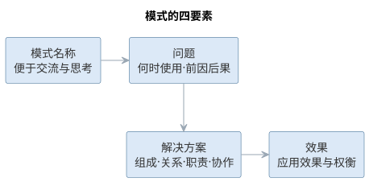
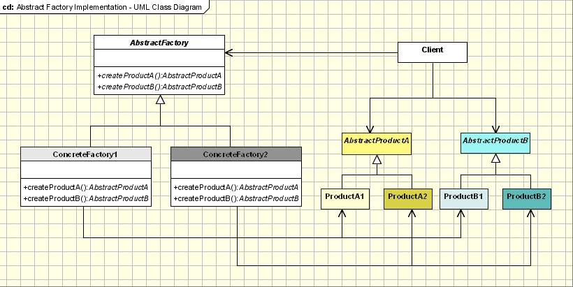
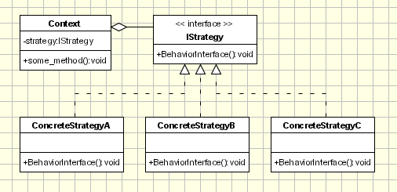
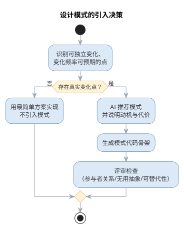
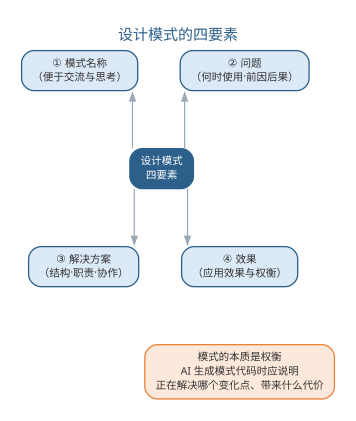

# 设计模式

设计模式描述软件设计过程中常见问题的解决方案，是从大量成功实践中总结出来并被广泛公认的经验。经典著作《设计模式》（GoF，四人组 Gamma、Helm、Johnson、Vlissides 著）收录了 23 个面向对象设计模式，成为软件工程领域最具影响力的著作之一。

## 模式的基本要素与价值

一个完整的设计模式包含四个要素：

- **模式名称**：一个助记名，便于交流与思考；
- **问题**：说明在何时使用模式，解释设计问题及其前因后果；
- **解决方案**：描述设计的组成部分、相互关系、各自职责与协作方式；
- **效果**：描述模式应用的效果与权衡。

设计模式的价值在于：使人们可以简便地复用已有的良好设计；提供一套开发人员之间交流的语言；提升看待问题的抽象程度；帮助设计人员更快更好地完成设计。同时要警惕其风险——模式不是万能的，应用一种模式通常"有得有失"，盲目套用可能造成过度设计。一个完整模式的四要素如下表所示。

| 要素 | 说明 |
|------|------|
| 模式名称 | 助记名，便于交流与思考 |
| 问题 | 何时使用，设计问题及其前因后果 |
| 解决方案 | 组成部分、相互关系、职责与协作 |
| 效果 | 应用效果与权衡 |

模式的四要素构成完整的设计经验描述，如图所示。

{width=85%}

四要素缺一不可：缺少"问题"与"效果"的模式只能看到结构，无法判断何时该用、用了得失如何。

## 模式的分类

GoF 将 23 个模式分为三类：

**创建型模式**解决对象实例化的问题，把"创建什么"与"如何创建"分离。典型模式包括：**单例**（Singleton，保证一个类仅有一个实例并提供全局访问点）、**工厂方法**（Factory Method，由子类决定创建哪个产品）、**抽象工厂**（Abstract Factory，创建一族相关对象）、**生成器**（Builder，分步构造复杂对象）、**原型**（Prototype，通过克隆创建新对象）。

{width=45%}

{width=45%}

{width=45%}

**结构型模式**组织类与对象的结构，避免类被赋予过多职责而破坏封装。典型模式包括：**适配器**（Adapter，转换接口使不兼容的类协同工作）、**桥接**（Bridge，将抽象与实现解耦）、**组成**（Composite，将对象组成树形整体—部分结构）、**装饰**（Decorator，动态为对象添加职责）、**外观**（Facade，为子系统提供统一入口）、**享元**（Flyweight，共享细粒度对象节省内存）、**代理**（Proxy，用替身控制对对象的访问）。

{width=45%}

**行为模式**分配对象职责、为对象间协作建模。典型模式包括：**职责链**（Chain of Responsibility，把请求沿处理链传递）、**命令**（Command，把请求封装为对象以支持撤销与排队）、**解释器**、**迭代器**、**中介者**（Mediator，集中协调对象间交互）、**备忘录**、**观察者**（Observer，定义一对多的依赖，状态变化时通知所有依赖者）、**状态**（State，状态改变时对象改变自身行为）、**策略**（Strategy，封装可互换的算法族）、**模板方法**（Template Method，父类定义算法骨架、子类填充细节）、**访问者**（Visitor，在不改动元素类的前提下为对象结构增加操作）。

{width=45%}

{width=45%}

以**抽象工厂**为例：它封装具体平台，使应用程序可以在不同平台上运行——用户只与抽象工厂及其产品接口打交道，更换平台只需替换具体工厂。以**观察者**为例：新闻社（被观察者）发布新闻时，所有订阅者自动得到通知并更新，符合"开放—封闭"原则。GoF 三类的模式清单与作用可归纳如下表所示。

| 类别 | 作用 | 代表模式 |
|------|------|------|
| 创建型 | 解决对象实例化，分离"创建什么"与"如何创建" | 单例、工厂方法、抽象工厂、生成器、原型 |
| 结构型 | 组织类与对象结构，避免职责过多 | 适配器、桥接、组成、装饰、外观、享元、代理 |
| 行为型 | 分配职责、为协作建模 | 策略、观察者、命令、状态、模板方法、访问者等 |

GoF 模式的三类划分与典型模式目录如图所示。

{width=75%}

## 样例：策略模式的应用

订单折扣计算是**策略模式**（Strategy，封装可互换的算法族）的典型场景。假设一个电商系统按订单计算折扣：普通用户不打折、会员享 95 折、节假日全场 85 折。若用 if-else 硬编码，每新增一种折扣都要改动计算逻辑本身，违背开闭原则；把每种折扣封装成一个策略类、用统一接口替换分支，是教科书式的解法：

```text
interface Discount {
    double calc(double price);
}
class NormalDiscount implements Discount {
    public double calc(double price) { return price; }
}
class MemberDiscount implements Discount {
    public double calc(double price) { return price * 0.95; }
}
class FestivalDiscount implements Discount {
    public double calc(double price) { return price * 0.85; }
}
class Order {
    private Discount discount = new NormalDiscount();
    public void setDiscount(Discount d) { this.discount = d; }
    public double total(double price) { return discount.calc(price); }
}
```

代码中的角色分工如下表所示。

| 角色 | 本例中的类 | 职责 |
|------|------|------|
| 策略接口 | Discount | 定义算法统一入口 |
| 具体策略 | Normal/Member/FestivalDiscount | 实现各折扣算法 |
| 上下文 | Order | 持有策略并委托调用 |

改动从"改分支"变成"加类"：新增折扣只须写一个新策略类并注入订单，原有代码一字不动，这就是**开闭原则**的直接体现。

## 样例：观察者模式的应用

天气 App 的"订阅推送"是**观察者模式**（Observer，定义一对多的依赖，状态变化时通知所有依赖者）的典型场景。气象站测得新数据后，手机通知、首页卡片、地图图层等多个界面都要同步更新，且新增界面不应改动气象站。把气象站作为主题、各界面作为观察者，即构成发布—订阅关系：

| 角色 | 类 | 职责 |
|------|------|------|
| 主题（被观察者） | WeatherStation | 维护观察者列表，数据更新时逐一通知 |
| 观察者接口 | Observer | 定义 update 数据的统一入口 |
| 具体观察者 | PushAlert、CardView、MapLayer | 收到通知后各自刷新 |

运行流程是：

1. 界面启动时调用 subscribe 向气象站注册自己；
2. 气象站测得新数据，遍历观察者列表调用 update；
3. 各界面收到数据后自行刷新，气象站不关心界面的具体类型。

新界面只需实现 Observer 接口并注册，无需改动气象站；观察者之间也互不感知——这正是"一对多"协作的解耦方式。

## 案例：模式滥用的反例

一个**典型的反例**是：为只有两三个类的简单逻辑，强行套上十几层模式。某团队曾为一个"取文件路径并保存"的小需求，引入抽象工厂创建路径、外观封装接口、装饰叠加缓存、代理拦截访问，还配了一套观察者做变更通知——实际上一个函数就能完成。结果代码行数暴涨、调用链深不可测，新人读不懂，改一处要顺着多个间接层排查。这样的设计"模式齐全"却毫无可维护性：问题不在模式本身，而在滥用。

对照下表可以看清"该用"与"不该用"的界限。

| 情形 | 该用的地方 | 不该用的地方 |
|------|------|------|
| 变化点 | 存在可独立、频繁且可预期的变化 | 结构固定，短期内不会变化 |
| 扩展方式 | 需求以新增种类、算法为主 | 以修改既有行为为主 |
| 复杂度 | 分支众多且纠缠，直写难维护 | 两三行分支即可直读直改 |
| 代价 | 间接层换来可扩展，收益明确 | 间接层徒增理解与调试成本 |

判断口诀很朴素：**模式服务于变化点，不为用而用**。先写最简单满足需求的方案，变化真实到来且频率可预期时再引入模式，才是健康的演进路径。

## 故事：GoF 与《设计模式》

1994 年，Erich Gamma、Richard Helm、Ralph Johnson 与 John Vlissides 四位软件工程师合作出版了《设计模式》（Design Patterns: Elements of Reusable Object-Oriented Software，Addison-Wesley），后世称这四人为"**四人组**"（GoF）。这本书后来成为软件工程领域被引用最多的著作之一，也是"模式运动"的开端。

- **由来**：四人在面向对象程序设计大会 OOPSLA 上相识；Gamma 在博士阶段构建的 C++ 框架 ET++ 中积累了可复用结构，其余三人也各有研究，遂把这些反复出现的解法提炼为"模式"。
- **思想源头**："模式"一词借鉴自建筑学家克里斯托弗·亚历山大，他把城市规划中反复成功的方案写成"模式语言"，GoF 把同样的思想引入软件设计。
- **内容**：全书收录 23 个模式，分创建型、结构型与行为型三类，按名称、问题、解决方案与效果四要素书写。
- **影响**："设计复用"思想随畅销迅速传播，催生了 PLoP 等模式会议，"设计模式"从此成为软件行业的通用词汇。

模式把"好设计"从大师经验变成可传递的公共知识。今天人们谈论观察者、策略时，都在沿用这本书建立的坐标系。

## 模式与 AI 代码生成

设计模式是 AI 代码生成最擅长复用的知识之一。大语言模型在训练中接触了大量模式实例，能够：依据"何时用何种模式"的描述**推荐**合适的模式；从类图或需求**生成**模式对应的代码骨架；根据 SOLID 与 DRY 原则对已有代码**提出**重构建议；在评审时**识别**模式滥用与过度设计。

但模式的本质是权衡，AI 生成模式代码时往往会"有得无失"地套用，因此需要工程师把关：只有当下注目的可变化点对应模式的适用场景时，引入模式才有价值。理解模式背后的动机与代价，是运用 AI 生成模式代码的前提。

模式推荐的正确条件并非"某个类需要解耦"，而是"存在一个可以独立变化、且变化频率可预期的点"——变化点是引入模式的理由，没有变化点，模式就是负担。AI 在推荐模式时应被要求说明"它正在解决哪个变化点、带来了什么代价"，而不是只输出"建议使用观察者模式"。这种条件化的输出让工程师不必逐条推敲模型推荐的动机，可以直接基于变化点的真实性做出判断。

防范过度设计需要双向的纪律：一方面要求 AI 在生成代码时**优先给出最简单满足需求的方案**，仅在指明变化点时引入模式；另一方面在评审时让 AI 对照"是否过度设计"的检查清单（是否存在无使用者的抽象、是否可以用更简单的结构替代、模式是否增加了不必要的间接层）扫描代码。模式是解决特定问题的良方，不是所有问题的答案——这一点对人与 AI 同样适用。

是否引入设计模式的决策流程如图所示。

{width=55%}

面对 23 个模式，过去工程师靠记忆与经验完成"问题—模式"的匹配；AI 辅助把这一步变成可复用的工作流，工程师的角色从"背模式目录"转向"验证模式动机"。模式选择辅助可以归纳为四步工作流：

1. **描述问题与变化点**：用自然语言说明"哪个对象在什么情况下需要变化、变化频率如何、有哪些关注方"，而不是直接说出模式名；
2. **映射候选模式**：让 AI 依据问题特征推荐候选模式，并要求说明"该模式正在解决哪个变化点"；
3. **对照权衡**：请 AI 给出候选模式的效果与代价对比表，标注"何时不该用"；
4. **人工裁决与沉淀**：工程师判断变化点是否真实、是否需要提前支持，把结论写入评审记录。

大语言模型在训练语料中见过大量模式应用案例，能把"对象创建方式可能变化""一对多通知"这类问题特征映射到相应模式，这是其推荐能力的来源；但同一问题可以有多种措辞，措辞不同推荐可能不同，所以工作流第一步刻意用固定结构描述问题，降低推荐的偶然性。常见的问题特征与候选模式类别的对应如下表所示。

| 问题特征 | 适用模式 |
|------|------|
| 对象创建方式可能变化 | 创建型：工厂方法、抽象工厂、生成器 |
| 接口不兼容、需协同工作 | 适配器、外观 |
| 一对多状态变化、需同步通知 | 观察者 |
| 算法族可互换 | 策略 |
| 行为随内部状态变化 | 状态 |
| 职责可动态叠加 | 装饰 |
| 需在不动元素类时增加操作 | 访问者 |

需要说明的是，上表是启发式的对应关系而非判定规则——同一问题特征可能对应多种模式，具体选择还取决于变化频率、代价承受与既有结构。AI 的推荐价值在于缩小候选范围，最终取舍仍要回到变化点与权衡上。

以报表导出为例：某模块需把多种导出格式（PDF、Excel、CSV）与报表逻辑分离，且格式会持续新增。按工作流第一步，工程师应写出"导出格式会不断新增，需在不改报表逻辑的前提下扩展"，AI 据此推荐策略模式；若只写"类之间耦合太高"，模型就可能给出适配器、外观等若干不相关的候选。输入描述越贴近变化点，推荐越收敛。

AI 生成模式代码的质量门禁，可以概括为五道关卡，其中自动化检查与人工把关各司其职。

| 关卡 | 执行者 | 检查内容 | 通过标准 |
|------|------|------|------|
| 静态检查 | 工具/CI | 编译、lint、类型检查 | 无语法与低级错误 |
| 结构校验 | AI + 工具 | 参与者、关系对照标准结构 | 角色与协作符合模式定义 |
| 语义保真 | 人工 | 变化点是否真实存在并被对应 | 模式动机与实现一致 |
| 单元测试 | CI | 行为正确、扩展性可验证 | 用例全部通过 |
| 人工评审 | 工程师 | 无用抽象、权衡与代价 | 无过度设计，理由可追溯 |

五道关卡中，前两道可由工具与 AI 自动完成，后三道必须以人或测试把关：语义保真回答"模式用对没有"，单元测试回答"行为正确没有"，人工评审回答"值得用没有"。把门禁写成项目约定，让 AI 在生成时就自报变化点与权衡，可显著减少评审阶段的返工。把"模式选择 + 质量门禁"编码为提示词模板如下：

```text
你是资深软件工程师。请根据问题描述推荐设计模式并生成代码骨架：
问题：<描述对象、变化点与关注方，例如"订单状态变化时，多个界面与通知
需同步更新，且后续可能新增关注方">
要求：
1. 先说明推荐哪个模式、该模式解决哪个变化点、带来什么代价；
2. 仅当变化点真实存在时才引入模式，否则给出最简单的直写方案；
3. 生成骨架代码，命名用驼峰式，注释说明各参与者职责；
4. 最后给出 100 字以内的权衡说明，标注"何时不该用此模式"。
```

质量门禁的落地依赖测试支撑——观察者、策略这类行为模式的验证需要单元测试构造关注方与变化场景，测试用例设计将在第 10 章详细展开；"可编译不等于可维护"的判断标准则已在第 9 章软件实现中讨论。AI 生成模式代码进入基线前必须通过门禁，这条纪律与人工编写代码完全相同。

模式与 AI 代码生成同样存在局限与失败模式，如下表所示。

| 失败模式 | 典型表现 | 应对 |
|------|------|------|
| 结构套用 | 生成"教科书结构"却无对应变化点 | 先问变化点，再谈模式 |
| 变体误选 | 单例/工厂/生成器选错，引入不必要的全局状态 | 要求模型说明创建场景与变体差异 |
| 双标准代码 | 生成代码与既有风格、依赖不一致 | 提示词注入项目规范，必要时参考既有模式实例 |
| 单模式遗漏 | 真实系统需多模式组合，AI 只给单模式 | 要求列出候选组合与组合带来的约束 |

设计模式是详细设计层面的复用单位，与已在第 7 章讨论的体系结构风格互补——前者解决类级协作，后者解决系统级组织；本章聚焦模式与 AI 的组合应用。

## AI 生成模式代码的实践

让 AI 可靠地生成模式代码，关键在于提示词中给出足够的结构信息。一个常用的做法是"意图 + 变化点"式描述：不仅告诉模型"用观察者模式"，还说明"库存变化时多个界面需要同步更新，且后续可能新增关注方"，模型据此生成的代码才能贴合并可维护。若仅有模式名而无意图，模型往往套用教科书结构，产生大量无用抽象。

工程上可以进一步把模式知识组织为可检索资源：团队把沉淀的模式实例、适用场景与权衡记录整理入库，通过检索增强生成（RAG）让模型基于团队自己的经验作答，而不是仅凭通用训练数据。评审 AI 生成的模式代码时，建议对照以下清单：

- 变化点是否真实存在且需要提前支持？
- 模式的参与者、关系是否符合其标准结构？
- 是否引入了无使用者的接口或抽象？
- 现有代码中是否存在可被该模式替代的重复结构？

模式代码与普通代码一样，需要经过测试与评审才能进入基线。评审 AI 生成的模式代码，可对照以下清单逐项检查。

| 评审问题 | 检查要点 |
|------|------|
| 变化点是否真实存在？ | 是否确需提前支持变化 |
| 参与者是否符合标准结构？ | 模式的角色与关系是否正确 |
| 是否存在无用抽象？ | 无使用者的接口或抽象 |
| 是否可替代重复结构？ | 现有代码中可被该模式替代的部分 |

让 AI 生成模式代码并以评审清单把关的流程如图所示。

{width=65%}

"意图+变化点"式描述让模型生成贴合的代码，评审清单则防止模式被盲目套用。对 AI 生成代码的评测、幻觉防范与责任归属，将在第 17 章系统讨论。

一个完整的实例如下。需求是：订单状态变化时，邮件、短信与日志三个关注方需要同步更新，且后续可能新增关注方（如推送、审计）。工程师按"意图 + 变化点"的方式写下的提示词为：

```text
订单状态变化时，邮件、短信与日志三个关注方需要同步更新，且后续可能新增关注方。
请推荐模式并生成骨架代码：先说明推荐理由与变化点，再生成实现，最后给出权衡。
```

AI 推荐观察者模式，理由是"关注方集合可以独立扩展"，并生成了 `OrderObserver` 接口、`OrderService` 维护观察者列表、`changeState` 遍历通知的骨架代码。工程师对照评审清单评估发现：变化点真实存在、参与者符合观察者标准结构，但有两处契约细节缺失——其一，通知顺序未约定，多个关注方并发订阅时行为不确定；其二，未处理"观察者抛异常导致状态更新中断"的异常路径。工程师把这两点写入提示词（"按订阅顺序通知、观察者异常隔离"）后生成第二版，补齐了顺序通知与异常捕获，经单元测试（模拟新增关注方、注入异常）验证后进入基线。

这个实例说明两点：AI 生成的第一版往往"结构对而契约缺"——模式骨架标准，但边界与异常路径这类非模式本身的细节仍需补全；把"意图 + 变化点"与评审清单写进提示词，能显著提高首版质量。与纯人工相比，效率提升集中在接口设计与样板代码，而"模式动机的判断与权衡把关"始终属于人——评审清单不是流程摆设，而是把人的经验外化，供 AI 生成、工程师审查共同使用。

### 模式与 AI 的要点对照

设计模式是 AI 代码生成最擅长复用的知识，也是过度设计的高发区。模式的四要素——名称、问题、解决方案与效果——共同决定了模式的价值边界。评审 AI 生成的模式代码，可对照以下清单。

| 评审检查项 | 说明 |
|------|------|
| 变化点是否真实存在 | 是否存在可独立变化、且变化频率可预期的点 |
| 模式结构是否符合标准 | 参与者、关系与协作是否贴合标准结构 |
| 是否引入无用抽象 | 是否存在无使用者的接口或抽象类 |
| 是否有可替代的简单方案 | 能否用更简单的结构达成同样目的 |
| 是否说明权衡与代价 | 模式带来效果上的"有得有失" |

设计模式的四要素结构如图所示。

{width=60%}

对 AI 生成模式代码的评审应当双向进行：一方面要求 AI 优先给出最简单满足需求的方案、仅在指明变化点时引入模式；另一方面让 AI 对照"是否过度设计"的检查清单扫描已有代码，把模式的应用建立在变化点真实性的判断之上。

### 前沿演进：模式知识库与 AI 驱动的重构

模式知识的前沿实践是把团队沉淀的模式实例、适用场景与权衡记录组织为**可检索的知识库**，通过 RAG 让 AI 基于团队自己的经验生成建议，而非仅凭通用训练数据。同时，AI 驱动的重构（自动识别重复结构、坏味道，生成重构方案）把"模式应用"从人工判断推向自动化辅助；架构重构（模块化拆分、依赖清理）也借助 AI 的全局分析能力。实践要点如下表所示。

| 实践 | 做法 | 价值 |
|------|------|------|
| 实例沉淀 | 记录成功/失败模式案例 | 经验可复用 |
| 知识入库 | 向量化并索引 | 支撑 RAG 检索 |
| 按需检索 | 生成时按变化点检索 | 建议贴合团队 |
| 反馈闭环 | 新案例回流入库 | 知识持续生长 |

模式知识库的检索增强闭环——从沉淀到反馈——如图所示。

{width=85%}

模式知识库把"经验"变成组织资产：团队的每一次重构、每一个成功或失败的模式应用都沉淀为知识，AI 生成的建议因此越来越贴合项目实际——知识库的质量，取决于团队沉淀与校验的纪律。

## 本章小结

设计模式是从成功实践总结出的常见问题解决方案，四要素——名称、问题、解决方案与效果——决定其价值边界。模式与 AI 代码生成把模式复用推向自动化：AI 依据问题特征推荐模式、生成骨架代码，质量门禁（静态检查、结构校验、语义保真、单元测试、人工评审）防止"符合标准结构却无使用价值"的代码进入基线。模式的本质是权衡，变化点真实性是引入模式的唯一理由，过度设计需要双向纪律约束。人机分工上，AI 快速生成候选与结构检查，人负责变化点裁决与权衡把关；验证优先、决策在人。

**思考与讨论：**
1. 为什么"某个类需要解耦"不足以成为引入模式的理由？变化点指什么？
2. 请编写一条"从问题描述推荐模式"的提示词，并说明如何让它避免推荐过度设计。
3. AI 生成观察者模式代码后，你会重点审查哪些点？请给出你的评审清单。
