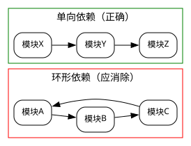
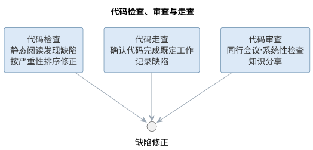
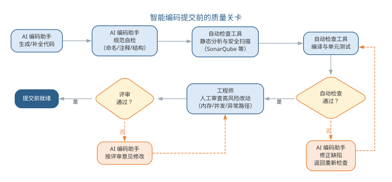

# 软件实现

软件编码不是把设计机械地转换成源代码的低水平工作，而是一个复杂而迭代的过程。它是设计的继续，直接影响软件的质量与可维护性。软件实现既要正确理解需求与设计、正确编写并测试源代码，又要意识到：软件全生命周期约 70% 的成本发生在维护阶段，而软件在生命周期中很少由原作者维护——因此"写给人读"的代码风格与工程规范至关重要。

## 软件编码的工作

软件编码包括六个环节：**程序设计**（理解需求与设计模型、补充遗漏的详细设计、设计代码结构）、**设计审查**（检查设计结果并记录缺陷）、**编写代码**（遵循编码规范、保证代码易验证）、**代码走查**（确认代码完成既定工作、记录缺陷）、**编译代码**（修正语法错误）、**测试代码**（单元测试与调试）。六个环节的任务与目的如下表所示。

| 环节 | 主要任务 | 目的 |
|------|------|------|
| 程序设计 | 理解需求与设计、设计代码结构 | 保证编码有据可依 |
| 设计审查 | 检查设计结果并记录缺陷 | 早期发现设计问题 |
| 编写代码 | 遵循编码规范、保证易验证 | 产出可读可维护代码 |
| 代码走查 | 确认代码完成既定工作 | 发现并记录缺陷 |
| 编译代码 | 修正语法错误 | 保证可编译运行 |
| 测试代码 | 单元测试与调试 | 验证行为正确 |

{width=60%}

## 编码规范

编码规范是与语言相关的代码编写规则集合，其目的是提高编码质量、增强可读性、可重用性与可移植性。规范从几个方面展开：

- **基本要求**：程序结构清晰简单、算法直接了当、尽量使用标准库与公共函数、用括号消除二义性；
- **可读性**：可读性第一、效率第二。文件与函数有头注释、变量与常量有说明、注释与代码一致、用统一缩进显示逻辑结构，嵌套层次不超过五层；
- **命名规则**：标识符望文知义，遵循"最小长度下的最大信息"原则；变量用名词、函数用动词；类名首字母大写组合、常量全大写用下划线分隔、成员与局部变量用驼峰式命名；
- **结构化要求**：禁止 GOTO，避免多个循环出口，函数保持单入口单出口；
- **正确性与容错性**：程序首先是正确其次才是优美；对用户输入进行合法性检查、变量使用前初始化、提交联调前必须通过单元测试（对每个公有方法测试正确输入与容错处理）；
- **可重用与可移植性**：相对独立的功能封装为公共类或模板，尽量使用标准库与标准 SQL，避免依赖第三方专用接口。

常见的实现缺陷包括：内存泄漏（malloc 分配后未释放）、指针参数失效（值传递无法修改实参）、"野指针"（释放后未置空）、异常处理中的资源未释放、循环内重复计算等。对策是：申请内存后立即检查、释放后置 NULL、申请与释放配对、算法优化与把循环不变量提出循环体。常用命名规范速查如下表所示。

| 标识符 | 命名规则 | 示例 |
|------|------|------|
| 类名 | 首字母大写、组合单词 | OrderManager |
| 方法/函数 | 动词开头、驼峰式 | calculateTotal() |
| 常量 | 全大写、下划线分隔 | MAX_BUFFER_SIZE |
| 成员变量 | 驼峰式、可加下划线前缀 | _orderCount |
| 局部变量 | 驼峰式、简洁达意 | totalAmount |

编码规范的六个维度共同保证代码质量，如图所示。

{width=75%}

{width=60%}

模块之间应保持单向依赖，环形依赖是代码腐化的信号，正确与错误的结构对比如图所示。

{width=70%}

## 代码检查与审查

编译没有错误绝不意味着程序没有错误。**代码检查**通过静态阅读代码发现逻辑、计算、接口、数据处理与文档等各类缺陷，并按严重性（严重/中等/很小）排序调度修正工作。检查清单通常按类、属性、构造函数、方法头、方法体分项检查：命名是否与设计相符、是否尽量私有、头部是否说明目的与前后置条件、每个循环能否终止、是否考虑了非法参数等。**代码审查**则由同行以会议形式系统性检查，是发现缺陷、分享知识的重要手段。三种手段的对比如下表所示。

| 手段 | 方式 | 主要目的 |
|------|------|------|
| 代码检查 | 按清单静态阅读代码 | 发现逻辑、接口等缺陷并按严重性排序 |
| 代码走查 | 作者讲解、小组验证 | 确认代码完成既定工作、记录缺陷 |
| 代码审查 | 同行会议式评审 | 系统性检查、分享知识 |

代码检查、走查与审查三种手段共同构成编码后的质量关口，如图所示。

{width=85%}

三者都指向缺陷修正，只是方式与侧重不同——检查靠清单、走查靠讲解、审查靠同行碰撞。

## 样例：命名从糟糕到良好

命名是编码规范中最立竿见影的一环：标识符是读者理解代码的第一线索，**望文知义的命名**让意图直接可见，糟糕的命名则逼读者逐行推理。下面同一段逻辑——计算图书借阅超期天数与罚款——先给出糟糕的命名版本：

```text
void handle() {
    int a = b.ret - b.due;   // a：借阅天数，b：借阅记录
    int d1 = a - b.allow;    // d1：超期天数
    double tmp = d1 * 0.5;   // tmp：罚款金额，每天 0.5 元
    if (d1 <= 0) { tmp = 0; }
    System.out.println(d1 + "天，" + tmp + "元");
}
```

再给出良好的命名版本：

```text
void printOverdueInfo(Borrower borrower) {
    int daysBorrowed = daysBetween(borrower.returnDate, borrower.dueDate);
    int daysOverdue  = daysBorrowed - borrower.allowedDays;
    double fine = daysOverdue > 0 ? daysOverdue * DAILY_FINE : 0;
    System.out.println(daysOverdue + "天，" + fine + "元");
}

boolean isOverdue(Borrower borrower) {
    return borrower.returnDate > borrower.dueDate;
}
```

两版功能完全相同，可读性却天差地别：

- `handle()` → `printOverdueInfo()`：函数名从"什么也不说"变成"做什么一目了然"；
- `a`、`d1`、`tmp` → `daysBorrowed`、`daysOverdue`、`fine`：变量名把含义（天数、金额）写进标识符，读者不必回看注释；
- `b` → `borrower`：参数的角色与类型清楚，调用处无需猜测"这个 b 是谁"；
- 新增 `isOverdue()`：把"是否超期"提炼成可复用、可测试的布尔函数，命名本身就是一句注释。

命名改变的只是几个字符，改变的却是整个团队理解与维护这段代码的成本。

## 案例：代码审查抓住的经典缺陷

代码审查的价值常被概括为"**第二双眼睛**"：作者熟悉自己的意图，容易"想当然"跳过边界，而旁观者总能问出"这里真的对吗"。一个典型的例子是边界条件——`<=` 与 `<` 的一字之差。

一次订单系统的促销活动规则是"单笔订单满 100 元免运费"，实现时条件却写成了：

```text
if (total < 100) { chargeShipping(); }   // 缺陷：恰好 100 元的订单被收运费
```

正确应为 `total <= 100`。这一字之差意味着，恰好落在 100 元档位的订单会被错误收取运费，若上线将引发成批客诉与赔付。代码审查时，同事一句"100 元整的订单呢？"当场问出了这个缺陷，修正后才合入。审查能抓住的典型缺陷不止边界：

- **数组越界**：循环 `i < n` 写成 `i <= n`，或下标从 1 而非 0 开始；
- **空指针**：解引用前未判断对象可能为 null，异常输入下崩溃；
- **资源泄漏**：异常路径漏释放内存、连接或文件句柄；
- **语义偏差**：逻辑与需求表述不一致，代码"能跑"但"不对"。

审查把"作者自证正确"换成"他人质疑正确"，一次往往能发现 3–5 处测试未必覆盖的边界缺陷。正是这双"第二双眼睛"，让许多事故止步于合入之前。

## 样例：注释与文档的规范写法

注释是写给下一个维护者看的，而不是写给编译器。规范写法的第一原则是：**注释解释"为什么"，而非复述"是什么"**。复述代码的注释只是噪音，解释取舍、约束与历史原因的注释才传递知识。先看差的写法：

```text
double total = 0;
for (Item it : items) {
    total += it.price * it.count;   // 累加价格
}
```

再看好的写法——同样的功能，把"为什么"写清楚：

```text
/**
 * 判断订单是否满足发货条件。
 * 前置条件：order 非空且状态已锁定。
 * 后置条件：不修改订单状态。
 */
boolean canShip(Order order) {
    // 为什么只判库存：运费、地址等校验已在更早的下单环节完成
    // 为什么用 > 而非 >=：库存恰好为 0 时无货可发
    return order.stock > 0;
}
```

规范注释通常分三类：

| 注释类型 | 位置 | 内容 |
|------|------|------|
| 头注释 | 类或模块开头 | 职责、使用方式、维护约定 |
| 接口注释 | 函数声明上方 | 意图、前置/后置条件、参数含义 |
| 关键逻辑注释 | 算法或取舍处 | 解释"为什么这样写"及历史原因 |

头注释让读者不读实现即知职责，接口注释让调用者不读实现即会用，关键逻辑注释保护那些"代码读不出来"的决策。而**与代码不一致的注释比没有注释更有害**——它会把维护者引向错误的方向。

## 案例：一份可读的代码胜过十页文档

"代码即文档"（code as documentation）的含义是：可读的代码本身就是最可靠的文档——它时刻与实际行为一致，不需要维护，也**不会过期**。注释与文档都可能撒谎，代码不会。一个典型的接手场景印证了这一点。

团队接手一个遗留系统，其中有两个规模相近的模块：模块 A 几乎没有注释，但命名清晰、结构简单，如 `invoiceDueDate`、`chargeLateFee()`，一眼能读出意图；模块 B 注释满篇，命名却混乱，如 `a`、`tmp`、`doThing()`，且注释常与代码不符——代码已改而注释未改。半年后，两组维护体验天差地别：

| 模块 | 特点 | 维护体验 |
|------|------|----------|
| A | 无注释，命名清晰 | 读代码即理解意图，改动无需担心旁支 |
| B | 注释满篇，命名混乱 | 每次改动都要通读上下文猜测意图 |

对模块 B 的一次需求变更，团队排查了两天才敢动手，最后靠重读旧代码并补写单元测试验证；而模块 A 的同类变更当天完成。这正说明**命名与结构承担"是什么"，注释只负责解释"为什么"**——与其堆十页文档，不如让每一行代码都被人一眼读懂。

## 智能编码

大语言模型把"编码"从人工逐行书写推向人机协作。AI 编码助手可以：根据注释与函数签名**生成**函数体与测试代码，**补全**上下文相关的代码，对提交前的代码**执行**静态检查与安全扫描，按规范**重构**代码并给出解释。

智能编码的实践要点在于"规范前置"：把命名规则、注释格式、结构要求写入项目约定或提示词，AI 生成的代码才能符合规范；同时在提交前以代码审查清单为提示词让 AI **自检**，以单元测试验证生成结果。AI 大幅提高了编码效率，但正确性与可维护性的责任仍然落在程序员身上——尤其是内存管理、异常路径这类"机器容易犯、且犯错代价高"的场景。

代码生成的质量需要区分两个层次：**可编译**只说明语法正确，**可维护**才意味着可以长期演进。AI 生成的代码在语法层面已经相当可靠，但可维护性——命名是否达意、结构是否符合项目约定、是否包含不必要的抽象、异常路径是否被妥善处理——仍需要以规范和审查来约束。把"能否通过静态检查与单元测试"作为 AI 生成代码的准入门槛，是防止"能跑但不可维护"的低质代码混入基线的最低要求。

对内存管理、并发与异常路径这类"机器容易犯、且犯错代价高"的场景，应当采取更保守的策略：要求 AI 在生成此类代码时**显式说明其资源与并发假设**，由工程师逐行审查后再进入测试；必要时把这类高风险模块标记为"禁止 AI 直接合并"，强制人工评审。编码规范的本质是对风险的分配——AI 适合承担高频低风险的常规实现，而低频高风险的部分始终保留人的判断。AI 与人在编码中的分工如下表所示。

| 环节 | AI 承担 | 人保留 |
|------|------|------|
| 代码生成 | 函数体、补全、重构 | 定义意图与规范 |
| 质量检查 | 静态检查、安全扫描、自检 | 逐行审查高风险部分 |
| 规范执行 | 按项目约定输出 | 制定与维护规范 |
| 风险模块 | 高频低风险的常规实现 | 内存、并发、异常路径把关 |

人机协作编码中，人与 AI 在生成、检查、审查之间交替接力，流程如图所示。

{width=90%}

AI 负责高频低风险的生成与检查，人守住审查与合并的最终关口。AI 在不同编码任务上的能力并不均等，边界与人工把关点如下表所示。

| 任务类型 | AI 能力 | 人工把关点 |
|------|------|------|
| 代码补全 | 强（局部、上下文相关） | 采纳后审查语义是否贴合意图 |
| 代码问答与解释 | 强 | 核对解释与实现一致 |
| 函数级生成 | 中强（依赖提示质量） | 规范符合性、异常路径处理 |
| 跨文件重构 | 中（易引入遗漏） | 逐文件评审、跑全量测试 |
| 架构级决策 | 弱（缺乏全局约束） | 由人决策，AI 仅提供候选方案 |

把编码规范落到提示词上，就是一条"规范前置"的生成模板：

```text
你是本项目的资深工程师，请根据函数签名实现函数体，并遵守项目编码规范：
- 命名：动词开头、驼峰式；局部变量简洁达意
- 头注释：先写 3 行说明意图与前置/后置条件
- 容错：对非法参数返回明确错误，不抛裸异常
- 单入口单出口；不使用全局状态
函数签名：public BigDecimal calculateTotal(List<OrderItem> items)
请先输出实现，再输出 100 字以内的自检说明（列出满足了哪些约束）。
```

把编码规范写进提示词有四个好处：规范随每次生成自动执行，而非事后检查；要求模型自检把"审查"前移到生成时；提示词本身可版本化、随规范演进；同一模板可复用为评审提示词，把"生成规范"与"审查规范"统一。规范前置的落地流程是：建立项目规范 → 写进提示词模板 → AI 生成并自检 → 静态检查与单元测试 → 人工审查高风险部分，形成闭环。

## 智能编码实践

智能编码的工程落地主要围绕编码助手与审查流水线展开。**编码助手选型**上，编辑器内嵌的补全型助手（如 GitHub Copilot）适合常规代码补全，对话式开发工具（如 Cursor、Claude Code）适合多文件修改与重构，团队可按任务类型组合使用。无论选哪类工具，都应先建立项目级编码规范，再让 AI 输出，即"规范前置"：

| 编码规范条目 | 提示词化要点 |
|------|------|
| 命名规则 | 在提示词中说明命名风格与示例 |
| 文件与函数头注释 | 要求 AI 输出前先写注释说明意图 |
| 结构化要求 | 禁止 GOTO、单入口单出口 |
| 正确性与容错性 | 要求 AI 处理非法输入并说明边界 |
| 可重用与可移植性 | 要求优先使用标准库 |

提交前的质量关卡通常由"自动检查 + AI 自检 + 人工审查"三层构成：静态分析工具（如 SonarQube、CodeRabbit）自动扫描规则违反与安全风险；让 AI 对照评审清单对自身输出自检，报告已知缺陷；工程师针对改动的高风险部分人工审查。这样把 AI 的高效与人的判断结合起来，避免"生成的代码无人负责"。

编码助手按任务类型组合使用，选型要点如下表所示。

| 工具类型 | 代表 | 适合任务 | 局限 |
|------|------|------|------|
| 补全型 | GitHub Copilot | 常规补全、样板代码 | 缺全局上下文，跨文件能力弱 |
| 对话式 | Cursor、Claude Code | 多文件修改、重构、问答 | 依赖清晰指令，须人工评审 |
| 自动化代理 | Agent 化编码工具 | 端到端任务（生成测试、修复缺陷） | 输出必须经严格验证才能进入基线 |

智能编码的工程落地可归纳为四步：其一，**立规范**——建立项目编码规范并写成约定文件（如 CLAUDE.md、AGENTS.md）与提示词模板；其二，**选工具**——按任务类型组合补全型与对话式工具，先小范围试点并跟踪采纳率；其三，**建关卡**——配置"自动检查 + AI 自检 + 人工审查"三层门禁，高风险模块标记"禁止 AI 直接合并"；其四，**评效果**——用基准任务与交付指标（采纳率、缺陷率、交付周期）评估工具收益与边界，持续调优提示词与治理策略。四步形成从选型到治理的闭环，让 AI 编码从"个人效率工具"升级为"团队工程资产"。

与生成债相伴的是**维护成本前置**：AI 可以快速产出大量代码，也让错误以同样速度积累。生成债（generation debt）指自动生成的、缺乏设计沉淀与测试覆盖的代码堆叠而成的高维护成本区域。控制生成债的关键是把 AI 编码纳入与人工编码同等的工程纪律——生成即测试、生成即评审、定期重构，并在度量上跟踪"AI 产出代码的缺陷密度与返工率"，让效率提升不转化为债务堆积。

"规范前置"还要求规范可及：AI 编码助手需要能读到项目规范与相关代码。团队通常以**约定文件**（如 CLAUDE.md、AGENTS.md）集中描述项目结构、编码规范、常用命令与红线约束，并配套检索知识库，让 AI 在生成时动态获取相关上下文。约定文件的常见内容如下表所示。

| 内容 | 说明 | 示例条目 |
|------|------|------|
| 项目概览 | 技术栈、目录结构、构建方式 | "本仓库为 Spring Boot 多模块项目" |
| 编码规范 | 命名、注释、结构要求 | "标识符用驼峰式、常量全大写" |
| 常用命令 | 构建、测试、运行命令 | "make test 运行全部单元测试" |
| 约束与红线 | 禁止事项与降级策略 | "禁止 AI 直接修改数据层" |

提交前的三层质量关卡如图所示。

{width=85%}

智能编码的边界在于：AI 擅长的是"把已有的明确意图转换为代码"，而"这个意图是否正确""改动是否引入了回归"仍需测试与评审回答。工程师在智能编码时代的新角色——阅读、评估与整合 AI 生成代码——被概括为"代码策展"（code curator），这一概念将在第 17 章详细展开。

一个完整的智能编码实例如下。需求是"实现购物车价格汇总：按单价×数量累加，满 1000 元打九折"。工程师写下的提示词为：

```text
实现 calculateTotal：对订单项按"单价×数量"累加，满 1000 元打 9 折；
金额用 BigDecimal 避免浮点误差；入参为空返回 0；头注释说明前置条件。
```

AI 的第一版输出了可编译的实现，并在自检中说明已满足"BigDecimal 与空入参"两条约束。工程师评审发现两处可维护性问题：其一，折扣率 0.9 被硬编码为字面量，而项目约定"业务参数可配置优先"；其二，BigDecimal 除法未指定舍入模式，输入含除不尽的比例时可能抛出 `ArithmeticException`。把这两点写入提示词后生成第二版，补齐了配置提取与舍入处理，经单元测试与静态检查后合入。

这个实例说明两点：AI 生成的第一版往往"能跑"但"不符合约定"，命名、可配置性、边界处理这类可维护性缺陷仍需人工评审发现；而提示词中声明"用 BigDecimal、说明前置条件"等约束，能显著减少首版缺陷。与纯人工编写相比，首版效率提升明显，但审查环节并未消失——它只是从"写之前思考"部分转移到"生成后评审"。

### 智能编码的要点与误区

智能编码的常见误区，是混淆"可编译"与"可维护"两个层次，或在内存、并发等高风险场景放松审查。要点与误区如下表所示。

| 误区 | 典型表现 | 应对要点 |
|------|------|------|
| 可编译即可维护 | 语法正确却难以演进的代码入基线 | 以规范与审查约束命名、结构与异常路径 |
| 高风险场景放权 | 内存/并发代码由 AI 直接合并 | 要求 AI 显式说明资源与并发假设，人工逐行审查 |
| 规范后置 | 先让 AI 输出再补规范 | 规范前置：命名、注释、结构要求先写入提示词 |
| 三层关卡缺层 | 只做静态检查，无人审高风险改动 | 自动检查 + AI 自检 + 人工审查三层齐备 |

代码策展的工作流——从阅读评估到验证把关——如图所示。

{width=75%}

把"能否通过静态检查与单元测试"作为 AI 生成代码的准入门槛，是防止"能跑但不可维护"的低质代码混入基线的最低要求；而对高风险模块，应把这类改动标记为"禁止 AI 直接合并"，强制人工评审。

### 前沿演进：上下文工程与 AI 编码治理

前沿的 AI 编码实践把**上下文工程**（context engineering）作为核心：项目以约定文件（如 CLAUDE.md、.cursorrules、AGENTS.md）与检索知识库组织上下文，AI 编码时按任务动态检索架构文档、编码规范与代码样例，让生成贴合项目实际。同时，**AI 编码的治理**关注采纳率、生成债与降级策略：评测 AI 工具的效果（如 SWE-bench 类基准）、管理自动生成的代码债、定义何时退回人工编码。治理面与目标如下表所示。

| 治理面 | 实践 | 目标 |
|------|------|------|
| 上下文组织 | 约定文件 + 检索知识库 | 生成贴合实际 |
| 效果评测 | 基准与采纳率跟踪 | 量化工具价值 |
| 生成债管理 | 定期重构与清理 | 控制技术债 |
| 降级策略 | 高风险场景人工编码 | 保障质量底线 |

项目上下文工程的闭环——从收集到沉淀——如图所示。

{width=85%}

上下文工程揭示了一个关键转变：AI 编码的质量不再只取决于模型能力，而取决于"喂给模型什么"。上下文组织能力成为工程师的核心技能，它与代码评审一起，构成 AI 编码时代质量的两道闸门。

## 本章小结

软件实现是把设计转译为可运行、可维护代码的活动。编码规范（命名、可读性、结构化、容错、可重用）与代码检查、走查、审查三道质量关口，是传统实现阶段的质量保障。智能编码把 AI 引入生成、补全、检查与重构，但正确性与可维护性的责任仍在人："规范前置"让生成符合约定，三层关卡（自动检查 + AI 自检 + 人工审查）防止低质代码入基线，内存、并发、异常路径等高风险模块保留人工把关。工程师的新角色是代码策展——阅读、评估、整合 AI 生成的代码；上下文工程与 AI 编码治理成为新的质量闸门。

**思考与讨论：**
1. 为什么"可编译"不等于"可维护"？举一个 AI 生成代码"能跑但不可维护"的具体例子。
2. 请为你的团队编写一条编码提示词模板，并说明你选择了哪些规范条目、为什么。
3. 内存管理与并发这类高风险模块，人应当如何把关 AI 的输出？
