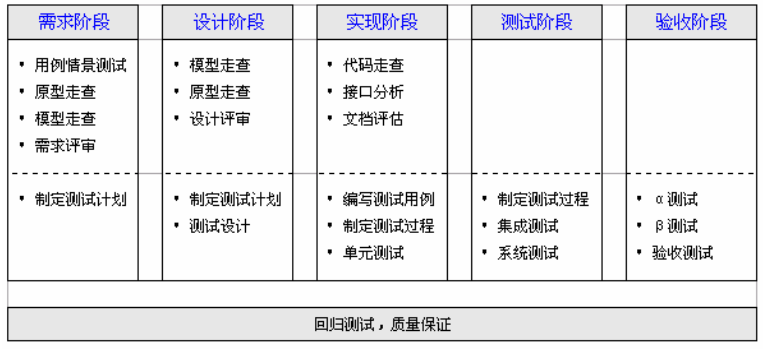
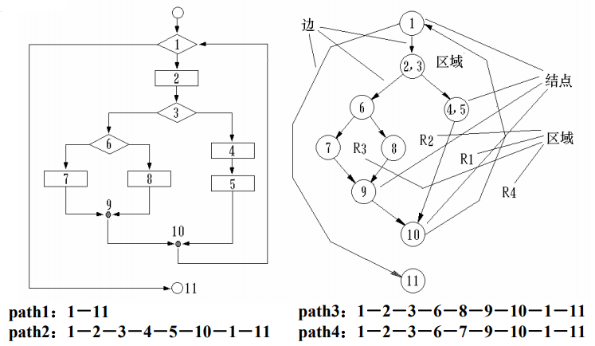
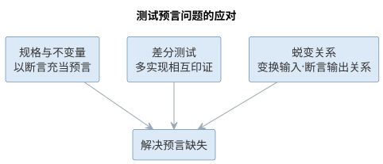

# 软件测试

有错是软件的属性，而且无法根本改变。软件工程的关键在于如何避免错误的产生、消除已经产生的错误，把错误密度降到尽可能低。软件测试正是最核心的防线。

## 基本概念

测试领域有一组容易混淆的基本概念：**错误**（Error）是导致系统可能包含故障的人的行为，如输入错误、需求错误、设计错误；**缺陷**（Defect/Bug）是错误的表现；**故障**（Fault）是系统的规格说明与行为之间的偏差。**验证**（Verification）回答"我们是否在正确地制造产品"，检验各阶段产品是否满足需求，强调对过程的检验；**确认**（Validation）回答"我们是否在制造正确的产品"，保证最终产品符合用户需求，强调对结果的检验。

**软件测试的目的**是证明程序有错，而不是证明程序无错误。一个好的测试用例在于能够发现至今未发现的错误；一个成功的测试是发现了至今未发现的错误的测试。因此测试者应当：尽早和不断地测试；避免程序员检查自己的程序；测试用例包括合理输入、不合理输入与各种边界条件；充分注意缺陷的群集现象；制定严格的测试计划；注意回归测试的关联性；妥善保存测试文档。

{width=55%}

上述概念的含义与相互关系可对照如下表所示。

| 概念 | 含义 | 相互关系 |
|------|------|------|
| 错误（Error） | 人的行为，如输入、需求、设计错误 | 是缺陷的来源 |
| 缺陷（Defect/Bug） | 错误在软件中的表现 | 可能触发故障 |
| 故障（Fault） | 规格说明与行为之间的偏差 | 由缺陷引起 |
| 验证（Verification） | 是否在正确地制造产品 | 强调对过程的检验 |
| 确认（Validation） | 是否在制造正确的产品 | 强调对结果的检验 |

## 验证与确认活动

验证与确认贯穿生命周期：需求阶段通过用例、形式化方法与需求评审建立测试依据；设计阶段借助断言、契约设计与设计评审；实现阶段以软件测试为主要工具，辅以代码走查、检查与评审。验证方式分为**静态方法**（走查、审查、检查，通过人工分析确认正确性）与**动态方法**（执行程序以确认是否有问题）。

{width=55%}

**评审**由开发人员、用户、领域专家等组成会审小组，对工作制品进行静态分析；**走查**由设计或编程人员按测试用例人工模拟计算机运行一遍；**检查**由经严格训练的人员按评估标准、按规定程序发现错误。三种活动是发现需求、设计与代码缺陷的低成本手段。验证的静态与动态两类方式可对照如下表所示。

| 维度 | 静态方法 | 动态方法 |
|------|------|------|
| 手段 | 人工分析，不执行程序 | 执行程序观察行为 |
| 形式 | 评审、走查、检查 | 单元/集成/系统测试 |
| 目标 | 发现需求、设计与代码缺陷 | 确认行为符合规格 |
| 成本 | 低，适合早期 | 高，需运行环境与用例 |

## 测试文档与测试过程

标准测试文档包括：**测试计划**（规定测试的范围、方法、资源与进度）、**测试规范**（规定用例的运行环境、生成与执行步骤）、**测试用例**（数据输入与期望结果组成的对）、**缺陷报告**（记录缺陷的严重性与优先级）。软件测试遵循 **V 模型**：单元测试对应详细设计、集成测试对应体系结构设计、系统测试对应需求分析、验收测试对应客户需求。

{width=60%}

**单元测试**对软件基本单元进行测试，一般由编写该单元的开发者执行，需要驱动模块与桩模块模拟上下层；

{width=55%}**集成测试**在单元测试基础上按层次、功能、进度或使用关系组装模块，测试接口问题；**系统测试**在实际运行环境下进行功能、性能、压力、安全性、恢复、GUI、安装等各类测试；**验收测试**以用户为主、用实际数据测试，常辅以 α 测试（用户开发环境下进行）与 β 测试（多用户实际环境下进行）；**回归测试**验证系统变更没有破坏原有功能，常因重复劳动而需要自动化。

## 测试技术

**黑盒测试**（功能测试）把测试对象当作黑盒，依据需求规格说明检查功能实现，不关心内部逻辑；**白盒测试**（结构测试）利用程序内部逻辑设计用例，对逻辑路径进行测试。由于穷尽输入与穷尽路径都不可能，测试必须借助系统化方法：

- **等价类划分**：把可能的输入划分成若干等价类，每类选一个代表测试用例，把用例数量降到最少；
- **边界值分析**：在等价类"边缘"选择元素，因为错误多发生在边界附近；

  {width=50%}
- **路径测试**：基于程序控制流图分析环路复杂性，导出基本路径集合，保证每条可执行语句至少执行一次；

  {width=50%}

路径测试的度量基础是程序的控制流图：节点表示基本块，有向边表示控制转移，环路复杂性 $V(G)=E-N+2P$ 即由其中的节点数、边数与连通分量导出。一个程序的控制流图如图所示。

{width=80%}
- **基于状态的测试**：从 UML 状态图得出测试用例，适合面向对象系统。
以经典的"日期加一天"函数（给定年月日，返回加一天后的日期）为例，用等价类划分与边界值分析得到的部分测试用例如下表所示。

| 序号 | 输入：月 | 日 | 年 | 期望输出 |
|------|--------|----|----|----------|
| 1 | 2 | 14 | 2000 | 2000 年 2 月 15 日 |
| 2 | 2 | 28 | 2000 | 2000 年 2 月 29 日（闰年） |
| 3 | 2 | 28 | 2002 | 2002 年 3 月 1 日（平年） |
| 4 | 2 | 29 | 1996 | 1996 年 3 月 1 日（闰年） |
| 5 | 2 | 30 | 1996 | 无效的输入日期 |
| 6 | 6 | 30 | 2000 | 2000 年 7 月 1 日 |
| 7 | 6 | 31 | 2000 | 无效的输入日期 |
| 8 | 12 | 31 | 2000 | 2001 年 1 月 1 日 |


面向对象测试的特殊性在于：用**类测试**代替传统单元测试（测试类的属性、操作与各状态下的对象），用**基于场景的类集成测试**代替传统集成测试（按用例场景把相关类集成，保证每个方法至少执行一次，先测最平常的场景再测异常场景）。黑盒测试与白盒测试派生出多种系统化用例设计技术，其分类如图所示。

{width=65%}

穷尽输入与穷尽路径都不可能，系统化技术正是为了用最少的用例覆盖最多的行为。路径测试的用例规模取决于程序的**环路复杂性** $V(G)$（McCabe 度量）：对控制流图 $G$，有

$$V(G)=E-N+2P$$

其中 $E$ 为图中边数，$N$ 为节点数，$P$ 为连通分量数（单程序取 1）。基本路径集合的大小恰等于 $V(G)$，由此可估计需要的最少测试路径数。覆盖程度同样可以定量刻画——**语句覆盖**要求每条语句至少执行一次，**分支覆盖**要求每个判定的每个分支至少走一次，覆盖率的度量式为：

$$C_0=\frac{S_{\mathrm{exec}}}{S_{\mathrm{total}}},\qquad C_1=\frac{B_{\mathrm{exec}}}{B_{\mathrm{total}}}$$

其中 $C_0$ 为语句覆盖率、$C_1$ 为分支覆盖率，下标 exec 表示已执行、total 表示总数。覆盖率是测试充分性的客观标尺，但覆盖充分并不等于无缺陷——它只回答"测过哪些"，不回答"行为是否正确"。

## 样例：等价类划分设计测试用例

以"登录密码规则校验"函数 `validatePassword(pwd)` 为例，演示等价类划分的完整过程。该函数按规则返回"合法"或"非法"：**密码长度 6–20 位，仅含字母与数字，且两者必须同时出现**。把全部可能的输入划分为有效等价类与无效等价类，每一类只需选一个代表输入，即可代表整类的行为。

| 等价类 | 代表输入 | 期望结果 |
|--------|----------|----------|
| 有效：长度合规且含字母与数字 | `abc12345` | 合法 |
| 无效：长度小于 6 位 | `a1` | 非法 |
| 无效：长度大于 20 位 | `abcdefghij01234567890` | 非法 |
| 无效：只含字母、不含数字 | `abcdefgh` | 非法 |
| 无效：只含数字、不含字母 | `12345678` | 非法 |
| 无效：含空格或符号等其他字符 | `abc 123!` | 非法 |

用这六条用例，即可覆盖数以亿计的可能输入。等价类划分的核心思想是**以类代全**：同类输入的行为预期一致，测试其中一条就等效于测试整个类，从而用最少的用例换取最广的覆盖。

## 样例：边界值分析找出真实缺陷

经验表明，缺陷往往不出在等价类"内部"，而藏在类的**边缘**：恰好等于下界、恰好等于上界、临界值加一或减一的位置。对许多系统，下界恰是 0、上界恰是最大值，于是"恰好 0、最大、临界值±1"成为出错最频繁的位置。继续用上节的密码校验函数：长度下界为 6、上界为 20，那么 5、6、7 与 19、20、21 就是必须逐一测到的边界值——漏掉任何一条，都可能让缺陷溜走。

| 用例 | 输入（密码长度） | 边界含义 | 期望结果 |
|------|------------------|----------|----------|
| 1 | 5 位 `abcde` | 下界减一 | 非法 |
| 2 | 6 位 `abc123` | 恰好下界 | 合法 |
| 3 | 7 位 `abc1234` | 下界加一 | 合法 |
| 4 | 19 位（含字母数字） | 上界减一 | 合法 |
| 5 | 20 位（含字母数字） | 恰好上界 | 合法 |
| 6 | 21 位（含字母数字） | 上界加一 | 非法 |

边界处最易出错，是因为判断条件里最常见的**差一位判断**（off-by-one）：把"超过"写成"达到"、把"不足"写成"不足或等于"，恰好踩中边界的输入便被误判。一个典型的缺陷故事是：某实现把上限判断写成 `len >= 20`（正确写法是 `len > 20`），恰好 20 位的合法密码被一律拒绝；因常规用例都用 8 位左右的密码，这条边界从未被测到，缺陷长期潜伏，直到补上第 5 号用例才一次命中。这类差一位判断是软件中最典型、也最隐蔽的缺陷之一，只在恰好走到临界点的那一刻暴露——这正是边界值分析不可省略的原因。

## 案例：测试不足的代价

如果缺陷没有被测试发现，代价可能不是返工，而是生命。**Therac-25 放射治疗机**（1985—1987 年）是软件工程教科书记载的经典悲剧：这台由加拿大原子能有限公司研制的放射治疗设备，在两年间发生多起过量辐射事故，多名患者重伤乃至死亡。事故的直接原因之一，正是**测试不足**——导致过量辐射的并发缺陷从未被测试覆盖到。

| 缺陷类型 | 为何未被发现 | 后果 |
|----------|--------------|------|
| 并发缺陷（竞态） | 仅在快速编辑参数、治疗恰在此时启动的时序下触发，普通测试难以复现 | 转盘未就位即出束，患者被约百倍剂量的射线照射 |
| 错误处理缺陷 | 竞态绕过错误检测，软件未报异常，偶发错误码又被当作"假警报"忽略 | 异常被误判为正常，多次治疗继续过量照射 |
| 安全设计缺陷 | 软件大量复用自前代机型被视为"久经考验"，未对复用部分专项测试；前代硬件联锁被移除，安全完全依赖软件 | 无硬件兜底，缺陷一旦触发即为致命事故 |

事故根源可概括为**过度依赖软件、测试未覆盖并发时序、硬件安全机制缺失**三者的叠加。其教训沉淀为一条原则：对安全关键软件，测试不是可省的开销，而是生命的底线——只有充分覆盖边界、竞态与复用代码，才能让"正确"在意外时序到来时依然成立。

## 智能测试

AI 正在把测试从"费力的必要工作"变成"高效的自动防线"。大语言模型可以：从需求与代码**生成**测试用例（包括等价类与边界值用例）；根据变更**推荐**回归测试范围；分析覆盖率**定位**未测分支；对失败用例**推断**根因并给出修复建议。以生成式测试和基于属性的测试为代表的自动化手段，配合 CI 流水线，实现了提交即测试的质量门禁。

智能测试仍需工程师把握方向：测试用例的"正确期望结果"必须由人定义或由可验证规格推导，AI 生成的用例要避免"测试自己的代码"的盲区，并且要像对待任何测试一样关注缺陷报告与修复验证。

智能测试的核心障碍是**测试预言问题**（oracle problem）：用例给出了输入，但"正确的期望输出"从何而来？对多数功能，期望输出可以由人定义或由可验证规格推导；但对复杂计算、并发行为与 AI 组件，正确的输出往往难以预先断言。应对预言问题有三类途径：以规格与不变量充当预言（断言函数性质）、以多个实现相互印证（差分测试）、以蜕变关系替代精确输出（对同一输入施加变换，断言输出满足某种关系）。AI 在此既可能"生成测试"，也可能"沦为被测对象"——用 AI 生成测试再去测 AI 生成的代码，两者都可能继承同一偏见，形成"自我印证"的假象，这是智能测试必须规避的盲区。

避免"测试自己的代码"的关键在于引入独立的验证源：测试用例的期望结果来源于需求规格而非被测实现，或由另一独立实现、人工推导得到；测试设计基于规格与技术而非 AI 生成的代码内容；并始终用真实的缺陷数据检验测试用例的有效性——一个测试用例的价值在于它能否发现缺陷，而不在于它是否由 AI 生成。应对预言问题的三类途径如下表所示。

| 途径 | 做法 | 适用场景 |
|------|------|------|
| 规格与不变量 | 用断言充当预言 | 功能明确、性质可表述 |
| 差分测试 | 多个实现相互印证 | 存在参照实现 |
| 蜕变关系 | 变换输入、断言输出满足某种关系 | 精确输出难以断言 |

测试预言问题的三类应对途径如图所示。

{width=90%}

三类途径的目的都是为用例提供独立的期望来源，从而避免"测试自己的代码"的盲区。

### AI 生成测试用例的工作流

AI 生成测试用例不是一句提示词的事，而是一个有明确把关点的流程。可落地的工作流如下：

1. **明确被测单元与规格**：给出函数签名、需求规格或接口契约，把被测行为限制在可验证的范围内；
2. **声明覆盖策略**：要求按等价类、边界值与异常分支生成用例，避免 AI 只输出"快乐路径"用例；
3. **生成用例骨架**：由 AI 生成用例的输入与期望输出对照，期望输出依据需求规格或人工推导，而非被测实现；
4. **人工评审期望输出**：逐一确认"正确期望结果"成立——这是预言问题的第一道把关；
5. **接入执行与回归**：把用例接入测试框架与 CI，以执行结果验证用例有效；
6. **评估用例质量**：对高价值模块用变异测试衡量杀毒能力，淘汰"看似覆盖实则空转"的用例。

把覆盖策略写进提示词，就是一条可改造为实验的用例生成模板：

```text
你是资深测试工程师。为下面的函数设计单元测试用例，要求覆盖等价类、边界值与异常分支：
函数签名：public static Date addOneDay(int year, int month, int day)
设计要求：
- 等价类：普通日期、月末、年末、闰年二月、平年二月
- 边界值：月为 1 与 12、日为 1/28/29/30/31、年末跨年、平年/闰年 2 月
- 每个用例给出：输入、期望输出、所属覆盖点
- 期望输出依据日历规则人工推导，不要参考被测实现
- 输出格式：先给用例表（序号/输入/期望输出/覆盖点），再给测试代码骨架
```

该模板把"覆盖点"显式列为用例的属性，使每条用例都能追溯到它验证的行为——这正是测试用例可追溯性要求的落地。在选型上，用例生成能力已内置于主流编码助手与测试平台（如 GitHub Copilot、Katalon 等），团队按语言与 CI 生态选择即可；关键不在工具大小，而在它能否接入既有 CI 与覆盖率、变异测试工具，形成"生成—执行—评估"的闭环。

AI 生成的用例并没有改变系统化测试技术的地位，而是把这些技术自动化：提示词中的覆盖策略，本质上是把等价类划分、边界值分析与路径测试翻译为生成约束；路径测试可要求 AI 基于控制流图列出基本路径集合，基于状态的测试可要求 AI 从状态图导出状态序列——生成之后，仍需以覆盖率工具（如 JaCoCo）与符号执行工具（如 KLEE）核验 AI 声称的覆盖是否属实。

### 智能缺陷定位的工作流

缺陷定位是"从失败到根因"的推理过程。AI 的加入让定位从经验驱动转向证据驱动，工作流如下：

1. **收集失败现场**：把失败用例、异常堆栈、相关日志与最近变更记录交给 AI；
2. **对照行为基线**：让 AI 先说明"程序本应做什么"，再对照"实际做了什么"，定位偏差点；
3. **假设—验证迭代**：AI 提出若干根因假设并给出可验证的判据（断点、日志或最小复现输入），工程师验证后把结果反馈给 AI，逐步收窄范围；
4. **确认根因与修复建议**：对确认的根因，AI 提供补丁并说明改动依据；
5. **回归验证**：修复必须通过原失败用例、相关测试与 CI 回归才能合入。

定位过程本身的记录也是资产：每一次"现象—根因—修复"的配对都可用于构建团队自己的缺陷知识库，供 AI 在后续定位时检索——这与第 11 章缺陷预测依赖历史数据的思想一致，AI 的定位能力随团队历史数据的积累而增强，前提是缺陷记录规范、可检索。测试驱动的缺陷定位与维护期的缺陷定位同源：前者由失败用例触发、后者由线上缺陷报告触发，修复后都必须回归验证，定位与修复的完整工作流将在第 11 章从维护角度进一步展开。

无论生成还是定位，AI 都可能"自信地出错"。智能测试场景下的典型失败模式与应对要点如下表所示。

| 失败模式 | 典型表现 | 应对要点 |
|------|------|------|
| 生成但无预言 | 用例齐全却无独立期望来源 | 以规格断言、差分或蜕变充当预言 |
| 覆盖热闹、断言空洞 | 分支全覆盖但断言少 | 用变异测试衡量杀毒能力 |
| 定位只见局部 | 只看失败点附近，漏掉调用链上游 | 要求沿调用链给出证据链 |
| 修复不回归 | 补丁通过原用例却破坏别处 | 全量回归与影响面核对 |

## 智能测试实践

智能测试的工程落地通常分三层进行。**用例生成层**：让 LLM 从需求规格、函数签名与已有代码生成单元测试与集成测试用例（覆盖等价类、边界值与异常分支），生成的用例由 CI 实际执行，失败的用例返回给 AI 修正——以"能否通过执行"作为用例质量的第一道过滤。**用例质量层**：用变异测试工具（如 Stryker）评估用例的杀毒能力——对代码注入变异体，能杀死的变异体越多说明用例越有效，从而识别"看似覆盖实则空转"的测试。**系统验证层**：对无法精确断言输出的场景引入差分测试（多个实现互相比较）与蜕变测试（对输入变换断言输出关系），这两类手段尤其适用于 AI 组件，详见第 16 章。

智能测试的三层流水线如图所示。

{width=75%}

用例的"杀毒能力"可用**变异得分**定量衡量：对代码注入 $M_{tot}$ 个变异体，若测试能杀死其中 $M_k$ 个，则变异得分为

$$\mathrm{MS}=\frac{M_k}{M_{tot}}$$

变异得分越高，说明用例越能捕获行为的细微偏差，越不容易"看似覆盖实则空转"。

质量门禁的配置遵循"先人工验证、后自动放行"的原则：新引入的 AI 生成测试先用人工确认期望输出正确，再纳入 CI 自动执行；回归测试范围由 AI 按变更推荐、由测试负责人确认；覆盖率未达标的模块在合并请求中告警，但不作为唯一的放行依据。测试数据的可追溯性同样重要——每个测试用例都应能追溯到它验证的需求或分支。

智能测试改变的是用例的生成方式，没有改变测试的本质：测试依然是为发现缺陷而设计，缺陷被发现后必须被修复与回归验证，测试用例库本身也需要像代码一样被维护。当被测系统包含机器学习模型时，测试还需要面对非确定性输出的特殊挑战，这部分将在第 16 章讨论。

一个完整的智能测试实例如下。被测函数是本章"日期加一天"的 `addOneDay`，工程师把覆盖要求写进提示词：

```text
为 addOneDay(int year, int month, int day) 生成单元测试：
覆盖等价类（普通/月末/年末/闰年二月/平年二月）、边界值（1、12、28、29、30、31 的月日组合）与异常分支；
期望输出按日历规则手工推导，不要参考被测实现；输出用例表 + 测试代码。
```

AI 的第一版生成了十二个用例，覆盖点标注齐全，但工程师评审发现两处缺口：其一，缺少"2000-02-29 加一天到 2000-03-01"这类跨闰年二月的用例，恰是最容易出错的边界；其二，两个"无效日期"用例断言抛异常，却未断言异常类型。把这两点补进提示词后，AI 生成的第二版补齐了跨闰年用例并明确断言类型。将第二版用例接入 CI 执行，再以变异测试注入变异体，其杀毒能力明显强于第一版——覆盖缺口一旦补齐，"看似覆盖实则空转"的用例大幅减少。

与纯人工设计相比，AI 首版的覆盖面已经相当完整，但"缺哪条边界"仍依赖工程师对领域规则的把握——本实例中跨闰年二月正是由人工评审发现的遗漏。智能测试中"人确认期望输出、人评审覆盖缺口"的环节并未消失，只是从逐个编写用例转为审阅与补全。

### 智能测试的要点与误区

智能测试最常见的偏差，是把 AI 生成的用例当作"有效用例"而跳过质量评估，或让 AI 测试自己生成的代码。要点与误区如下表所示。

| 误区 | 典型表现 | 应对要点 |
|------|------|------|
| 生成即有效 | 用例"看似覆盖实则空转" | 用变异测试评估杀毒能力，以执行结果过滤 |
| 测试自己的代码 | 生成与验证共享同一偏见 | 期望结果源自需求规格或独立实现 |
| 忽略预言问题 | 复杂输出无断言直接放行 | 用规格/差分/蜕变三类途径补充预言 |
| 无人确认期望输出 | 错误期望进入 CI 自动放行 | 新用例先人工确认，再纳入自动执行 |

测试预言问题的三类解决途径——规格预言、差分测试与蜕变测试——如图所示。

{width=80%}

避免"测试自己的代码"的关键在于引入独立的验证源：测试用例的期望结果来源于需求规格而非被测实现，或由另一独立实现、人工推导得到；并始终用真实的缺陷数据检验测试用例的有效性——一个测试用例的价值在于它能否发现缺陷，而不在于它是否由 AI 生成。

### 前沿演进：测试左移、契约测试与评测驱动开发

前沿测试实践强调**测试左移**（shift-left）——把缺陷发现前移到需求与设计阶段：需求阶段用 BDD 规格与可测性检查，设计阶段用契约测试（Consumer-Driven Contract）验证服务接口，编码阶段 AI 生成单元测试，运行阶段用 SLO 监控与混沌工程。**评测驱动开发**（evals-driven development）把"模型能力评测"引入日常开发：为每个功能定义评测集，AI 改动后自动回归，让 AI 系统的行为演进可度量。左移各阶段如下表所示。

| 阶段 | 实践 | 作用 |
|------|------|------|
| 需求 | 规格化 + 可测性检查 | 需求缺陷早期暴露 |
| 设计 | 契约测试 | 接口契约可验证 |
| 编码 | AI 生成单元测试 | 缺陷快速反馈 |
| 集成 | CI + 变异测试 | 用例质量把关 |
| 运行 | SLO + 混沌工程 | 系统韧性验证 |

测试左移的层级——从需求到运行——如图所示。

{width=90%}

左移让质量从"测试部门的事"变为"全员的事"；而评测驱动开发把测试的理念延伸到 AI 组件——当系统行为由模型而非代码决定时，"测试"就是"评测"，评测集成为 AI 系统的回归测试套件。

## 本章小结

软件测试以"证明有错"为使命，验证与确认贯穿生命周期，V 模型把测试与各阶段产品对应起来。等价类划分、边界值分析与路径测试等系统化技术，用最少的用例覆盖最多的行为，覆盖率与变异得分是测试充分性的客观标尺。智能测试让 AI 承担用例生成与缺陷定位，但预言问题、"测试自己的代码"与"覆盖热闹、断言空洞"决定了人的把关不可替代：期望输出由规格或人工定义、新用例先人工确认再入 CI、以变异测试衡量用例质量。测试的本质不变——为发现缺陷而设计、发现后修复并回归，人始终是测试质量的责任主体。

**思考与讨论：**
1. 为什么"AI 生成测试再去测 AI 生成的代码"容易形成自我印证？如何引入独立的验证源？
2. 为 `addOneDay` 设计一条包含覆盖点与边界值要求的提示词，并说明你选择这些覆盖点的依据。
3. 变异得分能反映用例质量，为什么仍不能替代人工评审期望输出？
