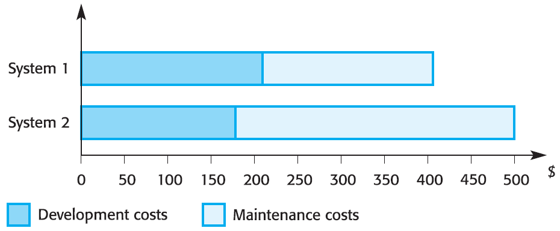
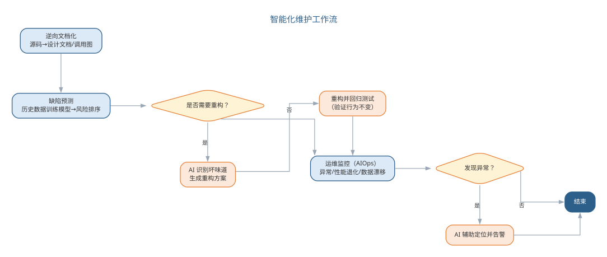
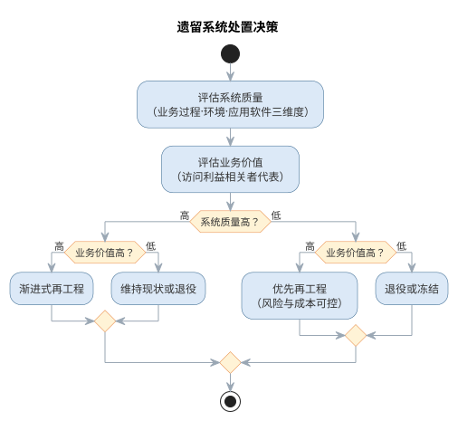
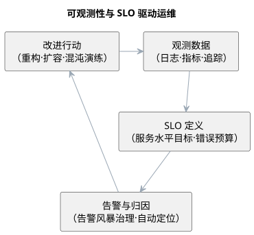

# 软件演化与软件质量

软件变更是不可避免的：新需求不断出现、商业环境持续变化、缺陷需要修复、硬件与支撑软件升级、性能可靠性需要改进。软件演化的关键问题是——**采取适当的策略，有效地实施和管理软件的变更**。

## 软件演化的规律

软件演化是一种循环过程：环境变化产生软件修改，软件修改又继续促进环境变化。Lehman 的软件演化定律揭示了几个重要事实：软件的不断修改会导致软件退化（修改引入新错误、故障率升高）；开发效率与人员数量无关（人员过多会使交流变得困难）；新功能添加会产生新缺陷（往往新版本发布后，下一个版本主要修补缺陷）。

{width=50%}应对演化的策略主要有两种：

- **软件维护**：为修改缺陷或增加功能而对软件进行的局部变更，一般不改变整体结构；
- **软件再工程**：为避免软件退化而对软件的一部分重新设计、编码和测试，提高可维护性与可靠性。

Lehman 的软件演化定律可归纳为下表所示。

| 定律 | 内容 | 工程含义 |
|------|------|------|
| 持续变更 | 系统必须持续演化，否则逐渐不受欢迎 | 软件变更是不可避免的常态 |
| 复杂度增加 | 若不重构，结构复杂度随演化不断上升 | 需要再工程控制退化 |
| 自身调节 | 演化过程趋向自稳定的分布 | 演化的总体趋势可预测 |
| 组织稳定 | 平均工作速率在生命周期内大致不变 | 增加人员并不线性提效 |
| 知识守恒 | 每次发布之间的变更增量大致恒定 | 边际产出递减 |
| 持续增长 | 功能持续增长以维持用户满意 | 需同步控制复杂度增长 |
| 质量下降 | 不做维护则系统质量持续退化 | 及时维护与重构必不可少 |
| 反馈系统 | 演化是多级、多循环的反馈系统 | 用反馈机制控制演化过程 |

## 软件维护

软件维护是软件投入运行后对软件产品进行的修改，分为三类：

- **改正性维护**：修改软件中的缺陷或不足；
- **适应性维护**：修改软件使其适应硬件、操作系统或其他支撑软件的变化；
- **完善性维护**：增加或修改系统功能，使其适应业务变化。

{width=60%}

上述三类之外，广义上还有**预防性维护**——改进可维护性、防止未来退化。维护四类型对比如下表所示。

| 类型 | 内容 | 目的 |
|------|------|------|
| 改正性维护 | 修改软件中的缺陷与不足 | 修正错误 |
| 适应性维护 | 适应硬件、系统软件等支撑环境变化 | 适应环境 |
| 完善性维护 | 增加或修改功能，适应业务变化 | 满足需求 |
| 预防性维护 | 改进可维护性、防止退化 | 预防故障 |

软件维护的成本十分昂贵：业务应用系统的维护费用与开发成本大体相同，嵌入式实时系统则高达开发成本的四倍以上。软件全生命周期总成本由开发成本与维护成本构成，即

$$C_{total}=C_{dev}+C_{maint}$$

其中维护成本 $C_{maint}$ 在总成本中的占比相当可观——这正是"维护费用的高低是衡量系统质量的重要指标"的由来，也说明维护的代价应在设计与开发阶段就加以控制。以业务应用为例，开发与维护的成本构成可直观表示为饼图，如图所示。

{width=70%}

{width=55%}影响维护成本的因素包括：团队稳定性（移交后原开发团队解散）、合同责任（维护合同独立于开发合同，缺少为可维护性而努力的动力）、人员技术水平、程序年龄与结构（结构随年龄增长而破坏）。因此，维护费用的高低是衡量系统质量的重要指标，维护的代价应在设计与开发阶段就加以控制。

**维护预测**通过分析系统与外部环境的关系来预测变更请求的数目（受接口复杂性、易变需求数目、业务过程影响），并依据组件复杂度预测可维护性——控制结构与数据结构越复杂、对象方法模块越大，维护费用越高。

{width=60%}

## 软件再工程与逆向工程

**软件再工程**重新构造或编写现有系统的一部分或全部而不改变其功能，目的是使系统更易维护。其优势在于降低风险（重新开发在用的系统风险很高）与降低成本（再工程比重新开发便宜得多）。

{width=55%}再工程活动包括：源代码转换、逆向工程、程序结构改善、程序模块化与数据再工程。

{width=60%}

**逆向工程**以复原软件的规格说明和设计为目标，弥补缺乏良好文档的问题。开发阶段的文档与维护阶段的文档往往不一致，而对遗留系统的再工程更面临"几乎没有完整描述、业务规则隐藏在软件内部、文档不充分或过时、多年维护后结构破坏"等重重困难。在投入再工程之前，应综合系统质量评估（业务过程、环境、应用软件三个维度）与业务价值评估（访问各利益相关者的代表），决定系统的处置策略。**再工程**与**逆向工程**、**重构**三个概念层次不同，常被混淆，对照如下表所示。

| 概念 | 对象 | 手段 | 目的 |
|------|------|------|------|
| 逆向工程 | 现有系统 | 从代码反向恢复规格与设计 | 理解与文档化 |
| 再工程 | 现有系统 | 重构、转换、模块化与数据再工程 | 提高可维护性 |
| 重构 | 代码内部结构 | 小步改进而不改变外部行为 | 改善结构、降低复杂度 |

## 案例：遗留系统的维护困境

**遗留系统**（legacy system）指仍在运行、但维护成本极高的旧系统。一个典型的场景是：银行存贷款核心业务仍运行在数十年历史的 COBOL 体系上，这是行业中的普遍现实，而非个别现象。这类系统具有典型的共同特征：

- **懂它的人越来越少**：掌握 COBOL 的资深工程师渐次退休，年轻工程师不愿接手，核心知识出现传承断层；
- **文档缺失或过时**：多年修改后文档与代码严重不一致，业务规则只存在于代码与少数人的头脑中；
- **改动如履薄冰**：一次微小修改可能引发连锁故障，影响范围无人能完整说清，回归依赖老师傅的经验。

这类系统维护成本高、风险大，却恰恰最不能停机——银行核心系统一旦停摆，牵动的是海量用户的资金安全。它印证了一个基本论断：**维护是软件生命周期的主战场**，软件总成本的大头花在运行后的维护上，而遗留系统正是这一论断的极端体现。

## 故事：Y2K 全球维护战役

二十世纪七八十年代写下的程序，普遍用**两位数字**保存年份——"99"表示 1999。2000 年临近时，人们猛然意识到：跨过世纪之交，"00"会被程序误读为 1900，日期计算全面错乱，利息、账龄、排程都可能崩溃。这就是**千年虫危机**（Y2K），一场真实的全球性维护战役。

各国为此动员了庞大的维护力量，按四步推进：

- **清查**：扫描全部代码与数据文件，定位日期处理逻辑，建立影响清单；
- **改造**：把两位年份扩为四位，或设计兼容方案，逐模块修改；
- **测试**：用模拟跨世纪的日期数据做全量回归，验证改造正确；
- **过渡**：在千禧年零点监控切换，按计划放行、应急预案待命。

据估计，全球投入的改造成本数以百亿美元计，人力数十万，史无前例；正因为全球协调一致，绝大多数系统平稳跨过千禧年。这个故事说明：**维护的规模可以远超初始开发**，日期这类"边界条件"最易在多年后集中爆发，而**清查—改造—测试—过渡**正是应对大规模遗留改造的经典组织方法。

## 样例：重构还是重写

面对一个难以维护的模块，工程师常纠结于**重构**还是**重写**。这本质是一次风险与收益的权衡，典型决策依据如下表所示。

| 因素 | 倾向重构 | 倾向重写 |
|------|----------|----------|
| 理解程度 | 结构乱但尚能读懂，规则清晰 | 无人真正理解，文档彻底失效 |
| 测试覆盖 | 已有测试可守住行为不变 | 缺少测试，行为无法定义 |
| 业务价值 | 模块稳定运行，价值仍在 | 需求将大变，重写顺应新需求 |
| 风险 | 小步改动，风险可控 | 大范围替换，回归风险高 |

一般认为：**能读懂就重构，读不懂才考虑重写**。而"先补测试再重构"是典型的稳妥流程——先用少量用例锁定现有行为，作为回归基线；再小步重构、每步回归；最后删除临时测试。重写则要警惕**第二次系统的诱惑**：工程师容易把重写当作摆脱历史包袱的机会，大加"改进"而偏离需求，结果是新系统既没兑现预期，又丢失了旧系统多年打磨的边角行为。只有测试缺失、需求剧变、风险可控三者兼备，重写才值得考虑。

## 智能化维护

大语言模型为软件演化带来了前所未有的工具：从源代码**逆向生成**结构化的设计文档与调用图，缓解文档缺失问题；依据历史缺陷数据**预测**缺陷集中的模块，指导测试与维护投入；分析变更请求**评估**其影响范围，辅助变更决策；自动**生成**修复补丁并配合回归测试验证。AI 的逆向工程能力使"重新理解遗留系统"的成本大幅下降，也让再工程的决策建立在更完整的模型之上。

但再工程与废弃高风险遗留系统的决策依然是工程判断：AI 提供的只是"更清楚的现状"，是否值得重构、何时重构、采用何种策略，仍须依据业务价值与系统质量评估做出。软件质量管理的目标——以最低代价获得最高的可维护性与可靠性——在智能化时代并未改变，只是实现手段更加强大。

缺陷预测的质量取决于特征的选择与历史数据的代表性：以模块规模、圈复杂度、变更频率、耦合度等静态与动态特征训练模型，可以比人工经验更早地指出"缺陷高发区"，但预测结果受历史数据分布影响，换一个项目或技术栈可能失效。因此缺陷预测应作为**资源分配的参考**而非**定性的裁决**——它告诉团队把测试与审查资源投向哪里，而不代替工程师判断某个模块是否真的有缺陷。变更影响分析同理：AI 依据调用关系与依赖图估算变更波及范围，能大幅减少"改一处、坏一片"的遗漏，但对语义层面的连锁反应（如接口约定变化导致调用方行为改变）仍需工程师确认。

维护中最昂贵的往往不是"改代码"，而是"读懂代码"。AI 的逆向工程能力——从源码生成设计文档、调用图与行为摘要——把理解遗留系统的门槛大幅降低，使新成员接手、风险评估与再工程规划都建立在更完整的模型之上。但逆向产物的准确性必须抽查验证：AI 总结的"业务规则"若未与领域知识对照，可能把实现细节误读为业务意图。智能维护的四类能力如下表所示。

| 能力 | 做法 | 价值 |
|------|------|------|
| 逆向文档化 | 从源码生成文档、调用图 | 降低理解遗留系统的成本 |
| 缺陷预测 | 用历史数据建模定位缺陷高发区 | 指导测试与维护投入 |
| 变更影响分析 | 依据依赖图估算波及范围 | 减少"改一处、坏一片" |
| 补丁生成 | 自动修复并回归验证 | 加速修复循环 |

智能维护的四类能力共同支撑软件的持续演化，如图所示。

{width=80%}

四类能力的产出都只是"更清楚的现状"，是否重构、何时重构的决策仍需工程判断。

### AI 辅助缺陷定位与修复的工作流

缺陷定位是维护中最耗时的活动之一。AI 辅助定位与修复遵循"证据—假设—验证—修复—回归"的循环：

1. **收集现场证据**：提交缺陷报告、异常堆栈、失败用例与最近变更记录，作为 AI 的输入上下文；
2. **复现与收窄**：让 AI 先最小化复现路径，确定触发条件（输入、状态、环境）——不能复现的缺陷无法定位；
3. **生成根因假设**：AI 依据代码与调用链提出若干根因假设，并为每条假设给出可验证的判据；
4. **人工验证假设**：工程师用断点、日志或最小用例证实或反驳假设，把"AI 的猜测"转为"人证实的根因"；
5. **生成并审查补丁**：对确认的根因，AI 生成补丁并说明改动依据，工程师审查补丁语义与影响面；
6. **回归验证与沉淀**：补丁通过相关测试与全量回归后合入，并把修复场景沉淀为回归用例。

把"先假设后修复"的纪律写进提示词，可以防止 AI 跳过分析直接给补丁：

```text
你是维护工程师，请定位并修复以下缺陷：
缺陷现象：<描述现象，附异常堆栈与失败用例>
相关模块：<模块与关键函数，可贴代码片段>
约束：
- 先输出根因假设表（假设 / 证据 / 验证方法），不要直接给补丁
- 每条假设必须标注"可被哪条证据支持或反驳"
- 确认根因后，输出最小改动补丁并说明改动依据
- 补丁须说明对调用方与边界条件的影响
```

在选型上，缺陷定位依赖"能读到代码与历史"的能力：带代码库检索的对话式工具（如 Cursor、Claude Code）适合跨文件定位与修复，缺陷预测可利用提交历史训练或使用可解释的分析工具——关键约束是工具必须能访问历史缺陷与变更记录，否则预测与定位都缺乏依据。定位与修复与第 10 章测试驱动的缺陷定位共享"假设—验证"循环，区别只在触发源与验证手段。

六步循环的每一步都留下记录——证据、假设、验证结果与补丁。这些记录既用于本次回归，也沉淀为团队的缺陷知识库，使下一次定位更快、更准；缺陷记录的规范性，直接决定 AI 定位与预测的上限。

**变更影响分析**是维护决策的另一个支柱：一次变更的波及范围，决定回归测试投入与发布风险。AI 从变更点出发沿调用链正向列出受影响函数、接口与配置，反向追溯依赖它的模块，再按风险把影响面排序，区分"必改""需回归""需人工确认"三类，如下表所示。对一次接口签名变更，AI 能枚举全部调用方并标出需同步修改的位置，把"改一处、坏一片"的遗漏降到最低。但语义层面的影响——接口约定变化导致调用方行为改变、数据格式迁移影响历史数据——无法仅凭依赖图发现，必须由工程师确认。

| 影响类别 | 判断依据 | 处置 |
|------|------|------|
| 必改 | 直接调用、接口签名变化 | 同步修改并纳入评审 |
| 需回归 | 间接依赖、共享数据结构 | 扩充回归测试范围 |
| 需人工确认 | 语义约定、配置与数据迁移 | 核对业务影响后再放行 |

影响分析的结果应回填到测试计划：扩大回归范围的同时，把高风险调用方加入重点评审清单，形成"预测—定位—修复—回归"的闭环。这个闭环正是第 10 章测试驱动的缺陷定位在维护期的延续，差别只在于维护期的变更往往跨模块、影响面更大，更需要影响分析先行。

缺陷定位与变更影响的典型失败模式如下表所示。

| 失败模式 | 典型表现 | 应对要点 |
|------|------|------|
| 根因泛化 | 只给"错误处理不完整"级结论，无具体证据 | 强制先出假设表，每条标注证据与验证方法 |
| 复现缺失就猜 | 无法复现时仍自信给出结论 | 先最小化复现，复现不了就降级为待查项 |
| 补丁语义错误 | 语法正确但改错语义或引入新缺陷 | 人工审查补丁 + 全量回归 |
| 影响面遗漏 | 只看直接调用，漏掉间接与配置影响 | 结合依赖图核对，区分必改/需回归 |

## 智能化维护实践

智能化维护的典型工作流包括四项：

- **逆向文档化**：让 LLM 从源码与测试生成模块说明、调用图与架构视图，与现有文档比对后存入知识库，逐步补齐遗留系统缺失的文档；
- **缺陷预测与资源调度**：用历史缺陷数据训练预测模型，按风险排序模块清单，把测试与代码评审资源优先投向高风险区；
- **智能重构**：AI 识别重复结构与坏味道，提出重构方案并生成重构后的代码，配合回归测试验证"行为不变"；
- **运维监控（AIOps）**：在运行环境中持续监测异常、性能退化与数据漂移，自动告警并辅助定位，与第 16 章的模型监控衔接。

智能化维护的典型工作流如图所示。

{width=90%}

智能化维护同样遵循"决策在人"的原则：是否重构一个高风险遗留系统，取决于它的业务价值与剩余寿命——对即将被替代的系统再投入重构是浪费，对长期运行的核心系统拖延重构则积累风险。AI 提供的价值是让"现状"更清楚、让重构成本更低，而价值评估与处置策略仍是管理者的责任。

当软件本身包含机器学习模型时，维护的对象从"代码"扩展到"数据与模型"——模型性能随数据漂移而退化，需要持续的监控与重训练，这部分将在第 16 章展开。

一个完整的智能化维护实例如下。线上缺陷报告称"取消订单后优惠券未退回"，工程师把异常堆栈与相关模块 `OrderService.cancel`、`CouponService.release` 交给 AI：

```text
定位"取消订单后优惠券未退回"的根因。
堆栈：<cancel 方法抛出校验异常后事务回滚>
相关模块：OrderService.cancel、CouponService.release
约束：先出假设表（假设/证据/验证方法），确认后给最小补丁。
```

AI 首轮给出三条假设：其一，`release` 在事务之外调用，回滚后未执行；其二，异常发生在 `release` 之前，调用链中断；其三，优惠券状态字段的更新条件不匹配。工程师用日志与断点验证，确认第二条成立——`cancel` 在校验库存时抛出了异常，`release` 从未被调用。把该证据反馈给 AI 后，AI 生成了把 `release` 移到异常处理之外并保证幂等的补丁。人工审查发现，补丁在"重复取消"场景下会重复释放优惠券，于是补上幂等标记；经回归验证后合入，并把"取消后再取消"沉淀为回归用例。该实例还展示了变更影响分析的用途：`release` 并非只有 `cancel` 一处调用方，AI 依据调用链提示需同步回归退款流程，工程师据此扩充了回归范围，避免修复一处、破坏别处。

与人工排查相比，AI 的价值在于快速枚举假设并给出验证路径，把"从哪查起"的成本降到最低；而"用日志证实哪条假设成立"与"补丁的幂等性"仍依赖工程师的判断——AI 出假设、人出证据，是智能化维护的典型分工。

### 智能化维护的要点与误区

智能化维护的常见误区，是过度依赖 AI 的逆向产物而放弃抽查验证，或让缺陷预测替代工程判断。要点与误区如下表所示。

| 误区 | 典型表现 | 应对要点 |
|------|------|------|
| 逆向产物不抽查 | 把实现细节误读为业务意图 | 逆向总结与领域知识对照，抽查验证准确性 |
| 缺陷预测当裁决 | 预测高风险就判"有缺陷" | 预测是资源分配参考，不是定性裁决 |
| 盲目重构遗留系统 | 对将替代的系统投入重构 | 依据业务价值与剩余寿命决定处置策略 |
| 文档补齐后不管 | 知识库与现状再次脱节 | 与代码同步更新，纳入版本管理 |

遗留系统处置决策——综合系统质量与业务价值两个维度——如图所示。

{width=65%}

AI 提供的价值是让"现状"更清楚、让重构成本更低：逆向工程把理解遗留系统的门槛大幅降低，缺陷预测告诉团队把测试与审查资源投向哪里，而是否重构、何时重构、采用何种策略，仍是管理者的责任。

### 前沿演进：可观测性、SRE 与混沌工程

前沿的软件运维以**可观测性**（observability）为基础：通过日志、指标与分布式追踪（OpenTelemetry 统一遥测）三支柱，回答"系统为什么处于当前状态"。**站点可靠性工程**（SRE）以**服务水平目标**（SLO）与错误预算管理风险，把稳定性量化。**混沌工程**主动注入故障（如 Chaos Monkey），验证系统在故障下的韧性。**软件供应链安全**（SBOM、签名与来源验证）则把安全前置到依赖供应链。实践对照如下表所示。

| 实践 | 做法 | 价值 |
|------|------|------|
| 三支柱观测 | 日志+指标+追踪统一接入 | 快速定位根因 |
| SLO 管理 | 目标+错误预算 | 风险量化与取舍 |
| 混沌工程 | 主动故障注入 | 验证韧性 |
| 供应链安全 | SBOM + 签名验证 | 依赖可信 |

可观测性与 SLO 驱动的运维改进环如图所示。

{width=65%}

软件演化到 AI 时代，运维对象从代码扩展到模型与数据（第 16 章），但可观测性的理念一致：只有持续观测、量化目标、主动验证，系统才能被信任——AI 系统尤其需要这种纪律。

## 本章小结

软件演化不可避免，Lehman 定律揭示了持续变更与质量退化的规律。维护四类型与再工程、逆向工程、重构共同构成演化对策，维护成本决定了"可维护性优先"的设计取向。智能化维护让 AI 承担逆向文档化、缺陷预测、补丁生成与变更影响分析，但根因假设须由证据证实、补丁须经审查与全量回归、重构决策依据业务价值——"决策在人"的原则没有变。可观测性、SLO 与混沌工程把稳定性量化并主动验证，AI 系统尤其需要这种纪律，让持续演化的软件始终可信。

**思考与讨论：**
1. AI 给出的缺陷根因假设，工程师应当如何验证？举一个"AI 说错了、但验证流程发现了"的例子。
2. 变更影响分析为什么不能只依赖依赖图？请举一个"结构没变、语义变了"的影响场景。
3. 对一个即将被替代的遗留系统，AI 的逆向文档化还有价值吗？为什么？
