# 大模型应用开发范式

前 10 章中，AI 大多以"助手"形态出现：补全一段代码、生成一组用例、回答一个需求问题。本章把这些能力整合为系统化的开发范式与应用工程，回答两个层层递进的问题：**如何用好大模型**——提示词工程、上下文工程与 RAG、智能体与人机协同，把"人与模型的交互"打磨到可靠、可控；**如何把大模型应用系统化地开发运维**——应用架构、模型选型与路由、RAG 工程化、评测与治理，让模型从"能调通的 API"升级为"能上线并长期运行的系统"。全章从提示词工程出发，经上下文工程、智能体与人机协同的"单点开发范式"，推进到 LLM 应用系统工程的"规模化应用与治理"。在这一递进中，工程师的角色从"逐行写代码"转变为"定义问题、编排工具、审查验证"，软件开发的效率与质量瓶颈也随之转移。

## 提示词工程

提示词（prompt）是与大语言模型交互的指令。提示词工程研究如何构造提示词以获得可靠、正确的输出，是智能开发范式的接口层。高质量的提示词通常包含：

- **上下文**：背景信息与约束，让模型在正确的场景中理解任务；
- **角色**：明确模型扮演的角色（如"资深软件架构师"），激活对应的知识组织方式；
- **指令**：清晰无歧义的任务描述，给出输出格式与边界（如"只返回 JSON"）；
- **示例**：少样本（few-shot）提示，给出一两个输入输出对，让模型模仿期望的模式；
- **推理引导**：思维链（CoT）让模型"一步一步思考"，显著提升复杂推理与逻辑类任务的正确率。

提示词本身是值得版本管理的资产：企业会沉淀提示词库，记录版本、适用场景与效果评测（如生成的代码能否通过测试），并随模型升级持续调优。提示词的评测应结合自动化指标与人在回路的判断——BLEU 等指标难以反映代码的可维护性与正确性。高质量提示词的五个要素如下表所示。

| 要素 | 作用 | 示例 |
|------|------|------|
| 上下文 | 提供背景信息与约束 | 项目语言、框架、相关代码 |
| 角色 | 激活对应的知识组织方式 | "资深软件架构师" |
| 指令 | 明确任务与输出格式 | "只返回 JSON" |
| 示例 | 少样本示范期望模式 | 一两个输入输出对 |
| 推理引导 | 让模型一步一步思考 | 思维链"step by step" |

高质量提示词通常由五个要素构成，如图所示。

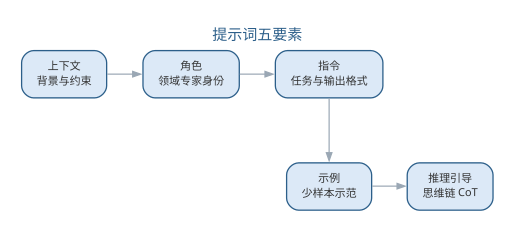{width=90%}

五个要素共同提高输出可靠度——上下文让模型在正确的场景理解任务，示例与推理引导则约束输出模式。

提示词的规模直接决定调用成本：对一次模型调用，输入 Token 与输出 Token 分别按不同单价计量，总成本为

$$C=c_{in}\cdot n_{in}+c_{out}\cdot n_{out}$$

其中 $c_{in}$、$c_{out}$ 分别为输入、输出 Token 单价，$n_{in}$、$n_{out}$ 为对应的 Token 数量。在提示词版本化时记录 Token 用量，是成本治理与效果对比的基础。

### 提示词模板体系

在实践中，团队通常把提示词组织为**分层模板体系**：基础模板沉淀通用规则，场景模板针对具体任务，评审模板用于质量把关。三层模板分层复用，任何一层都可单独版本化与评测。以"代码生成"这一场景为例：

```text
【基础模板：通用规则】
- 角色：你是本项目资深工程师，遵循团队编码规范（命名、注释、结构）
- 原则：先说明意图与约束，再给实现；单入口单出口；优先使用标准库
- 输出：先输出实现代码，再输出 100 字以内自检说明

【场景模板：函数生成】
请在【基础模板】之上完成：
- 输入函数签名与需求：{函数签名} {需求说明}
- 约束：{非法输入处理} {边界条件}
- 要求：符合规范；异常路径显式处理

【评审模板：质量把关】
请以审查者视角评审以下 AI 生成代码：
- 规范符合性：命名、注释、结构是否达标
- 正确性：边界与异常路径是否处理
- 可维护性：是否引入不必要的抽象
- 结论：通过 / 需修改（并列出具体条目）
```

三层模板的分工与要点如下表所示。

| 层级 | 用途 | 示例要素 |
|------|------|------|
| 基础模板 | 沉淀通用规则与角色 | 编码规范、输出约束 |
| 场景模板 | 面向具体任务组装参数 | 签名、需求、边界条件 |
| 评审模板 | 对照标准审查产物 | 规范、正确性、可维护性 |

分层的好处在于**复用与演进**：规范更新只需改基础模板，新增任务只需扩展场景模板，质量把关统一走评审模板；每个模板版本都可评测，改动的效果可回归对比。模板的变量约定也应统一：以花括号括起必须替换的变量并给出缺省说明，避免模型把变量当作字面量；模板变更走版本管理并记录 Token 用量，与前述成本公式衔接。提示词由此从"一次性写好的文字"升级为"可管理、可评测的工程资产"，分层模板体系的注册、版本化与回归评测将在本章后续进一步深化。

使用上，团队通常"先选模板再填参数"：任务到达后先判断所属场景，套用场景模板并替换变量，再以评审模板对输出把关；对高频场景，把成熟模板沉淀为团队提示词库，随模型升级与效果评测持续调优。模板评测也应有统一口径——在同一输入集合上比较不同模板版本，以"能否通过测试与评审"而非主观观感判断优劣。

提示词工程同样存在失败模式，值得在模板设计中预防：

| 失败模式 | 表现 | 对策 |
|------|------|------|
| 指令歧义 | 同一指令被不同解读 | 明确任务与输出格式 |
| 幻觉 | 生成看似合理实则错误的内容 | 要求引用来源并交付前验证 |
| 上下文遗漏 | 关键约束未进入提示词 | 用检查清单核对上下文要素 |
| 格式漂移 | 输出格式随输入不稳定 | 强约束输出格式并给示例 |

四种失败模式大多可归结为"要素不齐"——上下文、角色、指令、示例或推理引导缺项，是提示词失效最常见的根因。对失败模式的持续观测同样重要：团队应把提示词的失效案例记录进提示词库，作为模板迭代与评测的依据。

## 上下文工程与 RAG

LLM 的知识有截止时间且难以注入私有信息，**检索增强生成（RAG）**成为企业知识库问答与代码辅助的主流方案：先从文档或代码库中检索相关内容，再把它作为上下文拼入提示词，让模型"在上下文内作答"。RAG 的关键工程点包括：

- **分块**：把文档切成语义完整的块，块大小与重叠策略影响检索质量；
- **向量检索**：把文本编码为向量，用近似最近邻搜索找到语义相近的内容，常配合关键词检索构成混合检索；
- **融合与重排**：多路检索结果融合并重排，提高送入模型的上下文质量；
- **上下文预算**：受 Token 限制，需对检索结果压缩取舍，把"最相关的"而非"尽量多的"放入提示词。

RAG 的完整架构如图所示。

{width=80%}

RAG 由此演化为**上下文工程**：围绕如何组织、选择、压缩上下文来控制系统行为。在编码助手中，检索到的相关 API 文档、历史代码与项目规范能让补全与生成更贴合项目实际，显著提升采纳率。RAG 的关键工程点及其影响如下表所示。

| 工程点 | 做法 | 影响 |
|------|------|------|
| 分块 | 把文档切成语义完整的块 | 块大小与重叠策略影响检索质量 |
| 向量检索 | 编码为向量做近似最近邻搜索 | 常配合关键词构成混合检索 |
| 融合与重排 | 多路检索结果融合并重排 | 提高送入模型的上下文质量 |
| 上下文预算 | 受 Token 限制压缩取舍 | 放"最相关的"而非"尽量多的" |

检索质量可用**召回率@k**（Recall@k）度量：对每个查询，记其检索结果中前 $k$ 条结果的集合为 $R_k$、全部相关文档集合为 $G$，则

$$Recall@k=\frac{|R_k\cap G|}{|G|}$$

检索的初衷是"召回相关、抑制噪声"——相关文档进入上下文的比例越高，生成越可能有据可依。上下文预算的取舍过程如图所示。

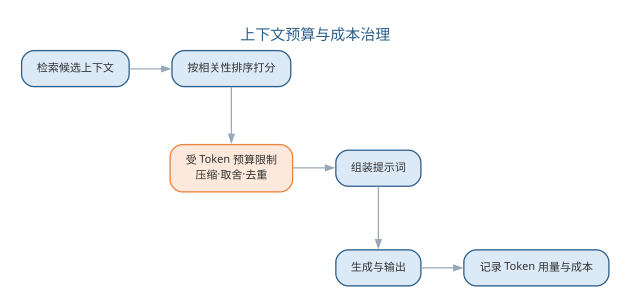{width=85%}

上下文工程按"相关性排序—压缩取舍—组装生成"的流程，在 Token 预算内最大化信息密度。RAG 的常用检索质量指标可归纳如下表所示。

| 指标 | 含义 | 关注点 |
|------|------|------|
| Recall@k | 前 k 条中相关文档数占全部相关文档的比例 | 相关文档是否被召回 |
| Precision@k | 前 k 条中相关文档数占 k 的比例 | 结果中噪声是否过大 |
| Hit@k | 前 k 条是否至少含一条相关文档 | 用户能否找到所需信息 |
| MRR | 首个相关文档排名倒数的期望 | 首个命中是否靠前 |

一个完整的 RAG 评测实例如下。需求是改进内部知识库问答系统的检索环节，工程师先构造一份评测问题集：每个问题标注知识库中与之相关的文档集合，再让检索系统对每个查询返回前 5 条结果，人工核对命中情况后计算指标。以其中一个查询"如何配置网关的跨域请求"为例，假设标注的相关文档共 3 篇，检索系统在 top-5 中召回了其中 2 篇，首个相关文档排在第 2 位，则 Recall@5=2/3、MRR=1/2——说明相关文档基本被召回，但首个命中不够靠前，用户仍要向下翻一条才能找到答案。

把评测结论与改进动作对应起来，可归纳为如下诊断表：

| 指标现象 | 可能根因 | 改进动作 |
|------|------|------|
| Recall@k 偏低 | 相关文档未被召回 | 调整分块策略、加入关键词混合检索 |
| Precision@k 偏低 | 结果中噪声过大 | 引入重排（rerank）、收紧过滤 |
| MRR 偏低 | 首个命中靠后 | 重排前置、优化排序逻辑 |

本例中 MRR 偏低的改进动作，就是把"重排"环节补上，让首个命中尽量前移。与人工流程相比，人工逐一浏览全文核对相关性的做法在数据规模上不可持续；评测集批量计算指标不仅高效，还能随评测集扩充持续回归——每次改动分块、检索或重排策略后重跑评测，指标的涨落即可量化改进效果，检索质量评测由此成为 RAG 迭代的"标尺"。

RAG 与上下文工程的局限同样明确：检索质量决定上下文质量，上下文再长也无法补偿不相关的输入；上下文规模直接决定 Token 成本（见本章成本公式），需在质量与成本之间权衡。评测问题集的质量也决定评测的可信度，构建时应覆盖高频业务场景并标注相关文档，标注以人工为主、AI 辅助预标后再人工复核。RAG 工程化的更多细节——分块策略、混合检索与重排——将在本章后续深入展开。

## LLM 智能体

智能体（Agent）是能够自主调用工具、执行多步任务的 LLM 程序，其核心能力可归纳为三大范式：

- **工具调用**：模型根据任务选择并调用外部工具（执行命令、查数据库、调 API、读文件），把"思考"扩展为"行动"；
- **规划**：把复杂任务分解为子步骤，逐步执行并根据中间结果调整计划；
- **反馈学习**：通过执行结果的反馈（编译错误、测试失败、评审意见）迭代修正。

在软件工程中，**代码智能体**通常运行"生成—审查—修复"循环：一个"程序员"智能体生成代码，一个"审查者"智能体模拟代码评审指出缺陷，循环直至通过静态检查与测试。多智能体协作框架进一步让不同角色的智能体（需求分析师、架构师、测试员）协作完成端到端任务：

| 框架 | 协作模型 | 特点 |
|------|------|------|
| AutoGen | 对话式多智能体 | 灵活的角色对话与编排 |
| CrewAI | 角色化协作 | 面向角色的任务派发 |
| LangGraph | 图式状态机 | 显式流程控制，适合确定性流水线 |

多智能体协作的消息协议、编排拓扑，以及智能体的评测与安全治理（沙箱基准、轨迹评估、越狱与提示注入防护），将在第 12 章（智能体系统工程）系统展开，本章先建立智能体的基本概念。从单智能体到多智能体的演进中，验证的对象也从"单点输出"扩展为"整条链路"，二者的差异如下表所示。

| 维度 | 单智能体 | 多智能体 |
|------|------|------|
| 任务 | 端到端完成单任务 | 跨角色协作完成端到端任务 |
| 协作 | 自规划、自执行 | 角色分工、消息交接 |
| 验证 | 单点输出把关 | 轨迹审计、全链路验证 |
| 失败放大 | 单点错误 | 错误跨角色传播放大 |

智能体把"AI 辅助编码"推向"AI 主导执行"，但**验证仍是瓶颈**：智能体的输出必须经过静态检查、单元测试与人工评审才能进入基线，否则错误会被快速放大。

代码智能体的"生成—审查—修复"循环如图所示。

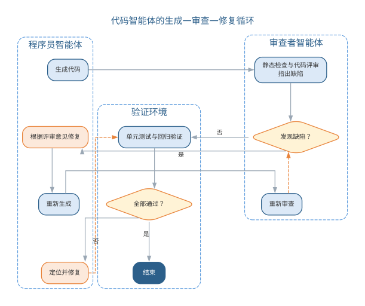{width=65%}

智能体与 LLM、外部工具的一次交互时序如图所示。

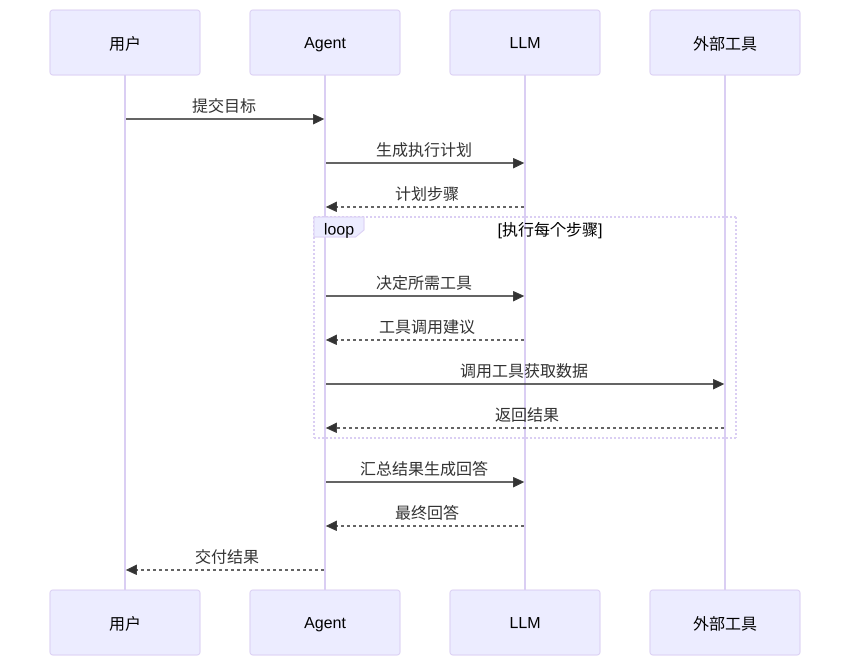{width=70%}

智能体的运行过程可建模为状态机，其状态转移如图所示。

{width=75%}

智能体的能力边界同样清晰：它擅长"多步执行既定流程"，但在目标模糊、跨领域判断与责任认定上仍依赖人。团队引入智能体的稳妥路径是：先以低风险、流程明确的子任务试点，配齐可观测轨迹与回滚手段，再逐步扩大自主范围——这一治理思路将在第 12 章（智能体系统工程）系统化。

## 人机协同开发范式

人机协同的交互方式分布在一个从"完全委托"到"专家咨询"的谱系上：

| 交互模态 | 人的角色 | AI 的角色 | 适用场景 |
|------|------|------|------|
| 完全委托 | 描述意图、验收 | 端到端开发 | 低风险原型、脚手架 |
| 引导委托 | 设定边界、逐步把关 | 执行子任务 | 中等复杂任务 |
| 结对协作 | 逐行审查、实时纠偏 | 补全、重构建议 | 核心业务代码 |
| 专家咨询 | 亲自编写 | 答疑、片段建议 | 复杂疑难场景 |

谱系越靠右，人的控制越强、效率提升越有限，但质量越可控——**风险越高越应靠右**。实证研究表明：AI 辅助可将任务完成时间中位数缩短约三成，但单纯依赖 AI 并不改善长期质量；真正带来质量提升的是配套的过程基础设施——审查、测试与验证。因此工程师的新角色被概括为**代码策展**（code curator）：阅读、评估、整合 AI 生成的代码，代码评审成为新的质量瓶颈与核心技能。

近期的 **Vibe coding** 与 agentic 开发更进一步：用自然语言指令让智能体管线端到端搭建项目（目录结构、接口、测试、CI/CD 配置）。它极大降低原型门槛，但也带来幻觉、技术债与技能萎缩等新问题——低风险快速原型是它的理想舞台，生产系统仍需传统工程纪律兜底。工程师的代码策展角色——阅读、评估、整合 AI 生成的代码——流程如图所示。

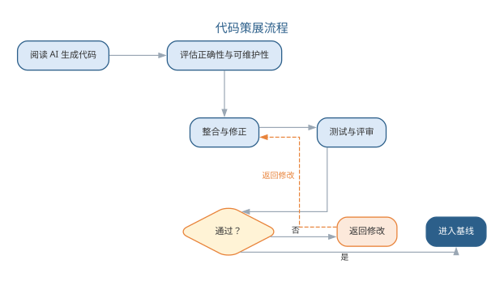{width=80%}

策展意味着 AI 产出的每一段代码都要经过人工评估与验证才能进入基线，代码评审因此成为新的质量瓶颈与核心技能。

## 智能体的质量、安全与治理

AI 生成的软件同样需要质量与治理框架：

- **评测**：AI 生成代码应以"能否通过测试"与人工评审为最终标准，辅以静态分析指标；对智能体的评测需要专门的基准与标准化流程；
- **幻觉与技术债**：模型可能生成看似合理实则错误的代码，自动生成的系统常积累难以维护的"生成债"，需要持续重构与人工把关；
- **安全与合规**：生成的代码可能引入漏洞（注入、权限绕过等），提示词与上下文可能泄露敏感数据，需在流水线中加入安全扫描与隐私检查；
- **可追溯与责任**：AI 生成的内容应记录来源（模型、提示词、版本），形成可审计的链路；发生事故时责任可追溯，最终由使用与部署 AI 的人负责——正如第 9 章（软件工程工具、实践与伦理）所述，AI 增强的是能力，判断与责任始终属于人。

智能体应用的质量与治理要求如图所示。

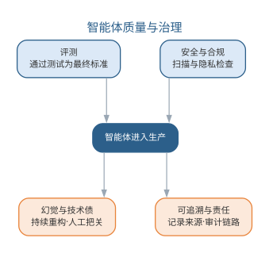{width=65%}

评测、幻觉防治、安全合规与可追溯四道防线共同决定智能体能否进入生产。

### 智能体应用的常见误区与治理

智能体把"AI 辅助编码"推向"AI 主导执行"，也把风险从"单点生成"放大为"链路执行"。人机协同的交互谱系提醒我们：风险越高越应靠右，越需要人的控制，如图所示。

{width=90%}

智能体应用的主要风险与治理措施如下表所示。

| 风险 | 表现 | 治理措施 |
|------|------|------|
| 错误放大 | 智能体错误被快速传播到多处 | 输出须经静态检查、测试与人工评审 |
| 幻觉与技术债 | 看似合理的错误代码积累"生成债" | 持续重构，评测以"能否通过测试"为准 |
| 安全与合规 | 生成代码引入漏洞、上下文泄露敏感数据 | 流水线加入安全扫描与隐私检查 |
| 责任不清 | 事故无法追溯 | 记录来源（模型、提示词、版本），责任可审计 |

AI 生成的内容应记录来源，形成可审计的链路；发生事故时责任可追溯，最终由使用与部署 AI 的人负责。AI 增强的是能力，判断与责任始终属于人。

### 前沿演进：多智能体系统与协作范式

前沿的智能体实践从单个智能体走向**多智能体系统**：不同角色的智能体（需求分析师、架构师、程序员、测试员）通过协作协议分工执行端到端任务。编排框架（AutoGen 对话式、CrewAI 角色化、LangGraph 图式状态机）提供不同的协作模型；**智能体可观测性**（轨迹、工具调用、中间产物记录）与治理成为落地关键。AI 编码智能体（如 SWE-agent、Devin）以真实任务为评测基准，推动"智能体能否独立完成软件工程任务"的能力评估。工程实践清单如下表所示。

| 实践 | 说明 | 关键点 |
|------|------|------|
| 角色分工 | 按角色拆解智能体 | 职责清晰、边界明确 |
| 协作协议 | 定义消息与交接 | 可追踪、可恢复 |
| 可观测性 | 记录轨迹与中间产物 | 可审计、可调试 |
| 评测基准 | 真实任务集评估 | 能力量化 |

多智能体协作编排——从需求到交付的跨角色流程——如图所示。

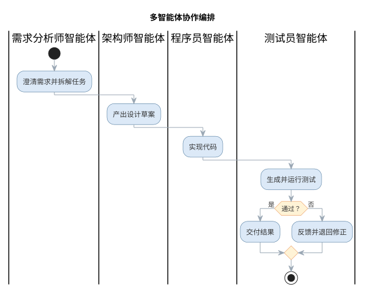{width=65%}

多智能体把"AI 主导执行"推进到"AI 团队协作"，也让验证从"单点"扩展到"链路"：任何环节的错误都可能被放大，因此轨迹可观测、输出可审计、人机交接点清晰，是智能体进入生产的前提——这也是全书"人机协同、验证优先"信念在最新前沿的体现。

以上各节把提示词、上下文工程与智能体整合为单点上的开发范式，回答"如何用好大模型"；人机协同与智能体质量治理则提醒我们，能力越强越要验证、风险越高越应靠右。当模型作为系统的核心部件进入生产，问题随之升级为"如何把模型能力系统化地开发、上线并长期运维"——这正是 LLM 应用工程要回答的问题。本章接下来以架构模式为起点，依次讨论模型选型与路由、RAG 工程化、提示词与上下文工程深化、评测与质量保障、可观测性与成本治理，并以要点与误区、前沿演进收尾；智能体的运行时与多智能体系统则在第 12 章（智能体系统工程）展开。LLM 应用工程的目标，是把"能调通一个模型"升级为"能上线并长期运行一个系统"。

## LLM 应用系统的架构模式

**LLM 应用（LLM application）**是以大语言模型为智能内核的软件系统：它接收用户的自然语言输入，把任务转化为模型调用，再把生成结果经加工后返回。与普通软件把逻辑写在确定性代码里不同，LLM 应用把"智能"外置于模型调用——同样的输入可能得到不同的输出，系统的行为由提示词与上下文共同决定。按生成逻辑的组织方式，LLM 应用可归纳为四种架构形态：

| 形态 | 结构 | 适用场景 | 关键问题 |
|------|------|----------|----------|
| 单次调用 | 一次请求→一次生成 | 摘要、翻译、分类 | 提示词质量决定输出 |
| 管道编排 | 多步 LLM 调用串联 | 文档处理、信息抽取 | 步骤间错误传递 |
| RAG 增强 | 检索 + 生成 | 知识问答、代码助手 | 检索质量决定上限 |
| 智能体外壳 | LLM + 工具 + 执行循环 | 复杂任务端到端 | 验证与责任归属 |

与传统三层架构（表示层、业务逻辑层、数据层）以"确定性的处理流程"为中心相比，LLM 应用把生成逻辑委托给模型，两者有三点本质差异：

- **状态由用户与上下文承载**：传统应用把状态存于服务端会话或数据库；LLM 应用几乎无内部状态，对话历史、检索结果与约束都放进提示词，由用户或编排层携带——状态管理因此变成上下文管理；
- **输出非确定**：同一输入在不同模型、不同温度、不同版本下输出可能不同，"同样的代码每次行为一致"的假设不再成立，质量必须靠评测与护栏来稳定；
- **成本随 Token 变化**：传统应用成本主要由固定部署决定；LLM 应用每次调用的成本随输入输出 Token 数浮动，治理对象从"资源"变成"Token"。

三者的差异可对照总结如下表所示。

| 对比维度 | 传统三层架构 | LLM 应用 |
|------|------|------|
| 处理中心 | 确定性的业务逻辑 | 模型生成 + 上下文组织 |
| 状态承载 | 服务端会话与数据库 | 用户与上下文携带 |
| 输出行为 | 输入相同则输出相同 | 非确定，依赖温度与版本 |
| 成本模型 | 固定部署成本 | 随 Token 数与模型档位浮动 |
| 测试方式 | 单元测试断言确定结果 | 评测集 + 指标 + 门禁 |

四种形态并非互相排斥，而是层层递进：单次调用最简单，管道把多步生成串联起来，RAG 引入外部知识，智能体外壳再叠加工具与执行循环。选型的原则是从简单开始——能单次调用解决的不引入管道，能检索解决的不引入智能体；复杂度只在该处确有收益时才增加，每加一层都意味着多一处需要评测与维护。

LLM 应用的分层架构如图所示。

{width=85%}

**上下文窗口（context window）**是模型一次能容纳的输入 Token 上限。状态管理必须服从窗口约束：能放进上下文的只是"当前任务最相关"的部分，其余历史以摘要、检索结果或外部存储保留。这一约束把"如何组织上下文"从优化项提升为架构设计的一部分。智能体外壳形态的运行时、工具协议与多智能体协作将在第 12 章（智能体系统工程）详细展开。

## 模型选型、调用与路由治理

模型是 LLM 应用的智能底座，选型决定能力上限。**模型选型（model selection）**需同时考察能力、成本与安全，常用维度如下表所示。

| 维度 | 考察内容 | 评估方式 |
|------|----------|----------|
| 任务能力 | 推理、代码、多语言 | 基准测试 + 业务样例试跑 |
| 成本 | Token 单价、延迟 | 按调用量估算 |
| 开源/闭源 | 可自托管、可审计 vs 托管服务 | 数据合规、部署条件 |
| 安全与合规 | 越狱抵抗、敏感信息、隐私 | 红队测试 + 合规审查 |
| 生态与稳定性 | 版本演进、服务可用性 | 服务协议、版本记录 |

开源模型可自托管、便于审计与二次训练，但部署与运维成本高；闭源模型开箱即用、迭代快，但数据要出域、行为可控性弱。选型不是"越强越好"，而是结合任务难度、成本预算与数据合规综合决策。能力评估应结合业务样例试跑而非只看公开榜单：把核心业务场景做成小评测集，让候选模型各跑一遍，观察输出是否符合真实约束；试跑结果存档，作为后续模型升级时的回归基线。

**多模型路由（routing）**是成本治理的关键手段：把请求按任务难度、质量要求与成本预算分派给不同模型——简单任务用轻量模型，复杂推理用高能力模型，知识类任务优先走检索。路由决策过程如图所示。

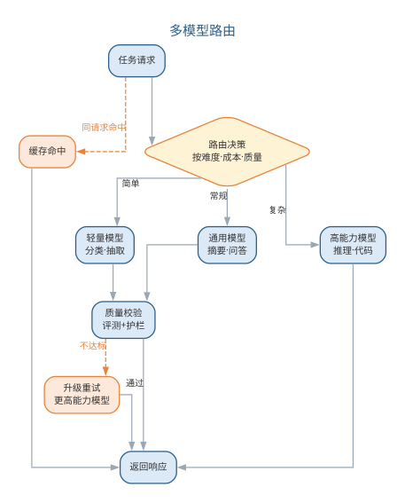{width=55%}

路由的收益来自"按需付费"：真实场景中多数请求是分类、抽取、摘要等常规任务，高能力模型并非每次都必要。路由判定可交给规则（按任务类型、预算上限），也可由轻量模型承担。路由的判定提示词模板如下：

```text
你是任务调度器，根据难度与预算把请求分派给合适的模型：
- 简单任务（分类/抽取/格式化）：model-light，优先走缓存
- 常规任务（摘要/改写/问答）：model-medium
- 复杂任务（推理/多步规划/代码）：model-high
请求：{{任务描述}}
预算上限：{{单次成本上限}}
只输出 { "route": "model-xxx", "reason": "一句理由" }
```

路由策略的取舍如下表所示。

| 策略 | 判定方式 | 适用场景 | 特点 |
|------|----------|----------|------|
| 规则路由 | 按任务类型、预算阈值 | 任务类型稳定 | 确定、可解释、易维护 |
| 缓存优先 | 命中相同或相似请求 | 重复查询占比高 | 零成本、延迟低 |
| 模型路由 | 由轻量模型判定难度 | 任务类型模糊多变 | 灵活，但多一次调用 |

**缓存与配额**控制调用量与重复成本：语义相同或完全相同的请求命中缓存可免去重复生成；按用户、租户或团队设置配额与限流，防止个别调用失控。**降级与熔断**保证可用性：模型服务超时或异常时按预案降级（走缓存兜底、退回较低能力模型、返回预设提示语），连续失败触发熔断，暂停对上游的调用并快速失败。Token 成本治理的总体思路是缓存降重复、路由降单价、压缩降 Token 量，计量基础仍是前文提示词工程中的 Token 成本公式 $C=c_{in}\cdot n_{in}+c_{out}\cdot n_{out}$；成本数据如何监控与回流将在后文结合可观测性展开。

## RAG 应用工程化

前文上下文工程与 RAG 一节介绍了 RAG 的概念层（分块、向量检索、融合与重排、上下文预算）。当 RAG 进入生产，这些概念每一项都变成需要量化的工程决策，本节深化其工程化要点。

**分块（chunking）**把长文档切成可供检索的片段，是检索质量的起点。分块策略的选择如下表所示。

| 策略 | 做法 | 适用场景 | 注意 |
|------|------|----------|------|
| 固定大小 | 按固定字数切分 + 重叠 | 通用文档 | 易切断语义 |
| 结构分块 | 按标题、章节切分 | 规范、手册 | 依赖文档结构 |
| 语义分块 | 按语义完整度切分 | 混合型文档 | 计算成本较高 |

块太小则上下文碎片化、召回不全，块太大则噪声多、占用 Token 预算。**重叠（overlap）**让相邻块共享边界信息，缓解切断语义的问题；实践中常结合结构分块与固定大小，兼顾语义完整与索引可控。块的元数据（来源文档、章节路径、版本）应随块一并入库，便于溯源与失效处理。

**混合检索（hybrid retrieval）**同时使用向量检索（语义相近）与关键词检索（精确匹配），再**融合与重排（rerank）**：先由两种方式各取若干候选，再由重排模型对候选按与查询的相关性重新排序，把最相关且去重的若干条送入上下文。重排能显著改善"向量近但语义偏"的误召回，是工程化的常规环节。向量与关键词互补的原因在于两者捕获的信号不同：向量编码"意思相近"，适合语义匹配与同义改写；关键词擅长精确术语——型号、编号、代码标识符与专有名词这类内容向量检索往往记不牢，关键词检索则一次命中。

索引的构建与更新是持续性的：**索引构建**对增量文档做"清洗→分块→向量化→入库"，需去重并失效旧版本；**增量更新**避免每次全量重建，配合文档版本号保证索引与源一致。RAG 工程化的完整流水线如图所示。

{width=65%}

检索质量的量化延续前文：Recall@k 衡量相关文档是否被召回，MRR 衡量首个相关结果是否靠前。重排阶段更常用 **NDCG**（归一化折损累计增益）：它按相关性等级给排序靠前的结果更高权重，并按理想排序归一化，能区分"相关文档都被召回但顺序不对"与"顺序正确"两种情形。评测应覆盖离线指标（在带标注的检索集上计算）与在线观察（用户点击、采纳、追问等），两者结合才能避免"离线很好、线上无效"。检索评测的样例通常组织为"查询—相关文档—期望排序"三元组：离线指标在标注集上计算，可重复、可回归；在线观察则记录点击、采纳与追问，共同回答"检索到底有没有用"。增量更新的常见做法是定时或事件触发：比对文档版本号，只对新文档做清洗、分块与向量化入库，同时删除失效片段并重建对应索引。索引与源文档的版本一致是检索可信的前提，否则会出现"文档明明更新了，系统还在答旧内容"——这类一致性问题要靠版本号与审计记录来保证。

## 提示词与上下文工程深化

前文提示词工程中的提示词五要素是单次交互的指南；生产环境还需要**提示词体系**——把散落的提示词组织为可维护、可版本化的资产。常用体系分层如下表所示。

| 层级 | 内容 | 示例 | 管理方式 |
|------|------|------|----------|
| 基础模板 | 角色、输出格式等通用骨架 | "你是资深工程师…只输出 JSON" | 全应用共用 |
| 场景模板 | 绑定具体任务的变体 | 需求分析、缺陷定位提示词 | 按场景注册 |
| 版本记录 | 变更、生效时间与效果 | v1.2 增加自检要求 | 版本化 + 评测回归 |

**模板注册与变量**是体系化的抓手：模板用 {{变量}} 占位符参数化（任务描述、检索上下文、业务约束），存入模板库登记版本与适用场景；运行时由编排层填充变量，而非每次手工拼写。模板的版本与评测结果在注册表中留存，某场景模板回退时可快速切换旧版本；新场景尽量从既有模板派生，减少从零编写。一个带占位符的场景模板如下：

```text
你是本业务的{{角色}}，请基于以下上下文完成任务：
上下文：{{检索到的相关内容}}
任务：{{任务描述}}
约束：{{格式与边界要求}}
要求：只使用上下文中的信息作答；不确定时明确说明；按格式输出。
```

**上下文压缩与结构化**解决窗口有限与信息密度两大问题：

- **摘要**（summarization）：把过长历史或文档压缩成要点，保留关键信息腾出预算；
- **剪枝**（pruning）：按相关性与时间剔除低价值内容，只保留任务所需片段；
- **结构化输出**：用 JSON Schema 等约束输出格式，把自由文本固化为程序可用的结构。

三种手段的取舍如下表所示。

| 手段 | 做法 | 主要代价 | 典型适用 |
|------|------|----------|----------|
| 摘要 | 压缩为要点 | 丢失细节 | 长对话历史 |
| 剪枝 | 剔除低价值片段 | 可能误删信息 | 检索结果取舍 |
| 结构化输出 | 约束输出格式 | 需维护 Schema | 程序对接下游 |

压缩的对象既包括对话历史，也包括检索结果与长文档；选择哪种手段，取决于"信息密度"与"完整性"之间的平衡——摘要换取空间，剪枝换取聚焦，结构化换取可用。

上下文压缩的摘要提示词如下：

```text
请把以下对话压缩为 200 字以内的摘要，保留：已确认的需求、
尚未解决的问题、下一步动作。不得新增对话中不存在的信息。
对话记录：{{对话历史}}
```

**上下文版本管理与评测回归**是治理层：提示词、检索配置与压缩策略都是系统行为的一部分，改动任何一项都应登记版本，并用评测集回归（见下节），防止"模型升级或提示词微调导致行为漂移"。上下文工程把"提示词"从一次性文本升级为受控资产，这正是前文"上下文组织能力成为核心技能"的落地。提示词体系的建设通常从"沉淀"开始：先记录每次有效修改的原因与效果，再抽象为模板与变量；体系化不是为了流程而流程，而是让"这次为什么改提示词"有据可查、可复现。

## LLM 应用的评测与质量保障

LLM 应用质量的核心难题是"没有确定的期望输出"。**评测集（evaluation set）**因此成为质量基准：一组覆盖业务场景、带期望答案或评分标准的输入，用来系统性检验系统行为。模型能力评测已在第 10 章（AI 系统工程与 MLOps）讨论，本章聚焦应用层评测。评测集构建的三个要点：

- **覆盖业务场景**：按用户真实使用路径抽样，含主流程与边界情形，避免只在"顺手样本"上评测；
- **难度分层**：把样本按简单、中等、困难分层，既能看整体水平，也能定位薄弱环节；
- **防污染**：评测样本不得出现在模型的训练数据与检索库中，否则结果虚高——评测集要版本化、独立维护，定期补充线上新问题。

评测集的规模视业务复杂度而定，关键是覆盖与分层而非数量；它应随线上问题沉淀而持续增长，并定期抽样人工复核标注质量，防止标注本身引入偏差。

**多维指标**衡量不同维度的质量，如下表所示。

| 指标 | 关注点 | 常用做法 |
|------|--------|----------|
| 事实性（factuality） | 输出与事实是否一致 | 与权威来源核对 |
| 忠实度（faithfulness） | 输出是否忠于给定上下文 | 检查是否超出上下文作答 |
| 相关性（relevance） | 是否回答用户所问 | 人工或模型打分 |
| 安全性（safety） | 是否输出有害内容 | 红队测试 + 护栏 |

忠实度与事实性方向不同：忠实度管"不编造上下文之外的东西"，事实性管"不输出与事实相悖的内容"。对开放性任务，常用**裁判模型（LLM-as-judge）**按评分标准打分，但裁判本身也有偏好，需抽样人工复核校准。裁判评分还需缓解位置偏差与长度偏差（倾向先出现或更长的答案），可通过打乱候选顺序、多次采样取众数等方式抑制。裁判评测提示词模板如下：

```text
你是评测员，请按以下标准为回答打分（1-5）：
- 忠实度：是否只使用给定上下文的信息
- 相关性：是否准确回答用户问题
- 完整性：关键信息是否缺失
上下文：{{检索内容}}
问题：{{用户提问}}
回答：{{系统输出}}
输出 JSON：{ "faithfulness": 分数, "relevance": 分数, "comment": "评语" }
```

**基准与红队测试**补充边界视角：基准（benchmark）用公开或自建任务集横向对比模型与系统版本；红队（red team）主动构造对抗样本（越狱、提示注入、误导性提问）检验安全底线。**输出护栏（guardrail）**在生成前后加闸：内容过滤拦截有害、敏感输出，敏感信息检测防止泄露隐私，格式约束保证输出可被下游解析，护栏失败时走兜底回复。评测的执行应自动化并纳入发布流程：评测集→批量执行→指标计算→对比基线→门禁判定→发布或回滚，任何指标回退都阻断发布，使"评测即回归测试"从口号变成工程事实。护栏分三层布设，如下表所示。

| 布设层 | 拦截对象 | 失败处理 |
|--------|----------|----------|
| 输入端 | 提示注入、恶意指令 | 拒绝或改写后进入 |
| 输出端 | 有害、违规内容 | 拦截并走兜底回复 |
| 业务层 | 敏感信息、格式错误 | 脱敏、重试或校验 |

评测在 LLM 应用工程中的定位是"**评测即回归测试**"：正如传统软件每次改动用测试套件回归，LLM 应用每次修改（提示词、模型、检索配置、压缩策略）都用评测集回归——评测集就是 LLM 应用的回归套件，评测是否通过构成发布门禁。评测体系如图所示。

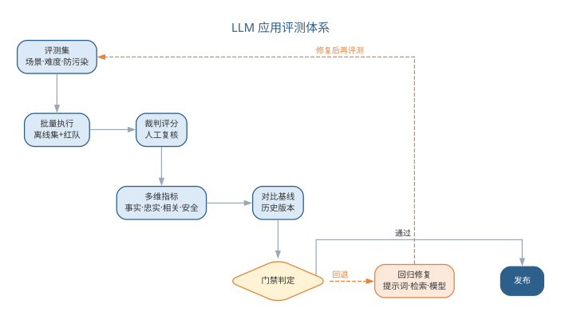{width=80%}

## LLM 应用的可观测性与成本治理

传统软件的观测手段（日志、指标、链路追踪）在 LLM 应用中仍然适用，但观测对象扩展到模型调用。**链路追踪**记录一次用户请求的完整轨迹——请求→检索→模型调用→响应，并记录每个环节的关键信息：检索命中了哪些文档、发送了多少 Token、模型输出了什么、是否触发降级。有了轨迹，"模型为什么给出这个答案"才可回溯，故障排查与责任追溯才有依据。每一步还应记录时间戳、Token 数、模型版本、重试次数与降级标记，形成可回放的调用明细；这类明细按 request_id 聚合，即得一次请求的成本与延迟全貌，是成本归因的最小单元。

**监控指标**分三类：性能（延迟、超时率）、资源（Token 用量、缓存命中率）与成本（每请求成本、累计成本）。成本监控是前文路由与缓存治理的闭环反馈——真实用量数据回传给路由策略与配额设置，形成"监控→治理→再监控"的循环。监控指标的分类如下表所示。

| 类别 | 指标 | 用途 |
|------|------|------|
| 性能 | 延迟、超时率、重试率 | 判断服务是否健康 |
| 资源 | Token 用量、缓存命中率 | 优化上下文与缓存配置 |
| 成本 | 每请求成本、累计成本 | 治理预算与路由策略 |

链路追踪还应携带 request_id，把一次请求贯穿检索、模型调用与业务日志，使故障定位从"猜测"变为"查询"。可观测性分层如图所示。

{width=85%}

**降级与容错**是生产可用性的保障：调用模型设置超时与重试（重试指数退避），失败时按预案降级——缓存兜底、退回较低能力模型、或返回预设提示语；连续失败触发熔断，避免对不可用上游的无效重试拖垮自身。降级的优先序通常为"缓存兜底→降档模型→预设文案"，优先级越高成本越低但质量也越低，取舍由业务对质量的容忍度决定；熔断恢复后要逐步放量而非瞬间全开。**灰度发布**让变更可控：先让小比例流量使用新模型或新提示词，对比评测集结果与线上指标，确认无回归再逐步放量，异常时快速回滚。放量的节奏通常按百分比分档扩大，并在每个档位同时观察评测集指标与线上监控，使灰度、评测与监控共同构成"发布三道闸"。可观测性最终服务于两件事：让成本可解释、让故障可追溯——二者都是工程负责人必须向业务方讲清的问题。降级策略的设计原则是"用户始终能拿到一个可用的结果"——即使不是最佳答案，也不让请求悬挂或报错；同时兜底结果要可区分，明确标注"缓存内容"或"降级回复"，避免用户把兜底当作实时答案，也让监控能准确统计降级比例——降级比例是判断模型服务健康的重要信号。

### LLM 应用工程的要点与误区

LLM 应用工程延续全书"人机协同、验证优先"的立场。常见误区如下表所示。

| 误区 | 典型表现 | 应对要点 |
|------|----------|----------|
| 只调通不管评测 | 上线前未建立评测集 | 以评测集为回归套件、发布门禁 |
| 追求单一最强模型 | 所有请求都用高能力模型 | 多模型路由，按难度与成本分派 |
| 索引建完不管更新 | 索引与文档源脱节 | 增量更新 + 版本一致 |
| 忽略成本与降级 | 成本失控、上游故障即雪崩 | Token 监控 + 超时、重试、兜底 |
| 升级不回归 | 更换模型后行为漂移 | 升级即回归：重跑评测集 + 灰度 |

要点在于把工程纪律平移进 LLM 应用：架构上做好分层与路由，数据上管好检索与上下文，质量上以评测集回归，运维上以可观测与降级兜底。这些误区共同指向一个判断：模型能力不等于系统质量——系统质量取决于提示词、检索、护栏、评测与治理的组合，而这些都在人的工程控制之内。模型负责生成，而"系统是否可靠、成本是否可控、答案是否可信"由人负责——LLM 应用工程是人在管理不确定性。

### 前沿演进：长上下文、多模态与模型迭代

前沿演进围绕三个方向展开，如下表所示。

| 方向 | 变化 | 对工程的影响 |
|------|------|--------------|
| 长上下文 | 上下文窗口容量持续增大 | 简化摘要与剪枝，或催生新的压缩技术 |
| 多模态 | 文本、图像、音频统一处理 | 输入输出与评测样本扩展到多模态 |
| 模型迭代 | 基础模型快速升级换代 | 版本评测、灰度发布成为常态 |

长上下文并不自动带来高质量——窗口大是容量，上下文内"有效信息密度"才是质量，检索与压缩不会消失，只是换一种形式。多模态把评测、护栏与成本治理从"文本 Token"扩展到"图像、音频 Token"，选型与合规维度随之变化。模型迭代加快意味着"升级即回归"：每次换模型或升级版本，都要重新跑评测集并灰度验证。面对快速迭代，工程上常采用"多版本并存"策略：按版本注册模型、存档路由配置与评测结果，使某一版本质量回退时能快速切回已知良好版本，退役旧版本同样要过评测与灰度。模型迭代到部署的回归过程如图所示。

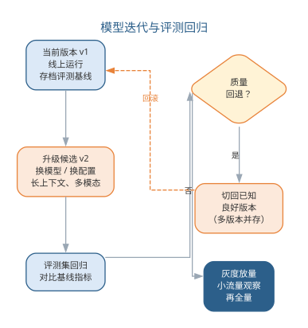{width=60%}

长上下文与多模态的到来不改变工程本质，只是把"上下文与评测"的粒度从文本扩展到多模态——无论前沿如何演进，"验证优先、人机协同"的工程立场不变，LLM 应用工程始终要回答"系统在真实场景下是否可靠"。

## 本章小结

本章把前 10 章分散的 AI 辅助能力整合为层层递进的两大部分。前半部分回答"如何用好大模型"：提示词五要素与分层模板体系让提示词成为可版本、可评测的工程资产；上下文工程与 RAG 以"检索—压缩—组装"在 Token 预算内最大化信息密度，用 Recall@k、MRR 等指标驱动迭代；智能体以工具调用、规划与反馈学习把"AI 辅助编码"推向"AI 主导执行"，人机协同谱系则提示风险越高越应靠右，工程师以"代码策展"守住所读即所审、所审即所合的质量底线。后半部分回答"如何把模型能力系统化地开发运维"：四种架构形态与非确定性、选型与路由、RAG 工程化与提示词体系、评测即回归、可观测与降级容错共同构成质量防线。模型负责生成，可靠性、成本与可信度由人负责——判断与责任始终属于人。

**思考与讨论：**
1. 分层模板体系中，基础、场景与评审三层模板分别解决什么问题？规范更新时应改哪一层？
2. Recall@k 与 Precision@k 分别偏低时，RAG 的改进动作有何不同？
3. 在"完全委托"到"专家咨询"的人机协同谱系上，你的项目应处于什么位置？为什么？
4. 为什么说 LLM 应用的质量问题主要是上下文问题？请用一个具体场景说明。
5. 若你的团队要上线一个文档问答应用，评测集应当如何构建才能防止"看起来好用、实际上不可靠"？
