# AI 原生软件工程

第 12 章把智能体推进到系统工程，智能软件工程由此从"AI 辅助软件"走向"软件按 AI 能力重构"。本章进入这一重构的核心——**AI 原生开发范式**：把大模型能力确立为软件开发的**基础设施**，按 AI 的能力边界重新组织需求、设计、编码、测试与验证的流程与分工。与第 2 至 9 章"用 AI 工具辅助"的智能增强不同，AI 原生不是"在旧流程上加 AI"，而是"按 AI 能力重写流程"——工程师的核心技能从语言与框架细节转向规格定义、上下文组织与结果审查。本章前半部分讨论范式本身——范式转变、意图驱动流程、规格即代码、上下文资产、分级质量门禁与组织流程再造，回答"如何按 AI 能力重构开发流程"；后半部分讨论支撑范式的平台与组织——模型、工具、知识资产与治理如何固化为共享基础设施，人机混合团队如何以任务集、评测集与审批流组织协作，度量与治理如何形成闭环，回答"什么样的平台与组织形态能支撑这种范式"。从范式到平台再到组织，是本章由内到外的递进：没有平台与组织的基础设施，范式只能停留在个人技巧与临时配置，无法成为团队稳定的生产方式。AI 原生如何进一步上升为软件工程 3.0，由第 14 章确立。

## 从智能增强到 AI 原生

**AI 原生软件工程（AI-native software engineering）**是把大模型能力作为软件开发基础设施、按 AI 能力边界重构工程组织方式的软件工程形态。它与**智能增强**（intelligent enhancement）有本质区别：后者保持原有流程，让 AI 在既有环节充当助手；前者改变流程本身——任务以意图与规格下达，AI 承担端到端执行，人在定义、验证与把关环节保持在场。三种形态的对照如下表所示。

| 维度 | 传统软件工程 | 智能增强 | AI 原生 |
|------|------|------|------|
| 流程载体 | 代码与文档 | 代码为主，AI 辅助生成 | 规格、上下文与工具 |
| 人机分工 | 人写代码 | 人写、AI 补全 | 人定义、AI 执行、人验证 |
| 质量保障 | 阶段评审 | 评审 + AI 建议 | 门禁前移、验证优先 |
| 工程师核心技能 | 语言与框架 | 编码 + 工具使用 | 规格定义、上下文组织、结果审查 |

三条进路的定位因此更清晰：第 12 章把全书主线归纳为 AI4SE（AI 赋能软件工程）、SE4AI（软件工程支撑 AI）与智能体协作三条进路；AI 原生是第四条进路——它不关注"AI 在哪一个环节介入"，而是关注"整个开发流程如何以 AI 能力为前提重新设计"。四条进路并非替代而是叠加：经典方法仍然成立，AI4SE 让纪律以更低成本落地，智能体协作让 AI 承担执行，AI 原生则把前三者固化为以规格、上下文与门禁为基础设施的开发方式。

并非所有项目都适合全面 AI 原生。判断是否进入 AI 原生的条件通常包括：任务是否可规格化（意图能否改写为可校验的验收标准）、团队是否具备定义与审查能力、变更是否高频（AI 原生的收益主要在迭代密集的开发中体现）、以及失败成本是否可控（高风险系统仍需人深度在场）。条件不满足时，在局部环节采用智能增强往往比全面重构更稳妥。

### AI 原生的四层能力栈

AI 原生软件工程把第 1 章前沿演进的四层能力栈（模型、工具、工程、治理）确立为开发流程的底层支撑：**模型层**提供生成与推理能力，是行为的上限；**工具层**把模型能力封装为编码、检索、测试等可调用服务；**工程层**把策展、审查与智能体编排固化为流程与门禁；**治理层**以评测、审计与责任边界约束前三层。四层对开发流程的支撑作用如下表所示。

| 层次 | 开发流程中的工程体现 | 负责角色 |
|------|------|------|
| 模型层 | 代码与方案生成、缺陷定位 | 平台运维与模型评测 |
| 工具层 | 编码助手、RAG 检索、测试生成 | 工具链建设与维护 |
| 工程层 | 规格定义、代码策展、门禁执行 | 工程师与流程负责人 |
| 治理层 | 评测集、审计日志、责任追溯 | 团队与组织 |

四层之间存在自底向上的依赖：模型能力决定工具层的边界，工具层的能力决定工程层能编排什么，工程层的门禁决定治理层能审计什么。因此 AI 原生的能力栈建设不是"逐层采购"，而是"先立规格与门禁，再选模型与工具"——工程层与治理层先行，模型与工具才能被正确地约束与使用。

### 范式转变的三个支点

从智能增强到 AI 原生，三个支点的转变决定了流程如何被重写：**载体转变**——软件开发的中心产物从"代码与文档"变为"规格、上下文与工具调用"；**分工转变**——人的角色从"逐行实现"变为"定义意图、编排执行、审查结果"，AI 的角色从"补全"变为"执行"；**质量转变**——质量保障从"阶段评审事后把关"前移为"门禁嵌入流程、验证优先"。三者的转变关系如图所示。

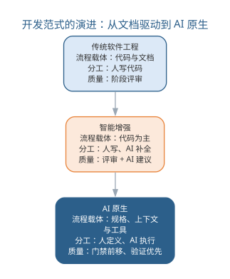{width=60%}

三个支点互为前提：载体变了，分工才可能变；分工变了，质量保障的方式才必须跟着变——这也是本章后续各节展开的主线。

## 意图驱动的开发流程

第 2 章把意图驱动开发作为方法演进的前沿提出，本章把它落实为可治理的工程流程。**意图驱动开发（intent-driven development）**以自然语言表达的**意图**为起点：开发者描述"要什么、为什么、如何验证"，AI 端到端完成从规格到交付的执行。流程的枢纽是把模糊意图固化为**意图规格化**（intent specification）——一份可机器校验、可评测验收的规格。

意图驱动开发的典型流程分为六步，每步的 AI 承担与人把关如下表所示。

| 步骤 | 内容 | AI 承担 | 人把关 |
|------|------|------|------|
| 意图捕获 | 收集任务目标、约束与验收倾向 | 澄清提问、补全缺失信息 | 确认真实目标 |
| 规格化 | 改写为规格与验收标准 | 生成规格草案 | 评审并锁定规格 |
| 任务分解 | 拆解为实现、测试与集成子任务 | 生成任务清单与依赖 | 确认分解粒度 |
| 生成 | 按任务生成实现、测试与文档 | 端到端生成 | 不直接干预 |
| 验证 | 自动检查、评测与门禁 | 执行测试与静态分析 | 处理验证异常 |
| 集成 | 通过门禁的产物合入基线 | 提交合并 | 审查关键路径 |

意图到规格的改写是第一步的关键，可用的提示词模板如下：

```text
你是资深需求工程师。请把以下开发意图改写为可校验的规格与验收标准：
意图：{{任务描述}}
已知约束：{{技术栈、依赖、边界条件}}
输出：
1. 目标：用一句话说明系统要达成什么
2. 规格：可测试的功能与行为要求，每条可对应到测试
3. 验收标准：每项规格的通过条件（输入、预期输出、边界）
4. 不变量：任何情况下都不得违反的性质
5. 风险点：意图中可能含混、需要人工确认之处
```

意图驱动存在两种执行模式：**检查点式**——每完成一个子任务就暂停，人确认后再继续，适合边界多、出错的代价高的任务；**全自动式**——仅在门禁处设置人工闸门，适合流程成熟、可规格化的高频任务。两种模式的取舍与第 11 章的人机协同谱系一致：风险越高、越依赖隐性知识，越应倾向检查点式。一个完整的实例：某订单系统要增加"优惠券叠加规则"。意图捕获阶段澄清了关键约束——同一订单同一品类最多叠加一张优惠券、会员折扣与优惠券可叠加；规格化阶段把这些改写为"输入两券与订单金额，输出可用券与实付金额"的可测试规格，并附三条验收标准；任务分解把实现拆为券匹配、金额计算、边界用例三个子任务；生成与验证阶段，AI 产出实现与测试，门禁中边界用例"两券同品类叠加"的失败暴露了匹配逻辑缺陷，回到生成环节修正后通过。这个例子说明意图驱动把"需求没说清"的问题在规格化阶段暴露，而不是留到集成后才被发现。

意图驱动流程同样存在失败模式，如下表所示。

| 失败模式 | 表现 | 对策 |
|------|------|------|
| 意图歧义 | 同一意图被不同理解 | 规格化阶段锁定可校验表述 |
| 验收缺失 | 无验收标准，交付无法判断成败 | 规格必须含验收标准 |
| 任务漂移 | 执行偏离原意图 | 每步对照规格回归 |
| 验证旁路 | 跳过门禁直接合入 | 门禁嵌入流水线不可跳过 |

四种失败模式大多可归结为"规格没立住"——意图驱动把质量风险从"实现"前移到"规格与验收"，规格一旦含糊，后续环节再严格也补救不了。意图驱动开发的执行闭环如图所示。

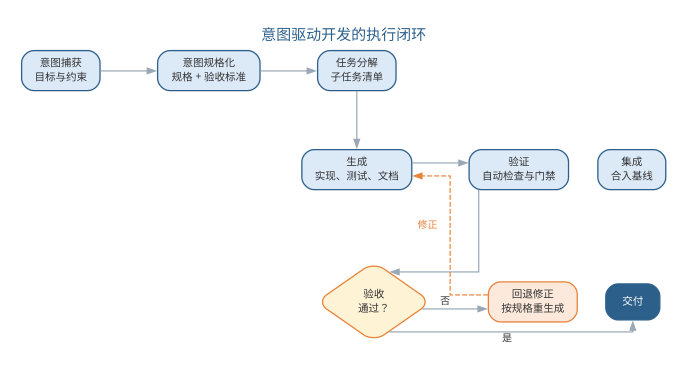{width=80%}

意图驱动适合目标相对清晰、可规格化的任务；对目标模糊、跨领域判断的任务，仍应回到第 11 章的人机协同谱系靠右的位置。

## 规格即代码的工程化

第 2、3 章分别提出规格即代码与需求即代码的概念。本章把它们从"单点实践"推进为**全产物锚定规格的单一事实来源**（single source of truth）：规格不是需求阶段的一份文档，而是贯穿开发全程的机器可校验基准——实现、测试、文档与运维都以它为锚，任何变更沿规格传播。各工程产物对应的可校验规格形态如下表所示。

| 工程产物 | 可校验规格形态 | 校验方式 |
|------|------|------|
| 需求 | 规格化需求 + 验收测试 | 验收测试通过 |
| 设计 | 接口契约与不变量 | 契约测试、静态断言 |
| 实现 | 满足规格的实现 | 编译、单测、门禁 |
| 测试 | 可执行的验收与回归套件 | 全量通过 |
| 文档 | 从规格生成的说明 | 与规格一致 |
| 运维 | SLO 与告警规则 | 监控阈值满足 |

把需求改写为"规格 + 验收测试 + 不变量"的提示词模板如下：

```text
请把以下需求改写为规格化形式，供规格即代码流程使用：
需求：{{需求描述}}
边界条件：{{输入范围、异常情形}}
输出：
1. 规格：逐条可测试的行为要求
2. 验收测试：每条规格对应的输入—预期输出（可用伪代码）
3. 不变量：不得违反的性质（如数据一致性、安全性）
4. 变更影响：若该需求变化，哪些规格与测试需要同步调整
```

规格的"可校验"是单点概念与工程化的分水岭。一份需求规格要成为工程基准，必须满足三条：**可执行**——规格能翻译为验收测试或契约断言，而不是停留在自然语言；**可追溯**——每条实现都能回溯到它满足的规格，每条规格都能找到对应测试；**可失效**——规格随实现演进，废弃的规格显式标记，避免"僵尸规格"与实际行为脱节。以"优惠券叠加"规格为例，其验收测试的伪代码形态如下：

```text
规格 S3.1：同一订单同一品类最多叠加一张优惠券
验收测试 V3.1：
  输入：订单含 A 品类两件商品、券 X（A 品类）、券 Y（A 品类）
  预期：仅 X、Y 中面额更大者生效；实付 = 原价 - 较大券值
  边界 V3.2：两张券分属不同品类 → 两券均生效
  边界 V3.3：券值超过商品价 → 实付不低于零
```

多规格并存时还会出现**规格冲突**——两条都"合理"的规格互相矛盾。典型的消解顺序是：先按不变量优先（安全、一致性的性质最高优先），再按业务价值（直接影响用户目标者优先），最后按实现成本（冲突双方实现代价差异悬殊时优先低成本方）；冲突的裁决记录要写入决策记录（ADR），避免同样的冲突反复出现。规格即代码的工程价值在于**变更可控**：当需求变化时，先改规格与验收测试，实现再被"拉"着更新——而不是实现先行、文档最后补。契约测试保证规格两侧（提供方与消费方）始终一致，任何一侧偏离都会在流水线中被拦下。规格的版本化与评测类似代码：每次规格变更走评审，配套测试随规格回归，回退时规格与实现一起回退。规格作为单一事实来源，把需求、实现、测试与文档串成一条可追溯的链——从任何一条代码都能回溯到它满足的规格，从任何一条规格都能找到它对应的测试。规格的锚定关系如图所示。

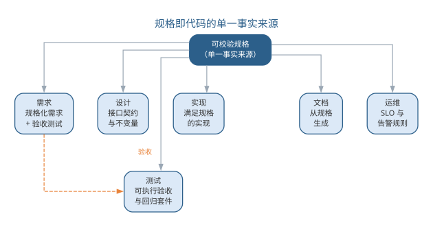{width=80%}

规格即代码的落地要点是"规格先行、实现跟进、门禁兜底"：规格的修改要像代码一样走评审与版本管理，验收测试先于实现存在，实现只有通过验收才能进入基线。

## 上下文与知识资产的组织

AI 原生开发把"上下文"从单次调用的输入提升为**组织级知识资产**。**仓库即上下文（repo-as-context）**指把代码库、文档、决策记录与评测集组织为可供模型检索与引用的统一上下文，让每一次生成都"站在项目事实之上"而非凭空发挥。上下文资产的类型与组织方式如下表所示。

| 资产类型 | 内容 | 组织方式 |
|------|------|------|
| 代码索引 | 仓库结构、符号表、调用关系 | 持续索引，随提交更新 |
| 知识库 | 技术规范、最佳实践、问题库 | RAG 分块与向量化 |
| 文档 | 需求、设计、接口文档 | 与代码同源维护 |
| 决策记录 | 架构与设计决策（ADR） | 版本化、可检索 |
| 评测集 | 验收与回归样本 | 版本化、防污染 |

上下文资产的组织与第 11 章的上下文工程一脉相承：第 11 章解决"单次调用放什么进上下文"，本章解决"团队如何把项目知识组织为可复用的上下文资产"。两者的关键差别在**所有权与失效**——组织级资产必须有明确的负责人与失效机制：文档与代码不同步、索引落后于提交、决策记录无人维护，都会让"仓库即上下文"变成"仓库即噪声"。上下文资产围绕模型上下文组织，各资产的供给关系如图所示。

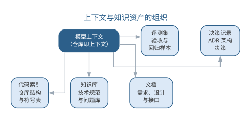{width=85%}

上下文资产同样要经历**创建—维护—失效**的生命周期：创建时登记负责人、范围与版本；维护时随代码演化更新索引、随决策补充 ADR；失效时显式废弃过期资产并清理检索入口，防止模型引用已不成立的事实。资产质量应有可观测的代理信号——检索命中率、引用文档与代码版本是否一致、评测集是否仍覆盖线上问题——这些信号是资产治理的"监控指标"。

上下文资产的典型失效往往发生在"无人负责的边界"：代码索引由工具自动维护却无人核对，文档由人工维护却与代码不同步，评测集由历史项目沿用却无人扩充。一个常见的失败链条是——接口文档停在上一版本，代码索引却已更新，模型检索到的文档与代码互相矛盾，生成的结果看似合理实则错误。这类问题难以靠单次修复解决，只能靠"资产登记 + 定期审计"的制度化：每个资产登记负责人、来源与更新频率，审计时检查资产与实际代码的版本一致性。上下文资产的质量决定 AI 原生产出的质量上限：检索到的代码索引过时，生成的代码就会引用已废弃的接口；评测集老化，回归就测不出行为漂移。因此上下文资产要像代码一样被治理——版本管理、定期审计、随项目演化持续更新。

## 验证优先的分级质量门禁

AI 原生产出规模大、速度快，质量保障必须从"事后评审"转为"门禁内嵌"。**分级质量门禁（tiered quality gate）**把验证分为自动检查、AI 自评与人工审查三级，低风险产物由前两级放行，高风险产物必须经过人工审查：

- **自动检查**：静态分析、单元测试、安全扫描与格式校验，成本最低、覆盖最广，构成第一道闸；
- **AI 自评**：让 AI 对照评审清单自查，指出已知缺陷与风险点，作为自动检查与人工审查之间的补充；
- **人工审查**：对高风险改动（数据层、并发、安全、接口变更）强制人工评审，守住质量与责任关口。

AI 自评的评审清单提示词模板如下：

```text
请作为代码审查者，对照以下清单评审给出的改动，输出 JSON：
改动说明：{{改动说明}}
自测结果：{{自测结果}}
清单：
- 正确性：边界与异常路径是否处理
- 一致性：是否符合既有接口与规范
- 安全性：是否引入注入、越权等风险
- 可维护性：是否引入不必要的抽象或重复
- 回归风险：是否影响既有功能
输出：{ "grade": "通过/需修改", "issues": [{"level": "高/中/低", "desc": "问题描述"}] }
```

门禁分级不是固定不变的，而是**随风险自适应**。风险由两个维度决定：改动的影响面（触及模块数量、是否接口变更）与改动者的可信度（来源是成熟智能体还是探索性生成）。风险分级与对应验证如下表所示。

| 风险级别 | 判定依据 | 必过门禁 |
|------|------|------|
| 低 | 局部改动、无接口变更 | 自动检查 |
| 中 | 跨模块改动、涉及数据 | 自动检查 + AI 自评 |
| 高 | 接口变更、并发、安全 | 自动检查 + AI 自评 + 人工审查 |

分级门禁的价值在于**把人力投到最值得的地方**：自动检查拦住机械错误，AI 自评筛出明显问题，人工审查聚焦高风险路径。评测集回归与门禁衔接——每次改动都跑评测集并与基线对比（见第 11 章"评测即回归"），任何回退都阻断合入。分级的质量门禁流水线如图所示。

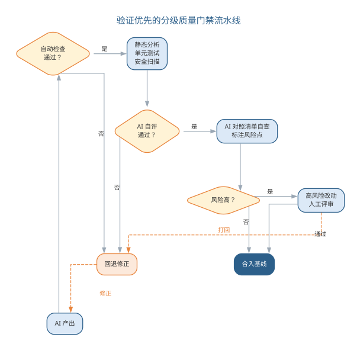{width=60%}

门禁本身也需要被度量，否则会退化为"走流程"。常用的门禁运行指标如下表所示。

| 指标 | 口径 | 反映的问题 |
|------|------|------|
| 首道闸拦截率 | 自动检查拦截占比 | 生成质量基线 |
| AI 自评通过后人工返修率 | 人工审查打回比例 | AI 自评是否可信 |
| 人工审查平均耗时 | 高风险改动评审时长 | 审查是否成为瓶颈 |
| 漏网率 | 上线后缺陷追溯到门禁未拦截 | 门禁盲区 |

若人工返修率长期偏高，说明 AI 自评的清单或阈值需要调整；若人工审查耗时成为瓶颈，说明风险分级过粗、把过多改动归为高风险。分级门禁最常见的误区是把三级当成"任选其一"：跳过 AI 自评只靠自动检查，风险标注缺失；跳过人工审查只靠前两级，高风险改动失控。门禁的分级不是摆设，而是按风险分配的验证预算——风险越高，验证越重；而门禁的运行指标，则是验证预算是否被有效使用的度量。

## AI 原生开发的组织与流程再造

AI 原生开发不是"个人用工具"，而是**组织以 AI 为基础设施重构流程**。重构的核心是明确**人机交接点**：哪些环节由 AI 自主执行、哪些环节必须人确认、交接时交付什么、验收标准是什么。角色与交接点如下表所示。

| 环节 | 承担者 | 人机交接点 |
|------|------|------|
| 意图与规格 | 人主导、AI 辅助 | 规格评审、锁定 |
| 实现与测试 | AI 主导 | 门禁通过后交接 |
| 高风险改动 | AI 提议、人确认 | 人工审批闸门 |
| 缺陷与回归 | AI 定位、人决策 | 修复方案评审 |

流程再造遵循六步：**盘点**——梳理既有流程，明确哪些环节值得 AI 化、哪些保持人工；**规格化**——为 AI 化的环节建立可校验规格；**门禁**——分级质量门禁嵌入流水线；**试点**——在小范围验证规格与门禁是否兜得住；**度量**——用采纳率、交付周期、缺陷率评估效果（见第 12 章效能度量）；**固化**——把验证有效的规格、门禁与交接点固化为团队规范。流程再造的要点与误区如下表所示。

| 误区 | 典型表现 | 应对要点 |
|------|------|------|
| 流程不变加 AI | 旧流程上堆工具 | 先按 AI 能力重设计流程 |
| 规格滞后 | 先实现后补规格 | 规格先行、验收先行 |
| 门禁形同虚设 | 可跳过、可豁免 | 门禁嵌入流水线不可绕过 |
| 交接点不清 | 人机职责重叠或真空 | 明确每环节的承担者与验收标准 |

以某内部工具团队的流程再造为例：盘点发现缺陷修复是耗时最长的环节，决定先行 AI 化；规格化阶段把"修复必须附回归测试"立为规格；门禁在既有 CI 上加 AI 自评与高风险人工闸门；先在一个特性小组试点两周，把缺陷修复的交付周期从平均三天降到一天，同时缺陷回退率没有上升；再向全团队固化。这个例子说明，流程再造的价值不在于把每个环节都 AI 化，而在于**把最痛、最可验证的环节先 AI 化，并用规格与门禁兜住质量**。AI 原生流程中的人机分工——人定义与把关、AI 执行与产出，中间以交接点衔接——如图所示。

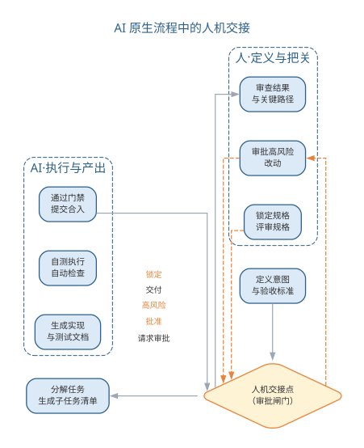{width=55%}

流程再造的底线是"低风险才自动、能验证才交付、能记录必记录"：破坏性动作保留人工确认，每一步产出以能否通过门禁为准绳，规格、门禁与交接记录进入审计链路。

### 前沿演进：从编码到全流程的 AI 原生

AI 原生目前最成熟的是编码环节——补全、生成、重构与测试生成已产品化；它正在向需求、设计、运维与治理全流程渗透：需求侧以规格化需求为锚，设计侧以架构适应度函数为门禁（见第 5 章前沿演进），运维侧以 SLO 与告警为规格（见第 7 章前沿演进）。编码之后的下一个突破点是把意图驱动与规格即代码贯通整个生命周期，让"从需求到交付"在规格与门禁的约束下由 AI 主导执行。AI 原生向全流程渗透的路径如图所示。

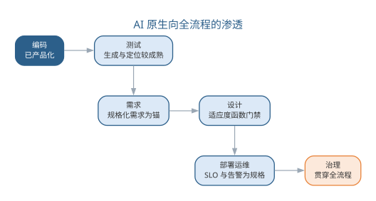{width=80%}

这一趋势的承载——平台、组织与治理——将在本章后半部分系统展开，并进一步上升为软件工程 3.0 的完整范式（第 14 章）。

AI 原生开发的组织与流程再造，把范式确立的"人定义、AI 执行、人验证"固化到了团队日常协作。但范式要真正落地，还差一样东西——承载它的**平台**：模型、工具、知识资产与治理只有固化为团队共享基础设施，按 AI 能力重构的流程才能稳定运转、被全团队复用。本章后半部分从开发范式上升到平台与组织：先看 AI 原生平台如何统一供给与治理模型、工具、知识资产，再看人机混合团队如何以任务集、评测集与审批流组织协作，继而讨论度量与治理闭环、未来工程师的能力要求；AI 原生如何上升为软件工程 3.0、自主化如何展开，由第 14 至 16 章继续。

## AI 原生平台：模型与工具链成为基础设施

**AI 原生平台（AI-native platform）**是把 AI 原生开发所需的模型、工具、知识资产与治理能力固化为**团队共享基础设施**的系统。与第 9 章讨论的智能工具链不同，工具链是"一组按环节选配的工具"，平台是"统一供给、统一治理的基座"——它把工具链从"每个团队各自选型、各自集成"升级为"一次建设、全团队复用"。AI 原生平台按能力分为四层，如下表所示。

| 层次 | 提供的能力 | 工程体现 |
|------|------|------|
| 模型服务层 | 模型接入、路由、缓存与成本计量 | 统一 API、多模型并存、Token 治理 |
| 工具与智能体服务层 | 工具注册、智能体运行时、编排 | 统一工具协议、沙箱执行、任务调度 |
| 知识资产层 | 代码索引、知识库、评测集 | 仓库即上下文、版本化、防污染 |
| 治理与可观测层 | 门禁、审计、监控、成本归因 | 分级门禁、轨迹留存、责任追溯 |

四层平台与第 2 章的平台工程、内部开发者平台（IDP）一脉相承：IDP 把 CI/CD、环境与发布固化为自助服务，AI 原生平台在此基础上再沉淀模型、工具与知识资产——开发者不再各自维护提示词、模型配置与检索管道，而是按需调用平台能力。平台即产品（platform as a product）：它像产品一样有用户、有需求、有版本、有迭代节奏，而不是一次性建设的基础设施。AI 原生平台的四个能力层如图所示。

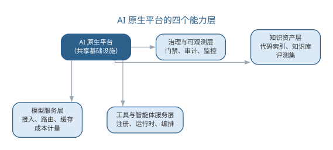{width=90%}

一个平台建设的实例有助于理解分层：某企业级开发团队要支撑多个业务线共享 AI 能力，先盘点出各业务线都在重复接入模型、自建提示词库与检索管道，决定建设统一平台。模型服务层统一接入并做多模型路由，各业务线按任务难度与成本选择模型档位；工具与智能体服务层注册常用工具（代码检索、测试执行、文档生成），智能体按统一协议调用；知识资产层把各业务线的代码索引与知识库统一到平台，标注业务线归属；治理层统一门禁与审计，任何业务线的 AI 产出都走同一套审批与留痕。三个月后各业务线不再各自维护模型与提示词，平台按用量计费回馈成本治理——重复建设、治理分散与知识孤岛三个信号同时被缓解。平台建设的关键不是"堆功能"，而是**统一**：模型接入统一（换模型不改应用）、工具协议统一（智能体可调用任何已注册工具）、知识资产统一（一处建设、全团队复用）、治理统一（门禁与审计对所有人一致）。统一的代价是平台本身成为关键路径——平台故障、模型变更或治理误配都会影响全团队，因此平台的运维与治理要求比单个工具链更高。

平台自身的建设也应遵循"配置即资产"的原则：模型接入配置、工具注册表、知识资产索引与治理规则都作为配置项纳入版本管理，任何变更走评审、可回滚——平台是软件开发的基础设施，基础设施本身就要用工程纪律来维护。平台演进遵循产品节奏：以内部用户（各开发团队）的需求为输入，按"小步迭代、灰度放量"推进，每季度审视一次"哪些能力被真正使用、哪些成为无人问津的摆设"，保持平台与真实需求同频。平台能力建设与采用存在"冷启动"问题：能力建了没人用，价值无法体现；可以先用"平台先行、试点带动"——先在一个特性团队验证，再向全团队推广，让首批成功案例成为平台说服力的来源。

### AI 原生平台的失败模式

平台集中化的收益也伴随集中化的风险，常见失败模式如下表所示。

| 失败模式 | 表现 | 对策 |
|------|------|------|
| 平台臃肿 | 能力越积越多，多数无人使用 | 定期审视使用率，淘汰空置能力 |
| 单点故障 | 平台故障瘫痪全团队开发 | 高可用部署、降级预案 |
| 治理误配 | 门禁过严拖慢迭代，或过松失控 | 门禁按风险分级、可配置 |
| 知识资产失真 | 索引与文档落后于实际代码 | 资产登记 + 定期审计 |

平台臃肿与治理误配是"度"的问题：平台不是能力越多越好，而是"够用且被使用"；治理不是越严越好，而是"与风险匹配"。判断平台健康度的信号与团队级度量互补——活跃使用率、平均故障时长、能力空置率——它们回答"平台是否在真正支撑开发"。

## 从工具链到平台：AI 原生开发环境的演进

第 9 章前沿演进给出了智能工具链的"编辑器—CLI—CI—知识库"生态；本章把它放到演进的视角下，看工具链如何一步步走向平台。AI 原生开发环境的演进大致经历四个阶段，如下表所示。

| 阶段 | 承载能力 | 代表形态 | 局限 |
|------|------|------|------|
| 编辑器内嵌 | 补全、对话、重构 | Copilot、Cursor | 单点辅助，无仓库级任务 |
| CLI 终端 | 仓库级多步任务 | Claude Code、Codex | 能力强但各自为政 |
| CI 集成 | 质量门禁、自动修复 | 评审机器人、AI 测试 | 与开发侧割裂 |
| 平台化 | 统一供给、统一治理 | AI 原生平台 | 建设成本高、治理负担重 |

前三个阶段是"按环节加工具"，平台化则把三个环节连同知识资产统一起来：编辑器、CLI 与 CI 共享同一套工具协议与模型路由，知识资产由平台统一供给，治理与审计对全链路一致。驱动这一演进的关键是**工具协议的统一**——模型上下文协议（MCP）等标准让不同工具能互操作，智能体一次接入即可调用平台注册的全部工具，而不是为每个工具写专属适配。工具链到平台的演进路径如图所示。

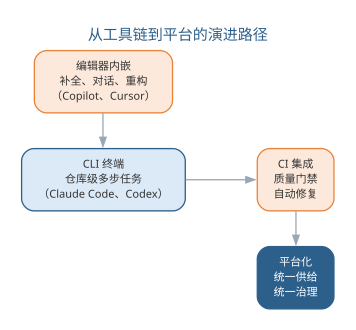{width=65%}

演进不是"淘汰旧工具"，而是"旧能力成为平台的一层"：编辑器的补全、CLI 的仓库操作、CI 的门禁都保留，只是从"各自独立"变成"平台统一治理"。工具协议的标准化是平台化的技术前提：模型上下文协议（MCP）统一了"工具如何暴露、智能体如何调用"的接口，使平台可以在不重写既有工具的前提下接入新的工具与服务；提示词与模型路由的标准化则让"换模型"成为配置变更而非代码变更。对团队而言，判断是否值得平台化，取决于三个信号：重复建设（多个项目各自配置模型与工具）、治理分散（各团队的提示词与权限互不可见）、知识孤岛（代码索引与知识库在项目间不可复用）。三个信号同时出现时，平台化是自然选择。

平台化同样有边界，**过度平台化**是把简单的场景复杂化：团队只有一两个人、任务形态单一、无需跨项目复用知识时，一套精心治理的平台是负担而非资产。判断的尺子是"平台是否降低了团队的认知负担"——平台把复杂性集中到一处统一治理，对多人多项目是简化，对单人单项目则是绕远路。平台化之前先问三个问题：有多少团队共享这套能力？平台化的成本能否被治理收益覆盖？平台的故障会影响哪些依赖方？三个问题都能给出正面回答，才值得投入。

## AI 原生组织：人机混合团队

**人机混合团队（human-AI hybrid team）**指工程师与智能体在统一目标下协作、以任务集、评测集与审批流为基础设施的组织形态。它不同于"工程师 + AI 工具"——在混合团队中，智能体是被考核的**协作成员**，其表现以任务集与评测集度量，其行为受审批流约束。第 12 章前沿演进预告了这一方向，本章将其展开为可操作的工程实践。

混合团队的基础设施决定协作质量。**任务集**是智能体可承担的原子任务库——每个任务登记输入、产出、验收标准与负责人，让智能体"有事可做、有据可查"；**评测集**是智能体能力的度量基准——每个角色（编码、测试、审查）都有对应的任务评测集，升级模型或提示词时回归验证；**审批流**是人机交接的制度化——高风险动作必须经过人工确认，交接点清晰可追溯。三者共同构成混合团队运行的"宪法"，如下表所示。

| 基础设施 | 内容 | 作用 |
|------|------|------|
| 任务集 | 原子任务、验收标准、负责人 | 让智能体有据可依 |
| 评测集 | 按角色的能力度量基准 | 让智能体表现可考核 |
| 审批流 | 高风险动作的人工闸门 | 让人机交接有据可循 |

混合团队中的人并非消失，而是角色发生迁移——从"执行者"变为"目标定义者与质量把关者"。各角色的迁移方向如下表所示。

| 角色 | 传统职责 | 混合团队中的迁移 |
|------|------|------|
| 需求分析师 | 访谈、撰写需求文档 | 定义意图与验收标准，审核规格 |
| 架构师 | 设计模块与接口 | 制定架构约束，审查智能体方案 |
| 开发工程师 | 实现代码 | 任务定义、代码策展、门禁把关 |
| 测试工程师 | 设计并执行用例 | 评测集构建、回归门禁、缺陷仲裁 |

智能体加入团队应像新成员入职一样经历**试用期**：先登记能力与权限，在低风险任务集上试用并记录表现；表现达到评测集门槛后开放更高权限；表现不稳定或行为越界时随时收回权限。试用期制度让"智能体成为成员"不是一次授权，而是持续考核的过程——这也正是把智能体当作"可考核成员"而非"高级工具"的组织含义。混合团队的协作形态——人定义与把关、智能体高频执行，基础设施居中衔接——如图所示。

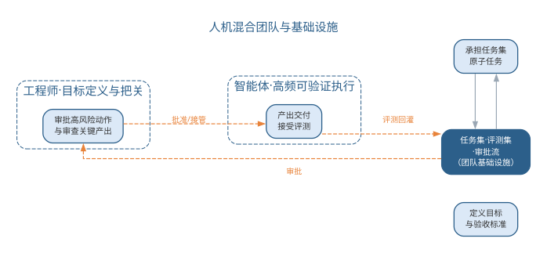{width=85%}

### AI 原生组织的治理与责任

混合团队的治理对象从"人的产出"扩展到"人与智能体的协作产出"。治理要求可归纳为四条：**准入退出**——智能体接入须登记能力、工具与权限，能力不达标或行为失控时停用；**版本管理**——模型、提示词、评测集与任务集都纳入版本管理，任何产出可追溯；**评测回灌**——线上缺陷若追溯到智能体改动，回灌评测集并更新任务集，防止同类错误重演；**责任归属**——智能体的产出最终由部署与使用它的人负责，事故复盘定位是模型能力、任务定义还是审批流的问题。四条要求与第 12 章的组织治理一脉相承，只是把治理对象从"工具"扩展为"成员"。治理对象与治理手段的对应关系如下表所示。

| 治理对象 | 治理手段 | 目标 |
|------|------|------|
| 模型与提示词 | 版本管理 + 评测回归 | 行为可复现 |
| 工具与权限 | 注册表 + 最小权限 | 能力可约束 |
| 任务集与评测集 | 版本化 + 回灌更新 | 能力可考核 |
| 审批流与审计 | 门禁 + 轨迹留存 | 责任可追溯 |

治理不是"限制智能体"，而是"让智能体可信"：准入与版本让能力有据可查，评测与回灌让表现持续改进，审批与审计让责任落在实处。

## 智能软件工程的度量与治理

第 12 章讨论了团队层面的 AI 效能度量（采纳率、交付周期、缺陷率、返工率）；本章把它深化到平台与组织层面，形成"度量—治理—评测—审计—回灌"的治理闭环。平台级度量在团队指标之上，还需补充三类指标，如下表所示。

| 指标 | 口径 | 用途 |
|------|------|------|
| 平台采纳度 | 活跃使用平台能力的团队/成员占比 | 平台价值 |
| 模型切换成本 | 换模型所需的回归与灰度时长 | 模型治理 |
| 全链路成本 | 单次交付的 Token 与资源总成本 | 成本治理 |

治理闭环把度量结果转化为行动：**度量**暴露问题（采纳率低、缺陷率上升、成本超预算）；**治理**调整手段（改审批流、调路由、补评测样本）；**评测**验证调整效果（重跑评测集对比基线）；**审计**留存过程证据（轨迹、来源、决策理由）；**回灌**把发现写回评测集与任务集，让系统持续学习。闭环的核心是"让每一次事故都变成下一次评测的样本"，如图所示。

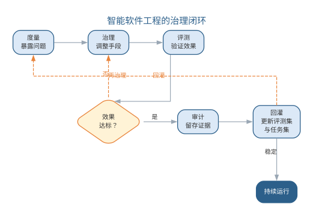{width=70%}

治理闭环的最怕两类失效：**度量失真**——指标被优化而非改善（如只刷采纳率不看缺陷率）；**闭环断裂**——事故复盘后评测集与任务集没有更新，同类问题反复发生。前者的对策是多指标对照、防止单一指标绑架决策；后者的对策是把"回灌"设为事故复盘的强制动作，而非可选项。闭环运行还依赖一条纪律：度量与治理的职责分离——度量数据的采集与展示应是客观的，治理手段的调整应有评审记录，避免"既当运动员又当裁判"使闭环流于形式。对平台负责人而言，治理闭环的输出不是一份报告，而是一套持续更新的评测集与任务集——它们是组织对智能体能力的"集体记忆"。

一个度量驱动治理的实例：某团队发现编码智能体的采纳率持续上升，但缺陷率同步上升。度量揭示两者相关后，治理调整了任务集与门禁——把"高风险模块由人工审查"固化为强制动作，并在评测集中补充"边界与异常路径"样本；重跑评测集确认缺陷率回落，审计留存了调整的依据。三个月后再看，采纳率保持、缺陷率回落——这正是"度量—治理—评测—审计—回灌"闭环的完整运作。这个实例说明，度量本身不能解决问题，度量之后接上的治理动作才是。

## 未来的工程师：定义、编排、策展与审查

第 12 章展望曾把工程师的角色演进概括为"定义问题、编排、策展、审查"；本章把它展开为未来工程师的四项核心能力，并给出相应的学习路径，如下表所示。

| 能力要素 | 核心要求 | 学习路径 |
|------|------|------|
| 定义问题 | 把模糊目标说成可校验的意图与规格 | 需求工程 + 规格化训练 |
| 编排 | 把任务交给合适的模型与工具 | 工具链 + 智能体编排实践 |
| 策展 | 阅读、评估、整合 AI 产出 | 代码评审 + 审查清单 |
| 审查 | 守住质量与责任关口 | 门禁设计 + 评测与审计 |

四项能力的共同点是"与 AI 协作的能力"——它们不替代传统工程能力，而是在其之上叠加：定义问题仍需需求工程功底，编排仍需架构判断，策展与审查仍需质量与伦理素养。未来的工程师学习路径，是在传统软件工程知识体系上叠加三层新技能：**提示词与上下文**（与模型交互）、**规格与门禁**（约束模型产出）、**治理与责任**（管理模型行为）。工程师能力四要素及其协作关系如图所示。

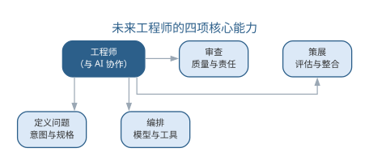{width=90%}

对教育与职业的影响同样深远：软件工程课程从"语言与算法"转向"与模型协作的工程方法"，项目实践从"写一个系统"转向"用 AI 原生流程交付一个系统"，职业发展从"技术深度"转向"定义与把关的广度"。课程的转型可以参照如下映射：把传统的"编码课"拆为"编码 + 策展"两段——前者仍掌握语言与算法，后者训练阅读、评估与整合 AI 产出；把"测试课"扩展为"评测集构建与回归门禁"；把"项目管理课"扩展为"任务集、评测集与审批流设计"。这种转型不是抛弃传统知识体系，而是让它在"与 AI 协作"的新环境中继续生效。但有一件事不变——**判断与责任属于人**：AI 可以写得更快，但"该做什么、为什么这么做、如何验证"始终需要人来回答。

## 智能软件工程展望

回望至此，一条主线逐渐清晰：从传统软件工程到智能软件工程，再到 AI 原生软件工程。第 1 至 9 章把 AI 引入生命周期的每个环节，构成 **AI4SE** 进路；第 10 章用工程纪律约束 AI 系统本身，构成 **SE4AI** 进路；第 11 至 12 章让 AI 从助手成为协作者，构成**智能体协作**进路；本章把 AI 确立为软件开发基础设施，构成 **AI 原生**进路。四条进路并非替代而是叠加：经典方法仍然成立，AI4SE 让纪律以更低成本落地，智能体协作让 AI 承担执行，AI 原生让整个流程按 AI 能力重新组织。智能软件工程的演进路线如图所示。

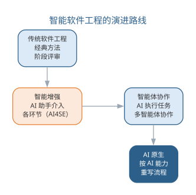{width=60%}

全书反复强调的信念在此承上启下——既是对前文进路的凝练，也将继续贯穿第 14 至 16 章：**人始终是软件工程的主体**——AI 增强的是能力，需求的理解、架构的判断、质量的责任始终属于人；**验证优先**——无论 AI 承担多少执行，每一步产出都要以能否通过测试与评审为准绳；**责任在人**——AI 可以越来越自主，但判断与责任永远由部署与使用它的人承担。这些信念不是对 AI 的限制，而是让 AI 真正可信的前提。

对走到此处的读者而言，这一阶段的价值不在记住多少技巧，而在建立三种能力：**定义问题的能力**——比生成代码更重要的是说清"要什么、为什么、如何验证"；**与模型协作的能力**——把提示词、上下文、规格与门禁组织成可靠的工程资产；**坚守质量与伦理的定力**——无论工具如何强大，始终以验证优先、以公众利益为先。软件工程的核心问题——在成本与进度约束下交付高质量软件——半个多世纪未变，变化的是手段：从结构化、面向对象、敏捷，到今天的智能增强、智能体协作与 AI 原生。手段在变，底线不变。

留给读者的开放问题同样没有标准答案：智能体的行为如何被审计与问责？自动化程度提高后，工程师的技能结构如何转型？大规模自主执行会放大怎样的系统性风险？这些问题的答案只能靠持续的工程实验回答——这正是下一阶段的课题。第 14 章将把 AI 原生上升为软件工程 3.0 的完整范式，第 15 章展开自主软件工程与智能体网络，第 16 章以治理、安全与未来收束全书。

### 前沿演进：从 AI 原生到自主软件工程

前沿正从"AI 原生"走向**自主软件工程**（autonomous software engineering）——不只是流程按 AI 能力重构，而是软件过程中的更多环节由智能体自主完成，人从"环节参与"退到"目标与边界定义"。自主化的提升遵循"低风险才自动、能验证才交付、能记录必记录"的底线：破坏性动作保留人工确认，每一步产出以能否通过门禁为准绳，轨迹与决策理由进入审计链路。自主化不是无人化——人始终保留目标的定义权、边界的设定权与异常的接管权；自主化是"把验证可靠的环节交给智能体，把判断与责任留给组织"。自主化的边界不是技术问题而是信任问题：智能体在多大程度上能独立行动，取决于它的产出在多大程度上能可靠验证——验证手段每前进一步，自主化的空间才扩大一步。这正是全书"验证优先"信念在前沿的延伸：不是让 AI 越来越自主，而是让"可靠的自主"越来越可信。从 AI 原生到自主软件的演进路径如图所示。

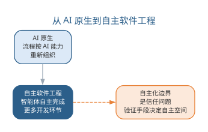{width=80%}

这一方向将在第 14 章以软件工程 3.0 的框架展开，第 15 章以自主软件工程深入，第 16 章以治理、安全与未来收束。

## 本章小结

本章把 AI 原生确立为智能软件工程中"按 AI 能力重构流程"的开发范式，并从范式推进到支撑它的平台与组织。范式层面：意图驱动把质量风险前移到规格与验收，规格即代码让实现、测试与文档锚定单一事实来源，上下文资产把项目知识组织为可复用输入，分级门禁按风险分配验证预算，流程再造以人机交接点落实"人定义、AI 执行、人验证"的分工。平台与组织层面：AI 原生平台把模型、工具、知识资产与治理固化为共享基础设施，统一供给、统一治理；人机混合团队以任务集、评测集与审批流为基础设施，让智能体成为被考核的协作成员；度量与治理形成"度量—治理—评测—审计—回灌"闭环，让每一次事故变成下一次评测的样本；未来工程师以定义、编排、策展与审查为核心能力，叠加与模型协作的新技能。从范式到平台再到组织，人始终是主体，AI 增强能力，验证优先，责任在人；AI 原生如何上升为软件工程 3.0、自主化如何展开，由第 14 至 16 章继续。

**思考与讨论：**
1. 意图驱动把质量风险从"实现"前移到"规格与验收"，这对工程师的技能要求提出了什么新挑战？
2. 规格即代码的单一事实来源在变更频繁的项目中可能遇到哪些阻力？如何缓解？
3. 分级质量门禁的三级验证应如何按风险分配？请以你正在进行的项目举例。
4. 如果你的团队要建设 AI 原生平台，四层能力中你会优先建设哪一层？为什么？
5. 人机混合团队中，任务集、评测集与审批流各解决了什么治理问题？三者缺一会怎样？
