# 软件项目管理

管理是通过计划、组织和控制等一系列活动，合理分配和使用各种资源以达到既定目标的过程。软件项目管理是为使项目按预定成本、进度与质量顺利完成，而对成本、人员、进度、质量、风险等进行分析和管理的活动。

软件项目具有**产品不可见、高度不确定、过程多变、人员高流动**的特征，因此**降低复杂性、控制变化**是项目管理的关键问题。软件项目管理的"4P"要素是人员（People）、产品（Product）、过程（Process）与项目（Project），其管理活动贯穿启动（定范围、组团队、建环境）、规划（定活动、估成本、排进度）、实施（监控执行、管理风险、控制变更）、收尾（验收、培训、总结）四个阶段。

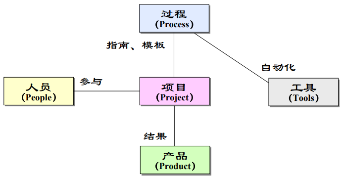{width=55%}

## 人员组织与管理

人员是软件开发最重要的资源，项目经理的任务主要是面向人的。典型组织形式有三种：**民主式**（成员平等、集体决策，适合规模小能力强的小组，但缺乏权威领导）；**主程序员式**（以既懂技术又善管理的主程序员为核心，交流简单，但人才难求）；**技术管理式**（技术与管理工作分离，分别设技术负责人与管理负责人）。

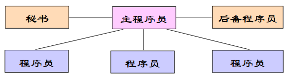{width=50%}

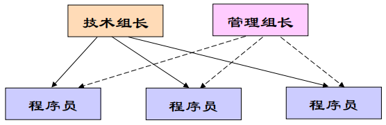{width=50%}

小组（Group）与团队（Team）是两种不同的组织形态：小组靠强有力的领导、个人负责；团队靠共同参与、集体负责、围绕特定团队目标协作。
二者的主要差异如下表所示。

| 小组（Groups） | 团队（Teams） |
|---|---|
| 强有力的领导，个人负责制 | 共同参与，个人与集体共同负责 |
| 围绕组织的目标做事 | 围绕特定的团队目标做事 |
| 个人创作的结果 | 集体创作的结晶 |
| 有效的组织会议形式 | 自由开放式的会议形式 |
| 根据对他人的影响评价业绩 | 根据工作产品评价业绩 |
| 由人委派工作 | 共同完成实际工作 |

一个高绩效团队的关键在于：明确的目标与共同承诺、清晰的分工与紧密协作、融洽的关系与通畅沟通、高昂的士气与高效工作。微软、IBM 等公司的实践表明，小型多元化组织、清晰角色与共同职责、强烈的产品意识是有效组织的共性。

## 项目沟通与规划

沟通是团队协作的纽带，其成本随规模急剧上升——N 个人的沟通渠道数可表示为

$$C_{chan}(N)=\frac{N(N-1)}{2}$$

当团队从 3 人扩到 10 人，沟通渠道从 3 条激增到 45 条——这正是"小组应向团队演进、以清晰分工控制沟通"的数量化根源。

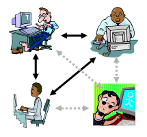{width=50%}常用沟通方式包括直接交谈、电话、电子邮件、会议、项目网站与书面报告，应根据信息的正式程度与复杂度选择。项目沟通活动包括规划沟通、建立基础设施、实施阶段性评审与定期小组会议。

**软件项目规划**对资源、成本和进度作出合理估算并制定计划：确定项目目的与范围、分解工作任务（WBS）、估算规模与资源、制定进度与成本计划。软件项目计划（SPMP，IEEE 1058）是用以协调所有计划、指导实施与控制的文件，并随项目进展定期完善。

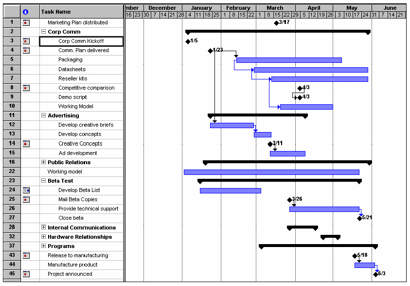{width=60%}

**规模估算**的常用技术有：**代码行技术**（从历史经验估算代码行数，简单但依赖详细分解且受语言影响）；**功能点技术**（依据外部输入、外部输出、外部查询、内部逻辑文件、外部接口五个信息域特征计算未调整功能点总数 U，再乘以调节系数得到功能点，即 FP＝U×（0.65＋0.01×F），其中 F 为各复杂度调整因子之和，适合开发初期）；**专家判断**（Delphi 方法达成共识）；**类比估算**（与历史相似项目比较）；**COCOMO 模型**（用经验公式估算工作量 $E=aL^b$ 与开发时间 $D=cE^d$，并可通过 17 个工作量因素调节）。
功能点的计算式为

$$FP=U\times(0.65+0.01\times F)$$

其中 $U$ 为未调整功能点总数，$F$ 为各复杂度调整因子之和；系数 0.65 与 0.01 界定了功能点对调整因素的敏感范围。由于不依赖具体语言与实现，功能点在开发初期即可估算，与代码行技术互补。

基本 COCOMO 模型按项目类型给出经验系数，如下表所示。

| 项目类型 | a | b | c | d | 适用对象 |
|----------|-----|-----|-----|-----|-----------|
| 组织型 | 2.4 | 1.05 | 2.5 | 0.38 | 各类应用软件 |
| 半独立型 | 3.0 | 1.12 | 2.5 | 0.35 | 各类实用程序、编译程序等 |
| 嵌入型 | 3.6 | 1.20 | 2.5 | 0.32 | 实时处理程序、控制程序、操作系统等 |

进度计划常以甘特图呈现，一个敏捷项目的迭代计划与里程碑如图所示。

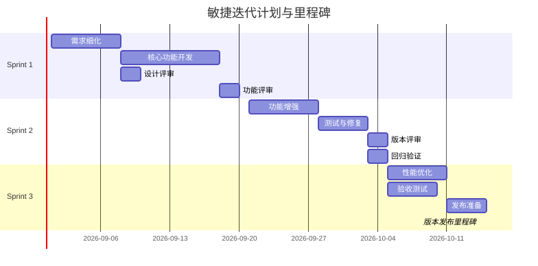{width=85%}

## 风险管理

软件风险管理通过主动而系统地对风险进行全过程的识别、分析和监控，最大限度地降低风险的影响。风险分为**项目风险**（影响进度与资源）、**产品风险**（影响质量与性能）与**业务风险**（影响组织）。

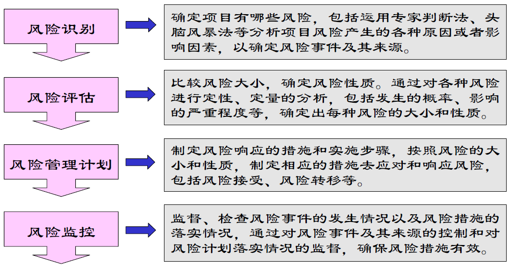{width=60%}

- **风险识别**：用头脑风暴法与风险检查表系统识别已知和可预测的风险（技术、人员、组织、工具、需求、估算等类型）；
- **风险分析**：定性地评估风险影响与可能性并排序，定量地量化概率与后果（分为可忽略、轻微、严重、灾难四级）；
- **风险规划**：针对重大风险制定应对策略——**规避**（降低发生可能性）、**缓解**（减小影响）、**转移**（转给第三方）、**接受**（准备应急方案）；
- **风险监控**：跟踪监视项目状态，及早发现风险征兆，及时采取应急措施、纠正行动或修改应对计划。
以某项目为例，各主要风险的分析结果如下表所示。

| 风险 | 类型 | 概率 | 影响 |
|------|------|------|------|
| 规模估算可能非常低 | 软件规模 | 60% | 严重 |
| 用户数量大大超过计划 | 软件规模 | 30% | 轻微 |
| 复用程度低于计划 | 软件规模 | 70% | 严重 |
| 最终用户抵制该计划 | 商业影响 | 40% | 轻微 |
| 交付期限将被缩短 | 商业影响 | 50% | 严重 |
| 项目资金不到位 | 客户相关 | 40% | 灾难性 |
| 用户将改变需求 | 软件规模 | 80% | 严重 |
| 技术达不到预期的效果 | 开发技术 | 30% | 灾难性 |
| 人员流动频繁 | 开发人员 | 60% | 严重 |

风险的严重程度可用**风险暴露度**定量刻画——概率与影响的乘积：

$$RE=P\times I$$

其中 $P$ 为风险发生的概率，$I$ 为风险发生造成的影响（如成本与进度损失）。将概率与影响等级化后，团队可依据 $RE$ 值对风险统一排序，优先处置暴露度最高的风险——这正是风险分析从"定性描述"走向"定量排序"的关键一步。

## 案例：火星气候轨道器的度量教训

度量看似只是"细节"，却在 1999 年酿成代价约 1.25 亿美元的航天事故。NASA 的火星气候轨道器（Mars Climate Orbiter）于 1999 年 9 月进入火星轨道时烧毁于火星大气层。调查确认根源是**软件接口的度量单位不一致**：地面导航软件按英制（磅·秒）输出推力冲量，航天器上的导航软件却按公制（牛顿·秒）解读，二者相差约 4.45 倍，导致轨道器以远低于设计的轨道接近火星。

| 环节 | 实际情况 | 应当做法 |
|------|----------|----------|
| 接口契约 | 单位约定未固化到接口规格 | 接口文档明确各数据的物理量与单位 |
| 单位校验 | 接收方未检查量纲即使用 | 输入校验包含单位与量纲检查 |
| 评审度量 | 轨迹偏差未被评审流程捕获 | 评审设接口与单位合规检查项 |

错误使实际近火点高度仅约 57 公里，远低于设计的约 150 公里，轨道器进入大气层后解体。调查委员会同时指出，接口契约不完整、缺乏跨系统评审与单位校验是深层原因。**度量要防的不是"算错"，而是"约定失效"**——把单位、格式这类接口契约写进规格并在评审中核查，正是项目管理在接口上的责任。

## 案例：沟通失败的项目事故

这是一则**典型**的沟通事故，情节常见于许多真实项目。需求方在例会上口头确认"新版本需兼容旧接口"，开发方据此按新接口实现，测试方仍按旧文档编写用例，三方都默认"反正有人会把需求同步给所有人"。结果上线当天新旧接口互不兼容，只能回滚返工，酿成发布事故。

| 环节 | 各自的理解 | 缺失的环节 |
|------|-----------|-----------|
| 需求方 | 口头确认即视为"共识" | 把变更记录在案并正式通知 |
| 开发方 | 按最新理解实现即可 | 与测试方核对验收口径 |
| 测试方 | 按旧文档测试 | 从同一信息源获取需求 |

事故的直接原因是**信息不同步**，深层原因是**责任真空**——每个环节都"以为有人负责"传达信息，实际无人负责。沟通计划的价值正在于此：明确谁在何时、以什么形式把需求变更通报给谁，把"以为"变成"记录在案"。本节仅为教学示意，不指涉任何具体组织。

## 样例：项目风险登记表

**风险登记表**把风险识别与分析的结果固化为一张可持续跟踪的表格，是风险管理落到实处的载体。表中逐条登记风险、评估**可能性**与**影响**、综合给出**等级**，并为每条风险指定**应对措施**（责任人略去）。以下是一个软件项目的风险登记表示例，覆盖进度、人员、需求与技术四类典型风险。

| 风险 | 可能性 | 影响 | 等级 | 应对措施 |
|------|--------|------|------|----------|
| 核心开发人员离职 | 中 | 严重 | 高 | 关键模块结对、知识沉淀与文档化 |
| 需求持续蔓延 | 高 | 严重 | 高 | 变更控制把关，超范围走变更流程 |
| 第三方组件未能按期交付 | 中 | 严重 | 中 | 提前验证、备选方案、预留缓冲 |
| 新技术栈学习曲线高于预期 | 中 | 中等 | 中 | 小范围技术验证先行、安排培训 |
| 关键里程碑进度落后 | 低 | 严重 | 中 | 每周挣值监控，落后即启动纠偏 |

登记表不是一次填完便束之高阁的静态文档，而应随项目推进**定期复查**：风险发生则转入应对，风险消失则关闭，新风险则登记入表。把风险落到表格，是把"担心"变成"管理"的第一步。

## 案例：风险被忽略的典型项目

这是一个**典型**的风险管理反面案例：团队并非没有识别风险，而是把识别停在了"知道"层面。项目依赖一个刚发布、文档不全的第三方框架，团队评估时明确列出"该框架可能在中期发生破坏性升级"这一高风险，结论却是"到时再看"，未准备任何预案。风险如期发生——框架更新破坏了既有接口，团队紧急返工，整个交付延期数周。

| 风险被"知道" | 风险被"管理" |
|-------------|-------------|
| 开会时口头提醒一句 | 写入风险登记表并定级 |
| 结论"到时再看" | 制定规避或缓解预案 |
| 未设早期征兆 | 明确触发预警的指标 |
| 发生时被动救火 | 发生时按预案行动 |

这个案例揭示**风险管理的价值在未发生时已经体现**：预案未必用得上，但提前想清应对路径，能让团队在风险真来时按计划行动而非临时救火。识别而无预案，等于把风险从"可知"退回到"不可控"。

## 软件配置管理

软件在变化过程中产生新版本，配置管理是一种标识、组织和控制修改的技术。**配置项**是为配置管理而作为单独实体处理的工作产品；**基线**是已通过正式复审、可作为进一步开发基础的规格说明或中间产品，标志着过程里程碑，只有通过正式的变更控制才能改变。

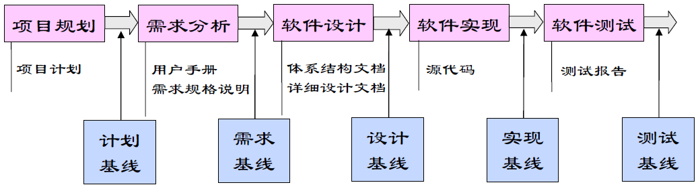{width=55%}

配置管理活动包括**配置项标识、版本管理、系统构建与变更控制**。版本管理对系统的不同版本进行标识与跟踪，保证技术状态一致；系统构建把软件组件编译连接为可运行程序；变更控制建立控制规程，有意识地管理变更。

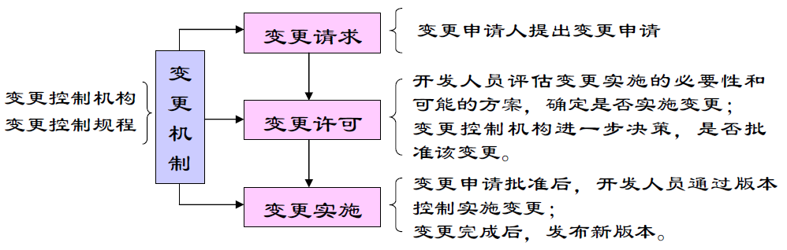{width=55%}常用工具包括 Rational ClearCase、Microsoft SourceSafe、CVS 等版本控制系统。

## 智能化管理

AI 正在重塑项目管理的多个环节：根据历史数据与功能点**自动估算**规模与成本；分析风险清单与项目状态**预测**风险并推荐应对策略；从提交记录与任务状态**生成**项目进展报告；在 CI/CD 流水线中**自动执行**构建、测试与发布，配置管理与版本控制演变为自动化的交付管线。

智能管理的核心变化是把管理者的精力从"收集信息"转向"做出决策"——AI 负责数据整理、趋势分析与异常告警，管理者负责权衡取舍与人事判断。毕竟项目管理归根结底是面向人的活动，沟通、激励与团队建设是任何工具都无法替代的。

智能估算的价值在于把估算从"拍脑袋"推向"有依据"：以历史项目的规模、复杂度与实际成本为数据训练模型，可以给出置信区间并随项目数据更新而修正。但估算模型仍然受数据完备性与项目独特性限制——没有历史的新技术栈、首次进入的业务领域，模型的参考意义有限，此时专家判断（Delphi）反而更可靠。成熟的做法是把 AI 估算与专家判断**互为校验**：当二者分歧显著时，往往是需求理解或历史数据存在盲区，值得停下来说明原因。估算的结果应始终以区间而非点值呈现，并随项目演进持续校准。

管理决策的人因同样值得强调：AI 可以预测风险发生概率、生成进展报告、推荐资源分配，但"接受哪个风险、投入多少资源、调整谁的职责"这类权衡，最终涉及团队士气、组织战略与利益相关者期望，无法从数据中直接推导。智能管理的最优形态是"AI 把信息与选项准备好，管理者做最后的判断并承担后果"——这样既释放了管理者的信息处理负担，也保住了管理的责任边界。智能管理范式下 AI 与人的分工如下表所示。

| 维度 | AI 承担 | 人保留 |
|------|------|------|
| 信息 | 数据整理、趋势分析、异常告警 | 解读信息背后的业务含义 |
| 决策 | 给出估算区间与候选选项 | 权衡取舍、承担后果 |
| 人事 | 提供进展与风险材料 | 沟通、激励与团队建设 |
| 边界 | 不替代人的判断 | 涉及士气与战略的决策由人做出 |

智能管理实现了从"收集信息"到"做出决策"的范式转变，如图所示。

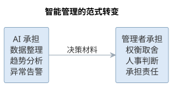{width=85%}

AI 把信息与选项准备好，管理者做最后的判断并承担后果——这正是智能管理的责任边界。

### AI 辅助估算、进度跟踪与风险识别

智能管理落到具体任务上，主要体现在估算、进度与风险三类活动。以**AI 辅助估算**为例，其工作流可归纳为五步：准备输入（整理历史项目数据、功能点规模、团队构成与技术栈，明确估算粒度）；生成区间（让 AI 给出规模、成本与工期的区间估计，并说明每项数值的依据来源）；交叉校验（与 COCOMO 等传统模型及专家判断对照，显著分歧往往暴露需求理解或数据盲区）；校准修正（根据分歧原因修正输入并写入项目计划）；持续更新（随迭代实际数据滚动校准，让区间随项目演进收敛）。

**进度跟踪**中，AI 汇总提交记录、任务状态与站会纪要，自动生成进度日报，并依据挣值管理的 SPI 与 CPI 给出偏差告警；**风险识别**中，AI 对照风险检查表从技术、人员、组织、工具、需求、估算六类扫描项目文档与近期变更，输出风险清单与早期征兆。三类活动中 AI 的产出与人的把关如下表所示。

| 活动 | AI 产出 | 人工把关 |
|------|------|------|
| 规模与成本估算 | 带依据的估算区间 | 与专家判断交叉校验、修正输入 |
| 进度跟踪 | 进度日报与 SPI/CPI 偏差告警 | 判断纠偏取舍与资源调整 |
| 风险识别 | 按检查表输出的风险清单 | 确认优先级、制定应对策略 |

### 智能管理的度量指标

AI 引入管理后需要度量其真实效果。常用指标包括：**采纳率**（AI 建议被采纳的比例，反映建议质量与团队信任——过高可能滑向"建议即决策"，过低说明建议与场景不匹配）、**交付周期**（需求从提出到上线的时长，反映整体效能，解读须排除范围变化干扰）、**缺陷率**（上线后的缺陷与返工比例，防止效率提升以质量下降为代价）与**估算偏差率**（实际相对估算的偏差，用于校准估算模型与输入数据）。

| 指标 | 反映 | 解读要点 |
|------|------|------|
| 采纳率 | AI 建议被采纳的比例 | 过高警惕"建议即决策"，过低检查建议质量 |
| 交付周期 | 需求到上线的时长 | 整体效能，须排除范围变化干扰 |
| 缺陷率 | 上线后的缺陷与返工比例 | 防止效率提升以质量下降为代价 |
| 估算偏差率 | 实际相对估算的偏差 | 校准估算模型与输入数据 |

这些指标用于**改进而非考核**：它们揭示趋势与瓶颈，具体数值须结合项目上下文解读，不宜跨团队简单比较，更不应变成掩盖问题的指标游戏。

### 智能管理的提示词模板

把风险识别交给 AI，可用下面的模板。它把风险检查表固化为提示词，并约束 AI 只依据给定材料输出、缺失信息标注"未知"，以避免依据幻觉：

```text
你是资深软件项目经理。请基于以下项目材料，按风险检查表
（技术、人员、组织、工具、需求、估算六类）识别风险：
- 项目：XX 系统二期，团队 8 人，两周迭代
- 当前阶段：需求基线冻结，进入编码与单元测试
- 已知状态：[粘贴项目周报、WBS、近期变更记录与风险清单]
请输出：1）按类别列出风险，标注可能性（低/中/高）与
影响（低/中/高）；2）风险暴露度最高的前 3 项及早期征兆；
3）每项给出应对策略（规避/缓解/转移/接受）。
要求：只依据材料中的信息，缺失信息标注"未知"，不要编造。
```

同类模板可改写为**进度日报摘要**（要求汇总完成、受阻与风险三栏）或**估算校验**（要求列出每个数值的依据）。模板的关键不是让 AI"猜得准"，而是约束其依据来源与表达形式，使产出可核查、可进入管理者的判断流程。

### 智能管理的局限与失败模式

AI 辅助管理在具体任务上也有可复现的失败模式，识别它们才能守住管理底线：

| 失败模式 | 典型表现 | 应对要点 |
|------|------|------|
| 依据幻觉 | 缺少历史数据仍给出看似精确的估计 | 要求标注依据与置信度，无法给出时标"未知" |
| 上下文遗漏 | 漏掉需求变更、人员变动，导致风险漏报 | 把周报与变更记录固化为模板输入，定期刷新 |
| 数据时效 | 用过期数据生成日报与告警 | 校验数据时间戳，异常数据先人工核实 |
| 平均化偏差 | 历史平均掩盖个别项目的特殊背景 | 与专家判断交叉校验，保留例外说明 |

这些失败模式提醒：AI 的估算、日报与风险清单只是**决策材料**，管理者须追问其数据来源、时效与缺失，而不是被精确的外表所迷惑。

## 智能化管理实践

智能化管理的落地工具覆盖项目管理的各个环节：

- **项目助理**：AI 依据需求与历史数据生成任务分解（WBS）初稿，从提交记录、任务状态与会议纪要自动汇总周报与进展报告，把管理者从信息整理中解放出来；
- **智能估算与计划**：基于功能点与历史成本给出规模、成本与工期的估计区间，随迭代数据更新，与 COCOMO 等传统模型交叉校验；
- **风险仪表盘**：持续监控风险清单与项目状态，按概率与影响重新排序风险，对超阈值风险自动告警并附应对建议；
- **配置与发布自动化**：版本控制、构建、测试与发布固化为流水线，配置项与基线由工具自动管理，变更控制保留人工审批环节。

智能化管理工具对项目各环节的支撑如图所示。

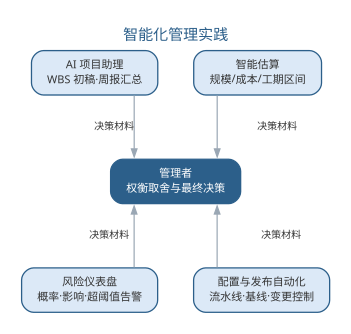{width=65%}

智能化管理有一条不可逾越的边界：**AI 的建议必须经过管理者的权衡才能生效**。AI 生成的估算区间、风险排序与资源方案，应被视为"决策材料"而非"决策本身"；涉及人事、激励与外部承诺的决策，永远由人做出。当项目本身涉及 AI 系统开发时，还需要把数据获取、模型训练与评测纳入计划与风险，相关过程管理见第 16 章。

进度与成本的量化监控常用**挣值管理**（EVM）。由计划值 PV、挣值 EV 与实际成本 AC 三个基础量，可派生四个核心指标：

$$CV=EV-AC,\qquad SV=EV-PV,\qquad CPI=\frac{EV}{AC},\qquad SPI=\frac{EV}{PV}$$

各指标的含义与判断如下表所示。AI 可自动汇总这些指标并给出趋势告警，但"如何纠偏"的取舍仍需管理者权衡。

| 指标 | 计算 | 含义 | 判断 |
|------|------|------|------|
| 成本偏差 CV | $EV-AC$ | 成本偏离计划的程度 | 小于 0 说明超支 |
| 进度偏差 SV | $EV-PV$ | 进度偏离计划的程度 | 小于 0 说明落后 |
| 成本绩效 CPI | $EV/AC$ | 单位成本获得的挣值 | 小于 1 说明成本效率低 |
| 进度绩效 SPI | $EV/PV$ | 单位进度的挣值产出 | 小于 1 说明进度效率低 |

### 智能化管理实践实例：AI 风险识别

一个应用风险识别模板的实例如下。某 Scrum 团队进入编码阶段，项目经理把项目周报、WBS 与近期变更记录填入模板后交给 AI。AI 输出的风险清单中，前三位为：其一，团队首次使用新技术栈，基于功能点的规模估算可能偏低，且缺少同类历史数据支撑；其二，用户代表中途更换，需求理解存在断点，变更风险上升；其三，两名成员在同一迭代内休假，与冲刺排期冲突。

项目经理与技术负责人复核后，确认前两项与事实相符并纳入风险登记，制定了"技术验证早启动"与"需求二次确认"的应对；第三项与排期核对属实，调整了任务分配。同时他们发现 AI 漏报了两类风险：客户合同条款谈判延期属于业务风险，不在项目材料中；组内一位成员对新技术栈的抵触情绪属于人员士气问题——二者都需要管理者的业务判断与当面沟通才能获知。

与纯人工头脑风暴相比，AI 把检查表扫描自动化，且不易遗漏"工具、组织"等冷门类别，风险会议时间从小时级缩短到分钟级；但它的产出"全而不深"，把"哪些风险值得处置、如何沟通化解"留给管理者。这个实例再次印证：AI 负责把清单铺开，人负责把判断做实。

### 智能化管理的要点与误区

智能化管理的核心误区，是把 AI 的建议当作"决策本身"，或在数据不足的领域强行依赖模型。要点与误区如下表所示。

| 误区 | 典型表现 | 应对要点 |
|------|------|------|
| 建议即决策 | 估算区间、风险排序直接执行 | AI 建议须经管理者权衡才能生效 |
| 无历史也强上模型 | 新领域估算盲目信任 AI | 无历史数据时专家判断更可靠，互为校验 |
| 只给点值不给区间 | 估算看似精确实则脆弱 | 以区间呈现估算，随项目演进持续校准 |
| 忽视管理的人因 | 用数据替代沟通与激励 | 人事、激励与外部承诺的决策永远由人做出 |

智能估算与专家判断的交叉校验——分歧显著时往往暴露盲区——如图所示。

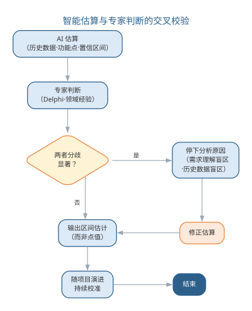{width=55%}

智能管理的最优形态是"AI 把信息与选项准备好，管理者做最后的判断并承担后果"——既释放了管理者的信息处理负担，也保住了管理的责任边界。

### 前沿演进：DevOps 度量与 AI 驱动效能管理

前沿的管理实践用**DORA 四指标**量化研发效能：交付周期、部署频率、变更失败率与恢复时间（MTTR）——它们被实证研究证实与软件交付绩效强相关。**价值流管理**（VSM）把交付过程映射为价值流，识别瓶颈。AI 驱动的效能分析自动汇总提交、构建、部署与事故数据，生成效能报告与改进建议，让"管理决策"建立在数据而非直觉之上。DORA 四指标如下表所示。

| 指标 | 含义 | 改进方向 |
|------|------|------|
| 交付周期 | 提交到上线的时长 | 小批量、自动化 |
| 部署频率 | 上线频次 | 持续交付 |
| 变更失败率 | 上线后回滚/修复比例 | 测试与评审质量 |
| 恢复时间 | 故障恢复时长 | 可观测性与预案 |

DORA 指标驱动的效能改进环——从度量到改进——如图所示。

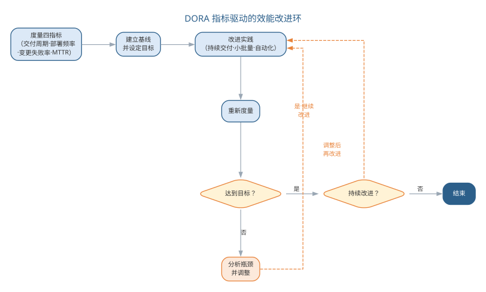{width=75%}

度量不是为了考核，而是为了改进——DORA 指标揭示效能瓶颈，AI 让数据采集与归因自动化，但"如何改进组织流程与团队协作"的取舍，仍然需要管理者的判断，这正呼应本章强调的智能管理边界。

## 本章小结

软件项目管理以计划、组织和控制达成成本、进度与质量目标。沟通渠道公式与估算模型揭示了"控制变化、降低复杂性"的数量化根源；风险识别与配置管理把不确定性变成可处置的清单。智能管理把 AI 引入估算、进度、风险与度量全流程：AI 把信息与选项准备好，管理者做最后的判断并承担后果。采纳率、交付周期、缺陷率等指标用于改进而非考核；依据幻觉、上下文遗漏等失败模式须靠交叉校验与人工复核兜底。无论工具多智能，沟通、激励与人事判断始终属于人。

**思考与讨论：**
1. 为什么 AI 估算应给出区间而非点值？它与专家判断互为校验的价值在哪里？
2. 用本章的风险识别模板分析一个你熟悉的项目，AI 的产出与你的人工判断有何异同？
3. 若把采纳率、交付周期等指标用作团队考核，可能引发哪些行为偏差？
