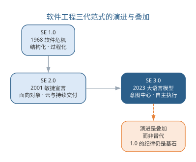
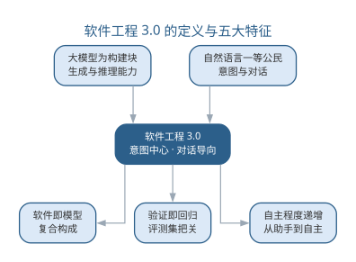
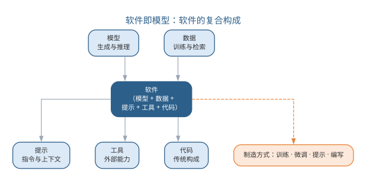
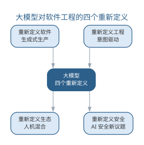
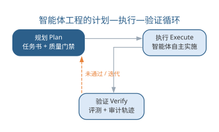
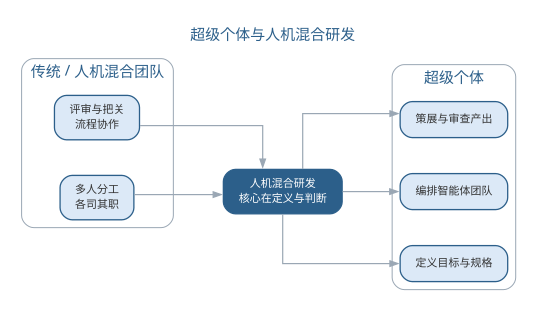

# 软件工程 3.0：大模型驱动的研发新范式

第 13 章把大模型确立为软件开发的**基础设施**，从开发范式与平台组织两个层面重构了软件过程。本章把这一重构放到软件工程半个多世纪的演进脉络中，给出一个里程碑式的判断：以大语言模型为核心的**软件工程 3.0（Software Engineering 3.0, SE 3.0）**，已经成为继结构化/过程化（SE 1.0）、敏捷/对象化（SE 2.0）之后的新一代软件工程范式。它不再只是"用 AI 辅助软件开发"，而是以**意图**为中心、以**对话**为方式，把"编写软件"扩展为"模型+数据+提示+工具+代码"的复合生产。本章依次讨论三代范式的演进、SE 3.0 的定义与特征、软件即模型、大模型对软件工程的四个重新定义、SE 3.0 的研发平台与工具链、Vibe Coding 与智能体工程两种新兴方法论，以及超级个体与人机混合研发的组织形态；自主执行将在第 15 章展开，治理与未来将在第 16 章收束全书。

## 从软件工程 1.0 到 3.0

软件工程的发展史可以被概括为三次**范式转换**（paradigm shift）——每一次都由新的开发矛盾驱动，带来新的核心载体与新的方法论。1968 年 NATO 会议提出"软件危机"，软件生产的核心矛盾是大型软件的复杂度失控，于是有了软件工程 1.0：以**结构化方法**与**瀑布式过程**为骨架，用过程纪律应对复杂度，核心载体是文档与流程图。2001 年敏捷宣言标志着软件工程 2.0：市场要求软件快速变化，软件以**面向对象**与组件化应对演化，以敏捷迭代、持续交付与云计算支撑高频发布，核心载体是对象与代码、以测试与可工作软件为准绳。两次转换的共同特征是：软件仍然由人逐行编写，方法论解决的是"如何组织人的编写"。

2023 年前后，以 GPT-4 为代表的大语言模型能力跃迁，使"机器直接生成代码"第一次成为普遍可用的生产力。软件生产的矛盾随之从"写不快"转向"说不清"与"验不准"：瓶颈不再是把设计写成代码，而是把模糊意图说成可校验的规格、把生成结果验证到可信——软件工程 3.0 由此拉开序幕。三代范式的对照如下表所示。

| 维度 | SE 1.0 | SE 2.0 | SE 3.0 |
|------|------|------|------|
| 兴起 | 1968 软件危机 | 2001 敏捷宣言 | 2023 大模型能力跃迁 |
| 核心矛盾 | 复杂度失控 | 快速变化 | 意图不清、验证不足 |
| 核心载体 | 文档与过程 | 对象与代码 | 意图、上下文与工具 |
| 生产方式 | 人写代码 | 人写代码、测试驱动 | 人定义、模型生成 |
| 人机关系 | 无 AI | AI 辅助（copilot） | AI 协作者（teammate） |
| 代表方法 | 结构化、瀑布 | 敏捷、持续交付 | 意图驱动、智能体工程 |

三代范式的演进路线如图所示。

{width=75%}

三代范式的演进不是"替代"而是**叠加**：SE 1.0 的过程纪律仍是工程底线，SE 2.0 的对象化与敏捷仍是大规模协作的骨架，SE 3.0 在两者之上把"由模型生成"确立为默认生产方式。正如第 12 章路线图所示，AI4SE、SE4AI、智能体协作与 AI 原生进路正是 SE 3.0 在不同层面的体现——它没有推翻此前的方法，而是把此前方法中"人写"的部分交给模型，把人的精力释放到定义与验证上。理解三代叠加的意义还在于消解许多"新"争论：比如"AI 会不会取代程序员"在三代叠加的视角下会显形为一个老问题——每一次范式转换都重新定义了"编写"的含义，但没有一次让"责任"消失。

识别当前阶段所处的位置，对组织与个人都有现实意义。对组织而言，判断是否进入 SE 3.0，不是看是否采购了大模型工具，而是看三个标志：首要产物是否从"代码"变为"规格与验收"，生产方式是否从"人写、机器校验"变为"机器生成、人策展"，质量关口是否前移到门禁与评测回归。对个人而言，三代叠加意味着能力结构的叠加：SE 1.0 的结构化思维、SE 2.0 的对象与敏捷素养仍是地基，SE 3.0 在之上新增的是意图表达与验证设计的能力——越早意识到"新增而非替代"，越能避免在范式转型中把既有的工程素养当作可弃之物。

## 软件工程 3.0 的定义与特征

软件工程 3.0 尚无公认的统一定义，但主流学术界定给出了两个关键特征：**意图中心**（intent-centric）与**对话导向**（conversation-oriented）——前者指开发活动围绕人的意图组织，规格、验收标准与约束取代逐行代码成为首要产物；后者指人机交互以自然语言对话为主要方式，开发过程从"编辑—编译—运行"循环变为"对话—生成—验证"循环。据此，本书把软件工程 3.0 定义为：**以大语言模型为核心构建块、以意图与对话为交互方式、以"模型+数据+提示+工具+代码"为软件形态、以验证回归为质量前提的软件工程范式**。

与 SE 2.0 相比，SE 3.0 呈现五个特征，如下表所示。

| 特征 | 内涵 | SE 2.0 的对照 |
|------|------|------|
| LLM 为构建块 | 模型是能力的基础组件 | 模型只是可选工具 |
| 自然语言一等公民 | 意图与对话成为第一交互 | 语言是注释与命名 |
| 软件即模型 | 软件形态扩展为复合体 | 软件形态即代码 |
| 验证回归 | 质量前提是"可验证才交付" | 质量前提是评审与测试 |
| 自主程度递增 | 环节执行逐步交给模型 | 执行始终在人 |

五个特征之间的关系如图所示。

{width=80%}

五个特征中最根本的是"LLM 为构建块"，其余四个都从它派生：模型能生成代码，自然语言才成为一等公民；模型可演化，软件才成为"可训练"的形态；模型会犯错，验证才成为前提；模型能执行动作，自主程度才可能递增。这给出 SE 3.0 的工程含义：**能力由模型决定，质量由验证决定，边界由人决定**。工程师面对的不再是"如何写对"，而是"如何把意图说清、把验证做够、把边界守住"。需要强调的是，五个特征描述的是范式全貌而非现实全貌——大多数组织在相当长的时期里处于 SE 2.0 与 SE 3.0 的混合态：部分环节由模型生成、部分环节保留人工实现。范式判断的意义不在于"是否全面进入 3.0"，而在于"是否按 3.0 的逻辑组织开发"：把模型当构建块、把验证当前提，即便只在一个环节落地，也已经站在了 3.0 的坐标系上。

以一个日常开发任务为例，可以直观看到两种范式的差异。需求："为订单列表增加按金额区间筛选"。SE 2.0 的做法是人写实现代码、补一个单元测试、走一遍评审；SE 3.0 的做法是把需求改写为规格与验收——"输入金额区间 [a, b]，列表返回实付金额落在区间内的订单，边界含两端"，由模型生成实现与测试，门禁自动检查后，人对规格与异常路径做审查。两者的工作量差别不大，但注意力的落点完全不同：前者盯着"代码怎么写"，后者盯着"规格说清了没有、验证做够了没有"。这个例子同时说明，SE 3.0 不是"全部交给模型"，而是把人的判断前移到规格与验证两个关口。

## 软件即模型

SE 3.0 最深刻的变化是对"软件是什么"的回答。传统上软件即代码——由人编写、由编译与测试验证的静态文本。SE 3.0 提出**软件即模型**（Software as a Model, SaaM）：软件不是一段代码，而是**模型、数据、提示、工具与代码**共同构成的复合体——模型提供生成能力，数据与知识库提供事实基础，提示与上下文组织行为，工具把能力接到现实系统，代码保留需要确定性逻辑的部分。五者的构成关系如图所示。

{width=80%}

软件形态的变化带来**制造方式**的变化。传统软件只有一种制造动作：**编写**（write）；SE 3.0 的制造动作扩展为四类：**训练**（train）——用大规模领域数据塑造模型底座能力；**微调**（fine-tune）——用小规模数据调整模型行为；**提示**（prompt）——用上下文组织即时行为；**编写**——对确定性逻辑仍保留手工实现。四种动作在成本、可控性与迭代速度上差异巨大，如下表所示。

| 制造动作 | 成本 | 可控性 | 迭代速度 | 适用 |
|------|------|------|------|------|
| 训练 | 极高 | 中 | 慢 | 底座模型 |
| 微调 | 高 | 中高 | 中 | 领域能力 |
| 提示 | 低 | 中 | 快 | 行为定制 |
| 编写 | 中 | 高 | 中 | 确定性逻辑 |

制造方式的分层带来一个工程推论：**能用低成本的制造动作解决，就不用高成本的**。行为定制优先用提示，提示达不到再考虑微调，训练则是最后的手段——这与第 11 章模型路由按任务难度选择模型档位的思路一脉相承，只是把选择的粒度从"模型档位"扩展到"制造方式"。

软件即模型对软件生命周期的影响是全方位的：需求阶段从"写文档"变为"写规格与验收"；实现从"写代码"变为"提示与策展"；测试从"设计用例"变为"构建评测集"；运维从"监控代码"变为"监控模型行为与数据漂移"。更根本的是，软件的生命周期从"部署即结束"变为**部署后仍在演化**——模型的行为会随数据、提示与模型版本变化，软件的维护从"改代码"扩展到"改数据、改提示、换模型"。因此软件即模型要求工程者以对待代码的纪律对待模型、数据与提示：任何行为变更都要可追溯、可回滚、可评测。一个直观的例证是第 10 章讨论的模型漂移：模型部署后，线上数据分布变化会导致行为退化——在软件即模型的视角下，这不再是"运维问题"，而是"软件本身在演化过程中偏离了规格"，必须用评测集回归去发现、用回滚与再训练去修复。

上述影响可以用两张对照表固化下来。先看软件五要素各自落在生命周期的哪些环节、由什么制造动作产生、靠什么保证质量：

| 构成要素 | 生命周期主要落地 | 制造方式 | 质量关注 |
|------|------|------|------|
| 模型 | 底座能力与能力路由 | 训练、微调、版本切换 | 能力评测、版本回滚 |
| 数据 | 检索库、评测集、微调语料 | 采集、清洗、标注 | 数据漂移、污染防制 |
| 提示 | 规格、任务书、上下文模板 | 编写与调优 | 版本化、可回滚 |
| 工具 | 对外能力的接口与权限 | 定义、封装、注册 | 权限收敛、审计留痕 |
| 代码 | 确定性逻辑与集成骨架 | 编写与生成 | 门禁、回归测试 |

再看生命周期活动本身，其制造方式几乎都从"编写"映射为"提示、微调与评测"：

| 生命周期活动 | SE 2.0 制造 | SE 3.0 制造 | 说明 |
|------|------|------|------|
| 需求分析 | 编写需求文档 | 提示：意图写成规格与验收 | 提示词模板沉淀为规格资产 |
| 架构设计 | 编写架构文档 | 提示+编排：任务分解与上下文组装 | 人定边界，模型出方案 |
| 编码实现 | 编写代码 | 提示：模型生成，人策展 | 确定性逻辑保留编写 |
| 能力塑形 | 不适用 | 微调：领域数据调整行为 | 领域能力用微调实现 |
| 测试设计 | 编写测试用例 | 评测：构建评测集并回归 | 测试目标转为评测目标 |
| 缺陷修复 | 编写补丁 | 提示：描述缺陷让模型修复 | 修复闭环走门禁回归 |
| 运维监控 | 编写监控脚本 | 监控：观察行为与数据漂移 | 运维从代码转向行为 |

两张表给出一个统一读法：**软件即模型的落地，是把"编写"这一单一制造动作拆解为五要素各自的生产与验证动作**。由此每个生命周期阶段都要回答同一个问题——该阶段的产物由谁制造、由谁验证、可否回滚；能回答这个问题，才谈得上把模型、数据与提示当作与代码同等地位的工程资产。

软件即模型还改变了对"资产"的界定。传统软件工程管理代码、文档与配置三类资产；SE 3.0 至少要追加三类：**提示资产**——提示词模板与上下文片段，组织方式见第 13 章上下文资产；**数据资产**——用于检索与评测的语料，版本化与防污染见第 11 章评测集；**模型资产**——模型版本、微调产物与路由配置。这三类资产与代码享有同等的工程待遇：版本化、可回滚、有负责人。团队若仍只把代码当资产、把提示与数据当"临时输入"，软件即模型就会退化为"不可维护的模型拼贴"，这正是 SE 3.0 落地时最常见的隐性失败。

## 大模型的四个重新定义

如果说软件即模型回答了"软件是什么"，那么大模型还重新定义了"软件工程是什么"。业界把这一影响归纳为**四个重新定义**：重新定义软件、重新定义工程、重新定义生态、重新定义安全。四个维度的展开如下表所示。

| 重新定义 | 核心变化 | 工程含义 |
|------|------|------|
| 重新定义软件 | 软件从代码扩展为复合体 | 软件是模型+数据+提示+工具+代码 |
| 重新定义工程 | 从编写转向意图与验证 | 流程按生成能力重设计 |
| 重新定义生态 | 从人与工具转向人机混合 | 智能体成为协作成员 |
| 重新定义安全 | 从代码漏洞扩展到行为风险 | 提示注入、数据污染、模型漂移 |

四个重新定义及其递进关系如图所示。

{width=80%}

四个重新定义与本书此前的展开一一对应：**重新定义软件**即本章的软件即模型；**重新定义工程**即第 13 章的意图驱动与规格即代码——流程按生成能力重设计，人从环节执行退到定义与把关；**重新定义生态**即第 13 章的人机混合团队——智能体从工具变为可考核的协作成员，组织以任务集、评测集与审批流为基础设施；**重新定义安全**则指向第 16 章——大模型时代的安全威胁从"代码漏洞"扩展到"模型行为"，提示注入、供应链投毒、数据污染与模型漂移成为新的防线对象。四个重新定义不是四个独立议题，而是同一件事的四个侧面：**软件的生产者、生产方式、生产组织与安全边界同时被模型改变**。理解这一点，才能理解 SE 3.0 为何不是"加一个 AI 工具"的局部改进，而是牵动工程全过程的结构性变迁。仍以订单系统为例，四个重新定义可以在一次变更中同时体现：给商品介绍增加 AI 生成摘要——软件形态上，它引入"模型+提示+数据"的新组件（重新定义软件）；工程流程上，生成结果需要评测集与门禁把关（重新定义工程）；组织上，负责生成与审查的不再是单一角色，而是人与智能体的协作（重新定义生态）；安全上，摘要生成可能被提示注入操纵、数据可能被污染（重新定义安全）。一次看似局部的功能，同时牵动软件形态、工程流程、组织分工与安全边界——这正是四个重新定义"同一件事的四个侧面"的直观注脚。

## 软件工程 3.0 的研发平台与工具链

范式要落地，必须由研发平台承载。SE 2.0 的平台围绕"代码如何构建、集成与发布"组织；SE 3.0 的平台要把**模型接入、评测、门禁、智能体编排与审计**组织为与构建发布并列的一等能力。业界尚无统一的产品形态，但能力框架已趋收敛，大致可以归纳为五层，如下表所示。

| 平台能力 | 支撑对象 | 关键机制 | 传统平台对应 |
|------|------|------|------|
| 模型接入 | 模型成为可调用的构建块 | 路由、配额、版本与回滚 | 依赖与运行时管理 |
| 评测 | 产出是否可信 | 评测集、基准回归、对抗样例 | 测试与质量保障 |
| 门禁 | 产出是否可合入 | 分级门禁、回归拦截 | 持续集成（CI） |
| 智能体编排 | 多智能体如何协作 | 任务书、工具沙箱、PEV 循环 | 流水线与调度 |
| 审计 | 变更是否可追溯 | 过程留痕、审批流、责任归属 | 版本控制与合规 |

五层之间不是并列而是递进：模型接入是底座，评测给模型产出"打分"，门禁依据评测结果决定"放行"，编排把放行后的环节串成可自主执行的流程，审计为整个流程留下责任证据。组织这五层时有三条设计原则值得坚持。其一是**门禁前移**：评测与门禁尽量贴近产出源头，每次生成、每次合入都过评测，而不是等集成之后才发现问题——这与第 13 章分级门禁的思路一脉相承。其二是**沙箱隔离**：智能体执行必须落在受控的工具沙箱中，权限按任务书最小授权，防止自主执行越权扩散——这是第 15 章自主执行安全边界在平台层的落实。其三是**审计闭环**：任何一次变更都要能回答"谁下达的目标、哪个模型生成、依据哪份数据、谁批准合入"——审计不是事后追责的摆设，而是让自主执行可以被信任的前提。

工具链的另一层变化在人机接口。传统工具链以编辑器、调试器与 CI 面板为中心，人是操作者；SE 3.0 的工具链以**对话工作台**（conversational workbench）为中心，把代码仓库、评测集、门禁状态与任务书一并呈现在对话窗口中，人通过自然语言下达意图、查看验证结果、处理门禁失败。IDE 不会消失，但退居为"确定性逻辑的编辑器"，与对话工作台共同构成新的开发环境。判断一个平台是否真正面向 SE 3.0，有一条简单标准：是把模型路由、评测集、门禁通过率与审计留痕当作一等状态展示，还是把它们藏在一堆工具设置里——前者是范式平台，后者只是给补全工具加了一层外壳。

研发平台的成熟度，直接决定 SE 3.0 是"被当作更聪明的代码补全"还是"真正重构了流程"。平台建到哪一层，组织的开发方式就走到哪一步：只有模型接入，组织还停留在工具增强；补上评测与门禁，才谈得上质量前移；加上编排与审计，才具备把环节交给智能体的底气。因此对组织而言，平台不是 SE 3.0 落地之后的选择题，而是范式落地的**先决条件**。

## 新兴开发方法论：Vibe Coding 与智能体工程

SE 3.0 的实践形态仍在快速演化，2025 至 2026 年间先后兴起两种标志性方法论：**Vibe Coding** 与**智能体工程**（agentic engineering）。第 11 章曾在人机协同谱系中把 Vibe coding 作为"完全委托"的极端形态提及，本章把它们放入范式框架中展开。

**Vibe Coding** 由 Andrej Karpathy 于 2025 年 2 月提出，指"完全沉浸在氛围中"的编码方式：用自然语言描述需求，全程接受 AI 建议、不读 diff、把错误信息直接粘贴回对话让模型修复。Karpathy 的描述颇具画面感：他几乎不碰键盘，用语音输入软件对模型说出"把侧边栏的间距缩小一半"这类请求，遇到错误就把报错粘贴回去，必要时"随机改几处直到问题消失"；他把这种体验总结为"我看见、我说出、我运行、我粘贴"。它把编码门槛降到几乎为零——原型、演示与一次性脚本可以在几小时内从语音描述长成可用程序。它的价值在于**原型快速验证**：以最低成本回答"能不能做"。但它的风险同样清晰：不读 diff 意味着技术债不可见，盲目接受意味着**AI 垃圾**（AI slop）——看似合理实则错误的产出——直接进入代码库；不审不测的产出对生产系统是灾难。因此 Vibe Coding 的适用边界是**低风险、短生命周期、可丢弃**的原型；生产系统仍需工程纪律兜底。

**智能体工程** 是 Karpathy 于 2026 年 2 月提出的接续概念：当智能体可以无人值守地连续工作数十分钟、完成"读代码—定位问题—制定计划—执行修改—运行测试"的完整闭环后，工程师的默认工作方式从"写代码"变为**编排智能体**——他用一个夸张的比例概括：99% 的时间在协调多个智能体、1% 的时间在写代码，而人始终以监督者身份在场。与 Vibe Coding 相比，智能体工程的差别不在"AI 写多少"，而在**结构化程度**：任务以目标与边界下达，执行遵循**规划—执行—验证**（Plan–Execute–Verify, PEV）循环，每一步产出以能否通过门禁为准绳，过程留痕进入审计链路。智能体工程的执行闭环如图所示。

{width=70%}

以 PEV 循环下达任务的提示词模板如下：

```text
请作为智能体团队负责人，把以下任务下达给编码智能体：
任务目标：{{要实现的功能与用户价值}}
约束：{{技术栈、依赖、禁止事项}}
验收标准：{{可运行的验证条件，如测试用例或评测集}}
执行要求：
1. 先读相关代码，理解现状再动手
2. 修改后运行测试与静态检查
3. 说明关键改动及其理由
4. 无法满足的验收标准须显式报告，不得含糊绕过
```

一个典型的智能体工程任务是这样运转的：工程师把"为日志模块补充错误率监控告警"作为目标下达，规划智能体先读监控配置与告警规则、产出实施计划；执行智能体按计划修改代码与配置、补齐测试；验证阶段由评测集与静态检查把关，告警规则用历史日志回放验证；工程师只审查计划、抽查关键改动、批准合入。全程约 30 分钟，人实际参与的不到十分钟，但每一分钟都落在判断上——这与 Vibe Coding"人全程在场却几乎不做判断"形成了鲜明对比。

两种方法论的对照如下表所示。

| 维度 | Vibe Coding | 智能体工程 |
|------|------|------|
| 提出 | 2025，Karpathy | 2026，Karpathy |
| 人的角色 | 接受建议、不读 diff | 定义意图、编排、验证 |
| 质量手段 | 几乎没有 | 门禁、评测、审计 |
| 适用场景 | 原型、演示、一次性脚本 | 生产系统、团队协作 |
| 主要风险 | 技术债、AI slop | 自主执行放大错误 |

把智能体工程与第 11 章的人机协同谱系对照会更清楚：第 11 章按"完全委托—引导委托—结对协作—专家咨询"划分了人与模型交互的模态；Vibe Coding 处于"完全委托"的极端——人几乎不做干预；智能体工程则处于"引导委托"与"结对协作"之间——人不再逐行参与，但通过目标、门禁与审查保持结构化控制。两者的区别不是"人参与多少"，而是"人的参与是否结构化"：Vibe Coding 的参与是零散的（看到报错才介入），智能体工程的参与是制度化的（每个门禁都是预设的介入点）。

智能体工程有一个重要心智模型——**能力锯齿分布**：LLM 并非"全能或全不能"，而是"有的环节极强、有的环节极弱"的锯齿形能力分布。Karpathy 以"LLM 是鬼魂不是动物"作比：它像鬼魂一样在某些方面远超人类、在某些方面离奇地笨，且这种分布并不直观。工程上因此要**逐环节探测能力**：对生成、审查、修复、写测试等每个环节单独评测，把可靠的环节交给智能体，把不可靠的环节留给人或加验证——这正是第 13 章分级门禁与第 15 章自主性分级的依据。智能体工程同样给出一条人机分工的准则：**可以外包思考，不能外包理解**——模型可以代为生成，但对系统为什么这么设计、边界在哪里、风险是什么，人必须保有理解；否则无法验证，也就无从把关。

### 从原型到生产的实践路径

两种方法论不是二选一的立场，而是**同一项目生命周期中前后衔接的两站**：Vibe Coding 擅长回答"能不能做"，智能体工程擅长回答"能不能长期做"。从原型到生产的典型路径分三站：原型期用 Vibe Coding 以最低成本验证可行性，产出可丢弃、不做承诺；固化期把通过验证的原型转入智能体工程，用 PEV 循环与门禁补上评测与结构，回到前文所示的计划—执行—验证闭环；生产期以评测集回归与审计留痕为底线长期演化。各阶段的目标、方法与底线如下表所示。

| 阶段 | 目标 | 推荐方法 | 工程底线 |
|------|------|------|------|
| 原型期 | 回答"能不能做" | Vibe Coding | 可丢弃、不承诺、不接生产数据 |
| 固化期 | 从原型到可维护 | 智能体工程 + PEV | 补评测、走门禁、明确负责人 |
| 生产期 | 长期演化与责任 | 智能体工程 + 审计 | 评测回归、过程留痕、可回滚 |

何时离开原型期，有三个信号值得留意：原型将被长期使用、将接入真实用户与真实数据、或需要多人协作维护。出现任一信号，都应尽快转入固化期；反过来，如果任务本就是一次性脚本、演示或教学示例，停留在 Vibe Coding 反而是合理选择——滥用工程纪律与滥用快速原型同样是成本。适用边界的判断，最终回到本章与第 11 章反复出现的同一条原则：**人的参与方式要与风险匹配**。

## 超级个体与人机混合研发

当智能体工程成为默认生产方式，"一个工程师 + 一支 AI 智能体团队"的**超级个体**（individual-company）成为可能：单人借助智能体完成原本需要一个小团队的编码、测试、部署与维护工作。超级个体是第 13 章人机混合团队在个体尺度的延伸——团队级人机混合是"工程师团队 + 智能体成员"，超级个体是"一个工程师 + 多个专职智能体"。两者的支撑基础设施相同：任务集、评测集与审批流——即使只有一个工程师，这些基础设施依然是工程底线，而不是可以省略的组织装饰。超级个体的人机分工与协作形态如图所示。

{width=85%}

但超级个体有清晰的边界。其一是**规模边界**：单人可驾驭的上下文、任务数量与并行度有限，多项目、多系统的组织级工程仍需要团队。其二是**责任边界**：个体可以编排智能体执行，但验收、部署与对外承诺的责任无法外包——事故时站在责任位置上的人不会因为"是智能体写的"而免责。其三是**能力边界**：能力锯齿分布决定了单模型加单编排者存在短板，跨领域的知识、判断与经验仍需人的积累。因此超级个体不是"一人公司的万能答案"，而是 SE 3.0 时代组织形态的一个极端：它放大了个体效率，也把个体的判断与责任放大到极限。从传统团队到人机混合团队再到超级个体，组织形态的连续谱系将在第 16 章随组织与人才演进继续讨论。

超级个体的实践形态已经出现：一位独立开发者借助智能体团队，在一个月内完成了过去需要一个四人小组完成的工具产品——需求、编码、测试与发布文档由智能体分工承担，他本人负责规格定义、关键路径审查与对外承诺。这个例子也暴露了超级个体的暗面：产品交付得快，但可靠性依赖开发者自身的把关能力——评测集是否完备、门禁是否真的拦截了回归、事故时能否定位到根因，全部压在一个人的判断上。超级个体的规模越大，越需要把第 13 章的治理基础设施做扎实，而不是相反。

### 前沿演进：从提示驱动到自主执行

前沿实践正从"提示驱动"走向"自主执行"：工程师不再逐次与模型对话，而是把目标、边界与验证标准一次性下达，让智能体自行规划、执行并汇报。这一转变的度量尺度是**自主性分级**——从模型建议、人批准，到授权自主、有条件自治——以及随之而来的信任与治理问题。自主软件工程将在第 15 章系统展开；它的边界、风险与治理，将在第 16 章与全书结语中收束。

## 本章小结

本章把 AI 原生范式上升为软件工程 3.0：三代范式叠加演进，SE 3.0 以意图中心与对话导向重新定义开发方式；软件即模型把软件扩展为模型+数据+提示+工具+代码的复合体，制造方式从编写扩展到训练、微调与提示，研发平台以模型接入、评测、门禁、编排与审计五层能力承接落地；四个重新定义从软件、工程、生态与安全四个侧面刻画了范式变迁；Vibe Coding 适合原型快速验证，智能体工程以 PEV 循环与门禁面向生产，二者共同指向"编排智能体"的默认工作方式。能力锯齿分布提示我们逐环节验证，超级个体放大了个体效率也放大了责任。可以外包思考，不能外包理解——判断与责任始终属于人。

**思考与讨论：**
1. 三代软件工程范式是"替代"还是"叠加"？试举一个你熟悉的工程实践，说明它如何同时体现三代范式的要素。
2. 软件即模型把制造方式从"编写"扩展到"训练/微调/提示"，这对软件工程的度量与验收提出了哪些新要求？
3. 以你最近的一次 AI 编码经历为例，判断它更接近 Vibe Coding 还是智能体工程，并说明理由。
4. 若要为团队搭建 SE 3.0 研发平台，模型接入、评测、门禁、编排、审计五层能力中你会优先建设哪三层？说明理由。
