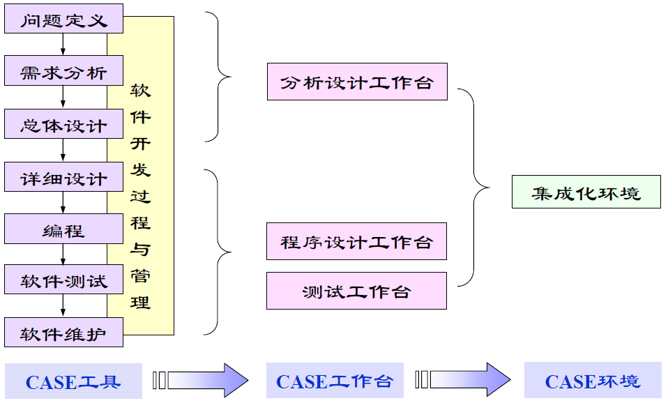
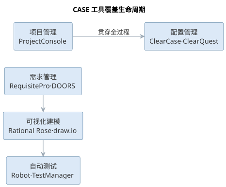
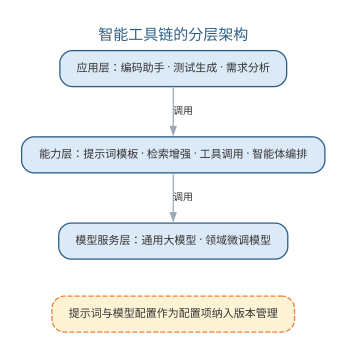
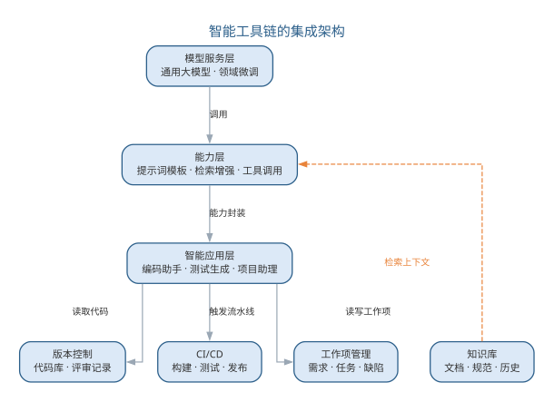
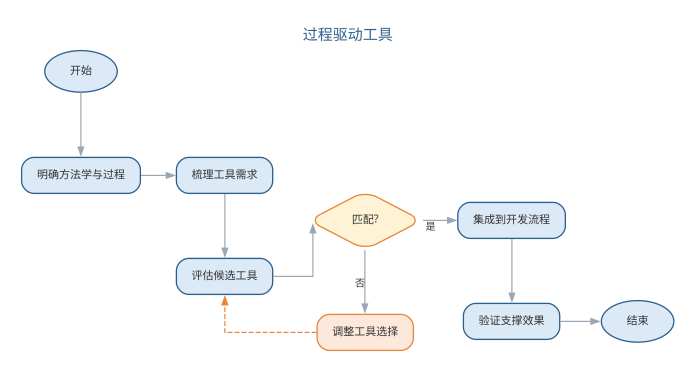
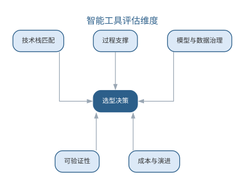
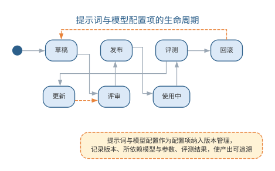
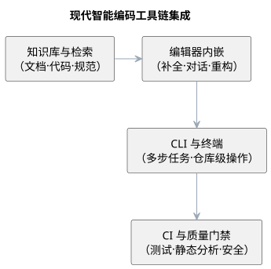

# CASE 与智能软件工程工具

所有的软件工程方法都需要工具的支持。CASE（计算机辅助软件工程）是一组工具和方法的集合，用于辅助软件开发、维护、管理过程中的各项活动，促进软件过程的工程化与自动化。CASE 的核心思想是"把软件开发中可重复、可机械化的部分交给工具完成，让人专注于创造性工作"。

{width=60%}

## CASE 工具

CASE 工具覆盖软件生命周期的各个环节：用于系统模型的图形编辑器、管理设计实体的数据字典、生成用户界面的 GUI 工具、辅助生成文档的报告生成器、支持程序纠错的调试器，以及代码生成器等。按照所支撑的活动，CASE 工具可分为：

- **开发过程管理**：如 RUP 及其配套方法；
- **需求管理**：如 RequisitePro、DOORS，支撑需求获取、跟踪与变更控制；
- **可视化建模**：如 Rational Rose、draw.io，绘制 UML 图并支持正向/逆向工程；
- **自动测试**：如 Robot、TestManager，支撑测试用例管理与自动化执行；
- **项目管理**：如 ProjectConsole，支撑计划、进度与资源管理；
- **配置管理**：如 ClearCase、ClearQuest，支撑版本控制与变更管理；
- **开源工具**：如 CVS（版本管理）、UML Modeler、UML2EJB（模型到代码转换）。

CASE 工具的演进经历了从"单点工具"到"集成环境"再到"工具链"的过程：早期的工具各自独立、数据难以共享；集成 CASE 环境统一数据字典，使各活动共享模型；今天的现代工具链则通过 API 与自动化流水线将开发、测试、构建、发布连接成一体。各类 CASE 工具及其作用如下表所示。

| 类型 | 代表工具 | 作用 |
|------|------|------|
| 开发过程管理 | RUP 及配套方法 | 支撑过程与方法 |
| 需求管理 | RequisitePro、DOORS | 需求获取、跟踪与变更控制 |
| 可视化建模 | Rational Rose、draw.io | UML 建模与正逆向工程 |
| 自动测试 | Robot、TestManager | 用例管理与自动化执行 |
| 项目管理 | ProjectConsole | 计划、进度与资源管理 |
| 配置管理 | ClearCase、ClearQuest | 版本控制与变更管理 |

CASE 工具覆盖软件生命周期各环节，如图所示。

{width=65%}

从需求到配置管理，各环节工具相互衔接；现代工具链进一步用 API 与流水线把它们连接成一体。

## LLM 时代的智能工具链

大语言模型催生了新一代的智能软件工程工具，它们不是替代而是**增强**了传统 CASE 工具：

- **AI 编码助手**：在编辑器中提供代码补全、函数生成、解释、重构与缺陷提示，是程序员最直接的"结对伙伴"；
- **智能需求与建模工具**：从自然语言生成用例、类图与数据字典，从代码逆向生成 UML 模型；
- **智能测试工具**：自动生成测试用例、分析覆盖率、定位缺陷根因并建议修复；
- **智能 CI/CD**：把构建、静态检查、测试、安全扫描与发布固化为自动化流水线，提交即触发，质量门禁前置；
- **智能知识库与检索**：基于 RAG 的文档问答、代码搜索与最佳实践推荐，让团队经验可检索、可复用。

智能工具链的显著特征是"以模型为中枢"：自然语言描述被转换成提示词驱动模型产出代码、测试与文档，传统 CASE 工具作为执行与验证的下游环节被串联起来。由此，"工具"的边界也从软件本身延伸到模型与提示词——提示词工程、模型评估与版本管理成为工具链的新组成部分。

以模型为中枢的工具链呈现分层结构：底层是模型服务（通用大模型与领域微调模型），中间是能力层（提示词模板、检索增强、工具调用、智能体编排），上层是面向生命周期各环节的应用（编码助手、测试生成、需求分析）。这种结构让"换模型"与"改流程"解耦——提示词与工具链配置作为可版本化的资产，随模型升级而演进，而不必重写各环节的应用。对团队而言，工具链治理的起点是把提示词与模型配置当作**配置项**纳入版本管理：记录提示词版本、所依赖的模型与参数、评测结果，使任何产出都可追溯。

以模型为中枢的工具链分层结构如图所示。

{width=60%}

智能工具链的成熟还取决于与既有工程资产的集成：AI 工具需要读取代码库、运行测试、读写工作项，因此权限模型与审计机制必不可少——AI 工具的访问范围应当可配置、可追溯，避免模型在无人知晓的情况下修改关键配置或发布产物。工具链的边界由此从"提高效率"延伸到"保障可控"，这也是智能工具链区别于传统 CASE 工具集的重要标志。以模型为中枢的工具链按分层组织，各层的职责如下表所示。

| 层次 | 组成 | 职责 |
|------|------|------|
| 模型服务层 | 通用大模型、领域微调模型 | 提供生成与推理能力 |
| 能力层 | 提示词模板、RAG、工具调用、智能体编排 | 把模型能力封装为可复用服务 |
| 应用层 | 编码助手、测试生成、需求分析 | 面向生命周期各环节的应用 |

### 智能工具链的选型矩阵

选型的第一步是按环节建立矩阵，明确每一环节用什么样的工具、解决什么问题、有什么局限。以环节为行的选型矩阵如下表所示。

| 环节 | 代表工具 | 适用场景 | 主要局限 |
|------|------|------|------|
| 需求分析 | 智能需求助手 | 从对话与文档提炼需求、生成用例与验收标准 | 歧义识别需人工确认 |
| 设计建模 | 智能建模工具 | 从自然语言生成类图、时序图草图 | 生成模型须校正语义 |
| 编码 | 编码助手 | 补全、函数生成、多文件重构 | 规范符合性与跨文件能力受限（选型见第 9 章） |
| 测试 | 智能测试工具 | 生成单元测试、覆盖率分析、缺陷定位 | 生成用例须过真实测试套件 |
| CI/CD | 智能流水线 | 质量门禁、构建失败归因、自动发布 | 依赖既有流水线集成 |
| 项目管理 | 智能项目助理 | 周报汇总、估算区间、风险提示 | 数据在项目工具中，须打通 |
| 知识管理 | 智能知识库 | 代码搜索、文档问答、最佳实践推荐 | 检索质量取决于语料组织 |

矩阵的价值在于把"追新工具"转化为"对号入座"：先定位环节，再考察工具在该环节的适用场景，最后评估其局限能否被团队接受。局限往往比亮点更值得关注——它决定了工具引入后需要补哪些人工把关。

选型还应讲究操作顺序：先建立候选清单，按环节定位可能的工具；再对每个候选做小规模背靠背对比（bake-off），用团队的真实样例评估其输出质量；最后做一次一周以内的试点，记录采纳率与问题清单再决定是否推广。用真实样例评估往往比看宣传文档有效——AI 工具的效果高度依赖它与团队代码、数据与规范的匹配度。对中小团队而言，也不必每个环节都引入智能工具：优先增强流程中最慢、最痛、最可验证的环节，其余环节保持既有方式，往往比全面铺开更容易成功。

### 智能工具链的集成架构

智能工具链的价值取决于与既有工程资产的集成深度。集成架构由模型服务层、能力层与智能应用层构成，应用层经 API 与插件协议连接版本控制、CI/CD、工作项管理与知识库：编码助手读取代码库与评审记录，测试生成工具触发流水线并读取结果，项目助理读写工作项，知识库为能力层提供检索上下文。智能工具链的集成架构如图所示。

{width=70%}

集成有三个要点。其一，**权限与审计**：AI 工具访问代码库、触发流水线、读写工作项的权限按最小化原则配置，操作留痕可追溯；其二，**数据流可控**：代码库通常只读，测试在沙箱中执行，避免模型在无人知晓的情况下修改关键配置或发布产物；其三，**配置即资产**：提示词模板、模型选择与参数、检索的语料范围都作为配置项纳入版本管理，使任何 AI 产出都可回溯其上下文。集成架构让"换模型"与"改流程"解耦——模型升级只影响模型服务层，各环节应用与治理配置保持不变。

集成最常见的失败不是模型能力不足，而是三类工程问题：其一是**数据打通被低估**——AI 工具读不到代码库与工作项，成了"孤岛"，价值无从发挥；其二是**流程被工具绑架**——为适配工具而改造既有过程，违背"过程驱动工具"原则；其三是**权限与审计缺失**——AI 访问范围过宽或操作不留痕，出了问题无法追责。这三类问题的共同根源，是把集成当成"接插件"而非"工程改造"。

### 智能工具链的建设与治理步骤

智能工具链的建设与治理可归纳为六步：其一，**盘点现状**，梳理既有工具链与流程，明确哪些环节需要 AI 增强、哪些环节保持人工；其二，**选型评估**，按选型矩阵与评估维度对比候选工具，优先选择与既有工具集成良好的产品；其三，**小范围试点**，在一个特性团队试用，建立采纳率、交付周期等基准，观察真实使用方式；其四，**集成固化**，经 API 与插件接入既有流水线与数据，配置最小权限与审计留痕；其五，**治理制度化**，提示词与模型配置纳入版本管理与评测，关键环节保留人工确认与回退通道；其六，**度量化改进**，用指标评估效果与边界，决定推广范围并持续调优。

六步的次序很重要：选型在盘点之后，试点在集成之前，治理贯穿全程。评估维度与治理要求将在后文"工具的选择与应用"与"智能工具链的建设与治理"两节展开。

工具链不是一次性工程，而是随模型与需求持续演进的生命周期资产。模型升级、提示词迭代与团队规模变化都会改变工具链形态，因此治理配置要与代码一起维护、定期回顾——每一次 AI 产出都应当能回答"用了什么模型、什么提示词、什么数据、谁确认"。这正呼应了"工具越多，治理越重要"。

## 工具的选择与应用

工具只是手段，工程效果取决于如何使用。选择工具应考虑：与团队技术栈的匹配、与现有工具链的集成能力、对过程的支撑（而非束缚）、以及学习与维护成本。在实践中应遵循"过程驱动工具"而非"工具驱动过程"的原则——先明确方法学与过程，再选择支撑该过程的工具。

对智能工具尤须审慎：AI 生成内容的正确性需要验证，提示词与模型需要版本管理与评测，工具引入不应绕过既有的评审、测试与配置管理纪律。智能工具链真正提升的是"把纪律低成本地贯彻"的能力，而非替代纪律本身。工具选择遵循"过程驱动工具"的原则，选择流程如图所示。

{width=80%}

先明确方法学与过程，再评估工具对过程的支撑——工具只是手段，工程效果取决于如何使用。对智能工具的选型，还需补充考察其对 AI 能力的依赖与治理能力，考量维度如下表所示。

| 考量维度 | 考察内容 |
|------|------|
| 与现有工具链集成 | 能否接入既有流水线与代码库 |
| 输出可验证性 | AI 产出是否可检查、可追溯、可回滚 |
| 模型与数据治理 | 是否支持提示词/模型版本管理与隐私保护 |
| 权限与审计 | 访问范围是否可配置、操作是否留痕 |
| 成本与演进 | 按量计费与随模型升级的迁移成本 |

## 智能工具链的建设与治理

建设智能工具链的首要问题是选型与评估。除前文"过程驱动工具"的一般原则外，智能工具还须考察其对 AI 能力的依赖与治理能力，评估维度如下表所示。

| 评估维度 | 考察内容 |
|------|------|
| 技术栈匹配 | 与项目语言、框架、既有工具的集成能力 |
| 过程支撑 | 对开发、测试、发布流程的支撑而非束缚 |
| 模型与数据治理 | 是否支持提示词/模型版本管理、数据与隐私保护 |
| 可验证性 | AI 输出是否可检查、可追溯、可回滚 |
| 成本与演进 | 许可成本、按用量计费、随模型升级的迁移成本 |

选型之后是持续的治理：提示词与模型配置纳入版本管理与评测（记录版本、模型、参数与效果指标）；AI 工具的权限按最小化原则配置，操作可审计；AI 生成内容在关键环节保留人工确认与回退通道。对引入的每一类智能工具，团队都应回答两个问题：它的产出如何被验证？它的失败如何被及时发现？

工具是过程的固化。智能工具链的真正价值不在于工具的堆砌，而在于把工程纪律——评审、测试、配置管理与审计——以更低的成本落实到每一次 AI 参与的活动中。智能工具链与模型运维（MLOps）同源，模型服务的部署与监控将在第 16 章讨论；提示词与智能体的治理则在第 17 章展开。智能工具选型须考察其对 AI 能力的依赖与治理能力，评估维度如图所示。

{width=70%}

选型之后的持续治理——版本管理、最小权限与人工确认通道——让每一个 AI 参与的活动都可验证、可追溯。

### 智能工具链的落地实例：编码助手的引入与治理

一个完整的落地实例：某 12 人 Java 团队在既有 GitLab CI、SonarQube 与 Jira 基础上引入对话式编码助手，目标是提升单元测试生成与多文件重构效率。团队按六步推进——盘点确认"测试生成"与"重构"最值得增强；选型对比编辑器内嵌与 CLI 工具后，确定重构场景用对话式助手；先在一个特性团队试点两周，接入代码库（只读）与 CI 流水线。

试点很快暴露了问题：AI 生成的测试有的针对内部实现细节而非公开行为，重构后大量失效。团队把约束写入提示词模板：

```text
你是资深测试工程师。请为以下接口生成单元测试：
接口：[方法签名与前置条件]
要求：1）基于公开行为编写断言，不依赖内部实现细节；
2）覆盖正常、边界与异常路径；3）使用 JUnit 5 与 Mockito；
4）断言描述业务效果而非实现细节。
```

同时把门禁收紧为"生成的测试必须通过 CI 既有测试套件才允许合入"，并跟踪采纳率与缺陷率的变化。结论是：样板测试的产出速度明显提升，但"哪些测试真正必要、边界条件是否完备"仍靠工程师判断。与人工编写相比，AI 提升了首版产出，而人工评审从"写"转向"审"——质量责任没有转移，只是环节前移。这个实例再次验证了治理清单的要求：验证 AI 的产出、及时发现其失败，缺一不可。

### 智能工具链的治理清单

智能工具链的成熟取决于与既有工程资产的集成与治理。提示词与模型配置应当像代码一样被版本管理，其生命周期如图所示。

{width=75%}

工具的治理要求可归纳为下表。

| 治理项 | 要求 | 工具手段 |
|------|------|------|
| 提示词与模型配置 | 纳入版本管理与评测 | 记录版本、模型、参数与效果指标 |
| 权限与审计 | 访问范围可配置、可追溯 | 最小化权限，操作留痕 |
| 输出可验证 | AI 产物可检查、可回滚 | 关键环节保留人工确认与回退通道 |
| 选型评估 | 考察对 AI 能力的依赖与治理能力 | 技术栈匹配、过程支撑、可验证性、成本演进 |

对引入的每一类智能工具，团队都应回答两个问题：它的产出如何被验证？它的失败如何被及时发现？

### 前沿演进：现代智能编码工具链生态

现代智能编码工具已形成**编辑器—CLI—CI—知识库**的全链路生态：编辑器内嵌的补全与对话助手（Copilot、Cursor）承担高频辅助；CLI 与终端工具（Claude Code、Codex）承担仓库级多步任务；CI 中的 AI 步骤（代码评审机器人、测试生成）把 AI 能力嵌入质量门禁；企业知识库（RAG）为生成提供上下文。工具链的选型日益取决于**可集成性与可治理性**——能否接入既有流水线、输出是否可审计。各环节承担的角色如下表所示。

| 环节 | 代表 | 承担角色 |
|------|------|------|
| 编辑器内嵌 | Copilot、Cursor | 补全、对话、重构 |
| CLI 终端 | Claude Code、Codex | 多步任务、仓库操作 |
| CI 质量门禁 | 评审机器人、AI 测试 | 生成、检查、把关 |
| 知识库 | RAG 检索、文档问答 | 上下文供给 |

现代智能编码工具链的集成链路——从编辑器到 CI——如图所示。

{width=60%}

工具链的边界已从"软件本身"延伸到"模型与提示词"，现代生态的关键是让每个环节的 AI 能力都可验证、可回滚——工具越多，治理越重要。

## 本章小结

CASE 工具把可机械化的开发活动交给工具，智能工具链进一步以模型为中枢，把自然语言变成驱动生成与验证的能力。选型坚持"过程驱动工具"，按环节矩阵考察适用场景与局限；集成架构把应用层、能力层与模型服务层接入既有工程资产，权限与审计保证可控；建设治理遵循"盘点—选型—试点—集成—治理—度量"的六步，提示词与模型配置像代码一样被版本管理。智能工具增强的是把纪律低成本贯彻的能力，而非替代纪律；AI 产出的验证与失败发现，始终是人与组织的责任。

**思考与讨论：**
1. 用选型矩阵为你的项目按环节选择智能工具，并说明各环节工具的主要局限。
2. 为什么提示词与模型配置要像代码一样纳入版本管理？如何回溯一次 AI 产出的责任归属？
3. "过程驱动工具"与"工具驱动过程"在实践中如何区分？请举一个反例。
