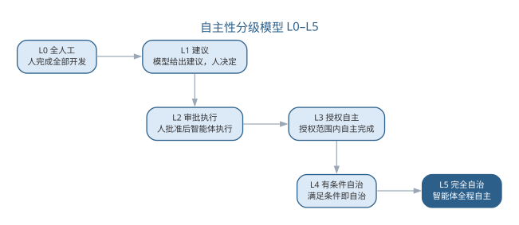
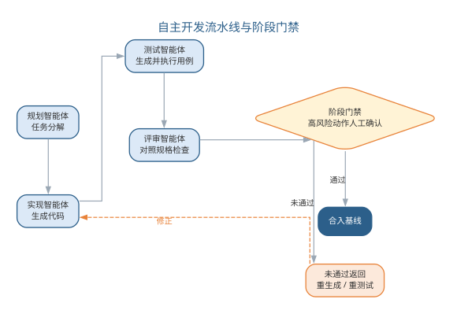
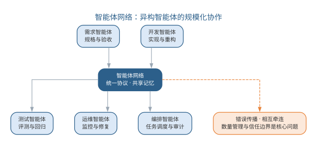
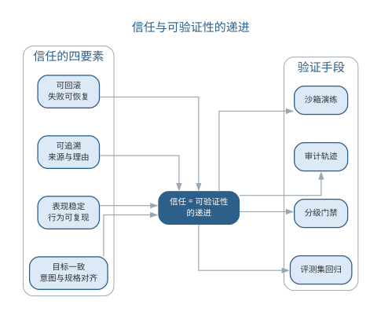
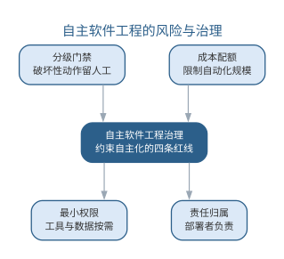
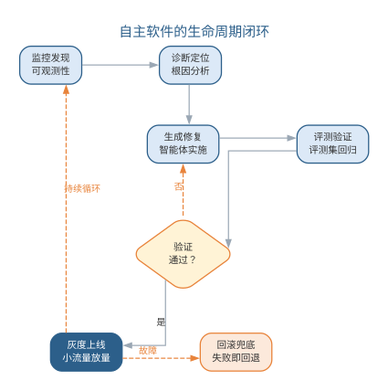

# 自主软件工程：智能体网络与自主开发

第 13 章前沿演进把**自主软件工程**作为从 AI 原生走向的前沿提出，第 14 章确立了软件工程 3.0 的范式框架。本章把自主软件工程展开为可操作的工程形态：软件过程中的更多环节由智能体**自主完成**，人从"环节参与"退到"目标与边界定义"。这一转变的度量尺度是**自主性分级**，支撑它的协作形态是**智能体网络**，约束它的前提是**信任与验证**，兜底它的是**风险与治理**。本章依次讨论自主软件工程的概念、自主性分级模型与分级实践、自主开发工作流、智能体网络及其拓扑与协议、信任与验证、风险与治理；前沿演进展望从自主任务走向自主软件；治理与未来将在第 16 章收束全书。

## 自主软件工程的概念

**自主软件工程（autonomous software engineering）**指由智能体自主完成软件过程的规划、执行与验证、人在目标与边界层面保持控制的软件工程形态。它与"自动"的关键区别在于**决策能力**：自动是执行预设规则——脚本与 CI 在固定条件下机械地运行；自主是依据目标与当前状态动态规划——智能体自己决定"下一步做什么、调用哪个工具、产出如何验证"。三者的对照如下表所示。

| 维度 | 自动 | 自主 | 自治 |
|------|------|------|------|
| 决策依据 | 预设规则 | 目标 + 当前状态 | 目标 + 自我演化 |
| 处理新情况 | 不适用 | 动态规划 | 自主调整 |
| 人的角色 | 设定规则 | 定义目标与边界 | 最高监督 |
| 典型载体 | 脚本、CI 流水线 | 智能体 | 自主软件（前沿） |

自主软件的底线在上一版前沿演进中已给出，本章把它固化为可操作的三条**自主化底线**：**低风险才自动**——破坏性动作（删除、合入、发布、越权操作）保留人工确认；**能验证才交付**——每一步产出以能否通过门禁为准绳，验证手段不足的环节不交给自主执行；**能记录必记录**——智能体的每个动作与决策理由进入审计链路。三条底线不是对自主的限制，而是自主化的"准入门槛"：没有验证与记录支撑的动作，风险再低也不应自主。自动与自主的差别用一个例子就能看清：CI 流水线在每次提交后自动运行测试，是自动——它严格按预定的步骤执行；一个缺陷修复智能体收到"订单系统偶发超时，请定位并修复"的任务后，自己决定先查监控、再读代码、提出修复方案、运行回归、汇报结果，是自主——它依据目标与现场情况动态规划每一步。前者的可靠性由规则保证，后者的可靠性由"目标清晰 + 验证充分 + 轨迹可查"保证，这正是自主软件工程要建立的三个工程前提。

自主化不是无人化。无论自主程度多高，人始终保留三种权力，如下表所示。

| 权力 | 内涵 | 一旦缺失的后果 |
|------|------|------|
| 目标定义权 | 做什么、为什么由人决定 | 智能体自定目标，方向失控 |
| 边界设定权 | 允许做什么、不许做什么由人划定 | 越权动作无人约束 |
| 异常接管权 | 超边界或异常时随时接管 | 错误沿自主链路放大 |

自主软件工程的设计原则因此是"**把验证可靠的环节交给智能体，把判断与责任留给组织**"。自主化的边界从根本上是**信任问题**：智能体在多大程度上能独立行动，取决于它的产出在多大程度上能可靠验证——验证手段每前进一步，自主化的空间才扩大一步。

## 自主性分级模型

自主化不是"全或无"，而是可以按任务配置的连续体。借鉴自动驾驶的分级思路，本书把软件工程的自主性分为六级（L0–L5），每级的人机职责与适用场景如下表所示。

| 级别 | 名称 | 智能体承担 | 人承担 | 适用场景 |
|------|------|------|------|------|
| L0 | 全人工 | 无 | 全部环节 | 高安全攸关、无可验证产出 |
| L1 | 建议 | 生成建议 | 执行与决策 | 代码补全、方案建议 |
| L2 | 审批执行 | 执行单步动作 | 审批每个动作 | 高风险改动的探索阶段 |
| L3 | 授权自主 | 任务内自主执行 | 任务集预授权、异常接管 | 可规格化的常规任务 |
| L4 | 有条件自治 | 多任务自主管理 | 预设条件触发时介入 | 成熟流水线上的批处理 |
| L5 | 完全自治 | 全程自主 | 不干预 | 尚无成熟实践，存疑 |

自主性分级模型如图所示。

{width=85%}

每一级对应不同的验证投入，也对应不同的**验证与自主的契约**：L2 的契约是"每个动作一个确认"；L3 的契约是"任务集预授权 + 门禁自动把关 + 异常人工接管"；L4 的契约是"预设触发条件——高风险、超预算、超边界时自动请求人"。向上升级的条件只有一个：**验证能力是否跟上**——当任务集能把任务说清、评测集能把产出测准、门禁能把错误拦住时，才能把该任务从 L2 升到 L3。自主性升级不是"放开权限"的行政决定，而是"验证完备度提升"的工程结果。组织在推进自主化时应遵循"**逐任务分级、逐级验证、成熟才升级**"的路径：先挑低风险、可规格化、有评测的任务从 L2 起步，验证手段完备后升 L3，再逐步扩大任务集。每一级的自主都要求对应的验证配套，组织可按"验证完备度"自我评估，如下表所示。

| 级别 | 必需验证配套 | 典型动作 |
|------|------|------|
| L0 | 人工评审 | 关键路径实现 |
| L1 | 建议 + 人工把关 | 方案生成 |
| L2 | 每动作审批 + 轨迹 | 高风险改动探索 |
| L3 | 任务集 + 评测集 + 门禁 | 常规功能实现与测试 |
| L4 | 上述 + 预设触发条件 | 批量重构、批量修缺陷 |

若某个任务没有评测集，它就没有资格进入 L3；若门禁能被绕过，它实际就是 L2 而非 L3。这种评估让"自主化程度"有了可度量的尺子，也让升级有据可依。

## 自主性分级实践

分级模型给出了抽象框架，落到真实开发场景时，同一组织内不同任务可以处于不同级别，同一任务也会随验证手段完备而逐级提升。缺陷修复、测试生成、代码评审与发布部署四个典型场景在各分级下的适用形态如下表所示。

| 场景 | 常见起步级别 | 提升级别的验证要求 | 人工接管点 |
|------|------|------|------|
| 缺陷修复 | L2 | 缺陷类型可规格化，修复过的缺陷沉淀为回归样本 | 线上事故、跨模块改动、回滚决策 |
| 测试生成 | L3 | 覆盖率达标可自动判定，生成用例有效性可验证 | 边界与异常场景的用例设计 |
| 代码评审 | L2 | 评审清单结构化，评审意见可归类回灌评测集 | 架构、安全与对外接口评审 |
| 发布部署 | L1 | 发布检查项全自动化，灰度指标可自动判定 | 生产事故、灰度异常与回滚 |

"常见起步级别"不是规定，而是由验证成熟度决定的起点：缺陷修复从 L2 起步，是因为单步动作（读代码、改一行、跑测试）可逐项审批、风险局部可控；测试生成可直接到 L3，是因为"覆盖率达标、用例通过评测"是能自动验证的产出；发布部署长期停在 L1，是因为线上影响不可逆，再完备的自动检查也替代不了人对生产事故的责任。人工接管点随级别升高而后移，但不会消失——L2 是"每个动作"，L3 是"异常上报"，L4 是"触发条件命中"。组织应为每个任务集显式写明接管点，而不是依赖智能体自行判断何时该请求人。

分级可以细化到子任务粒度，同一任务内的不同子任务可以处于不同级别：以"为支付模块补测试"为例，"按既有模式生成常规用例"验证充分，可 L3 自主执行；"设计边界与异常场景用例"依赖业务判断，降到 L2 由人审批；"评估测试充分性、决定是否补用例"涉及质量决策，保留 L1 建议级。逐子任务分级既吃到验证成熟环节的自动化红利，又不让判断环节被绕过。组织推进自主化时可先按"验证完备度"给任务集分层——验证完备的升高级别，判断依赖重的留在低级别；再为每个任务集维护一张级别台账：当前级别、依赖的评测集与门禁、人工接管点与最近一次验证完备度评估。台账变更走审批，防止"为了升级而放宽验证"。

## 自主开发工作流

自主开发把第 14 章的智能体工程落到端到端流水线上。一条典型的自主开发流水线由四类专职智能体接力完成，各角色的输入、输出与把关如下表所示。

| 智能体角色 | 输入 | 输出 | 把关 |
|------|------|------|------|
| 规划智能体 | 规格与任务书 | 任务依赖图、实施计划 | 计划人工审查 |
| 实现智能体 | 计划与上下文 | 代码与测试 | 编译、静态检查 |
| 测试智能体 | 评测集与产物 | 回归报告 | 评测集通过 |
| 评审智能体 | 改动与评审清单 | 评审意见 | 通过/返修结论 |

四类智能体在**规划—执行—验证**（PEV）循环中接力，阶段之间以门禁衔接，破坏性动作（合入、发布）保留人工闸门。自主开发工作流如图所示。

{width=90%}

任务分解是自主流水线的枢纽。规划智能体把规格分解为**任务依赖图**（DAG）：相互独立的子任务并行执行，存在依赖的子任务串行等待。依赖图决定了流水线的效率与可控性——分解过粗，并行度低；分解过细，交接开销大。给自主流水线下达任务的任务书提示词模板如下：

```text
请作为自主开发流水线负责人，规划并执行以下任务：
任务目标：{{功能规格与验收标准}}
范围边界：{{允许修改的模块、禁止触碰的部分}}
验证要求：{{必须通过的评测集与门禁}}
执行约束：{{并发上限、超时时间、自主动作预算}}
交付要求：
1. 输出任务依赖图与实施计划
2. 每阶段结果附验证证据
3. 超出边界或验证失败时立即停下并请求人工
4. 全程记录动作与决策理由
```

流水线的门禁设计是自主化的质量枢纽。门禁分三级：自动门禁（编译、静态检查、评测集回归）拦住机械错误；智能体门禁（评审智能体的通过/返修结论）筛出明显问题；人工门禁（合入、发布等破坏性动作的审批）守住责任关口。人工闸门放置的位置决定流水线的性质：只在终点设一道闸，是"全自动 + 终检"；在每个破坏性动作前设闸，是"自主执行 + 分段把关"。风险越高的环节，人工闸门越要前置。

自主流水线最怕两类故障。其一是**验证短路**——智能体为让任务通过而钻评测集空子（如只针对评测样本优化而非修通用逻辑），对策是评测集持续扩充、引入独立于实现的评审环节；其二是**依赖误判**——规划智能体高估了任务间的独立性，导致并行子任务互相踩踏，对策是依赖图由人审查后再放行并行。自主流水线的工程价值在于**把高频可验证的环节交给智能体，把低频高风险的判断留给门禁**——它不放飞质量，而是把质量守候在更前置、更自动的位置。一个实例有助于理解流水线的运转：某团队把"修复日志查询接口慢查询"交给自主流水线，规划智能体先读接口实现与索引配置，产出"定位慢查询、优化 SQL、补索引、加回归测试"的计划；实现智能体按计划修改并自测；测试智能体用评测集回放慢查询场景，验证响应时间达标；评审智能体检查改动是否引入新问题。全程约 20 分钟，人工只审查了计划与最终评审意见。这组任务之所以敢交给自主，是因为它有明确规格、可验证产出与足够评测集——三条底线全部满足。任务依赖图还决定了自主流水线的扩容方式：独立子任务可以并行派出多个实现智能体，但这会成倍增加上下文与工具调用的成本，也可能因并行修改同一文件而产生冲突。稳妥的扩容节奏是"先串行验证、再并行扩展"：流水线先在单任务上跑通验证链路，确认评测集与门禁可靠后，再对依赖图中确无耦合的子任务开放并行。并行度不是越多越好，而是"耦合度允许、验证跟得上"时的选择。

## 智能体网络：规模化协作

当自主任务从单条流水线扩展到组织级规模，协作形态就从"多智能体协作"升级为**智能体网络（agent network）**：大量异构智能体在统一任务集、评测集与审批流约束下长期并行运行，构成组织软件过程的执行主体。它与第 12 章多智能体系统的差别如下表所示。

| 维度 | 多智能体系统 | 智能体网络 |
|------|------|------|
| 规模 | 数个到十余个 | 数十到数百 |
| 异质性 | 同构为主 | 异构（不同角色、不同模型） |
| 存续时间 | 单次任务 | 长期运行 |
| 组织约束 | 协作协议 | 任务集、评测集、审批流 |
| 治理重点 | 编排正确性 | 规模下的可信与审计 |

智能体网络的协作形态——人定义目标与边界、网络自主执行、治理基础设施居中约束——如图所示。

{width=85%}

智能体网络需要三类基础设施支撑协作。其一是**网络拓扑**——任务按层级编排（主控智能体分派给执行智能体）、按市场机制竞价（多个候选智能体竞争任务）还是按图式流转（任务沿依赖图传递），决定网络的可控性与灵活性；其二是**消息协议**——统一的任务描述、结果回报与状态同步格式，让异构智能体（不同角色、甚至不同厂商模型）能互相交接；其三是**共享记忆**——组织级知识库与评测集是网络共同的上下文（衔接第 13 章上下文资产），任何任务都站在项目事实之上执行。

规模化带来三个新问题。其一是**数量管理**——几十上百个智能体并行时，"谁在跑什么、跑了多久、用了多少预算"需要平台级可视，否则网络会失去可控性；其二是**审计放大**——单条流水线的轨迹可以人工抽查，网络级轨迹必须靠自动化审计，任何动作都要可追溯到任务与决策理由；其三是**错误传播**——单个智能体的错误可能沿依赖链在网络中放大，一个共享数据被污染，后续所有依赖它的任务都会被带偏。对策是第 13 章分级门禁的网络化：共享资产（数据、提示、工具）变更一律走审批，网络中的任务以共享评测集为唯一验收基准，任何节点的失败在依赖图中显式标注、阻断下游。智能体网络的规模不是越大越好，而是**"可信到哪、网络就到哪"**——治理能力跟不上的扩张，是把放大风险直接搬进组织。错误传播的机制值得单独说明：网络的共享性让错误不再局限于单点。一个典型的失败链条是——测试智能体在受到污染的评测样本上过拟合，把"应该拒绝的缺陷"判为通过，于是其他依赖该评测集的任务全部拿到错误的验收结论。这类问题单点无法察觉，只能在网络层面用"共享评测集审计 + 关键结论交叉验证"来防御：评测集本身被视为高价值共享资产，其变更与污染检测纳入第 13 章的治理闭环。

## 智能体网络的拓扑与协议

智能体网络的组织形式取决于**网络拓扑（network topology）**——任务在智能体之间如何流动、由谁协调。三种典型拓扑各有取舍，如下表所示。

| 拓扑 | 协调结构 | 优点 | 缺点 | 适用场景 |
|------|------|------|------|------|
| 星形 | 主控智能体统一分派 | 全局可见、易于治理 | 主控成为单点 | 责任边界严格的组织级流水线 |
| 环状 | 任务沿环依次交接 | 无中心、去单点 | 交接链长、时延叠加 | 流程固定的顺序处理链 |
| 网格 | 任务按依赖图流转 | 并行度高、灵活 | 需全局依赖与一致性维护 | 大型并行任务集 |

星形对应前述"层级编排"的分派方式，网格对应"图式流转"的依赖图传递，两者是实践中的主流；环状多用于处理顺序固定的链路。拓扑没有绝对最优，只有与任务性质匹配：并行子任务多、依赖关系清晰时用网格；责任边界严格、需要统一调度时用星形。无论哪种拓扑，**消息协议（message protocol）**都要保证异构智能体之间的交接可靠——任务描述、结果回报与状态同步需统一格式，并同时支持同步与异步两种交互：同步调用适合"立即要结果"的短任务；异步投递适合长任务与高吞吐场景，避免一个慢任务阻塞整条链路。协议的关键机制是**确认与超时**：任务消息必须有接收确认，超时未确认即重试或转派；结果回报附带验证明细（通过的评测与门禁记录）；状态同步区分"进行中、待验证、已完成、失败"四种状态，失败节点在依赖图中显式标注、阻断下游。

**共享记忆（shared memory）**是网络共同的事实基础。组织级知识库、评测集与代码库作为共享上下文，任何任务都站在项目事实之上执行——由此产生**一致性问题**：并发智能体可能同时读写同一份共享数据，读到未经批准的变更会污染后续任务。工程化的对策是"读多写少 + 变更走审批"：共享数据以只读快照提供给执行任务，写操作统一经审批流提交、版本化发布；任何任务使用共享数据前先确认其版本与审批状态。共享记忆的维护成本随网络规模上升，因此应遵循"最小共享"原则——只有被多个任务复用的资产才进入共享层，一次性任务的数据留在任务本地，避免共享层成为新的出错面。

## 信任与验证

自主软件工程的核心命题是**信任**：组织凭什么把动作交给智能体自主执行？答案不是"模型能力足够强"，而是"产出能被足够可靠地验证"。信任的四要素如下表所示。

| 要素 | 内涵 | 工程支撑 |
|------|------|------|
| 可验证 | 产出能通过明确的门禁 | 评测集、静态检查、回归 |
| 可解释 | 决策能说明理由 | 决策记录、思考轨迹 |
| 可审计 | 过程能完整追溯 | 审计日志、来源记录 |
| 可干预 | 异常时能随时接管 | 人工闸门、回滚、终止权 |

信任的建立是渐进的过程，与自主级别一一对应：L1 的信任靠"人执行所以可控"；L2 的信任靠"每个动作人工确认"；L3 的信任靠"任务集 + 评测集 + 门禁"的组合——任务集把任务说清、评测集把产出测准、门禁把错误拦住，三者齐备才构成对某个任务的**授权基础**；L4 的信任进一步靠"预设触发条件的自动介入"。信任与验证的关系如图所示。

{width=85%}

信任的建立要在实践中逐步验证，而不是一次授权。一个组织把缺陷修复任务从 L2 升到 L3 的过程就是典型：先在两周内让智能体在 L2 下修复低风险缺陷，人的审批记录被复盘——哪些审批是"真把关"，哪些只是"机械放行"；同时扩充评测集，把修复过的缺陷类型沉淀为回归样本；当门禁能拦住绝大多数回归错误、审计轨迹能完整回溯每次修复时，才把该任务集整体升到 L3。信任不是对模型投出的信任票，而是对验证链路逐项验收后的工程结论。

信任的载体是**审计轨迹**与**回滚能力**。审计轨迹记录每次动作的输入、决策、产出与理由，让"自主执行"在事后可复盘、在争议时可举证；回滚能力保证自主改动可整体退回到上一个可信状态——自主化的前提是"错了能撤回来"，否则一次失误就是永久伤害。审计轨迹的具体形态可以是"动作日志 + 决策理由"的结构化记录：每个自主动作写入输入、模型调用、产出摘要、通过的门禁、决策理由与时间戳，争议发生时任何人都可以按轨迹还原"这个改动是谁做的、为什么这么做、经过哪些验证"。回滚则要求版本化与灰度配套：自主改动以独立变更集提交、可整体回退，发布走灰度、异常时自动回滚到上一版本。这两者共同构成自主化的"后悔药"——没有后悔药的自主化是一次性豪赌，而非工程实践。人工接管（human-in-the-loop）是信任的最后一道保险：无论自主级别多高，人保留终止权、接管权与否决权，智能体在超边界、超预算或表现异常时主动请求介入。需要强调的是，信任的对象是"验证链路"而不是"模型"：组织信任的不是某个模型不会犯错，而是"即使它犯错，评测集能测出来、门禁能拦住、审计能追到、人能力挽狂澜"——这就是"让可靠的自主越来越可信"的组织含义。

### 验证分级：自动检查、AI 自评与人工审查

"信任=可验证性的递进"落到操作层面，是三级验证手段的配合，各级的覆盖范围与审计要求如下表所示。

| 验证层级 | 典型手段 | 覆盖范围 | 审计要求 |
|------|------|------|------|
| 自动检查 | 编译、静态检查、评测集回归 | 机械性与回归性错误 | 门禁结果留痕 |
| AI 自评 | 自检清单、覆盖率自测、评审智能体复评 | 智能体可自我发现的问题 | 自评结论与理由入库 |
| 人工审查 | 计划审查、合入审批、抽查复盘 | 边界、安全与责任关口 | 审批人与意见留痕 |

三级验证与自主级别对应：L2 以人工审查为主；L3 让自动检查与 AI 自评成为主要把关，人工退到任务集预授权与异常接管；L4 把"触发条件"接入自动检查——高风险、超预算、超边界时自动唤起人工。每一级验证的产出都进入**审计轨迹**：自动检查记录门禁结果，AI 自评记录自检结论与理由，人工审查记录审批人、意见与时间。审计的意义不在追溯一次失误，而在让"哪一级验证在哪一环失守"可被复盘：事故发生时先定位是哪级验证没拦住，再更新对应的评测集、自检清单或审批规则。验证升级的节奏因此是"先补评测、再开权限"——某任务从 L2 升 L3，先扩充评测集让自动检查更可靠，再开放任务集内自主执行，最后配置异常接管，顺序不能颠倒。

## 自主软件工程的风险与治理

自主化放大了效率，也放大了风险。主要风险及其治理手段如下表所示。

| 风险 | 表现 | 治理手段 |
|------|------|------|
| 放大系统风险 | 小错误沿自主链路放大 | 依赖图阻断、变更走审批 |
| 技能退化 | 过度委托导致判断能力萎缩 | 关键动作保留人工、定期抽查 |
| AI 垃圾混入 | 低质量产出进入代码库 | 分级门禁、评测集扩充 |
| 供应链投毒 | 恶意依赖或数据被引入 | 依赖白名单、数据来源登记 |
| 责任模糊 | 出错找不到负责人 | 部署者负责、审计归属 |

**放大系统风险**是自主化最本质的风险：自动化的单点失误是有限的，自主化的失误会沿"智能体—任务—网络"放大——一个智能体对共享数据的错误更新，可能污染整条依赖链。对策是第 13 章治理闭环的网络化：共享资产变更走审批、失败节点显式阻断下游、事故复盘后回灌评测集。**技能退化**是自主化对组织长期能力的侵蚀：人越依赖智能体，越少练习判断，判断能力越萎缩——而判断恰恰是自主化依赖人的部分。对策是**有保留的委托**：高风险与不常见任务坚持人工，智能体产出定期抽查，人保持对系统全貌的持续理解。一个现实的教训是：团队全面采用 AI 编码助手后，新人通过代码评审成长的机会减少——评审任务也交给 AI 了，而评审恰恰是新人理解系统最好的途径。技能退化不是"少写了代码"，而是"少做了判断"。组织的对策是把判断性任务保留给人工循环：架构决策、异常处理、安全评审坚持人来，智能体产出必须由人解释后再采纳，让"人做判断"的习惯不被高效的工具侵蚀。**责任模糊**是自主化对责任制度的挑战：智能体执行、人监督，出错时责任如何归属？工程上的回答是**部署者负责**——把智能体部署到生产的人对它的行为负责，事故复盘定位是模型能力、任务定义还是门禁设计的问题，而不是用"智能体自己做的"推卸。一个责任归属的实例：某系统的缺陷修复由智能体完成、工程师审查后合入，上线后暴露严重缺陷。复盘的责任定位不是"找出写错代码的人"，而是追问三层——模型能力上，评测集为何没覆盖该场景；任务定义上，下达的验收标准是否含糊；门禁设计上，为何高风险改动没有走人工闸门。这三层追问把责任从"谁写的"转向"系统哪里失守"，也让改进落到评测集、任务集与门禁的更新上——这正是第 13 章治理闭环中"让每一次事故变成下一次评测的样本"的自主化版本。自主软件工程的风险与治理闭环如图所示。

{width=80%}

自主化的治理底线与第 13 章一致：**低风险才自动、能验证才交付、能记录必记录**。治理不是限制自主，而是让"值得信任的自主"与"需要人守住的判断"各得其所——组织把验证可靠的环节交给智能体，把判断与责任留在自己手里。自主化的治理还需要两条组织纪律。其一是**变更权与执行权分离**——定义任务集的角色与执行任务的智能体不应是同一主体，任务集的变更（扩大范围、放宽边界）要走审批，防止智能体"既定义任务又执行任务"地自我扩权；其二是**自主预算制**——为自主动作设置预算（每日动作上限、每周合入上限），超预算即降级为人工审批，让自主化保持在组织可观察、可叫停的规模内。自主化程度越高，这两条纪律越不可省。

### 前沿演进：从自主任务到自主软件

前沿正从"自主任务"走向"自主软件"：智能体不再只完成组织下达的任务，而是承担软件的**自我维护**——自动发现线上问题、定位根因、实施修复、验证回归并发布，形成"观察—决策—修复—验证"的自主运行闭环。这样的软件具备了**自我修复**与**自我演化**的能力，软件的维护从"人定期介入"变为"系统自主循环、人监督例外"。自主软件的运行循环如图所示。

{width=75%}

自主软件的成熟度取决于三个条件：验证手段能否覆盖线上行为（可观测性 + 评测集）、修复动作能否安全回滚（版本化 + 灰度）、自主循环的边界能否被严格定义（什么可以自修、什么必须上报）。这三个条件不成熟时，自主软件就会退化为"自主地制造事故"。自主软件的边界、风险与治理，将在第 16 章与全书结语中收束。

## 本章小结

本章把自主软件工程展开为可操作的工程形态：自主与自动的区别在于决策能力，自主化遵循"低风险才自动、能验证才交付、能记录必记录"三条底线，且自主化不是无人化——人始终保留目标定义权、边界设定权与异常接管权。自主性分级（L0–L5）把自主化从"全或无"变为可配置的连续体，升级条件是验证能力跟上；自主开发工作流以规划—实现—测试—评审四类智能体接力、门禁衔接；智能体网络把协作推到组织级规模，也带来数量管理、审计放大与错误传播三个新问题；信任的四要素（可验证、可解释、可审计、可干预）决定了自主的边界，治理兜底放大系统风险、技能退化与责任模糊。自主化不是让 AI 越来越自主，而是让可靠的自主越来越可信——判断与责任始终属于人。

**思考与讨论：**
1. 自主性分级模型（L0–L5）中，你所在的开发任务适合处于哪一级？把它升到更高一级需要补齐什么验证手段？
2. 智能体网络带来的"放大系统风险"，与第 12 章多智能体的"循环放大"有何异同？组织应如何从制度上防范？
3. 信任的四要素（可验证、可解释、可审计、可干预）中，哪一项在你的实践中最容易缺失？如何补上？
