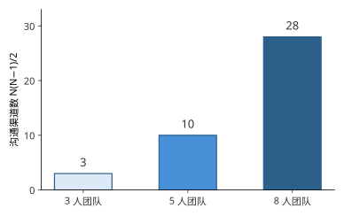
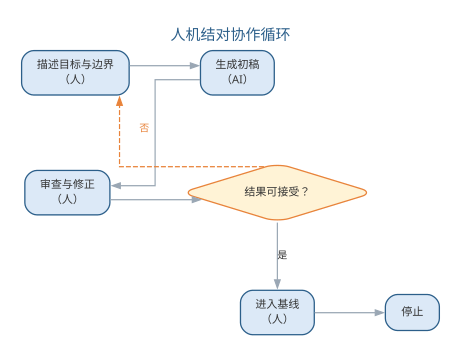
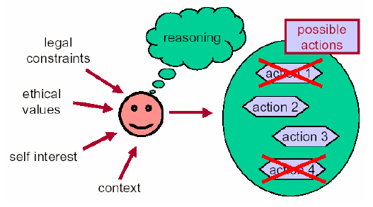
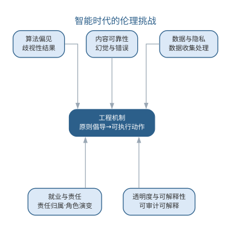
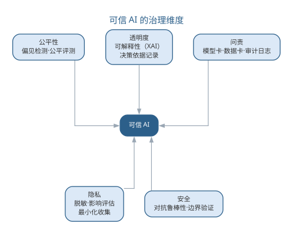
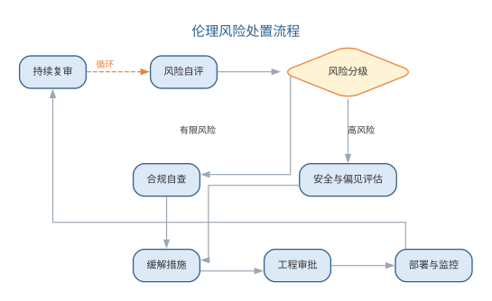
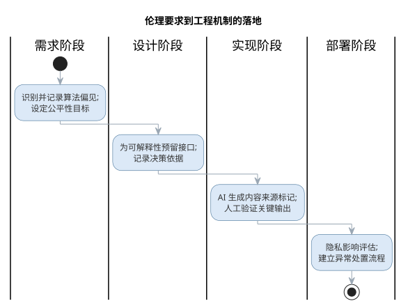
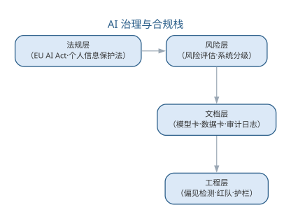

# 智能软件工程实践与伦理

软件工程不仅是技术的应用，还包括许多责任。人才永远是第一位的——真正的人才既要有真才实学与专精技能，也要有高远的认知与开阔的眼界。智能软件工程在带来巨大效率提升的同时，也对软件工程人员的素质与职业操守提出了新的要求。

## 人员素质与团队协作

软件工程人员应具备的基础是：良好的基础知识（英语功底、数学基础、计算机科学基础）、基本技能（抽象与建模能力、逻辑条理性、沟通与协作能力、学习能力）以及职业化训练与实践经验。
选择软件开发人员时可参考下表所列的因素。

| 参考因素 | 说明 |
|----------|------|
| 应用领域经验 | 为成功开发系统，开发人员必须了解相关的应用领域 |
| 平台经验 | 编写底层程序时尤为重要 |
| 编程语言经验 | 对短周期项目很重要 |
| 教育背景 | 反映基础知识与学习能力；经验可在项目实践中获得，并非关键因素 |
| 沟通能力 | 需与同事、管理者、客户进行口头与书面交流，十分重要 |
| 适应性 | 可通过候选人的各种经历判断，反映其学习能力 |
| 工作态度 | 乐于学习新技术，重要但难以评估 |
| 个性 | 须与团队成员关系融洽，重要但难以评估 |

程序员的秉性中值得重视的有：**诚实**（调试 Bug 让人深刻体会诚实的意义）、**简单实用主义**（把复杂问题转化为简单程序）、**喜欢技术挑战**（但可能偏离项目的真正需求）。一个优秀的软件工程师应当做到：**职业道德**（不损害集体利益、不危害社会、不利用职务之便谋私）；**工作态度**（认真负责、有服务意识、善于团队协作）；**高效率地工作**（合理安排时间、提高会议与邮件处理效率、随时记录）；**学无止境**（主动学习新技术、提高综合才能、勇于向错误和失败学习）。

在智能时代，这些素质被赋予了新的含义：工程师的沟通能力从"与人协作"扩展到"与模型协作"，需要能用清晰的提示词与 AI 有效沟通；抽象与建模能力成为定义问题的核心，因为执行性工作大量交给模型；而"诚实"更显珍贵——AI 可能产生幻觉，如实报告 AI 生成内容及其局限性是职业底线。团队规模的扩大使沟通渠道按 N(N−1)/2 急剧增长，如图所示。

{width=75%}

沟通成本随团队规模快速上升，这正是小组应向团队演进、并以清晰分工控制沟通的原因。

## 智能软件工程的实践范式

智能软件工程改变了人与工具的分工，形成了新的实践范式：

- **提示词工程**：把需求转化为模型可执行的指令，成为需求分析、编码与测试活动的接口。清晰的上下文、明确的任务、可验证的输出约束是高质量提示词的关键；
- **人机结对**：工程师负责定义目标、设定边界、审查结果，AI 负责生成初稿与机械性工作，形成"描述—审查—修正"的迭代循环；
- **智能质量门禁**：AI 生成的内容必须经过静态检查、测试与评审的验证才能进入基线，验证是 AI 时代的质量底线；
- **持续学习**：模型能力快速迭代，工程师需持续学习提示词技巧、模型特性与工具链更新，保持对新技术主动学习的习惯。

四种实践范式的人机分工可对照如下表所示。

| 范式 | 核心做法 | 人机分工 |
|------|------|------|
| 提示词工程 | 把需求转化为模型可执行指令 | 人定义接口，模型执行 |
| 人机结对 | 描述—审查—修正循环 | 人定边界，AI 出初稿 |
| 智能质量门禁 | AI 产物经检查验证才进入基线 | 验证是质量底线 |
| 持续学习 | 持续更新提示词与工具链 | 人的主动学习不可替代 |

人机结对通过"描述—审查—修正"循环迭代逼近目标，如图所示。

{width=70%}

循环中 AI 负责生成初稿，人负责定义目标、审查结果，直到产出可接受的成果。

上述范式要真正落地，需要在团队与流程两个层面同时推进：团队层面的能力模型、个体层面的伦理决策，以及流程层面的失败防范，构成智能软件工程实践的三块基石。

智能软件工程的实践同样存在失败模式，值得在建设之初就加以防范：

| 失败模式 | 表现 | 对策 |
|------|------|------|
| 提示词失真 | 需求经提示词转译后走样 | 输出对照需求评审把关 |
| AI 依赖 | 团队过度信任 AI 输出 | 独立核验，验证优先 |
| 责任真空 | 人人以为 AI 负责，事故无人负责 | 事先明确人机责任边界 |
| 能力断层 | 技能未跟上工具与模型更新 | 持续学习、培训补能 |

### 智能开发团队能力模型

智能软件工程的实践范式最终要靠团队承载。智能开发团队由传统角色演变而来，各角色在保留原有职责的同时，须新增与模型协作的技能。角色、新技能与人和 AI 的分工如下表所示。

| 角色 | 新增技能 | 与 AI 的分工 |
|------|------|------|
| 需求分析师 | 提示词设计、需求可测化 | 描述意图，AI 生成需求与用例初稿 |
| 架构师 | 上下文组织、决策依据记录 | 定义约束，AI 提供候选方案 |
| 开发者 | 代码策展、生成代码审查 | 审查整合 AI 输出，编写高风险部分 |
| 测试工程师 | 评测集构建、AI 测试编排 | 定义断言，AI 生成与扩写用例 |
| 项目经理 | AI 效能度量、风险识别 | 设定流程门禁，AI 辅助估算排期 |

两个新增技能是全体角色的公共基础：**提示词设计**决定 AI 产出的质量上限——能否把意图表达为模型可执行的指令，是所有角色的必修课；**审查能力**则从开发者的专属技能上升为全团队的质量义务——需求初稿要审、测试断言要审、AI 排期也要审，审查不再是"最后一道工序"，而是贯穿始终的日常动作。

团队从传统形态向智能形态转型，通常经历三步：先在低风险环节**试点**（如文档生成、用例扩写），验证流程与工具；再按角色**补能**（培训提示词设计、建立提示词库与审查清单）；最后以**度量**驱动收敛（跟踪采纳率、缺陷率与交付周期，持续调优人机分工）。转型的关键不是购买工具，而是让每个角色掌握与模型协作的方法与边界。与纯人工团队相比，智能团队的变化并非简单地"以少胜多"，而是把 AI 省下的时间投向审查与验证——同样的交付周期内，更多的生成内容被检查，更少的缺陷漏进基线。

### 伦理决策框架

智能时代工程师的新义务，集中体现为**对 AI 输出的审查义务**：AI 产出内容的正确性、合规性与责任，最终由使用与部署它的人承担。面对 AI 输出，工程师可循如下决策框架逐项履行审查义务：

1. **识别与标注**：明确哪些输出由 AI 生成、用了哪个模型与提示词版本，为内容打上来源标记；
2. **独立核验**：不因 AI 的流畅表述而放松批判——关键结论须对照需求、规范与测试结果独立核验；
3. **风险评估**：按影响的严重性与可逆性给输出分级，影响越大、越不可逆，审查级别越高；
4. **上报与沟通**：对高风险或边界不明的输出，如实向利益相关方说明 AI 的局限与不确定性，不隐瞒、不夸大；
5. **记录与复盘**：保存决策依据与审查结论，事后复盘，把个案沉淀为团队的伦理参考。

五项义务与对应的验证手段如下表所示。

| 审查义务 | 具体动作 | 验证手段 |
|------|------|------|
| 识别与标注 | 记录来源与模型版本 | 来源标记、提示词版本库 |
| 独立核验 | 对照需求与规范核对 | 测试、走查、评审 |
| 风险评估 | 按影响与可逆性分级 | 风险矩阵、影响分析 |
| 上报与沟通 | 如实说明局限与不确定 | 沟通记录、决策纪要 |
| 记录与复盘 | 留存依据与审查结论 | 审计日志、复盘文档 |

这一框架把"对 AI 输出负责"从抽象原则变为可执行的日常动作，是"伦理到机制"在个体层面的落地。它还与本章可信 AI 的治理机制相衔接：个体层面的审查义务决定"由谁审查"，组织层面的模型卡与审计日志决定"审查是否被记录、可追溯"，二者共同构成从个体到组织的完整责任链条。

## 职业道德与伦理挑战

IEEE/ACM 职业道德准则要求软件工程人员：始终与公众利益保持一致、满足客户和雇主的合法利益、确保产品符合尽可能高的专业标准、具备公正独立的职业判断力、拥护合乎道德的管理方法、维护职业信誉、平等支持同行并终身学习。

分析以下行为，它们都违背了职业操守：将公司软件代码随意复制给他人、为个人利益作出不切实际的承诺、使用盗版软件、迫于时间压力交付缺乏严格测试的代码、未经允许使用他人资源。

{width=60%}

智能时代带来了新的伦理挑战，值得深入思考：

- **算法偏见**：训练数据中的偏见会使 AI 系统产生歧视性结果，软件工程人员有责任识别并缓解；
- **内容可靠性**：AI 生成的需求、代码与文档可能包含幻觉与错误，交付前必须验证其正确性；
- **数据与隐私**：训练与使用大模型涉及个人数据的收集与处理，必须遵守法律法规并尊重用户隐私；
- **就业与责任**：当 AI 承担大量编程工作时，错误的责任归属、工程师的角色演变与再学习成为现实问题；
- **透明度与可解释性**：关键系统使用 AI 决策时，应保持可审计、可解释，确保公众利益得到保护。

五类伦理挑战及其对应的工程对策如下表所示。

| 伦理挑战 | 表现 | 工程对策 |
|------|------|------|
| 算法偏见 | 训练数据中的偏见产生歧视性结果 | 需求阶段设定公平性目标，数据审计 |
| 内容可靠性 | AI 生成内容包含幻觉与错误 | 交付前验证正确性，来源标记 |
| 数据与隐私 | 数据收集处理不合规 | 隐私影响评估、最小化收集 |
| 就业与责任 | 责任归属与角色演变不清 | 明确人机责任边界与合同约定 |
| 透明度与可解释性 | 关键决策不可审计 | 可解释性接口、决策依据记录 |

伦理挑战需要从"原则倡导"走向"工程机制"，其五个维度及其工程回应如图所示。

{width=60%}

伦理挑战需要从"原则倡导"走向"工程机制"。软件工程人员践行伦理，应把伦理要求落实到具体的工程活动上：在需求阶段识别并记录算法偏见与公平性目标，在设计阶段为可解释性预留接口并记录决策依据，在实现阶段对 AI 生成内容执行来源标记与人工验证，在部署阶段建立隐私影响评估与异常处置流程。责任的分担也应事先明确——AI 的产出由使用与部署它的人负责，工具方、模型方与工程团队的责任边界应在合同中清晰约定。只有当伦理要求被翻译为可执行、可审计的过程动作时，它才不会停留在口号层面。

面对具体情境，伦理决策框架如何运作？以一次典型的伦理两难为例：项目临近交付，AI 生成的测试用例在功能路径上全部通过，但覆盖率报告显示若干分支未被覆盖；照单全收可以按时交付，如实上报则可能延期。工程师的决策步骤如下：

1. **界定冲突**：识别这是"按期交付"与"交付质量"之间的冲突，涉及客户利益与准则中"确保产品符合尽可能高的专业标准"的要求；
2. **收集事实**：评估遗漏分支触及的业务路径，判断后果的严重性与可逆性——是否涉及核心业务与异常处理；
3. **对照准则**：以 IEEE/ACM 职业道德准则与团队质量门禁为标尺，确认"覆盖率不达标不得交付"这一硬性约定是否被触碰；
4. **设计选项**：至少提出两个方案并比较后果——照单全收（把风险转嫁给用户）与如实上报、申请延期或补充测试（承担进度压力）；
5. **决策与记录**：选择如实上报并补充测试，把决策理由、风险分析与沟通记录留存，形成可审计的链条；
6. **复盘沉淀**：把案例补充进团队提示词与检查清单，让 AI 在生成用例时就按覆盖率目标自检，减少此类两难再次出现。

与纯人工流程相比，这个两难没有因为 AI 的介入而消失，只是换了形态：人工时代的风险藏在"测试是否充分"里，智能时代的风险还藏在"AI 生成的用例是否覆盖了该覆盖的分支"里。决策步骤的收益在于把含糊的"凭良心"变成明确的"按步骤"——工程师不必在压力下临时起意，而是按既定框架走完每一步，责任由此可追溯、可复盘。

软件工程的终极目标是"让产品走入人心"。无论工具如何演化，人始终是软件工程的主体——人工智能增强的是工程师的能力，而远见、判断与责任仍然属于人。这正是本书从传统软件工程走向智能软件工程所坚持的信念。

## 可信 AI 与治理框架

把上述伦理要求体系化，就形成**可信 AI**（trustworthy AI）的治理框架。可信 AI 通常从几个维度定义：

| 治理维度 | 核心要求 | 工程落地 |
|------|------|------|
| 公平性 | 不因受保护属性产生歧视性结果 | 偏见检测、公平性评测与数据审计 |
| 透明度 | 决策过程可理解、可解释 | 可解释性（XAI）、决策依据记录 |
| 问责 | 错误可追溯、责任可归属 | 模型卡、数据卡、审计日志 |
| 隐私 | 数据收集与使用合法合规 | 数据脱敏、隐私影响评估、最小化收集 |
| 安全 | 系统对恶意攻击与故障稳健 | 对抗鲁棒性评测、安全边界验证 |

可信 AI 的治理维度与工程落地手段如图所示。

{width=65%}

**模型卡**（model card）记录模型的设计目的、训练数据、性能指标与已知局限，随模型一并发布；**数据卡**（datasets card）记录数据集的来源、构成、采集方式与潜在偏见。二者构成 AI 系统的"说明书"，是透明度与问责的基础设施。**审计**则要求对模型的训练、部署与使用过程留存可追溯的记录，以便事故发生后还原责任链条。

需要强调的是，治理不是对 AI 的限制，而是让 AI 可被信任的条件。软件工程人员是可信 AI 的第一道防线：从需求阶段把公平性、透明度写为目标，到设计阶段为可解释性预留接口，再到运行阶段持续评测与监控，治理贯穿 AI 系统全生命周期。负责任 AI 的工程底线已在第 16 章阐述，本章从职业伦理与治理框架的角度与之呼应——两者共同构成智能软件工程中"人的责任"的完整图景。

伦理要求的工程落地需要一套合规评估流程，从风险自评、分级缓解到部署后的持续复审，其流程如图所示。

{width=75%}

### 伦理到工程机制的落地

伦理挑战需要从"原则倡导"走向"工程机制"。可信 AI 的治理维度——公平、透明、问责、隐私与安全——必须被翻译为可执行、可审计的过程动作，其落地路径如图所示。

{width=70%}

各阶段对应的工程动作可归纳如下表。

| 阶段 | 伦理要求的工程动作 |
|------|------|
| 需求阶段 | 识别并记录算法偏见，设定公平性目标 |
| 设计阶段 | 为可解释性预留接口，记录决策依据 |
| 实现阶段 | AI 生成内容来源标记，人工验证关键输出 |
| 部署阶段 | 隐私影响评估，建立异常处置流程 |

责任的分担也应事先明确——AI 的产出由使用与部署它的人负责，工具方、模型方与工程团队的责任边界应在合同中清晰约定。只有当伦理要求被翻译为可执行、可审计的过程动作时，它才不会停留在口号层面。

### 前沿演进：AI 治理与合规前沿

AI 治理已从"原则倡导"走向"法规监管"。**欧盟《人工智能法案》**（EU AI Act）按风险分级（禁止、高风险、有限、最小）要求企业履行风险评估、透明度与审计义务；**ISO/IEC 42001** 提供 AI 管理体系标准，**NIST AI 风险管理框架**（AI RMF）给出治理流程。工程实践上，模型卡、数据卡与审计日志构成合规文档层，红队、偏见检测与护栏构成工程实现层。主要框架对照如下表所示。

| 框架 | 类型 | 覆盖重点 |
|------|------|------|
| EU AI Act | 法规 | 风险分级、透明度、义务 |
| ISO/IEC 42001 | 标准 | AI 管理体系 |
| NIST AI RMF | 框架 | 治理流程、风险偏好 |
| 模型卡/数据卡 | 实践 | 文档化、可审计 |

AI 治理与合规栈——从法规到工程实现——如图所示。

{width=70%}

合规不是束缚而是门槛：它把可信 AI 从可选项变为必选项。工程人员既要理解法规要求，更要把要求落实为可执行的工程动作——这正是本章"伦理到机制"在前沿层面的延续。

## 本章小结

本章讨论智能软件工程的实践范式与职业伦理。实践层面，智能开发团队在传统角色上新增提示词设计与审查两项公共技能，人机分工以"人定边界、AI 出初稿、验证进基线"为原则，并须防范提示词失真、AI 依赖、责任真空与能力断层四类失败；伦理层面，工程师对 AI 输出负有审查义务，可循"识别标注—独立核验—风险评估—上报沟通—记录复盘"的框架履行责任，以伦理两难的决策步骤把"凭良心"变成"按步骤"。无论工具如何演化，人始终是软件工程的主体——AI 增强能力，远见、判断与责任属于人。

**思考与讨论：**
1. 在你的团队中，"提示词设计"与"审查"这两个新增技能应由谁承担、如何考核？
2. 当 AI 生成的缺陷代码遇上交付进度压力时，你会如何按伦理决策框架取舍？
3. 模型卡、数据卡与审计日志，如何与本章的伦理决策框架衔接，构成完整的责任链条？
