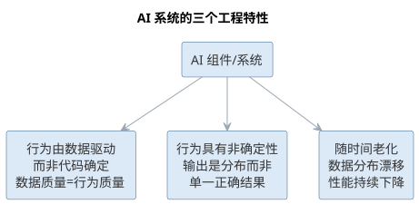
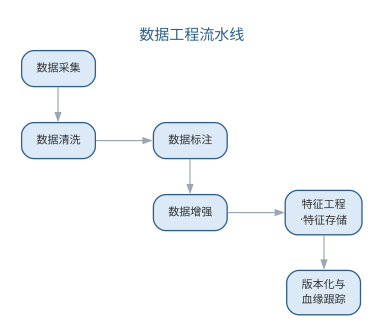
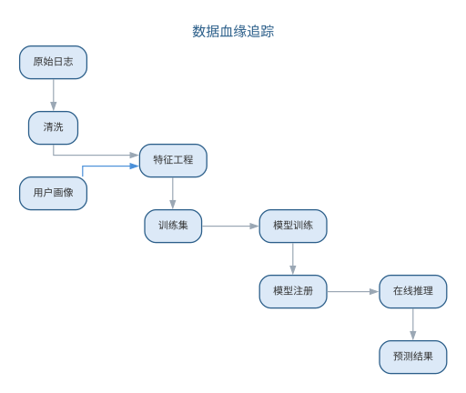
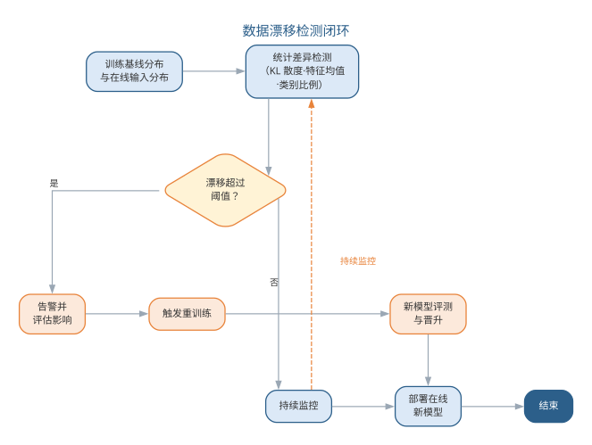
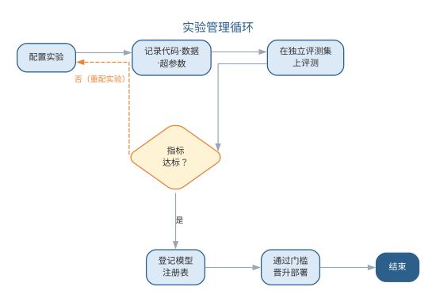
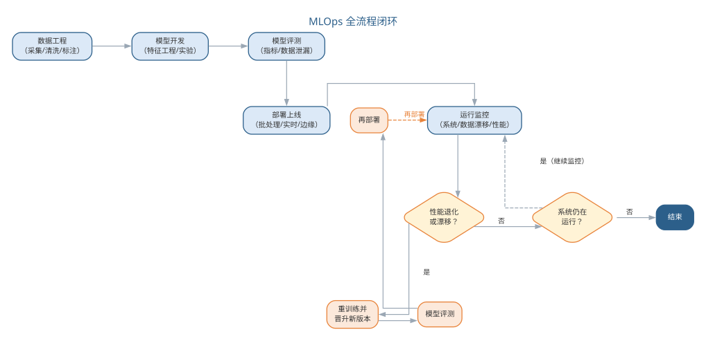
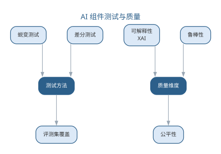
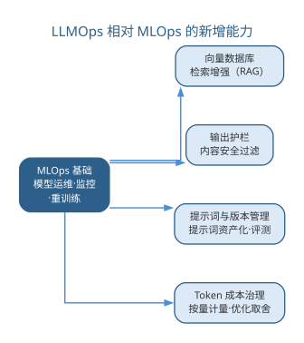
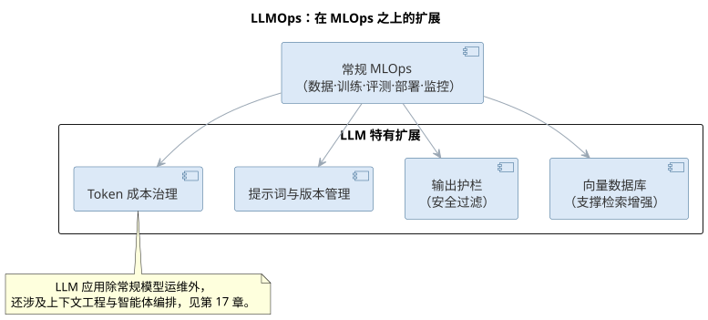
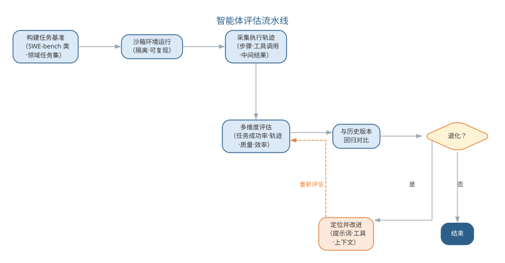

# AI 系统工程与 MLOps

第 1 章指出，智能软件工程包含"AI 赋能软件工程（AI4SE）"与"软件工程支撑 AI（SE4AI）"两个方向。前 15 章讨论的是 AI4SE——AI 如何介入软件生命周期；本章转向 SE4AI：当软件系统以 AI 模型为核心组件时，传统软件工程方法如何扩展，才能应对数据、模型、评测与运维带来的新挑战。人工智能时代的软件工程师需要同时具备两类知识：让 AI 帮助自己写好软件，以及把自己开发的 AI 系统打造成可靠、可维护、可治理的软件产品。

## AI 系统的工程特性

AI 系统是一类以机器学习（ML）或大语言模型（LLM）为核心组件的软件系统。与传统软件相比，它具有三个显著的工程特性：

- **行为由数据驱动而非代码确定**：系统的行为取决于训练数据与模型参数，而非程序员逐条编写的逻辑。数据质量直接决定行为质量，因此有"数据是 AI 系统的源代码"之说；
- **行为具有非确定性**：同一输入可能得到不同输出（尤其在 LLM 中），模型给出的是输出分布而非单一正确结果，使测试与验证面临根本困难；
- **随时间老化**：传统软件不会自然"变坏"，但模型会——真实世界的数据分布随时间漂移，模型性能持续下降，必须持续监控与重训练。

AI 系统区别于传统软件的三个工程特性如图所示。

{width=85%}

一个系统可以包含多个 **AI 组件**（用 AI 技术完成特定功能的部分），而 **AI 系统**是至少包含一个 AI 组件的系统。工程上通常对传统软件部分沿用经典方法，对 AI 组件按本章的方法专门治理。

对 SE4AI 的系统文献综述显示：软件测试与软件质量是研究最密集的知识域（例如对 AI 系统的测试用例设计与质量标准的扩展，如 ISO 26262 对自动驾驶的适配），其次是建模、过程与设计；而 AI 系统的需求、构造与维护研究相对薄弱，正是工程实践中问题高发的环节。AI 系统区别于传统软件的工程特性及其影响可对照如下表所示。

| 工程特性 | 传统软件 | AI 系统 | 工程影响 |
|------|------|------|------|
| 行为来源 | 代码逻辑确定行为 | 数据与参数驱动行为 | 数据质量决定行为质量 |
| 确定性 | 确定、可预测 | 输出分布、非确定 | 测试与验证面临根本困难 |
| 老化 | 不会自然变坏 | 随数据漂移持续退化 | 需持续监控与重训练 |

## 数据工程

数据是 AI 系统的基础。数据工程涵盖数据从获取到可用全过程的活动：

- **数据采集**：明确数据来源（业务系统、传感器、公开数据），评估数据的代表性与覆盖度；
- **数据清洗**：去除重复、异常与噪声数据，处理缺失值，统一格式与单位；
- **数据标注**：为监督学习准备标签，标注质量决定模型上限，需制定标注规范并抽样质检；
- **数据增强**：通过旋转、裁剪等变换生成变体扩充数据量，提升泛化能力。

数据管理的关键实践是**数据版本与血缘**。与代码一样，数据集应当版本化（工具如 DVC），记录"哪个模型由哪个数据集、哪版代码训练而成"，才能保证**可复现性**——同样的输入产生同样的模型。数据血缘（lineage）追踪数据的来源与变换路径，是审计与排障的基础。

**特征工程**把原始数据变换为模型可学习的特征。为避免"训练—服务偏移"（训练与在线推理使用不一致的特征变换），现代实践采用**特征存储**（feature store）集中管理特征，使训练与在线推理共享同一份特征计算逻辑。数据工程的主要活动与质量要点如下表所示。

| 活动 | 做法 | 质量要点 |
|------|------|------|
| 数据采集 | 明确来源，评估代表性与覆盖度 | 覆盖度决定泛化能力 |
| 数据清洗 | 去重、去噪、处理缺失值 | 统一格式与单位 |
| 数据标注 | 制定标注规范并抽样质检 | 标注质量决定模型上限 |
| 数据增强 | 变换生成变体扩充数据量 | 提升泛化能力 |
| 特征工程 | 变换为可学习特征 | 避免训练—服务偏移 |

数据工程把原始数据加工为可用的数据集，流水线如图所示。

{width=65%}

数据血缘追踪数据从原始来源到模型产出的完整路径，同一份数据在各阶段的流转关系如图所示。

{width=65%}

流水线的每一步都影响数据质量，而数据质量直接决定 AI 系统行为——数据是 AI 系统的源代码。

训练分布与在线输入分布的差异可用**KL 散度**（Kullback-Leibler divergence）度量：

$$D_{KL}(P\parallel Q)=\sum_{x}P(x)\log\frac{P(x)}{Q(x)}$$

其中 $P$ 为训练（基线）分布、$Q$ 为在线输入分布，散度越大说明数据漂移越明显——当 $D_{KL}$ 超过阈值时触发告警并驱动重训练。漂移检测到重训练的闭环如图所示。

{width=70%}

## 模型开发与评测

模型开发是高度实验性的迭代过程：特征、结构与超参数的组合近乎无穷，必须依靠系统化的实验管理。

- **实验跟踪**：记录每次运行的代码、数据、超参数与结果指标（工具如 MLflow、Weights & Biases），支持对比与复现；
- **评测集构建**：独立于训练与调参数据的测试集用于估计泛化性能，测试集一旦被"见过"便失去评估价值；
- **评测指标**：分类用准确率、精确率、召回率、F1 与 AUC，回归用均方误差，生成任务用 BLEU/ROUGE 等，指标选择必须对应业务目标；
- **数据泄漏防范**：训练信息（目标变量、未来数据）泄漏进特征会造成虚高的离线指标与线上崩溃，须在时间切分、去重与特征构造上严格把关；
- **模型注册与晋升**：训练产物（模型文件、元数据、评测报告）登记入**模型注册表**，通过门槛（指标、公平性、延迟、体积）后方可晋升部署。

不同任务类型的评测指标对照如下表所示。

| 任务类型 | 常用指标 |
|------|------|
| 分类 | 准确率、精确率、召回率、F1、AUC |
| 回归 | 均方误差、平均绝对误差 |
| 生成 | BLEU、ROUGE |
| 排序 | NDCG、MAP |

模型开发依赖实验管理循环把迭代过程记录、评测并最终晋升，如图所示。

{width=70%}

循环的出口是独立评测集上的达标与模型注册——评测集一旦被"见过"便失去评估价值。

对二分类问题，由混淆矩阵的四个基本量——真阳性 TP、假阳性 FP、真阴性 TN、假阴性 FN——可导出分类模型的核心指标：

$$\mathrm{Acc}=\frac{TP+TN}{TP+TN+FP+FN}$$

$$P=\frac{TP}{TP+FP},\qquad R=\frac{TP}{TP+FN},\qquad F1=2\cdot\frac{P\cdot R}{P+R}$$

其中 $\mathrm{Acc}$ 为准确率、$P$ 为精确率、$R$ 为召回率，$F1$ 为二者的调和平均，在类别不平衡时比准确率更能反映真实性能。四个基本量的含义如下表所示。

| 基本量 | 含义 |
|------|------|
| 真阳性 TP | 正类被正确预测为正类 |
| 假阳性 FP | 负类被错误预测为正类 |
| 真阴性 TN | 负类被正确预测为负类 |
| 假阴性 FN | 正类被错误预测为负类 |

### MLOps 实验平台与模型注册

模型开发是"实验驱动"的迭代，个人记忆无法支撑团队协作，实验管理需要平台化。**实验平台**把"记录—对比—筛选—晋升"固化为标准工作流：

1. **记录**：每次运行自动登记代码版本、数据版本、超参数与环境依赖，任何一次运行都能被完整复现；
2. **度量**：记录训练与评测指标、训练日志与资源占用，随运行一并保存模型产物与配置文件；
3. **对比**：按任务与参数维度横向比较多轮实验，快速定位"哪项改动带来了指标变化"；
4. **筛选**：按门槛指标（评测集性能、延迟、体积、公平性）筛出候选模型并标注结论；
5. **晋升**：候选模型连同元数据与评测报告提交登记，进入审批。

一份完整的实验记录应具备的元数据如下表所示。

| 元数据 | 内容 | 作用 |
|------|------|------|
| 代码版本 | 训练与评测脚本的提交号 | 复现模型 |
| 数据版本 | 数据集版本与血缘 | 复现训练输入 |
| 超参数 | 参数与配置全文 | 对比与调优 |
| 环境 | 依赖库与硬件信息 | 复现运行环境 |
| 指标 | 训练与评测指标 | 筛选与审批依据 |
| 产物 | 模型文件、配置、评测报告 | 部署与审计 |

**模型注册表**（model registry）则是生产模型的"户口本"，把晋升变成有审批、可回溯的流程：

| 注册环节 | 内容 | 目的 |
|------|------|------|
| 登记 | 模型文件、元数据、依赖与评测报告入册 | 可复现、可追溯 |
| 审批 | 对照门槛核验指标、公平性与安全 | 防止未达标模型上线 |
| 晋升 | 发布到暂存环境，灰度验证 | 小流量试错 |
| 发布 | 全量上线并标记生产版本 | 明确线上真身 |
| 回滚 | 一键退回上一生产版本 | 快速止损 |

实验平台与注册表共同构成 MLOps 的"记忆"：前者记录过程，后者锁定结果。任何线上模型都应能追溯到它由哪次实验、哪版数据、哪份代码训练而来——这正是可复现性的工程保证，也是第 15 章问责治理（模型卡、审计日志）的落地基础。评测集的质量也需要像代码一样治理，包含三个要点：**版本化**——评测集本身应版本化并记录血缘，随业务演进定期补充新样本，避免"老评测集测新业务"；**回归门禁**——每次数据、特征或模型改动都应对评测集重新评测并与基线对比，任何指标回退都应阻止晋升，评测集由此成为模型的回归套件；**报告留存**——评测报告随模型一并登记入注册表，作为审批与审计的依据。

工具选型上，轻量团队可用 MLflow 一站式管理实验跟踪与模型注册，规模化平台常选择与云厂商一体的方案（如 Amazon SageMaker、Vertex AI）。选型的关键不是功能罗列，而是能否与既有 CI/CD 与监控体系打通，形成"训练—注册—部署—监控"的闭环。

## 样例：图像分类任务的数据管线

以一个"工地安全帽佩戴检测"图像分类任务为例，看数据工程如何落实到具体动作。任务是判断现场图像中的工人是否佩戴安全帽，这直接关系到安全告警系统的可靠性。

| 环节 | 具体动作 | 常见问题 |
|------|----------|----------|
| 采集 | 从工地摄像头收集不同天气、时段、角度的图像 | 阴雨、夜间样本不足 |
| 清洗 | 去除模糊、重复、遮挡严重的帧，统一分辨率 | 标签噪声混入 |
| 标注 | 人工标注"佩戴/未佩戴"，双人交叉复核 | 标准不一致 |
| 版本管理 | 给数据集打版本号、记录数据血缘与变更说明 | 无版本导致无法复现 |
| 划分 | 按工地/时段划分训练、验证、测试集，避免泄漏 | 同源帧泄漏进测试集 |

数据质量问题的后果往往到评测阶段才暴露，且难以定位。常见问题与对策如下表所示。

| 数据问题 | 影响 | 对策 |
|----------|------|------|
| 标签噪声 | 模型学到错误规律，指标虚高 | 交叉复核、众包仲裁 |
| 类别不平衡 | 少见类别（夜间违规）被忽略 | 重采样、加权损失、补充采集 |
| 重复样本 | 训练/测试重叠，评测失真 | 去重、按时间窗口划分 |
| 分布漂移 | 线上性能随时间下降 | 监控特征分布、持续再训练 |

这个例子说明，数据工程不是"洗数据"的体力活，而是与标注标准、版本治理、评测划分交织在一起的系统工程——一句话概括：**把数据的来龙去脉管住，模型才谈得上可复现、可评测、可回滚**。

## 案例：一个上线后性能下降的模型

数据漂移不是理论上的风险，而是真实发生过很多次的故障模式。下面是一个典型的演化过程。

某团队为一个巡检系统上线了目标检测模型，上线初期在线上评测中准确率约 95%。几个月后，运维人员发现告警漏报率明显上升，经统计线上准确率已下降到约 88%，而离线评测集上的指标却几乎不变。

| 时间线 | 事件 |
|--------|------|
| 第 1 周 | 模型上线，离线/在线指标一致，准确率约 95% |
| 第 6 周 | 监控面板显示"日间样本占比"等特征分布发生偏移 |
| 第 12 周 | 漏报率上升，线上准确率降至约 88%，离线指标仍稳定 |
| 第 14 周 | 分析发现：新接入的工地场景光照与背景变化，训练分布陈旧 |
| 第 16 周 | 补充新场景数据再训练、灰度发布，指标恢复 |

这个故事揭示了三层工程意义：

- **离线评测不等于线上表现**：评测集反映的是训练时刻的分布，而线上数据在持续变化，必须在监控中度量"分布漂移"。
- **监控指标要选对**：只盯准确率可能滞后，特征分布偏移往往更早暴露风险。
- **再训练要走工程流程**：新数据要清洗标注、回归评测、注册版本、灰度发布，而不是随手替换模型——这正是 MLOps 把"训练—注册—部署—监控"串成闭环的原因。

## 部署与监控（MLOps）

MLOps 是把 ML 系统可靠、规模化地交付与运维的工程学科，综合软件工程、数据工程与 DevOps。部署模式依延迟与吞吐需求选择：

| 部署模式 | 适用场景 | 特点 |
|------|------|------|
| 批处理 | 报表、推荐预计算 | 定时或触发运行，延迟不敏感，吞吐高 |
| 实时 API | 在线预测、搜索 | 每请求低延迟响应，需服务与容量管理 |
| 流式处理 | 风控、实时推荐 | 事件流持续预测，需状态管理 |
| 边缘部署 | 终端、离线设备 | 本地推理，隐私好、可离线，资源受限 |

生产化需要容器化与编排（Docker/Kubernetes）、CI/CD 流水线（训练—评测—发布自动化）、金丝雀发布与快速回滚。MLOps 工具链贯穿各环节：

| 环节 | 代表性工具 |
|------|------|
| 实验跟踪 | MLflow、Weights & Biases、Neptune |
| 数据版本 | DVC、LakeFS |
| 特征存储 | Feast、Tecton |
| 模型注册 | MLflow、Amazon SageMaker、Vertex AI |
| 流水线编排 | Kubeflow、Airflow、Vertex AI Pipelines |
| 监控与可视化 | Prometheus、Grafana |

模型上线后必须持续监控，这是 AI 系统与传统软件运维最大的不同：

- **系统监控**：延迟、吞吐、错误率等常规指标；
- **数据漂移检测**：输入分布与训练分布的统计差异（特征均值、类别比例的变化），提示环境已变；
- **模型性能监控**：在缺乏即时标签时，用代理指标（人工标注抽样、关联业务 KPI）估计线上精度；
- **重训练闭环**：由监控触发的重训练（定时或阈值触发）经自动化流水线晋升新版本，形成"监控—反馈—重训练"的闭环。

MLOps 全流程闭环如图所示。

{width=85%}

### 特征存储与监控告警

特征存储在部署期分为**在线特征存储**与**离线特征存储**（online/offline store）：离线侧按批计算特征供模型训练，在线侧以低延迟读取特征供实时推理，两侧共享同一份特征定义与变换逻辑，从工程层面消除训练—服务偏移。同时要监控特征自身的**时效性**——业务事件持续产生，陈旧特征会悄然劣化预测，需要在特征层面设立新鲜度告警，对长时间未更新的特征及时标记。特征存储的选型要点包括：离线侧能否按批回填历史特征、在线侧查询延迟是否满足线上要求、特征定义变更是否有版本管理；实现上通常以"特征定义即代码"的方式管理，特征变更经评审后发布，避免线上特征被静默修改。

监控告警应当**分级、可设阈值、可自动响应**：

| 告警层级 | 监控对象 | 典型触发 | 响应动作 |
|------|------|------|------|
| 系统层 | 延迟、吞吐、错误率 | 延迟超时、容量不足 | 扩容、限流、回滚 |
| 数据层 | 特征新鲜度、输入分布 | 漂移超过阈值 | 暂停线上决策，触发重训练 |
| 模型层 | 代理指标、关联业务 KPI | 线上精度回落 | 灰度回退旧版本 |
| 业务层 | 用户反馈、投诉率 | 投诉率异常上升 | 人工介入、事件复盘 |

告警的价值不在于"响铃"，而在于**可执行的响应预案**：每一级告警都应有明确的触发条件与处置动作，否则监控只会堆砌噪声。

### 模型发布与回滚策略

模型的发布比普通软件更谨慎，因为模型行为难以预知。除金丝雀发布外，常用策略还有：**影子模式**（shadow）——新模型与线上模型并行推理、输出只记录不生效，用于离线验证新版本的行为差异；**A/B 测试**——把真实流量按比例分给新旧模型，以业务指标决策是否全量替换；**快速回滚**——一旦监控告警，立即切回上一生产版本，回滚速度比定位问题更优先。常见的失败模式包括：影子模式未校验流量分布差异、A/B 实验样本不足导致决策噪声过大、回滚脚本未经演练。回滚能力必须在平时反复演练，关键时刻才不会手忙脚乱。从特征存储到分级告警再到发布回滚，MLOps 把"上线即结束"变成"上线才开始"——模型的可靠性在部署后由监控与预案持续守护。

## AI 系统的测试与质量

AI 组件难以用传统"期望输出等于实际输出"的断言进行测试，需要系统化的新方法：

- **蜕变测试**：对同一输入施加规定的变换（如图像翻转），断言输出满足蜕变关系（如分类结果不变），以缓解"测试预言缺失"（oracle）问题；
- **差分测试**：用多个实现或版本对相同输入比较输出，发现行为差异；
- **覆盖与评估集**：以覆盖充分、独立的评测集作为行为测试的补充。

可信 AI 质量还包括三个重要维度：

- **可解释性（XAI）**：用特征归因、显著性图、可解释代理模型等手段说明"为何这样判断"，是监管与排障的必需品；
- **鲁棒性**：评估并加固对对抗样本（精心构造的微小扰动）与分布外输入的稳定性；
- **公平性**：检测模型在不同群体（性别、地域等受保护属性）间的行为差异，识别并缓解偏见。

此外，AI 系统涉及的数据收集与使用必须遵守隐私法规（如个人信息保护法、GDPR），高风险场景需要合规审计与人工复核机制——这构成了**负责任 AI** 的工程底线。可信 AI 的质量维度、含义与手段如下表所示。

| 维度 | 含义 | 手段 |
|------|------|------|
| 可解释性 | 说明"为何这样判断" | 特征归因、显著性图、代理模型 |
| 鲁棒性 | 对对抗样本与分布外输入稳定 | 对抗评测、边界加固 |
| 公平性 | 不同群体间行为无显著差异 | 偏见检测、公平性评测 |

AI 组件的测试方法与质量维度构成两个层面，如图所示。

{width=70%}

测试方法解决"预言缺失"，质量维度回应"可信与否"，两者共同支撑 AI 系统的质量保障。

## LLMOps 与智能化展望

以 LLM 为组件的系统把 MLOps 推进到 **LLMOps**：除常规模型运维外，还新增向量数据库（支撑检索增强）、护栏（输出内容的安全过滤）、提示词与版本管理，以及按 Token 计量的成本治理。LLM 应用的工程化还涉及上下文工程与智能体编排：第 17 章建立概念，第 18 章展开大模型应用开发的工程范式（架构、RAG 工程化、评测与成本治理），第 19 章进入智能体系统工程。

从 AI4SE 到 SE4AI，智能软件工程构成了完整的闭环：AI 使传统软件工程更高效，传统软件工程的纪律使 AI 系统更可靠。二者的交汇，正是智能软件工程时代工程师的核心竞争力。

以 LLM 为组件的系统把 MLOps 推进到 LLMOps：在常规模型运维之上，LLMOps 新增的能力维度如图所示。

{width=60%}

LLMOps 相对 MLOps 的新增能力可归纳如下表所示。

| 新增能力 | 解决的核心问题 | 典型手段 |
|------|------|------|
| 向量数据库 | 私有知识注入与检索 | 分块、向量检索、混合检索 |
| 输出护栏 | 生成内容的合规与安全 | 内容过滤、敏感信息脱敏 |
| 提示词与版本管理 | 行为可复现、可优化 | 提示词库、评测与回归 |
| Token 成本治理 | 生成式应用的成本失控 | 按量计量、缓存、路由取舍 |

### MLOps 的常见失败模式

MLOps 的工程实践高度依赖纪律，失败往往源于数据、评测与监控环节的疏漏。常见失败模式与对策如下表所示。

| 环节 | 失败模式 | 对策 |
|------|------|------|
| 数据工程 | 训练—服务偏移，特征不一致 | 用特征存储共享特征计算逻辑 |
| 模型评测 | 测试集被"见过"，指标虚高 | 独立评测集，严禁用调参数据评估 |
| 数据泄漏 | 未来信息泄漏进特征 | 时间切分、去重与特征构造严格把关 |
| 部署监控 | 上线后性能退化无人知 | 数据漂移检测 + 代理指标估计线上精度 |
| 重训练 | 无监控触发，模型永久老化 | 由监控触发的定时/阈值重训练闭环 |

以 LLM 为组件的系统把 MLOps 推进到 LLMOps：在常规模型运维之上，还需要向量数据库、输出护栏、提示词与版本管理以及 Token 成本治理，如图所示。

{width=90%}

从 AI4SE 到 SE4AI，数据的版本与血缘、评测的独立性与监控的重训练闭环，都是传统软件工程纪律在 AI 系统上的具体形态——纪律越扎实，AI 系统越可靠。

### 前沿演进：LLMOps 深化与智能体评估

LLMOps 在前沿深化为完整的 LLM 应用工程实践：提示词与上下文版本管理、输出缓存与路由、护栏、Token 成本治理、以及面向 LLM 应用的评测体系。LLM 应用的评测体系——评测集构建、多维指标与防污染——的系统化方法将在第 18 章详细展开；智能体评估的工程流程将在第 19 章进一步深化。**智能体评估**成为新的研究与实践前沿：智能体是"多步决策"系统，需在沙箱环境中以任务基准（如 SWE-bench）运行，采集执行轨迹，从任务成功率、轨迹质量、效率与安全性多维度评估，并与历史版本回归对比。深化实践如下表所示。

| 实践 | 做法 | 价值 |
|------|------|------|
| 上下文管理 | 提示词与上下文版本化 | 可复现、可优化 |
| 输出治理 | 缓存、路由、护栏 | 成本与安全 |
| 评测体系 | 评测集 + 回归 | 行为演进可控 |
| 智能体评估 | 沙箱 + 轨迹 + 多维指标 | 端到端能力度量 |

智能体评估流水线——从任务基准到回归对比——如图所示。

{width=80%}

LLM 应用的测试本质上就是评测：当输出由模型而非代码决定时，评测集就是回归测试套件，智能体评估则是把"测试"从单点输出扩展到多步轨迹——这是 SE4AI 在智能体时代的新形态。

## 本章小结

本章从 SE4AI 视角讨论 AI 系统工程与 MLOps。AI 系统的行为由数据驱动、输出非确定且随时间老化，这决定了它对纪律的要求高于传统软件：数据版本与血缘保证可复现，实验平台与模型注册表让迭代、审批与晋升可追溯，评测集以版本化与回归门禁成为模型的回归套件，特征存储与分级告警让部署后的模型持续被守护。AI 组件的测试以评测集和蜕变、差分测试弥补"预言缺失"，以可解释性、鲁棒性与公平性回应可信问题，隐私与合规构成负责任 AI 的底线。MLOps 在 LLM 时代演进为 LLMOps，评测成为 LLM 应用的回归测试——工程纪律越扎实，AI 系统越可靠。

**思考与讨论：**
1. 为什么"测试集一旦被见过就失去评估价值"？试举一个数据泄漏导致离线指标虚高而上线崩溃的场景。
2. 特征存储能在多大程度上消除训练—服务偏移？它还有哪些覆盖不到的偏移来源？
3. 对 LLM 应用而言，评测集为什么可以充当回归测试套件？它与传统回归测试有何不同？
