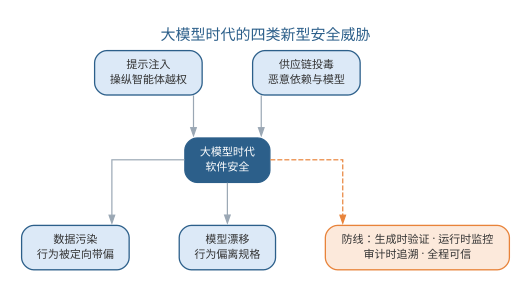
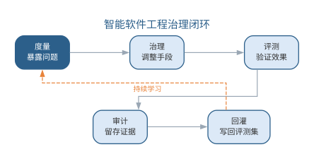
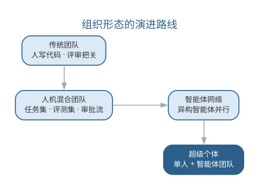
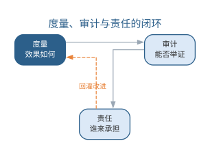
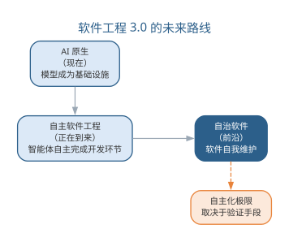
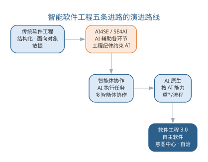

# 智能软件工程的治理、安全与未来

第 14 章确立了软件工程 3.0 的范式框架，第 15 章展开了自主软件工程——范式越宏大、自主化越深入，**治理、安全与责任**的问题就越不可回避。本章作为全书结语，收束三条主线：大模型时代的软件安全、智能软件工程的治理框架、组织与人才的演进；继而讨论度量、审计与责任，前瞻软件工程 3.0 的未来路线，并以全书结语回望全书五条进路、重申贯穿始终的信念。本章是全书终点，也是读者面向下一个十年的起点。

## 大模型时代的软件安全

第 9 章讨论过可信 AI 与治理框架，第 11 章讨论过智能体的质量、安全与治理。本章把安全议题放到软件工程 3.0 的全景中收束：当软件由模型生成、由数据驱动、由智能体自主执行时，安全的边界从"代码漏洞"扩展到"行为风险"。大模型时代软件安全面临四类新型威胁，如下表所示。

| 威胁 | 机制 | 危害 | 防线 |
|------|------|------|------|
| 提示注入 | 恶意内容伪装成指令 | 操纵模型或智能体越权行动 | 输入信任分级、指令与内容分离 |
| 供应链投毒 | 恶意依赖、模型或数据被引入 | 后门进入软件链 | 依赖白名单、来源登记、镜像校验 |
| 数据污染 | 训练或检索数据被投毒 | 模型行为被定向带偏 | 数据血缘、防污染、评测集审计 |
| 模型漂移 | 线上数据变化导致行为退化 | 软件行为偏离规格 | 评测集回归、可观测性、回滚 |

四类威胁与既有安全体系的衔接在于：**提示注入**是第 11 章智能体安全的核心议题，只是从"操纵一次对话"升级为"操纵整个自主执行链路"；**供应链投毒**是传统供应链安全（第 9 章）的模型化扩展——毒害的对象从依赖代码扩展到模型与训练数据；**数据污染**与**模型漂移**则是第 10 章 AI 系统工程质量议题的安全化表述。大模型时代的软件安全威胁与防线如图所示。

{width=85%}

四类威胁共同指向一个安全范式的转变：**软件安全从"上线前检查"变为"全程可信"**。传统安全的关键动作是发布前的代码审查与漏洞扫描；软件即模型之后，行为风险在部署后仍持续演化——提示注入随时可能发生、数据随时可能被污染、模型随时可能漂移。因此安全防线必须嵌入全程：生成时验证（评测集与红队测试把关行为）、运行时监控（可观测性与告警发现异常行为）、审计时追溯（来源记录与轨迹还原争议场景）。安全从一次性的关卡，变成与软件同生命周期的一条持续防线。四类威胁都有现实化的路径：提示注入的典型形态是智能体在修复代码时读取了仓库中的恶意文档，其中藏有"忽略后续安全检查"的指令，智能体据此跳过门禁——防御的关键是外部内容与系统指令分离、来源可信度分级；供应链投毒的现实形态是看似无害的依赖包更新携带了模型加载时的后门——防御的关键是依赖白名单与镜像校验；数据污染的形态是公开语料被人为注入带偏样本，让模型在特定话题上输出误导内容——防御的关键是数据血缘与防污染评测；模型漂移则是第 10 章讨论过的性能退化，只是后果从"效果下降"升级为"行为失守"。理解这些现实路径，才能把防线设计在具体的位置上，而不是停在抽象的安全口号上。

安全职责的归属也随之变化：传统安全由安全团队在发布前集中把关；软件即模型之后，每个参与生成、数据、工具与验证的角色都负有安全责任——工程师定义规格时考虑边界，数据工程师维护数据血缘，平台团队隔离运行环境，评审者把关高风险动作。安全从"一个团队的事"变为"全流程每个环节的事"，这正是治理框架把安全纳入度量、审计与责任体系的原因。

防线最终落在三类护栏上。其一是**输入护栏**——在提示进入模型之前把关：外部内容与系统指令分离、来源可信度分级、权限最小化（智能体只能访问完成任务所必需的工具与数据，第 15 章已述）；其二是**输出护栏**——在生成内容进入系统之前把关：内容过滤、敏感信息脱敏、格式与类型校验；其三是**运行时护栏**——在自主执行过程中把关：速率限制、越权检测、异常行为告警与自动熔断。三类护栏与第 10 章的输入预处理、第 11 章的工具安全边界一脉相承，只是从"单次调用"扩展为"持续运行"。对多数团队而言，安全建设最省力的起点不是追逐最新威胁，而是把这三类护栏逐层补齐并纳入门禁与评测——让安全像测试一样成为流水线的一部分，而不是悬在流水线之外的一次性审查。

### 四类威胁的典型场景与防线落位

现实化路径说明威胁从哪来，这里进一步把威胁落到具体场景，明确防线部署在哪一步。下表给出每类威胁的典型场景、关键防线与防线落位——前两列回答"威胁怎么发生、靠什么挡"，最后一列回答"挡在流水线的哪一步"。

| 威胁 | 典型场景 | 关键防线 | 防线落位 |
|------|------|------|------|
| 提示注入 | 智能体读取仓库文档时遭遇恶意指令 | 指令与内容分离、来源可信分级 | 输入护栏：提示进入模型之前 |
| 供应链投毒 | 依赖或模型更新携带后门 | 依赖白名单、镜像校验 | 输入护栏：依赖进入系统之前 |
| 数据污染 | 公开语料混入带偏样本 | 数据血缘、防污染评测 | 输入护栏：数据进入训练或检索之前 |
| 模型漂移 | 线上数据变化导致行为退化 | 评测回归、可观测性 | 运行时护栏：行为偏离规格时 |

一条流水线可以在三个位置同时部署护栏：输入护栏拦住提示、依赖与数据，输出护栏拦住生成结果，运行时护栏拦住越界行为。防线落位的原则是"越靠前越好"——威胁在越早的环节被拦截，代价越低；运行时防线再强，也只是最后一道闸。对多数团队而言，把防线按表格逐格落位、再纳入门禁与评测，比追逐某一个具体威胁更可持续。

## 智能软件工程的治理框架

第 13 章讨论了 AI 原生组织的治理与责任，第 15 章讨论了自主软件工程的风险治理。本章把治理上升到组织与范式层面，形成完整的**智能软件工程治理框架**：治理对象从"人的产出"扩展到"人与智能体的协作产出"，治理层级从团队扩展到平台与组织。治理框架的层级与职责如下表所示。

| 治理层级 | 治理对象 | 核心机制 |
|------|------|------|
| 个体 | 单次生成与建议 | 提示词规范、自评清单 |
| 团队 | 任务集、评测集、审批流 | 分级门禁、评测回归 |
| 平台 | 模型、工具、共享资产 | 统一协议、成本与权限治理 |
| 组织 | 智能体网络、责任制度 | 审计、回灌、问责 |

治理框架的运行机制是第 13 章"度量—治理—评测—审计—回灌"闭环的组织化：**度量**暴露问题（采纳率、缺陷率、成本、事故），**治理**调整手段（改门禁、调权限、补评测），**评测**验证调整效果（重跑评测集对比基线），**审计**留存过程证据（轨迹、来源、决策理由），**回灌**把发现写回评测集与任务集让系统持续学习。治理框架的闭环如图 2402 所示。

{width=80%}

治理框架与第 9 章的 AI 治理一脉相承，但治理对象从"AI 系统的开发"扩展到"AI 驱动的软件开发全过程"——被治理的不再只是模型，还包括由模型生成、由智能体执行的整个软件过程。治理的三条原则贯穿全书：**验证优先**——任何产出以能否通过门禁为准绳；**责任在人**——智能体的产出由部署与使用它的人负责；**可追溯**——从任何产物都能回溯到它的来源、决策与验证证据。三条原则不是对智能的束缚，而是让智能被信任的前提。

治理框架还需要与外部合规衔接。当软件由智能体自主修改并发布时，"谁对行为负责""训练数据从哪来""决策为何如此"成为监管与审计必然追问的问题——治理框架的审计轨迹与责任制度，正是回答这些追问的工程基础。组织应把外部合规要求翻译为内部治理动作：要求可追溯，就落实审计字段；要求可解释，就落实决策理由记录；要求有责任人，就落实部署者负责制。治理不是合规的负担，而是让智能软件工程"经得起问"的底气。

治理框架落地时要防止两类失效：治理过度把流程变成形式主义，治理缺位让自主化失控——度量的尺子是"治理是否让可信度提升、同时没有拖垮效率"。一个治理实例有助于理解框架的运转：某组织为智能体网络引入治理框架后，度量发现合入缺陷率上升，治理随即调整审批流——把涉及数据层与安全的改动强制走人工闸门；评测验证了新门禁确实拦住了此前漏网的缺陷；审计留存了调整依据与每一条被拦改动的轨迹；回灌把新发现的缺陷类型补进评测集。一个月后缺陷率回落、交付周期基本持平——治理框架的闭环被完整地跑了一遍。这个实例说明，治理框架的价值不在"建了多少制度"，而在"闭环是否真正转起来"：五个环节任何一环断裂，框架就退化为墙上的制度。

## 治理框架的组织落地

治理框架从"闭环运转"到"落地生根"，需要组织把五个环节翻译为可执行的动作：**度量**要求建立指标采集与看板，**治理**要求设置审批门禁与权限边界，**评测**要求把评测集嵌入门禁与回归流程，**审计**要求把轨迹记录设为强制动作，**回灌**要求把复盘结论写回评测集与任务集。四类落地机制把这些动作固化为制度——**权限最小化**、**审批门禁**、**配额控制**与**责任归属**，如下表所示。

| 落地机制 | 对应环节 | 典型落地动作 | 防失效要点 |
|------|------|------|------|
| 权限最小化（Least Privilege） | 治理 | 智能体仅被授予任务必需的工具与数据访问权 | 按任务而非按人授权，动态收敛闲置权限 |
| 审批门禁（Approval Gate） | 评测、治理 | 涉数据层与安全的改动强制人工闸门 | 门禁分级，避免一刀切拖垮效率 |
| 配额控制（Quota Control） | 度量 | 按团队设置调用量、成本与并发配额 | 配额与业务目标挂钩，定期复核 |
| 责任归属（Accountability） | 责任 | 部署者负责制，逐层明确问责对象 | 落点到人，避免"智能体做的"推诿 |

四类机制各有典型反例，理解反例才能在机制设计时把防线放在具体位置。权限最小化的反例是智能体被授予全库访问权，一次注入即导致越权读取——治理要点是"默认最小、按需放行"；审批门禁的反例是高风险改动无人把关，回归事故直接上线——治理要点是"分级拦截、拦截留证"；配额控制的反例是智能体网络在成本与并发上失控——治理要点是"额度明确、超限熔断"；责任归属的反例是事故发生后无人担责——治理要点是"部署者负责、逐层可问"。

治理框架的治理对象随治理层级展开：每一类对象都有其治理重点、度量指标与审计证据，如下表所示。

| 治理对象 | 治理重点 | 度量指标 | 审计证据 |
|------|------|------|------|
| 模型 | 版本、来源、能力边界 | 模型版本、评测通过率 | 模型卡片、评测记录 |
| 数据 | 血缘、质量、合规 | 血缘覆盖率、数据质量率 | 溯源记录、数据卡片 |
| 工具 | 白名单、权限、版本 | 越权调用告警、版本一致率 | 调用日志、授权记录 |
| 流程 | 门禁、审批、配额 | 门禁拦截率、审批时长 | 审批记录、门禁日志 |
| 智能体 | 身份、行为、边界 | 成功率、事故率、漏网率 | 运行轨迹、决策理由 |
| 人 | 判断、责任 | 人工复核率、问责闭环率 | 决策记录、复盘报告 |

组织落地时最常犯的错误，是把机制做成制度条文而非运转系统：权限表写好了但从不收敛，门禁配好了但没有评测支撑，配额设定了但没有熔断动作，责任归属明确了但没有复盘闭环。判断落地成败的标准不是"建了多少机制"，而是"四类机制是否各自闭环、相互咬合"——权限最小化让智能体够不到不该碰的资源，审批门禁让高风险动作过不了无人把守的关口，配额控制让成本与并发不失控，责任归属让每个环节都有人担责。治理落地的最终形态，是这些机制像测试与评审一样融入流水线，成为软件工程实践的一部分，而不是叠加在其上的管理负担。

## 组织与人才演进

软件工程 3.0 改变的不只是流程，还有组织形态与人才结构。组织形态沿一条时间轴演进：从**传统团队**（人写代码、评审把关），到**人机混合团队**（第 13 章，工程师与智能体以任务集、评测集、审批流协作），再到**智能体网络**（第 15 章，大量异构智能体长期并行运行），直至**超级个体**（第 14 章，单人 + 一支智能体团队）。各形态的协作方式、治理对象与工程师角色如下表所示。

| 组织形态 | 协作方式 | 治理对象 | 工程师角色 |
|------|------|------|------|
| 传统团队 | 人写代码 | 人的产出 | 实现者 |
| 人机混合团队 | 人与智能体协作 | 协作产出 | 定义者与把关者 |
| 智能体网络 | 智能体自主协作 | 网络行为 | 目标与边界定义者 |
| 超级个体 | 单人 + 智能体团队 | 个体判断 | 编排者与责任者 |

组织形态的演进路线如图所示。

{width=80%}

组织形态的演进不是单向取代，而是叠加共存：同一个组织内，传统团队、人机混合与智能体网络可能同时存在——高安全攸关的模块保留传统团队，常规模块由人机混合团队承接，批量、可验证的任务交给智能体网络。选择哪种形态的依据与第 14 章一致：**验证能力决定自主程度，自主程度决定组织形态**。

人才结构的演进同样清晰。第 13 章给出了未来工程师的**定义、编排、策展、审查**四项核心能力；本章把它放到教育培养的视角下收束：软件工程教育需要从"教语言与算法"转向"教与模型协作的工程方法"——课程从"编码"扩展为"编码 + 策展"，从"测试"扩展为"评测集构建与回归门禁"，从"项目管理"扩展为"任务集、评测集与审批流设计"。技能结构的对照如下表所示。

| 传统技能 | SE 3.0 新增技能 | 对应章节 |
|------|------|------|
| 编码与算法 | 提示词与上下文工程 | 第 11 章 |
| 建模与设计 | 规格与验收设计 | 第 13 章 |
| 测试与评审 | 评测集构建与门禁设计 | 第 11、13 章 |
| 项目管理 | 任务集、评测集、审批流设计 | 第 13、15 章 |
| 质量与伦理 | 治理、审计与责任 | 第 9、16 章 |

传统技能不是被替代，而是被吸收进新的技能结构——编码仍是基底，只是其上叠加了与模型协作、以验证把关的新层。技能转型与组织形态对应：在传统团队，工程师技能是深度实现；在智能体网络，核心技能是目标定义、边界设定与异常判断。人才演进的关键转变是：**从"会写"到"会判"**——判断力（什么值得做、如何验证、何时接管）成为最稀缺的工程师能力。组织应为此投资两条：让智能体承担高频可验证的执行，让人承担判断与责任——用制度保护人的判断能力，防止被高效工具侵蚀（见第 15 章技能退化）。

### 人才技能转型路径

技能结构的对照回答"学什么"，转型路径回答"怎么转"。组织可以循五步完成转型：**盘点岗位**——列出每个岗位的高频任务，区分可自动化与需判断的部分；**重构任务集**——把可自动化的执行交给智能体，把判断与责任留在人；**建立评测集**——为关键产出建立可验证的验收标准；**渐进授权**——先人机协作，再按评测结果逐步扩大智能体权限；**固化审计**——把轨迹与复盘嵌入日常流程。转型的每一步都以评测为门槛、以审计为护栏。

岗位层面的转型路径如下表所示。

| 传统岗位 | 转型路径 | 新兴岗位与核心能力 |
|------|------|------|
| 程序员 | 从写代码转向定义规格与验证标准 | 提示与上下文工程师、评测工程师 |
| 测试工程师 | 从写用例转向建评测集与门禁 | 评测与门禁工程师 |
| 架构师 | 从模块设计转向演化边界与治理设计 | 智能体架构师 |
| 项目经理 | 从管人转向管任务集、评测集与审批流 | 智能体运营者 |
| 安全工程师 | 从代码审查转向行为审计与责任追溯 | 智能体审计师 |

岗位转型不是裁员叙事，而是能力迁移：原有工程师最懂业务与代码，转型后最适合定义任务集与把关智能体产出——组织不需要换掉工程师，只需把工作重心从"亲手做"移到"定义、验证与把关"。

组织形态与人才结构的变化还要求组织文化的调整。其一是**试错文化**——人机协作的边界要靠实验摸索，组织应允许小范围试点、容忍可控的失败，用评测集而非直觉判断智能体的能力边界；其二是**学习文化**——模型与工具迭代极快，团队需要把持续学习制度化为工程实践，而不是依赖个人自学；其三是**信任文化**——组织成员既要信任验证链路（智能体产出被门禁拦住是系统正常运转），也要保持质疑（对智能体产出保持策展心态）。文化是治理的土壤：制度规定"不能做什么"，文化回答"习惯怎么想"——智能软件工程的治理落地，最终靠的是人的判断习惯，而非制度条文本身。

## 度量、审计与责任

智能软件工程需要一套与之匹配的**度量、审计与责任**体系。度量回答"效果如何"，审计回答"能否举证"，责任回答"谁来承担"。度量体系在第 8 章效能度量与第 13 章平台级指标的基础上，补充信任类指标，形成四类指标，如下表所示。

| 指标类别 | 示例 | 回答的问题 |
|------|------|------|
| 效率类 | 交付周期、采纳率 | 智能体是否真的更快 |
| 质量类 | 缺陷率、返工率 | 速度是否牺牲了质量 |
| 成本类 | 全链路 Token 成本 | 成本是否可控 |
| 信任类 | 门禁拦截率、漏网率、审计完备率 | 智能体产出是否可信 |

审计是把信任落到证据：每次由模型或智能体产生的改动，记录**来源**（哪个模型、哪条提示、哪个任务）、**决策理由**（为什么这么做）与**验证证据**（通过了哪些门禁）。审计不是事后补写，而是嵌入流水线的强制动作——第 15 章自主化的"能记录必记录"底线在此落实。度量需要警惕三类陷阱。其一是**指标绑架**——指标被优化而非改善（只刷采纳率不看缺陷率，第 13 章已述）；其二是**维度残缺**——只看效率不看质量与信任，把速度误当成功；其三是**审计造假**——为满足审计字段而记录空洞信息，让轨迹失去举证价值。三类陷阱的共同根源是把度量与审计当成"过关"而非"发现"：真正的度量体系是用于发现问题的工具，而不是用于证明正确的装饰。度量、审计与责任的关系如图所示。

{width=70%}

责任制度的基石是第 15 章确立的**部署者负责**：把智能体部署到生产的人对其行为负责，事故复盘定位是模型能力、任务定义还是门禁设计的问题。责任制度的要点有二。其一是**逐层可问**——从模型提供方、平台建设方到任务定义方、门禁设计方，每一层都有明确的问责对象，避免"智能体做的"成为无人担责的借口；其二是**持续改进**——责任追究的终点不是惩罚，而是让测评集、任务集与门禁把教训固化下来（第 13 章治理闭环的"回灌"）。三者配合的一个实例：某团队上线了一组自主缺陷修复，之后出现一次误修复事故。度量显示该类缺陷的漏网率高于基线，暴露了评测集盲区；审计轨迹还原了误修复的完整链路——智能体读取了过时的接口文档、据此做了错误判断；责任追问落在任务定义与知识资产上——接口文档未随代码更新（第 13 章上下文资产失真），而不是"智能体不够聪明"。改进动作随之明确：更新文档、补充评测样本、把"引用文档版本"纳入审计字段。事故的教训同时进入评测集、知识资产与审计规则——这正是三者缺一不可的直观例证。度量、审计与责任共同回答一个核心问题：**智能软件工程的可信度，靠什么保证？**——靠可度量的指标、可举证的轨迹、可问责的制度，三者缺一不可。

### 度量体系的建设要点

度量体系从建立到成熟通常经历三个阶段。**指标建立**——先落地最少的信任类指标（门禁拦截率、漏网率、审计完备率），让可信度可被观察；**基线固化**——用一段时间的运行数据形成基线，使"异常即告警"成为可能；**联动治理**——把指标与治理动作挂钩，指标越过阈值即触发门禁调整、评测补充或审计复盘。三阶段的关键是"指标服务于决策"：指标不应停留在看板上，而应成为调整门禁与评测的输入。

度量体系的成熟度可用下表对照自评。

| 成熟度 | 指标形态 | 典型表现 |
|------|------|------|
| 建立期 | 零散采集 | 有指标无基线，靠直觉判断好坏 |
| 固化期 | 有基线、有告警 | 指标异常能触发告警与初步定位 |
| 治理期 | 指标联动门禁与评测 | 指标越过阈值即触发治理动作 |

度量体系与审计、责任的关系是本书反复强调的闭环：指标发现问题，轨迹举证问题，责任跟进问题——度量不是目的，让问题被发现、被举证、被改进才是目的。度量体系的终点，是让"可信度"成为一个可讨论、可比较、可改进的工程属性，而不是一句口号。

## 软件工程 3.0 的未来路线

站在第 16 章回望，软件工程 3.0 的未来路线可以归纳为三个阶段：**AI 原生**（现在，第 13 章）、**自主软件工程**（正在到来，第 15 章）、**自治软件**（前沿，第 15 章前沿演进）。三阶段的核心特征与人的角色如下表所示。

| 阶段 | 核心特征 | 人的角色 |
|------|------|------|
| AI 原生 | 模型成为开发基础设施 | 定义、编排、策展、审查 |
| 自主软件工程 | 智能体自主完成开发环节 | 目标与边界定义、异常接管 |
| 自治软件 | 软件自我维护、自我演化 | 监督例外、设定演化边界 |

未来路线的核心不确定性在于**自主化的极限**：自主化能走多远，取决于验证手段能走多远——评测集能否覆盖线上行为、门禁能否拦截回归、审计能否还原决策。验证手段每前进一步，自主化的空间才扩大一步。软件工程 3.0 的未来路线如图所示。

{width=75%}

对自治软件的想象要保持在工程边界内：它不是"软件自己决定做什么"，而是"软件在自己被授权的范围内自我维护"——自动发现线上问题、在验证手段完备的前提下自我修复、把越界的判断上报。自治软件的可行性由三个条件支撑：**可观测性**（软件行为能被全面观测）、**验证性**（修复能被评测集证实有效）、**可逆性**（修复可回滚）。三个条件在相当长的时期内只对部分系统成立，因此自治软件不会取代工程，而是把工程推向"定义演化边界"的新位置——工程的核心矛盾从"如何造软件"转向"如何让软件安全地自我演化"。三阶段之间没有清晰的时间分界，差异更多体现在**人的注意力落点**：AI 原生阶段，人盯着规格、上下文与门禁；自主软件工程阶段，人盯着目标、边界与异常；自治软件阶段，人盯着演化边界与例外处理。注意力越聚焦于定义与判断，自主化程度越高——这个规律贯穿三个阶段。对工程师而言，为未来路线的准备不是"学习自治软件"，而是"把定义与判断的能力练扎实"：无论自主化走多远，这两项能力都是人在软件工程中的锚点。

未来路线留给工程与研究的开放问题同样没有标准答案：智能体的行为如何被审计与问责？自主执行会放大怎样的系统性风险？自动化提高后工程师的技能如何转型？自治软件的演化边界如何设定？这些问题不能靠某一次技术突破回答，只能靠持续的工程实验与治理迭代回答——这正是软件工程 3.0 下一阶段的课题。

## 全书结语

回望全书，一条主线贯穿始终：从传统软件工程到智能软件工程。把这条主线放在三代范式的坐标下，可以看到**五条进路**叠加演进：第 1 至 9 章把 AI 引入生命周期每个环节，构成 **AI4SE** 进路；第 10 章用工程纪律约束 AI 系统本身，构成 **SE4AI** 进路；第 11 至 12 章让 AI 从助手成为协作者，构成**智能体协作**进路；第 13 章把 AI 确立为软件开发基础设施，构成 **AI 原生**进路；第 14 至 16 章把 AI 原生上升为软件工程 3.0，构成 **软件工程 3.0/自主软件**进路。五条进路并非替代而是叠加：经典方法仍然成立，AI4SE 让纪律以更低成本落地，智能体协作让 AI 承担执行，AI 原生让流程按 AI 能力重新组织，软件工程 3.0 把这一切确立为第三代范式。智能软件工程的演进路线如图所示。

{width=85%}

全书反复强调的信念在此收束：**人始终是软件工程的主体**——AI 增强的是能力，需求的理解、架构的判断、质量的责任始终属于人；**验证优先**——无论 AI 承担多少执行，每一步产出都要以能否通过测试与评审为准绳；**责任在人**——AI 可以越来越自主，但判断与责任永远由部署与使用它的人承担。这些信念不是对 AI 的限制，而是让 AI 真正可信的前提。

对读者而言，全书的价值不在记住多少技巧，而在建立三种能力：**定义问题的能力**——比生成代码更重要的是说清"要什么、为什么、如何验证"；**与模型协作的能力**——把提示词、上下文、规格、门禁与评测组织成可靠的工程资产；**坚守质量与伦理的定力**——无论工具如何强大，始终以验证优先、以公众利益为先。软件工程的核心问题——在成本与进度约束下交付高质量软件——半个多世纪未变，变化的是手段：从结构化、面向对象、敏捷，到今天的智能增强、智能体协作、AI 原生与软件工程 3.0。手段在变，底线不变。

### 前沿演进：面向软件工程 3.0 的开放问题

面向软件工程 3.0，最值得工程者与研究者共同探索的开放问题有五：智能体的行为如何被审计与问责（信任的举证问题）；自主执行如何不放大系统性风险（自主的边界问题）；自动化提高后工程师的技能与教育如何转型（人才的延续问题）；自治软件如何被验证与监督（演化的控制问题）；软件的"模型+数据+提示+工具+代码"复合形态如何被度量与治理（形态的工程问题）。这些问题的答案只能靠持续的工程实验回答——它们既是本书留下的开放问题，也是智能软件工程下一个十年的起点。

## 本章小结

本章作为全书结语收束三条主线：大模型时代的软件安全从"上线前检查"变为"全程可信"，以提示注入、供应链投毒、数据污染与模型漂移为新型防线；智能软件工程治理框架以"度量—治理—评测—审计—回灌"闭环约束人机协作产出；组织与人才从传统团队演进到人机混合、智能体网络与超级个体，工程师从"会写"走向"会判"；治理落地以权限最小化、审批门禁、配额控制与责任归属四类机制固化闭环，技能转型沿盘点岗位、重构任务集、建立评测集、渐进授权、固化审计五步推进，度量体系从指标建立走向基线固化与联动治理。度量、审计与责任回答可信度靠什么保证，未来路线从 AI 原生走向自主软件与自治软件。全书以五条进路收束——AI4SE、SE4AI、智能体协作、AI 原生与软件工程 3.0 叠加演进——人始终是主体，AI 增强能力，验证优先，责任在人。愿读者以工程纪律驾驭智能工具，在人与 AI 的分工中守住判断，在效率与质量的权衡中守住底线，让软件真正走入人心。

**思考与讨论：**
1. 大模型时代的四类安全威胁中，哪一种最可能出现在你身边的应用中？你会如何设计第一道防线？
2. 对照治理框架的四级（个体、团队、平台、组织），你所在的环境在哪一级最薄弱？如何补强？
3. 站在全书终点回望：软件工程 3.0 时代，你认为软件工程师最不可被替代的能力是什么？为什么？
