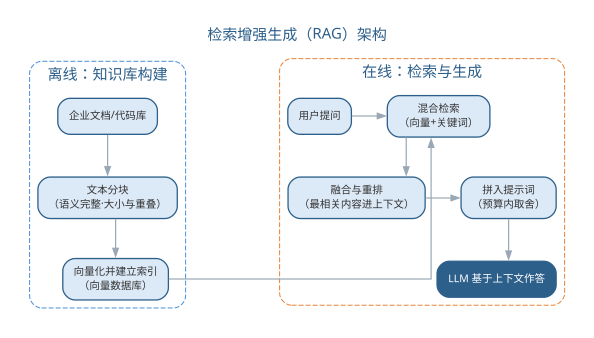
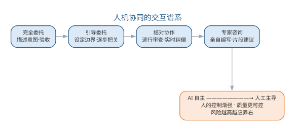

# 智能体与提示词驱动的开发范式

前 15 章中，AI 大多以"助手"形态出现：补全一段代码、生成一组用例、回答一个需求问题。本章把这些能力整合为新的开发范式——**提示词驱动、智能体编排、人机协同**。在这个范式下，工程师的角色从"逐行写代码"转变为"定义问题、编排工具、审查验证"，软件开发的效率与质量瓶颈也随之转移。

## 提示词工程

提示词（prompt）是与大语言模型交互的指令。提示词工程研究如何构造提示词以获得可靠、正确的输出，是智能开发范式的接口层。高质量的提示词通常包含：

- **上下文**：背景信息与约束，让模型在正确的场景中理解任务；
- **角色**：明确模型扮演的角色（如"资深软件架构师"），激活对应的知识组织方式；
- **指令**：清晰无歧义的任务描述，给出输出格式与边界（如"只返回 JSON"）；
- **示例**：少样本（few-shot）提示，给出一两个输入输出对，让模型模仿期望的模式；
- **推理引导**：思维链（CoT）让模型"一步一步思考"，显著提升复杂推理与逻辑类任务的正确率。

提示词本身是值得版本管理的资产：企业会沉淀提示词库，记录版本、适用场景与效果评测（如生成的代码能否通过测试），并随模型升级持续调优。提示词的评测应结合自动化指标与人在回路的判断——BLEU 等指标难以反映代码的可维护性与正确性。高质量提示词的五个要素如下表所示。

| 要素 | 作用 | 示例 |
|------|------|------|
| 上下文 | 提供背景信息与约束 | 项目语言、框架、相关代码 |
| 角色 | 激活对应的知识组织方式 | "资深软件架构师" |
| 指令 | 明确任务与输出格式 | "只返回 JSON" |
| 示例 | 少样本示范期望模式 | 一两个输入输出对 |
| 推理引导 | 让模型一步一步思考 | 思维链"step by step" |

高质量提示词通常由五个要素构成，如图所示。

{width=90%}

五个要素共同提高输出可靠度——上下文让模型在正确的场景理解任务，示例与推理引导则约束输出模式。

提示词的规模直接决定调用成本：对一次模型调用，输入 Token 与输出 Token 分别按不同单价计量，总成本为

$$C=c_{in}\cdot n_{in}+c_{out}\cdot n_{out}$$

其中 $c_{in}$、$c_{out}$ 分别为输入、输出 Token 单价，$n_{in}$、$n_{out}$ 为对应的 Token 数量。在提示词版本化时记录 Token 用量，是成本治理与效果对比的基础。

### 提示词模板体系

在实践中，团队通常把提示词组织为**分层模板体系**：基础模板沉淀通用规则，场景模板针对具体任务，评审模板用于质量把关。三层模板分层复用，任何一层都可单独版本化与评测。以"代码生成"这一场景为例：

```text
【基础模板：通用规则】
- 角色：你是本项目资深工程师，遵循团队编码规范（命名、注释、结构）
- 原则：先说明意图与约束，再给实现；单入口单出口；优先使用标准库
- 输出：先输出实现代码，再输出 100 字以内自检说明

【场景模板：函数生成】
请在【基础模板】之上完成：
- 输入函数签名与需求：{函数签名} {需求说明}
- 约束：{非法输入处理} {边界条件}
- 要求：符合规范；异常路径显式处理

【评审模板：质量把关】
请以审查者视角评审以下 AI 生成代码：
- 规范符合性：命名、注释、结构是否达标
- 正确性：边界与异常路径是否处理
- 可维护性：是否引入不必要的抽象
- 结论：通过 / 需修改（并列出具体条目）
```

三层模板的分工与要点如下表所示。

| 层级 | 用途 | 示例要素 |
|------|------|------|
| 基础模板 | 沉淀通用规则与角色 | 编码规范、输出约束 |
| 场景模板 | 面向具体任务组装参数 | 签名、需求、边界条件 |
| 评审模板 | 对照标准审查产物 | 规范、正确性、可维护性 |

分层的好处在于**复用与演进**：规范更新只需改基础模板，新增任务只需扩展场景模板，质量把关统一走评审模板；每个模板版本都可评测，改动的效果可回归对比。模板的变量约定也应统一：以花括号括起必须替换的变量并给出缺省说明，避免模型把变量当作字面量；模板变更走版本管理并记录 Token 用量，与前述成本公式衔接。提示词由此从"一次性写好的文字"升级为"可管理、可评测的工程资产"，分层模板体系的注册、版本化与回归评测将在第 18 章进一步深化。

使用上，团队通常"先选模板再填参数"：任务到达后先判断所属场景，套用场景模板并替换变量，再以评审模板对输出把关；对高频场景，把成熟模板沉淀为团队提示词库，随模型升级与效果评测持续调优。模板评测也应有统一口径——在同一输入集合上比较不同模板版本，以"能否通过测试与评审"而非主观观感判断优劣。

提示词工程同样存在失败模式，值得在模板设计中预防：

| 失败模式 | 表现 | 对策 |
|------|------|------|
| 指令歧义 | 同一指令被不同解读 | 明确任务与输出格式 |
| 幻觉 | 生成看似合理实则错误的内容 | 要求引用来源并交付前验证 |
| 上下文遗漏 | 关键约束未进入提示词 | 用检查清单核对上下文要素 |
| 格式漂移 | 输出格式随输入不稳定 | 强约束输出格式并给示例 |

四种失败模式大多可归结为"要素不齐"——上下文、角色、指令、示例或推理引导缺项，是提示词失效最常见的根因。对失败模式的持续观测同样重要：团队应把提示词的失效案例记录进提示词库，作为模板迭代与评测的依据。

## 上下文工程与 RAG

LLM 的知识有截止时间且难以注入私有信息，**检索增强生成（RAG）**成为企业知识库问答与代码辅助的主流方案：先从文档或代码库中检索相关内容，再把它作为上下文拼入提示词，让模型"在上下文内作答"。RAG 的关键工程点包括：

- **分块**：把文档切成语义完整的块，块大小与重叠策略影响检索质量；
- **向量检索**：把文本编码为向量，用近似最近邻搜索找到语义相近的内容，常配合关键词检索构成混合检索；
- **融合与重排**：多路检索结果融合并重排，提高送入模型的上下文质量；
- **上下文预算**：受 Token 限制，需对检索结果压缩取舍，把"最相关的"而非"尽量多的"放入提示词。

RAG 的完整架构如图所示。

{width=80%}

RAG 由此演化为**上下文工程**：围绕如何组织、选择、压缩上下文来控制系统行为。在编码助手中，检索到的相关 API 文档、历史代码与项目规范能让补全与生成更贴合项目实际，显著提升采纳率。RAG 的关键工程点及其影响如下表所示。

| 工程点 | 做法 | 影响 |
|------|------|------|
| 分块 | 把文档切成语义完整的块 | 块大小与重叠策略影响检索质量 |
| 向量检索 | 编码为向量做近似最近邻搜索 | 常配合关键词构成混合检索 |
| 融合与重排 | 多路检索结果融合并重排 | 提高送入模型的上下文质量 |
| 上下文预算 | 受 Token 限制压缩取舍 | 放"最相关的"而非"尽量多的" |

检索质量可用**召回率@k**（Recall@k）度量：对每个查询，记其检索结果中前 $k$ 条结果的集合为 $R_k$、全部相关文档集合为 $G$，则

$$Recall@k=\frac{|R_k\cap G|}{|G|}$$

检索的初衷是"召回相关、抑制噪声"——相关文档进入上下文的比例越高，生成越可能有据可依。上下文预算的取舍过程如图所示。

{width=85%}

上下文工程按"相关性排序—压缩取舍—组装生成"的流程，在 Token 预算内最大化信息密度。RAG 的常用检索质量指标可归纳如下表所示。

| 指标 | 含义 | 关注点 |
|------|------|------|
| Recall@k | 前 k 条中相关文档数占全部相关文档的比例 | 相关文档是否被召回 |
| Precision@k | 前 k 条中相关文档数占 k 的比例 | 结果中噪声是否过大 |
| Hit@k | 前 k 条是否至少含一条相关文档 | 用户能否找到所需信息 |
| MRR | 首个相关文档排名倒数的期望 | 首个命中是否靠前 |

一个完整的 RAG 评测实例如下。需求是改进内部知识库问答系统的检索环节，工程师先构造一份评测问题集：每个问题标注知识库中与之相关的文档集合，再让检索系统对每个查询返回前 5 条结果，人工核对命中情况后计算指标。以其中一个查询"如何配置网关的跨域请求"为例，假设标注的相关文档共 3 篇，检索系统在 top-5 中召回了其中 2 篇，首个相关文档排在第 2 位，则 Recall@5=2/3、MRR=1/2——说明相关文档基本被召回，但首个命中不够靠前，用户仍要向下翻一条才能找到答案。

把评测结论与改进动作对应起来，可归纳为如下诊断表：

| 指标现象 | 可能根因 | 改进动作 |
|------|------|------|
| Recall@k 偏低 | 相关文档未被召回 | 调整分块策略、加入关键词混合检索 |
| Precision@k 偏低 | 结果中噪声过大 | 引入重排（rerank）、收紧过滤 |
| MRR 偏低 | 首个命中靠后 | 重排前置、优化排序逻辑 |

本例中 MRR 偏低的改进动作，就是把"重排"环节补上，让首个命中尽量前移。与人工流程相比，人工逐一浏览全文核对相关性的做法在数据规模上不可持续；评测集批量计算指标不仅高效，还能随评测集扩充持续回归——每次改动分块、检索或重排策略后重跑评测，指标的涨落即可量化改进效果，检索质量评测由此成为 RAG 迭代的"标尺"。

RAG 与上下文工程的局限同样明确：检索质量决定上下文质量，上下文再长也无法补偿不相关的输入；上下文规模直接决定 Token 成本（见本章成本公式），需在质量与成本之间权衡。评测问题集的质量也决定评测的可信度，构建时应覆盖高频业务场景并标注相关文档，标注以人工为主、AI 辅助预标后再人工复核。RAG 工程化的更多细节——分块策略、混合检索与重排——将在第 18 章深入展开。

## LLM 智能体

智能体（Agent）是能够自主调用工具、执行多步任务的 LLM 程序，其核心能力可归纳为三大范式：

- **工具调用**：模型根据任务选择并调用外部工具（执行命令、查数据库、调 API、读文件），把"思考"扩展为"行动"；
- **规划**：把复杂任务分解为子步骤，逐步执行并根据中间结果调整计划；
- **反馈学习**：通过执行结果的反馈（编译错误、测试失败、评审意见）迭代修正。

在软件工程中，**代码智能体**通常运行"生成—审查—修复"循环：一个"程序员"智能体生成代码，一个"审查者"智能体模拟代码评审指出缺陷，循环直至通过静态检查与测试。多智能体协作框架进一步让不同角色的智能体（需求分析师、架构师、测试员）协作完成端到端任务：

| 框架 | 协作模型 | 特点 |
|------|------|------|
| AutoGen | 对话式多智能体 | 灵活的角色对话与编排 |
| CrewAI | 角色化协作 | 面向角色的任务派发 |
| LangGraph | 图式状态机 | 显式流程控制，适合确定性流水线 |

多智能体协作的消息协议、编排拓扑，以及智能体的评测与安全治理（沙箱基准、轨迹评估、越狱与提示注入防护），将在第 19 章系统展开，本章先建立智能体的基本概念。从单智能体到多智能体的演进中，验证的对象也从"单点输出"扩展为"整条链路"，二者的差异如下表所示。

| 维度 | 单智能体 | 多智能体 |
|------|------|------|
| 任务 | 端到端完成单任务 | 跨角色协作完成端到端任务 |
| 协作 | 自规划、自执行 | 角色分工、消息交接 |
| 验证 | 单点输出把关 | 轨迹审计、全链路验证 |
| 失败放大 | 单点错误 | 错误跨角色传播放大 |

智能体把"AI 辅助编码"推向"AI 主导执行"，但**验证仍是瓶颈**：智能体的输出必须经过静态检查、单元测试与人工评审才能进入基线，否则错误会被快速放大。

代码智能体的"生成—审查—修复"循环如图所示。

{width=65%}

智能体与 LLM、外部工具的一次交互时序如图所示。

{width=70%}

智能体的运行过程可建模为状态机，其状态转移如图所示。

{width=75%}

智能体的能力边界同样清晰：它擅长"多步执行既定流程"，但在目标模糊、跨领域判断与责任认定上仍依赖人。团队引入智能体的稳妥路径是：先以低风险、流程明确的子任务试点，配齐可观测轨迹与回滚手段，再逐步扩大自主范围——这一治理思路将在第 19 章系统化。

## 人机协同开发范式

人机协同的交互方式分布在一个从"完全委托"到"专家咨询"的谱系上：

| 交互模态 | 人的角色 | AI 的角色 | 适用场景 |
|------|------|------|------|
| 完全委托 | 描述意图、验收 | 端到端开发 | 低风险原型、脚手架 |
| 引导委托 | 设定边界、逐步把关 | 执行子任务 | 中等复杂任务 |
| 结对协作 | 逐行审查、实时纠偏 | 补全、重构建议 | 核心业务代码 |
| 专家咨询 | 亲自编写 | 答疑、片段建议 | 复杂疑难场景 |

谱系越靠右，人的控制越强、效率提升越有限，但质量越可控——**风险越高越应靠右**。实证研究表明：AI 辅助可将任务完成时间中位数缩短约三成，但单纯依赖 AI 并不改善长期质量；真正带来质量提升的是配套的过程基础设施——审查、测试与验证。因此工程师的新角色被概括为**代码策展**（code curator）：阅读、评估、整合 AI 生成的代码，代码评审成为新的质量瓶颈与核心技能。

近期的 **Vibe coding** 与 agentic 开发更进一步：用自然语言指令让智能体管线端到端搭建项目（目录结构、接口、测试、CI/CD 配置）。它极大降低原型门槛，但也带来幻觉、技术债与技能萎缩等新问题——低风险快速原型是它的理想舞台，生产系统仍需传统工程纪律兜底。工程师的代码策展角色——阅读、评估、整合 AI 生成的代码——流程如图所示。

{width=80%}

策展意味着 AI 产出的每一段代码都要经过人工评估与验证才能进入基线，代码评审因此成为新的质量瓶颈与核心技能。

## 智能体的质量、安全与治理

AI 生成的软件同样需要质量与治理框架：

- **评测**：AI 生成代码应以"能否通过测试"与人工评审为最终标准，辅以静态分析指标；对智能体的评测需要专门的基准与标准化流程；
- **幻觉与技术债**：模型可能生成看似合理实则错误的代码，自动生成的系统常积累难以维护的"生成债"，需要持续重构与人工把关；
- **安全与合规**：生成的代码可能引入漏洞（注入、权限绕过等），提示词与上下文可能泄露敏感数据，需在流水线中加入安全扫描与隐私检查；
- **可追溯与责任**：AI 生成的内容应记录来源（模型、提示词、版本），形成可审计的链路；发生事故时责任可追溯，最终由使用与部署 AI 的人负责——正如第 15 章所述，AI 增强的是能力，判断与责任始终属于人。

智能体应用的质量与治理要求如图所示。

{width=65%}

评测、幻觉防治、安全合规与可追溯四道防线共同决定智能体能否进入生产。

### 智能体应用的常见误区与治理

智能体把"AI 辅助编码"推向"AI 主导执行"，也把风险从"单点生成"放大为"链路执行"。人机协同的交互谱系提醒我们：风险越高越应靠右，越需要人的控制，如图所示。

{width=90%}

智能体应用的主要风险与治理措施如下表所示。

| 风险 | 表现 | 治理措施 |
|------|------|------|
| 错误放大 | 智能体错误被快速传播到多处 | 输出须经静态检查、测试与人工评审 |
| 幻觉与技术债 | 看似合理的错误代码积累"生成债" | 持续重构，评测以"能否通过测试"为准 |
| 安全与合规 | 生成代码引入漏洞、上下文泄露敏感数据 | 流水线加入安全扫描与隐私检查 |
| 责任不清 | 事故无法追溯 | 记录来源（模型、提示词、版本），责任可审计 |

AI 生成的内容应记录来源，形成可审计的链路；发生事故时责任可追溯，最终由使用与部署 AI 的人负责。AI 增强的是能力，判断与责任始终属于人。

### 前沿演进：多智能体系统与协作范式

前沿的智能体实践从单个智能体走向**多智能体系统**：不同角色的智能体（需求分析师、架构师、程序员、测试员）通过协作协议分工执行端到端任务。编排框架（AutoGen 对话式、CrewAI 角色化、LangGraph 图式状态机）提供不同的协作模型；**智能体可观测性**（轨迹、工具调用、中间产物记录）与治理成为落地关键。AI 编码智能体（如 SWE-agent、Devin）以真实任务为评测基准，推动"智能体能否独立完成软件工程任务"的能力评估。工程实践清单如下表所示。

| 实践 | 说明 | 关键点 |
|------|------|------|
| 角色分工 | 按角色拆解智能体 | 职责清晰、边界明确 |
| 协作协议 | 定义消息与交接 | 可追踪、可恢复 |
| 可观测性 | 记录轨迹与中间产物 | 可审计、可调试 |
| 评测基准 | 真实任务集评估 | 能力量化 |

多智能体协作编排——从需求到交付的跨角色流程——如图所示。

{width=65%}

多智能体把"AI 主导执行"推进到"AI 团队协作"，也让验证从"单点"扩展到"链路"：任何环节的错误都可能被放大，因此轨迹可观测、输出可审计、人机交接点清晰，是智能体进入生产的前提——这也是全书"人机协同、验证优先"信念在最新前沿的体现。

## 本章小结

本章把前 15 章分散的 AI 辅助能力整合为提示词驱动、智能体编排、人机协同的开发范式。提示词是人与模型交互的接口，分层模板体系（基础、场景、评审）让提示词从一次性文字升级为可版本、可评测的工程资产；上下文工程与 RAG 以"检索—压缩—组装"在 Token 预算内最大化信息密度，检索质量以 Recall@k、MRR 等指标评测，并据指标诊断驱动改进；智能体通过工具调用、规划与反馈学习把"AI 辅助编码"推向"AI 主导执行"，但验证仍是瓶颈。人机交互谱系提示我们：风险越高越应靠右，工程师以"代码策展"守住所读即所审、所审即所合的质量底线——判断与责任始终属于人。

**思考与讨论：**
1. 分层模板体系中，基础、场景与评审三层模板分别解决什么问题？规范更新时应改哪一层？
2. Recall@k 与 Precision@k 分别偏低时，RAG 的改进动作有何不同？
3. 在"完全委托"到"专家咨询"的谱系上，你的项目应处于什么位置？为什么？
