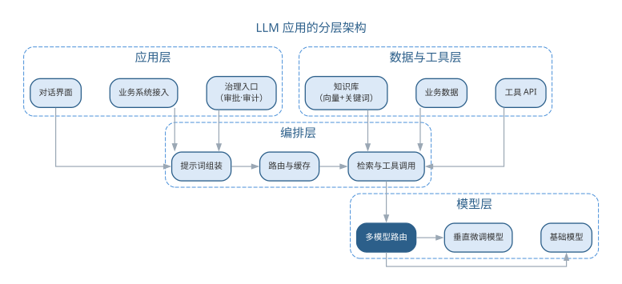
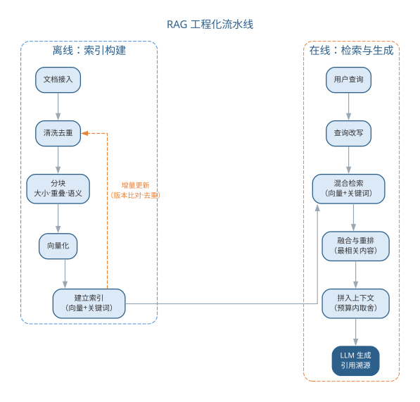
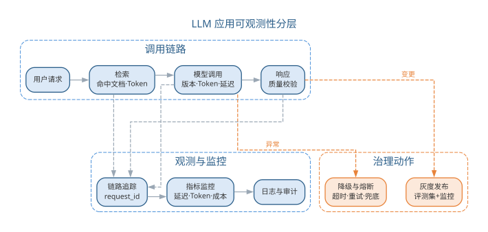

# 大模型应用开发范式

第 17 章把提示词、上下文工程与智能体整合为新的开发范式。本章从"开发范式"推进到"LLM 应用工程"：当大语言模型作为系统的核心部件进入生产，系统的架构、选型、检索、评测与治理随之成为软件工程的新课题。LLM 应用工程的目标，是把"能调通一个模型"升级为"能上线并长期运行一个系统"。本章依次讨论架构模式、模型选型与路由、RAG 工程化、提示词与上下文工程、评测与质量保障、可观测性与成本治理，并以要点与误区、前沿演进收尾；智能体的运行时与多智能体系统则在第 19 章展开。理解本章，需先掌握第 17 章的提示词五要素、RAG 概念与 Token 成本公式。

## LLM 应用系统的架构模式

**LLM 应用（LLM application）**是以大语言模型为智能内核的软件系统：它接收用户的自然语言输入，把任务转化为模型调用，再把生成结果经加工后返回。与普通软件把逻辑写在确定性代码里不同，LLM 应用把"智能"外置于模型调用——同样的输入可能得到不同的输出，系统的行为由提示词与上下文共同决定。按生成逻辑的组织方式，LLM 应用可归纳为四种架构形态：

| 形态 | 结构 | 适用场景 | 关键问题 |
|------|------|----------|----------|
| 单次调用 | 一次请求→一次生成 | 摘要、翻译、分类 | 提示词质量决定输出 |
| 管道编排 | 多步 LLM 调用串联 | 文档处理、信息抽取 | 步骤间错误传递 |
| RAG 增强 | 检索 + 生成 | 知识问答、代码助手 | 检索质量决定上限 |
| 智能体外壳 | LLM + 工具 + 执行循环 | 复杂任务端到端 | 验证与责任归属 |

与传统三层架构（表示层、业务逻辑层、数据层）以"确定性的处理流程"为中心相比，LLM 应用把生成逻辑委托给模型，两者有三点本质差异：

- **状态由用户与上下文承载**：传统应用把状态存于服务端会话或数据库；LLM 应用几乎无内部状态，对话历史、检索结果与约束都放进提示词，由用户或编排层携带——状态管理因此变成上下文管理；
- **输出非确定**：同一输入在不同模型、不同温度、不同版本下输出可能不同，"同样的代码每次行为一致"的假设不再成立，质量必须靠评测与护栏来稳定；
- **成本随 Token 变化**：传统应用成本主要由固定部署决定；LLM 应用每次调用的成本随输入输出 Token 数浮动，治理对象从"资源"变成"Token"。

三者的差异可对照总结如下表所示。

| 对比维度 | 传统三层架构 | LLM 应用 |
|------|------|------|
| 处理中心 | 确定性的业务逻辑 | 模型生成 + 上下文组织 |
| 状态承载 | 服务端会话与数据库 | 用户与上下文携带 |
| 输出行为 | 输入相同则输出相同 | 非确定，依赖温度与版本 |
| 成本模型 | 固定部署成本 | 随 Token 数与模型档位浮动 |
| 测试方式 | 单元测试断言确定结果 | 评测集 + 指标 + 门禁 |

四种形态并非互相排斥，而是层层递进：单次调用最简单，管道把多步生成串联起来，RAG 引入外部知识，智能体外壳再叠加工具与执行循环。选型的原则是从简单开始——能单次调用解决的不引入管道，能检索解决的不引入智能体；复杂度只在该处确有收益时才增加，每加一层都意味着多一处需要评测与维护。

LLM 应用的分层架构如图所示。

{width=85%}

**上下文窗口（context window）**是模型一次能容纳的输入 Token 上限。状态管理必须服从窗口约束：能放进上下文的只是"当前任务最相关"的部分，其余历史以摘要、检索结果或外部存储保留。这一约束把"如何组织上下文"从优化项提升为架构设计的一部分。智能体外壳形态的运行时、工具协议与多智能体协作将在第 19 章详细展开。

## 模型选型、调用与路由治理

模型是 LLM 应用的智能底座，选型决定能力上限。**模型选型（model selection）**需同时考察能力、成本与安全，常用维度如下表所示。

| 维度 | 考察内容 | 评估方式 |
|------|----------|----------|
| 任务能力 | 推理、代码、多语言 | 基准测试 + 业务样例试跑 |
| 成本 | Token 单价、延迟 | 按调用量估算 |
| 开源/闭源 | 可自托管、可审计 vs 托管服务 | 数据合规、部署条件 |
| 安全与合规 | 越狱抵抗、敏感信息、隐私 | 红队测试 + 合规审查 |
| 生态与稳定性 | 版本演进、服务可用性 | 服务协议、版本记录 |

开源模型可自托管、便于审计与二次训练，但部署与运维成本高；闭源模型开箱即用、迭代快，但数据要出域、行为可控性弱。选型不是"越强越好"，而是结合任务难度、成本预算与数据合规综合决策。能力评估应结合业务样例试跑而非只看公开榜单：把核心业务场景做成小评测集，让候选模型各跑一遍，观察输出是否符合真实约束；试跑结果存档，作为后续模型升级时的回归基线。

**多模型路由（routing）**是成本治理的关键手段：把请求按任务难度、质量要求与成本预算分派给不同模型——简单任务用轻量模型，复杂推理用高能力模型，知识类任务优先走检索。路由决策过程如图所示。

{width=55%}

路由的收益来自"按需付费"：真实场景中多数请求是分类、抽取、摘要等常规任务，高能力模型并非每次都必要。路由判定可交给规则（按任务类型、预算上限），也可由轻量模型承担。路由的判定提示词模板如下：

```text
你是任务调度器，根据难度与预算把请求分派给合适的模型：
- 简单任务（分类/抽取/格式化）：model-light，优先走缓存
- 常规任务（摘要/改写/问答）：model-medium
- 复杂任务（推理/多步规划/代码）：model-high
请求：{{任务描述}}
预算上限：{{单次成本上限}}
只输出 { "route": "model-xxx", "reason": "一句理由" }
```

路由策略的取舍如下表所示。

| 策略 | 判定方式 | 适用场景 | 特点 |
|------|----------|----------|------|
| 规则路由 | 按任务类型、预算阈值 | 任务类型稳定 | 确定、可解释、易维护 |
| 缓存优先 | 命中相同或相似请求 | 重复查询占比高 | 零成本、延迟低 |
| 模型路由 | 由轻量模型判定难度 | 任务类型模糊多变 | 灵活，但多一次调用 |

**缓存与配额**控制调用量与重复成本：语义相同或完全相同的请求命中缓存可免去重复生成；按用户、租户或团队设置配额与限流，防止个别调用失控。**降级与熔断**保证可用性：模型服务超时或异常时按预案降级（走缓存兜底、退回较低能力模型、返回预设提示语），连续失败触发熔断，暂停对上游的调用并快速失败。Token 成本治理的总体思路是缓存降重复、路由降单价、压缩降 Token 量，计量基础仍是第 17 章的 Token 成本公式 $C=c_{in}\cdot n_{in}+c_{out}\cdot n_{out}$；成本数据如何监控与回流将在第 6 节结合可观测性展开。

## RAG 应用工程化

第 17 章介绍了 RAG 的概念层（分块、向量检索、融合与重排、上下文预算）。当 RAG 进入生产，这些概念每一项都变成需要量化的工程决策，本节深化其工程化要点。

**分块（chunking）**把长文档切成可供检索的片段，是检索质量的起点。分块策略的选择如下表所示。

| 策略 | 做法 | 适用场景 | 注意 |
|------|------|----------|------|
| 固定大小 | 按固定字数切分 + 重叠 | 通用文档 | 易切断语义 |
| 结构分块 | 按标题、章节切分 | 规范、手册 | 依赖文档结构 |
| 语义分块 | 按语义完整度切分 | 混合型文档 | 计算成本较高 |

块太小则上下文碎片化、召回不全，块太大则噪声多、占用 Token 预算。**重叠（overlap）**让相邻块共享边界信息，缓解切断语义的问题；实践中常结合结构分块与固定大小，兼顾语义完整与索引可控。块的元数据（来源文档、章节路径、版本）应随块一并入库，便于溯源与失效处理。

**混合检索（hybrid retrieval）**同时使用向量检索（语义相近）与关键词检索（精确匹配），再**融合与重排（rerank）**：先由两种方式各取若干候选，再由重排模型对候选按与查询的相关性重新排序，把最相关且去重的若干条送入上下文。重排能显著改善"向量近但语义偏"的误召回，是工程化的常规环节。向量与关键词互补的原因在于两者捕获的信号不同：向量编码"意思相近"，适合语义匹配与同义改写；关键词擅长精确术语——型号、编号、代码标识符与专有名词这类内容向量检索往往记不牢，关键词检索则一次命中。

索引的构建与更新是持续性的：**索引构建**对增量文档做"清洗→分块→向量化→入库"，需去重并失效旧版本；**增量更新**避免每次全量重建，配合文档版本号保证索引与源一致。RAG 工程化的完整流水线如图所示。

{width=65%}

检索质量的量化延续第 17 章：Recall@k 衡量相关文档是否被召回，MRR 衡量首个相关结果是否靠前。重排阶段更常用 **NDCG**（归一化折损累计增益）：它按相关性等级给排序靠前的结果更高权重，并按理想排序归一化，能区分"相关文档都被召回但顺序不对"与"顺序正确"两种情形。评测应覆盖离线指标（在带标注的检索集上计算）与在线观察（用户点击、采纳、追问等），两者结合才能避免"离线很好、线上无效"。检索评测的样例通常组织为"查询—相关文档—期望排序"三元组：离线指标在标注集上计算，可重复、可回归；在线观察则记录点击、采纳与追问，共同回答"检索到底有没有用"。增量更新的常见做法是定时或事件触发：比对文档版本号，只对新文档做清洗、分块与向量化入库，同时删除失效片段并重建对应索引。索引与源文档的版本一致是检索可信的前提，否则会出现"文档明明更新了，系统还在答旧内容"——这类一致性问题要靠版本号与审计记录来保证。

## 提示词与上下文工程深化

第 17 章的提示词五要素是单次交互的指南；生产环境还需要**提示词体系**——把散落的提示词组织为可维护、可版本化的资产。常用体系分层如下表所示。

| 层级 | 内容 | 示例 | 管理方式 |
|------|------|------|----------|
| 基础模板 | 角色、输出格式等通用骨架 | "你是资深工程师…只输出 JSON" | 全应用共用 |
| 场景模板 | 绑定具体任务的变体 | 需求分析、缺陷定位提示词 | 按场景注册 |
| 版本记录 | 变更、生效时间与效果 | v1.2 增加自检要求 | 版本化 + 评测回归 |

**模板注册与变量**是体系化的抓手：模板用 {{变量}} 占位符参数化（任务描述、检索上下文、业务约束），存入模板库登记版本与适用场景；运行时由编排层填充变量，而非每次手工拼写。模板的版本与评测结果在注册表中留存，某场景模板回退时可快速切换旧版本；新场景尽量从既有模板派生，减少从零编写。一个带占位符的场景模板如下：

```text
你是本业务的{{角色}}，请基于以下上下文完成任务：
上下文：{{检索到的相关内容}}
任务：{{任务描述}}
约束：{{格式与边界要求}}
要求：只使用上下文中的信息作答；不确定时明确说明；按格式输出。
```

**上下文压缩与结构化**解决窗口有限与信息密度两大问题：

- **摘要**（summarization）：把过长历史或文档压缩成要点，保留关键信息腾出预算；
- **剪枝**（pruning）：按相关性与时间剔除低价值内容，只保留任务所需片段；
- **结构化输出**：用 JSON Schema 等约束输出格式，把自由文本固化为程序可用的结构。

三种手段的取舍如下表所示。

| 手段 | 做法 | 主要代价 | 典型适用 |
|------|------|----------|----------|
| 摘要 | 压缩为要点 | 丢失细节 | 长对话历史 |
| 剪枝 | 剔除低价值片段 | 可能误删信息 | 检索结果取舍 |
| 结构化输出 | 约束输出格式 | 需维护 Schema | 程序对接下游 |

压缩的对象既包括对话历史，也包括检索结果与长文档；选择哪种手段，取决于"信息密度"与"完整性"之间的平衡——摘要换取空间，剪枝换取聚焦，结构化换取可用。

上下文压缩的摘要提示词如下：

```text
请把以下对话压缩为 200 字以内的摘要，保留：已确认的需求、
尚未解决的问题、下一步动作。不得新增对话中不存在的信息。
对话记录：{{对话历史}}
```

**上下文版本管理与评测回归**是治理层：提示词、检索配置与压缩策略都是系统行为的一部分，改动任何一项都应登记版本，并用评测集回归（见下节），防止"模型升级或提示词微调导致行为漂移"。上下文工程把"提示词"从一次性文本升级为受控资产，这正是第 17 章"上下文组织能力成为核心技能"的落地。提示词体系的建设通常从"沉淀"开始：先记录每次有效修改的原因与效果，再抽象为模板与变量；体系化不是为了流程而流程，而是让"这次为什么改提示词"有据可查、可复现。

## LLM 应用的评测与质量保障

LLM 应用质量的核心难题是"没有确定的期望输出"。**评测集（evaluation set）**因此成为质量基准：一组覆盖业务场景、带期望答案或评分标准的输入，用来系统性检验系统行为。模型能力评测已在第 16 章讨论，本章聚焦应用层评测。评测集构建的三个要点：

- **覆盖业务场景**：按用户真实使用路径抽样，含主流程与边界情形，避免只在"顺手样本"上评测；
- **难度分层**：把样本按简单、中等、困难分层，既能看整体水平，也能定位薄弱环节；
- **防污染**：评测样本不得出现在模型的训练数据与检索库中，否则结果虚高——评测集要版本化、独立维护，定期补充线上新问题。

评测集的规模视业务复杂度而定，关键是覆盖与分层而非数量；它应随线上问题沉淀而持续增长，并定期抽样人工复核标注质量，防止标注本身引入偏差。

**多维指标**衡量不同维度的质量，如下表所示。

| 指标 | 关注点 | 常用做法 |
|------|--------|----------|
| 事实性（factuality） | 输出与事实是否一致 | 与权威来源核对 |
| 忠实度（faithfulness） | 输出是否忠于给定上下文 | 检查是否超出上下文作答 |
| 相关性（relevance） | 是否回答用户所问 | 人工或模型打分 |
| 安全性（safety） | 是否输出有害内容 | 红队测试 + 护栏 |

忠实度与事实性方向不同：忠实度管"不编造上下文之外的东西"，事实性管"不输出与事实相悖的内容"。对开放性任务，常用**裁判模型（LLM-as-judge）**按评分标准打分，但裁判本身也有偏好，需抽样人工复核校准。裁判评分还需缓解位置偏差与长度偏差（倾向先出现或更长的答案），可通过打乱候选顺序、多次采样取众数等方式抑制。裁判评测提示词模板如下：

```text
你是评测员，请按以下标准为回答打分（1-5）：
- 忠实度：是否只使用给定上下文的信息
- 相关性：是否准确回答用户问题
- 完整性：关键信息是否缺失
上下文：{{检索内容}}
问题：{{用户提问}}
回答：{{系统输出}}
输出 JSON：{ "faithfulness": 分数, "relevance": 分数, "comment": "评语" }
```

**基准与红队测试**补充边界视角：基准（benchmark）用公开或自建任务集横向对比模型与系统版本；红队（red team）主动构造对抗样本（越狱、提示注入、误导性提问）检验安全底线。**输出护栏（guardrail）**在生成前后加闸：内容过滤拦截有害、敏感输出，敏感信息检测防止泄露隐私，格式约束保证输出可被下游解析，护栏失败时走兜底回复。评测的执行应自动化并纳入发布流程：评测集→批量执行→指标计算→对比基线→门禁判定→发布或回滚，任何指标回退都阻断发布，使"评测即回归测试"从口号变成工程事实。护栏分三层布设，如下表所示。

| 布设层 | 拦截对象 | 失败处理 |
|--------|----------|----------|
| 输入端 | 提示注入、恶意指令 | 拒绝或改写后进入 |
| 输出端 | 有害、违规内容 | 拦截并走兜底回复 |
| 业务层 | 敏感信息、格式错误 | 脱敏、重试或校验 |

评测在 LLM 应用工程中的定位是"**评测即回归测试**"：正如传统软件每次改动用测试套件回归，LLM 应用每次修改（提示词、模型、检索配置、压缩策略）都用评测集回归——评测集就是 LLM 应用的回归套件，评测是否通过构成发布门禁。评测体系如图所示。

{width=80%}

## LLM 应用的可观测性与成本治理

传统软件的观测手段（日志、指标、链路追踪）在 LLM 应用中仍然适用，但观测对象扩展到模型调用。**链路追踪**记录一次用户请求的完整轨迹——请求→检索→模型调用→响应，并记录每个环节的关键信息：检索命中了哪些文档、发送了多少 Token、模型输出了什么、是否触发降级。有了轨迹，"模型为什么给出这个答案"才可回溯，故障排查与责任追溯才有依据。每一步还应记录时间戳、Token 数、模型版本、重试次数与降级标记，形成可回放的调用明细；这类明细按 request_id 聚合，即得一次请求的成本与延迟全貌，是成本归因的最小单元。

**监控指标**分三类：性能（延迟、超时率）、资源（Token 用量、缓存命中率）与成本（每请求成本、累计成本）。成本监控是第 2 节路由与缓存治理的闭环反馈——真实用量数据回传给路由策略与配额设置，形成"监控→治理→再监控"的循环。监控指标的分类如下表所示。

| 类别 | 指标 | 用途 |
|------|------|------|
| 性能 | 延迟、超时率、重试率 | 判断服务是否健康 |
| 资源 | Token 用量、缓存命中率 | 优化上下文与缓存配置 |
| 成本 | 每请求成本、累计成本 | 治理预算与路由策略 |

链路追踪还应携带 request_id，把一次请求贯穿检索、模型调用与业务日志，使故障定位从"猜测"变为"查询"。可观测性分层如图所示。

{width=85%}

**降级与容错**是生产可用性的保障：调用模型设置超时与重试（重试指数退避），失败时按预案降级——缓存兜底、退回较低能力模型、或返回预设提示语；连续失败触发熔断，避免对不可用上游的无效重试拖垮自身。降级的优先序通常为"缓存兜底→降档模型→预设文案"，优先级越高成本越低但质量也越低，取舍由业务对质量的容忍度决定；熔断恢复后要逐步放量而非瞬间全开。**灰度发布**让变更可控：先让小比例流量使用新模型或新提示词，对比评测集结果与线上指标，确认无回归再逐步放量，异常时快速回滚。放量的节奏通常按百分比分档扩大，并在每个档位同时观察评测集指标与线上监控，使灰度、评测与监控共同构成"发布三道闸"。可观测性最终服务于两件事：让成本可解释、让故障可追溯——二者都是工程负责人必须向业务方讲清的问题。降级策略的设计原则是"用户始终能拿到一个可用的结果"——即使不是最佳答案，也不让请求悬挂或报错；同时兜底结果要可区分，明确标注"缓存内容"或"降级回复"，避免用户把兜底当作实时答案，也让监控能准确统计降级比例——降级比例是判断模型服务健康的重要信号。

### LLM 应用工程的要点与误区

LLM 应用工程延续全书"人机协同、验证优先"的立场。常见误区如下表所示。

| 误区 | 典型表现 | 应对要点 |
|------|----------|----------|
| 只调通不管评测 | 上线前未建立评测集 | 以评测集为回归套件、发布门禁 |
| 追求单一最强模型 | 所有请求都用高能力模型 | 多模型路由，按难度与成本分派 |
| 索引建完不管更新 | 索引与文档源脱节 | 增量更新 + 版本一致 |
| 忽略成本与降级 | 成本失控、上游故障即雪崩 | Token 监控 + 超时、重试、兜底 |
| 升级不回归 | 更换模型后行为漂移 | 升级即回归：重跑评测集 + 灰度 |

要点在于把工程纪律平移进 LLM 应用：架构上做好分层与路由，数据上管好检索与上下文，质量上以评测集回归，运维上以可观测与降级兜底。这些误区共同指向一个判断：模型能力不等于系统质量——系统质量取决于提示词、检索、护栏、评测与治理的组合，而这些都在人的工程控制之内。模型负责生成，而"系统是否可靠、成本是否可控、答案是否可信"由人负责——LLM 应用工程是人在管理不确定性。

### 前沿演进：长上下文、多模态与模型迭代

前沿演进围绕三个方向展开，如下表所示。

| 方向 | 变化 | 对工程的影响 |
|------|------|--------------|
| 长上下文 | 上下文窗口容量持续增大 | 简化摘要与剪枝，或催生新的压缩技术 |
| 多模态 | 文本、图像、音频统一处理 | 输入输出与评测样本扩展到多模态 |
| 模型迭代 | 基础模型快速升级换代 | 版本评测、灰度发布成为常态 |

长上下文并不自动带来高质量——窗口大是容量，上下文内"有效信息密度"才是质量，检索与压缩不会消失，只是换一种形式。多模态把评测、护栏与成本治理从"文本 Token"扩展到"图像、音频 Token"，选型与合规维度随之变化。模型迭代加快意味着"升级即回归"：每次换模型或升级版本，都要重新跑评测集并灰度验证。面对快速迭代，工程上常采用"多版本并存"策略：按版本注册模型、存档路由配置与评测结果，使某一版本质量回退时能快速切回已知良好版本，退役旧版本同样要过评测与灰度。长上下文与多模态的到来不改变工程本质，只是把"上下文与评测"的粒度从文本扩展到多模态——无论前沿如何演进，"验证优先、人机协同"的工程立场不变，LLM 应用工程始终要回答"系统在真实场景下是否可靠"。

## 本章小结

LLM 应用工程把大语言模型从"能调通的 API"升级为"能上线、长期运行的系统"。本章讨论四种架构形态与状态、输出、成本的非确定性；选型与路由让能力与成本匹配；RAG 工程化把分块、混合检索与重排落到实处；提示词与上下文工程把提示词与压缩策略升级为受控资产；评测即回归、可观测与降级容错构成质量防线。模型负责生成，可靠性、成本与可信度由人负责，验证优先贯穿始终。

**思考与讨论：**
1. 为什么说 LLM 应用的质量问题主要是上下文问题？请用一个具体场景说明。
2. 若你的团队要上线一个文档问答应用，评测集应当如何构建才能防止"看起来好用、实际上不可靠"？
3. 多模型路由能降低多少成本取决于什么？请结合 Token 成本公式分析。
